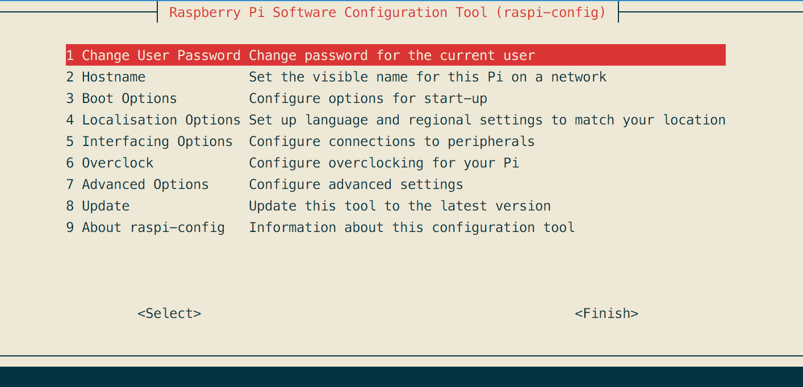
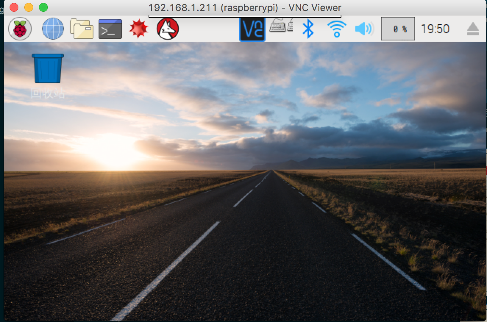

#### 连接树莓派
在烧录完成后，在Boot的根目录新建一个名为SSH的无扩展名的空文件

把 Pi 连接到路由器上，开机
>默认账户：__pi__    
>默认密码 ：__raspberry__
```bash
ssh pi@raspberrypi.local
# 或者使用ip
# ssh pi@X.X.X.X
# 可以使用 arp -a 查看
```


#### 配置wifi
```bash
sudo apt-get install vim
sudo vim /etc/wpa_supplicant/wpa_supplicant.conf
```
因为可能会带到公司玩，所以配置了2个wifi
```bash
network={
	ssid="ASUS-516"
	psk="xxxxx"
	priority=5
}
network={
	ssid="JinYi"
	psk="xxxxx"
	priority=4
}
```
配置完成后 `sudo reboot` 重启设备

__直接配置无线，在sd卡的boot目录中新建    `wpa_supplicant.conf`__
```bash
trl_interface=DIR=/var/run/wpa_supplicant GROUP=netdev
update_config=1
country=CN

network={
	ssid="ASUS-516"
	psk="ABCDE89123456"
	priority=5
}
network={
	ssid="JinYi"
	psk="wmwlap01"
	priority=4
}
```
#####使用 VNC
输入 `sudo raspi-config` 即进入的配置模式，罗列了扩展系统分区，修改密码，启动设置等等。要开启 VNC，需要 Interfacing Options

    


之中就可以使用 vnc viewer 连接   


