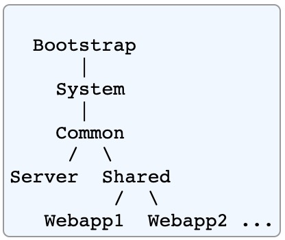
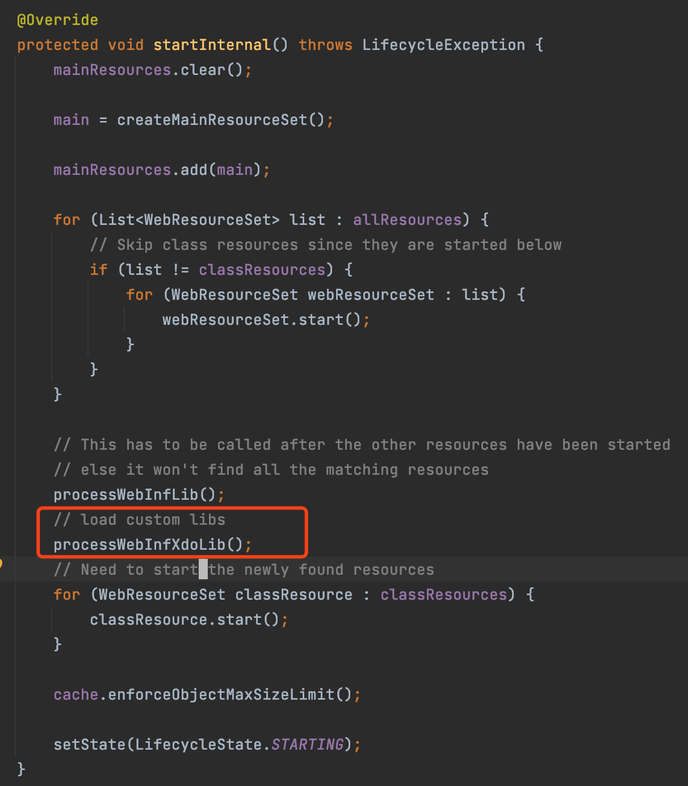

# Tomcat为什么要违背双亲委托机制

## 什么是双亲委托机制

指当一个类加载器收到一个类加载请求时，该类加载器首先会把请求委派给父类加载器。 每个类加载器都是如此，只有在父类加载器在自己的搜索范围内找不到指定类时，子类加载器才会尝试自己去加载。


## Tomcat的类加载机制



* **Bootstrap** 这个类加载器包含 Java 虚拟机提供的基本运行时类，以及系统扩展目录 ($JAVA_HOME/jre/lib/ext) 中存在的 JAR 文件中的任何类。 注意：一些 JVM 可能将其实现为多个类加载器，或者它可能根本不可见（作为类加载器）。 
* **System** 这个类装入器通常是从CLASSPATH环境变量的内容初始化的。所有这些类对Tomcat内部类和web应用程序都是可见的。但是，标准的 Tomcat 启动脚本（$CATALINA_HOME/bin/catalina.sh 或 %CATALINA_HOME%\bin\catalina.bat）完全忽略了 CLASSPATH 环境变量本身的内容，而是从以下存储库构建系统类加载器：
  * **$CATALINA_HOME/bin/bootstrap.jar** 包含用于初始化Tomcat服务器的main()方法，以及它所依赖的类装入器实现类。
  * **$CATALINA_BASE/bin/tomcat-juli.jar** or **$CATALINA_HOME/bin/tomcat-juli.jar** 日志实现类。其中包括`java.util.logging` API的增强类，称为Tomcat JULI，以及Tomcat内部使用的Apache Commons Logging库的重命名副本。
  * **$CATALINA_HOME/bin/commons-daemon.jar** 来自Apache Commons Daemon项目的类。这个JAR文件不在catalina.bat|.sh脚本构建的CLASSPATH中，而是从bootstrap.jar的清单文件中引用。
* **Common** 加载`common.loader`(`conf/catalina.properties`)下的classes文件、资源文件和jar包，这些类对Tomcat内部类和所有Web应用程序都是可见的。
* **Server** 加载`server.loader`(`conf/catalina.properties`)下的classes文件、资源文件和jar包, 只对Tomcat内部可见，而对web应用程序完全不可见。
* **Shared** 加载`shared.loader`(`conf/catalina.properties`)下的classes文件、资源文件和jar包，对所有web应用程序可见，并可用于在所有web应用程序之间共享代码。但是，对此共享代码的任何更新都需要Tomcat重新启动
* **WebappX** 单个Tomcat实例中的每个Web应用程序创建的类加载器。加载Web应用程序的/Web-INF/Class目录中的所有未打包类和资源，再加上Web应用程序/Web-INF/lib目录下JAR文件中的类和资源，对此web应用程序都是可见的，而对其他类则不可见。


## Tomcat 为什么要违背双亲委托机制

* 双亲委托机制不能满足tomcat的业务需求。Webapp类加载器需要独立加载自身的class以及依赖的jar。例如webapp1依赖的spring版本为4.x，另一个依赖的spring版本为5.x. 如果使用双亲委托，那么spring的版本只能存在一个，没法满足这个需求。

* tomcat 自身依赖的jar可能和项目依赖的jar有重合的地方，比如servlet.jar, 此时优先webapp的jar加载


## WebappClassLoader 加载class 的过程

加载指定名称的类，使用以下算法搜索，直到找到并返回该类。如果不能找到该类，则返回ClassNotFoundException。

1. 调用 `findLoadedClass(String) ` 检查 class 是否已经被加载。如果已经加载，则返回相同的Class对象。

2. 如果`context.xml#<Loader delegate="true" />`属性被设置为真，如果有的话，则调用父类加载器的loadClass()方法。
3. 调用 `findClass()`来在我们本地定义的资源库中找到这个类。
4. 如果有的话，调用我们父类加载器的`loadClass()`方法。

如果使用上述步骤找到了这个类，并且`resolve`标志为真，那么这个方法将对产生的Class对象调用`resolveClass(Class)`。

代码在`org.apache.catalina.loader.WebappClassLoaderBase#loadClass`


# 修改Tomcat源码使WebAppLoader能加载外部Lib

1. 下载Tomcat源码，准备开发环境

	1. 安装ant工具

	2. 下载tomat源码

   ```bash
   cd ${tomcat.source}
   # 准备开发环境
   # 如果是eclipse 
   ant ide-eclipse
   # 如果是intellij
   ant ide-intellij 
   # 编译源码
   ant
   ```
   
2. 修改catalina包

   `org/apache/catalina/webresources/StandardRoot.java`

   ```java
   /***
   * loader xdo custom libs
   * @throws LifecycleException
   */
   protected void processWebInfXdoLib() {
   	WebResource webResource = getResource("/WEB-INF/classes/application.properties", false, false);
     if (webResource.exists() && webResource.isFile()) {
       try {
         Properties properties = new Properties();
         properties.load(webResource.getInputStream());
         String xdoLibs = properties.getProperty("xdo.libs");
         log.info("xdo lib value: " + xdoLibs);
         if (xdoLibs == null || "".equals(xdoLibs.trim())) {
           return;
         }
         String[] libsArray = xdoLibs.split(",");
         for (String lib : libsArray) {
           File file = new File(lib);
           if (file.isDirectory()) {
             List<File> fileList = Arrays.stream(file.listFiles())
               .filter(it -> it.getName().endsWith(".jar")).collect(Collectors.toList());
             log.info("xdo lib: " + lib + " size: " + fileList.size());
             for (File jarFile : fileList) {
               createWebResourceSet(ResourceSetType.CLASSES_JAR,
                                    "/WEB-INF/classes", jarFile.toURI().toURL(), "/");
             }
           }
         }
       }catch (IllegalArgumentException | IllegalStateException ex) {
         log.info("xdo not load application.properties. \n" + ex.getMessage());
       } catch (IOException ex) {
         log.error("xdo custom loader jar error!", ex);
       }
   }
   ```
   
   `org/apache/catalina/webresources/StandardRoot.java`
   
   
   
   `org/apache/catalina/loader/WebappClassLoaderBase.java`
   
   ```java
   /**
        * Start the class loader.
        *
        * @throws LifecycleException if a lifecycle error occurs
        */
   @Override
   public void start() throws LifecycleException {
   
     state = LifecycleState.STARTING_PREP;
   
     WebResource[] classesResources = resources.getResources("/WEB-INF/classes");
     for (WebResource classes : classesResources) {
       if (classes.isDirectory() && classes.canRead()) {
         localRepositories.add(classes.getURL());
       }
     }
     WebResource[] jars = resources.listResources("/WEB-INF/lib");
     for (WebResource jar : jars) {
       if (jar.getName().endsWith(".jar") && jar.isFile() && jar.canRead()) {
         localRepositories.add(jar.getURL());
         jarModificationTimes.put(
           jar.getName(), Long.valueOf(jar.getLastModified()));
       }
     }
   
   	WebResource resource = resources.getResource("/WEB-INF/classes/application.properties");
     if (resource.exists() && resource.isFile()) {
       try {
         Properties properties = new Properties();
         properties.load(resource.getInputStream());
         String xdoLibs = properties.getProperty("xdo.libs");
         if (xdoLibs != null && !"".equals(xdoLibs.trim())) {
           String[] libsArray = xdoLibs.split(",");
           for (String lib : libsArray) {
             File file = new File(lib);
             if (file.isDirectory()) {
               List<File> fileList = Arrays.stream(file.listFiles())
                 .filter(it -> it.getName().endsWith(".jar")).collect(Collectors.toList());
               log.info("xdo lib: " + lib + " size: " + fileList.size());
               for (File jarFile : fileList) {
                 localRepositories.add(jarFile.toURI().toURL());
               }
             }
           }
         } else {
           log.info("not setting xdo loader");
         }
       } catch (IllegalArgumentException | IllegalStateException ex) {
         log.info("xdo not load application.properties. \n" + ex.getMessage());
       } catch (IOException ex) {
         log.error("xdo loader jar error!", ex);
       }
     }
   
     state = LifecycleState.STARTED;
   }
   ```


# 修改项目，打包时分离LIb

## bootWar

```groovy
task clearLib(type: Delete) {
    delete "$buildDir/libs/lib"
}

task copyLib(type: Copy) {
    from configurations.compileClasspath
  	// 这边的关系跟bootWar中的是反的，如果war中排出，这边就需要包含，如果war是包含，这边就需要排出
//    exclude("*xdo*.jar")
//    include("*.jar")
    into "$buildDir/libs/lib"

    from configurations.runtimeClasspath
    into "$buildDir/libs/lib"
}

bootWar {

//    rootSpec.include("*xdo*.jar")
  	// 指定排除的jar包
    rootSpec.exclude("*.jar")

    // lib目录的清除和复制任务
    dependsOn clearLib
    dependsOn copyLib
}
```


## bootJar

```groovy
// 清除lib
task clearLib(type: Delete) {
    delete "$buildDir/libs/lib"
}

// 拷贝lib
task copyLib(type: Copy) {
    from configurations.compileClasspath
    into "$buildDir/libs/lib"
}

bootJar {
    excludes = ["*.jar"]

    // lib目录的清除和复制任务
    dependsOn clearLib
    dependsOn copyLib

    // 指定依赖包的路径，运行时不再需要指定 java.ext.dir 或 loader.path 参数。
    manifest {
        attributes "Manifest-Version": 1.0,
                'Class-Path': configurations.compileClasspath.files.collect { "lib/$it.name" }.join(' ')
    }
}
```

> 这种不需要修改tomcat，直接打包即可

# 参考

https://tomcat.apache.org/tomcat-9.0-doc/class-loader-howto.html

https://tomcat.apache.org/tomcat-9.0-doc/building.html


