#  简介

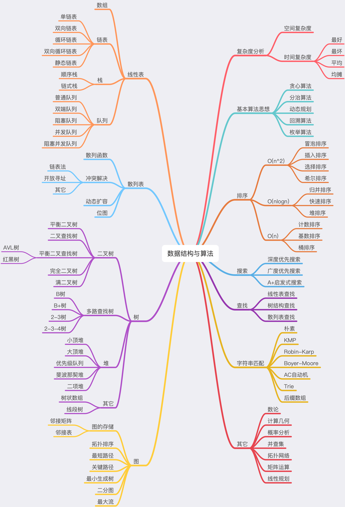


# 复杂度分析

* $$O(1)$$ 常数复杂度(Constant Complexity)
* $$O(log n)$$ 对数复杂度(Logarithmic Complexity)
* $$O(n)$$ 线性时间复杂度(Linear Complexity)
* $$O(n^2)$$ 平方(N square Complexity)
* $$O(n^3)$$ 立方(N square Complexity)
* $$O(2^n)$$ 指数(Exponential Growth)
* $$O(n!)$$ 阶乘(Factorial)

## 大O复杂度表示法

*所有代码的执行时间 T(n) 与每行代码的执行次数 n 成正比*

$$T(n)=O(f(n))$$

$$T(n)$$ 代码执行的时间, $$n$$ 数据规模的大小, $$f(n)$$ 表示每行代码执行的次数总和, $$O$$ 表示代码的执行时间 T(n) 与 f(n) 表达式成正比


## 时间复杂度分析

### 1. 只关注循环执行次数最多的一段代码

### 2. 加法法则：总复杂度等于量级最大的那段代码的复杂度

### 3. 乘法法则：嵌套代码的复杂度等于嵌套内外代码复杂度的乘积


## 几种常见的时间复杂度实例分析

### $O(1)$

只要算法中不存在循环语句、递归语句，即使有成千上万行的代码，其时间复杂度也是Ο(1)

```java
int n = 1000;
System.out.println("hi," + n)
```

### $O(n)$

```java
for (int i = 1; i <= n; i++) {
  System.out.println("hi," + i)
}
```

### $O(n^2)$

```bash
for (int i = 1; i <= n; i++) {
	for (int j = 1; j <= n; j++) {
		System.out.println("hi, i " + i + " and y " + y)
	}
}
```

### $O(k^n)$

```java
for (int i = 1; i <= Math.pow(2, n); i++) {
  System.out.println("hi, " + i)
}
```

### $O(n!)$

```java
for (int i = 1; i <= factorial(n); i++) {
  System.out.println("hi, " + i)
}
```

### O(logn)、O(nlogn)

```c
// 例子1
for (int i = 1; i < n; i = i * 2) {
  System.out.println("hi," + i)
}

// 例子2
i=1;
while (i <= n)  {
  i = i * 3;
}

```

例子1的时间复杂度 $$O(log_2n)$$， 例子2的时间复杂度为$$O(log_3n)$$，不管是以 2 为底、以 3 为底，还是以 10 为底，我们可以把所有对数阶的时间复杂度都记为 O(logn)

$log_3n=log_32*log_2n$
$C=log_32$
$O(log_3n)=O(C*log_2n)$
$O(Cf(n))=O(f(n))$


如果一段代码的时间复杂度是 O(logn)，我们循环执行 n 遍，时间复杂度就是 O(nlogn) 了。而且，O(nlogn) 也是一种非常常见的算法时间复杂度。比如，归并排序、快速排序的时间复杂度都是 O(nlogn)。

>  **换底公式**
> $log_ab=\frac{log_cb}{log_ca} \qquad (c>0 \ c\neq1)$
> **证明**
> 设 $log_ab=x$
> $b = a^x$
> $log_cb=log_ca^x$
> $log_cb=xlog_ca$
> $x=\frac{log_cb}{log_ca}$


$log_3n=log_32*log_2n$ 

$log_32=\frac{log_2n}{log_3n}$


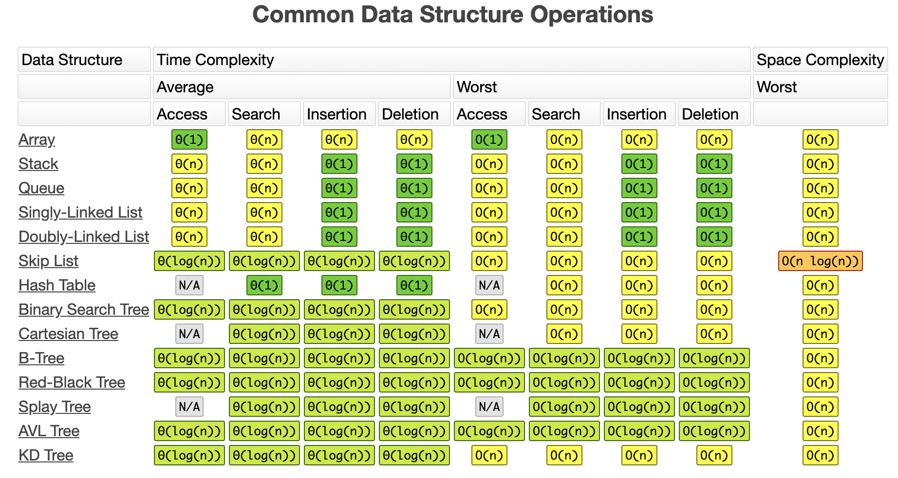

> https://www.bigocheatsheet.com/

# 数组 Array

数组数据结构（array data structure），简称数组（Array），是由相同类型的元素（element）的集合所组成的数据结构，分配一块连续的内存来存储。利用元素的索引（index）可以计算出该元素对应的存储地址。


# 链表

链表（Linked list）是一种常见的基础数据结构，是一种线性表，但是并不会按线性的顺序存储数据，而是在每一个节点里存到下一个节点的指针(Pointer)。由于不必须按顺序存储，链表在插入的时候可以达到O(1)的复杂度，比另一种线性表顺序表快得多，但是查找一个节点或者访问特定编号的节点则需要O(n)的时间，而顺序表相应的时间复杂度分别是O(logn)和O(1)。

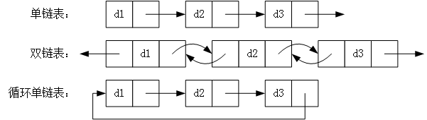


# 堆栈 Stack

堆栈（英语：stack）又称为栈或堆叠，是计算机科学中的一种抽象数据类型，只允许在有序的线性数据集合的一端（称为堆栈顶端，英语：top）进行加入数据（英语：push）和移除数据（英语：pop）的运算。因而按照后进先出（LIFO, Last In First Out）的原理运作。

常与另一种有序的线性数据集合队列相提并论。

堆栈常用一维数组或链表来实现。


# 队列 Queue

队列是线性表的一种，在操作数据元素时，和栈一样，有自己的规则：使用队列存取数据元素时，数据元素只能从表的一端进入队列，另一端出队列。


# 排序

## 选择排序(Selection)

首先，找到数组中最小的那个元素，其次，将它和数组的第一个元素交换位置（如果第一个元素就是最小元素那么它就和自己交换）。再次，在剩下的元素中找到最小的元素，将它与数组的第二个元素交换位置。如此往复，直到将整个数组排序。

### 特点

* 运行时间和输入无关 为了找出最小的元素而扫描一遍数组并不能为下一遍扫描提供什么信息。一个已经有序的数组或是主键全部相等的数组和一个元素随机排列的数组所用的排序时间竟然一样长！
* 数据移动是最少的。每次交换都会改变两个数组元素的值，因此选择排序用了次交换——交换次数和数组的大小是线性关系

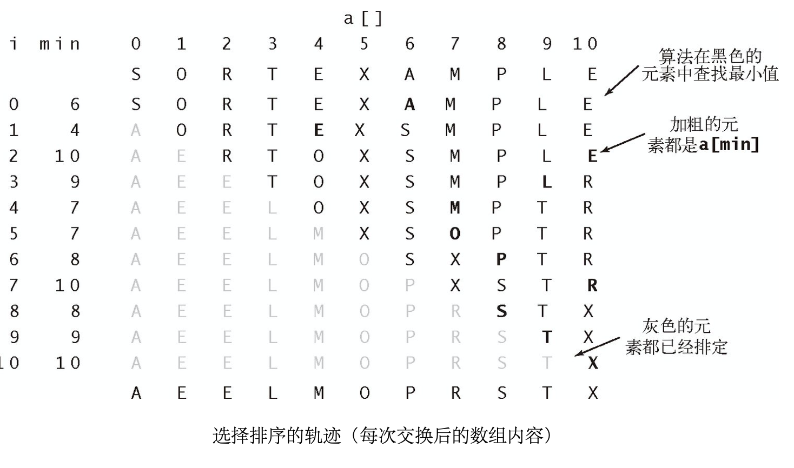


## 插入排序(Insertion)

取未排序区间中的元素，在已排序区间中找到合适的插入位置将其插入，将其余所有元素在插入之前都向右移动一位。并保证已排序区间数据一直有序。重复这个过程，直到未排序区间中元素为空，算法结束。

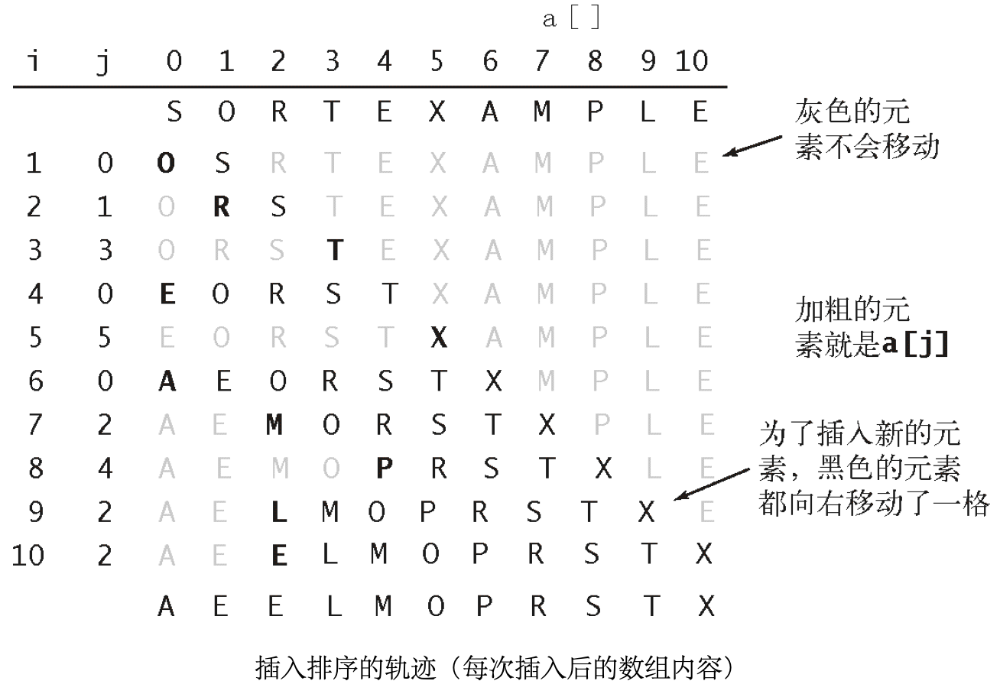


## 希尔排序(Shell)

希尔排序的思想是使数组中任意间隔为h的元素都是有序的。这样的数组被称为h有序数组。换句话说，一个h有序数组就是h个互相独立的有序数组编织在一起组成的一个数组。在进行排序时，如果h很大，我们就能将元素移动到很远的地方，为实现更小的h有序创造方便。用这种方式，对于任意以1结尾的h序列，我们都能够将数组排序

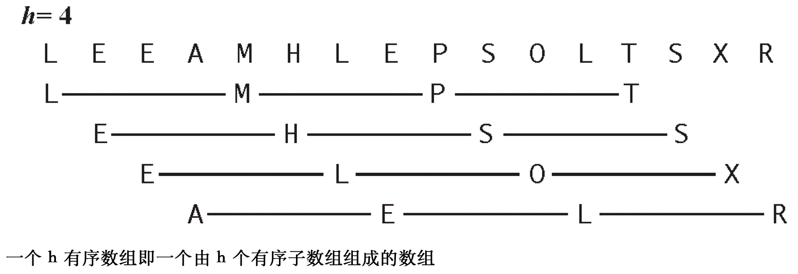

An example run of Shellsort with gaps 5, 3 and 1 is shown below.

| Input data      | 62   | 83   | 18   | 53   | 07   | 17   | 95   | 86   | 47   | 69   | 25   | 28   |
| --------------- | ---- | ---- | ---- | ---- | ---- | ---- | ---- | ---- | ---- | ---- | ---- | ---- |
| After 5-sorting | 17   | 28   | 18   | 47   | 07   | 25   | 83   | 86   | 53   | 69   | 62   | 95   |
| After 3-sorting | 17   | 07   | 18   | 47   | 28   | 25   | 69   | 62   | 53   | 83   | 86   | 95   |
| After 1-sorting | 07   | 17   | 18   | 25   | 28   | 47   | 53   | 62   | 69   | 83   | 86   | 95   |

[参考理解](https://www.cs.usfca.edu/~galles/visualization/ComparisonSort.html)


## 归并排序(Merge)

将一个数组排序，可以先（递归地）将它分成两半分别排序，然后将结果归并起来。归并排序最吸引人的性质是它能够保证将任意长度为$N$的数组排序所需时间和$NlogN$成正比；它的主要缺点则是它所需的额外空间和$N$成正比。

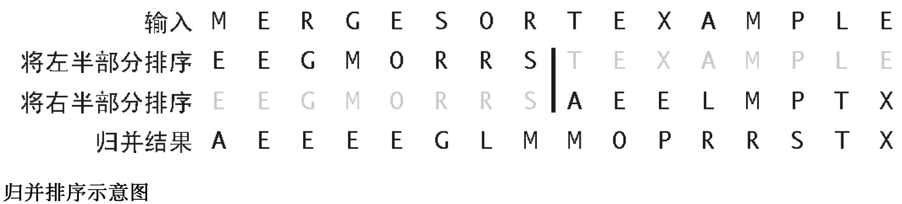


# 缓存算法（页面置换算法）

* FIFO（First In，First Out）先进先出策略 
* LFU（Least Frequently Used）最少使用策略
* LRU（Least Recently Used）最近最少使用策略


# Tree

## Merkle Tree

Merkle Tree，通常也被称作Hash Tree，顾名思义，就是存储hash值的一棵树。Merkle树的叶子是数据块(例如，文件或者文件的集合)的hash值。非叶节点是其对应子节点串联字符串的hash。

Merkle Tree的主要作用是当我拿到Top Hash的时候，这个hash值代表了整颗树的信息摘要，当树里面任何一个数据发生了变动，都会导致Top Hash的值发生变化。

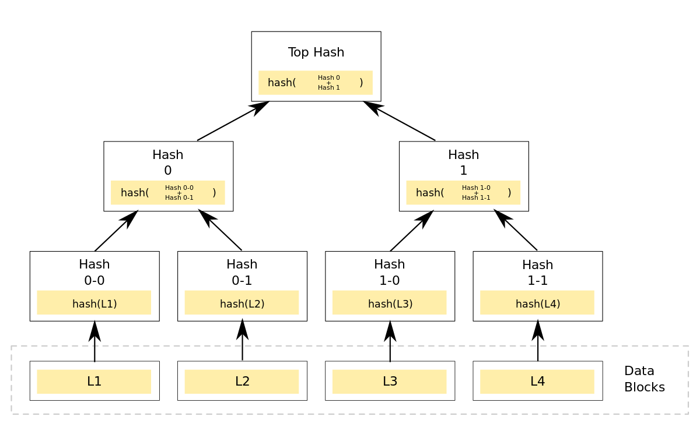


## Trie Tree

Trie树，又称字典树，单词查找树或者前缀树，是一种用于快速检索的多叉树结构，如英文字母的字典树是一个26叉树，数字的字典树是一个10叉树。

Trie树的基本性质可以归纳为：

- 根节点不包含字符，除根节点以外每个节点只包含一个字符。
- 从根节点到某一个节点，路径上经过的字符连接起来，为该节点对应的字符串。
- 每个节点的所有子节点包含的字符串不相同。


## MPT Tree

> 一种经过改良的、融合了**默克尔树和前缀树**两种树结构优点的数据结构，以太坊中，MPT是一个非常重要的数据结构，在以太坊中，帐户的交易信息、状态以及相应的状态变更，还有相关的交易信息等都使用MPT来进行管理，其是整个数据存储的重要一环。交易树，收据树，状态树都是采用的MPT结构。

1. 存储任意长度的key-value键值对数据；
2. 提供了一种快速计算所维护数据集哈希标识的机制；
3. 提供了快速状态回滚的机制；
4. 提供了一种称为默克尔证明的证明方法，进行轻节点的扩展，实现简单支付验证；


# 限流算法

## 令牌桶算法
令牌桶算法是一个存放固定容量令牌的桶，按照固定速率往桶里添加令牌

- 假设限制速率为2r/s，则按照500毫秒的速率往令牌桶添加令牌
- 令牌桶最多存放b个令牌，当桶满的时候，新的令牌会被抛弃或拒绝
- 当一个n个字节大小的数据包到达，将从桶中删除n个令牌，接着发送数据包到网络上
- 如果桶中的流量不足n个，则不会删除令牌，该数据将被限流（要么丢弃，要么缓存）


## 漏桶算法
漏桶算法是网络世界中流量整形（Traffic Shaping）或速率限制（Rate Limiting）时经常使用的一种算法
- 一个固定容量的漏桶，按照常量固定速率流出水滴
- 如果桶是空的，则不需要流出水滴
- 可以以任意速率流入水滴到漏桶
- 如果流出水滴超出了桶的容量，则流入的水滴溢出（被丢弃），则漏桶的容量是不变的


# 共识算法

共识是对某个提案(proposal)达成一致意见的过程，分布式系统中提案的含义十分宽泛，包括事件发生顺序、谁是leader等。区块链系统中，共识是各个共识节点对交易执行结果达成一致的过程。

## 共识算法分类

### CFT类算法

普通容错类算法，当系统出现网络、磁盘故障，服务器宕机等普通故障时，仍能针对某个提议达成共识，经典的算法包括Paxos、Raft等，这类算法性能较好、处理速度较快、可以容忍不超过一半的故障节点

### BFT类算法

拜占庭容错类算法，除了容忍系统共识过程中出现的普通故障外，还可容忍部分节点故意欺骗(如伪造交易执行结果)等拜占庭错误，经典算法包括PBFT等，这类算法性能较差，能容忍不超过三分之一的故障节点。

## Paxos

**Paxos算法**是[莱斯利·兰伯特](https://zh.wikipedia.org/wiki/莱斯利·兰伯特)（Leslie Lamport）于1990年提出的一种基于消息传递且具有高度容错特性的共识（consensus）算法

需要注意的是，Paxos常被误称为“一致性算法”。但是“[一致性（consistency）](https://zh.wikipedia.org/wiki/线性一致性)”和“共识（consensus）”并不是同一个概念。Paxos是一个共识（consensus）算法。

## PBFT

**PBFT**(Practical Byzantine Fault Tolerance)共识算法可以在少数节点作恶(如伪造消息)场景中达成共识，它采用签名、签名验证、哈希等密码学算法确保消息传递过程中的防篡改性、防伪造性、不可抵赖性，并优化了前人工作，将拜占庭容错算法复杂度从指数级降低到多项式级别，在一个由(3*f+1)个节点构成的系统中，只要有不少于(2*f+1)个非恶意节点正常工作，该系统就能达成一致性，如：7个节点的系统中允许2个节点出现拜占庭错误。

## Raft

Raft（Replication and Fault Tolerant）是一个允许网络分区（Partition Tolerant）的一致性协议，它保证了在一个由N个节点构成的系统中有(N+1)/2（向上取整）个节点正常工作的情况下的系统的一致性，比如在一个5个节点的系统中允许2个节点出现非拜占庭错误，如节点宕机、网络分区、消息延时。Raft相比于Paxos更容易理解，且被证明可以提供与Paxos相同的容错性以及性能，其详细介绍可见[官网](https://raft.github.io/)及[动态演示](http://thesecretlivesofdata.com/raft/)。

Raft 是一种通过对日志进行复制管理来达到一致性的算法。Raft通过选举Leader并由Leader节点负责管理日志复制来实现各个节点间数据的一致性。

Raft 算法不是强一致性算法，而是最终一致性算法。

### 角色

Raft将系统中的角色分为领导者（Leader）、跟从者（Follower）和候选人（Candidate）：

-   **Leader**：接受客户端请求，并向Follower同步请求日志，当日志同步到大多数节点上后告诉Follower提交日志。
-   **Follower**：接受并持久化Leader同步的日志，在Leader告之日志可以提交之后，提交日志。
-   **Candidate**：Leader选举过程中的临时角色。

Raft算法角色状态转换如下：
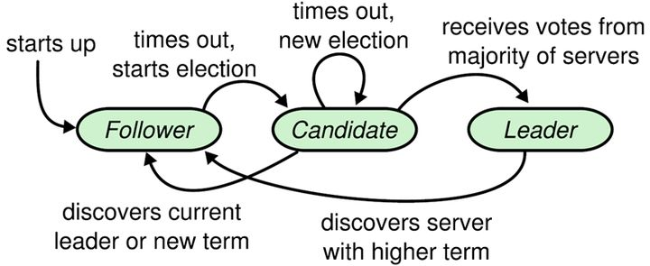

### Leader 选举

Raft 使用心跳（heartbeat）触发Leader选举。当服务器启动时，初始化为Follower。Leader向所有Followers周期性发送heartbeat。如果Follower在选举超时时间内没有收到Leader的heartbeat，就会等待一段随机的时间后发起一次Leader选举。

#### 准备选举

若 follower 在心跳超时范围内没有接受到来自于leader的心跳，则认为leader挂了。若在一下步骤还未发生时，接收到了其他candidate的投票请求，则会先向其投票，然后follower会完成一下步骤：
* 使其本地term增一
* 由 follower 转变为 candidate
* 向自己投一票,  一个term内，一个节点只能投出一票
* 向其它节点发出投票请求，然后等待响应

####  开始选举
flollower 在接受到投票请求后，其会根据一下情况来判断是否投票：
* 发来投票请求的 candidate 的term不能小于我的term
* 在我当前 term 内，我的选票换没有投出去
* 发来投票请求的 candidate 拥有的 log 编号要不能小于我的 log 编号
* 在我的选票尚未透出时，接受到多个 candidate 的请求，我将采用 first-come-first-served方式投票

#### 选举结果
当一个 candidate 发出投票请求后会等待其他节点的响应结果。这个响应结果可能有三种情况：
* 收到过半选票，成为新的 leader。然后会将消息广播给所有其它节点，以告诉大家我是新的 leader 了（其中包含了当前的term）
* 接受到别的 candidate 发来的新的 leader 通知，比较了新 leader 的 term 并不比我的 term 小，则自己转变为 follower。
* 经过一段时间后，没有收到过半选票，也没有受到新 leader 通知，则重新发出选举

#### 票数相同
若在选举过程中出现了各个 candidate 票数相同的情况，是无法选举出 leader的。当出现这种情况时，其采用了 randomized election timeouts 方式来解决这个问题。其会让这些 candidate 的选举在一个给定范围内随机的 timeout 之后开始，此时先到达 timeout 的 candidate 会首先发出投票请求，并优先获取到选票。

### 数据同步

#### 状态机

Raft 算法一致性的实现，是基于日志复制状态机的。状态机的最大特征是，不同的状态机当前状态相同，然后接受了相同的输入，则一定会得到相同的输出。

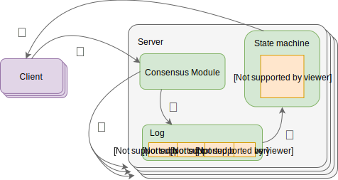

#### 处理流程
当 leader 接收到 client 的写操作请求后，大体会经历以下流程：
* leader 将数据封装为日志
* 将日志并行发送给follower，然后等待接受follower响应
* 当 leader 接收到过半响应后，将日志 commit 到状态机，日志状态变为了 committed
* leader 向 client 响应
* leader 通知所有 follower 将日志 apply 到他们本地的状态机，日志状态变为 applied

#### AP支持
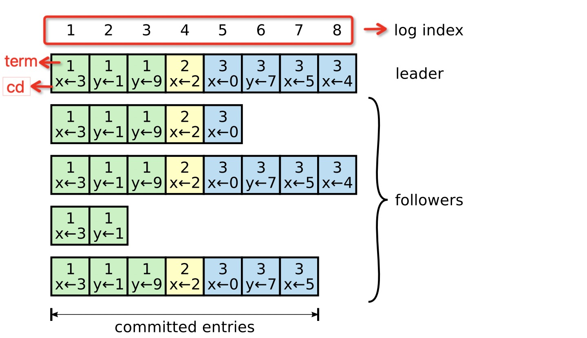
Log 由 term index、log index 及 command 构成。为了保证可用性，各个节点中的日志可以不完全相同，但 leader 会不断给 follower 发送 log，以使各个节点的log最终达到相同。

### 脑裂
在多机房部署中，由于网络连接的问题，很容易形成多个分区。而多个分区的形成，很容易产生脑裂，从而导致数据不一致。


### Leader 宕机处理

#### 请求到达前 leader 挂了

client 发送写操作请求到达 leader 之前 leader 就挂了，因为请求还没有到达集群，所以这个请求对于集群来说就没有存在过，对集群数据的一致性灭有任何影响。Leader 挂了之后，会选举产生新的Leader。由于 Stale Leader并未向 client 发送成功接收响应，所以 client 会重新发送该写操作请求。

#### 未开始同步数据前 Leader 挂了

client 发送写操作请求到 Leader，请求到达 Leader 后， leader 还没有开始向 followers 复制数据 leader 就挂了，此时数据为 uncommited状态。这时会选举产生新的 leader，之前挂掉的 leader 重启后作为 follower 加入集群，并同步新 leader 中的数据以保证数据一致性。之前接收到 client 的 uncommited 状态数据被丢弃。由于 Stale Leader 并未向 client 发送成功接收响应，所以 client会重新发送该写操作请求。

#### 同步完一小半 Leader 挂了

client 发送写操作请求到 Leader， Leader 接收完数据后开始向 follower 复制数据。在复制完一小部分（未过半）follower 后 leader 挂了，此时 follower中这些已经被接收到的数据状态为 uncommitted。由于 Leader 挂了，就会发起新的 Leader 选举，并且新的 Leader 会在这些接收了数据的 follower 中产生。新的 Leader 产生后所有节点开始从新 leader 同步数据， 其中就包含前面的 uncommitted数据。由于 Stale Leader 并未向 client 发送成功接收响应，所以 client 会重新发送该写操作请求。所以 Raft 算法要求各个节点自身要实现去重机制，以避免数据的重复接收。


#### 过半复制完毕 Leader 挂了

client 发送且操作请求到 Leader， Leader 在接收到过半节点接收完毕的响应后，Leader将日志写入到状态机，日志状态变为了 committed。 在Leader 还未向 follower 发送 apply 通知时 leader 挂了。此时会选举出新的 Leader，且一定时在接收过日志的主机中产生。由于 Stale Leader 还未向 client 发送成功接收响应，所以 client 会重新发送该写操作请求。所以 Raft 算法要求各个节点自身要实现去重机制，以避免数据的重复接收。


### 应用
[Etcd](./etcd.md)
[Nacos](https://nacos.io)

## POW

POW（Proof of Work），工作量证明，引入了对一个特定值的计算工作。

比特币采用的共识算法就是POW，矿工们在挖一个新的区块时，必须对SHA-256密码散列函数进行运算，区块中的随机散列值以一个或多个0开始。随着0数目的上升，找到这个解所需要的工作量将呈指数增长，矿工通过反复尝试找到这个解。

### SHA 无记忆，无进展

SHA(Secure Hash Algorithm) 在统计学和概率上以[无记忆性（memoryless）](https://en.wikipedia.org/wiki/Memorylessness) 闻名。所谓无记忆性，就是无论之前发生了什么，都不影响这一次事件发生的概率。

无进展（progress-free）的问题，无记忆性又是必要条件。progress-free 意味着当矿工试图通过对 [nonces](https://en.bitcoin.it/wiki/Nonce) 进行迭代解决难题时，每一次尝试都是一个独立事件，无论之前已经算过了多少次，每次尝试找到答案的概率是固定的。换句话来说，每次尝试，参与者都不会离“答案”越近，或者说有任何进展（progress）。就下一次尝试而言，一个已经算了一年的矿工，与上一秒刚开始算的矿工，算出来的概率是一样的。

在指定时间内，给定一个难度，找到答案的概率*唯一地由所有参与者能够迭代哈希的速度决定*。与之前的历史无关，与数据无关，只跟算力有关。


## PoS

PoS（Proof-of-Stake）权益证明机制，在PoS共识中，节点争夺记账权依靠的不是算力而是权益（代币）。PoS同样需要计算哈希值，但与PoW不同的是，不需要持续暴力计算寻找nonce值

## DPoS

委托权益证明 Delegate Proof of Stake（DPoS）， 是由PoS演化而来的。持币用户通过抵押代币获得选票，以投票的方式选出若干的节点作为区块生产者，代表持币用户履行产生区块的义务。DPoS与公司董事会制度相似，让持币用户将生产区块的工作委托给更有能力胜任的专业人士去完成，同时也能享受参与出块获得的奖励。


# DHT
分布式哈希表（distributed hash tables ，DHT）技术是去中心化 P2P 网络中最核心的一种路由寻址技术，可以在无中心服务器（trackerless）的情况下，在网络中快速找到目标节点。

## Kademlia
Kademlia 协议（以下简称 Kad）是美国纽约大学的 P. Maymounkov 和 D. Mazieres 在2002年发布的一项研究结果 [Kademlia: A peerto-peer information system based on the XOR metric](https://pdos.csail.mit.edu/~petar/papers/maymounkov-kademlia-lncs.pdf)。

简单的说，Kad 是一种分布式哈希表（DHT）技术，不过和其他 DHT 实现技术比较，如 Chord、CAN、Pastry 等，Kad 通过独特的以异或算法（XOR）为距离度量基础，建立了一种全新的 DHT 拓扑结构，相比于其他算法，大大提高了路由查询速度。

在2005年5月著名的 BiTtorrent 在 4.1.0 版实现基于 Kademlia 协议的 DHT 技术后，很快国内的 BitComet 和 BitSpirit 也实现了和 BitTorrent 兼容的 DHT 技术，实现 trackerless下载方式。

另外，emule 中也很早就实现了基于 Kademlia 类似的技术（BT 中叫 DHT，emule 中也叫 Kad，注意和本文简称的 Kad 区别），和 BT 软件使用的 Kad 技术的区别在于 key、value 和 node ID 的计算方法不同。

### 参考
http://www.yeolar.com/note/2010/03/21/kademlia/

## Chord

## Pastry

# Gossip 协议

Gossip 最早由[施乐公司](https://en.wikipedia.org/wiki/Xerox)（Xerox，现在可能很多人不了解施乐了，或只把施乐当一家复印产品公司看待，这家公司是计算机许多关键技术的鼻祖，图形界面的发明者、以太网的发明者、激光打印机的发明者、MVC 架构的提出者、RPC 的提出者、BMP 格式的提出者……） Palo Alto 研究中心在论文《[Epidemic Algorithms for Replicated Database Maintenance](http://bitsavers.trailing-edge.com/pdf/xerox/parc/techReports/CSL-89-1_Epidemic_Algorithms_for_Replicated_Database_Maintenance.pdf)》中提出的一种用于分布式数据库在多节点间复制同步数据的算法。除此以外，它还有“流言算法”、“八卦算法”、“瘟疫算法”等别名。

Gossip是一种分布式一致性协议，在 Cassandra、Akka、Redis 都有用到，也是P2P网络的核心技术。Gossip是一种去中心化、容错而又最终一致性的算法。

## 工作过程

- 如果有某一项信息需要在整个网络中所有节点中传播，那从信息源开始，选择一个固定的传播周期（譬如 1 秒），随机选择它相连接的 k 个节点（称为 Fan-Out）来传播消息。
- 每一个节点收到消息后，如果这个消息是它之前没有收到过的，将在下一个周期内，选择除了发送消息给它的那个节点外的其他相邻 k 个节点发送相同的消息，直到最终网络中所有节点都收到了消息，尽管这个过程需要一定时间，但是理论上最终网络的所有节点都会拥有相同的消息。


Gossip 传播示意图（[图片来源](https://managementfromscratch.wordpress.com/2016/04/01/introduction-to-gossip/)）


## 优点

1. 扩展性

   网络可以允许节点的任意增加和减少，新增加的节点的状态最终会与其他节点一致。

2. 容错

   网络中任何节点的宕机和重启都不会影响 Gossip 消息的传播，Gossip 协议具有天然的分布式系统容错特性。

3. 去中心化

   Gossip 协议不要求任何中心节点，所有节点都可以是对等的，任何一个节点无需知道整个网络状况，只要网络是连通的，任意一个节点就可以把消息散播到全网。

4. 一致性收敛

   Gossip 协议中的消息会以一传十、十传百一样的指数级速度在网络中快速传播，因此系统状态的不一致可以在很快的时间内收敛到一致。消息传播速度达到了 logN。

5. 简单

   Gossip 协议的过程极其简单，实现起来几乎没有太多复杂性。

## 缺点

1. 消息的延迟

   由于 Gossip 协议中，节点只会随机向少数几个节点发送消息，消息最终是通过多个轮次的散播而到达全网的，因此使用 Gossip 协议会造成不可避免的消息延迟。不适合用在对实时性要求较高的场景下。

2. 消息冗余

   Gossip 协议规定，节点会定期随机选择周围节点发送消息，而收到消息的节点也会重复该步骤，因此就不可避免的存在消息重复发送给同一节点的情况，造成了消息的冗余，同时也增加了收到消息的节点的处理压力。而且，由于是定期发送，因此，即使收到了消息的节点还会反复收到重复消息，加重了消息的冗余。


## 参考

https://pdos.csail.mit.edu/~petar/papers/maymounkov-kademlia-lncs.pdf

http://icyfenix.cn/distribution/consensus/gossip.html

https://zhuanlan.zhihu.com/p/41228196


# 加密算法

## DSA


## ECDSA

`ECDSA`是**[Elliptic Curve Digital Signature Algorithm](https://en.wikipedia.org/wiki/Elliptic_Curve_Digital_Signature_Algorithm)**的简称，主要用于对数据（比如一个文件）创建数字签名，以便于你在不破坏它的安全性的前提下对它的真实性进行验证。


# 参考

https://www.cs.usfca.edu/~galles/visualization/Algorithms.html			

https://visualgo.net/zh

