# Install

==hive不支持java8以上的版本==

## mac standalone

```bash
brew install hadoop
```

### Configure

默认配置目录为`/usr/local/cellar/hadoop/3.3.0/libexec/etc/hadoop/`

#### hadoop-env.sh

```bash
# 放开并设置
export JAVA_HOME="/Library/Java/JavaVirtualMachines/adoptopenjdk-1.8.jdk/Contents/Home"
export HADOOP_OPTS="-Djava.net.preferIPv4Stack=true -Dsun.security.krb5.debug=true -Dsun.security.spnego.debug"
```

#### core-site.xml

```xml
<configuration>
  <property>
    <name>fs.defaultFS</name>
    <value>hdfs://localhost:9000</value>
  </property>
</configuration>
```

#### hdfs-site.xml

```xml
<configuration>
  <property>
    <name>dfs.replication</name>
    <value>1</value>
  </property>
</configuration>
```

#### mapred-site.xml

```xml
<configuration>
  <property>
    <name>mapreduce.framework.name</name>
    <value>yarn</value>
  </property>
  <property>
      <name>mapreduce.application.classpath</name>   
      <value>$HADOOP_MAPRED_HOME/share/hadoop/mapreduce/*:$HADOOP_MAPRED_HOME/share/hadoop/mapreduce/lib/*</value>
  </property>
</configuration>
```

#### yarn-site.xml

```xml
<configuration>
    <property>
        <name>yarn.nodemanager.aux-services</name>
        <value>mapreduce_shuffle</value>
    </property>
    <property>
        <name>yarn.nodemanager.env-whitelist</name>
        <value>JAVA_HOME,HADOOP_COMMON_HOME,HADOOP_HDFS_HOME,HADOOP_CONF_DIR,CLASSPATH_PREPEND_DISTCACHE,HADOOP_YARN_HOME,HADOOP_MAPRED_HOME</value>
    </property>
</configuration>
```

#### ssh

开启ssh服务

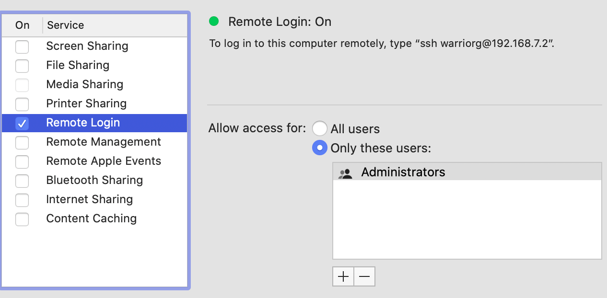

```bash
ssh-keygen -t rsa -P '' -f ~/.ssh/id_rsa    # 生成ID
cat ~/.ssh/id_rsa.pub >> ~/.ssh/authorized_keys    # 配置证书登录
ssh localhost      # 测试登录
```

#### Format NameNode

```bash
# /usr/local/Cellar/hadoop/3.3.0/bin
hdfs namenode -format
```

#### start

```bash
# /usr/local/Cellar/hadoop/3.3.0/sbin
./start-all.sh
jps
```

* hdfs http://localhost:9870
* yarn http://localhost:8088


#### stop

```bash
./stop-all.sh
```


## Cluster

| 服务器         | node01            | node02      | node03      |
| -------------- | ----------------- | ----------- | ----------- |
| HDFS           | NameNode          |             |             |
| HDFS           | SecondaryNameNode |             |             |
| HDFS           | DataNode          | DataNode    | DataNode    |
| YARN           | ResourceManager   |             |             |
| YARN           | NodeManager       | NodeManager | NodeManager |
| 历史日志服务器 | JobHistoryServer  |             |             |

### 第一步: 准备环境

准备了3台centos8的服务器

#### 1. 添加用户

三台机器添加普通用户

  ```bash
useradd hadoop
passwd hadoop
  ```

 使用`visudo`命令为三台机器为普通用户添加sudo权限

  ```bash
hadoop ALL=(ALL)    ALL
  ```

#### 2. 三台机器做主机名与IP地址的映射

```bash
# /etc/hosts
192.168.0.94 node01.dces.com node01
192.168.0.95 node02.dces.com node02
192.168.0.96 node03.dces.com node03
```

#### 3. 三台机器hadoop用户免密码登录

```bash
ssh-keygen -t rsa
ssh-copy-id node01
```

#### 4. 安装JDK 

推荐使用手工方式安装jdk

```bash
yum install -y java-8-openjdk.x86_64   # 安装JDK hive 不支持11
alternatives --config java  # 配置当前使用的jdk

# /etc/bashrc
export JAVA_HOME=$(alternatives --display java | grep current | sed 's/ link currently points to //' | sed 's|/bin/java||')
export PATH=$PATH:$JAVA_HOME/bin
source /etc/bashrc
```

#### 5. 其他

```bash
# 上传hadoop到服务器
tar -zxvf hadoop-3.2.2.tar.gz
mv hadoop-3.2.2 hadoop
```


### 第二步: 检查hadoop支持

```bash
bin/hadoop checknative
# 如果 openssl 显示 false, 安装openssl
yum -y install openssl-devel
```

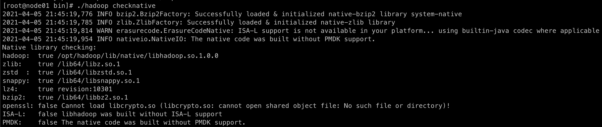

### 第三步：修改配置文件

hadoop/etc/hadoop/

#### hadoop-env.sh

```bash
export JAVA_HOME=$(alternatives --display java | grep current | sed 's/ link currently points to //' | sed 's|/bin/java||'
# export JAVA_HOME=/opt/jdk1.8
```

#### core-site.xml

```xml
<configuration>
    <property>
        <name>fs.defaultFS</name>
        <value>hdfs://node01:8020</value>
    </property>
    <property>
        <name>hadoop.tmp.dir</name>
        <value>/home/hadoop/data/temp</value>
    </property>
  	<!--  缓冲区大小，实际工作中根据服务器性能动态调整；默认值4096 -->
    <property>
        <name>io.file.buffer.size</name>
        <value>4096</value>
    </property>
  	<!--  开启hdfs的垃圾桶机制，删除掉的数据可以从垃圾桶中回收，单位分钟；默认值0 -->
    <property>
        <name>fs.trash.interval</name>
        <value>10080</value>
    </property>
</configuration>
```

#### hdfs-site.xml

```xml
<configuration>
    <!-- NameNode存储元数据信息的路径，实际工作中，一般先确定磁盘的挂载目录，然后多个目录用，进行分割   --> 
    <!--   集群动态上下线 
    <property>
        <name>dfs.hosts</name>
        <value>/opt/hadoop/etc/hadoop/accept_host</value>
    </property>
    <property>
        <name>dfs.hosts.exclude</name>
        <value>/opt/hadoop/etc/hadoop/deny_host</value>
    </property>
     -->
    <property>
        <name>dfs.namenode.secondary.http-address</name>
        <value>node01:9868</value>
    </property>
    <property>
        <name>dfs.namenode.http-address</name>
        <value>node01:9870</value>
    </property>
    <!-- namenode保存fsimage的路径 -->
    <property>
        <name>dfs.namenode.name.dir</name>
        <value>file:///home/hadoop/data/namenode</value>
    </property>
    <!--  定义dataNode数据存储的节点位置，实际工作中，一般先确定磁盘的挂载目录，然后多个目录用，进行分割  -->
    <property>
        <name>dfs.datanode.data.dir</name>
        <value>file:///home/hadoop/data/datanode</value>
    </property>
    <!-- namenode保存editslog的目录 -->
    <property>
        <name>dfs.namenode.edits.dir</name>
        <value>file:///home/hadoop/data/dfs/nn/edits</value>
    </property>
    <!-- secondarynamenode保存待合并的fsimage -->
    <property>
        <name>dfs.namenode.checkpoint.dir</name>
        <value>file:///home/hadoop/data/dfs/snn/name</value>
    </property>
    <!-- secondarynamenode保存待合并的editslog -->
    <property>
        <name>dfs.namenode.checkpoint.edits.dir</name>
        <value>file:///home/hadoop/data/dfs/nn/snn/edits</value>
    </property>
    <property>
        <name>dfs.replication</name>
        <value>3</value>
    </property>
    <property>
        <name>dfs.permissions.enabled</name>
        <value>false</value>
    </property>
	<property>
        <name>dfs.blocksize</name>
        <value>134217728</value>
    </property>
</configuration>
```

#### mapred-site.xml

```xml
<configuration>
    <property>
        <name>mapreduce.framework.name</name>
        <value>yarn</value>
    </property>
    <property>
        <name>mapreduce.job.ubertask.enable</name>
        <value>true</value>
    </property>
    <property>
        <name>mapreduce.jobhistory.address</name>
        <value>node01:10020</value>
    </property>
    <property>
        <name>mapreduce.jobhistory.webapp.address</name>
        <value>node01:19888</value>
    </property>
        <property>
        <name>yarn.app.mapreduce.am.env</name>
        <value>HADOOP_MAPRED_HOME=${HADOOP_HOME}</value>
    </property>
    <property>
        <name>mapreduce.map.env</name>
        <value>HADOOP_MAPRED_HOME=${HADOOP_HOME}</value>
    </property>
    <property>
        <name>mapreduce.reduce.env</name>
        <value>HADOOP_MAPRED_HOME=${HADOOP_HOME}</value>
    </property>
</configuration>
```

#### yarn-site.xml

```xml
<configuration>
    <property>
       <name>yarn.resourcemanager.hostname</name>
        <value>node01</value>
    </property>
    <property>
        <name>yarn.nodemanager.aux-services</name>
        <value>mapreduce_shuffle</value>
    </property>
    <!-- 如果vmem、pmem资源不够，会报错，此处将资源监察置为false -->
    <property>
        <name>yarn.nodemanager.vmem-check-enabled</name>
        <value>false</value>
    </property>
    <property>
        <name>yarn.nodemanager.pmem-check-enabled</name>
        <value>false</value>
    </property>
</configuration>
```

#### workers

```bash
node01
node02
node03
```

### 第四步：创建文件存放目录

```bash
mkdir -p /home/hadoop/data/temp
mkdir -p /home/hadoop/data/namenode
mkdir -p /home/hadoop/data/datanode
mkdir -p /home/hadoop/data/dfs/nn/edits
mkdir -p /home/hadoop/data/dfs/snn/name
mkdir -p /home/hadoop/data/dfs/nn/snn/edits
```

### 第五步：配置hadoop的环境变量

/etc/bashrc

```bash
export HADOOP_HOME=/opt/hadoop
export PATH=$PATH:$HADOOP_HOME/bin:$HADOOP_HOME/sbin
```

```bash
source /etc/bashrc
```

### 第六步：格式化集群

* 要启动 Hadoop 集群，需要启动 HDFS 和 YARN 两个集群。 
* 注意：首次启动HDFS时，必须对其进行格式化操作。本质上是一些清理和准备工作，因为此时的 HDFS 在物理上还是不存在的。<font color='red'>格式化操作只有在首次启动的时候需要，以后再也不需要了</font>
* <font color='red'>node01执行一遍即可</font>

```bash
hdfs namenode -format
# 或者
hadoop namenode –format
```

### 第七步：集群启动

1. 启动HDFS、YARN、Historyserver

   >  如果配置了 etc/hadoop/workers 和 ssh 免密登录，则可以使用程序脚本启动所有Hadoop 两个集群的相关进程，在主节点所设定的机器上执行。
   
   **主节点node01节点上执行**
   
   ```bash
   ###################### 启动集群
   start-dfs.sh
   start-yarn.sh
   # mr-jobhistory-daemon.sh start historyserver 过时
   mapred --daemon start historyserver
   
   ##################### 停止集群
   stop-dfs.sh
   stop-yarn.sh 
   # mr-jobhistory-daemon.sh stop historyserver 过时
   mapred --daemon stop historyserver
   ```
   
2. 单个进程逐个启动

   ```bash
   # 在主节点上使用以下命令启动 HDFS NameNode： 
   # 已过时 hadoop-daemon.sh start namenode 
   hdfs --daemon start namenode
   
   # 在主节点上使用以下命令启动 HDFS SecondaryNamenode： 
   # 已过时 hadoop-daemon.sh start secondarynamenode 
   hdfs --daemon start secondarynamenode
   
   # 在每个从节点上使用以下命令启动 HDFS DataNode： 
   # 已过时 hadoop-daemon.sh start datanode
   hdfs --daemon start datanode
   
   # 在主节点上使用以下命令启动 YARN ResourceManager： 
   # 已过时 yarn-daemon.sh start resourcemanager 
   yarn --daemon start resourcemanager
   
   # 在每个从节点上使用以下命令启动 YARN nodemanager： 
   # 已过时 yarn-daemon.sh start nodemanager 
   yarn --daemon start nodemanager
   
   
   # 以上脚本位于$HADOOP_HOME/sbin/目录下。如果想要停止某个节点上某个角色，只需要把命令中的start 改为stop 即可。
   ```

3. 一键启动hadoop集群的脚本

   为了便于一键启动hadoop集群，我们可以编写shell脚本, 在node01服务器的/home/hadoop/bin目录下创建脚本hadoop.sh

   ```bash
   #!/bin/bash
   case $1 in
   "start" ){
    source /etc/profile;
    /opt/hadoop/sbin/start-dfs.sh
    /opt/hadoop/sbin/start-yarn.sh
    /opt/hadoop/bin/mapred --daemon start historyserver
   };;
   "stop"){
   
    /opt/hadoop/sbin/stop-dfs.sh
    /opt/hadoop/sbin/stop-yarn.sh
    /opt/hadoop/bin/mapred --daemon stop historyserver
   };;
   esac
   ```

	脚本赋权
   ```bash
   chmod +x hadoop.sh
   ./hadoop.sh start  # 启动hadoop集群
   ./hadoop.sh stop   # 停止hadoop集群
   ```

   

#### 错误解决


#### 手动检查节点启动

```base
hadoop namenode
hadoop datanode
```


##### Attempting to operate on hdfs namenode as root

> 请使用hadoop用户启动
>
> 如果非要使用root用户启动,请如下配置

```bash
# start-dfs.sh
HDFS_DATANODE_USER=root
HADOOP_SECURE_DN_USER=hdfs
HDFS_NAMENODE_USER=root
HDFS_SECONDARYNAMENODE_USER=root 

# start-yarn.sh
YARN_RESOURCEMANAGER_USER=root
HADOOP_SECURE_DN_USER=yarn
YARN_NODEMANAGER_USER=root
```

### 第八步：验证集群是否搭建成功

- hdfs http://192.168.0.94:9870/

- yarnhttp://192.168.0.94:8088

- jobhistory http://192.168.0.94:19888


使用 mr 测试集群

```bash
[hadoop@node01 mapreduce]$ hadoop jar /opt/hadoop/share/hadoop/mapreduce/hadoop-mapreduce-examples-3.2.2.jar pi 5 5
```


# Hadoop的模块

###  hadoop的架构模块介绍

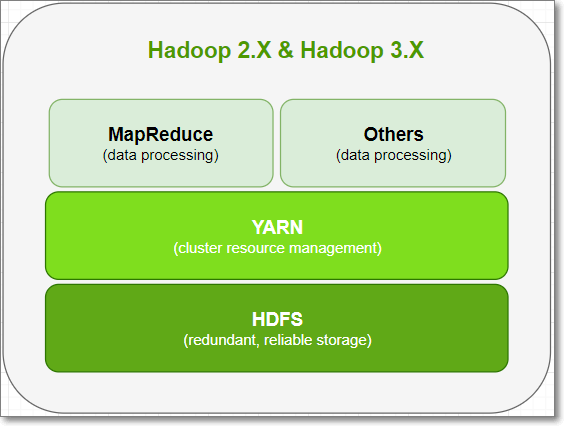

- Hadoop由三个模块组成：**分布式**存储HDFS、分布式计算MapReduce、资源调度引擎Yarn

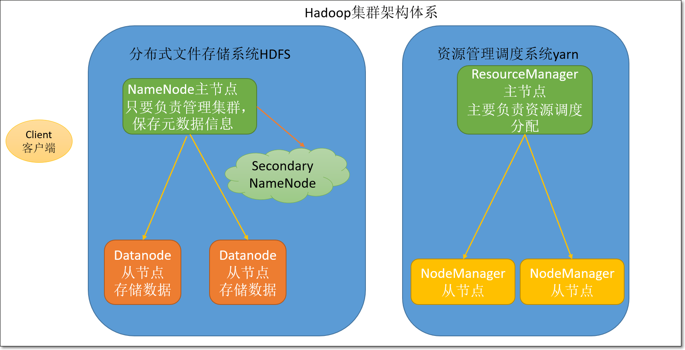

- 特点：
  - 分布式
  - 主从架构
- HDFS模块：
  -  namenode：主节点，主要负责集群的管理以及元数据信息管理

  -  datanode：从节点，主要负责存储用户数据

  -  secondaryNameNode：辅助namenode管理元数据信息，以及元数据信息的冷备份
- Yarn模块：

  - ResourceManager：主节点，主要负责资源分配
  - NodeManager：从节点，主要负责执行任务


# HDFS

**HDFS** (Hadoop Distributed File System)  分布式文件系统

## 分布式文件系统


## HDFS架构

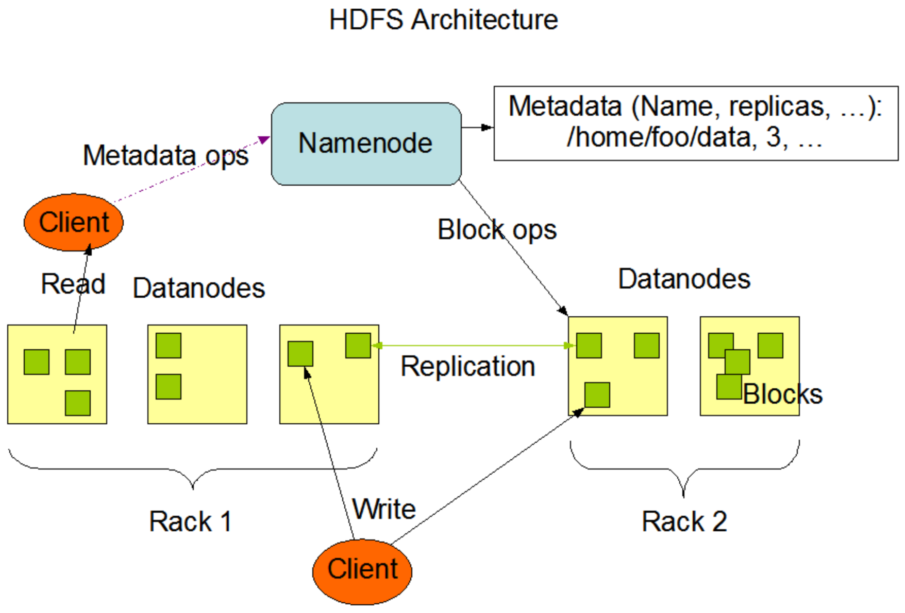


## shell

- HDFS命令有两种风格：
  - hadoop fs开头的
  - hdfs dfs开头的
  - 两种命令均可使用，效果相同

1. 如何查看hdfs或hadoop子命令的帮助信息，如ls子命令

```shell
hdfs dfs -help ls
hadoop fs -help ls #两个命令等价
```

2. 查看hdfs文件系统中指定目录的文件列表。对比linux命令ls

```shell
hdfs dfs -ls /
hadoop fs -ls /
hdfs dfs -ls -R /
```

3. 在hdfs文件系统中创建文件

```shell
hdfs dfs -touchz /edits.txt
hdfs dfs -ls /
```

4. 向HDFS文件中追加内容

```shell
hadoop fs -appendToFile edit1.xml /edits.txt #将本地磁盘当前目录的edit1.xml内容追加到HDFS根目录 的edits.txt文件
```

5. 查看HDFS文件内容

```shell
hdfs dfs -cat /edits.txt
hdfs dfs -text /edits.txt
```

6. 从本地路径上传文件至HDFS

```shell
#用法：hdfs dfs -put /本地路径 /hdfs路径
hdfs dfs -put /linux本地磁盘文件 /hdfs路径文件
hdfs dfs -copyFromLocal /linux本地磁盘文件 /hdfs路径文件  #跟put作用一样
hdfs dfs -moveFromLocal /linux本地磁盘文件 /hdfs路径文件  #跟put作用一样，只不过，源文件被拷贝成功后，会被删除
```

7. 在hdfs文件系统中下载文件

```shell
hdfs dfs -get /hdfs路径 /本地路径
hdfs dfs -copyToLocal /hdfs路径 /本地路径  #根get作用一样
```

8. 在hdfs文件系统中创建目录

```shell
hdfs dfs -mkdir /shell
```

9. 在hdfs文件系统中删除文件

```shell
hdfs dfs -rm /edits.txt

将文件彻底删除（被删除文件不放到hdfs的垃圾桶里）
how？
hdfs dfs -rm -skipTrash /xcall
```

10. 在hdfs文件系统中修改文件名称（也可以用来移动文件到目录）

```shell
hdfs dfs -mv /xcall.sh /call.sh
hdfs dfs -mv /call.sh /shell
```

11. 在hdfs中拷贝文件到目录

```shell
hdfs dfs -cp /xrsync.sh /shell
```

12. 递归删除目录

```shell
hdfs dfs -rm -r /shell
```

13. 列出本地文件的内容（默认是hdfs文件系统）

```shell
hdfs dfs -ls file:///home/hadoop/
```

14. 查找文件

```shell
# linux find命令
find . -name 'edit*'
# HDFS find命令
hadoop fs -find / -name part-r-00000 # 在HDFS根目录中，查找part-r-00000文件
```

15. 总结

- 输入hadoop fs 或hdfs dfs，回车，查看所有的HDFS命令

- 许多命令与linux命令有很大的相似性，学会举一反三

- 有用的==help==，如查看ls命令的使用说明：hadoop fs -help ls

- 绝大多数的大数据框架的命令，也有类似的help信息


##  hdfs安全模式

- 安全模式是HDFS所处的一种特殊状态
  - 文件系统只接受读请求
  - 不接受写请求，如删除、修改等变更请求。
- 在NameNode主节点启动时，HDFS首先进入安全模式
  - DataNode在启动的时候会向namenode汇报可用的block等状态，当整个系统达到安全标准时，HDFS自动离开安全模式。
  - 如果HDFS处于安全模式下，则文件block不能进行任何的副本复制操作，因此达到最小的副本数量要求是基于datanode启动时的状态来判定的
  - 启动时不会再做任何复制（从而达到最小副本数量要求）
  - hdfs集群刚启动的时候，默认30S钟的时间是出于安全期的，只有过了30S之后，集群脱离了安全期，然后才可以对集群进行操作
- 何时退出安全模式
  - namenode知道集群共多少个block（不考虑副本），假设值是total；
  - namenode启动后，会上报block report，namenode开始累加统计满足最小副本数（默认1）的block个数，假设是num
  - 当num/total > 99.9%时，推出安全模式

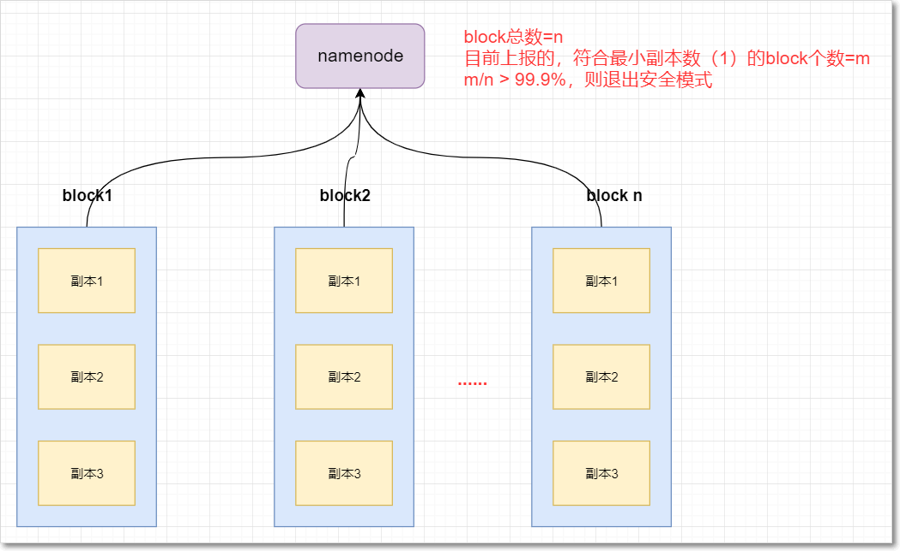

```shell
[hadoop@node01 hadoop]$ hdfs dfsadmin -safemode  
Usage: hdfs dfsadmin [-safemode enter | leave | get | wait]
```

## java API开发

##  NameNode和SecondaryNameNode功能剖析

#### 1. namenode与secondaryName解析

- NameNode主要负责集群当中的元数据信息管理，而且元数据信息需要经常随机访问，因为元数据信息必须高效的检索
  - 元数据信息保存在哪里能够==快速检索==呢？
  - 如何保证元数据的持久==安全==呢？
- 为了保证元数据信息的快速检索，那么我们就必须将元数据存==放在内存==当中，因为在内存当中元数据信息能够最快速的检索，那么随着元数据信息的增多（每个block块大概占用150字节的元数据信息），内存的消耗也会越来越多。
- 如果所有的元数据信息都存放内存，服务器断电，内存当中所有数据都消失，为了保证元数据的==安全持久==，元数据信息必须做可靠的持久化，在hadoop当中为了持久化存储元数据信息，将所有的元数据信息保存在了FSImage文件当中，那么FSImage随着时间推移，必然越来越膨胀，FSImage的操作变得越来越难，为了解决元数据信息的增删改，hadoop当中还引入了元数据操作日志edits文件，edits文件记录了客户端操作元数据的信息，随着时间的推移，edits信息也会越来越大，为了解决edits文件膨胀的问题，hadoop当中引入了secondaryNamenode来专门做fsimage与edits文件的合并

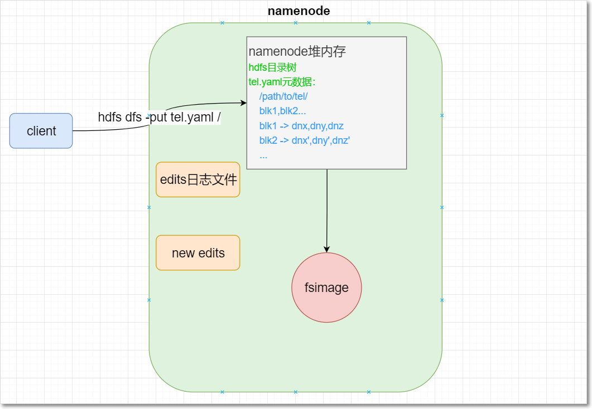


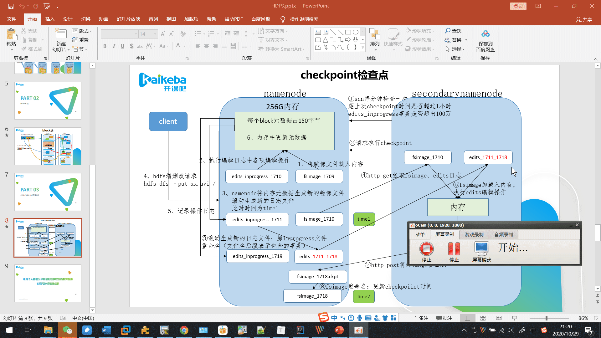

1. namenode工作机制

   （1）第一次启动namenode格式化后，创建fsimage和edits文件。如果不是第一次启动，直接加载编辑日志和镜像文件到内存。

   （2）客户端对元数据进行增删改的请求

   （3）namenode记录操作日志，更新滚动日志。

   （4）namenode在内存中对数据进行增删改查

2. Secondary NameNode工作

   （1）Secondary NameNode询问namenode是否需要checkpoint。直接带回namenode是否检查结果。

​       （2）Secondary NameNode请求执行checkpoint。

​       （3）namenode滚动正在写的edits日志

​       （4）将滚动前的编辑日志和镜像文件拷贝到Secondary NameNode

​       （5）Secondary NameNode加载编辑日志和镜像文件到内存，并合并。

​       （6）生成新的镜像文件fsimage.chkpoint

​       （7） 拷贝fsimage.chkpoint到namenode

​       （8）namenode将fsimage.chkpoint重新命名成fsimage

| 属性                                 | 值              | 解释                                                         |
| ------------------------------------ | --------------- | ------------------------------------------------------------ |
| dfs.namenode.checkpoint.period       | 3600秒(即1小时) | The number of seconds between two periodic checkpoints.      |
| dfs.namenode.checkpoint.txns         | 1000000         | The Secondary NameNode or CheckpointNode will create a checkpoint of the namespace every 'dfs.namenode.checkpoint.txns' transactions, regardless of whether 'dfs.namenode.checkpoint.period' has expired. |
| dfs.namenode.checkpoint.check.period | 60(1分钟)       | The SecondaryNameNode and CheckpointNode will poll the NameNode every 'dfs.namenode.checkpoint.check.period' seconds to query the number of uncheckpointed transactions. |

#### 2. FSImage与edits详解

- 所有的元数据信息都保存在了FsImage与Eidts文件当中，这两个文件就记录了所有的数据的元数据信息，元数据信息的保存目录配置在了hdfs-site.xml当中

```xml
<!-- namenode保存fsimage的路径 -->
<property>
  <name>dfs.namenode.name.dir</name>
  <value>file:///home/hadoop/data/namenode</value>
</property>
<!-- namenode保存editslog的目录 -->
<property>
  <name>dfs.namenode.edits.dir</name>
  <value>file:///home/hadoop/data/dfs/nn/edits</value>
</property>
```

- 客户端对hdfs进行写文件时会首先被记录在edits文件中

  edits修改时元数据也会更新。

  每次hdfs更新时edits先更新后，客户端才会看到最新信息。

  fsimage:是namenode中关于元数据的镜像，一般称为检查点。

  一般开始时对namenode的操作都放在edits中，为什么不放在fsimage中呢？

  因为fsimage是namenode的完整的镜像，内容很大，如果每次都加载到内存的话生成树状拓扑结构，这是非常耗内存和CPU。

  fsimage内容包含了namenode管理下的所有datanode中文件及文件block及block所在的datanode的元数据信息。随着edits内容增大，就需要在一定时间点和fsimage合并。

#### 3. FSimage文件当中的文件信息查看

- [官方查看文档](https://hadoop.apache.org/docs/r3.1.4/hadoop-project-dist/hadoop-hdfs/HdfsImageViewer.html)

- 使用命令 hdfs oiv 

```shell
cd  /home/hadoop/data/namenode/current
hdfs oiv    #查看帮助信息
hdfs oiv -i fsimage_0000000000000000864 -p XML -o /home/hadoop/fsimage1.xml
```

#### 4. edits当中的文件信息查看

- [官方查看文档](https://hadoop.apache.org/docs/r3.1.4/hadoop-project-dist/hadoop-hdfs/HdfsEditsViewer.html)

- 查看命令 hdfs oev

```shell
cd /home/hadoop/data/dfs/nn/edits/current
hdfs oev     #查看帮助信息
hdfs oev -i edits_0000000000000000865-0000000000000000866 -o /home/hadoop/myedit.xml -p XML
```


#### 5. namenode元数据信息多目录配置

- 为了保证元数据的安全性

  - 我们一般都是先确定好我们的磁盘挂载目录，将元数据的磁盘做RAID1 namenode的本地目录可以配置成多个，且每个目录存放内容相同，增加了可靠性。
  - 多个目录间逗号分隔

- 具体配置如下：

  hdfs-site.xml

```xml
<property>
   <name>dfs.namenode.name.dir</name>
   <value>file:///home/hadoop/namenode,file:///path/to/another/</value>
</property>
```


## datanode 工作机制以及数据存储


# MapReduce

## mapreduce的定义

- MapReduce是一个分布式运算程序的编程框架，是用户开发“基于Hadoop的数据分析应用”的核心框架。

- MapReduce核心功能是将用户编写的业务逻辑代码和自带默认组件整合成一个完整的分布式运算程序，并发运行在一个Hadoop集群上。

## mapreduce的核心思想

- MapReduce思想在生活中处处可见。或多或少都曾接触过这种思想。MapReduce的思想核心是“**分而治之**”，适用于大量复杂的任务处理场景（大规模数据处理场景）。
- 即使是发布过论文实现分布式计算的谷歌也只是实现了这种思想，而不是自己原创。
- Map负责“分”，即把复杂的任务分解为若干个“简单的任务”来并行处理。可以进行拆分的前提是这些==小任务可以并行计算，彼此间几乎没有依赖关系。==
- Reduce负责“合”，即对map阶段的结果进行全局汇总。
- 这两个阶段合起来正是MapReduce思想的体现。

## MapReduce编程模型

- MapReduce是采用一种分而治之的思想设计出来的分布式计算框架

- 那什么是分而治之呢？
  - 比如一复杂、计算量大、耗时长的的任务，暂且称为“大任务”；
  - 此时使用单台服务器无法计算或较短时间内计算出结果时，可将此大任务切分成一个个小的任务，小任务分别在不同的服务器上并行的执行；
  - 最终再汇总每个小任务的结果

- MapReduce由两个阶段组成：
  - Map阶段（切分成一个个小的任务）
  - Reduce阶段（汇总小任务的结果）

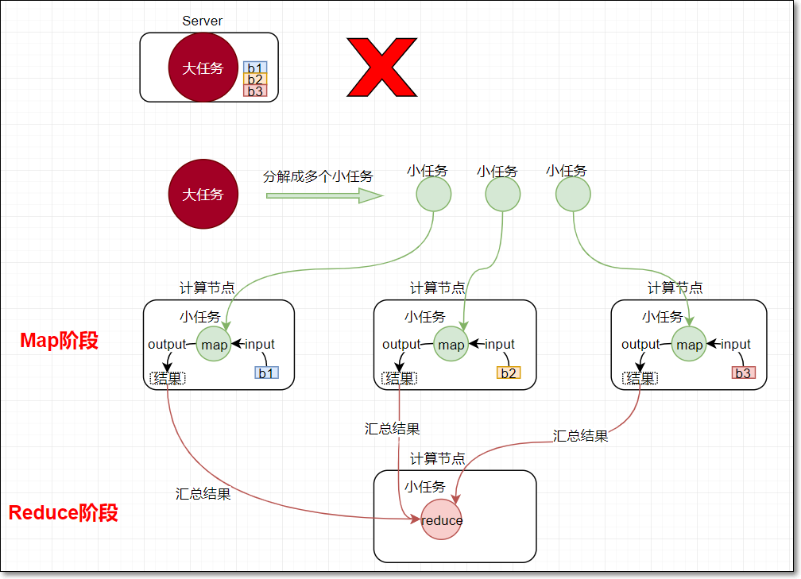                               

### 1. Map阶段

- map阶段有一个关键的map()函数；

- 此函数的输入是键值对

- 输出是一系列键值对，输出写入本地磁盘。

### 2. Reduce阶段

- reduce阶段有一个关键的函数reduce()函数

- 此函数的输入也是键值对（即map的输出（kv对））

- 输出也是一系列键值对，结果最终写入HDFS

### 3. Map&Reduce

 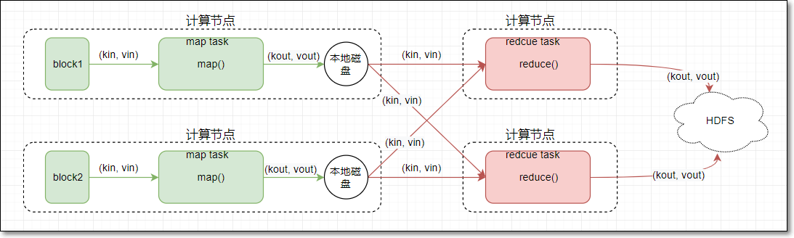

## mapreduce编程指导思想

- mapReduce编程模型的总结：

- MapReduce的开发一共有八个步骤其中map阶段分为2个步骤，shuffle阶段4个步骤，reduce阶段分为2个步骤

### 1. Map阶段2个步骤

- 第一步：设置inputFormat类，将数据切分成key，value对，输入到第二步

- 第二步：自定义map逻辑，处理我们第一步的输入kv对数据，然后转换成新的key，value对进行输出

### 2. shuffle阶段4个步骤

- 第三步：对上一步输出的key，value对进行分区。（相同key的kv对属于同一分区）

- 第四步：对每个分区的数据按照key进行排序

- 第五步：对分区中的数据进行规约(combine操作)，降低数据的网络拷贝（可选步骤）

- 第六步：对排序后的kv对数据进行分组；分组的过程中，key相同的kv对为一组；将同一组的kv对的所有value放到一个集合当中（每组数据调用一次reduce方法）

### 3. reduce阶段2个步骤

- 第七步：对多个map的任务进行合并，排序，写reduce函数自己的逻辑，对输入的key，value对进行处理，转换成新的key，value对进行输出

- 第八步：设置将输出的key，value对数据保存到文件中

## hadoop当中常用的数据类型

- hadoop没有沿用java当中基本的数据类型，而是自己进行封装了一套数据类型，其自己封装的类型与java的类型对应如下

- 下表常用的数据类型对应的Hadoop数据序列化类型

| Java类型 | Hadoop   Writable类型 |
| -------- | --------------------- |
| Boolean  | BooleanWritable       |
| Byte     | ByteWritable          |
| Int      | IntWritable           |
| Float    | FloatWritable         |
| Long     | LongWritable          |
| Double   | DoubleWritable        |
| String   | Text                  |
| Map      | MapWritable           |
| Array    | ArrayWritable         |
| byte[]   | BytesWritable         |


## Map Task数量及切片机制

### 1. MapTask个数

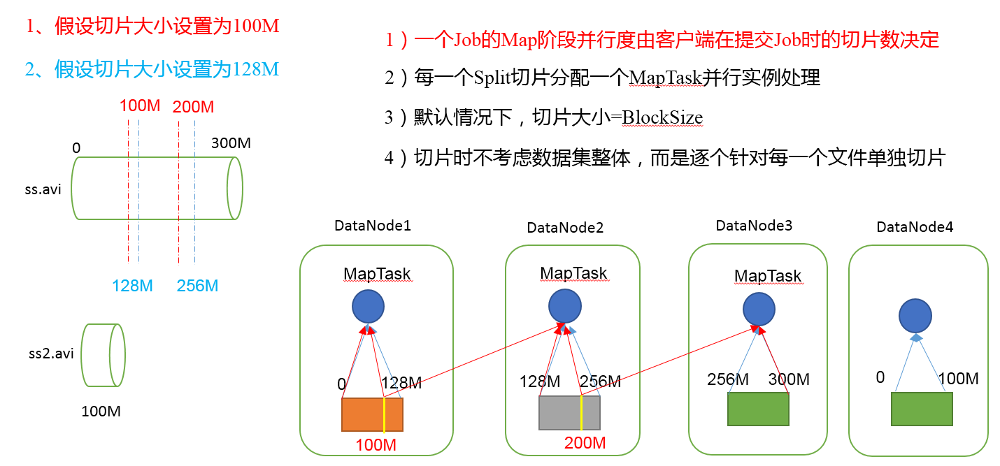


- 在运行我们的MapReduce程序的时候，我们可以清晰的看到会有多个mapTask的运行
  - 那么maptask的个数究竟与什么有关
  - 是不是maptask越多越好，或者说是不是maptask的个数越少越好呢？？？
  - 我们可以通过MapReduce的源码进行查看mapTask的个数究竟是如何决定的
- 在MapReduce当中，每个mapTask处理一个切片split的数据量，注意切片与block块的概念很像，但是block块是HDFS当中存储数据的单位，切片split是MapReduce当中每个MapTask处理数据量的单位。
- MapTask并行度决定机制
- 数据块：Block是HDFS物理上把数据分成一块一块。
- 数据切片：数据切片只是在逻辑上对输入进行分片，并==不会在磁盘上将其切分成片进行存储==。
- 查看FileInputFormat的源码，里面getSplits的方法便是获取所有的切片，其中有个方法便是获取切片大小

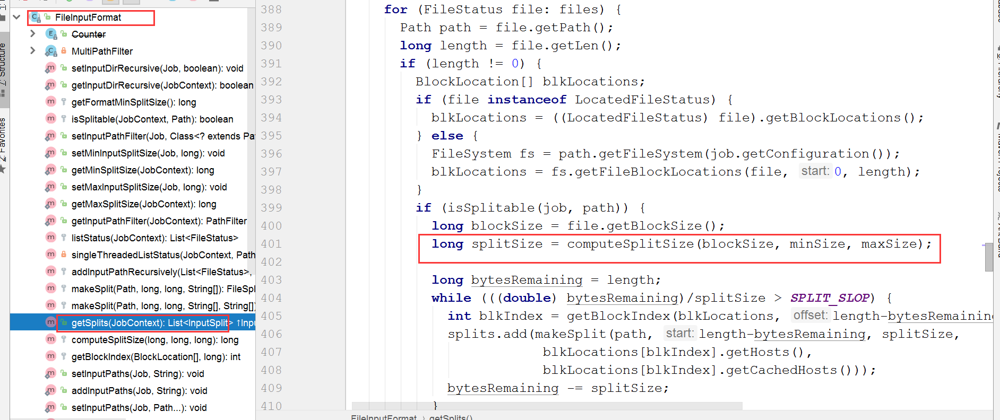

- 切片大小的计算公式：

```java
Math.max(minSize, Math.min(maxSize, blockSize));   
mapreduce.input.fileinputformat.split.minsize=1 默认值为1  
mapreduce.input.fileinputformat.split.maxsize= Long.MAXValue 默认值Long.MAXValue  
blockSize为128M 
```

- 由以上计算公式可以推算出split切片的大小刚好与block块相等

- 那么hdfs上面如果有以下两个文件，文件大小分别为300M和10M，那么会启动多少个MapTask？？？

  1、输入文件两个

```
file1.txt    300M
file2.txt    10M
```

​		2、经过FileInputFormat的切片机制运算后，形成的切片信息如下：

```
file1.txt.split1-- 0~128
file1.txt.split2-- 128~256
file1.txt.split3-- 256~300
file2.txt.split1-- 0~10M
```

​	一共就会有四个切片，与我们block块的个数刚好相等

- 如果有1000个小文件，每个小文件是1kb-100MB之间，那么我们启动1000个MapTask是否合适，该如何合理的控制MapTask的个数？？？

### 2. 如何控制mapTask的个数

- 如果需要控制maptask的个数，我们只需要调整maxSize和minsize这两个值，那么切片的大小就会改变，切片大小改变之后，mapTask的个数就会改变
- maxsize（切片最大值）：参数如果调得比blockSize小，则会让切片变小，而且就等于配置的这个参数的值。
- minsize（切片最小值）：参数调的比blockSize大，则可以让切片变得比blockSize还大。

## mapreduce的partitioner详解

- 在mapreduce执行当中，有一个默认的步骤就是partition分区；
  - 分区主要的作用就是默认将key相同的kv对数据发送到同一个分区中；
  - 在mapreduce当中有一个抽象类叫做Partitioner，默认使用的实现类是HashPartitioner，我们可以通过HashPartitioner的源码，查看到分区的逻辑如下
- 我们MR编程的第三步就是分区；这一步中决定了map生成的每个kv对，被分配到哪个分区里
  - 那么这是如何做到的呢？
  - 要实现此功能，涉及到了分区器的概念；

### 1. 默认分区器HashPartitioner

- MR框架有个默认的分区器HashPartitioner


- 我们能观察到：

  - HashPartitioner实现了Partitioner接口
  - 它实现了getPartition()方法
    - 此方法中对k取hash值
    - 再与MAX_VALUE按位与
    - 结果再模上reduce任务的个数
  - 所以，能得出结论，相同的key会落入同一个分区中


### 2. 自定义分区器

- 实际生产中，有时需要自定义分区的逻辑，让key落入我们想让它落入的分区

- 此时就需要自定义分区器

- 如何实现？

- 参考默认分区器HashPartitioner

  - 自定义的分区器类，如CustomPartitioner
    - 实现接口Partitioner
    - 实现getPartition方法；此方法中定义分区的逻辑
  - main方法
    - 将自定义的分区器逻辑添加进来job.setPartitionerClass(CustomPartitioner.class)
    - 设置对应的reduce任务个数job.setNumReduceTasks(3)

- 现有一份关于手机的流量数据，样本数据如下

  

- 数据格式说明

  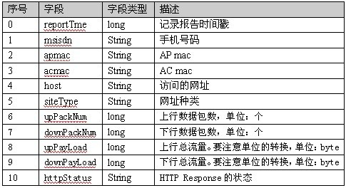

- ==需求==：使用mr，实现将不同的手机号的数据划分到6个不同的文件里面去，具体划分规则如下

```
135开头的手机号分到一个文件里面去，
136开头的手机号分到一个文件里面去，
137开头的手机号分到一个文件里面去，
138开头的手机号分到一个文件里面去，
139开头的手机号分到一个文件里面去，
其他开头的手机号分到一个文件里面去
```

- 根据mr编程8步，需要实现的代码有：
  - 一、针对输入数据，设计JavaBean
  - 二、自定义的Mapper逻辑（第二步）
  - 三、自定义的分区类（第三步）
  - 四、自定义的Reducer逻辑（第七步）
  - 五、main程序入口
- 代码实现
- 一、针对数据文件，设计JavaBean；作为map输出的value

```java
import org.apache.hadoop.io.Writable;

import java.io.DataInput;
import java.io.DataOutput;
import java.io.IOException;

//序列化与反序列化
public class FlowBean implements Writable {
    //上行包个数
    private Integer upPackNum;
    //下行包个数
    private Integer downPackNum;
    //上行总流量
    private Integer upPayLoad;
    //下行总流量
    private Integer downPayLoad;

    //反序列话的时候要用到
    public FlowBean() {
    }

    @Override
    public void write(DataOutput out) throws IOException {
        //调用序列化方法时，要用与类型匹配的write方法
        //记住序列化的顺序
        out.writeInt(upPackNum);
        out.writeInt(downPackNum);
        out.writeInt(upPayLoad);
        out.writeInt(downPayLoad);
    }

    @Override
    public void readFields(DataInput in) throws IOException {
        //发序列话的顺序要与序列化保持一直
        //使用的方法类型要匹配
        this.upPackNum = in.readInt();
        this.downPackNum = in.readInt();
        this.upPayLoad = in.readInt();
        this.downPayLoad = in.readInt();
    }

    public Integer getUpPackNum() {
        return upPackNum;
    }

    public Integer getDownPackNum() {
        return downPackNum;
    }

    public Integer getUpPayLoad() {
        return upPayLoad;
    }

    public Integer getDownPayLoad() {
        return downPayLoad;
    }

    public void setUpPackNum(Integer upPackNum) {
        this.upPackNum = upPackNum;
    }

    public void setDownPackNum(Integer downPackNum) {
        this.downPackNum = downPackNum;
    }

    public void setUpPayLoad(Integer upPayLoad) {
        this.upPayLoad = upPayLoad;
    }

    public void setDownPayLoad(Integer downPayLoad) {
        this.downPayLoad = downPayLoad;
    }

    @Override
    public String toString() {
        return "FlowBean{" +
                "upPackNum=" + upPackNum +
                ", downPackNum=" + downPackNum +
                ", upPayLoad=" + upPayLoad +
                ", downPayLoad=" + downPayLoad +
                '}';
    }
}
```

- 二、自定义Mapper类

```java
import org.apache.hadoop.io.LongWritable;
import org.apache.hadoop.io.Text;
import org.apache.hadoop.mapreduce.Mapper;

import java.io.IOException;

public class FlowMapper extends Mapper<LongWritable, Text, Text, FlowBean> {
    private FlowBean flowBean;
    private Text text;

    @Override
    protected void setup(Context context) throws IOException, InterruptedException {
        flowBean = new FlowBean();
        text = new Text();
    }

    @Override
    protected void map(LongWritable key, Text value, Context context) throws IOException, InterruptedException {
        String[] split = value.toString().split("\t");

        String phoneNum = split[1];
        //上行包个数
        String upPackNum = split[6];
        //下行包个数
        String downPackNum = split[7];
        //上行总流量
        String upPayLoad = split[8];
        //下行总流量
        String downPayLoad = split[9];

        text.set(phoneNum);

        flowBean.setUpPackNum(Integer.parseInt(upPackNum));
        flowBean.setDownPackNum(Integer.parseInt(downPackNum));
        flowBean.setUpPayLoad(Integer.parseInt(upPayLoad));
        flowBean.setDownPayLoad(Integer.parseInt(downPayLoad));

        context.write(text, flowBean);
    }
}
```

- 三、自定义分区

```java
import org.apache.hadoop.io.Text;
import org.apache.hadoop.mapreduce.Partitioner;

public class PartitionOwn extends Partitioner<Text, FlowBean> {

    @Override
    public int getPartition(Text text, FlowBean flowBean, int numPartitions) {
        String phoenNum = text.toString();

        if (null != phoenNum && !phoenNum.equals("")) {
            if (phoenNum.startsWith("135")) {
                return 0;
            } else if (phoenNum.startsWith("136")) {
                return 1;
            } else if (phoenNum.startsWith("137")) {
                return 2;
            } else if (phoenNum.startsWith("138")) {
                return 3;
            } else if (phoenNum.startsWith("139")) {
                return 4;
            } else {
                return 5;
            }
        } else {
            return 5;
        }
    }
}
```

- 自定义Reducer

```java
import org.apache.hadoop.io.Text;
import org.apache.hadoop.mapreduce.Reducer;

import java.io.IOException;

public class FlowReducer extends Reducer<Text, FlowBean, Text, Text> {

    @Override
    protected void reduce(Text key, Iterable<FlowBean> values, Context context) throws IOException, InterruptedException {
        //上行包个数
        int upPackNum = 0;
        //下行包个数
        int downPackNum = 0;
        //上行总流量
        int upPayLoad = 0;
        //下行总流量
        int downPayLoad = 0;

        for (FlowBean value : values) {
            upPackNum += value.getUpPackNum();
            downPackNum += value.getDownPackNum();
            upPayLoad += value.getUpPayLoad();
            downPayLoad += value.getDownPayLoad();
        }

        context.write(key, new Text(upPackNum + "\t" + downPackNum + "\t" + upPayLoad + "\t" + downPayLoad));
    }
}
```

- main入口

```java
import org.apache.hadoop.conf.Configuration;
import org.apache.hadoop.conf.Configured;
import org.apache.hadoop.fs.Path;
import org.apache.hadoop.io.Text;
import org.apache.hadoop.mapreduce.Job;
import org.apache.hadoop.mapreduce.lib.input.TextInputFormat;
import org.apache.hadoop.mapreduce.lib.output.TextOutputFormat;
import org.apache.hadoop.util.Tool;
import org.apache.hadoop.util.ToolRunner;

public class FlowMain extends Configured implements Tool {
    @Override
    public int run(String[] args) throws Exception {
        //获取job对象
        Job job = Job.getInstance(super.getConf(), FlowMain.class.getSimpleName());
        //如果程序打包运行必须要设置这一句
        job.setJarByClass(FlowMain.class);

        job.setInputFormatClass(TextInputFormat.class);
        TextInputFormat.addInputPath(job, new Path(args[0]));

        job.setMapperClass(FlowMapper.class);
        job.setMapOutputKeyClass(Text.class);
        job.setMapOutputValueClass(FlowBean.class);

        //设置使用的分区器
        job.setPartitionerClass(PartitionOwn.class);
        //reduce task个数
        job.setNumReduceTasks(Integer.parseInt(args[2]));

        job.setReducerClass(FlowReducer.class);
        job.setOutputKeyClass(Text.class);
        job.setOutputValueClass(Text.class);

        job.setOutputFormatClass(TextOutputFormat.class);
        TextOutputFormat.setOutputPath(job, new Path(args[1]));

        boolean b = job.waitForCompletion(true);
        return b ? 0 : 1;
    }


    public static void main(String[] args) throws Exception {
        Configuration configuration = new Configuration();
        configuration.set("mapreduce.framework.name", "local");
        configuration.set("yarn.resourcemanager.hostname", "local");

        int run = ToolRunner.run(configuration, new FlowMain(), args);
        System.exit(run);
    }

}
```

- ==注意：==对于我们自定义分区的案例，==必须打成jar包上传到集群==上面去运行，因为我们本地已经没法通过多线程模拟本地程序运行了，将我们的数据上传到hdfs上面去，然后通过 hadoop jar提交到集群上面去运行，观察我们分区的个数与reduceTask个数的关系

- ==思考==：如果手动指定6个分区，reduceTask个数设置为3个会出现什么情况

  如果手动指定6个分区，reduceTask个数设置为9个会出现什么情况

## mapreduce当中的排序

### 1. 可排序的Key

- 排序是MapReduce框架中最重要的操作之一。

  - MapTask和ReduceTask均会对数据按照key进行排序。该操作属于Hadoop的默认行为。任何应用程序中的数据均会被排序，而不管逻辑上是否需要。

  - 默认排序是按照字典顺序排序，且实现该排序的方法是快速排序。

- 对于MapTask，它会将处理的结果暂时放到环形缓冲区中，当环形缓冲区使用率达到一定阈值后，再对缓冲区中的数据进行一次快速排序，并将这些有序数据溢写到磁盘上，而当数据处理完毕后，它会对磁盘上所有文件进行归并排序。

- 对于ReduceTask，它从每个执行完成的MapTask上远程拷贝相应的数据文件

  - 如果文件大小超过一定阈值，则溢写磁盘上，否则存储在内存中。
  - 如果磁盘上文件数目达到一定阈值，则进行一次归并排序以生成一个更大文件；
  - 如果内存中文件大小或者数目超过一定阈值，则进行一次合并后将数据溢写到磁盘上。
  - 当所有数据拷贝完毕后，ReduceTask统一对内存和磁盘上的所有数据进行一次归并排序。

### 2. 排序的种类

  - 1、部分排序

    MapReduce根据输入记录的键对数据集排序。保证输出的每个文件内部有序

  - 2、全排序

    最终输出结果只有一个文件，且文件内部有序。实现方式是只设置一个ReduceTask。但该方法在处理大型文件时效率极低，因为一台机器处理所有文件，完全丧失了MapReduce所提供的并行架构

  - 3、辅助排序

    在Reduce端对key进行==分组==。应用于：在接收的key为bean对象时，如果key（bean对象）的一个或几个字段相同（全部字段比较不相同），那么这些kv对作为一组，调用一次reduce方法，可以采用==分组排序==。

  - 4、二次排序

    - 二次排序：mr编程中，需要先按输入数据的某一列a排序，如果相同，再按另外一列b排序；比如接下来的例子

    - mr自带的类型作为key无法满足需求，往往需要自定义JavaBean作为map输出的key

    - JavaBean中，使用compareTo方法指定排序规则。

### 3. 二次排序

- 数据：样本数据如下；

  每条数据有5个字段，分别是手机号、上行包总个数、下行包总个数、上行总流量、下行总流量

  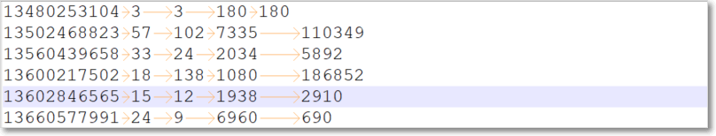

- ==需求==先对下行包总个数升序排序；若相等，再按上行总流量进行降序排序

- 根据mr编程8步，需要实现的代码有：

  - 一、针对输入数据及二次排序规则，设计JavaBean
  - 二、自定义的Mapper逻辑（第二步）
  - 三、自定义的Reducer逻辑（第七步）
  - 四、main程序入口

- 代码实现：

- 一、定义javaBean对象，用于封装数据及定义排序规则

```java
import org.apache.hadoop.io.WritableComparable;

import java.io.DataInput;
import java.io.DataOutput;
import java.io.IOException;

//bean要能够可序列化且可比较，所以需要实现接口WritableComparable
public class FlowSortBean implements WritableComparable<FlowSortBean> {
    private String phone;
    //上行包个数
    private Integer upPackNum;
    //下行包个数
    private Integer downPackNum;
    //上行总流量
    private Integer upPayLoad;
    //下行总流量
    private Integer downPayLoad;

    //用于比较两个FlowSortBean对象
    @Override
    public int compareTo(FlowSortBean o) {
        //升序
        int i = this.downPackNum.compareTo(o.downPackNum);
        if (i == 0) {
            //降序
            i = -this.upPayLoad.compareTo(o.upPayLoad);
        }
        return i;
    }

    //序列化
    @Override
    public void write(DataOutput out) throws IOException {
        out.writeUTF(phone);
        out.writeInt(upPackNum);
        out.writeInt(downPackNum);
        out.writeInt(upPayLoad);
        out.writeInt(downPayLoad);
    }

    //反序列化
    @Override
    public void readFields(DataInput in) throws IOException {
        this.phone = in.readUTF();
        this.upPackNum = in.readInt();
        this.downPackNum = in.readInt();
        this.upPayLoad = in.readInt();
        this.downPayLoad = in.readInt();
    }

    @Override
    public String toString() {
        return phone + "\t" + upPackNum + "\t" + downPackNum + "\t" + upPayLoad + "\t" + downPayLoad;
    }

    //setter、getter方法
    public String getPhone() {
        return phone;
    }

    public void setPhone(String phone) {
        this.phone = phone;
    }

    public Integer getUpPackNum() {
        return upPackNum;
    }

    public void setUpPackNum(Integer upPackNum) {
        this.upPackNum = upPackNum;
    }

    public Integer getDownPackNum() {
        return downPackNum;
    }

    public void setDownPackNum(Integer downPackNum) {
        this.downPackNum = downPackNum;
    }

    public Integer getUpPayLoad() {
        return upPayLoad;
    }

    public void setUpPayLoad(Integer upPayLoad) {
        this.upPayLoad = upPayLoad;
    }

    public Integer getDownPayLoad() {
        return downPayLoad;
    }

    public void setDownPayLoad(Integer downPayLoad) {
        this.downPayLoad = downPayLoad;
    }
}
```

- 二、自定义mapper类

```java
import org.apache.hadoop.io.LongWritable;
import org.apache.hadoop.io.NullWritable;
import org.apache.hadoop.io.Text;
import org.apache.hadoop.mapreduce.Mapper;

import java.io.IOException;

public class FlowSortMapper extends Mapper<LongWritable, Text, FlowSortBean, NullWritable> {

    private FlowSortBean flowSortBean;

    //初始化
    @Override
    protected void setup(Context context) throws IOException, InterruptedException {
        flowSortBean = new FlowSortBean();
    }

    @Override
    protected void map(LongWritable key, Text value, Context context) throws IOException, InterruptedException {
        /**
         * 手机号	上行包	下行包	上行总流量	下行总流量
         * 13480253104	3	3	180	180
         */
        String[] split = value.toString().split("\t");

        flowSortBean.setPhone(split[0]);
        flowSortBean.setUpPackNum(Integer.parseInt(split[1]));
        flowSortBean.setDownPackNum(Integer.parseInt(split[2]));
        flowSortBean.setUpPayLoad(Integer.parseInt(split[3]));
        flowSortBean.setDownPayLoad(Integer.parseInt(split[4]));

        context.write(flowSortBean, NullWritable.get());
    }
}
```

- 三、自定义reducer类

```java
import org.apache.hadoop.io.NullWritable;
import org.apache.hadoop.mapreduce.Reducer;

import java.io.IOException;

public class FlowSortReducer extends Reducer<FlowSortBean, NullWritable, FlowSortBean, NullWritable> {

    @Override
    protected void reduce(FlowSortBean key, Iterable<NullWritable> values, Context context) throws IOException, InterruptedException {
        //经过排序后的数据，直接输出即可
        context.write(key, NullWritable.get());
    }
}
```

- 四、main程序入口

```java
import org.apache.hadoop.conf.Configuration;
import org.apache.hadoop.conf.Configured;
import org.apache.hadoop.fs.Path;
import org.apache.hadoop.io.NullWritable;
import org.apache.hadoop.mapreduce.Job;
import org.apache.hadoop.mapreduce.lib.input.TextInputFormat;
import org.apache.hadoop.mapreduce.lib.output.TextOutputFormat;
import org.apache.hadoop.util.Tool;
import org.apache.hadoop.util.ToolRunner;

public class FlowSortMain extends Configured implements Tool {
    @Override
    public int run(String[] args) throws Exception {
        //获取job对象
        Job job = Job.getInstance(super.getConf(), "flowSort");
        //如果程序打包运行必须要设置这一句
        job.setJarByClass(FlowSortMain.class);

        job.setInputFormatClass(TextInputFormat.class);
        TextInputFormat.addInputPath(job,new Path(args[0]));

        job.setMapperClass(FlowSortMapper.class);
        job.setMapOutputKeyClass(FlowSortBean.class);
        job.setMapOutputValueClass(NullWritable.class);

        job.setReducerClass(FlowSortReducer.class);
        job.setOutputKeyClass(FlowSortBean.class);
        job.setOutputValueClass(NullWritable.class);

        job.setOutputFormatClass(TextOutputFormat.class);
        TextOutputFormat.setOutputPath(job,new Path(args[1]));

        boolean b = job.waitForCompletion(true);

        return b?0:1;
    }


    public static void main(String[] args) throws Exception {
        Configuration configuration = new Configuration();
        int run = ToolRunner.run(configuration, new FlowSortMain(), args);
        System.exit(run);
    }

}
```

## mapreduce中的combiner

### 1. combiner基本介绍

  - combiner类本质也是reduce聚合，combiner类继承Reducer父类

  - combine是运行在map端的，对map task的结果做聚合；而reduce是将来自不同的map task的数据做聚合

  - 作用：

    - combine可以减少map task落盘及向reduce task传输的数据量

  - 是否可以做map端combine：

    - 并非所有的mapreduce job都适用combine，无论适不适用combine，都不能对最终的结果造成影响；比如下边求平均值的例子，就不适用适用combine

    ```
    Mapper
    3 5 7 ->(3+5+7)/3=5 
    2 6 ->(2+6)/2=4
    
    Reducer
    (3+5+7+2+6)/5=23/5    不等于    (5+4)/2=9/2
    ```

### 2. 需求：

- 对于我们前面的wordCount单词计数统计，我们加上Combiner过程，实现map端的数据进行汇总之后，再发送到reduce端，减少数据的网络拷贝

- 自定义combiner类

  其实直接使用词频统计中的reducer类作为combine类即可

- 在main方法中加入

```java
 job.setCombinerClass(MyReducer.class);
```

- 运行程序，观察控制台有combiner和没有combiner的异同


## mapreduce中的GroupingComparator分组详解

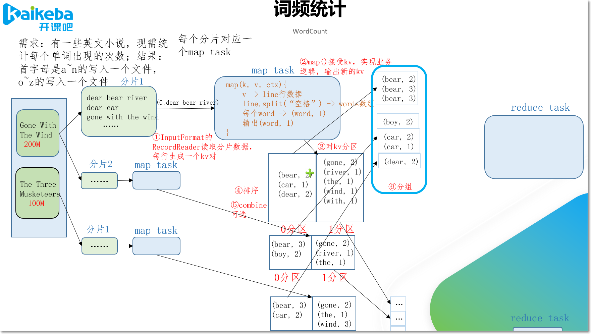

- 关键类GroupingComparator
  - 是mapreduce当中reduce端决定哪些数据作为一组，调用一次reduce的逻辑
  - 默认是key相同的kv对，作为同一组；每组调用一次reduce方法；
  - 可以自定义GroupingComparator，实现自定义的分组逻辑

### 1. 自定义WritableComparator类

  - （1）继承WritableComparator
  - （2）重写compare()方法

```java
@Override
public int compare(WritableComparable a, WritableComparable b) {
        // 比较的业务逻辑
        return result;
}
```

  - （3）创建一个构造将比较对象的类传给父类

```java
protected OrderGroupingComparator() {
        super(OrderBean.class, true);
}
```

### 2. 需求：

- 现在有订单数据如下

| **订单id**    | **商品id** | **成交金额** |
| ------------- | ---------- | ------------ |
| Order_0000001 | Pdt_01     | 222.8        |
| Order_0000001 | Pdt_05     | 25.8         |
| Order_0000002 | Pdt_03     | 322.8        |
| Order_0000002 | Pdt_04     | 522.4        |
| Order_0000002 | Pdt_05     | 822.4        |
| Order_0000003 | Pdt_01     | 222.8        |

- 现在需要求取每个订单当中金额最大的商品信息
- 根据mr编程8步，需要实现的代码有：

  - 一、针对输入数据及相同订单按金额降序排序，设计JavaBean
  - 二、自定义的Mapper逻辑（第二步）
  - 三、自定义分区器，相同订单分到同一区（第三步）
  - 四、自定义分区内排序（在JavaBean中已完成）（第四步）
  - 五、自定义分组，相同订单的为同一组（第六步）
  - 六、自定义的Reducer逻辑（第七步）
  - 七、main程序入口

### 3. 自定义OrderBean对象

```java
import org.apache.hadoop.io.WritableComparable;

import java.io.DataInput;
import java.io.DataOutput;
import java.io.IOException;

public class OrderBean implements WritableComparable<OrderBean> {
    private String orderId;
    private Double price;

    /**
     * key间的比较规则
     *
     * @param o
     * @return
     */
    @Override
    public int compareTo(OrderBean o) {
        //注意：如果是不同的订单之间，金额不需要排序，没有可比性
        int orderIdCompare = this.orderId.compareTo(o.orderId);
        if (orderIdCompare == 0) {
            //比较金额，按照金额进行倒序排序
            int priceCompare = this.price.compareTo(o.price);
            return -priceCompare;
        } else {
            //如果订单号不同，没有可比性，直接返回订单号的升序排序即可
            return orderIdCompare;
        }
    }

    /**
     * 序列化方法
     *
     * @param out
     * @throws IOException
     */
    @Override
    public void write(DataOutput out) throws IOException {
        out.writeUTF(orderId);
        out.writeDouble(price);
    }

    /**
     * 反序列化方法
     *
     * @param in
     * @throws IOException
     */
    @Override
    public void readFields(DataInput in) throws IOException {
        this.orderId = in.readUTF();
        this.price = in.readDouble();
    }

    public String getOrderId() {
        return orderId;
    }

    public void setOrderId(String orderId) {
        this.orderId = orderId;
    }

    public Double getPrice() {
        return price;
    }

    public void setPrice(Double price) {
        this.price = price;
    }

    @Override
    public String toString() {
        return orderId + "\t" + price;
    }
}
```

### 4. 自定义mapper类：

```java
import org.apache.hadoop.io.LongWritable;
import org.apache.hadoop.io.NullWritable;
import org.apache.hadoop.io.Text;
import org.apache.hadoop.mapreduce.Mapper;

import java.io.IOException;

public class GroupMapper extends Mapper<LongWritable, Text, OrderBean, NullWritable> {

    /**
     * Order_0000001	Pdt_01	222.8
     * Order_0000001	Pdt_05	25.8
     * Order_0000002	Pdt_03	322.8
     * Order_0000002	Pdt_04	522.4
     * Order_0000002	Pdt_05	822.4
     * Order_0000003	Pdt_01	222.8
     * Order_0000003	Pdt_03	322.8
     * Order_0000003	Pdt_04	522.4
     *
     * @param key
     * @param value
     * @param context
     * @throws IOException
     * @throws InterruptedException
     */
    @Override
    protected void map(LongWritable key, Text value, Context context) throws IOException, InterruptedException {
        String[] fields = value.toString().split("\t");

        OrderBean orderBean = new OrderBean();
        orderBean.setOrderId(fields[0]);
        orderBean.setPrice(Double.valueOf(fields[2]));

        //输出orderBean
        context.write(orderBean, NullWritable.get());
    }
}
```

### 5. 自定义分区类：

```java
import org.apache.hadoop.io.NullWritable;
import org.apache.hadoop.mapreduce.Partitioner;

public class GroupPartitioner extends Partitioner<OrderBean, NullWritable> {
    @Override
    public int getPartition(OrderBean orderBean, NullWritable nullWritable, int numPartitions) {
        //将每个订单的所有的记录，传入到一个reduce当中
        return orderBean.getOrderId().hashCode() % numPartitions;
    }
}
```

### 6. 自定义分组类：

```java
import org.apache.hadoop.io.WritableComparable;
import org.apache.hadoop.io.WritableComparator;

public class MyGroup extends WritableComparator {
    public MyGroup() {
        //分组类：要对OrderBean类型的k进行分组
        super(OrderBean.class, true);
    }

    @Override
    public int compare(WritableComparable a, WritableComparable b) {
        OrderBean a1 = (OrderBean) a;
        OrderBean b1 = (OrderBean) b;
        //需要将同一订单的kv作为一组
        return a1.getOrderId().compareTo(b1.getOrderId());
    }
}
```

### 7. 自定义reduce类

```java
import org.apache.hadoop.io.NullWritable;
import org.apache.hadoop.mapreduce.Reducer;

import java.io.IOException;

public class GroupReducer extends Reducer<OrderBean, NullWritable, OrderBean, NullWritable> {

    /**
     * Order_0000002	Pdt_03	322.8
     * Order_0000002	Pdt_04	522.4
     * Order_0000002	Pdt_05	822.4
     * => 这一组中有3个kv
     * 并且是排序的
     * Order_0000002	Pdt_05	822.4
     * Order_0000002	Pdt_04	522.4
     * Order_0000002	Pdt_03	322.8
     *
     * @param key
     * @param values
     * @param context
     * @throws IOException
     * @throws InterruptedException
     */
    @Override
    protected void reduce(OrderBean key, Iterable<NullWritable> values, Context context) throws IOException, InterruptedException {
        //Order_0000002	Pdt_05	822.4 获得了当前订单中进而最高的商品
        context.write(key, NullWritable.get());
    }
}
```

### 8. 定义程序入口类

```java
import org.apache.hadoop.conf.Configuration;
import org.apache.hadoop.conf.Configured;
import org.apache.hadoop.fs.Path;
import org.apache.hadoop.io.NullWritable;
import org.apache.hadoop.mapreduce.Job;
import org.apache.hadoop.mapreduce.lib.input.TextInputFormat;
import org.apache.hadoop.mapreduce.lib.output.TextOutputFormat;
import org.apache.hadoop.util.Tool;
import org.apache.hadoop.util.ToolRunner;

/**
 * 分组求top 1
 */
public class GroupMain extends Configured implements Tool {
    @Override
    public int run(String[] args) throws Exception {
        //获取job对象
        Job job = Job.getInstance(super.getConf(), "group");
        job.setJarByClass(GroupMain.class);

        //第一步：读取文件，解析成为key，value对
        job.setInputFormatClass(TextInputFormat.class);
        TextInputFormat.addInputPath(job, new Path(args[0]));

        //第二步：自定义map逻辑
        job.setMapperClass(GroupMapper.class);
        job.setMapOutputKeyClass(OrderBean.class);
        job.setMapOutputValueClass(NullWritable.class);

        //第三步：分区
        job.setPartitionerClass(GroupPartitioner.class);

        //第四步：排序  已经做了

        //第五步：规约  combiner  省掉

        //第六步：分组   自定义分组逻辑
        job.setGroupingComparatorClass(MyGroup.class);

        //第七步：设置reduce逻辑
        job.setReducerClass(GroupReducer.class);
        job.setOutputKeyClass(OrderBean.class);
        job.setOutputValueClass(NullWritable.class);

        //第八步：设置输出路径
        job.setOutputFormatClass(TextOutputFormat.class);
        TextOutputFormat.setOutputPath(job, new Path(args[1]));

        //如果设置reduce任务数为多个，必须打包到集群运行
        //job.setNumReduceTasks(3);

        boolean b = job.waitForCompletion(true);
        return b ? 0 : 1;
    }

    public static void main(String[] args) throws Exception {
        int run = ToolRunner.run(new Configuration(), new GroupMain(), args);
        System.exit(run);
    }
}
```

- ==拓展：如何求每个组当中的top2的订单金额数据？？？==

## map task工作机制


- （1）Read阶段：MapTask通过用户编写的RecordReader，从输入InputSplit中解析出一个个key/value。

- （2）Map阶段：该节点主要是将解析出的key/value交给用户编写map()函数处理，并产生一系列新的key/value。

- （3）Collect收集阶段：在用户编写map()函数中，当数据处理完成后，一般会调用OutputCollector.collect()输出结果。在该函数内部，它会将生成的key/value分区（调用Partitioner），并写入一个环形内存缓冲区中。

- （4）Spill阶段：即“溢写”，当环形缓冲区满80%后，MapReduce会将数据写到本地磁盘上，生成一个临时文件。需要注意的是，将数据写入本地磁盘之前，先要对数据进行一次本地排序，并在必要时对数据进行合并、压缩等操作。

- 溢写阶段详情：
  - 步骤1：利用快速排序算法对缓存区内的数据进行排序，排序方式是，先按照分区编号Partition进行排序，然后按照key进行排序。这样，经过排序后，数据以分区为单位聚集在一起，且同一分区内所有数据按照key有序。
  - 步骤2：按照分区编号由小到大依次将每个分区中的数据写入任务工作目录下的临时文件output/spillN.out（N表示当前溢写次数）中。如果用户设置了Combiner，则写入文件之前，对每个分区中的数据进行一次聚集操作。
  - 步骤3：将分区数据的元信息写到内存索引数据结构SpillRecord中，其中每个分区的元信息包括，在临时文件中的偏移量、压缩前数据大小和压缩后数据大小。如果当前内存索引大小超过1MB，则将内存索引写到文件output/spillN.out.index中。
  - （5）合并阶段：当所有数据处理完成后，MapTask对所有临时文件进行一次合并，以确保最终只会生成一个数据文件。
  - 当所有数据处理完后，MapTask会将所有临时文件合并成一个大文件，并保存到文件output/file.out中，同时生成相应的索引文件output/file.out.index。
  - 在进行文件合并过程中，MapTask以分区为单位进行合并。对于某个分区，它将采用多轮递归合并的方式。每轮合并io.sort.factor（默认10）个文件，并将产生的文件重新加入待合并列表中，对文件排序后，重复以上过程，直到最终得到一个大文件。

  - 让每个MapTask最终只生成一个数据文件，可避免同时打开大量文件和同时读取大量小文件产生的随机读取带来的开销。

## reduce task工作机制


### 1. reduce流程

- （1）Copy阶段：ReduceTask从各个MapTask上远程拷贝一片数据，并针对某一片数据，如果其大小超过一定阈值，则写到磁盘上，否则直接放到内存中。

- （2）Merge阶段：在远程拷贝数据的同时，ReduceTask启动了两个后台线程对内存和磁盘上的文件进行合并，以防止内存使用过多或磁盘上文件过多。

- （3）Sort阶段：当所有map task的分区数据全部拷贝完，按照MapReduce语义，用户编写reduce()函数输入数据是按key进行聚集的一组数据。为了将key相同的数据聚在一起，Hadoop采用了基于排序的策略。由于各个MapTask已经实现对自己的处理结果进行了==局部排序==，因此，ReduceTask只需对所有数据进行一次==归并排序==即可。

- （4）Reduce阶段：reduce()函数将计算结果写到HDFS上。

### 2. 设置ReduceTask并行度（个数）

- ReduceTask的并行度同样影响整个Job的执行并发度和执行效率，但与MapTask的并发数由切片数决定不同，ReduceTask数量的决定是可以直接手动设置：

  // 默认值是1，手动设置为4

  `job.setNumReduceTasks(4);`

### 3. 实验：测试ReduceTask多少合适

- （1）实验环境：1个Master节点，16个Slave节点：CPU:8GHZ，内存: 2G

- （2）实验结论：

- 表4-3 改变ReduceTask （数据量为1GB）

| **MapTask   =16** |      |      |      |      |      |      |      |      |      |      |
| ----------------- | ---- | ---- | ---- | ---- | ---- | ---- | ---- | ---- | ---- | ---- |
| ReduceTask        | 1    | 5    | 10   | 15   | 16   | 20   | 25   | 30   | 45   | 60   |
| 总时间            | 892  | 146  | 110  | 92   | 88   | 100  | 128  | 101  | 145  | 104  |

## mapreduce完整流程

### 1. map简图


### 2. reduce简图

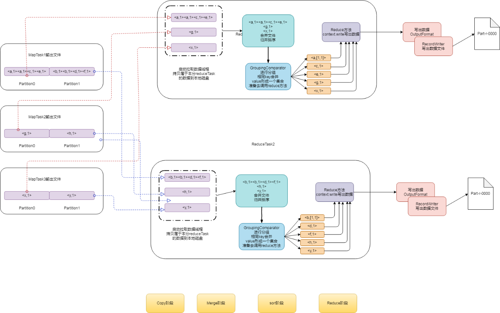

### 3. mapreduce简略步骤

- 第一步：读取文件，解析成为key，value对
- 第二步：自定义map逻辑接受k1,v1，转换成为新的k2,v2输出；写入环形缓冲区
- 第三步：分区：写入环形缓冲区的过程，会给每个kv加上分区Partition index。（同一分区的数据，将来会被发送到同一个reduce里面去）
- 第四步：排序：当缓冲区使用80%，开始溢写文件
  - 先按partition进行排序，相同分区的数据汇聚到一起；
  - 然后，每个分区中的数据，再按key进行排序
- 第五步：combiner。调优过程，对数据进行map阶段的合并（注意：并非所有mr都适合combine）
- 第六步：将环形缓冲区的数据进行溢写到本地磁盘小文件
- 第七步：归并排序，对本地磁盘溢写小文件进行归并排序
- 第八步：等待reduceTask启动线程来进行拉取数据
- 第九步：reduceTask启动线程，从各map task拉取属于自己分区的数据
- 第十步：从mapTask拉取回来的数据继续进行归并排序
- 第十一步：进行groupingComparator分组操作
- 第十二步：调用reduce逻辑，写出数据
- 第十三步：通过outputFormat进行数据输出，写到文件，一个reduceTask对应一个结果文件


## Practice


### WordCount


# YARN

## 简介


## 系统架构

## 运行原理

## 调度器


