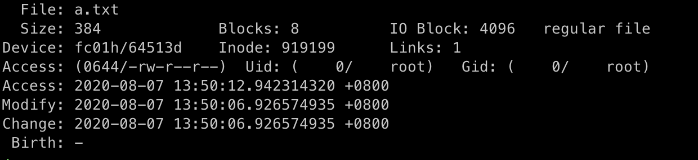
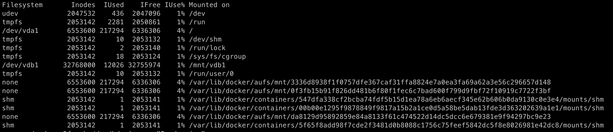
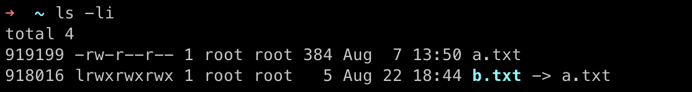
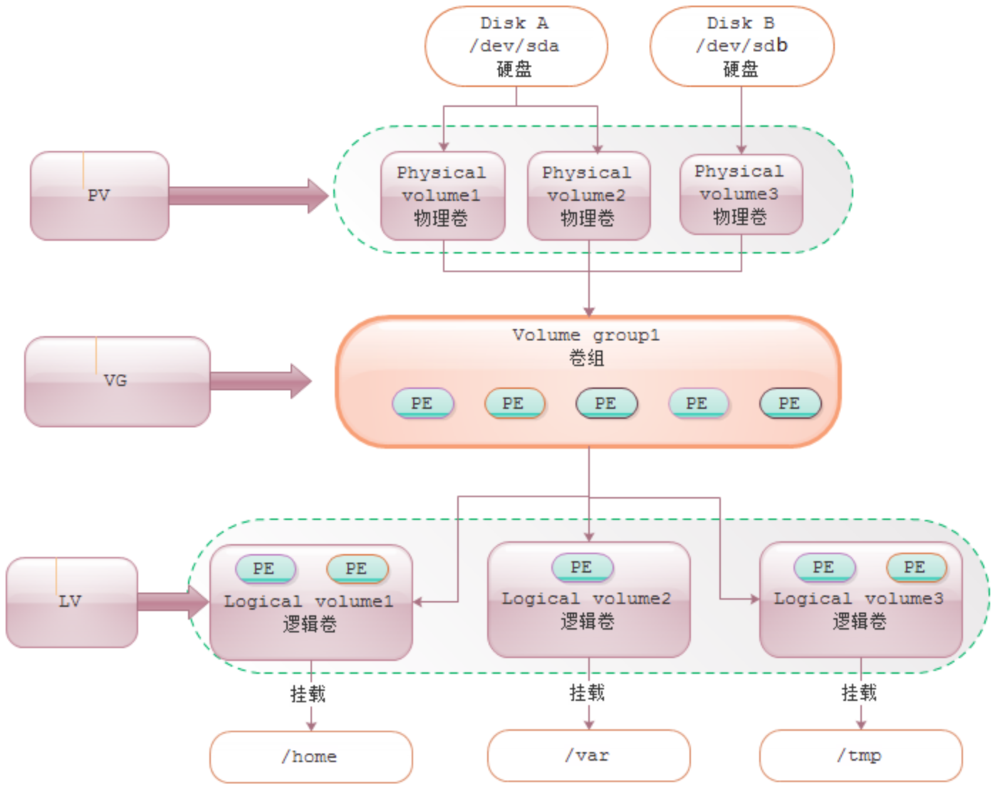
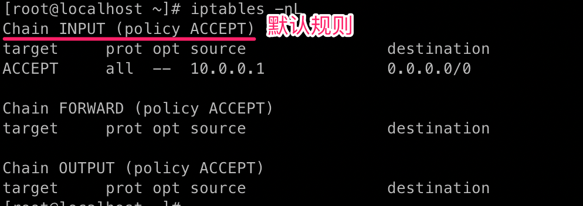
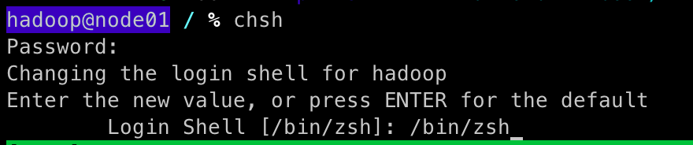
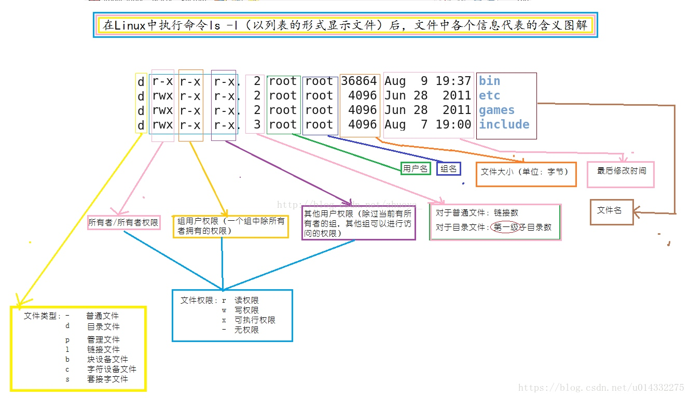
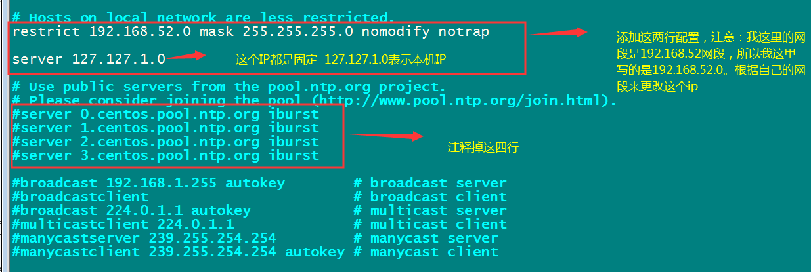

## 理论基础

### 系统

**CPU上下文切换**
先把前一个任务的CPU上下文（也就是CPU寄存器和程序计数器)保存起来，然后加载新任务的上下文到这些寄存器和程序计数器，最后在跳转到程序计数器所指的新位置，运行新任务。

1. 进程上下文切换
2. 线程上下文切换
3. 中断上下文切换

**自愿上下文切换** 进程无法获取所需资源，导致的上下文切换。比如：I/O、内存等系统资源不足时，就会发生自愿上下文切换。

**非自愿上下文切换** 则是指进程由于时间片已到等原因，被系统强制调度，进而发生的上下文切换。比如：大量进程都在争抢CPU时，就容易发生自愿上下文切换。

**进程组** 表示一组相互关联的进程，比如每个子进程都是父进程所在组的成员

**会话** 指共享同一个控制终端的一个或多个进程组


#### 进程

##### 状态

* **R**  是 Running 或 Runnable 的缩写，表示进程在 CPU 的就绪队列中，正在运行或者正在等待运行。
* **D**  是 Disk Sleep 的缩写，也就是不可中断状态睡眠（Uninterruptible Sleep），一般表示进程正在跟硬件交互，并且交互过程不允许被其他进程或中断打断。
* **Z**  是 Zombie 的缩写，它表示僵尸进程，也就是进程实际上已经结束了，但是父进程还没有回收它的资源（比如进程的描述符、PID 等）。
* **S**  是 Interruptible Sleep 的缩写，也就是可中断状态睡眠，表示进程因为等待某个事件而被系统挂起。当进程等待的事件发生时，它会被唤醒并进入 R 状态。
* **I**  是 Idle 的缩写，也就是空闲状态，用在不可中断睡眠的内核线程上。前面说了，硬件交互导致的不可中断进程用 D 表示，但对某些内核线程来说，它们有可能实际上并没有任何负载，用 Idle 正是为了区分这种情况。要注意，D 状态的进程会导致平均负载升高， I 状态的进程却不会。
* **T** Stopped 或 Traced 的缩写，表示进程处于暂停或者跟踪状态。
* **X** Dead 的缩写，表示进程已经消亡，所以你不会在 top 或者 ps 命令中看到它。

对于BSD格式，使用stat关键字时，可能会显示其他字符：

* **<** 高优先级（对其他用户不好）
* **N** 低优先级（对其他用户不错）
* **L** 将页面锁定到内存中（用于实时和自定义IO）
* **s** 进程是一个会话的领导进程
* **l** 是多线程的（使用CLONE_THREAD，就像NPTL pthreads那样）
* **+** 前台进程组

### inode

#### 什么是inode

文件储存在硬盘上，硬盘的最小存储单位叫做"扇区"（Sector）。每个扇区储存512字节（相当于0.5KB）。

操作系统读取硬盘的时候，不会一个个扇区地读取，这样效率太低，而是一次性连续读取多个扇区，即一次性读取一个"块"（block）。这种由多个扇区组成的"块"，是文件存取的最小单位。"块"的大小，最常见的是4KB，即连续八个 sector组成一个 block。

文件数据都储存在"块"中，那么很显然，我们还必须找到一个地方储存文件的元信息，比如文件的创建者、文件的创建日期、文件的大小等等。这种储存文件元信息的区域就叫做inode，中文译名为"索引节点"。

每一个文件都有对应的inode，里面包含了与该文件有关的一些信息。

#### inode 内容

inode包含文件的元信息，具体来说有以下内容：

* 文件的字节数

* 文件拥有者的User ID

* 文件的Group ID

* 文件的读、写、执行权限

* 文件的时间戳，共有三个：ctime指inode上一次变动的时间，mtime指文件内容上一次变动的时间，atime指文件上一次打开的时间。

* 链接数，即有多少文件名指向这个inode

* 文件数据block的位置

可以用stat命令，查看某个文件的inode信息：

```bash
stat a.txt
```



除了文件名以外的所有文件信息，都存在inode之中。至于为什么没有文件名，下文会有详细解释。

#### inode的大小

inode也会消耗硬盘空间，所以硬盘格式化的时候，操作系统自动将硬盘分成两个区域。一个是数据区，存放文件数据；另一个是inode区（inode table），存放inode所包含的信息。

每个inode节点的大小，一般是128字节或256字节。inode节点的总数，在格式化时就给定，一般是每1KB或每2KB就设置一个inode。假定在一块1GB的硬盘中，每个inode节点的大小为128字节，每1KB就设置一个inode，那么inode table的大小就会达到128MB，占整块硬盘的12.8%。

查看每个硬盘分区的inode总数和已经使用的数量，可以使用df命令。

```bash
df -i
```



查看每个inode节点的大小，可以用如下命令：

```bash
dumpe2fs -h /dev/vdb1 | grep "Inode size"
```


由于每个文件都必须有一个inode，因此有可能发生inode已经用光，但是硬盘还未存满的情况。这时，就无法在硬盘上创建新文件。

#### inode号码

每个inode都有一个号码，操作系统用inode号码来识别不同的文件。

这里值得重复一遍，Unix/Linux系统内部不使用文件名，而使用inode号码来识别文件。对于系统来说，文件名只是inode号码便于识别的别称或者绰号。

表面上，用户通过文件名，打开文件。实际上，系统内部这个过程分成三步：首先，系统找到这个文件名对应的inode号码；其次，通过inode号码，获取inode信息；最后，根据inode信息，找到文件数据所在的block，读出数据。

使用ls -i命令，可以看到文件名对应的inode号码：

```bash
ls -i example.txt
```

#### 目录文件

Unix/Linux系统中，目录（directory）也是一种文件。打开目录，实际上就是打开目录文件。

目录文件的结构非常简单，就是一系列目录项（dirent）的列表。每个目录项，由两部分组成：所包含文件的文件名，以及该文件名对应的inode号码。

```bash
ls /etc     # 列出目录文件中的所有文件名
ls -i /etc  # 列出整个目录文件，即文件名和inode号码
```

如果要查看文件的详细信息，就必须根据inode号码，访问inode节点，读取信息。

理解了上面这些知识，就能理解目录的权限。目录文件的读权限（r）和写权限（w），都是针对目录文件本身。由于目录文件内只有文件名和inode号码，所以如果只有读权限，只能获取文件名，无法获取其他信息，因为其他信息都储存在inode节点中，而读取inode节点内的信息需要目录文件的执行权限（x）。

#### 硬链接

一般情况下，文件名和inode号码是"一一对应"关系，每个inode号码对应一个文件名。但是，Unix/Linux系统允许，多个文件名指向同一个inode号码。

这意味着，可以用不同的文件名访问同样的内容；对文件内容进行修改，会影响到所有文件名；但是，删除一个文件名，不影响另一个文件名的访问。这种情况就被称为"硬链接"（hard link）。

```bash
ln 源文件 目标文件     # 创建硬链接
ln a.txt b.txt
ls -li			
```


源文件与目标文件的inode号码相同，都指向同一个inode。inode信息中有一项叫做"链接数"，记录指向该inode的文件名总数，这时就会增加1。

反过来，删除一个文件名，就会使得inode节点中的"链接数"减1。当这个值减到0，表明没有文件名指向这个inode，系统就会回收这个inode号码，以及其所对应block区域。

创建目录时，默认会生成两个目录项："."和".."。前者的inode号码就是当前目录的inode号码，等同于当前目录的"硬链接"；后者的inode号码就是当前目录的父目录的inode号码，等同于父目录的"硬链接"。所以，任何一个目录的"硬链接"总数，总是等于2加上它的子目录总数（含隐藏目录）。

#### 软链接

文件A和文件B的inode号码虽然不一样，但是文件A的内容是文件B的路径。读取文件A时，系统会自动将访问者导向文件B。因此，无论打开哪一个文件，最终读取的都是文件B。这时，文件A就称为文件B的"软链接"（soft link）或者"符号链接（symbolic link）。

这意味着，文件A依赖于文件B而存在，如果删除了文件B，打开文件A就会报错："No such file or directory"。这是软链接与硬链接最大的不同：文件A指向文件B的文件名，而不是文件B的inode号码，文件B的inode"链接数"不会因此发生变化。

```bash
ln -s 源文文件或目录 目标文件或目录
ln -s a.txt b.txt
ls -li
```



#### inode的特殊作用

由于inode号码与文件名分离，这种机制导致了一些Unix/Linux系统特有的现象。

1. 有时，文件名包含特殊字符，无法正常删除。这时，直接删除inode节点，就能起到删除文件的作用。

2. 移动文件或重命名文件，只是改变文件名，不影响inode号码。

3. 打开一个文件以后，系统就以inode号码来识别这个文件，不再考虑文件名。因此，通常来说，系统无法从inode号码得知文件名。

第3点使得软件更新变得简单，可以在不关闭软件的情况下进行更新，不需要重启。因为系统通过inode号码，识别运行中的文件，不通过文件名。更新的时候，新版文件以同样的文件名，生成一个新的inode，不会影响到运行中的文件。等到下一次运行这个软件的时候，文件名就自动指向新版文件，旧版文件的inode则被回收。

#### 来源

https://www.ruanyifeng.com/blog/2011/12/inode.html


### LVM

#### LVM基本组成

LVM利用Linux内核的[device-mapper](http://sources.redhat.com/dm/)功能来实现存储系统的虚拟化（系统分区独立于底层硬件）。 通过LVM，你可以实现存储空间的抽象化并在上面建立虚拟分区（virtual partitions），可以更简便地扩大和缩小分区，可以增删分区时无需担心某个硬盘上没有足够的连续空间，避免为正在使用的磁盘重新分区的麻烦、为调整分区而不得不移动其他分区的不便。

LVM的基本组成部分如下：

- 物理卷 (PV)

  一个可供存储LVM的块设备. 例如: 一块硬盘, 一个MBR或GPT[分区](https://wiki.archlinux.org/index.php/Partitioning_(简体中文)), 一个回环文件, 一个被内核映射的设备 (例如 [dm-crypt](https://wiki.archlinux.org/index.php/Dm-crypt_(简体中文))).它包含一个特殊的LVM头。

- 卷组 (VG)

  物理卷的一个组，作为存放逻辑卷的容器。 PEs are allocated from a VG for a LV.

- 逻辑卷 (LV)

  "虚拟/逻辑卷"存放在一个卷组中并由物理块组成。是一个类似于物理设备的块设备，例如，你可以直接在它上面创建一个文件系统[文件系统](https://wiki.archlinux.org/index.php/File_systems_(简体中文))。

- 物理块 (PE)

  一个卷组中最小的连续区域(默认为4 MiB)，多个物理块将被分配给一个逻辑卷。你可以把它看成物理卷的一部分，这部分可以被分配给一个逻辑卷。

  


示例:

```
物理硬盘
                 
   硬盘1 (/dev/sda):
      _ _ _ _ _ _ _ _ _ _ _ _ _ _ _ _ _ _ _ _ _ _ _ _ _ _ _ _ _ _ _ 
     |分区1 50GB (物理卷)           |分区2 80GB (物理卷)             |
     |/dev/sda1                    |/dev/sda2                     |
     |_ _ _ _ _ _ _ _ _ _ _ _ _ _ _|_ _ _ _ _ _ _ _ _ _ _ _ _ _ __|
                                   
   硬盘2 (/dev/sdb):
      _ _ _ _ _ _ _ _ _ _ _ _ _ _ _ _ _ _ _ _ _ _ _
     |分区1 120GB (物理卷)                          |
     |/dev/sdb1                                   |
     | _ _ _ _ _ _ _ _ _ _ _ _ _ _ _ _ _ _ _ _ _ _|

LVM逻辑卷
 
   卷组（Volume Group1） (/dev/MyVolGroup/ = /dev/sda1 + /dev/sda2 + /dev/sdb1):
  _ _ _ _ _ _ _ _ _ _ _ _ _ _ _ _ _ _ _ _ _ _ _ _ _ _ _ _ _ _ _ _ _ _ _ _ _ _ _ _ _ _ _ _ _
  |逻辑卷1 15GB                  |逻辑卷2 35GB                    |逻辑卷3 200GB             |
  |/dev/MyVolGroup/rootvol      |/dev/MyVolGroup/homevol        |/dev/MyVolGroup/mediavol |
  |_ _ _ _ _ _ _ _ _ _ _ _ _ _ _|_ _ _ _ _ _ _ _ _ _ _ _ _ _ _ _|_ _ _ _ _ _ _ _ _ _ _ _ _|
```

#### 优点

比起普通的硬盘分区管理方式，LVM更富于灵活性：

- 将多块硬盘看作一块大硬盘
- 使用逻辑卷（LV），可以创建跨越众多硬盘空间的分区。
- 可以创建小的逻辑卷（LV），在空间不足时再动态调整它的大小。
- 在调整逻辑卷（LV）大小时可以不用考虑逻辑卷在硬盘上的位置，不用担心没有可用的连续空间。
- 可以在线（online）对逻辑卷（LV）和卷组（VG）进行创建、删除、调整大小等操作。不过LVM上的文件系统也需要重新调整大小，好在某些文件系统（例如ext4）也支持在线操作。
- 无需重新启动服务，就可以将服务中用到的逻辑卷（LV）在线（online）/动态（live）迁移至别的硬盘上。
- 允许创建快照，可以保存文件系统的备份，同时使服务的下线时间（downtime）降低到最小。
- 支持各种设备映射目标（device-mapper targets），包括透明文件系统加密和缓存常用数据（caching of frequently used data）。这将允许你创建一个包含一个或多个磁盘、并用LUKS加密的系统，使用[LVM on top](https://wiki.archlinux.org/index.php/Dm-crypt/Encrypting_an_entire_system#LVM_on_LUKS) 可轻松地管理和调整这些独立的加密卷 （例如. `/`, `/home`, `/backup`等) 并免去开机时多次输入密钥的麻烦。

#### 缺点

- 在系统设置时需要更复杂的额外步骤。
- Windows系统并不支持LVM，若使用双系统，你将无法在Windows上访问LVM分区。

```bash
lvmdiskscan    			# 列出可被用作物理卷的设备
pvcreate DEVICE			# 在列出的设备上创建物理卷
pvdisplay						# 查看已创建好的物理卷
# 创建完成物理卷（PV）之后，下一步就是在该物理卷创建卷组（VG）了
vgcreate <volume_group> <physical_volume>   

```


### 目录结构

* **/bin** 最经常使用的命令

* **/boot** 启动Linux时使用的一些核心文件，包括一些连接文件以及镜像文件。

* **/dev** 存放的是Linux的外部设备，在Linux中访问设备的方式和访问文件的方式是相同的。

* **/etc** 系统管理所需要的配置文件和子目录

* **/home** 用户的主目录

* **/lib** 存放着系统最基本的动态连接共享库

* **/lost+found** 这个目录一般情况下是空的，当系统非法关机后，这里就存放了一些文件

* **/media** linux系统会自动识别一些设备，例如U盘、光驱等等，当识别后，linux会把识别的设备挂载到这个目录下。

* **/mnt** 让用户临时挂载别的文件系统的

* **/opt**  给主机额外安装软件所摆放的目录。 一些大型软件的安装目录，或者是一些服务程序的安装目录。 比如你安装一个ORACLE数据库则就可以放到这个目录下。默认是空的。

  > **/opt** 这里主要存放那些可选的程序。你想尝试最新的firefox测试版吗?那就装到/opt目录下吧，这样，当你尝试完，想删掉firefox的时候，你就可 以直接删除它，而不影响系统其他任何设置。安装到/opt目录下的程序，它所有的数据、库文件等等都是放在同个目录下面。

* **/proc** 一个虚拟的目录，它是系统内存的映射，我们可以通过直接访问这个目录来获取系统信息

* **/root** 目录为系统管理员

* **/sbin** s就是Super User的意思，这里存放的是系统管理员使用的系统管理程序

* **/selinux** Redhat/CentOS所特有的目录，Selinux是一个安全机制，类似于windows的防火墙，但是这套机制比较复杂，这个目录就是存放selinux相关的文件的。

* **/srv** 该目录存放一些服务启动之后需要提取的数据。

* **/sys** sysfs文件系统集成了下面3种文件系统的信息：针对进程信息的proc文件系统、针对设备的devfs文件系统以及针对伪终端的devpts文件系统。

* **/tmp** 存放一些临时文件

* **/usr** 用户的很多应用程序和文件都放在这个目录下，类似于windows下的program files目录

  * **/usr/bin** 系统用户使用的应用程序。

  * **/usr/sbin** 超级用户使用的比较高级的管理程序和系统守护程序。

  * **/usr/src** 内核源代码默认的放置目录。

  * **/usr/local** 安装软件的目录，这个目录就相当于在windows下的programefiles这个目录 

    > **/usr/local** 这里主要存放那些手动安装的软件，即 不是通过**yum**或**apt-get**安装的软件

  * **/usr/local/bin** 用户放置自己的可执行程序的地方

* **/var** 这个目录中存放着在不断扩充着的东西，我们习惯将那些经常被修改的目录放在这个目录下。包括各种日志文件

* **/run** 是一个临时文件系统，存储系统启动以来的信息


## 网络管理

### net-tools vs iproute

### 网络接口命名修改

网卡命名规则受 `biosdevname `和`net.ifnames`两个参数影响

编辑`/etc/default/grub`文件，增加`biosdevname=0`和`net.ifnames=0`

更新 grub `grub2-mkconfig -o /boot/grub2/grub.cfg`  reboot生效

| biosdevname | net.ifnames | 网卡名 |
| ----------- | ----------- | ------ |
| 0           | 1           | ens33  |
| 1           | 0           | em1    |
| 0           | 0           | eth0   |


### ifconfig

```bash
ifconfig <接口> <IP地址> <子网掩码>
```


### ifup

```bash
ifup <接口>     # 启用网卡
```


### ifdown

```bash
ifdown <接口>     # 禁用网卡
```


### mii-tool 

```bash
mii-tool eth0 						# 查看物理连接情况 
```

### route

```bash
route 										# 查看路由
route add default gw <网关ip>				# 添加网关
route add -host <指定ip> gw <网关ip>
route add -net <指定网段> netmask <子网掩码>  gw <网关ip>
```


### ip

```bash
ip add ls      # ifconfig
ip link set dev eth0 up     # ifup eth0
ip addr add 10.0.0.1/24 dev eth1    # ifconfig eth1 10.0.0.1 netmask 255.255.255.0
ip route add 10.0.0/24 via 192.168.0.1   # route add -net 10.0.0.0 netmask 255.255.255.0 gw 192.168.0.1
```

### ping

### traceroute

```bash
traceroute -w 1 www.bing.com   
```

### mtr


### nslookup

```bash
nslookup www.bing.com
```

### dig

即Domain Information Groper。

`yum install bind-utils`

### telnet

```bash
telnet www.bing.com 80 				# 检查目标端口是否打开
```


### tcpdump

`apt install tcpdump`

一个常用的网络抓包工具，常用来分析各种网络问题。 

#### Options

```
-a：尝试将网络和广播地址转换成名称；
-c<数据包数目>：收到指定的数据包数目后，就停止进行倾倒操作；
-d：把编译过的数据包编码转换成可阅读的格式，并倾倒到标准输出；
-dd：把编译过的数据包编码转换成C语言的格式，并倾倒到标准输出；
-ddd：把编译过的数据包编码转换成十进制数字的格式，并倾倒到标准输出；
-e：在每列倾倒资料上显示连接层级的文件头；
-f：用数字显示网际网络地址；
-F<表达文件>：指定内含表达方式的文件；
-i<网络界面>：使用指定的网络截面送出数据包；
-l：使用标准输出列的缓冲区；
-n：不把主机的网络地址转换成名字；
-N：不列出域名；
-O：不将数据包编码最佳化；
-p：不让网络界面进入混杂模式；
-q ：快速输出，仅列出少数的传输协议信息；
-r<数据包文件>：从指定的文件读取数据包数据；
-s<数据包大小>：设置每个数据包的大小；
-S：用绝对而非相对数值列出TCP关联数；
-t：在每列倾倒资料上不显示时间戳记；
-tt： 在每列倾倒资料上显示未经格式化的时间戳记；
-T<数据包类型>：强制将表达方式所指定的数据包转译成设置的数据包类型；
-v：详细显示指令执行过程；
-vv：更详细显示指令执行过程；
-x：用十六进制字码列出数据包资料；
-w <数据包文件>：把数据包数据写入指定的文件。
```

#### 实例

```bash
# 监视指定网络接口的数据包 如果不指定网卡，默认tcpdump只会监视第一个网络接口，一般是eth0，下面的例子都没有指定网络接口。
tcpdump -i eth1
# 打印所有进入或离开sundown的数据包。
tcpdump host sundown
# 截获所有210.27.48.1 的主机收到的和发出的所有的数据包
tcpdump host 210.27.48.1
# 打印helios 与 hot 或者与 ace 之间通信的数据包
tcpdump host helios and \( hot or ace \)
# 截获主机210.27.48.1 和主机210.27.48.2 或210.27.48.3的通信
tcpdump host 210.27.48.1 and \ (210.27.48.2 or 210.27.48.3 \)
# 打印ace与任何其他主机之间通信的IP 数据包, 但不包括与helios之间的数据包.
tcpdump ip host ace and not helios
# 获取主机210.27.48.1除了和主机210.27.48.2之外所有主机通信的ip包
tcpdump ip host 210.27.48.1 and ! 210.27.48.2
# 截获主机hostname发送的所有数据
tcpdump -i eth0 src host hostname
# 监视所有送到主机hostname的数据包
tcpdump -i eth0 dst host hostname
# 监视指定主机和端口的数据包
# 获取主机210.27.48.1接收或发出的telnet包
tcpdump tcp port 23 host 210.27.48.1
# 对本机的udp 123 端口进行监视
tcpdump udp port 123
# 监视指定网络的数据包
# 打印本地主机与Berkeley网络上的主机之间的所有通信数据包
tcpdump net ucb-ether
# 打印所有通过网关snup的ftp数据包
tcpdump 'gateway snup and (port ftp or ftp-data)'
# 打印所有源地址或目标地址是本地主机的IP数据包
tcpdump ip and not net localnet
```

- iptraf: 按连接/端口查看流量
- ifstat: 按设备查看流量
- ethtool: 诊断工具
- ss: 连接查看工具
- 其他: dstat, slurm, nload, bmon

### netstat

```bash
netstat -ntlp  					# 
```

### ss

```bash
ss -plat 					# -u 则检查 UDP 端口
ss -ntpl
```


### nethogs

按进程查看流量占用

### nc

```bash
# 端口扫描
nc -z -v -n 127.0.0.1 21-25			
# 使用netcat 连接服务抓取他们的banner
nc -v 127.0.0.1 9999

# 聊天
$nc -l 3000      				# server
$nc 127.0.0.1 3000		  # client

# 文件传输
$nc -l 3000 < file.txt							# server
$nc -n 127.0.0.1 3000 > file.txt		# client
```

### netstat

`yum install -y net-tools` 

```bash
netstat -ltnp  			# 列出端口	
# -u 则检查 UDP 端口
netstat -anop|more 		# 查看网络队列
```

### iptables

`/etc/sysconfig/iptables`

```bash
iptables -t filter -A INPUT -s 10.0.0.1 -j ACCEPT			# 添加规则
iptables -L 				# 查看规则,会对ip进行反向查询 
iptables -nvL				# 详细规则
```



#### filter

```bash
iptables -F 								# 清除所有规则
iptables -P INPUT DROP    	# 默认规则
iptables -A INPUT -s 10.0.0.1 -j ACCEPT	  # 接受数据包
iptables -A INPUT -s 10.0.0.1/24 -j ACCEPT   # 整个网段可以访问
iptables -A INPUT -s 10.0.0.1 -j DROP			# 丢弃数据包
iptables -I INPUT -s 10.0.0.1 -j DROP	    # 插入到规则的第一条
iptables -D INPUT -s 10.0.0.1 -j DROP      # 删除规则，或者-D后面跟序号
iptables -t filter -A INPUT -i eth0 -s 10.0.0.2 -p tcp -dport 80 -j ACCEPT # 允许10.0.0.2通过eth0进入，访问本机80端
iptables -A OUTPUT -d 10.0.0.2  -j REJECT   # 禁止访问目标IP 10.0.0.2 
```

#### nat表

```bash
iptables -t nat -A PREROUTING -i eth0 -d 114.115.116.117 -p tcp --dport 80 -j DNAT --to-destination  10.0.0.1     # 把通过eth0访问114.115.116.117 的数据转发到10.0.0.1
iptables -t nat -A POSTROUTING -s 10.0.0.0/24 -o eth1 -j SNAT --to-source 111.112.113.114 
# 内网通过eth1，ip 111.112.113.114的地址上网
```


### firewalld

使用python对iptables的包装，更易用

```bash
systemctl status firewalld.service   # 查看状态
systemctl stop firewalld.service #停止firewall
systemctl disable firewalld.service #禁止firewall开机启动
systemctl enable iptables.service #设置防火墙开机启动
systemctl restart iptables.service #重启防火墙使配置生效
```

#### 开启端口

```bash
firewall-cmd --zone=public --add-port=80/tcp --permanent
```

* **--zone**  作用域
* **--add-port=80/tcp**  添加端口，格式为：端口/通讯协议
* **--permanent** 永久生效，没有此参数重启后失效

#### 常用命令

```bash
firewall-cmd --list-all						   					 # 检查新的防火墙规则
firewall-cmd --state                           # 查看防火墙状态，是否是running
firewall-cmd --reload                          # 重新载入配置，比如添加规则之后，需要执行此命令
firewall-cmd --get-zones                       # 列出支持的zone
firewall-cmd --get-active-zones							 # 
firewall-cmd --get-services                    # 列出支持的服务，在列表中的服务是放行的
firewall-cmd --query-service ftp               # 查看ftp服务是否支持，返回yes或者no
firewall-cmd --add-service=ftp                 # 临时开放ftp服务
firewall-cmd --add-service=ftp --permanent     # 永久开放ftp服务
firewall-cmd --remove-service=ftp --permanent  # 永久移除ftp服务
firewall-cmd --add-port=80/tcp --permanent     # 永久添加80端口 
iptables -L -n                                 # 查看规则，这个命令是和iptables的相同的
man firewall-cmd                               # 查看帮助
```


### wget 

```bash
# 下载oracle jdk
wget -c --header "Cookie: oraclelicense=accept-securebackup-cookie" https://download.oracle.com/otn-pub/java/jdk/8u191-b12/2787e4a523244c269598db4e85c51e0c/jdk-8u191-li
```


## 进程管理

进程有5种状态

1. 运行(正在运行或在运行队列中等待)
2. 中断(休眠中, 受阻, 在等待某个条件的形成或接受到信号)
3. 不可中断(收到信号不唤醒和不可运行, 进程必须等待直到有中断发生)
4. 僵死(进程已终止, 但进程描述符存在, 直到父进程调用wait4()系统调用后释放)
5. 停止(进程收到SIGSTOP, SIGTSTP, SIGTTIN, SIGTTOU信号后停止运行运行)

### ps (process status)

#### Options

- a 显示所有进程
- -a 显示同一终端下的所有程序
- -A 显示所有进程
- c 显示进程的真实名称
- -N 反向选择
- -e 等于“-A”
- e 显示环境变量
- f 显示程序间的关系
- -H 显示树状结构
- r 显示当前终端的进程
- T 显示当前终端的所有程序
- u 指定用户的所有进程
- -au 显示较详细的资讯
- -aux 显示所有包含其他使用者的行程
- -C<命令> 列出指定命令的状况
- –lines<行数> 每页显示的行数
- –width<字符数> 每页显示的字符数
- –help 显示帮助信息
- –version 显示版本显示

```bash
ps -aef
ps -eLf       # 显示线程数
ps aux --sort -rss | head  # 查看内存占用10的进程
ps -aux | sort -k4nr | head -n 10  # 查看内存占用10的进程
ps -e -o "%C : %p : %z : %a"|sort -k5 -nr 		# 查看进程，按内存从大到小
ps -e -o "%C : %p : %z : %a"|sort -nr					# 查看进程，按CPU利用率从大到小排序
```

### pstree


### top

```bash
top -c -b -o +%MEM | head -n 20 | tail -15		# 查看内存占用并且排序
top -H -p pid          # 显示进程的所有线程
```

### lsof

来查看开启的套接字和文件。

```bash
lsof -iTCP -sTCP:LISTEN -P -n
lsof -p pid 				# 查看进程打开了那些文件
lsof -i:8700 或者 lsof -i | grep 8700  # 查找被占用的端口
```

### 

### nice

调整进程优先级

### renice

重新调整进程优先级


### &、ctrl + z、fg、bg、jobs

进程作业控制

- **&** 后台执行命令
- **ctrl + z** 将一个正在前台执行的命令放到后台，并且暂停
- **jobs** 查看当前有多少在后台运行的命令
- **fg** 将后台中的命令调至前台继续运行
- **bg** 将一个在后台暂停的命令，变成继续执行

```bash
$ htop
# 按下 ctrl+z htop 后台执行
[1]+  Stopped                 htop
$ jobs -l
[1]+ 46989 Stopped                 htop
$ bg
[1]+ htop &

[1]+  Stopped                 htop
$ fg
htop
$ fg %jobnumber  # jobnumber jobs查询到的命令的序号
```

### kill

```bash
kill -l  				# 查看系统支持的所有信号
```

### nohup


### disown

### supervisor 

> 一个管理进程的工具，可以随系统启动而启动服务，它还时刻监控服务进程，如果服务进程意外退出，Supervisor可以自动重启服务。


## 系统管理

### systemctl

服务集中管理工具

服务文件的默认路径`/lib/systemd/system`


### SELinux

```bash
# 查看SELinux
getenforce
/usr/sbin/sestatus
ps -Z 
ls -Z
id -Z

# 关闭SELinux
setenforce 0									# 临时
/etc/selinux/sysconfig				# 持久
```

### free

查看内存使用率


### fdisk

```bash
fdisk -l 
ls -l /dev/sd?      # 查看所有的磁盘，从abc依次往下
ls -l /dev/sd??     # 查看所有磁盘的所有分区

fdisk  /dev/sdb       # 对磁盘进行分区，进入分区页面
```

> 磁盘容量>2T,需要使用parted进行分区

### mkfs  

```bash
mkfs.xfs /dev/sdb1     # 使用xfs文件系统格式化分区
```


### mount

```bash
mount /dev/vdb1 /mnt/vdb1
mount -o uquota,gquota /dev/vdb1/ /mnt/vdb1    # 让挂载的磁盘支持用户磁盘配额和组磁盘配额 xfs格式磁盘支持
df -h
```

##### 开机自动挂在

`edit /etc/fstab`

```bash
/dev/sda3      /mnt/disk1         ext4    defaults        1 1 
# 测试文件修改正确
mount -a
```

- 第一列为设备号或该设备的卷标 	
- 第二列为挂载点 	
- 第三列为文件系统 	
- 第四列为文件系统参数 	
- 第五列为是否可以用demp命令备份。0：不备份，1：备份，2：备份，但比1重要性小。设置了该参数后，Linux中使用dump命令备份系统的时候就可以备份相应设置的挂载点了。
- 第六列为是否在系统启动的时候，用fsck检验分区。因为有些挂载点是不需要检验的，比如：虚拟内存swap、/proc等。0：不检验，1：要检验，2要检验，但比1晚检验，一般根目录设置为1，其他设置为2就可以了


### umount

```bash
# 卸载磁盘
umount /dev/vdb1
# 如果磁盘卸载是现实忙，可以使用
losf /挂载目录
```


### parted 

```bash
# 列出所有块设备上的分区布局,显示磁盘文档类型
parted -l 

parted /dev/sdd    # 对磁盘分区
```


### 交换分区

```bash
mkswap /dev/sdd1			# 标记分区为swap
swapon /dev/sdd1      # 打开分区为swap
swapoff /ev/sdd1			# 关闭分区为swap

# 使用文件制作交换分区
dd if=/dev/zero bs=4M count=1024 of=/swapfile     
mkswap /swapfile 
swapon /swapfile
swapoff /swapfile
```

### df

report file system disk space usage

```bash
df -h       # 显示包含每个文件名参数的文件系统上的可用磁盘空间
df -i   		# 显示inode使用情况
df -hi 			# 显示indoe空间大小
for i in /*; do echo $i; find $i | wc -l; done  # 统计目录下文件的数量
```

### du

```bash
ls -lh /etc/passwd    # 文件的大小
du /etc/passwd				# 文件的大小 实际大小
du -h --max-depth=1						# 查看各文件夹大小命令
```


### dd

```bash
dd if=afile bs=4M count=10 of=bfile    
dd if=/dev/zero bs=4M count=10 seek=20 of=bfile   # 创建空洞文件
dd if=/dev/zero bs=4M count=1024 of=/swapfile     # 使用文件制作交换分区
```

**/dev/null ** 它是空设备，也称为位桶（bit bucket）、回收站、无底洞，可以向它输出任何数据。任何写入它的输出都会被抛弃。如果不想让消息以标准输出显示或写入文件，那么可以将消息重定向到位桶。

**/dev/zero** 是一个输入设备，可用它来初始化文件。该设备无穷尽地提供0，可以使用任何需要的数目——设备提供的要多的多。他可以用于向设备或文件写入字符串0。


### hostname

```bash
hostname [new-host-name]     				# 设置主机名称
hostnamectl set-hostname hostname 			# centos 7
```

#### <span id="crontab">crontab 定时</span>

```bash
crontab -e 						# 编辑
crontab -l 						# 查看
```

##### 格式

`秒 分 小时 日 月 星期 年`

| 字段名 | 允许的值         | 允许的特殊字符    |
| ------ | ---------------- | ----------------- |
| 秒     | 0-59             | `, - * /`         |
| 分     | 0-59             | `, - * /`         |
| 小时   | 0-23             | `, - * /`         |
| 日     | 1-31             | `, - * ? / L W C` |
| 月     | 0-11 or JAN-DEC  | `, - * /`         |
| 星期   | 1-7 or SUN-SAT   | `, - * ? / L C #` |
| 年     | empty, 1970-2099 | `, - * /`         |

* 月 用0-11 或用字符串 `JAN, FEB, MAR, APR, MAY, JUN, JUL, AUG, SEP, OCT, NOV and DEC` 表示
* 星期 数字1-7（1 ＝ 星期日），或用字符口串`SUN, MON, TUE, WED, THU, FRI and SAT`

##### 符号

* **`*`** 代表整个时间段
* **`?`** 表示不确定的值
* **`,`** 指定数个值
* **`-`** 指定一个值的范围
* **`/`** 指定一个值的增加幅度。n/m表示从n开始，每次增加m
* **`L`** 用在日表示一个月中的最后一天，用在周表示该月最后一个星期X
* **`W`** 指定离给定日期最近的工作日(周一到周五)
* **`#`** 表示该月第几个周X。6#3表示该月第3个周五

##### 实例

```bash
*/5 * * * * ?  	# 每隔5秒执行一次
0 */1 * * * ?  	# 每隔1分钟执行一次
0 0 23 * * ?  	# 每天23点执行一次
0 0 1 * * ?  		# 每天凌晨1点执行一次：
0 0 1 1 * ?  		# 每月1号凌晨1点执行一次
0 0 23 L * ?  	# 每月最后一天23点执行一次
0 0 1 ? * L  		# 每周星期天凌晨1点实行一次
0 26,29,33 * * * ?  # 在26分、29分、33分执行一次
0 0 12 ? * WED    # 表示每个星期三中午12点 
0 0 0,13,18,21 * * ? # 每天的0点、13点、18点、21点都执行一次
0 15 10 ? * MON-FRI    # 周一至周五的上午10:15触发 
0 15 10 15 * ?    # 每月15日上午10:15触发 
0 15 10 L * ?     # 每月最后一日的上午10:15触发 
0 15 10 ? * 6L    # 每月的最后一个星期五上午10:15触发 
0 15 10 ? * 6L 2002-2005   # 2002年至2005年的每月的最后一个星期五上午10:15触发 
0 15 10 ? * 6#3   # 每月的第三个星期五上午10:15触发
```

 **/etc/crontab** 配置文件

```bash
0 2 * * * root ~/crontab/mongodb_backup.sh   # 每天凌晨02:00以 root 身份运行备份数据库的
```

### uname 

显示内核信息

```bash
uname -a   # 显示内核信息

# 适用于所有的linux，包括Redhat、SuSE、Debian、Centos等发行版。
lsb_release -a  
# RedHat,CentOS
cat /etc/redhat-release
```

### uptime 系统平均负载

系统总共运行了多长时间和系统的平均负载

```bash
~# uptime
13:49:31 up 188 days,  4:27,  1 users,  load average: 0.01, 0.03, 0.00

13:49:31             # 系统当前时间
up 188 days,  4:27   # 主机已运行时间,时间越大，说明你的机器越稳定。
1 users               # 用户连接数，是总连接数而不是用户数
load average: 0.00, 0.00, 0.00         # 系统平均负载，统计最近1，5，15分钟的系统平均负载, 如果是1 的话，说明在1核CPU上，使用率是100%， 在2核心CPU上，50%！
```

### 时间

设置时区 

```bash
data -R  # 查看当前设置
sudo tzselect  # 选择时区 命令不存在使用 dpkg-reconfigure tzdata
sudo date -s    # 修改本地时间
sudo cp /usr/share/zoneinfo/Asia/Shanghai /etc/localtime    # 防止系统重启后时区改变
sudo ntpdate cn.pool.ntp.org        #命令更新时间
ntpdate -u ntp.api.bz       # 同步时间
```

### 语言

配置文件地址 **/etc/locale.conf**

```bash
# centos 设置语言
localectl set-locale LANG=en_US.utf8
```

### Font

```bash
fc-list							# fc-list查看已安装的字体
fc-list :lang=zh		# 查看中文字体
fc-cache -vf				# 扫描字体目录并生成字体信息的缓存
```

#### 安装字体

```bash
fc-list  # 查看安装的字体
fc-list :lang=zh   # 查看安装的中文字体
```

在 `/usr/share/fonts` 中新建 chinese 目录，copy字体去chinese目录

```bash
cd /usr/share/fonts
mkdir chinese
fc-cache # 扫描字体目录并生成字体信息的缓存
```

### sysctl 

用于在内核运行时动态地修改内核的运行参数，可用的内核参数在目录`/proc/sys`中。它包含一些tcp/ip堆栈和虚拟内存系统的高级选项。用sysctl可以读取设置超过五百个系统变量。正常可以通过修改`/etc/sysctl.conf` 来修改配置。

```bash
# 读取内核参数设置的变量值
sysctl variable

# 变量=值：设置内核参数对应的变量值。
sysctl variable=1
```

#### 参数

variable 变量，例如 `kernel.ostype` 也可以是`kernel/ostype`
variable=value 设置变量的值
-n：打印值时不打印关键字；
-e：忽略未知关键字错误；
-N：仅打印名称；
-w：当改变sysctl设置时使用此项；
-p：从配置文件“/etc/sysctl.conf”加载内核参数设置；
-a：打印当前所有可用的内核参数变量和值；


> 这是一个在网络上流传已久的 sysctl.conf 优化配置

```bash
# 优化 TCP
# 禁用包过滤功能 
net.ipv4.ip_forward = 0  
# 启用源路由核查功能 
net.ipv4.conf.default.rp_filter = 1  
# 禁用所有 IP 源路由 
net.ipv4.conf.default.accept_source_route = 0  
# 使用 sysrq 组合键是了解系统目前运行情况，为安全起见设为 0 关闭 
kernel.sysrq = 0  
# 控制 core 文件的文件名是否添加 pid 作为扩展
kernel.core_uses_pid = 1  
# 开启 SYN Cookies，当出现 SYN 等待队列溢出时，启用 cookies 来处理
net.ipv4.tcp_syncookies = 1  
# 每个消息队列的大小（单位：字节）限制
kernel.msgmnb = 65536  
# 整个系统最大消息队列数量限制
kernel.msgmax = 65536  
# 单个共享内存段的大小（单位：字节）限制，计算公式 64G*1024*1024*1024(字节)
kernel.shmmax = 68719476736  
# 所有内存大小（单位：页，1 页 = 4Kb），计算公式 16G*1024*1024*1024/4KB(页)
kernel.shmall = 4294967296  
#timewait 的数量，默认是 180000
net.ipv4.tcp_max_tw_buckets = 6000  
# 开启有选择的应答
net.ipv4.tcp_sack = 1  
# 支持更大的 TCP 窗口. 如果 TCP 窗口最大超过 65535(64K), 必须设置该数值为 1
net.ipv4.tcp_window_scaling = 1  
#TCP 读 buffer
net.ipv4.tcp_rmem = 4096 131072 1048576
#TCP 写 buffer
net.ipv4.tcp_wmem = 4096 131072 1048576   
# 为 TCP socket 预留用于发送缓冲的内存默认值（单位：字节）
net.core.wmem_default = 8388608
# 为 TCP socket 预留用于发送缓冲的内存最大值（单位：字节）
net.core.wmem_max = 16777216  
# 为 TCP socket 预留用于接收缓冲的内存默认值（单位：字节）  
net.core.rmem_default = 8388608
# 为 TCP socket 预留用于接收缓冲的内存最大值（单位：字节）
net.core.rmem_max = 16777216
# 每个网络接口接收数据包的速率比内核处理这些包的速率快时，允许送到队列的数据包的最大数目
net.core.netdev_max_backlog = 262144  
#web 应用中 listen 函数的 backlog 默认会给我们内核参数的 net.core.somaxconn 限制到 128，而 nginx 定义的 NGX_LISTEN_BACKLOG 默认为 511，所以有必要调整这个值
net.core.somaxconn = 262144  
# 系统中最多有多少个 TCP 套接字不被关联到任何一个用户文件句柄上。这个限制仅仅是为了防止简单的 DoS 攻击，不能过分依靠它或者人为地减小这个值，更应该增加这个值(如果增加了内存之后)
net.ipv4.tcp_max_orphans = 3276800  
# 记录的那些尚未收到客户端确认信息的连接请求的最大值。对于有 128M 内存的系统而言，缺省值是 1024，小内存的系统则是 128
net.ipv4.tcp_max_syn_backlog = 262144  
# 时间戳可以避免序列号的卷绕。一个 1Gbps 的链路肯定会遇到以前用过的序列号。时间戳能够让内核接受这种“异常” 的数据包。这里需要将其关掉
net.ipv4.tcp_timestamps = 0  
# 为了打开对端的连接，内核需要发送一个 SYN 并附带一个回应前面一个 SYN 的 ACK。也就是所谓三次握手中的第二次握手。这个设置决定了内核放弃连接之前发送 SYN+ACK 包的数量
net.ipv4.tcp_synack_retries = 1  
# 在内核放弃建立连接之前发送 SYN 包的数量
net.ipv4.tcp_syn_retries = 1  
# 开启 TCP 连接中 time_wait sockets 的快速回收
net.ipv4.tcp_tw_recycle = 1  
# 开启 TCP 连接复用功能，允许将 time_wait sockets 重新用于新的 TCP 连接（主要针对 time_wait 连接）
net.ipv4.tcp_tw_reuse = 1  
#1st 低于此值, TCP 没有内存压力, 2nd 进入内存压力阶段, 3rdTCP 拒绝分配 socket(单位：内存页)
net.ipv4.tcp_mem = 94500000 915000000 927000000   
# 如果套接字由本端要求关闭，这个参数决定了它保持在 FIN-WAIT-2 状态的时间。对端可以出错并永远不关闭连接，甚至意外当机。缺省值是 60 秒。2.2 内核的通常值是 180 秒，你可以按这个设置，但要记住的是，即使你的机器是一个轻载的 WEB 服务器，也有因为大量的死套接字而内存溢出的风险，FIN- WAIT-2 的危险性比 FIN-WAIT-1 要小，因为它最多只能吃掉 1.5K 内存，但是它们的生存期长些。
net.ipv4.tcp_fin_timeout = 15  
# 表示当 keepalive 起用的时候，TCP 发送 keepalive 消息的频度（单位：秒）
net.ipv4.tcp_keepalive_time = 30  
# 对外连接端口范围
net.ipv4.ip_local_port_range = 2048 65000
# 表示文件句柄的最大数量
fs.file-max = 102400
```

### strace

strace是一个在类Unix操作系统如Linux上做debugging和trouble shooting的超级好用的工具。它可以捕获和记录进程的所有系统调用，以及这个进程接收的所有信号。

```bash
# 追踪命令的系统调用
strace df -h
# 根据进程PID进行追踪
strace -p 31890
# 得到进程的汇总信息
strace -c 
-p 31890

# 打印指令指针
strace -i df -h
# 显示每一次调用的时间
strace -t df -h
# 显示系统调用的耗时
strace -T df -h
# 只追踪特定的系统调用
strace -e trace=write df -h
# 针对进程管理的追踪:
strace -q -e trace=process df -h	
# 对文件系统调用的追踪
strace -q  -e trace=file df -h
# 针对内存的追踪
strace -q -e trace=memory df -h
# 针对网络和信号的追踪
strace -e trace=network df -h
strace -e trace=signal df -h
# 将追踪结果写入到文件
strace -o df_debug.txt df -h
# 显示strace的debug信息
-d # 可以显示strace的debug信息。
```

## 用户管理

### useradd

会自动为创建的用户指定主目录、系统shell版本，会在创建时输入用户密码。

````bash
useradd test   			# 新建test用户
useradd -g group1 user2  # 新增用户并指定组
id test							# 验证test用户
tail -10 /etc/passwd   #
tail -10 /etc/shadow    # 用户密码相关
````

### userdel

删除用户

```bash
userdel -r test    # -r参数删除时一起删除用户目录 
```

### passwd

修改用户密码

```bash
passwd test  					# 为test用户设置密码
passwd    						# 更改当前用户密码
```

### usermod

修改用户属性

```bash
usermod -d /home/xxx test    # 修改用户test的home目录
```

### chage

修改用户密码过期信息

```bash

```

### groupadd

```bash
groupadd group1											# 新增组
useradd user1												# 新增用户
usermod -g group1 user1							# 修改用户的组
useradd -g group1 user2  						# 新增用户并指定组
id user1														# 查看用户的信息
```

### groupdel


### 用户和组的配置文件


#### /etc/passwd

文件存放的是用户的信息，由6个分号组成的7个信息，解释如下

1. 用户名。
2. 密码（已经加密）
3. UID（用户标识）,操作系统自己用的
4. GID组标识。
5. 用户全名或本地帐号
6. 开始目录
7. 登录使用的Shell，就是对登录命令进行解析的工具。

#### /etc/shadow

存放的普通帐号信息如下：

1. 帐号名称
2. 密码：这里是加密过的，但高手也可以解密的。要主要安全问题（代！符号标识该帐号不能用来登录）
3. 上次修改密码的日期
4. 密码不可被变更的天数
5. 密码需要被重新变更的天数（99999表示不需要变更）
6. 密码变更前提前几天警告
7. 帐号失效日期
8. 帐号取消日期
9. 保留条目，目前没用

#### /etc/group

存放用户组的所有信息

1. 组名
2. 口令
3. 组标示号
4. 组内用户列表

```bash
adduser apple
useradd -g group apple #新建用户添加到组
passwd apple # 修改密码

cat /etc/passwd # 查看所有用户
cat /etc/group # 查看所有组
w  # 查看活跃用户
```

组

```bash
groups 								#查看当前用户的组
groups user 						# 查看用户的组
groupadd group
usermod -G groupname username  		#已有的用户增加工作组

```

从组中删除用户
编辑/etc/group 找到GROUP1那一行，删除用户
或者用命令

```
 gpasswd -d A GROUP
```


### chsh

change login shell




## 文件处理

### 文件权限

```bash
[root@localhost /]ll /bin/bash
-rwxr-xr-x. 1 root root 964608 Oct 31  2018 /bin/bash
```





### ls

#### Options

* **-h** –human-readable 以容易理解的格式列出文件大小

### mkdir

### cd

### pwd

### rmdir

### rm

### cp


### od 
```bash
-c  以ASCII编码的方式打印输入文件
-x 以十六进制的方式打印输入文件
```

od（Octal Dump）命令用于将指定文件内容以八进制、十进制、十六进制、浮点格式或 ASCII 编码字符方式显示，通常用于显示或查看文件中不能直接显示在终端的字符。od 命令系统默认的显示方式是八进制。

### hexdump

用来查看“二进制”文件的十六进制编码，但实际上它能查看任何文件，而不只限于二进制文件。

### tar 

#### Options

* **c** 打包
* **x** 解包
* **f** 指定操作类型的文件

```bash
tar cf /tmp/etc-backup.tar /etc  # 打包etc目录
tar czf /tmp/etc-backup.tar.gz /etc   # 打包压缩etc目录
tar cjf /tmp/etc-backup.tar.bz2 /etc   # 打包压缩etc目录
tar xf /tmp/etc-backup.tar -C /root    # 解开包到特定目录
tar zxf /tmp/etc-backup.tar.gz
tar jxf /tmp/etc-backup.tar.bz2 
```


### ln 

* 硬链接(Hard Link) 说白了是一个指针，指向文件索引节点，系统并不为它重新分配inode

```bash
ln [options] existingfile newfile	# sexistingfile 待建立链接文件的文件，newfile是新创建的链接文件
ln [options] existingfile-list directory
# -f 建立时，将同档案名删除.
# -i 删除前进行询问.
```

- 软链接(Soft Link), 软链接又称为符号链接（Symbolic link）。符号连接相当于Windows下的快捷方式。

```bash
ln -s abc cde 	# 建立abc 的软连接
ln abc cde 		# 建立abc的硬连接，
```


### tr 

可以对来自标准输入的字符进行替换、压缩和删除。它可以将一组字符变成另一组字符，经常用来编写优美的单行命令，作用很强大


### chown

### chgrp

### chmod

chmod命令用于更改文件或目录的权限

```bash
chmod u+x filename        # 为用户增加执行权限
chmod u-r filename				# 为组减少读取权限
```

```
rwx rwx rwx = 111 111 111
rw- rw- rw- = 110 110 110
rwx --- --- = 111 000 000

and so on...

rwx = 111 in binary = 7
rw- = 110 in binary = 6
r-x = 101 in binary = 5
r-- = 100 in binary = 4
```

| **Value** | **Meaning**                                                  |
| --------- | ------------------------------------------------------------ |
| **777**   | **(rwxrwxrwx)** No restrictions on permissions. Anybody may do anything. Generally not a desirable setting. |
| **755**   | **(rwxr-xr-x)** The file's owner may read, write, and execute the file. All others may read and execute the file. This setting is common for programs that are used by all users. |
| **700**   | **(rwx------)** The file's owner may read, write, and execute the file. Nobody else has any rights. This setting is useful for programs that only the owner may use and must be kept private from others. |
| **666**   | **(rw-rw-rw-)** All users may read and write the file.       |
| **644**   | **(rw-r--r--)** The owner may read and write a file, while all others may only read the file. A common setting for data files that everybody may read, but only the owner may change. |
| **600**   | **(rw-------)** The owner may read and write a file. All others have no rights. A common setting for data files that the owner wants to keep private. |

### chattr

改变 Linux 文件系统中的文件属性（change file attributes on a Linux file system）

```bash
chattr [ -RVf ] [ -v version ] [ mode ] files...

-R 递归处理，将指定目录下的所有文件及子目录一并处理。
-V 显示指令执行过程以及展示当前 chattr 的版本号。
-f Suppress most error messages
-v<版本编号> 设置文件或目录版本。

mode 格式为  +-=[acdeijstuACDST]
+<属性> 文件或目录的该项属性。
-<属性> 关闭文件或目录的该项属性。
=<属性> 指定文件或目录的属性。
```

mode 常用属性

```bash
a: append only; 系统只允许在这个文件之后追加数据，不允许任何进程覆盖或截断这个文件。如果目录具有这个属性，系统将只允许在这个目录下建立和修改文件，而不允许删除任何文件。
c: compressed; 系统以透明的方式压缩这个文件。从这个文件读取时，返回的是解压之后的数据；而向这个文件中写入数据时，数据首先被压缩之后才写入磁盘。
d: no dump; 在进行文件系统备份时，dump程序将忽略这个文件。
i: immutable; 系统不允许对这个文件进行任何的修改。如果目录具有这个属性，那么任何的进程只能修改目录之下的文件，不允许建立和删除文件。
j: data journalling; 如果一个文件设置了该属性，那么它所有的数据在写入文件本身之前，写入到ext3文件系统日志中，如果该文件系统挂载的时候使用了”data=ordered” 或”data=writeback”选项。当文件系统采用”data=journal”选项挂载时，所有文件数据已经记录日志，因此这个属性不起作用。仅仅超级用户或者拥有CAP_SYS_RESOURCE能力的进程可以设置和删除该属性。
s: secure deletion; 让系统在删除这个文件时，使用0填充文件所在的区域。
t: no tail-merging; 和其他文件合并时，该文件的末尾不会有部分块碎片(为支持尾部合并的文件系统使用)。
u: undeletable; 当一个应用程序请求删除这个文件，系统会保留其数据块以便以后能够恢复删除这个文件。
A: no atime updates; 告诉系统不要修改对这个文件的最后访问时间
D: synchronous directory updates; 任何改变将同步到磁盘；这等价于mount命令中的dirsync选项：
S: synchronous updates; 一旦应用程序对这个文件执行了写操作，使系统立刻把修改的结果写到磁盘。
T: top of directory hierarchy; 如果一个目录设置了该属性，它将被视为目录结构的顶极目录
```

### lsattr

列出 Linux 第二扩展文件系统上文件属性( list file attributes on a Linux second extended file system)

```bash
lsattr [ -RVadv ] [ files...  ]

-R: 递归处理，将指定目录下的所有文件及子目录一并处理
-V 显示当前 lsattr 的版本号。
-a: 显示所有文件和目录，包括隐藏文件
-d: 显示目录名称
-v: 显示文件或目录版本
```

### 文件搜索

#### locate

- 在后台数据库中按文件名搜索，速度比较快

- 数据保存在`/var/lib/mlocate`后台数据库，每天更新一次

- 可以`updatedb`命令立刻更新数据库

- 只能搜索文件名

- ```
  /etc/updatedb.conf
  ```

   建立索引的配置文件

  - PRUNE_BIND_MOUNTS = "yes" 全部生效，开启搜索限制
  - PRUNEFS 不搜索的文件系统
  - PRUNENAMES 忽略的文件类型
  - PRUNEPATHS 忽略的路径 /tmp


#### whereis

- 搜索命令所在路径以及帮助文档所在位置

- whereis 命令名

  ```
  whereis ls
  ```

  - -b 只查找可执行文件
  - -m 只查找帮助文件


#### which

- 可以看到别名 `which ls`
- 能看到的都是外部安装的命令
- 无法查看Shell自带的命令，如 `which cd`


#### find

```bash
find Folder -type d -exec chmod 0777 {} +			# 更改目录权限(不包含文件)
find /data -mtime +30 -name "*.log" -print -exec rm -rf {} \;    # 将/data 目录下所有30天前带".log"的文件删除
```


- 文件搜索命令
- find [搜索范围] [搜索条件]


### 文件操作

#### head

显示文件的头n行 ，默认10行

#### tail 

显示文件的尾n行，默认10行

命令从指定点开始将文件写到标准输出.使用tail命令的-f选项可以方便的查阅正在改变的日志文件,tail -f filename会把filename里最尾部的内容显示在屏幕上,并且不但刷新,使你看到最新的文件内容. 

```bash
tail notes  				# 显示 notes 文件的最后 10 行
tail -20 notes				# 指定从 notes 文件结尾开始读取的行数
tail -c +200 notes | pg		# 第 200 字节开始一次一页地显示 notes 文件
tail -f notes				# 跟踪 notes 文件的增长情况,当将某些行添加至 notes 文件时，tail 命令会继续显示这些行。 显示一直继续，直到您按下（Ctrl-C）组合键停止显示。
```

#### uniq

用于检查及删除文本文件中重复出现的行列，一般与 sort 命令结合使用

#### wc

统计制定文件中的字节数，字数，行数, 缺省参数 -lcw

**-l** 统计行数

**-w** 统计字数

**-c** 统计字节数

#### grep			

```base
$grep -5 'parttern' inputfile #打印匹配行的前后5行
$grep -C 5 'parttern' inputfile #打印匹配行的前后5行
$grep -A 5 'parttern' inputfile #打印匹配行的后5行
$grep -B 5 'parttern' inputfile #打印匹配行的前5行
```

#### xargs

通过管道接受字符串，并将接收到的字符串通过空格分割成许多参数(默认情况下是通过空格分割) 然后将参数传递给其后面的命令，作为后面命令的命令行参数

```bash
echo '--help' | xargs ls
```

#### tar

```bash
unzip filename.zip			# 解压zip
tar -zxvf filename.tar.gz	# 解压tar.gz
tar -jxvf filename.tar.bz2  # 解压tar.bz2
tar -Jxvf filename.tar.xz 	# 解压tar.xz
tar -Zxvf filename.tar.Z    # 解压tar.Z

# 1.15 版本开始tar可以自动识别版本
tar -xvf filename.tar.bz2
```


## 文本处理

### 元字符

元字符（Metacharacter），指SHELL直译器或正则表达式（regex）引擎等计算机程序中具有特殊意义的字符。它们被作为一般的字符使用时，必须要通过“转义”（前面加一个反斜杠“\”）来去除他们本身的特殊意义，这些元字符包括：

* 开和闭方括号：`[`和`]`
* 反斜线：`\`
* 脱字符：`^`
* 美元符号：`$`
* 句号/点：`.`
* 竖线/管道符：`|`
* 问号：`?`
* 星号：`*`
* 加号：`+`
* 开和闭 花括号：`{`和`}`
* 开和闭 小括号：`(`和`)`

### sed

是一种在线编辑器，它一次处理一行内容。处理时，把当前处理的行存储在临时缓冲区中，称为“模式空间”（pattern space），接着用sed命令处理缓冲区中的内容，处理完成后，把缓冲区的内容送往屏幕。接着处理下一行，这样不断重复，直到文件末尾。文件内容并没有 改变，除非你使用重定向存储输出。Sed主要用来自动编辑一个或多个文件；简化对文件的反复操作；编写转换程序等。

``` bash
sed 's/old/new' filename
sed 's/old/new/g' filename     # 全局替换
# 数字 第几次出现替换
# g 每次数显都进行替换
# p 打印模式空间内容
# w file 将模式空间的内容写入到文件
sed 's/old/new/标志位'					
sed '1,3s/new/old'   						# 特定范围替换
sed '/regular/s/new/old'          # 使用正则查找替换的行
sed '/regular/{s/old/new;s/old/new}'    # 分组，匹配多条命令
sed -f sedscript filename								# sed 脚本
sed '/regular/d'    										# 删除匹配的行

```


### awk

#### 语法

```bash
awk '{pattern + action}' {filenames}
```

#### 内建变量

| 变量        | 描述                                                       |
| :---------- | :--------------------------------------------------------- |
| $n          | 当前记录的第n个字段，字段间由FS分隔                        |
| $0          | 完整的输入记录                                             |
| ARGC        | 命令行参数的数目                                           |
| ARGIND      | 命令行中当前文件的位置(从0开始算)                          |
| ARGV        | 包含命令行参数的数组                                       |
| CONVFMT     | 数字转换格式(默认值为%.6g)ENVIRON环境变量关联数组          |
| ERRNO       | 最后一个系统错误的描述                                     |
| FIELDWIDTHS | 字段宽度列表(用空格键分隔)                                 |
| FILENAME    | 当前文件名                                                 |
| FNR         | 各文件分别计数的行号                                       |
| FS          | 字段分隔符(默认是任何空格)                                 |
| IGNORECASE  | 如果为真，则进行忽略大小写的匹配                           |
| NF          | 一条记录的字段的数目                                       |
| NR          | 已经读出的记录数，就是行号，从1开始                        |
| OFMT        | 数字的输出格式(默认值是%.6g)                               |
| OFS         | 输出记录分隔符（输出换行符），输出时用指定的符号代替换行符 |
| ORS         | 输出记录分隔符(默认值是一个换行符)                         |
| RLENGTH     | 由match函数所匹配的字符串的长度                            |
| RS          | 记录分隔符(默认是一个换行符)                               |
| RSTART      | 由match函数所匹配的字符串的第一个位置                      |
| SUBSEP      | 数组下标分隔符(默认值是/034)                               |

#### 基本用法

awk是一个强大的文本分析工具，相对于grep的查找，sed的编辑，awk在其对数据分析并生成报告时，显得尤为强大。简单来说awk就是把文件逐行的读入，以空格为默认分隔符将每行切片，切开的部分再进行各种分析处理。awk有3个不同版本: awk、nawk和gawk，未作特别说明，一般指gawk，gawk 是 AWK 的 GNU 版本。

```bash
# 结束所有java进程
ps -ef | grep 'java' | awk '{print $1}' | xargs kill
```

#### 判断与循环

```bash
# if 
awk '{if($1>80) print $0}' /filename

# 读取json version节点
cat package.json | awk -F "[,:}]" '{for(i=1;i<=NF;i++){if($i~/'version'\042/){print $(i+1)}}}' | tr -d ' "'`
```

#### 数组


#### 函数

##### 算数函数

* sin
* cos
* int
* rand
* srand

```bash
awk 'BEGIN{pi=3.14;print int(pi)}'			
awk 'BEGIN{print rand()}'
awk 'BEGIN{srand(); print rand()}'			# 重新获得种子生成随机数
```

##### 字符串函数

* gsub(r, s, t)
* index(s, t)
* length(s)
* match(s, r)
* split(s, a, sep)
* sub(r, s, t)
* subset(s, p, n)

##### 自定义函数

```bash
awk 'function fname() {return 0} BEGIN{print fname()}'
```


## 包管理

### rpm

#### Options

* **-q** 查下软件包
* **-i** 安装软件包
* **-e** 卸载软件包

```bash
rpm -ql iptables-services   # 查看iptable-services 有哪些文件
```


### yum

`/etc/yum.repos.d/CentOS-base.repo`

yum 的配置文件分为两部分：main 和repository

* main 部分定义了全局配置选项，整个yum 配置文件应该只有一个main。常位于/etc/yum.conf 中。
* repository 部分定义了每个源/服务器的具体配置，可以有一到多个。常位于/etc/yum.repo.d 目录下的各文件中

```bash
yum install epel-release  		# 增加epel源
yum config-manager --set-enabled PowerTools
yum -y list java*   			# 搜索安装包
```


### dnf

```bash
dnf install epel-release
dnf config-manager --set-enabled PowerTools
```


### 源码编译安装

```bash
wget xxx.tar.gz
tar -zxf xxx.tar.gz
cd xxx
./configure --prefix=/usr/local/xxx
make -j2				# 用两个逻辑的CPU去编译
make install
```

### 内核升级

```bash
uname -r 		# 查看内核版本
yum install kernel-3.10.0    # 升级内核版本
```

### grub文件

GNU GRUB（GRand Unified Bootloader简称“GRUB”）是一个来自GNU项目的多操作系统启动程序。GRUB是多启动规范的实现，它允许用户可以在计算机内同时拥有多个操作系统，并在计算机启动时选择希望运行的操作系统。GRUB可用于选择操作系统分区上的不同内核，也可用于向这些内核传递启动参数。

#### grub配置文件

* /etc/default/grub

* /etc/grub.d/

* /boot/grub2/grub.cfg

* grub2-mkconfig -o /boot/grub2/grub.cfg

```bash
grub2-editenv list								# 列出当前默认引导项
grub2-set-default 0 							# 默认使用第一个内核引导
grep ^menu /boot/grub2/grub.cfg    # 列出当前系统的所有引导内核
```


## 常用技巧

**ctrl + u** 清除当前输入的命令

**ctrl + k** 删除从光标开始处到结尾的命令文本

**ctrl + a** 光标移动到命令开头

**ctrl + e ** 光标移动到命令结尾

**alt + f** 光标向后移动一个单词

**alt + b** 光标向前移动一个单词

**ctrl + w** 删除一个词(以空格开始的字符串)

**ctrl + r** 搜索执行过的命令


## 命令

### 帮助命令

#### man 

#### help

#### info


## 性能

### 根据指标找工具对应表


#### CPU

| 性能指标          | 工具             | 说明                                                   |
| ----------------- | ---------------- | ------------------------------------------------------ |
| 平均负载          | uptime           | 最简单                                                 |
|                   | top              | 提供了更全的指标                                       |
| 系统整体CPU使用率 | vmstat           |                                                        |
|                   | mpstat           |                                                        |
|                   | top              |                                                        |
|                   | sar              | 还可以记录历史数据                                     |
|                   | /proc/stat       | 其它性能工具的数据来源                                 |
| 进程cpu使用率     | top              |                                                        |
|                   | pidstat          | 只显示实际用了的cpu的进程                              |
|                   | ps               |                                                        |
|                   | htop，atop       | 以不同颜色显示                                         |
| 系统上下文切换    | vmstat           | 除了上下文切换，还提供运行状态和不可中断状态进程的数量 |
| 进程上下文切换    | pidstat          | 加-w选项                                               |
| 软中断            | top              | 提供软中断cpu使用率                                    |
|                   | /proc/softirqs   | 提供了各种软中断在每个cpu上运行次数                    |
|                   | mpstat           | 提供了各种软中断在每个cpu上运行次数                    |
| 硬中断            | vmstat           | 提供总的中断次数                                       |
|                   | /proc/interrupts | 提供各种中断在每个cpu上运行的累积次数                  |
| 网络              | dstat            | 网络接受和发送情况                                     |
|                   | sar              | 网络接受和发送情况                                     |
|                   | tcpdump          | 动态抓取正在进行的网络通讯                             |
| I/O               | dstat            |                                                        |
|                   | sar              |                                                        |
| CPU个数           | /proc/cpuinfo    |                                                        |
|                   | lscpu            | 更直观                                                 |
| 事件剖析          | perf             | 分析cpu的缓存以及内核调用链                            |
|                   | execsnoop        | 监控短时进程                                           |

#### memory

| 内存指标                         | 性能工具         |
| -------------------------------- | ---------------- |
| 系统已用、可用、剩余内存         | free             |
|                                  | vmstat           |
|                                  | sar              |
|                                  | /proc/meminfo    |
| 进程虚拟内存、常驻内存、共享内存 | ps               |
|                                  | top              |
| 进程内存分布                     | pmap             |
| 进程Swap换出内存                 | top              |
|                                  | /proc/pid/status |
| 进程缺页异常                     | ps               |
|                                  | top              |
| 系统换页情况                     | sar              |
| 缓存/缓冲区用量                  | free             |
|                                  | vmstat           |
|                                  | sar              |
|                                  | cachestat        |
| 缓存/缓冲区命中率                | cachetop         |
| swap已用/剩余空间                | free             |
|                                  | sar              |
| swap换入换出                     | vmstat           |
| 内存泄露检测                     | memleak          |
|                                  | valgrind         |
| 指定文件的缓存大小               | pcstat           |

#### I/O

| 性能指标                                                     | 工具                        | 说明                                     |
| ------------------------------------------------------------ | --------------------------- | ---------------------------------------- |
| 文件系统空间容量、使用量以及剩余                             | df                          | info corrupt ils 'df invocation'         |
| 索引节点容量、使用量以及剩余量                               | df                          | 使用-i选项                               |
| 页缓存和可回收Slab缓存                                       | /proc/meminfo、sar、vmstat  | 使用 sar -r选项                          |
| 缓冲区                                                       | /proc/slabinfo、sar、vmstat | 使用 sar -r选项                          |
| 目录项、索引节点以及文件系统的缓存                           | /proc/slabinfo、slabtop     | slabtop更直观                            |
| 磁盘I/O使用率、IOPS、吞吐量、响应时间、I/O平均大小以及等待队列长度 | iostat、sar、dstat          | 使用iostat -d -x 或 sar -d 选项          |
| 进程I/O大小以及I/O延迟                                       | pidstat  iotop              | 使用 pidstat -d 选项                     |
| 块设备I/O事件追踪                                            | blktrace                    | blktrace -d /dev/sda -o- \| blkparse -i- |
| 进程I/O系统调用追踪                                          | strace                      | 通过系统调用跟踪进程的 I/O               |
| 进程块设备I/O大小追踪                                        | biosnoop  biotop            | 需要安装bcc软件包                        |

​	

### perf 

分析cpu性能问题

```bash
$ perf top
Samples: 833  of event 'cpu-clock', Event count (approx.): 97742399
Overhead  Shared Object       Symbol
   7.28%  perf                [.] 0x00000000001f78a4
   4.72%  [kernel]            [k] vsnprintf
   4.32%  [kernel]            [k] module_get_kallsym
   3.65%  [kernel]            [k] _raw_spin_unlock_irqrestore
...

```

* **Overhead** 是该符号的性能事件在所有的采样中的比例，用百分比来表示。

* **Shared** 是该函数或指令所在的动态共享对象，如内核、进程名、动态连结库名、内核模块名等。
* **Object** 动态共享对象的类型。比如[.] 表示用户空间的可执行程序、或者动态连结库，而[k]在表示内核空间。
* **Symbol** 符号名，也就是函数名。当函数名未知时， 用十六进制的地址来表示。

```bash
$ perf record # 按 Ctrl+C 终止采样
[ perf record: Woken up 1 times to write data ]
[ perf record: Captured and wrote 0.452 MB perf.data (6093 samples) ]

$ perf report # 展示类似于 perf top 的报告
```

> perf top 和 perf record 加上 -g 参数，开启调用关系的采样，方便我们根据调用链来分析性能问题

### vmstat

vmstat工具的使用是通过两个数字参数来完成的，第一个参数是采样的时间间隔数，单位是秒，第二个参数是采样的次数

```bash
# 以 10 个线程运行 5 分钟的基准测试，模拟多线程切换
$ sysbench --threads=10 --max-time=300 threads run

# 每隔 1 秒输出 1 组数据（需要 Ctrl+C 才结束)
$ vmstat 1
# 每隔 5 秒输出 1 组数据, 共输出2组
$ vmstat 5 2
```
#### procs
* **r** 表示运行队列(就是说多少个进程真的分配到CPU)，我测试的服务器目前CPU比较空闲，没什么程序在跑，当这个值超过了CPU数目，就会出现CPU瓶颈了。这个也和top的负载有关系，一般负载超过了3就比较高，超过了5就高，超过了10就不正常了，服务器的状态很危险。top的负载类似每秒的运行队列。如果运行队列过大，表示你的CPU很繁忙，一般会造成CPU使用率很高。
* **b** 表示阻塞的进程,这个不多说，进程阻塞。

#### memory

* **swpd** 虚拟内存已使用的大小，如果大于0，表示你的机器物理内存不足了，如果不是程序内存泄露的原因，那么你该升级内存了或者把耗内存的任务迁移到其他机器。
* **free**   空闲的物理内存的大小，我的机器内存总共8G，剩余3415M。
* **buff**   Linux/Unix系统是用来存储，目录里面有什么内容，权限等的缓存，我本机大概占用300多M
* **cache** cache直接用来记忆我们打开的文件,给文件做缓冲，我本机大概占用300多M(这里是Linux/Unix的聪明之处，把空闲的物理内存的一部分拿来做文件和目录的缓存，是为了提高 程序执行的性能，当程序使用内存时，buffer/cached会很快地被使用。)

#### swap

* **si**  每秒从磁盘读入虚拟内存的大小，如果这个值大于0，表示物理内存不够用或者内存泄露了，要查找耗内存进程解决掉。。
* **so**  每秒虚拟内存写入磁盘的大小，如果这个值大于0，同上。

#### IO

* **bi**  块设备每秒接收的块数量，这里的块设备是指系统上所有的磁盘和其他块设备，默认块大小是1024byte，我本机上没什么IO操作，所以一直是0，但是我曾在处理拷贝大量数据(2-3T)的机器上看过可以达到140000/s，磁盘写入速度差不多140M每秒

* **bo** 块设备每秒发送的块数量，例如我们读取文件，bo就要大于0。bi和bo一般都要接近0，不然就是IO过于频繁，需要调整。

#### system

* **in** 每秒CPU的中断次数，包括时间中断

* **cs** 每秒上下文切换次数，例如我们调用系统函数，就要进行上下文切换，线程的切换，也要进程上下文切换，这个值要越小越好，太大了，要考虑调低线程或者进程的数目,例如在apache和nginx这种web服务器中，我们一般做性能测试时会进行几千并发甚至几万并发的测试，选择web服务器的进程可以由进程或者线程的峰值一直下调，压测，直到cs到一个比较小的值，这个进程和线程数就是比较合适的值了。系统调用也是，每次调用系统函数，我们的代码就会进入内核空间，导致上下文切换，这个是很耗资源，也要尽量避免频繁调用系统函数。上下文切换次数过多表示你的CPU大部分浪费在上下文切换，导致CPU干正经事的时间少了，CPU没有充分利用，是不可取的。

#### cpu

* **us** 用户CPU时间
* **sy** 系统CPU时间，如果太高，表示系统调用时间长，例如是IO操作频繁。
* **id**  空闲 CPU时间，一般来说，id + us + sy = 100,一般我认为id是空闲CPU使用率，us是用户CPU使用率，sy是系统CPU使用率。
* **wa** IO等待时间百分比。
* **st** 虚拟 CPU 等待实际 CPU 的时间的百分比

### pidstat
实时查看进程的 CPU、内存、I/O 以及上下文切换等性能指标
* -w 输出进程切换指标
* -wt 输出线程上下文切换指标
* -u 输出CPU使用指标
```bash
# 每隔5秒输出1组数据 (需要 Ctrl + C结束)
$ pidstat -w 5
Linux 3.10.0-862.14.4.el7.x86_64 (instance-xisc86cd) 	12/14/2018 	_x86_64_	(2 CPU)

03:45:37 PM   UID       PID   cswch/s nvcswch/s  Command
03:45:42 PM     0         1      0.80      0.00  systemd
03:45:42 PM     0         9     40.12      0.00  rcu_sched

# 模拟一个cpu使用100%的情况
$ stress --cpu 1 --timeout 600
# 模拟 I/O 压力，即不停地执行 sync
$ stress -i 1 --timeout 60
# 模拟的是 8 个进程
$ stress -c 8 --timeout 600

# -P ALL 表示监控所有 CPU，后面数字 5 表示间间隔 5 秒后输出一组数据
$ mpstat -P ALL 5

# 哪个进程导致了 CPU 使用率为 100%，间隔 5 秒后输出一组数据 
$ pidstat -u 5 1

```
* cswch/s (voluntary context switches) 每秒自愿上下文切换的次数
* nvcswch/s (non voluntary context switches) 每秒非自愿上下文切换的次数 

### stress

```bash
$ apt install stress
```


### sysstat

系统压力测试工具

```bash
# ubuntu 安装
$ apt install sysstat
```
#### mpstat
多核 CPU 性能分析工具，用来实时查看每个 CPU 的性能指标，以及所有 CPU 的平均指标。
#### sar

```bash
# ubuntu
apt install sysstat   
vim /etc/default/sysstat    	# 打开性能收集工具的开关
# 设置 ENABLED=”true”
etc/init.d/sysstat start    # 启动Sar来收集系统性能数据
# centos
yum install sysstat 
yum install sysstat -y
systemctl start sysstat.service
systemctl enable sysstat.service
```

是一个系统活动报告工具，既可以实时查看系统的当前活动，又可以配置保存和报告历史统计数据。sar是目前Linux上最为全面的系统性能分析工具之一，可以从14个大方面对系统的活动进行报告，包括文件的读写情况、系统调用的使用情况、串口、CPU效率、内存使用状况、进程活动及IPC有关的活动等，使用也是较为复杂。

- 怀疑CPU存在瓶颈，可用 sar -u 和 sar -q 等来查看
- 怀疑内存存在瓶颈，可用sar -B、sar -r 和 sar -W 等来查看
- 怀疑I/O存在瓶颈，可用 sar -b、sar -u 和 sar -d 等来查看

#### 参数

- -A 汇总所有的报告
- -a 报告文件读写使用情况
- -B 报告附加的缓存的使用情况
- -b 报告缓存的使用情况
- -c 报告系统调用的使用情况
- -d 报告磁盘的使用情况
- -g 报告串口的使用情况
- -h 报告关于buffer使用的统计数据
- -m 报告IPC消息队列和信号量的使用情况
- -n 报告命名cache的使用情况
- -p 报告调页活动的使用情况
- -q 报告运行队列和交换队列的平均长度
- -R 报告进程的活动情况
- **-r**   显示内存使用情况
- **-S**  显示swap使用情况
- -u 报告CPU的利用率
- -v 报告进程、i节点、文件和锁表状态
- -w 报告系统交换活动状况
- -y 报告TTY设备活动状况

#### 查看CPU使用率

```bash
sar -u 1 3
Linux 4.15.0-47-generic (ubuntu) 	05/03/19 	_x86_64_	(4 CPU)

09:19:03        CPU     %user     %nice   %system   %iowait    %steal     %idle
09:19:04        all      0.25      0.00      0.75      0.00      0.00     99.00
09:19:05        all      0.25      0.00      0.50      0.00      0.00     99.25
09:19:06        all      0.25      0.00      0.25      0.00      0.00     99.50
Average:        all      0.25      0.00      0.50      0.00      0.00     99.25
```

- %user 用户模式下消耗的CPU时间的比例；
- %nice 通过nice改变了进程调度优先级的进程，在用户模式下消耗的CPU时间的比例
- %system 系统模式下消耗的CPU时间的比例；
- %iowait CPU等待磁盘I/O导致空闲状态消耗的时间比例；
- %steal 利用Xen等操作系统虚拟化技术，等待其它虚拟CPU计算占用的时间比例；
- %idle CPU空闲时间比例；

#### 查看平均负载

```bash
sar -q 1 3
Linux 4.15.0-47-generic (ubuntu) 	05/03/19 	_x86_64_	(4 CPU)

09:19:52      runq-sz  plist-sz   ldavg-1   ldavg-5  ldavg-15   blocked
09:19:53            0       204      0.07      0.05      0.04         0
09:19:54            0       204      0.07      0.05      0.04         0
09:19:55            0       204      0.07      0.05      0.04         0
Average:            0       204      0.07      0.05      0.04         0
```

- runq-sz：运行队列的长度（等待运行的进程数）
- plist-sz：进程列表中进程（processes）和线程（threads）的数量
- ldavg-1：最后1分钟的系统平均负载 ldavg-5：过去5分钟的系统平均负载
- ldavg-15：过去15分钟的系统平均负载

#### 查看内存使用状况

```bash
sar -r 1 3
Linux 4.15.0-47-generic (ubuntu) 	05/03/19 	_x86_64_	(4 CPU)

09:21:14    kbmemfree   kbavail kbmemused  %memused kbbuffers  kbcached  kbcommit   %commit  kbactive   kbinact   kbdirty
09:21:15      4932260   7430684   3071392     38.37    159248   2346044    762576      6.25   1175072   1470804         0
09:21:16      4932260   7430684   3071392     38.37    159248   2346044    762576      6.25   1175072   1470804         0
09:21:17      4932260   7430684   3071392     38.37    159248   2346044    762576      6.25   1175072   1470804         0
Average:      4932260   7430684   3071392     38.37    159248   2346044    762576      6.25   1175072   1470804         0
```

- kbmemfree：这个值和free命令中的free值基本一致,所以它不包括buffer和cache的空间.
- kbmemused：这个值和free命令中的used值基本一致,所以它包括buffer和cache的空间.
- %memused：物理内存使用率，这个值是kbmemused和内存总量(不包括swap)的一个百分比.
- kbbuffers和kbcached：这两个值就是free命令中的buffer和cache.
- kbcommit：保证当前系统所需要的内存,即为了确保不溢出而需要的内存(RAM+swap).
- %commit：这个值是kbcommit与内存总量(包括swap)的一个百分比.

#### 查看页面交换发生状况

```bash
sar -W 1 3
Linux 4.15.0-47-generic (ubuntu) 	05/03/19 	_x86_64_	(4 CPU)

09:23:23     pswpin/s pswpout/s
09:23:24         0.00      0.00
09:23:25         0.00      0.00
09:23:26         0.00      0.00
Average:         0.00      0.00
```

- pswpin/s：每秒系统换入的交换页面（swap page）数量
- pswpout/s：每秒系统换出的交换页面（swap page）数量

#### 查看网络收发报告

```bash
sar -n DEV 1 1
Linux 4.15.0-47-generic (ubuntu) 	05/03/19 	_x86_64_	(4 CPU)

09:26:25        IFACE   rxpck/s   txpck/s    rxkB/s    txkB/s   rxcmp/s   txcmp/s  rxmcst/s   %ifutil
09:26:26      docker0      0.00      0.00      0.00      0.00      0.00      0.00      0.00      0.00
09:26:26           lo      0.00      0.00      0.00      0.00      0.00      0.00      0.00      0.00
09:26:26         eno1     10.00      5.00      0.67      2.74      0.00      0.00      1.00      0.02
09:26:26       wlp2s0      0.00      0.00      0.00      0.00      0.00      0.00      0.00      0.00
```

* **IFACE** 网卡
* **rxpck/s** 每秒接收的网络帧数，也就是  PPS
* **txpck/s** 每秒发送的网络帧数，也就是  PPS
* **rxkB/s** 每秒接收的千字节数，也就是  BPS
* **txkB/s** 每秒发送的千字节数，也就是  BPS

### dstat

`apt instll dstat`

个新的性能工具，它吸收了 vmstat、iostat、ifstat 等几种工具的优点，可以同时观察系统的 CPU、磁盘 I/O、网络以及内存使用情况

### hping3

`apt install hping3`

一个可以构造 TCP/IP 协议数据包的工具，可以对系统进行安全审计、防火墙测试等。

```bash
# -S 参数表示设置 TCP 协议的 SYN（同步序列号），-p 表示目的端口为 80
# -i u100 表示每隔 100 微秒发送一个网络帧
# 注：如果你在实践过程中现象不明显，可以尝试把 100 调小，比如调成 10 甚至 1
$ hping3 -S -p 80 -i u100 192.168.0.30
```


## 其它命令

### socat

**[Socket CAT]**

```bash
# 从绝对路径读取
$ socat - /var/www/html/flag.php 
# 从相对路径读取
$ socat - ./flag.php

# 写入文件 
echo "This is Test" | socat - /tmp/hello.html

# 连接远程端口
socat - TCP:192.168.1.252:3306

# 监听一个新端口
socat TCP-LISTEN:7000 -
# 向 TCP 端口发送数据
echo "test" | socat - tcp-connect:127.0.0.1:12345

# 监听 192.168.1.252 网卡的 15672 端口，并将请求转发至 172.17.0.15 的 15672 端口
socat  -d -d -lf /var/log/socat.log TCP4-LISTEN:15672,bind=192.168.1.252,reuseaddr,fork TCP4:172.17.0.15:15672
# 转发 UDP 转发 UDP 和 TCP 类似，只要把 TCP4 改成 UDP4 就行了
socat -d -d -lf /var/log/socat.log UDP4-LISTEN:123,bind=192.168.1.252,reuseaddr,fork UDP4:172.17.0.15:123

# NAT 映射
# 在外部公网机器上执行
socat tcp-listen:1234 tcp-listen:3389
# 在内部私网机器上执行
socat tcp:outerhost:1234 tcp:192.168.1.34:3389

# 文件传送
# 在 192.168.1.252 上执行
socat -u open:demo.tar.gz tcp-listen:2000,reuseaddr
# 在 192.168.1.253 上执行
socat -u tcp:192.168.1.252:2000 open:demo.tar.gz,create

```


### tldr 
一个简洁的社区驱动的帮助手册
### autojump
一键直达


## BCC-tools


## 时钟同步

### 通过网络进行时钟同步

```bash
yum -y install ntpdate  # 安装ntpdate
ntpdate ntp4.aliyun.com   # 阿里云时钟同步服务器
crontab -e								# 三台机器定时任务
# 
*/1 * * * * /usr/sbin/ntpdate ntp4.aliyun.com;
```

### 内网某机器作为时钟同步服务器

```bash
yum -y install ntp 	# 安装ntp
timedatectl set-timezone Asia/Shanghai    # 设置时区为中国上海时区
#启动ntpd服务
systemctl start ntpd
#设置ntpd服务开机启动
systemctl enable ntpd
# 修改这台服务器的时钟同步配置，允许对外提供服务
vim /etc/ntp.conf

# 同意192.168.51.0网段（修改成自己的网段）的所有机器与服务器同步时间
restrict 192.168.51.0 mask 255.255.255.0 nomodify notrap
server 127.127.1.0
```



 #### 配置与服务器同步时间

```bash
vim /etc/sysconfig/ntpdate
SYNC_HWCLOCK=yes
crontab -e
*/1 * * * * /usr/sbin/ntpdate node01
```


## SSH

```bash
vi /etc/ssh/sshd_config
service sshd restart
#or
service ssh restart

utmpdump /var/log/wtmp | cat   # 列出适用ssh访问的地址和时间
```

```bash
#sshd_config 文件

Port 22		#端口
PermitRootLogin no 	#root 登录禁止
```

### 反向tunnel
1. 在被控端运行		
```bash
ssh -f -N -R 10000:localhost:22 username@主控端ip
#在主控端10000端口和被控端的22端口上建立了一个通道
#如果主控端的ssh端口號不是默認的還要加 –p port參數
```
2. 在主控端运行

```bash
ssh username@localhost -p 10000
#username是你被控端的username，10000就是刚才的那个端口号。
```
### ssh 证书登录

```bash
ssh-keygen -t rsa
# 通过ssh-copy-id copy
ssh-copy-id -i ./.ssh/id_rsa.pub root@xxx.xxx.xxx.xxx   # copy证书去远程主机

# 通过scp拷贝
# scp ~/.ssh/id_rsa.pub root@xxx.xxx.xxx.xxx:~
# scp -P 26611 ./ssh/id_rsa.pub  jinyi@xxx.xxx.xxx.xx:/home/jinyi/id_rsa.pub
# cat id_rsa.pub >>~/.ssh/authorized_keys
/etc/init.d/ssh restart

#连接
ssh -i ~/.ssh/id_rsa root@xxx.xxx.xxx.xxx

#edit /etc/ssh/ssh_config
#增加
IdentityFile ~/.ssh/id_rsa
//如果多个
IdentityFile ~/.ssh/some_rsa

ssh root@114.55.148.240
```

ssh 登录脚本

```bash
#!/usr/bin/expect -f 
# expect是一个基于Tcl的用于自动交互操作的工具语言，它适合用来编写需要交互的自动化脚本

set host ip	
set port 28916
set user root
set password password
set timeout -1

# spawn用来启动一个新的进程
spawn ssh $user@$host -p $port
# expect用来等待期望的字符串, 可以是正则表达式
# expect会一直等待下去，除非收到的字符串与预期的格式匹配，或者到了超期时间
expect "*password:*"

# 用来发送一个字符串
send "$password\r"
# 等待接受文件结束符
interact
expect eof
```

#### 调试SSH
在服务器上运行 `/usr/sbin/sshd -d -p 2222` 开启调试模式
在客户端上使用 `ssh -vvT -p 2222 root@192.168.1.2`连接


#### 配置证书后无法访问
```bash
chown root /root
chown root /root/.ssh
```


### scp

> OpenSSH 项目表示，他们认为 scp 协议已经过时，不灵活，而且不容易修复，然后他们继而推荐使用 sftp 或 rsync 来进行文件传输。

### rsync


### sftp
### sshfs

挂载远程目录到本地

### ssh-agent

ssh-agent是一种控制用来保存公钥身份验证所使用的私钥的程序，其实ssh-agent就是一个密钥管理器，运行ssh-agent以后，使用ssh-add将私钥交给ssh-agent保管，其他程序需要身份验证的时候可以将验证申请交给ssh-agent来完成整个认证过程。通过使用ssh-agent就可以很方便的在不的主机间进行漫游了，假如我们手头有三台server：host1、host2、host3且每台server上到保存了本机(owner)的公钥，因此我可以通过公钥认证登录到每台主机,但是这三台server之间并没有并没有保存彼此的公钥，而且我也不可能将自己的私钥存放到server上(不安全)，因此彼此之间没有公钥进行认证（可以密码认证，但是这样慢，经常输密码，烦且密码太多容易忘）。但是如果我们启用ssh-agent，问题就可以迎刃而解了

#### 实战

```bash
eval `ssh-agent`  # 启动
ssh-add ~/.ssh/id_rsa  # add 密钥

# 全局修改 每一台服务器也要修改
echo "ForwardAgent yes" >> /etc/ssh/ssh_config

# 用户级修改
vim ~/.ssh/config
Host *
	ForwardAgent yes
　　
# 增加全局脚本 /etc/profile.d/ssh-agent.sh 
#!/bin/sh
if [ -f ~/.agent.env ]; then
      . ~/.agent.env >/dev/null
      if ! kill -0 $SSH_AGENT_PID >/dev/null 2>&1; then
              echo “Stale agent file found. Spawning new agent…”
              eval `ssh-agent |tee ~/.agent.env`
              ssh-add
      fi
else
      echo “Starting ssh-agent…”
      eval `ssh-agent |tee ~/.agent.env`
      ssh-add
fi
```


## PACMAN


## Ubuntu
```bash
update-manager # 升级系统 图形界面
sudo do-release-upgrade  # 升级系统
```
#### 启用root
```bash
sudo passwd root       # 设置密码
su
```

#### 网络配置

/etc/netplan/50-cloud-init.yaml

```bash
network:
    ethernets:
        eno1:
            addresses: [192.168.2.6/24]
            gateway4: 192.168.2.1
            nameservers:
                    addresses: [114.114.114.114]
    version: 2
    wifis:
        wlp2s0:
            dhcp4: yes
            access-points:
                wmbp:
                    password: ABCDE89123456
```


## Centos


### 查看SELinux状态及关闭SELinux
```bash
getsebool -a      # 列出selinux的所有bool值
sestatus -v 			#如果SELinux status参数为enabled即为开启状态
getenforce          	#也可以用这个命令检查 Permissive 零时关闭
setenforce 0       		#设置SELinux 成为permissive模式 零时关闭
setenforce 1 			#设置SELinux 成为enforcing模式
```
永久关闭    
`修改/etc/selinux/config 文件`   

```base
SELINUX=enforcing	#开启
SELINUX=disabled    #关闭
```

### DNS
`/etc/resolv.conf`

```bash
DNS1=114.114.114.114
```

设置静态IP

`vim /etc/sysconfig/network-scripts/ifcfg-ens33`

```bash
TYPE=Ethernet
PROXY_METHOD=none
BROWSER_ONLY=no
BOOTPROTO=static  # 设置为static
DEFROUTE=yes
IPV4_FAILURE_FATAL=no
IPV6INIT=yes
IPV6_AUTOCONF=yes
IPV6_DEFROUTE=yes
IPV6_FAILURE_FATAL=no
IPV6_ADDR_GEN_MODE=stable-privacy
NAME=ens33
UUID=5aa4d499-39ff-43dc-86c9-e049ec71e2bc
DEVICE=ens33
ONBOOT=yes			# 开机启动
# 设置静态ip地址
IPADDR=192.168.2.230		
GATEWAY=192.168.2.1		
NETMASK=255.255.255.0
```

```bash
systemctl restart network  # 重启网络,使设置生效
```

### 升级vim
```bash
yum install ncurses-devel
wget https://github.com/vim/vim/archive/master.zip
unzip master.zip
cd vim-master
cd src/
./configure
make
sudo make install
vim
```


## [Sheel编程](./Shell.md)


## 参考资料

[命令行的艺术](https://github.com/jlevy/the-art-of-command-line/blob/master/README-zh.md)