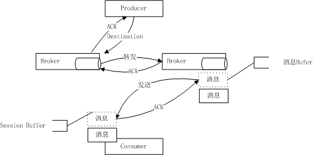
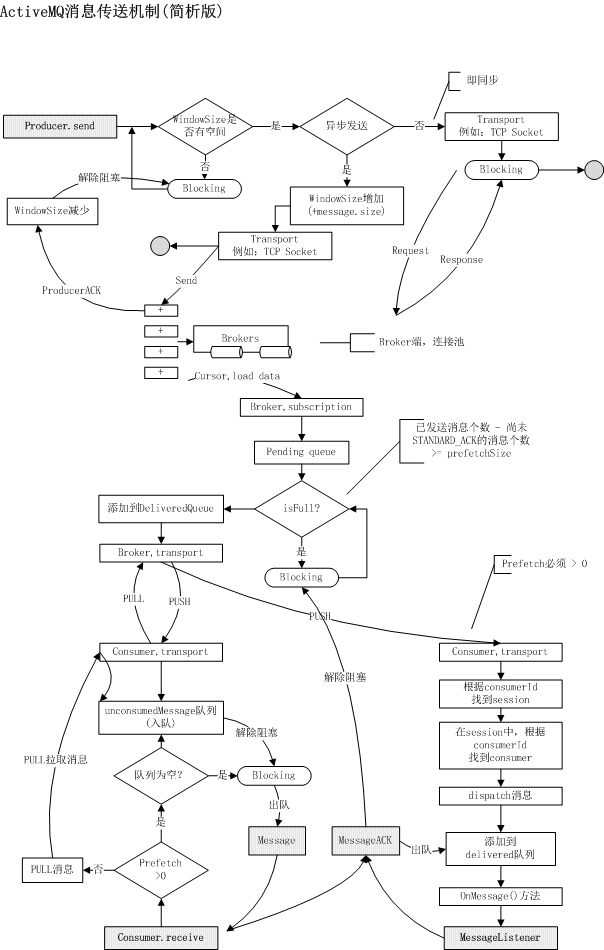
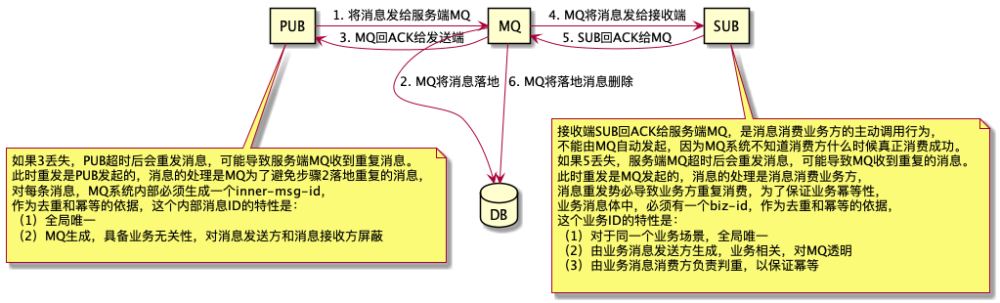

 

# ActiveMQ


## 概述

### JMS

#### 简介

**Java消息服务**（**Java Message Service**，**JMS**）应用程序接口是一[Java平台中关于面向消息中间件（MOM）的API，用于在两个应用程序之间，或分布式系统中发送消息，进行异步通信。Java消息服务是一个与具体平台无关的API，绝大多数MOM提供商都对JMS提供支持。


#### 面向消息的中间件 (Message-Oriented Middleware, MOM)

[Sun Java System Message Queue 3.7 UR1 技术概述](https://docs.oracle.com/cd/E19148-01/820-0533/6nc927vst/index.html)


#### JMS元素

- JMS提供者

  连接面向消息中间件的，JMS接口的一个实现。提供者可以是Java平台的JMS实现，也可以是非Java平台的面向消息中间件的适配器。

- JMS客户

  生产或消费消息的基于Java的应用程序或对象。

- JMS生产者

  创建并发送消息的JMS客户。

- JMS消费者

  接收消息的JMS客户。

- JMS消息

  包括可以在JMS客户之间传递的数据的对象

- JMS队列

  一个容纳那些被发送的等待阅读的消息的区域。队列暗示，这些消息将按照顺序发送。一旦一个消息被阅读，该消息将被从队列中移走。

- JMS主题

  一种支持发送消息给多个订阅者的机制。

#### JMS模型


* 点对点或队列模型
  - 只有一个消费者将获得消息
  - 生产者不需要在接收者消费该消息期间处于运行状态，接收者也同样不需要在消息发送时处于运行状态。
  - 每一个成功处理的消息都由接收者签收
* 发布/订阅模型
  - 多个消费者可以获得消息
  - 在发布者和订阅者之间存在时间依赖性。发布者需要创建一个订阅（subscription），以便客户能够购订阅。订阅者必须保持持续的活动状态以接收消息，除非订阅者创建了持久的订阅。在那种情况下，在订阅者未连接时发布的消息将在订阅者重新连接时重新发布。


#### JMS应用程序接口
Java消息服务的API在javax.jms包中提供。

* ConnectionFactory 接口（连接工厂）
  用户用来创建到JMS提供者的连接的被管对象。JMS客户通过可移植的接口访问连接，这样当下层的实现改变时，代码不需要进行修改。 管理员在JNDI名字空间中配置连接工厂，这样，JMS客户才能够查找到它们。根据消息类型的不同，用户将使用队列连接工厂，或者主题连接工厂。

* Connection 接口（连接）
  连接代表了应用程序和消息服务器之间的通信链路。在获得了连接工厂后，就可以创建一个与JMS提供者的连接。根据不同的连接类型，连接允许用户创建会话，以发送和接收队列和主题到目标。

* Destination 接口（目标）
  目标是一个包装了消息目标标识符的被管对象，消息目标是指消息发布和接收的地点，或者是队列，或者是主题。JMS管理员创建这些对象，然后用户通过JNDI发现它们。和连接工厂一样，管理员可以创建两种类型的目标，点对点模型的队列，以及发布者／订阅者模型的主题。

* MessageConsumer 接口（消息消费者）
  由会话创建的对象，用于接收发送到目标的消息。消费者可以同步地（阻塞模式），或异步（非阻塞）接收队列和主题类型的消息。

* MessageProducer 接口（消息生产者）
  由会话创建的对象，用于发送消息到目标。用户可以创建某个目标的发送者，也可以创建一个通用的发送者，在发送消息时指定目标。

* Message 接口（消息）
  是在消费者和生产者之间传送的对象，也就是说从一个应用程序创送到另一个应用程序。一个消息有三个主要部分：

  1. 消息头（必须）：包含用于识别和为消息寻找路由的操作设置。
  2. 一组消息属性（可选）：包含额外的属性，支持其他提供者和用户的兼容。可以创建定制的字段和过滤器（消息选择器）。
  3. 一个消息体（可选）：允许用户创建五种类型的消息（文本消息，映射消息，字节消息，流消息和对象消息）。

  消息接口非常灵活，并提供了许多方式来定制消息的内容。

* Session 接口（会话）
  表示一个单线程的上下文，用于发送和接收消息。由于会话是单线程的，所以消息是连续的，就是说消息是按照发送的顺序一个一个接收的。会话的好处是它支持事务。如果用户选择了事务支持，会话上下文将保存一组消息，直到事务被提交才发送这些消息。在提交事务之前，用户可以使用回滚操作取消这些消息。一个会话允许用户创建消息生产者来发送消息，创建消息消费者来接收消息。

### ActiveMQ

ActiveMQ 是由 Apache 出品的一款开源消息中间件，旨在为应用程序提供高效、可扩展、稳定、安全的企业级消息通信。 它的设计目标是提供标准的、面向消息的、多语言的应用集成消息通信中间件。ActiveMQ 实现了 JMS 1.1 并提供了很多附加的特性，比如 JMX 管理、主从管理、消息组通信、消息优先级、延迟接收消息、虚拟接收者、消息持久化、消息队列监控等等。其主要特性有：

1. 支持包括 Java、C、C++、C#、Ruby、Perl、Python、PHP 等多种语言的客户端和协议。协议包含 OpenWire、Stomp、AMQP、MQTT 。
2. 提供了像消息组通信、消息优先级、延迟接收消息、虚拟接收者、消息持久化之类的高级特性
3. 完全支持 JMS 1.1 和 J2EE 1.4规范（包括持久化、分布式事务消息、事务）
4. 对 Spring 框架的支持，ActiveMQ 可以通过 Spring 的配置文件方式很容易嵌入到 Spring 应用中
5. 通过了常见的 J2EE 服务器测试，比如 TomEE、Geronimo、JBoss、GlassFish、WebLogic
6. 连接方式的多样化，ActiveMQ 提供了多种连接模式，例如 in-VM、TCP、SSL、NIO、UDP、多播、JGroups、JXTA
7. 支持通过使用 JDBC 和 journal 实现消息的快速持久化
8. 为高性能集群、客户端-服务器、点对点通信等场景而设计
9. 提供了技术和语言中立的 REST API 接口
10. 支持 Ajax 方式调用 ActiveMQ
11. ActiveMQ 可以轻松地与 CXF、Axis 等 Web Service 技术整合，以提供可靠的消息传递
12. 可用作为内存中的 JMS 提供者，非常适合 JMS 单元测试
13. 

## 基本使用

### 安装

#### macos
```bash
brew install activemq

activemq start
activemq stop
activemq status
```


#### 测试安装
URL: http://127.0.0.1:8161/admin/
Login: admin
Passwort: admin


### 自定义BrokerServer

通过代码内建一个Broker的，内建的Broker比较小巧，适用于一些希望把Broker整合到项目中的场景。


## 可靠性消息机制

### 一条消息的生命周期






### 消息重复消费

消息总线为了尽量保证消息必达，架构设计方向为：

1. 消息收到先落地

2. 消息超时、重传、确认保证消息必达



[消息总线真的能保证幂等](https://www.w3cschool.cn/architectroad/architectroad-message-idempotence.html)

### 消息确认

### ACK模式

### ACK类型

### optimizeACK


## 高级应用

### 消息生产者高级应用

### Broker 高级配置

#### 流量控制