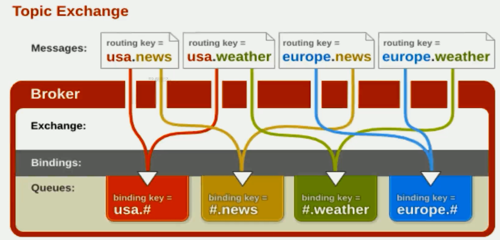
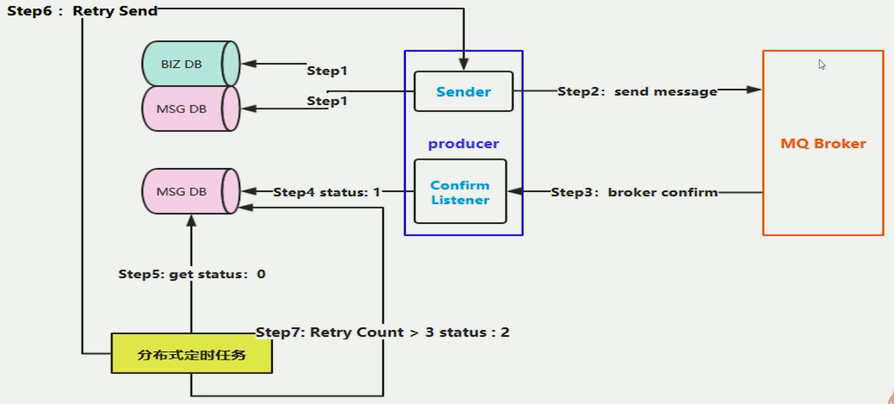
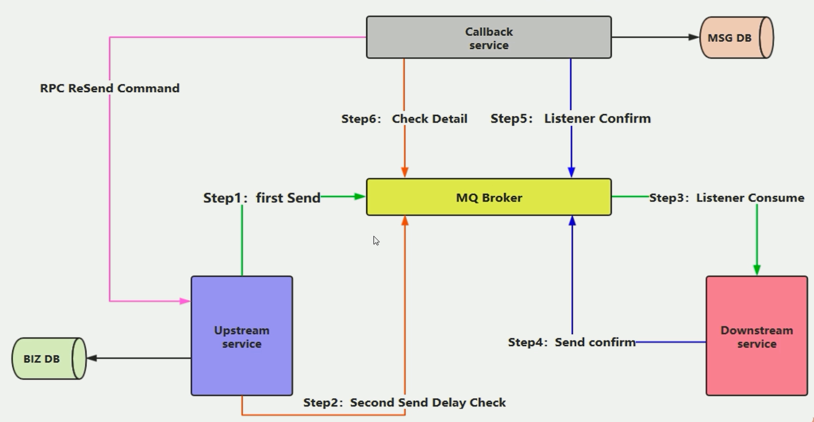

# Install

## Debain

OS release and distribution names Mapping

|Release|Distribution|
|---|---|
|Ubuntu 23.04|jammy|
|Ubuntu 22.04|jammy|
|Ubuntu 20.04|focal|
|Ubuntu 18.04|bionic|
|Debian Bookworm|bullseye|
|Debian Bullseye|bullseye|
|Debian Sid|bullseye|

```bash
# set host name
hostnamectl set-hostname node01

# Install Essential Dependencies
sudo apt-get update -y
sudo apt-get install curl gnupg -y

# Enable apt HTTPS Transport
sudo apt-get install apt-transport-https

# Add Repository Signing Keys
## Team RabbitMQ's main signing key
curl -1sLf "https://keys.openpgp.org/vks/v1/by-fingerprint/0A9AF2115F4687BD29803A206B73A36E6026DFCA" | sudo gpg --dearmor | sudo tee /usr/share/keyrings/com.rabbitmq.team.gpg > /dev/null
## Community mirror of Cloudsmith: modern Erlang repository
curl -1sLf https://github.com/rabbitmq/signing-keys/releases/download/3.0/cloudsmith.rabbitmq-erlang.E495BB49CC4BBE5B.key | sudo gpg --dearmor | sudo tee /usr/share/keyrings/rabbitmq.E495BB49CC4BBE5B.gpg > /dev/null
## Community mirror of Cloudsmith: RabbitMQ repository
curl -1sLf https://github.com/rabbitmq/signing-keys/releases/download/3.0/cloudsmith.rabbitmq-server.9F4587F226208342.key | sudo gpg --dearmor | sudo tee /usr/share/keyrings/rabbitmq.9F4587F226208342.gpg > /dev/null

# Replace $distribution with your operating system distribution
export distribution=bullseye
sudo tee /etc/apt/sources.list.d/rabbitmq.list <<EOF
## Provides modern Erlang/OTP releases from a Cloudsmith mirror
deb [signed-by=/usr/share/keyrings/rabbitmq.E495BB49CC4BBE5B.gpg] https://ppa1.novemberain.com/rabbitmq/rabbitmq-erlang/deb/debian $distribution main
deb-src [signed-by=/usr/share/keyrings/rabbitmq.E495BB49CC4BBE5B.gpg] https://ppa1.novemberain.com/rabbitmq/rabbitmq-erlang/deb/debian $distribution main

# another mirror for redundancy
deb [signed-by=/usr/share/keyrings/rabbitmq.E495BB49CC4BBE5B.gpg] https://ppa2.novemberain.com/rabbitmq/rabbitmq-erlang/deb/debian $distribution main
deb-src [signed-by=/usr/share/keyrings/rabbitmq.E495BB49CC4BBE5B.gpg] https://ppa2.novemberain.com/rabbitmq/rabbitmq-erlang/deb/debian $distribution main

## Provides RabbitMQ from a Cloudsmith mirror
deb [signed-by=/usr/share/keyrings/rabbitmq.9F4587F226208342.gpg] https://ppa1.novemberain.com/rabbitmq/rabbitmq-server/deb/debian $distribution main
deb-src [signed-by=/usr/share/keyrings/rabbitmq.9F4587F226208342.gpg] https://ppa1.novemberain.com/rabbitmq/rabbitmq-server/deb/debian $distribution main

# another mirror for redundancy
deb [signed-by=/usr/share/keyrings/rabbitmq.9F4587F226208342.gpg] https://ppa2.novemberain.com/rabbitmq/rabbitmq-server/deb/debian $distribution main
deb-src [signed-by=/usr/share/keyrings/rabbitmq.9F4587F226208342.gpg] https://ppa2.novemberain.com/rabbitmq/rabbitmq-server/deb/debian $distribution main
EOF

## Update package indices
sudo apt-get update -y

## Install Erlang packages
sudo apt-get install -y erlang-base \
						erlang-asn1 erlang-crypto \
						erlang-eldap erlang-ftp erlang-inets \
                        erlang-mnesia erlang-os-mon erlang-parsetools \
                        erlang-public-key \
                        erlang-runtime-tools erlang-snmp erlang-ssl \
                        erlang-syntax-tools erlang-tftp erlang-tools \
                        erlang-xmerl
# install error 
# erlang-crypto : Depends: libssl1.1 (>= 1.1.1) but it is not installable
wget http://security.debian.org/debian-security/pool/updates/main/o/openssl/libssl1.1_1.1.1n-0+deb10u6_amd64.deb
dpkg -i libssl1.1_1.1.1n-0+deb10u6_amd64.deb
rm libssl1.1_1.1.1n-0+deb10u6_amd64.deb\

# ping hostname 如果不通, 则报如下的错误
# 使用 journalctl -xeu rabbitmq-server.service 查看错误
# ERROR: epmd error for host debian: address
# cat /etc/hosts, 检查hostname的ip映射

## Install rabbitmq-server and its dependencies
sudo apt-get install rabbitmq-server -y --fix-missing
# Start the Server
systemctl start rabbitmq-server

# Create Admin User in RabbitMQ
sudo rabbitmqctl add_user admin password 
sudo rabbitmqctl set_user_tags admin administrator
sudo rabbitmqctl set_permissions -p / admin ".*" ".*" ".*"

# Setup RabbitMQ Web Management Console
sudo rabbitmq-plugins enable rabbitmq_management

# 家里使用的PVE服务器,需要在宿主机上做下net转发
iptables -t nat -A PREROUTING -d 10.10.10.170 -p tcp --dport 5672 -j DNAT --to 192.168.100.110:5672
```


### 参考
[Installing on Debian and Ubuntu — RabbitMQ](https://www.rabbitmq.com/install-debian.html)

# 工作原理

## 核心概念

https://www.rabbitmq.com/tutorials/amqp-concepts.html

### Virtual Host

虚拟地址，用于进行逻辑隔离，最上层的消息路由，一个 Virtual Host 里面可以有若干个 Exchange 和Queue 。同一个 Virtual Host 里面不能有相同名称的Exchange 或 Queue

### Exchange

接受消息，并更具路由键转发消息所绑定的队列


* 蓝色区域 生产消息，经过交换机，到达队列
* 绿色区域 消费者，从队列中获取并消费消息
* 红色区域  RabbitMQ Server
* 黄色区域  交换机绑定队列

#### Direct Exchange 直连交换机

发送到当前交换机的消息，都会被转发到RouteKey中指定的Queue中

* Direct模式可以使用RabbitMQ自带的Exchange：default Exchange，所以不需要将Exchange进行任何绑定（binding）操作，消息传递是，RouteKey必须完全匹配才会被队列接受，否则该消息会被抛弃


#### Topic Exchange 主题交换机

发送到交换机上的消息，会被指定给主题相关的Queue上。主要将RouteKey和设置的Topic进行模糊匹配

* 可以使用通配符进行模糊匹配
* `#` 匹配一个或多个词    `hello.# -> hello.mq.rabbit`
* `*`  匹配一个词 `hello.* -> hello.rabbit`



#### Fanout Exchange 广播交换机

直接广播，不走路由键，直接将队列绑定到交换机上。发送到交换机的消息，全部会被转发到与该交换机绑定的队列上。转发消息是最快的！


#### Headers Exchange

性能差

### Message Queue

 消息队列，存储消息数据。

### Binding

主要将 `exchang`中的信息与 `Message Queue`中的队列进行绑定。

### Message

服务器和应用程序之间，进行传输的数据。由 Properties 和 Payload（Body）组成

### Routing Key

## 工作过程

### 如何保障消息的成功投递

#### 什么是生产端的可靠性投递

* 保证消息的成功发出
* 保障 MQ 节点的成功接收
* 发送端收到 MQ 节点确认应答
* 完善的消息进行补偿机制

### 生产端-可靠性投递

#### 方案一

消息落库，对消息转改进行打标记



7. 如果重试次数太多就设置标记放弃。

#### 方案二

消息的延迟投递，做二次确认，回调检查



* 蓝色  生产者
* 红色  消费者

1. 把消息落库完了之后，才能 step 1 进行发送消息，这一次，在生产端它会一次生成两条消息
2. 执行完了 step 1 发送消息后， 还会执行 step 2 做消息延迟检查，可以 2~5 分钟之后
3. 监听&接收消息之后，就进行处理
4. 当消费端中消息处理成功之后，还需生成一个 确认 消息
5. Callback 服务，通过监听器，监听 确认 消息，当确认了之后，就对消息做最终的存储
6. 假设 5 分钟后，延迟投递检查消息，发送过来了， allback 服务，监听这个 检查细节，然后就去检查 MSG DB 数据库，如果下游已经把数据处理好了，那么就OK，如果没有返回，或者返回失败，出现异常了，这时 callback 需要做补偿。因为 callback 在监听延迟消息。当 callback 发现 message 并不存在，则会主动发起 RPC 通信，给上游反馈延迟检查的内容，并没有找到。然后，再次发送一次数据。

### 幂等性

#### 什么是幂等性

对一条数据进行的操作，这个操作你可能执行非常多次，操作的结果也是相同的，这个就是幂等性保障。

#### 消费端幂等性保障


# 实战

## Spring Boot 

### 监听手工确认消息

```java
@RabbitListener(queues = QUEUE, concurrency = "4", ackMode = "MANUAL")
public void listener(Message message, @Header(AmqpHeaders.DELIVERY_TAG) long deliveryTag, Channel channel) {
	if (logger.isDebugEnabled()) {
		logger.debug("开始处理消息 {}", deliveryTag);
	}

	String json = new String(message.getBody());
	BifrostDataDTO dto = JsonObjectMapper.getInstance().fromJson(json, BifrostDataDTO.class);
	handleMessage(dto);
	try {
		channel.basicAck(deliveryTag, false);
	} catch (IOException e) {
		logger.error("确认队列数据失败数据失败", e);
	}
}
```

1. 注解 `RabbitListener` 的 `ackMode` 设置为MANUAL
2. 增加参数 `@Header(AmqpHeaders.DELIVERY_TAG) long deliveryTag, Channel channel`
3. 使用 `channel.basicAck(deliveryTag, false);` 确认消息

