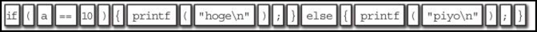
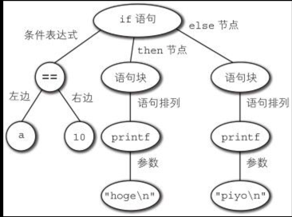

##程序员面试金典
算法题的五种解法

1. 举例法
2. 模式匹配法
3. 简化推广法
4. 简单构造法 
5. 数据结构头脑分爆法

怎样才算好代码

1. 正确
2. 高效
3. 简洁
4. 易读
5. 可维护

链表

```java
class Node {
	Node next = null;
	int data;
	
	public Node(int d) {
		data = d;
	}
	
	void appendToTail(int d) {
		Node end = new Node(d);
		Node n = this;
		while (n.next != null) {
			n = n.next;
		}
		n.next = end;
	}
}
```

栈

```java
class Stack {
    Node top;

    Object pop() {
        if (top != null) {
            Object item = top.data;
            top = top.next;
            return item;
        }    
        return null
    }

    void push(Object item) {
        Node t = new Node(item);
        t.next = top;
        top = t;
    }

    Object peek() {
        return top.data;
    }
}
```

队列

```bash
class Queue {
	Node first, last;

	void enqueue(Object item) {
		if (first == null) {
			last = new Node(item);
			first = last;
		} else {
			last.next = new Node(item);
			last = last.next;
		}
	}
	
	Object dequeue() {
		if (first != null) {
			Object item = first.data;
			first = first.next;
			return item;
		}
		return null;
	}
}
```
深度优先搜索（DFS）
> 在DFS中，访问节点R，然后循环访问R的每个相邻节点。在访问R的相邻节点N时，会在继续访问R的其他相邻节点之前先访问N的所有相邻节点
> 伪代码
> 
> ```java
> void search(Node root) {
> 	if (root == null) {
> 		return;
> 	}
> 	visit(root);
> 	root.visited = true;
> 	foreach(Node n in root.adjacent) {
> 		if (n.visited == false) {
> 			search(n);
> 		}
> 	}
> }
> ```

广度优先搜索（BFS）
>在BFS中，在搜素R的“孙子节点”之前，先访问R的所有相邻节点。用队列实现迭代方案最有效
>伪代码
>
>```java
void search(Node root) {
	Queue queue = new Queue();
	root.visited = true;
	visit(roo);
	queue.enqueue(root); //加至队列尾部
	while(!queue.isEmpty()) {
		Node r = queue.dequeue();	//从队列头部移除
		foreach (n.visited == false) {
			visit(n);
			n.visited = true;
			queue.enqueue(n);
		}
	}
}
```

死锁出现的条件

1. 互斥 

	>某一时刻只有一个进程能访问某一资源
2. 持续并等待
	>不释放当前拥有的紫云，就能要求更多的资源
3. 没有抢占
	>一个进程不能强制另一个进程施放资源
4. 循环等待

###[解题](interview.md)


##自制编程语言
==lex== 自动生成词法分析器的工具


编程语言的处理过程

1. 词法分析 

	>将源码分割成若干个记号(token)的处理
	>
2. 语法分析
	>从记号构建分析树(parse tree)的处理。分析树也叫作语法树
(syntax tree)或抽象语法树

	>
3. 语义分析
	>生成分析树
4. 生成代码
	>

```lex
%{
#include <stdio.h>
#include "y.tab.h"

int
yywrap(void)
{
    return 1;
}
%}
%%
"+"             return ADD;
"-"             return SUB;
"*"             return MUL;
"/"             return DIV;
"\n"            return CR;
([1-9][0-9]*)|0|([0-9]+\.[0-9]*) {
    double temp;
    sscanf(yytext, "%lf", &temp);
    yylval.double_value = temp;
    return DOUBLE_LITERAL;
}
[ \t] ;
. {
    fprintf(stderr, "lexical error.\n");
    exit(1);
}
%%
```
> 11行的%% 此行之前部分叫做定义区块。
> 2~9行，%{ }%包裹的部分，是想让生成的词法分析器讲这部分代码远洋输出。