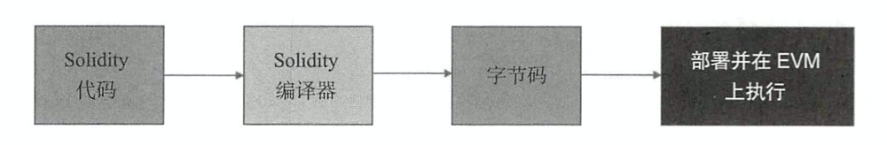

# 简介

Solidity 是一门面向合约的、为实现智能合约而创建的高级编程语言。这门语言受到了 C++，Python 和 Javascript 语言的影响，设计的目的是能在以太坊虚拟机（EVM）上运行。


## EVM

从在 Solidity 中编写代码到在 EVM 中执行代码



## 合约的结构

```solidity
pragma solidity 0.4.19;

// contract definition
contract GeneralStructure {
	// state variables
	int public stateIntVariable;
	string stateStringVariable;
	address personIdentifier;
	MyStruct human;
	bool constant hasIncome = true;
	
	// structure definition
	struct MyStruct {
		string name;
		uint age;
		bool isMarried;
		uint[] bankAccountsNumbers;
	}
	
	// modifier declaration
	modifier onlyBy() {
		if (msg.sender == personIdentifier) {
			_;
		}
	}
	
	// event declaration
	event ageRead(address, int)
	
	// enumeration declaration
	enum gender {male, female}
	
	function getAge(address _personIdentifier) onlyBy() payable external return(uint) {
		human = myStruct("zhang san", 10, true, new unit[](3));
		gender _gender = gender.male;
		ageRead(personIdentifier, stateIntVariable)
	}
}
```

### 1. 状态变量

​	状态变量是 Solidity 合约最重要的特性之一。状态变量由矿工永久存储在区块链/以太坊账本中。在合约中，任何函数内声明的变量都不能称为状态变量。状态变量存储合约的当前值。状态变量的内存是静态分配的，并且在合约生命周期内不能更改（分配的内存大小）。Solidity编译器必须确定每个状态变量的内存分配细节，因此必须声明状态变量的数据类型。

状态变量的限定符

* internal 默认情况，智能在当前合约和继承它的合约中使用, 不能被外部修改，但可以访问。

   ```solidity
   int internal state;
   ```

* private 只能在声明它的合约中使用

  ```solidity
  int private state;
  ```

* public 可以直接访问。Solidity 编译器为每个公共状态变量生成一个 getter 函数

  ```solidity
  int public state;
  ```

* constant 变量声明时必须赋初值。实际上，编译器会在所有代码中将变量引用替换为指定的值。

  ```solidity
  int constant state = 1;
  ```


### 2. 结构

​	结构是一种复合数据类型，由多个不同数据类型的变量组成。他们与合约非常相似，但是，他们不包含任何代码。他们只包含变量。

​	创建结构实例，不需要显示调用关键字 `new` 关键字 `new` 只用于创建合约或数组的实例。

```solidity
human = myStruct("zhang san", 10, true, new unit[](3));
```


### 3. 修改器

修改器总是与函数关联。编程语言中的修改器是指改变执行代码行为的结构。可以将其视为执行目标函数之前执行的函数。

修改器使用 modifier 关键字后面根修改器标识符。修改器中的`_`表示执行目标函数。可以视为 `_` 被內联的目标函数替换。 payable 是一种由 Solidity 提供的开箱即用的修改器，应用与函数时允许该函数接收以太币。

```solidity
modifier onlyBy() {
	if (msg.sender == personIdentifier) {
		_;
	}
}
```


### 4. 事件

事件主要用于通过 EVM 的日志工具向调用应用程序通知合约的当前状态。

事件信息及其值作为交易的一部分存储在区块内。位于LogsBloom


### 5. 枚举

枚举用于在 Solidity 中声明用户自定义的数据类型。

###  6. 函数

函数机制时为了从状态变量读值和向状态变量写入值。函数时一个按需调用执行的代码单元。函数可以接受参数，执行其逻辑，并可选地将值返回给调用者。在合约中只能有一个称为 `fallback` 函数的未命名函数。

#### 可见性

* **public** 合约接口，可以在内部和外部调用
* **internal** 默认情况，当前合约和从其继承的合约。不能从外部访问
* **private** 只能在声明他们的合约中使用
* **external** 合约接口的一部分，只能从外部访问，不能从内部访问

函数还可以附加一下限定符，这些限定符能够更改合约状态变量：

* **constant** 这些函数不具有修改区块链的能力。他们可以读取状态变量并返回给调用者，但不能修改任何变量、触发事件、创建另一个合约、调用其他可以改变状态的函数等。将常函数看作可以读取和返回当前状态变量值的函数。
* **view** 常量函数的别名。
* **pure** 函数既不能读取也不能写入。承诺不读取或修改状态。
* **payable** 使用payable关键字声明的函数能够接受来自调用者的以太币。如果发送者没有提供以太币，则调用将会失败。如果一个函数被标记为`payable`，该函数只能接受以太币。


## 数据类型

### 值类型

* Bool 可以保存true或false作为其值的布尔值
* uint 无符号整数
* int 有符号整数
* address 表示以太坊环境中的账户地址, 20个字节
* byte 表示固定大小的字节数据 (byte1 ~ bytes32)
* enum 可以保存预定义的常量值的枚举

### 引用类型

* 数组 
* 结构
* 字符串 字符串最终被存储位字节
* 映射 键值对

## 存储和内存数据位置

* **存储** 可以被合约內所有函数访问的全局内存变量。以太坊将其存储在环境中的每个节点上永久存储
* **内存** 合约中每个函数都可以访问的本地内存。它是生命周期短暂的内存，当函数执行完成后被销毁
* **调用数据** 存储所有传入的函数执行数据，包括函数参数。这是一个不可修改的内存位置
* **堆栈** EVM 维护用于加载变量和使用以太坊指令集的变量和中间值的堆栈。在EVM中，堆栈深度为1024层

变量的数据位置取决于以下两个因素

* 变量声明的位置
* 变量的数据类型


## 地址全局变量

* `<address>.transfer(uint256 amount)` 该函数向 address 发送给定的以 `wei` 为单位的以太币，如果执行失败则引发异常，并且所有更改都将被还原。
* `<address>.send(uint256 amount)` 该函数向 address 发送给定的以 `wei` 为单位的以太币，并在失败时返回false。只提供 2300 个 `gas` 的固定费用。如果 send 和合约地址一起使用，它将调用合约的 fallback 函数。send 是一个低级函数，应该谨慎使用，因为它可以调用 fallback 函数，可以在合约中一次又一次地递归调用。
* `<address>.call(...) returns (bool)` 此函数调用低级别的 call 函数，并在失败时返回 false
* `<address>.callcode(...) returns (bool)` 此函数调用低级别的 callcode 函数，并在失败时返回 false
* `<address>.delegatecall(...) returns (bool)`  此函数调用低级别的 delegatecall 函数，并在失败时返回 false

## fallback 函数

当调用智能合约中不存在的函数时，fallback函数将自动被调用

fallback 函数没有标识符或函数名称。它是定义的无名函数。由于无法显示调用，因此无法接受任何参数或返回任何值。

```solidity
contract FallbackFunction {
	function() {
		var a = 1;
	}
}
```

由于无法明确调用，因此无法将 gas 发送到此函数。相反，EVM为此功能提供了 2300 个 gas 的固定费用。


# 异常、事件与日志

## 错误处理

### require 语句

require 语句接受一个参数，一个执行结果为true或 false 的语句。如果该语句的执行结果为 false，异常会被抛出并且程序执行会被刮起，未消耗的 gas 会被退回给合约调用者并且合约状态会被回退到初始状态。

require 语句应该用于校验所有传入函数的参数或数值。

### assert 语句

assert 语句和 require 有类似的语法。它接受一个结果为 true 或 false 的语句。基于这个结果来确定继续执行还是抛出异常。并且未消耗的 gas 不会被退回给调用者而是被 assert 语句完全消费掉，合约会被回退到初始状态。  Assert 语句会产生一个 invalid 指令来负责回退状态与耗尽 gas

```solidity
contract AssertContract {
	function ValidInt8(uint _data) public return(uint8) {
		require(_data >= 0)
		require(_data <= 255)
		uint8 value = 20;
		
		// checking datatype overflow
		assert (value + _data <= 255)
		
		return uint8(value + _data)
	}
}
```

可以把 assert 当作是专门用来处理无法预测的运行时异常。你应该在认为当前状态已经变得不一致而不适合继续运行时 assert

### revert 语句

碰到 revert 语句意味着异常会被抛出，未消耗的 gas 被退回，同时合约状态被恢复

```solidity
contract RevertContract {
	function ValidInt8(int _data) public returns (uint8) {
		if (_data < 0 || _data > 255) {
			revert();
		}
		return uint8(_data)
	}
}
```


# 最佳实践

## EVM栈溢出

* EVM的栈深度为1024，但是EVM指令集最多访问深度为16。常见的报错为：stack overflows。EVM的栈用于存储临时变量或者局部变量，比如函数的参数或者函数内部的变量。

  * 函数参数和局部变量不能超过16个，一般建议不超过10个。参数过多会出现的问题：

    1. 容易栈溢出；
    2. 编写代码费劲容易出错；
    3. 不利于业务理解和维护；
    4. 不便于扩展。

  * 碰到实在无法减少的情况，建议采用数组。局部变量和函数参数类似，定义过多也会导致栈溢出，可以通过拼接数组，减少变量个数

    

## BINARY字段超长

智能合约通过JAVA编译器编译后会生成对应的JAVA合约，在JAVA合约中有一个重要的常量字段BINARY，该字段为智能合约的编码，即合约代码。合约代码用于合约部署时签名，每一次合约的变更对应的BINARY都会不一样。

在编写智能合约时，如果单个智能合约代码很长，经过编译后的BINARY字段会很大。在JAVA合约中，BINARY字段用String类型存储，String类型的最大长度为65534，如果智能合约代码过多，会导致BINARY字段的长度超过String类型的最大长度，导致String类型溢出，从而报错。

1. 尽可能复用代码，比如某些判断在不同的方法中多次出现，可以抽取出来，这样也便于后续的维护；
2. 合约拆分，将一个合约拆分成为多个合约，一般出现String越界，基本上可以说明合约设计不合理。


## 慎用string类型

string类型是一个比较特殊的动态字节数组，无法直接和定长数组进行转化，其解析和数组转化也非常复杂。

除此之外，string类型浪费空间、非常昂贵（消耗大量gas），且不能进行合约间传递（新的实验性ABI编译器除外），所以建议用bytes代替，特殊场景例外，比如未知长度字节数组或预留字段。

>  string类型可以通过在合约中添加新的实验性ABI编译器（如下代码）进行合约间传递。

```
pragma experimental ABIEncoderV2;
```

## 分层设计

## 命名规范

1. 合约命名：采用驼峰命名、首字母大写、且能表达对应的业务含义；
2. 方法命名：采用驼峰命名、首字母小写、且能表达对应的业务含义；
3. 事件命名：采用驼峰命名、首字母小写、且能表达对应的业务含义，以Event结尾；
4. 合约变量：采用驼峰命名、以_开头，首字母小写、且能表达对应的业务含义；
5. 方法入参：采用驼峰命名、首字母小写、且能表达对应的业务含义；
6. 方法出参：建议只写出参类型，无需命名，特殊情况例外；
7. 事件参数：同方法入参；
8. 局部变量：同方法入参。

## 兜底方案


# 类型

## 值类型

### bool

可能的取值为字面常量值 `true` 和 `false` 。

### 整型

`int` / `uint` ：分别表示有符号和无符号的不同位数的整型变量。 支持关键字 `uint8` 到 `uint256` （无符号，从 8 位到 256 位）以及 `int8` 到 `int256`，以 `8` 位为步长递增。 `uint` 和 `int` 分别是 `uint256` 和 `int256` 的别名。

### 定长浮点型

`fixed` / `ufixed`：表示各种大小的有符号和无符号的定长浮点型。 在关键字 `ufixedMxN` 和 `fixedMxN` 中，`M` 表示该类型占用的位数，`N` 表示可用的小数位数。 `M` 必须能整除 8，即 8 到 256 位。 `N` 则可以是从 0 到 80 之间的任意数。 `ufixed` 和 `fixed` 分别是 `ufixed128x19` 和 `fixed128x19` 的别名。

### 地址类型 Address

地址类型有两种形式，他们大致相同：

> - `address`：保存一个20字节的值（以太坊地址的大小）。
> - `address payable` ：可支付地址，与 `address` 相同，不过有成员函数 `transfer` 和 `send` 。

这种区别背后的思想是 `address payable` 可以接受以太币的地址，而一个普通的 `address` 则不能。

类型转换:

允许从 `address payable` 到 `address` 的隐式转换，而从 `address` 到 `address payable` 必须显示的转换, 通过 `payable(<address>)` 进行转换。

`address` 允许和 `uint160`、 整型字面常量、`bytes20` 及合约类型相互转换。

只能通过 `payable(...)` 表达式把 `address` 类型和合约类型转换为 `address payable`。 只有能接收以太币的合约类型，才能够进行此转换。例如合约要么有 `receive` 或可支付的回退函数。 注意 `payable(0)` 是有效的，这是此规则的例外。

### 合约类型

每一个 `contract`定义都有他自己的类型。

您可以隐式地将合约转换为从他们继承的合约。 合约可以显式转换为 `address` 类型。

只有当合约具有 接收receive函数 或 payable 回退函数时，才能显式和 `address payable` 类型相互转换 转换仍然使用 `address(x)` 执行， 如果合约类型没有接收或payable 回退功能，则可以使用 `payable(address(x))` 转换为 `address payable` 。

### 定长字节数组

`bytes1`， `bytes2`， `bytes3`， …， `bytes32`。

### 变长字节数组

- `bytes`:

  变长字节数组，它并不是值类型。

- `string`:

  变长 UTF-8 编码字符串类型，并不是值类型。

### 地址字面常量

### 有理数和整数字面常量

整数字面常量由范围在 0-9 的一串数字组成，表现成十进制。 例如，69 表示数字 69。 Solidity 中是没有八进制的，因此前置 0 是无效的。

字符串字面常量是指由双引号或单引号引起来的字符串（`"foo"` 或者 `'bar'`）。 它们也可以分为多个连续的部分（`"foo" "bar"` 等效于`”foobar”`）

字符串字面常量只能包含可打印的ASCII字符，这意味着他是介于0x1F和0x7E之间的字符。

### Unicode 字面常量

常规字符串文字只能包含ASCII，而Unicode文字（以关键字unicode为前缀）可以包含任何有效的UTF-8序列。 它们还支持与转义序列完全相同的字符作为常规字符串文字。

```sol
string memory a = unicode"Hello 😃";
```

### 枚举类型

枚举是在Solidity中创建用户定义类型的一种方法。 它们是显示所有整型相互转换，但不允许隐式转换。 从整型显式转换枚举，会在运行时检查整数时候在枚举范围内，否则会导致异常（ Panic异常）。 枚举需要至少一个成员,默认值是第一个成员，枚举不能多于 256 个成员。

### 函数类型

函数类型是一种表示函数的类型。可以将一个函数赋值给另一个函数类型的变量，也可以将一个函数作为参数进行传递，还能在函数调用中返回函数类型变量。 函数类型有两类：

> - *内部（internal）* 函数类型
> - *外部（external）* 函数类型

内部函数只能在当前合约内被调用（更具体来说，在当前代码块内，包括内部库函数和继承的函数中），因为它们不能在当前合约上下文的外部被执行。 调用一个内部函数是通过跳转到它的入口标签来实现的，就像在当前合约的内部调用一个函数。

外部函数由一个地址和一个函数签名组成，可以通过外部函数调用传递或者返回。

```sol
function (<parameter types>) {internal|external} [pure|constant|view|payable] [returns (<return types>)]
```


# 合约

## 函数

### View 函数

可以将函数声明为 `view` 类型，这种情况下要保证不修改状态。

```solidity
pragma solidity ^0.4.16;

contract C {
    function f(uint a, uint b) public view returns (uint) {
        return a * (b + 42) + now;
    }
}
```

> `constant` 是 `view` 的别名。
>
> Getter 方法被标记为 `view`。
>
> ==编译器没有强制 `view` 方法不能修改状态。==

### **Pure** 函数

函数可以声明为 `pure` ，在这种情况下，承诺不读取或修改状态。

```solidity
pragma solidity ^0.4.16;

contract C {
    function f(uint a, uint b) public pure returns (uint) {
        return a * (b + 42);
    }
}
```

> ==编译器没有强制 `pure` 方法不能读取状态。==

### Fallback 函数

合约可以有一个未命名的函数。这个函数不能有参数也不能有返回值。 如果在一个到合约的调用中，没有其他函数与给定的函数标识符匹配（或没有提供调用数据），那么这个函数（fallback 函数）会被执行。

### 函数重载

合约可以具有多个不同参数的同名函数。这也适用于继承函数。


