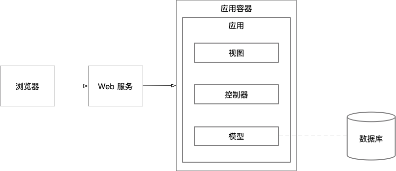
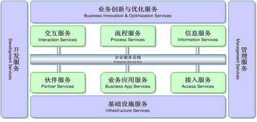
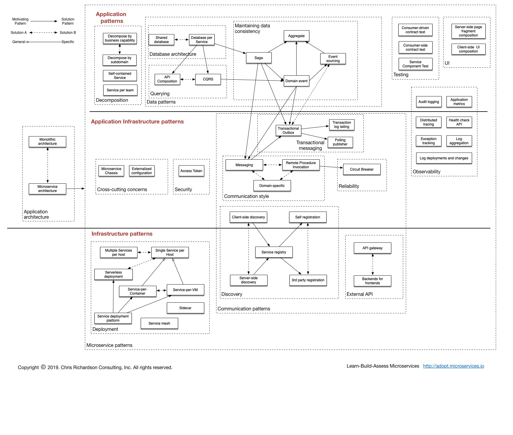
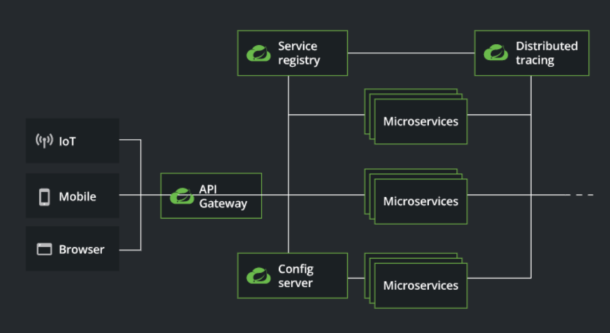
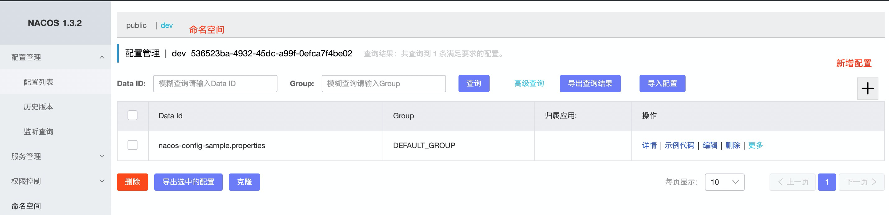
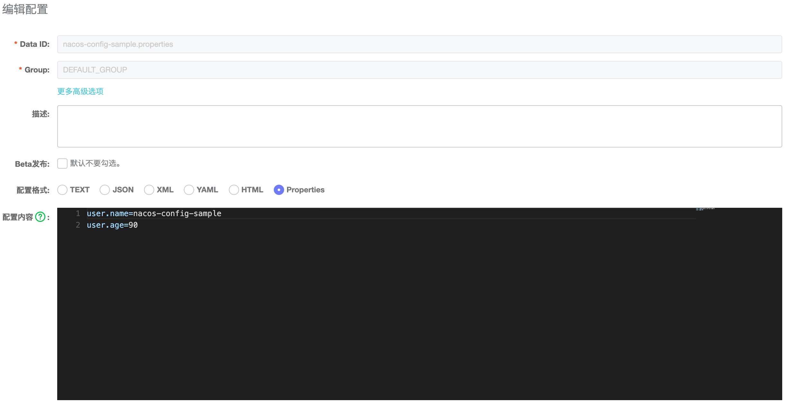
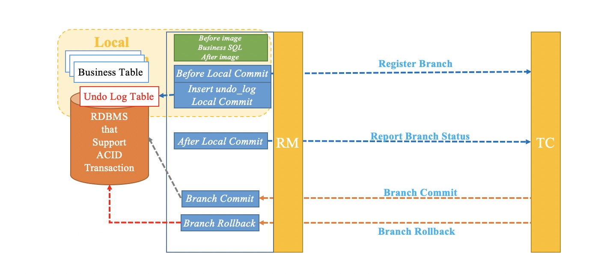

# 基础知识

## 理论

### 单体架构



#### 优点

- 开发简单。单体应用的结构，天然决定了所有代码都集中在一起，开发者不需要在多个应用之间来回跳转来寻找其中的调用逻辑。
- 测试简单。所有代码都在一个应用里，测试人员可以很方便的做到端到端的测试（当然，很多时候测试人员就是开发者自己）。
- 部署简单。因为一个应用就是产品功能的全集，所以在部署的时候，只需要不是一款应用即可。即使是集群部署，也不会增加多少复杂度：只需要将应用部署多份即可。
- 开发迅速。上面的各种简单，带来的就是软件功能可以快速实现。很多时候，实现需求的速度是项目成功与否的决定性因素。

#### 缺点

- 应用膨胀。所有代码都在一个应用里，导致应用的代码量迅速上升，对于开发者来说，经常需要在海量的代码里找到自己需要维护的哪一行，这种体验往往是令人崩溃的。同时，对于IDE来说，一个应用内大量代码也会严重拖慢其运行效率。
- 团队合作冲突。这种冲突会体现在多个方面：开发阶段，很容易由于修改相同的代码导致代码冲突。部署阶段，又会因为“运行环境里跑的是谁的分支”而造成新的冲突。所有的这些冲突将会严重影响到团队的合作效率。
- 运行效率&稳定性。单体应用，由于逻辑都集中在一起，启动时需要完成所有的初始化工作；同时单一功能的问题也会因为运行在一个进程内，从而导致整个应用宕机。

### SOA 架构

SOA 是 Service-Oriented Architecture 的简写，直译为“面向服务的架构”，从命名上就可以看出“服务”是 SOA 架构里是非常重要的概念。SOA 的核心思想是“将系统的功能解构为一系列服务”：

> 面向服务的架构（SOA）是一个组件模型，它将应用程序的不同功能单元（称为服务）进行拆分，并通过这些服务之间定义良好的接口和协议联系起来。接口是采用中立的方式进行定义的，它应该独立于实现服务的硬件平台、操作系统和编程语言。这使得构件在各种各样的系统中的服务可以以一种统一和通用的方式进行交互。

与单体架构按照技术职责进行水平拆分不同，SOA 会按照业务领域对应用进行粗粒度的垂直拆分，至于拆分到什么程度，哪些领域可以放在一起等类似问题，可以参考一下康威定理。

应用从单体应用做了垂直拆分以后，就会变成一些相对独立的应用。此时，应用间的依赖、调用等相关问题自然而然的就会浮现出来。此时就需要下面这些技术方案来解决这些问题：

- XML - 一种标记语言，用于以文档格式描述消息中的数据。
- SOAP（Simple Object Access Protocol） - 在计算机网络上交换基于XML的消息的协议，通常是用HTTP。
- WSDL（Web Services Description Language，Web服务描述语言） - 基于XML的描述语言，用于描述与服务交互所需的服务的公共接口，协议绑定，消息格式。
- UDDI（Universal Description, Discovery, and Integration，是统一描述、发现和集成） - 基于XML的注册协议，用于发布WSDL并允许第三方发现这些服务。
- ESB（Enterprise Service Bus, 企业服务总线）- 支持异构环境中的服务、消息，以及基于事件的交互，并且具有适当的服务级别和可管理性。

一个典型的 SOA 架构模式如下图：



#### 问题

* 对 SOA 的解释缺乏统一标准

- 高门槛。ESB 本身就是一套非常复杂的系统，通过 ESB 落地 SOA ，对开发人员的要求很高。甚至还会需要厂商参与；
- 厂商绑定。由于缺乏统一保准，不同厂商的解决方案之间很难做切换。
- 不适应云环境。在如今的互联网时代，速度就是一切。由此诞生了敏捷开发、持续集成等在不同节点提升业务上线速度的办法。但是方向是不一致的。
- 中心化。虽然应用本身实现了分布式与水平扩展，但是 ESB 却成了系统的中枢神经。

### 微服务架构

|            | 传统SOA                     | 微服务                                                       |
| ---------- | --------------------------- | ------------------------------------------------------------ |
| 通信方式   | 基于ESB，SOAP、WSDL等重协议 | 点对点通信，开放式协议，如 RESTful、gRPC、或者是轻量级的二进制协议。 |
| 数据管理   | 全局数据模型以及共享存储    | 每个服务独立模型和存储                                       |
| 服务粒度   | 较粗                        | 较细                                                         |
| 诞生的背景 | 企业级应用                  | 互联网                                                       |
| 解决的问题 | 面向企业内，系统集成        | 面向最终产品，解决扩展，维护的问题                           |

关于什么是微服务，Martin Fowler 有如下的定义（更多 MartinFowler 关于微服务的内容，可以参考[链接](https://martinfowler.com/articles/microservices.html)）：

> The microservice architectural style is an approach to developing a single application as a suite of small services, each running in its own process and communicating with lightweight mechanisms, often an HTTP resource API. These services are built around business capabilities and independently deployable by fully automated deployment machinery. There is a bare minimum of centralized management of these services, which may be written in different programming languages and use different data storage technologies.?

这里提到几个重要的概念：
\- 一套小服务
\- 独立进程
\- 轻量级通信协议
\- 可独立部署
\- 多语言&不同储技术

这个定义对微服务做了一个比较具象化较为易于理解的描述，通常来说我们看到的为服务架构如下图所示：


但是事实上，在实际生产环境中，微服务的架构要考虑的问题远比上面的示意图复杂的多，主要包括但不限于如下问题：

- 通过服务实现组件化
-  根据业务组织系统
- 做产品而不是做项目
- 简单高效的通信协议
- 自动化基础设施
- 面向失败的设计
- 具备进化能力的设计

以下的是微服务较为完整的架构图（出自[微服务架构模式](https://microservices.io/patterns/microservices.html)）



#### “微服务”不是银弹

微服务并不是一劳永逸的解决了所有的问题，相反的，如果不能正确的使用微服务，则有可能被微服务自身的限制拖入另一个泥潭：

* 分布式的代价。原本在单体应用中，很多简单的问题都会在分布式环境下被几何级的放大。例如分布式事务、分布式锁、远程调用等，不光要考虑如何实现他们，相关场景的异常处理也是必须要考虑到的问题。
* 协同代价。如果你经历过一个项目上线需要发布十几个应用，而这些应用又分别由多个团队在维护。你就能深刻的体会到协同是一件多么痛苦的事情了。
* 服务拆分需要很强的设计功力。微服务的各种优势，其中一个重要的基础是对服务领域的正确切分。如果使用了不合适的切分粒度，或者是错误的切分方法，都会让服务不能很好的实现高内聚低耦合的要求。


## 框架

### 从 Spring 到 Spring Cloud

#### Spring

从 2004 年 1.0 版本发布开始，便由于其灵活易用的特性受到了整个 Java 行业的广泛关注。经过十多年的发展，Spring 框架早已经成为 Java 语言下编程模型的事实标准。其所倡导的 IOC/AOP 概念也早已深入人心。

#### Spring Boot

Spring 官方对 Spring Boot 特色定义如下：

* 创建独立的Spring应用程序
* 直接嵌入Tomcat，Jetty或Undertow（无需部署WAR文件）
* 提供自以为是的“starter”依赖项，以简化构建配置
* 尽可能自动配置Spring和三方类库
* 提供可用于生产的功能，例如指标，运行状况检查和外部化配置
* 完全没有代码生成，也不需要XML配置

#### Spring Cloud

Spring Cloud 是什么，没有比官方的定义更能说明问题了：

> Spring Cloud provides tools for developers to quickly build some of the common patterns in distributed systems (e.g. configuration management, service discovery, circuit breakers, intelligent routing, micro-proxy, control bus, one-time tokens, global locks, leadership election, distributed sessions, cluster state). Coordination of distributed systems leads to boiler plate patterns, and using Spring Cloud developers can quickly stand up services and applications that implement those patterns. They will work well in any distributed environment, including the developer’s own laptop, bare metal data centres, and managed platforms such as Cloud Foundry.

这里面提到几个关键词：

* 分布式系统中的常见模式
* 任何分布式环境

 Spring 官方给出的一个 High Light 的架构图




#### Spring Cloud Alibaba


最外面这一圈，是 Spring Cloud Alibaba 对 Spring Cloud 的实现。右上部分是对于 Spring Cloud 标准的实现。例如，我们通过 Dubbo 实现了 RPC 调用功能，通过 Nacos 实现了“服务注册与发现”、“分布式配置”，通过 Sentinel 实现了断路器等等，这里就不一一列举了。左下部分是我们 Spring Cloud Alibaba 对阿里云各种服务的集成。可能很多同学会有这样的一个问题：为什么要加上这一部分呢？此时回头审视一下 Spring Cloud ，它仅仅是一个微服务的一个框架。但是在实际生产过程中，单独使用微服务框架其实并不足以支撑我们去构建一个完整的系统。所以这部分是用阿里帮助开发者完成微服务以外的云产品集成的功能。

为什么要分成两个部分呢，这也是为了打消大家对于使用了 Spring Cloud Alibaba 以后就会被平台绑定的担忧。虽然在品牌商都叫做SpringCloudAlibaba，但是在代码上，我们采用了两个独立的项目维护。分别是 [Spring Cloud Alibaba](https://github.com/alibaba/spring-cloud-alibaba) 和 [Aliyun Spring Boot](https://github.com/alibaba/aliyun-spring-boot)

目前，Spring Cloud Alibaba 包含如下组件：

**开源部分**

* Sentinel：把流量作为切入点，从流量控制、熔断降级、系统负载保护等多个维度保护服务的稳定性。
* Nacos：一个更易于构建云原生应用的动态服务发现、配置管理和服务管理平台。
* RocketMQ：一款开源的分布式消息系统，基于高可用分布式集群技术，提供低延时的、高可靠的消息发布与订阅服务。
* Dubbo：Apache Dubbo? 是一款高性能 Java RPC 框架。
* Seata：阿里巴巴开源产品，一个易于使用的高性能微服务分布式事务解决方案。

**平台服务部分**

* Alibaba Cloud OSS: 阿里云对象存储服务（Object Storage Service，简称 OSS），是阿里云提供的海量、安全、低成本、高可靠的云存储服务。您可以在任何应用、任何时间、任何地点存储和访问任意类型的数据。
* Alibaba Cloud SchedulerX: 阿里中间件团队开发的一款分布式任务调度产品，提供秒级、精准、高可靠、高可用的定时（基于 Cron 表达式）任务调度服务。
* Alibaba Cloud SMS: 覆盖全球的短信服务，友好、高效、智能的互联化通讯能力，帮助企业迅速搭建客户触达通道。


## 工具

### Java 工程脚手架

脚手架的访问地址是 https://start.aliyun.com/bootstrap.html


# 分布式配置

## Nacos

[官网](https://nacos.io/zh-cn/docs/quick-start.html)

### 安装

下载最新的稳定版

### 启动

```bash
sh startup.sh -m standalone			# standalone代表着单机模式运行，非集群模式
```

访问地址 http://localhost:8848/nacos， 默认用户名密码 `nacos/nacos`

### 使用 Nacos Config 实现分布式配置

#### 新增配置





#### 配置应用 Nacos Config Server 地址

```properties
spring.cloud.nacos.config.username=nacos
spring.cloud.nacos.config.password=nacos
spring.cloud.nacos.config.contextPath=/nacos
# 设置配置中心服务端地址
spring.cloud.nacos.config.server-addr=127.0.0.1:8848
# Nacos 配置中心的namespace，默认为 public， namespace使用的是ID
spring.cloud.nacos.config.namespace=536523ba-4932-45dc-a99f-0efca7f4be02
```


# 服务注册&服务发现


# 分布式服务调用


# 服务熔断和降级

## Sentinel: 高可用护航的利器

[Sentinel](https://github.com/alibaba/Sentinel?spm=a2ck6.20206201.0.0.3c4a1fd6CKgAvf) 是阿里巴巴开源的，面向分布式服务架构的高可用防护组件，主要以流量为切入点，从流量控制、流量整形、熔断降级、系统自适应保护、热点防护等多个维度来帮助开发者保障微服务的稳定性。Sentinel 承接了阿里巴巴近 10 年的双十一大促流量的核心场景，例如秒杀、冷启动、消息削峰填谷、自适应流量控制、实时熔断下游不可用服务等，是保障微服务高可用的利器，原生支持 Java/Go/C++ 等多种语言，并且提供 Istio/Envoy 全局流控支持来为 Service Mesh 提供高可用防护的能力。

Sentinel 的技术亮点：

- 高度可扩展能力：基础核心 + SPI 接口扩展能力，用户可以方便地扩展流控、通信、监控等功能
- 多样化的流量控制策略（资源粒度、调用关系、流控指标、流控效果等多个维度），提供分布式集群流控的能力
- 热点流量探测和防护
- 对不稳定服务进行熔断降级和隔离
- 全局维度的系统负载自适应保护，根据系统水位实时调节流量
- 覆盖 API Gateway 场景，为 Spring Cloud Gateway、Zuul 提供网关流量控制的能力
- 实时监控和规则动态配置管理能力


# 分布式事务

## 常见的分布式事务解决方案

### 消息最终一致性

消息最终一致性方案是在Seata问世之前，市面上应用最广泛的一种解决方案。它本身具有削峰填谷，可异步化的优点，更多的适应于可异步化的末端链路消息通知场景。但是它本身也存在着一些缺点：需要依赖可靠消息组件，消息的可靠性很重要，大多数的原生消息组件故障时很难降级；实时性比较差，要经过多次网络IO开销和持久化，遇到队列积压情形实时性不可控；无法保证隔离性，在已发送消息和消息消费之前，中间数据对外可见，无法满足事务 isolate 特性；只能向前重试不可向后回滚，消息消费无法成功时无法回滚消息生产侧的数据；无法保证多条消息间的数据一致性。

### XA

XA 标准提出后的20多年间未能得到持续的演进，在学术界有协议优化和日志协同处理等相关的研究，在工业界使用XA落地方案的相对较少，主要集中在应用服务器的场景。XA方案要求相关的厂商提供其具体协议的实现，目前大部分关系数据库支持了XA协议，但是支持程度不尽相同，例如，MySQL 在5.7 才对 xa_prepare 语义做了完整支持。XA 方案被人诟病的是其性能，其实更为严重的是对于连接资源的占用，导致在高并发未有足够的连接资源来响应请求成为系统的瓶颈。在微服务架构下 XA 事务方案随着微服务链路的扩展成为一种反伸缩模式，进一步加剧了资源的占用。另外 XA 事务方案要求事务链路中的resource全部实现XA协议方可使用，若其中某一资源不满足，那么就无法保证整个链路的数据一致性。

### TCC

TCC 方案要求用户根据业务场景实现 try，confirm，cancel三个接口，由框架根据事务所处的事务阶段和决议来自动调用用户实现的三个接口。从概念上TCC框架可以认为是一种万能框架，但是其难点是业务对于这三个接口的实现，开发成本相对较高，有较多业务难以做资源预留相关的逻辑处理，以及是否需要在预留资源的同时从业务层面来保证隔离性。因此，这种模式比较适应于金融场景中易于做资源预留的扣减模型。

### Saga

有了 TCC 解决方案为什么还需要 Saga 事务解决方案？上文提到了 TCC 方案中对业务的改造成本较大，对于内部系统可以自上而下大刀阔斧的推进系统的改造，但对于第三方的接口的调用往往很难推动第三方进行 TCC 的改造，让对方为了你这一个用户去改造 TCC 方案而其他用户并不需要，需求上明显也是不合理的。要求第三方业务接口提供正反接口比如扣款和退款，在异常场景下必要的数据冲正是合理的。另外，Saga 方案更加适应于工作流式的长事务方案并且可异步化。

### AT事务模式



一个分布式事务有全局唯一的xid，由若干个分支事务构成，每个分支事务有全局唯一的branchId。上图展示了在一个分支事务中RM 与 TC 的交互过程。其中主要包含的交互动作如下：
\- branchRegister
分布式事务一阶段执行，分支事务在commit 之前与 TC 交互获取 全局锁 和返回 branchId。全局锁为Seata 应用锁等同于修改数据记录的行锁，若获取锁失败将会进行锁重试，此处提供了两种重试策略是否持有数据库连接重试全局锁，默认为释放数据库连接。若成功，则抢占全局锁并返回branchId，若重试到最大次数失败，则发起全局事务的回滚，对已完成的分支事务执行回滚。

- branchReport
  分布式事务一阶段执行，本地事务commit 之后与 TC 交互，上报本地事务已完成标识。目前 branchReport 动作已经在 1.0 版本做了相关的优化，本地事务commit 不上报，本地事务rollback 上报。经过优化分布式事务的整体性能在globalCommit 场景下最低提升25%，最高提升50%。本地事务rollback 上报可以帮助 TC 快速决策需要回滚的分支事务。
- branchCommit
  分布式事务二阶段执行，在形成globalCommit 决议后执行。AT模式中此步骤异步执行来提升其性能，可以认为分布式事务globalCommit决议提交到TC 释放完全局锁就已经完成了整个分布式事务的处理。branchCommit 在AT模式主要用于删除一阶段的undo_log，TC下发到RM后并不是立即执行，而是通过定时任务+sql 批量合并的方式来提升其处理性能。
- branchRollback
  分布式事务二阶段执行，在形成globalRollback 决议后执行。RM 收到 branchRollback 请求，取undo_log 表中对应的branchId 记录解析rollback_info 字段，对现有数据和undo log后镜像对比，对比不同则分支事务回滚失败。对比成功则根据前镜像构造sql并执行反向操作和删除undo log。

详细处理过程和原理，可参考官网文档关于AT模式的介绍：https://seata.io/zh-cn/docs/dev/mode/at-mode.html

