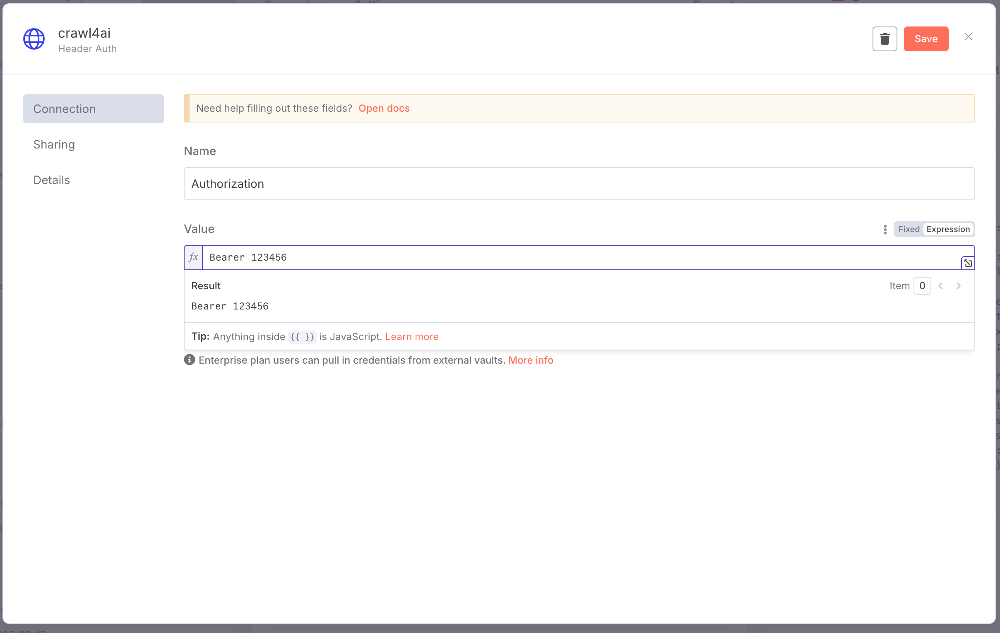

# llm


## 工具

| Name     | Purpose |
| -------- | ------- |
| crawl4ai | 爬虫    |
|          |         |
|          |         |

host.docker.internal

whisper meeting.mp4 --model large --language zh

> --model tiny, base, small, medium, large

crawl4ai-setup


## crawl4ai 

```bash
docker run -it --rm --name crawl4ai  -p 11235:11235 -e CRAWL4AI_API_TOKEN=123456 unclecode/crawl4ai
```



用于生成sitemaps  https://www.xml-sitemaps.com/


## MCP(Model Context Protocol)

前置条件:


### 实战

Awesome MCP: https://github.com/punkpeye/awesome-mcp-servers
MCP 聚合网站: https://smithery.ai/

