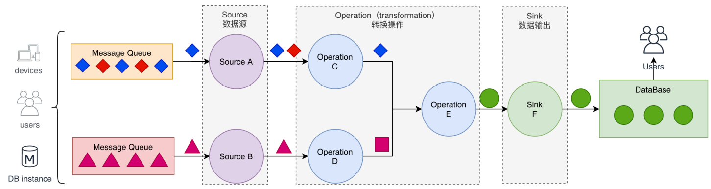

# Flink

## 大数据发展历史

## 大数据处理计算模式

### batch computing (批量计算)

* MapReduce
* Apache Spark
* Hive
* Flink
* Pig

### stream computing (流式计算)

* Storm
* Spark Streaming
* Apache Flink
* Samza

### interactive computing (交互计算)

* Presto
* Impala
* Druid
* Drill

### graph computing (图计算)

* Giraph (Facebook)
* Graphx (Spark)
* Gelly (flink)

### 流计算与批计算对比

|          | 流计算                       | 批计算             |
| -------- | ---------------------------- | ------------------ |
| 时效性   | 实时，低延迟                 | 非实时，高延迟     |
| 特征     | 动态，没有边界的数据         | 静态数据           |
| 场景     | 实时场景，实时推荐，业务监控 | 数据分析，离线报表 |
| 运行方式 | 任务持续进行                 | 一次性完成         |

## Flink发展历史与应用场景

## 核心概念

## 部署与应用

### 集群架构

#### JobManager 

管理节点，每个集群至少一个，管理真个集群计算资源，Job管理与调度执行，以及Checkpoint协调

 

#### TaskManager

工作进程，每个集群有多个TM，负责计算资源提供。通常在 Flink 搭建过程中要启动多个 TaskManager。每个 TaskManager 提供一定数 量的处理槽。处理槽的数目限制了 TaskManager 可执行的任务数。

#### Client 

本地执行应用`mia n()`方法解析`JobGraph`对象，并最终将`JobGraph`提交到`JobManager`运行，同时监控`Job`执行状态

### 应用部署

* Flink 应用可以通过两种模式进行部署。
  * 框架模式
    * 应用打包成 JAR 文件，通过客户端提交到运行的服务上。
  * 库模式
    * 在该模式下，flink 应用会绑定到一个特定 用的容器镜像 （如 Docker镜像）中。镜像中还包含着运行 JobManager 以及 ResourceManager 的代码。当容器从镜像启动后会自动加载 ResourceManager 和 Job Manager ，并将绑定的作业提交执行。另 个和作业无关的镜像负责部署 TaskManager容器。

### 集群部署

#### Session集群运行模式

##### 优点

* 资源充分共享，提升资源利用率
* Job在Flink Session集群中管理，运维简单

##### 缺点

* 资源隔离相对较差
* 非Native类型部署，TM不易拓展，Slot计算资源伸缩性较差

#### Per-Job运行模式

#### Application Mode类型集群

| Cluster Manager | Sesssion | Per-Job | Application | Native | 生产 | 高可用 | 国内接受度 |
| --------------- | -------- | ------- | ----------- | ------ | ---- | ------ | ---------- |
| Local           | 支持     | 不支持  | 不支持      | 不支持 | 否   | 不支持 | 低         |
| Standalone      | 支持     | 不支持  | 不支持      | 不支持 | 是   | 支持   | 低         |
| Yarn            | 支持     | 支持    | 支持        | 支持   | 是   | 支持   | 高         |
| Mesos           | 支持     | 支持    | 不支持      | 支持   | 是   | 支持   | 中         |
| Kubernetes      | 支持     | 支持    | 支持        | 支持   | 是   | 支持   | 高         |
| Docker          | 支持     | 支持    | 不支持      | 不支持 | 是   | 不支持 | 低         |

### Standalone部署

### Flink On Yarn部署

### Flink on Kubernetes部署

## DataStream API实践原理

### 分布式流处理模型

### 时间概念

### Watermark实践原理

### Watermark与Window的关系

### Watermark Generator

## 状态管理和容错

### KeyedState 

### OperatorState

### BroadcastState

### Checkpoint

### Savepoint and Checkpoint

### StateBackends

### State Schema Evolution

### State 序列化与反序列化

### Queryable State

## 参考
* **ETL** 提取－转换－加载（Extract-Transform-Load, ETL ）。 基本流程是事务型数据库中提取数据，将其转换为通用表示形式（可能包含数据验证、数据归 、编码、去重、表模式转换等工作），最终加载到分析型数据库中。该流程可能会非常麻烦，通常需要复杂的技术方案来满足性能要求。为了保持数据仓库中的数据同步， ETL 过程需要周期性地执行

