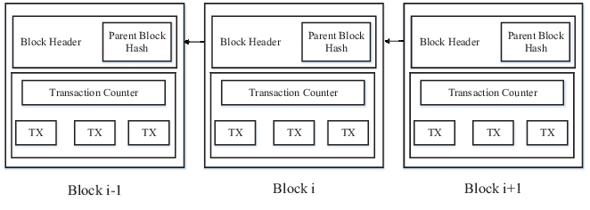
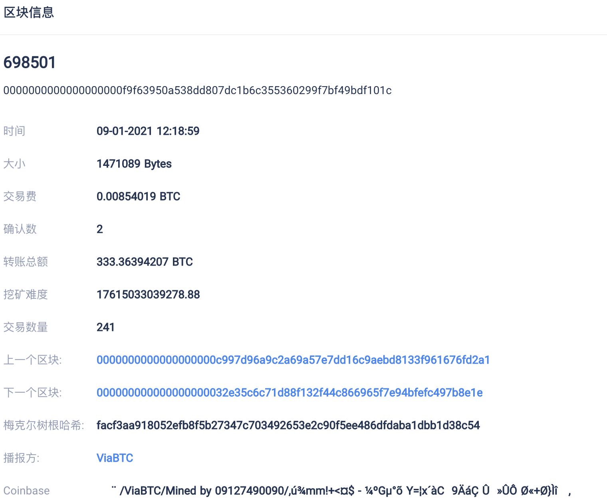
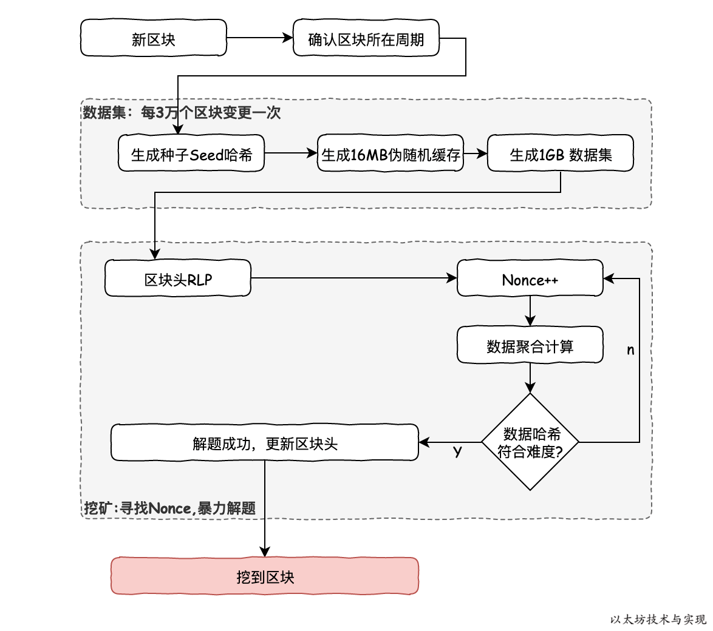

# 区块链

区块链技术是一种在对等网络环境下，通过透明和可信规则，构建不可伪造、难以篡改和可追溯的块链式数据结构，实现和管理可信数据的产生、存取和使用的模式。技术架构上，区块链是由分布式架构与分布式存储、块链式数据结构、点对点网络、共识算法、密码学算法、博弈论、智能合约等多种信息技术共同组成的整体解决方案。

## 联盟链

行业里通常将区块链的类型分为公有链，联盟链，私有链。公有链指所有人都可以随时随地参与甚至是匿名参与的链；私有链指一个主体（如一个机构或一个自然人）所有，私有化的管理和使用的链；联盟链通常是指多个主体达成一定的协议，或建立了一个业务联盟后，多方共同组建的链，加入联盟链的成员需要经过验证，一般是身份可知的。正因为有准入机制，所以联盟链也通常被称为“许可链”。

因为联盟链从组建、加入、运营、交易等环节有准入和身份管理，在链上的操作可以用权限进行管控，共识方面一般采用PBFT等基于多方多轮验证投票的共识机制，不采用POW挖矿的高能耗机制，网络规模相对可控，在交易时延性、事务一致性和确定性、并发和容量方面都可以进行大幅的优化。

联盟链在继承区块链技术的优势的同时，更适合性能容量要求高，强调监管、合规的敏感业务场景，如金融、司法、以及大量和实体经济相关的业务。联盟链的路线，兼顾了业务合规稳定和业务创新，也是国家和行业鼓励发展的方向。

### 性能

#### 性能指标

软件系统的处理性能指标最常见的是TPS（Transaction Per Second），即系统每秒能处理和确认的交易数，TPS越高，性能越高。区块链领域的性能指标除了TPS之外，还有确认时延，网络规模大小等。

确认时延是指交易发送到区块链网络后，经过验证、运算和共识等一系列流程后，到被确认时所用的时间，如比特币网络一个区块是10分钟，交易被大概率确认需要6个区块，即一个小时。采用PBFT算法的话，可以使交易在秒级确认，一旦确认即具有最终确定性，更适合金融等业务需求。

网络规模指在保证一定的TPS和确认时延前提下，能支持多少共识节点的协同工作。业界一般认为采用PBFT共识算法的系统，节点规模在百级左右，再增加就会导致TPS下降，确认时延增加。目前业界有通过随机数算法选择记账组的共识机制，可以改善这个问题。

#### 性能优化

性能的优化有两个方向,向上扩展（Scale up）和平行扩展（Scale out）。向上扩展指在有限的资源基础上优化软硬件配置，极大提升处理能力，如采用更有效率的算法，采用硬件加速等。平行扩展指系统架构具有良好的可扩展性，可以采用分片、分区的方式承载不同的用户、业务流的处理，只要适当增加软硬件资源，就能承载更多的请求。

性能指标和软件架构，硬件配置如CPU、内存、存储规格、网络带宽都密切相关，且随着TPS的增加，对存储容量的压力也会相应增加，需要综合考虑。

### 安全性

安全性是个很大的话题，尤其是构建在分布式网络上多方参与的区块链系统。在系统层面，需要关注网络攻击、系统渗透、数据破坏和泄漏的问题，在业务层面需要关注越权操作、逻辑错误、系统稳定性造成的资产损失、隐私被侵害等问题。

安全性的保障要关注”木桶的短板“，需要有综合性的防护策略，提供多层面，全面的安全防护，满足高要求的安全标准，并提供安全方面的最佳实践，对齐所有参与者的安全级别，保障全网安全。

#### 准入机制

准入机制指在无论是机构还是个人组建和加入链之前，需要满足身份可知、资质可信，技术可靠的标准，主体信息由多方共同审核后，才会启动联盟链组建工作，然后将经过审核的主体的节点加入到网络，为经过审核的人员分配可发送交易的公私钥。 在准入完成后，机构、节点、人员的信息都会登记到链上或可靠的信息服务里，链上的一切行为都可以追溯到机构和人。

#### 权限控制

联盟链上权限控制即不同人员对各种敏感级别的数据读写的控制，细分可以罗列出如合约部署、合约内数据访问、区块数据同步、系统参数访问和修改、节点启停等不同的权限，根据业务需要，还可以加入更多的权限控制点。

权限是分配给角色的，可沿用典型的基于角色的权限访问控制（Role-Based Access Control）设计，一个参考设计是将角色分为运营管理者，交易操作员，应用开发者，运维管理者，监管方，每个角色还可以根据需要细分层级，完备的模型可能会很庞大复杂，可以根据场景需要进行适当的设计，能达到业务安全可控的程度即可。

#### 隐私保护

基于区块链架构的业务场景要求各参与方都输出和共享相关数据，以共同计算和验证，在复杂的商业环境中，机构希望自己的商业数据受控，在越来越被重视的个人数据隐私保护的形势下，个人对隐私保护的诉求也日益增强。如何对共享的数据牵涉隐私的部分进行保护，以及在避免运作过程泄漏隐私，是一个很重要的问题。

隐私保护首先是个管理问题，要求在构建系统开展业务时，把握“最小授权，明示同意的原则”，对数据的收集、存储、应用、披露、删除、恢复全生命周期进行管理，建立日常管理和应急管理制度，在高敏感业务场景设定监管角色，引入第三方检视和审计，从事先事中事后全环节进行管控。

在技术上，可以采用数据脱敏，业务隔离或者系统物理隔离等方式控制数据分发范围，同时也可以引入密码学方法如零知识证明、安全多方计算、环签名、群签名、盲签名等，对数据进行高强度的加密保护。

#### 物理隔离

这个概念主要用于隐私保护领域，“物理隔离”是避免隐私数据泄露的彻底手段，物理隔离指只有共享数据的参与者在网络通信层互通，不参与共享数据的参与者在网络互相都不能通信，不交换哪怕一个字节的数据。

相对而言的是逻辑隔离，参与者可以接收到和自己无关的数据，但数据本身带上权限控制或加密保护，使得没有授权或密钥的参与者不能访问和修改。但随着技术的发展，所受到的权限受控数据或加密数据在若干年后依旧有可能被破解。

对极高敏感性的数据，可以采用“物理隔离”的策略，从根源上杜绝被破解的可能性。相应的成本是需要仔细甄别数据的敏感级别，对隔离策略进行周密的规划，并分配足够的硬件资源承载不同的数据。

### 治理与监管

#### 联盟链治理

联盟链治理牵涉到多参与方协调工作，激励机制，安全运营，监管审计等一系列的问题，核心是理清各参与方的责权利，工作流程，构建顺畅的开发和运维体系，以及保障业务的合法合规，对包括安全性在内的问题能事先防范事后应急处理。为达成治理，需要制定相关的规则且保证各参与方达成共识并贯彻执行。

一个典型的联盟链治理参考模型是各参与方共同组建联盟链委员会，共同讨论和决议，根据场景需要设定各种角色和分配任务，如某些机构负责开发，某些机构参与运营管理，所有机构参与交易和运维，采用智能合约实现管理规则和维护系统数据，委员会和监管机构可掌握一定的管理权限，对业务、机构、人员进行审核和设置，并在出现紧急情况时，根据事先约定的流程，通过共识过的智能合约规则，进行应急操作，如账户重置，业务调整等，在需要进行系统升级时，委员会负责协调各方进行系统更新。

在具备完善治理机制的联盟链上，各参与方根据规则进行点对点的对等合作，包括资产交易、数据交换，极大程度提升运作效率，促进业务创新，同时合规性和安全性等方面也得到了保障。

#### 快速部署

构建一个区块链系统的大致步骤包括：获取硬件资源包括服务器、网络、内存、硬盘存储等，进行环境配置包括选择指定操作系统、开通网络端口和相关策略、带宽规划、存储空间分配等，获取区块链二进制可运行软件或者从源码进行编译，然后进行区块链系统的配置，包括创世块配置、运行时参数配置，日志配置等，进行多方互联配置，包括节点准入配置、端口发现、共识参与方列表等，客户端和开发者工具配置，包括控制台、SDK等，这个过程会包括许多细节，如各种[[证书]]和公私钥的管理等，很容易出现环境、版本、配置的差错，导致整个过程复杂、繁琐和反复，形成了较高的使用门槛。

如何将以上步骤简化和加速，使构建和组链过程变得简便，快速，不容易出错，且低成本，需要从以下几方面进行考虑： 首先，标准化目标部署平台，事先将操作系统、依赖软件列表、网络带宽和存储容量、网络策略等关键的软硬件准备好，对齐版本和参数，使得平台可用，依赖完备。当下流行的云服务，[[docker]]等方式都可以帮助构建这样的标准化平台。

然后，从使用者的视角出发，优化区块链软件的构建、配置和组链流程，提供快速构建，自动组链的工具，使得使用者不需要关注诸多细节，简单的几步操作即可运行起供开发调试、上线运行的链。

FISCO BCOS非常重视使用者的部署体验，提供了一键部署的命令行，帮助开发者快速搭建开发调试环境，提供企业级搭链工具，面向多机构联合组链的场景，灵活的进行主机、网络等参数配置，管理相关的证书，便于多个企业之间协同工作。经过快速部署的优化，将使用者搭起区块链的时间缩短到几分钟到半小时以内。

#### 数据治理

区块链强调数据层层验证，历史记录可追溯，常见的方案是从创世块以来，所有的数据都会保存在所有的参与节点上（轻节点之外），导致的结果是数据膨胀，容量紧张，尤其是在承载海量服务的场景里，在一定时间之后，一般的存储方案已经无法容纳数据，而海量存储成本很高，另一个角度是安全性，全量数据永久保存，可能面临历史数据泄露的风险，所以需要在数据治理方面进行设计。

数据治理主要是几个策略：裁剪迁移，平行扩容，分布式存储。如何选择需要结合场景分析。

对具有较强时间特征的数据，如某业务的清结算周期是一个星期，那么一个星期前的数据不需要参与在线计算和验证，旧的数据则可以从节点迁移到大数据存储里，满足数据可查询可验证的需求以及业务保存年限的要求，线上节点的数据压力大幅降低，历史数据离线保存，在安全策略上也可以进行更严密的保护。

对规模持续扩大的业务，如用户数或合同存证量剧增，可以针对不同的用户和合同，分配到不同的逻辑分区，每个逻辑分区有独立的存储空间，只承载一定容量的数据，当接近容量的上限，则再分配更多资源容纳新的数据。分区的的设计使得在资源调配，成本管理上都更容易把控。

结合数据裁剪迁移和平行扩容，数据的容量成本，安全级别都得到很好的控制，便于开展海量规模的业务。

#### 运维监控

区块链系统从构建和运行逻辑上都具有较高一致性，不同节点的软硬件系统基本一致。其标准化特性给运维人员带来了便利，可使用通用的工具、运维策略和运维流程等对区块链系统进行构建、部署、配置、故障处理，从而降低运维成本以及提升效率。

运维人员对联盟链的操作会被权限系统控制，运维人员有修改系统配置、启停进程、查看运行日志、排查故障等权限，但不参与到业务交易中，也不能直接查看具有较高安全隐私等级的用户数据，交易数据。

系统运行过程中，可通过监控系统对各种运行指标进行监控，对系统的健康程度进行评估，当出现故障时发出告警通知，便于运维快速反应，进行处理。

监控的维度包括基础环境监控,如CPU占比、系统内存占比和增长、磁盘IO情况、网络连接数和流量等。

区块链系统监控包括如区块高度、交易量和虚拟机计算量，共识节点出块投票情况等。

接口监控包括如接口调用计数、接口调用耗时情况、接口调用成功率等。

监控数据可以通过日志或网络接口进行输出，便于和机构的现有的监控系统进行对接，复用机构的监控能力和既有的运维流程。运维人员收到告警后，采用联盟链提供的运维工具，查看系统信息、修改配置、启停进程、处理故障等。

#### 监管审计

随着区块链技术和业务形态探索的发展，需要在区块链技术平台上提供支持监管的功能，避免区块链系统游离于法律法规以及行业规则之外，成为洗钱、非法融资或犯罪交易的载体。

审计功能主要用于满足区块链系统的审计内控、责任鉴定和事件追溯等要求，需要以有效的技术手段，配合业务所属的行业标准进行精确的审计管理。

监管者可以做为节点接入到区块链系统里，或者通过接口和区块链系统进行交互，监管者可同步到所有的数据进行审计分析，跟踪全局的业务流程，如发现异常，可以向区块链发出具备监管权限的指令，对业务、参与人、账户等进行管控，实现“穿透式监管”。


# 数据结构

## Link




## [Merkle tree](./DSA.md#Merkle\ Tree)


# Bitcoin

## 基础设计

### 数据结构 




### 网络

[Gossip 协议](./DSA.md#Gossip 协议)


### Setting the mining difficulty
2周计算一次复杂度
$$
next\_difficulty = previous\_difficulty * (\frac{time\ to\ mine\ last\ 2016\ blocks}{2\ weeks})
$$

### 全节点

* 一直在线
* 在本地硬盘上维护完整的区块链信息
* 在内存里维护UTXO集合，以便快速检验交易的正确性
* 监听比特币网络上的交易信息，验证每一个交易的合法性
* 确定哪些交易会被打包到区块里
* 监听别的矿工挖出来的区块，验证其合法性
* 挖矿
  * 决定沿着哪条链挖下去？
  * 当出现等长的分叉的时候，选择哪一个分叉？

### 轻节点

* 不是一直在线
* 不用保存整个区块链，只要保存每个区块的块头
* 不用保存全部交易，只保存与自己相关的交易
* 无法检验大多数交易的合法性，只能检验与自己相关的那些交易的合法性
* 无法检测网上发布的区块的正确性
* 可以验证挖矿的难度
* 只能检测那个是最长链，不知道那个是最长合法链

### UTXO

### 零知识证明

零知识证明是指一方（证明方）向另一方（验证方）证明一个陈述是正确的，而无需透露该陈述是正确外的任何信息。


# Ethereum

## 基础设计

### 数据结构 

[go-ethereum/core/types/block.go](https://github.com/ethereum/go-ethereum/blob/5441a8fa47/core/types/block.go)

```go
// Header represents a block header in the Ethereum blockchain.
type Header struct {
	ParentHash  common.Hash    `json:"parentHash"       gencodec:"required"`
	UncleHash   common.Hash    `json:"sha3Uncles"       gencodec:"required"`
	Coinbase    common.Address `json:"miner"            gencodec:"required"`
	Root        common.Hash    `json:"stateRoot"        gencodec:"required"`
	TxHash      common.Hash    `json:"transactionsRoot" gencodec:"required"`
	ReceiptHash common.Hash    `json:"receiptsRoot"     gencodec:"required"`
	Bloom       Bloom          `json:"logsBloom"        gencodec:"required"`
	Difficulty  *big.Int       `json:"difficulty"       gencodec:"required"`
	Number      *big.Int       `json:"number"           gencodec:"required"`
	GasLimit    uint64         `json:"gasLimit"         gencodec:"required"`
	GasUsed     uint64         `json:"gasUsed"          gencodec:"required"`
	Time        uint64         `json:"timestamp"        gencodec:"required"`
	Extra       []byte         `json:"extraData"        gencodec:"required"`
	MixDigest   common.Hash    `json:"mixHash"`
	Nonce       BlockNonce     `json:"nonce"`

	// BaseFee was added by EIP-1559 and is ignored in legacy headers.
	BaseFee *big.Int `json:"baseFeePerGas" rlp:"optional"`
}

// Block represents an entire block in the Ethereum blockchain.
type Block struct {
	header       *Header
	uncles       []*Header
	transactions Transactions

	// caches
	hash atomic.Value
	size atomic.Value

	// Td is used by package core to store the total difficulty
	// of the chain up to and including the block.
	td *big.Int

	// These fields are used by package eth to track
	// inter-peer block relay.
	ReceivedAt   time.Time
	ReceivedFrom interface{}
}

// NewBlock creates a new block. The input data is copied,
// changes to header and to the field values will not affect the
// block.
//
// The values of TxHash, UncleHash, ReceiptHash and Bloom in header
// are ignored and set to values derived from the given txs, uncles
// and receipts.
func NewBlock(header *Header, txs []*Transaction, uncles []*Header, receipts []*Receipt, hasher TrieHasher) *Block {
	b := &Block{header: CopyHeader(header), td: new(big.Int)}

	// TODO: panic if len(txs) != len(receipts)
	if len(txs) == 0 {
		b.header.TxHash = EmptyRootHash
	} else {
    // 计算出交易的根hash值
		b.header.TxHash = DeriveSha(Transactions(txs), hasher)
		b.transactions = make(Transactions, len(txs))
		copy(b.transactions, txs)
	}

	if len(receipts) == 0 {
		b.header.ReceiptHash = EmptyRootHash
	} else {
    // 计算出回执的根hash值
		b.header.ReceiptHash = DeriveSha(Receipts(receipts), hasher)
    // 创建bloom filter
    // 由当前区块中所有receipts的Bloom Filter组合得到
		b.header.Bloom = CreateBloom(receipts)
	}

	if len(uncles) == 0 {
		b.header.UncleHash = EmptyUncleHash
	} else {
		b.header.UncleHash = CalcUncleHash(uncles)
		b.uncles = make([]*Header, len(uncles))
		for i := range uncles {
			b.uncles[i] = CopyHeader(uncles[i])
		}
	}

	return b
}
```

1. 交易树：记录交易的状态和变化。每个块都有各自的交易树，且不可更改
2. 收据树(交易收据)：交易收据的存储
3. 状态树(账户信息)：帐户中各种状态的保存。如余额等。
4. Storage Trie 存储树 ：存储只能合约状态 ，每个账号有自己的Storage Trie 。

[go-ethereum/core/types/receipt.go](https://github.com/ethereum/go-ethereum/blob/master/core/types/receipt.go)

```go
// Receipt represents the results of a transaction.
type Receipt struct {
	// Consensus fields: These fields are defined by the Yellow Paper
	Type              uint8  `json:"type,omitempty"`
	PostState         []byte `json:"root"`
	Status            uint64 `json:"status"`
	CumulativeGasUsed uint64 `json:"cumulativeGasUsed" gencodec:"required"`
	Bloom             Bloom  `json:"logsBloom"         gencodec:"required"`
	Logs              []*Log `json:"logs"              gencodec:"required"`

	// Implementation fields: These fields are added by geth when processing a transaction.
	// They are stored in the chain database.
	TxHash          common.Hash    `json:"transactionHash" gencodec:"required"`
	ContractAddress common.Address `json:"contractAddress"`
	GasUsed         uint64         `json:"gasUsed" gencodec:"required"`

	// Inclusion information: These fields provide information about the inclusion of the
	// transaction corresponding to this receipt.
	BlockHash        common.Hash `json:"blockHash,omitempty"`
	BlockNumber      *big.Int    `json:"blockNumber,omitempty"`
	TransactionIndex uint        `json:"transactionIndex"`
}

```


`trie` 的数据结构是[MPT](./DSA.md#"MPT TREE")

```go
// Trie is a Merkle Patricia Trie.
// The zero value is an empty trie with no database.
// Use New to create a trie that sits on top of a database.
//
// Trie is not safe for concurrent use.
type Trie struct {
	db   *Database
	root node
	// Keep track of the number leafs which have been inserted since the last
	// hashing operation. This number will not directly map to the number of
	// actually unhashed nodes
	unhashed int
}
```


### 挖矿

#### 矿工的主要功能

* 挖矿或打包交易产生新的区块并写入到以太账本
* 向其他矿工发送最新的区块，并通知他们接收
* 接收其他矿工的区块，并更新本地的账本


#### 挖矿的过程

1. 矿工抓取两个交易的 hash 值，进行再次散列并产生一个新的 hash 值，直到对所有交易完成散列后，将得到唯一的 hash 值，这就是根交易 hash 值或 Merkle 根交易 hash 值，它将被添加到区块头。
2. 矿工也需要确定上一个区块的 hash 值，因为它是当前区块的父区块，父区块的 hash 值要保存在当前区块头中。
3. 矿工计算交易的 state 和 receipts 根 hash 值，然后写入区块头。
4. Nonce 和时间戳记录到区块头。
5. 产生整个区块（包括区块头和区块体）的 hash 值。
6. 挖矿流程开始，矿工持续变换 Nonce 值，直到发现该 hash 值能够解决难题为止，对所有网络上的矿工而言，执行过程是一样的。
7. 某一个矿工最终能够找到这个难题的答案，它会将结果发送给网络上的其他矿工。其他矿工会先确认该答案是否正确，如果是正确的，将开始验证每个交易，然后接受该区块，并添加到他们的本地账本中。


#### GHOST


#### ETHASH

因此在以太坊设计共识算法时，期望达到两个目的：

1. 抗ASIC性：为算法创建专用硬件的优势应尽可能小，理想情况是即使开发出专有的集成电路，加速能力也足够小。以便普通计算机上的用户仍然可以获得微不足道的利润。
2. 轻客户端可验证性: 一个区块应能被轻客户端快速有效校验。



Ethash 是 Ethereum 1.0 计划的 PoW 算法。算法基本内容如下：

1. 存在一个**种子（seed)**，这个种子可以通过扫描区块头部直到该点为每个区块计算。
2. 从种子中，可以计算出**16 MB的伪随机缓存**。轻客户端存储此缓存。
3. 从缓存中，可以生成**1 GB的DAG数据集**，数据集中的每个项仅依赖于缓存中的少量项。完整客户端和矿工存储此数据集。数据集随时间线性增长。


https://learnblockchain.cn/books/geth/

[ethash](https://eth.wiki/en/concepts/ethash/ethash)


### 网络
[Kademlia](./DSA.md#Kademlia)

在以太坊中，节点之间数据的传输是通过 tcp 来完成的。但是节点如何找到可以进行数据传输的节点？这就涉及到 P2P 的核心部分节点发现了。每个节点会维护一个 table，table 中会存储可供连接的其他节点的地址。这个 table 通过基于 udp 的节点发现机制来保持更新和可用。当一个节点需要更多的 TCP 连接用于数据传输时，它就会从这个 table 中获取待连接的地址并建
立 TCP 连接。

为了防止节点之间的 tcp 互联形成信息孤岛，每个以太坊节点间的连接都分为两种类型：bound_in 和 bound_out。bound_in 指本节点接收到别人发来的请求后建立的 tcp 连接，bound_out 指本节点主动发起的 tcp 连接。假设一个节点最多只能与 6 个节点互联，那么在默认的设置中，节点最多只能主动和 4 个节点连接，剩余的必须留着给其它节点接入用。对于 bound_in 连接的数量则不做限制。


### 账户

账户是以太坊体系的主要组成部分 以太坊将交易保存到账本上的过程， 其实就是账户之间进行交互的过程 以太坊有两种类型的账户：外部账户和合 约账户 每个账户默认有一个余额属性，可以查看该账户以太币的当前余额。

#### 外部账户

以太坊上的用户所拥有的账户。在以太坊中，账户不能使用名称来调用。当你在以太坊上创建一个外部账户是，会产生一对公钥和私钥。私钥需要存放在安全的地方，而公钥就是你对账户持有所有权的证明。公钥一般是256个字符，而以太坊只使用前面160个字符来标识身份（账户地址）。

外部账户能够持有以太币，但是不能执行任何代码。它能够与其他外部账户执行交易，也可以借助于智能合约中的函数执行交易。

#### 合约账户

合约账户于外部账户很相似，可以从公开的地址来识别他们。合约账户没有私钥，但可以像外部账户一样持有以太币，不同的是，合约账户可以包含代码，它的代码是由函数和状态变量组成的。


## 智能合约

### 什么是智能合约

* 智能合约是运行在区块链上的一段代码，代码的逻辑定义了合约的内容
* 智能合约的账户保存了合约当前的运行状态
  * **balance** 当前余额
  * **nonce** 交易次数
  * **code** 合约代码
  * **storage** 存储，数据结构是一棵MPT

### 智能合约的创建和运行

* 智能合约的代码写完后，需要编译成 `bytecode`
* 创建合约: 外部账户发起一个转账交易到`0x0`的地址
  * 转账的金额是0，但是要支付汽油费
  * 合约的代码放在data域里
* 智能合约运行在 EVM(Ethereum Virtual Machine) 上
* 以太坊是一个交易驱动的状态机
  * 调用智能合约的交易发布到区块链上后，每个矿工都会执行这个交易，从当前状态确定性地转移到下一个状态

### Gas fee (汽油费)

* 智能合约是个 Turing-complete Programming Model

* 执行合约中的指令要收取汽油费，由发起交易的人来支付

  ```go
  // TxData is the underlying data of a transaction.
  //
  // This is implemented by DynamicFeeTx, LegacyTx and AccessListTx.
  type TxData interface {
  	txType() byte // returns the type ID
  	copy() TxData // creates a deep copy and initializes all fields
  
  	chainID() *big.Int
  	accessList() AccessList
  	data() []byte
  	gas() uint64
  	gasPrice() *big.Int
  	gasTipCap() *big.Int
  	gasFeeCap() *big.Int
  	value() *big.Int
  	nonce() uint64
  	to() *common.Address			// nil means contract creation
  
  	rawSignatureValues() (v, r, s *big.Int)
  	setSignatureValues(chainID, v, r, s *big.Int)
  }
  ```

* EVM中不同指令消耗的汽油费是不一样的

  * 简单的指令很便宜，复杂的活着需要存储状态的指令就很贵

### 错误处理

* 智能合约中不存在自定义的`try-catch`结构
* 一旦遇到异常，除了特殊情况外，本次执行操作全部回滚
* 可以抛出错误的语句:
  * `assert(bool condition)` 如果条件不满足就抛出 -- 用于内部错误
  * `require(bool condition)` 如果条件不满足就抛掉 -- 用于输入或者外部组件引起的错误
  * `revert()` 终止运行并回滚状态变动

### 嵌套调用

* 智能合约的执行具有原子性：执行过程中出现错误，会导致回滚
* 嵌套调用是指一个合约调用另一个合约中的函数
* 嵌套调用是否会触发连锁式的回滚？
  * 如果被调用的合约执行过程中发生异常，会不会导致发起调用的这个合约也跟着一起回滚？
  * 有些调用方法会引起连锁式的回滚，有些则不会
* 一个合约直接指向一个合约账户里转账，没有指明调用那个函数，仍然会引起嵌套调用

### 智能合约可以获得区块、交易、调用者信息

- `blockhash(uint blockNumber) returns (bytes32)`: hash of the given block when `blocknumber` is one of the 256 most recent blocks; otherwise returns zero
- `block.basefee` (`uint`): current block’s base fee ([EIP-3198](https://eips.ethereum.org/EIPS/eip-3198) and [EIP-1559](https://eips.ethereum.org/EIPS/eip-1559))
- `block.chainid` (`uint`): current chain id
- `block.coinbase` (`address payable`): current block miner’s address
- `block.difficulty` (`uint`): current block difficulty
- `block.gaslimit` (`uint`): current block gaslimit
- `block.number` (`uint`): current block number
- `block.timestamp` (`uint`): current block timestamp as seconds since unix epoch
- `gasleft() returns (uint256)`: remaining gas
- `msg.data` (`bytes calldata`): complete calldata
- `msg.sender` (`address`): sender of the message (current call)
- `msg.sig` (`bytes4`): first four bytes of the calldata (i.e. function identifier)
- `msg.value` (`uint`): number of wei sent with the message
- `tx.gasprice` (`uint`): gas price of the transaction
- `tx.origin` (`address`): sender of the transaction (full call chain)

### 智能合约语言

[Solidity](./Solidity.md)

# [FISCO BCOS](./fisco\ bcos.md)


# Term

## Chain of block 

由多个区块通过哈希（hash）串联成一条链式结构的数据组织方式。区块链则是采用多项技术交叉组合，维护管理这个chain of block数据结构，形成一个不可篡改的分布式账本的综合技术领域。

## 账本

用于管理账户、交易流水等数据，支持分类记账、对账、清结算等功能。多方合作中，多个参与方希望共同维护和共享一份及时、正确、安全的分布式账本，以消除信息不对称，提升运作效率，保证资金和业务安全。

## 区块

按时间次序构建的数据结构，区块链的第一个区块称为“创世块”（genesis block），后续生成的区块用“高度”标识，每个区块高度逐一递增，新区块都会引入前一个区块的hash信息，再用hash算法和本区块的数据生成唯一的数据指纹，从而形成环环相扣的块链状结构，称为“Blockchain”也即区块链。精巧的数据结构设计，使得链上数据按发生时间保存，可追溯可验证，如果修改任何一个区块里的任意一个数据，都会导致整个块链验证不通过，从而篡改的成本会很高。

一个区块的基本数据结构是区块头和区块体，区块头包含区块高度，hash、出块者签名、状态树根等一些基本信息，区块体里包含一批交易数据列表已经相关的回执信息，根据交易列表的大小，整个区块的大小会有所不同，考虑到网络传播等因素，一般不会太大，在1M~几M字节之间。

## 交易

交易可认为是一段发往区块链系统的请求数据，用于部署合约，调用合约接口，维护合约的生命周期，以及管理资产，进行价值交换等，交易的基本数据结构包括发送者，接受者，交易数据等。用户可以构建一个交易，用自己的私钥给交易签名，发送到链上（通过sendRawTransaction等接口），由多个节点的共识机制处理，执行相关的智能合约代码，生成交易指定的状态数据，然后将交易打包到区块里，和状态数据一起落盘存储，该交易即为被确认，被确认的交易被认为具备了事务性和一致性。

## 账户

在采用账户模型设计的区块链系统里，账户这个术语代表着用户、智能合约的唯一性存在。

在采用公私钥体系的区块链系统里，用户创建一个公私钥对，经过hash等算法换算即得到一个唯一性的地址串，代表这个用户的账户，用户用该私钥管理这个账户里的资产。用户账户在链上不一定有对应的存储空间，而是由智能合约管理用户在链上的数据，因此这种用户账户也会被称为“外部账户”。

对智能合约来说，一个智能合约被部署后，在链上就有了一个唯一的地址，也称为合约账户，指向这个合约的状态位、二进制代码、相关状态数据的索引等。智能合约运行过程中，会通过这个地址加载二进制代码，根据状态数据索引去访问世界状态存储里对应的数据，根据运行结果将数据写入世界状态存储，更新合约账户里的状态数据索引。智能合约被注销时，主要是更新合约账户里的合约状态位，将其置为无效，一般不会直接清除该合约账户的实际数据。

## 世界状态

智能合约执行过程产生的状态数据，经过共识机制确认，分布式的保存在各节点上，数据全局一致，可验证难篡改，所以称为“世界状态”。

## 共识机制

共识机制是区块链领域的核心概念，无共识，不区块链。区块链作为一个分布式系统，可以由不同的节点共同参与计算、共同见证交易的执行过程，并确认最终计算结果。协同这些松散耦合、互不信任的参与者达成信任关系，并保障一致性，持续性协作的过程，可以抽象为“共识”过程，所牵涉的算法和策略统称为共识机制。

## 节点

安装了区块链系统所需软硬件，加入到区块链网络里的计算机，可以称为一个“节点”。节点参与到区块链系统的网络通信、逻辑运算、数据验证，验证和保存区块、交易、状态等数据，并对客户端提供交易处理和数据查询的接口。节点的标识采用公私钥机制，生成一串唯一的NodeID，以保证它在网络上的唯一性。

根据对计算的参与程度和数据的存量，节点可分为共识节点和观察节点。共识节点会参与到整个共识过程，做为记账者打包区块、做为验证者验证区块以完成共识过程。观察节点不参与共识，同步数据，进行验证并保存，可以做为数据服务者提供服务。

## 共识算法

共识算法需要解决的几个核心问题是：

1. 选出在整个系统中具有记账权的角色，做为leader发起一次记账。
2. 参与者采用不可否认和不能篡改的算法，进行多层面验证后，采纳Leader给出的记账。
3. 通过数据同步和分布式一致性协作，保证所有参与者最终收到的结果都是一致的，无错的。

区块链领域常见的共识算法有公链常用的[工作量证明（Proof of Work）](./DSA.md#POW),[权益证明（Proof of Stake）](./DSA.md#POS)，[委托权益证明（Delegated Proof of Stake）](./DSA.md#DPOS)，以及联盟链常用的实用性拜占庭容错共识[PBFT（Practical Byzantine Fault Tolerance)](./DSA.md#PBFT)，[Raft（Replication and Fault Tolerant）](./DSA.md#Raft)等，另外一些前沿性的共识算法通常是将随机数发生器和上述几个共识算法进行有机组合，以改善安全、能耗以及性能和规模问题。

## 智能合约

智能合约概念于1995年由Nick Szabo首次提出，指以数字形式定义的能自动执行条款的合约，数字形式意味着合约必须用计算机代码实现，因为只要参与方达成协定，智能合约建立的权利和义务，就会被自动执行，且结果不能被否认。

## 智能合约生命周期

智能合约的生命周期为设计，开发,测试,部署,运行,升级,销毁等几个步骤。

开发人员根据需求，进行智能合约代码的编写，编译，单元测试。在合约通过测试后，采用部署指令发布到链上，经过共识算法确认后，合约生效并被后续的交易调用。

当合约需要更新升级时，重复以上开发到部署的步骤，发布新版合约，新版合约会有一个新的地址和独立的存储空间，并不是覆盖掉旧合约。新版合约可通过旧合约数据接口访问旧版本合约里保存的数据，或者通过数据迁移的方式将旧合约的数据迁移到新合约的存储里，最佳实践是设计执行流程的“行为合约”和保存数据的“数据合约”，将数据和合约解耦，当业务流程产生改变，而业务数据本身没有改变时，新行为合约直接访问原有的“数据合约”即可。

销毁一个旧合约并不意味着清除合约的所有数据，只是将其状态置为“无效”，该合约则不可再被调用。

## 智能合约虚拟机

为了运行数字智能合约，区块链系统必须具备可编译、解析、执行计算机代码的编译器和执行器，统称为虚拟机体系。合约编写完毕后，用编译器编译，发送部署交易将合约部署到区块链系统上，部署交易共识通过后，系统给合约分配一个唯一地址和保存合约的二进制代码，当某个合约被另一个交易调用后，虚拟机执行器从合约存储里加载代码并执行，并输出执行结果。

在强调安全性、事务性和一致性的区块链系统里，虚拟机应具有沙盒特征，屏蔽类似随机数、系统时间、外部文件系统、网络等可能导致不确定性的因素，且可以抵抗恶意代码的侵入，以保证在不同节点上同一个交易和同一个合约的执行生成的结果是一致的，执行过程是安全的。

当前流行的虚拟机机制包括EVM， 受控的Docker，WebAssembly等。

##  智能合约ABI

ABI是合约接口的说明，内容包括合约的接口列表、接口名称、参数名称、参数类型、返回类型等。这些信息以JSON格式保存，可以在solidity文件编译时由合约编译器生成，


## 图灵完备

图灵机和图灵完备是计算机领域的经典概念，由数学家艾伦·麦席森·图灵（1912～1954）提出的一种抽象计算模型，引申到区块链领域，主要指合约支持判断、跳转、循环、递归等逻辑运算，支持多种数据类型如整形、字符串、结构体的数据处理能力，甚至有一定的面向对象特性如继承、派生、接口等，这样才能支持复杂的业务逻辑和完备的契约执行，与只支持栈操作的简单脚本进行区分

## Genesis Block

创世纪块, 系统产生的第一个区块

## Most recent block

最新产生的区块

## conllion resists

抗碰撞性 对于任意两个不同的数据块，其hash值相同的可能性极小；对于一个给定的数据块，找到和它hash值相同的数据块极为困难。


## 鸽巢原理

又名**狄利克雷抽屉原理**、**鸽笼原理**。若有n个笼子和n+1只鸽子，所有的鸽子都被关在鸽笼里，那么至少有一个笼子有至少2只鸽子。


## NFT

非同质化代币（英语：non-fungible token）是一种被称为区块链数位账本上的数据单位，每个代币可以代表一个独特的数码资料。由于其不能互换，非同质化代币可以代表数位文件，如画作、声音、影片、游戏中的项目或其他形式的创意作品。虽然文件（作品）本身是可以无限复制的，但代表它们的代币在其底层区块链上被追踪，并为买家提供所有权证明。


## 图灵完备

> 世界上是否所有数学问题都有明确的答案？
>
> 如果有，是否可以通过有限步骤的计算得到答案？
>
> 如果是，能否通过一种图灵机（即数学模型、计算理论模型），经过不断运行直到数学答案被计算出来？
>
>  
>
> ——来自天才少年**阿兰·麦席森·图灵在《论可计算数及其在判定性问题上的应用》**三个思考。

### 图灵机

1936年5月，年仅24岁的**英国数学家图灵**发表了一篇题为《论可计算数及其在判定性问题上的应用》的论文。在此篇论文中，图灵提出一种**假想的计算装置，后来被称为“图灵机”**


### 图灵完备

在图灵机的基础上，我们再来理解图灵完备。根据维基百科的解释：在可计算性理论里，如果一系列操作数据的规则（如指令集、编程语言、细胞自动机）可以用来模拟单带图灵机，那么它是图灵完备的。

简单来说，**如果一门编程语言、一个指令集可实现图灵机模型里面全部的功能，或者说能够满足任意数据按照一定顺序计算出结果，我们就可称其具有图灵完备性**。像平时使用的C、Java都是图灵完备的编程语言，可实现所有计算机能实现的功能。与图灵完备相反的就是图灵不完备，**图灵不完备**指不允许或限制循环，也就是可以保证每段程序都不会死循环，都有运行完的时候。

对区块链系统而言，**图灵完备或者图灵不完备**都是为了匹配不同的应用需求。在有些场景下，我们需要限制语言本身，以保证程序的终止性。例如，**比特币的脚本语言就是图灵不完备的**，它没有循环语句和复杂的条件控制语句，一定程度上保障了系统的**安全性**。

## ASIC

特殊应用集成电路（英语：Application Specific Integrated Circuit，缩写：ASIC），是指依产品需求不同而全定制的特殊规格集成电路，是一种有别于标准工业IC的集成电路产品。例如，设计用来执行数字录音机或是高效能的比特币挖矿机功能的IC就是ASIC。ASIC芯片通常使用金氧半导体场效晶体管(MOSFET)技术的半导体工艺。
