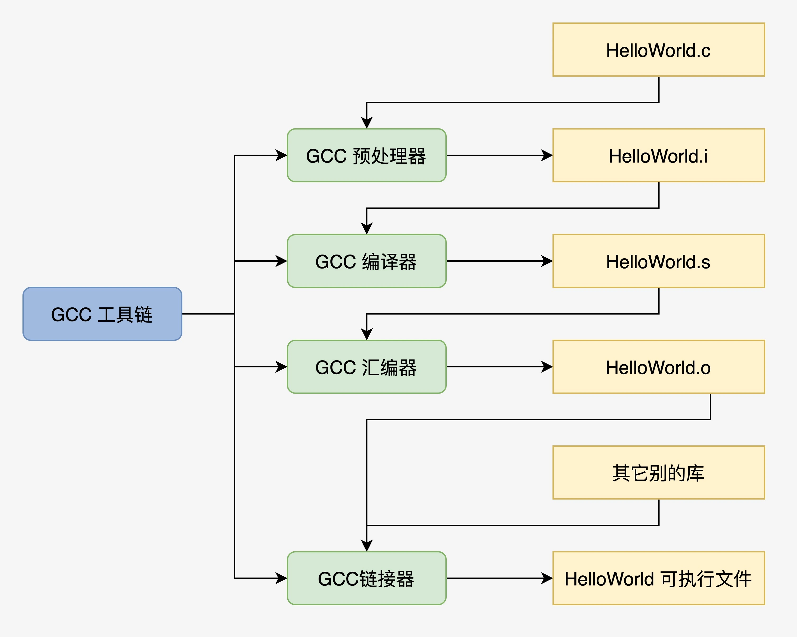

## 程序的编译过程

* 源文件生成预处理文件： gcc -E HelloWorld.c -o HelloWorld.i
* 预处理文件生成编译文件： gcc -S HelloWorld.i -o HelloWorld.s
* 编译文件生成汇编文件： gcc -c HelloWorld.s -o HelloWorld.o
* 汇编文件生成可执行文件：gcc HelloWorld.o -o HelloWorld
* 源文件生成可执行文件：gcc HelloWorld.c -o HelloWorld
