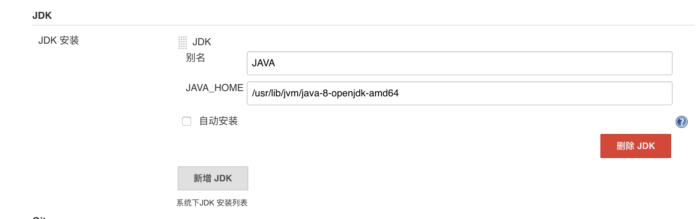
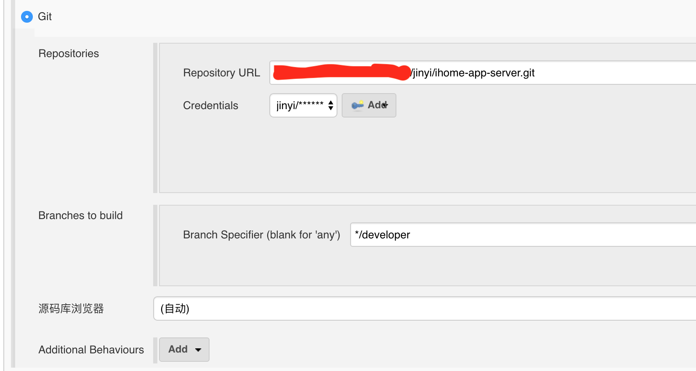

持续集成
安装 jenkins

```
docker pull jenkinsci/jenkins

mkdir /mnt/jenkins
# 解决
# Can not write to /var/jenkins_home/copy_reference_file.log. Wrong volume permissions?
chmod -R 777 /mnt/jenkins/

docker run -d --name jenkins -p 3080:8080 -p 50000:50000 -v /mnt/jenkins/:/var/jenkins_home /mnt/tomcat/webapp:/usr/tomcat/webapp jenkinsci/jenkins

```

安装 git、 PostBuildScript
进入Global Tool Configuration设置，安装java，安装gradle，




新建job


配置job



```bash
mv /var/jenkins_home/workspace/ihome/ihome-api/build/libs/ihome-1.0.war  /usr/tomcat/webapp/ihome.war
```

配置git hooks ( post-receive)

```bash
curl -s --user admin:wmwlap http://jenkinsServer/job/ihome/build?token=d370ad64e14c578c90c20e136cdbb7b4
```

改造本地java项目

```groovy
task propertiesFile << {

    def db_url = 'dbc:sqlserver://192.168.17.108:1433;databaseName=HOME'
    def db_password = 'home@123'
    def pay_notify_url = 'http://192.168.17.108:9000'

    if (project.hasProperty("profile")) {

        if (profile == "test") {
            println profile

            db_url = 'jdbc:sqlserver://192.168.17.10:1433;databaseName=M2_HOME'
            db_password = 'password'
            pay_notify_url = 'http://192.168.11.11:9000'
        }

        if (profile == 'release') {
            db_url = 'jdbc:sqlserver://127.0.0.1:1433;databaseName=M2_HOME'
            db_password = 'password'
            pay_notify_url = 'http://192.168.11.11:9000'
        }
    }
    copy {
        from 'config/template.properties'
        into "src/main/resources"
        rename { file -> "application.properties" }

        expand(db_url:db_url, db_password:db_password, pay_notify_url:pay_notify_url)
    }
}
processResources.dependsOn propertiesFile
```

template.properties

```text
#DB properties:
db.driver=com.microsoft.sqlserver.jdbc.SQLServerDriver
db.url=${db_url}
db.username=sa
db.password=${db_password}
db.initialSize=5
db.minIdle=5
db.maxActive=30
db.maxWait=60000
db.showsql=true


#支付宝支付
alipay.notify_url=${pay_notify_url}/ihome/api/v1/payment/alipay_notify
alipay.return_url=${pay_notify_url}/ihome/api/v1/payment/alipay_return
alipay.app.notify_url=${pay_notify_url}/ihome/api/v2/payment/alipay_app_notify

#微信支付
weixin.app.notify_url=${pay_notify_url}/ihome/api/v2/payment/weixin_app_notify
```

