# 介绍

## 集群架构

* 主节点 承载着Kubernetes控制和管理整个集群系统的控制面板
* 工作节点 运行用户实际部署的应用

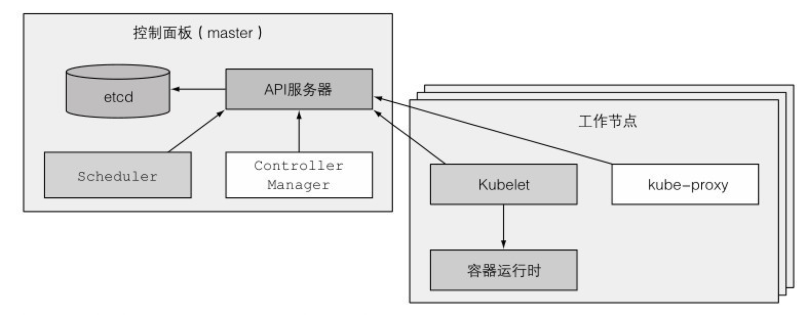

### 控制面板

控制面板用于控制集群并使它工作。它包含多个组件，组件可以运行在单个主节点上或者通过副本分别部署在多个主节点以确保高可用性。这些组件是：

* KubernetesAPI服务器，你和其他控制面板组件都要和它通信

* Scheculer，它调度你的应用（为应用的每个可部署组件分配一个工作节点）

* ControllerManager，它执行集群级别的功能，如复制组件、持续跟踪工作节点、处理节点失败等

* [etcd](../store/etcd.md)，一个可靠的分布式数据存储，它能持久化存储集群配置控制面板的组件持有并控制集群状态，但是它们不运行你的应用程序。这是由工作节点完成的。

### 工作节点

工作节点是运行容器化应用的机器。运行、监控和管理应用服务的任务是由以下组件完成的：

* Docker、rtk或其他的容器类型
* Kubelet，它与API服务器通信，并管理它所在节点的容器
* Kubernetes Service Proxy（kubeproxy），它负责组件之间的负载均衡网络流量


# 基本理论

## 虚拟化

## OpenStack & KVM

### OpenStack

OpenStack是一个云操作系统，通过数据中心可控制大型的计算、存储、网络等资源池。所有的管理通过前端界面管理员就可以完成，同样也可以通过web接口让最终用户部署资源。

### KVM

基于内核的虚拟机 Kernel-based Virtual Machine（KVM）是一种内建于 Linux® 中的开源虚拟化技术。具体而言，KVM 可帮助您将 Linux 转变为虚拟机监控程序，使主机计算机能够运行多个隔离的虚拟环境，即虚拟客户机或虚拟机（VM）。


## docker

[docker](./deocker.md)


## 容器编排

# INSTALL

## 学习环境


### Install with Homebrew on macOS

```bash
brew install kubernetes-cli
kubectl version
```

### Minikube

#### macos

```bash
brew cask install minikube
```

#### linux

```bash
curl -LO https://storage.googleapis.com/minikube/releases/latest/minikube-linux-amd64
sudo install minikube-linux-amd64 /usr/local/bin/minikube

# startup
minikube start

```


### kubeadm


### docker desktop 

#### 启用k8s 

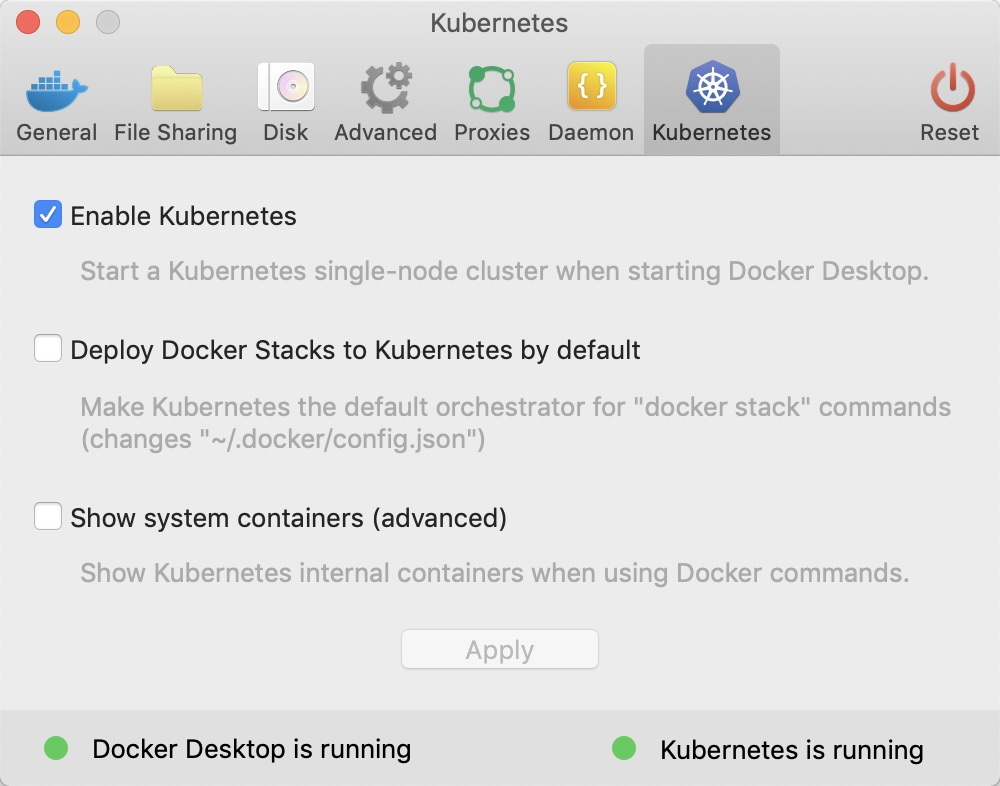

安装完毕后，如果勾选了 Show system containers 选项，那么使用如下的 Docker 命令，能看到自动安装的 Kubernetes 相关容器

```bash
docker container ls --format "table{{.Names}}\t{{.Image }}\t{{.Command}}"
```

在安装过程中，Docker 为我们安装了 kubectl 控制命令

```bash
kubectl get namespaces
# kubectl get posts --namespace kube-system
```

#### Install Kubernetes Dashboard

[github](https://github.com/kubernetes/dashboard)

```bash 
kubectl apply -f https://raw.githubusercontent.com/kubernetes/dashboard/v2.0.0-rc2/aio/deploy/recommended.yaml

# 查看部署的容器和服务
kubectl get deployments --namespace kubernetes-dashboard
kubectl get services --namespace kubernetes-dashboard

# 使用 kubectl 提供的 Proxy 服务来访问Dashboard
kubectl proxy
# 地址
# http://localhost:8001/api/v1/namespaces/kube-system/services/https:kubernetes-dashboard:/proxy/
```

#### [Creating sample user](https://github.com/kubernetes/dashboard/wiki/Creating-sample-user)

使用token的方式访问

```bash
kubectl -n kube-system describe secret $(kubectl -n kube-system get secret | grep admin-user | awk '{print $1}')
```

### [将 Docker Compose 文件转换为 Kubernetes 资源](https://v1-12.docs.kubernetes.io/zh/docs/tasks/configure-pod-container/translate-compose-kubernetes/)

#### macos

```bash
brew install kompose
# 或者下面命令
curl -L https://github.com/kubernetes/kompose/releases/download/v1.16.0/kompose-darwin-amd64 -o kompose

# 部署到 Kubernetes
kompose up
# 从 Kubernetes 删除部署的实例
kompose down
# 要将 docker-compose.yml 转换为 kubectl 可用的文件
kompose convert 
# kubectl 进行创建
kubectl create -f frontend-service.yaml
# 查看部署的服务的详情
kubectl get deployment,svc,pods,pvc
```


### Install Kubeadm 

#### Ubuntu

添加kubeadm的源

```bash
$ curl https://mirrors.aliyun.com/kubernetes/apt/doc/apt-key.gpg | apt-key add -
$ cat <<EOF >/etc/apt/sources.list.d/kubernetes.list
deb https://mirrors.aliyun.com/kubernetes/apt/ kubernetes-xenial main
EOF

$ apt-get update
$ apt-get install -y docker.io kubeadm   # 安装 docker, kubeadm
# 在安装kubeadm过程中,kubeadm、kubelet、kubectl、kubernetes-cni 一并安装好
```

##### 部署Kubernetes Master节点

编写一个yaml配置文件

```yaml
apiVersion: kubeadm.k8s.io/v1beta1
kind: InitConfiguration
controllerManager:
  horizontal-pod-autoscaler-use-rest-clients: "true"
  horizontal-pod-autoscaler-sync-period: "10s"
  node-monitor-grace-period: "10s"
apiServer:
  runtime-config: "api/all=true"
kubernetesVersion: "v1.13.4"
```

```bash
$ kubeadm init --config kubeadm.yaml
```


### 部署容器存储插件

#### Rook

##### 部署 Rook Operator

部署rook, [github](https://github.com/rook/rook)地址。

```bash 
cd cluster/examples/kubernetes/ceph
kubectl create -f common.yaml
kubectl create -f operator.yaml

## verify the rook-ceph-operator is in the `Running` state before proceeding
kubectl -n rook-ceph get pod
```

##### 创建 Rook Ceph 集群

```yaml
# cluster-test.yaml
apiVersion: ceph.rook.io/v1
kind: CephCluster
metadata:
  name: rook-ceph
  namespace: rook-ceph
spec:
  cephVersion:
    image: ceph/ceph:v14.2.4-20190917
    allowUnsupported: false
  dataDirHostPath: /Users/warrior/code/k8s/volume
  mon:
    count: 1
    allowMultiplePerNode: false
  dashboard:
    enabled: true
    ssl: true
  monitoring:
    enabled: false  # requires Prometheus to be pre-installed
    rulesNamespace: rook-ceph
  network:
    hostNetwork: false
```

##### Ceph Dashboard

```yaml
apiVersion: v1
kind: Service
metadata:
  name: rook-ceph-mgr-dashboard-external-http
  namespace: rook-ceph
  labels:
    app: rook-ceph-mgr
    rook_cluster: rook-ceph
spec:
  ports:
  - name: dashboard
    port: 7000
    protocol: TCP
    targetPort: 7000
  selector:
    app: rook-ceph-mgr
    rook_cluster: rook-ceph
  sessionAffinity: None
  type: NodePort
```

查看创建的dashboard这个 Service 服务

```bash
kubectl get service -n rook-ceph
```

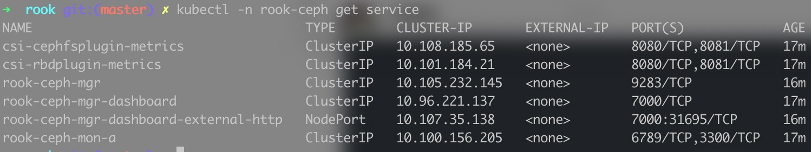

访问地址`http://localhost:31695`, Rook 创建了一个默认的用户 admin，并在运行 Rook 的命名空间中生成了一个名为 `rook-ceph-dashboard-admin-password` 的 Secret，运行以下命令获取密码。

```bash
kubectl -n rook-ceph get secret rook-ceph-dashboard-password -o jsonpath="{['data']['password']}" | base64 --decode && echo
```


### 创建、运行及共享容器镜像

#### 运行一个hello world容器

##### 背后的原理

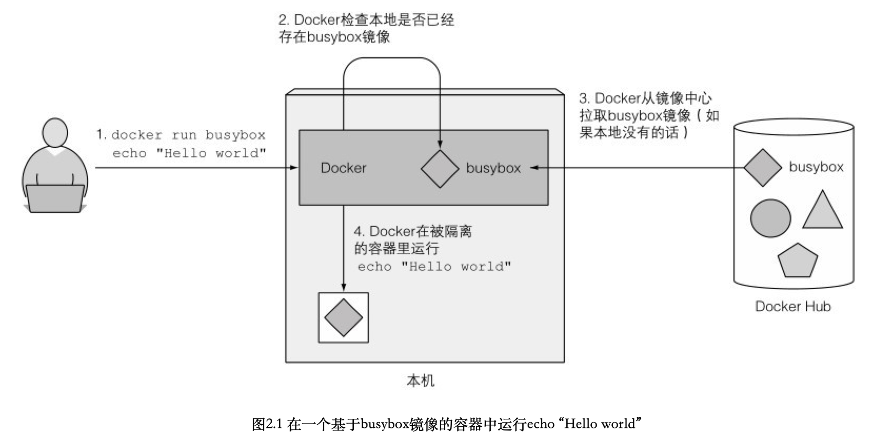

#### 为镜像创建Dockerfile

```dockerfile
FROM node:7										# 定义镜像的起始内容
ADD app.js /app.js						# 把 app.js 从本地文件夹加到镜像的根目录。保持文件名
ENTRYPOINT ["node", "app.js"] # 运行node命令
```

#### 构建容器镜像

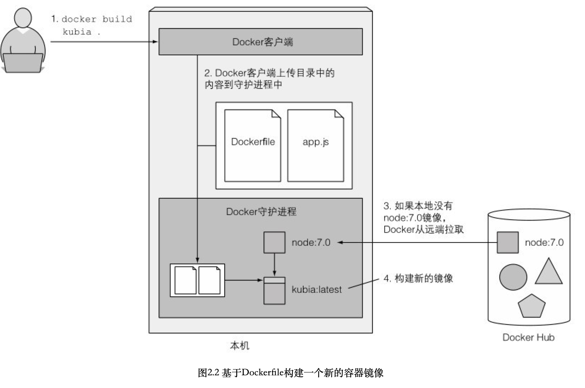

##### 镜像的构建过程

构建过程不是由Docker客户端进行的，而是将整个目录的文件上传到Docker守护进程并在那里进行的。Docker客户端和守护进程不要求在同一台机器上。

> 不要在构建目录中包含任何不需要的文件，这样会减慢构建的速度——尤其当Docker守护进程运行在一个远端机器的时候。

##### 镜像分层

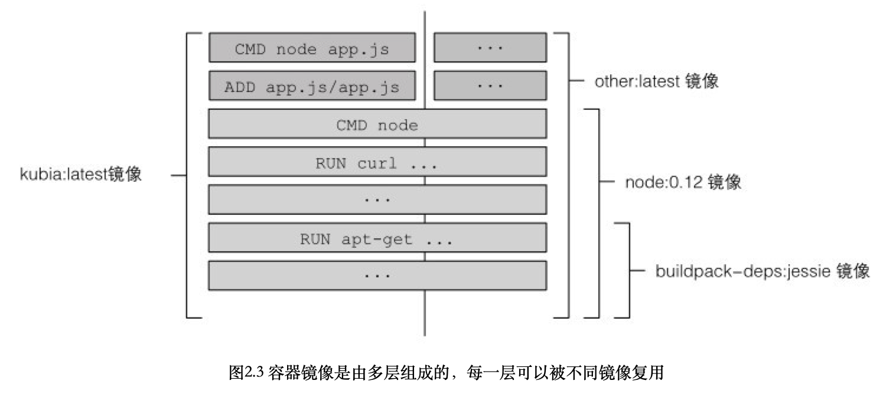

## 集群

### 安装容器运行时

1. 安装和配置的先决条件	

   ```bash
   cat <<EOF | tee /etc/modules-load.d/containerd.conf
   overlay
   br_netfilter
   EOF
   
   modprobe overlay
   modprobe br_netfilter
   
   # 设置必需的 sysctl 参数，这些参数在重新启动后仍然存在。
   cat <<EOF | tee /etc/sysctl.d/99-kubernetes-cri.conf
   net.bridge.bridge-nf-call-iptables  = 1
   net.ipv4.ip_forward                 = 1
   net.bridge.bridge-nf-call-ip6tables = 1
   EOF
   
   # 应用 sysctl 参数而无需重新启动
   sudo sysctl --system
   ```

2. 从官方Docker仓库安装 `containerd.io` 软件包 [安装 Docker 引擎](./docker.md#INSTALL)

3. 配置 containerd

   ```bash
   mkdir -p /etc/containerd
   containerd config default | tee /etc/containerd/config.toml
   ```

4. 重新启动 containerd

   ```bash
   systemctl restart containerd
   ```


### kubeadm

#### 确保每个节点上 MAC 地址和 product_uuid 的唯一性 

#### 允许 iptables 检查桥接流量

```bash
cat <<EOF | tee /etc/modules-load.d/k8s.conf
br_netfilter
EOF

cat <<EOF | tee /etc/sysctl.d/k8s.conf
net.bridge.bridge-nf-call-ip6tables = 1
net.bridge.bridge-nf-call-iptables = 1
EOF
sysctl --system
```

#### 检查所需端口

##### 控制平面节点

| 协议 | 方向 | 端口范围  | 作用                    | 使用者                       |
| ---- | ---- | --------- | ----------------------- | ---------------------------- |
| TCP  | 入站 | 6443      | Kubernetes API 服务器   | 所有组件                     |
| TCP  | 入站 | 2379-2380 | etcd 服务器客户端 API   | kube-apiserver, etcd         |
| TCP  | 入站 | 10250     | Kubelet API             | kubelet 自身、控制平面组件   |
| TCP  | 入站 | 10251     | kube-scheduler          | kube-scheduler 自身          |
| TCP  | 入站 | 10252     | kube-controller-manager | kube-controller-manager 自身 |

##### 工作节点

| 协议 | 方向 | 端口范围    | 作用           | 使用者                     |
| ---- | ---- | ----------- | -------------- | -------------------------- |
| TCP  | 入站 | 10250       | Kubelet API    | kubelet 自身、控制平面组件 |
| TCP  | 入站 | 30000-32767 | NodePort 服务† | 所有组件                   |

#### 安装 kubeadm、kubelet 和 kubectl

- `kubeadm`：用来初始化集群的指令。
- `kubelet`：在集群中的每个节点上用来启动 Pod 和容器等。
- `kubectl`：用来与集群通信的命令行工具。

```bash
apt-get update

curl -fsSLo /usr/share/keyrings/kubernetes-archive-keyring.gpg https://packages.cloud.google.com/apt/doc/apt-key.gpg

echo "deb [signed-by=/usr/share/keyrings/kubernetes-archive-keyring.gpg] https://apt.kubernetes.io/ kubernetes-xenial main" | tee /etc/apt/sources.list.d/kubernetes.list

apt-get update
apt-get install -y kubelet kubeadm kubectl
apt-mark hold kubelet kubeadm kubectl
```

#### 创建集群

为了性能考虑，k8s 需要关闭 swap 功能，然后重启主机。在 `/etc/fstab` 中找到带有 `swap` 的那一行，注释掉。

```bash
# 关闭swap分区【虚拟内存】并且永久关闭虚拟内存
swapoff -a && sed -i '/ swap / s/^\(.*\)$/#\1/g' /etc/fstab
```

初始化集群,如果要再次运行 `kubeadm init`，你必须首先卸载集群
```bash
# 拉取的时候指定image的仓库
kubeadm init --image-repository='registry.aliyuncs.com/google_containers'
```

如果出事化的时候出错,可以使用下面的方式

**代理方式**
```bash
sudo systemctl set-environment HTTP_PROXY=127.0.0.1:7890
sudo systemctl set-environment HTTPS_PROXY=127.0.0.1:7890
sudo systemctl restart containerd.service
```

**手工拉去image**
>
> ```bash
> # 查看kubeadm需要镜像
> kubeadm config images list
> # 查看镜像
> docker images
> # 手工拉去image
> docker pull coredns/coredns:1.8.0
> # 打标签，修改名称
> docker tag coredns/coredns:1.8.0 k8s.gcr.io/coredns:v1.8.0
> # 删除多余镜像
> docker rmi coredns/coredns:1.8.0
> # 重复处理所有的images
> # 初始化
> kubeadm init
> 
> # 例如
> docker pull registry.aliyuncs.com/google_containers/kube-proxy:v1.21.2
> docker tag registry.aliyuncs.com/google_containers/kube-proxy:v1.21.2  k8s.gcr.io/kube-proxy:v1.21.2
> docker rmi registry.aliyuncs.com/google_containers/kube-proxy:v1.21.2
> 
> 
> docker pull registry.aliyuncs.com/google_containers/pause:3.4.1
> docker tag registry.aliyuncs.com/google_containers/pause:3.4.1  k8s.gcr.io/pause:3.4.1
> docker rmi registry.aliyuncs.com/google_containers/pause:3.4.1 
> ```

要使非 root 用户可以运行 kubectl，请运行以下命令， 它们也是 `kubeadm init` 输出的一部分：

> ```
> 如果不设置,会出现如下的错误
> The connection to the server localhost:8080 was refused - did you specify the right host or port?
> ```

```bash
mkdir -p $HOME/.kube
sudo cp -i /etc/kubernetes/admin.conf $HOME/.kube/config
sudo chown $(id -u):$(id -g) $HOME/.kube/config
```

或者，如果你是 `root` 用户，则可以运行：

```bash
export KUBECONFIG=/etc/kubernetes/admin.conf
```

##### 加入节点

记录 `kubeadm init` 输出的 `kubeadm join` 命令。 你需要此命令将节点加入集群

```bash
kubeadm join 10.10.10.21:6443 --token j5sl2p.xpewlidks1bd6g1g \
        --discovery-token-ca-cert-hash sha256:9b4b6b68ae8c4d1080f47758061e157a7cda4177d910b212de00edf3649a81aa

# 如果遗忘这个值
# 查看有效的token, 默认24小时有效
kubeadm token list 
# 获取ca证书sha256编码hash值
openssl x509 -pubkey -in /etc/kubernetes/pki/ca.crt | openssl rsa -pubin -outform der 2>/dev/null | openssl dgst -sha256 -hex | sed 's/^.* //'
        
# 如果这个值失效
kubeadm token create --print-join-command
```

##### 删除节点

```bash
kubectl drain <node name> --delete-local-data --force --ignore-daemonsets
```

https://kubernetes.io/zh/docs/setup/production-environment/tools/kubeadm/create-cluster-kubeadm/

##### 网络附加组件

```bash
# 部署flannel网络插件 --- 只需要在主节点执行
kubectl apply -f https://raw.githubusercontent.com/coreos/flannel/master/Documentation/kube-flannel.yml
```

安装完后,发现kube-flannel相关的pod启动报错,关键信息如下`Error registering network: failed to acquire lease: node "k8s01" pod cidr not assigned`

修改集群配置 configmap, 在 `networking` 下 增加 `podSubnet: 10.244.0.0/16`

```bash
kubectl edit cm kubeadm-config -n kube-system
```

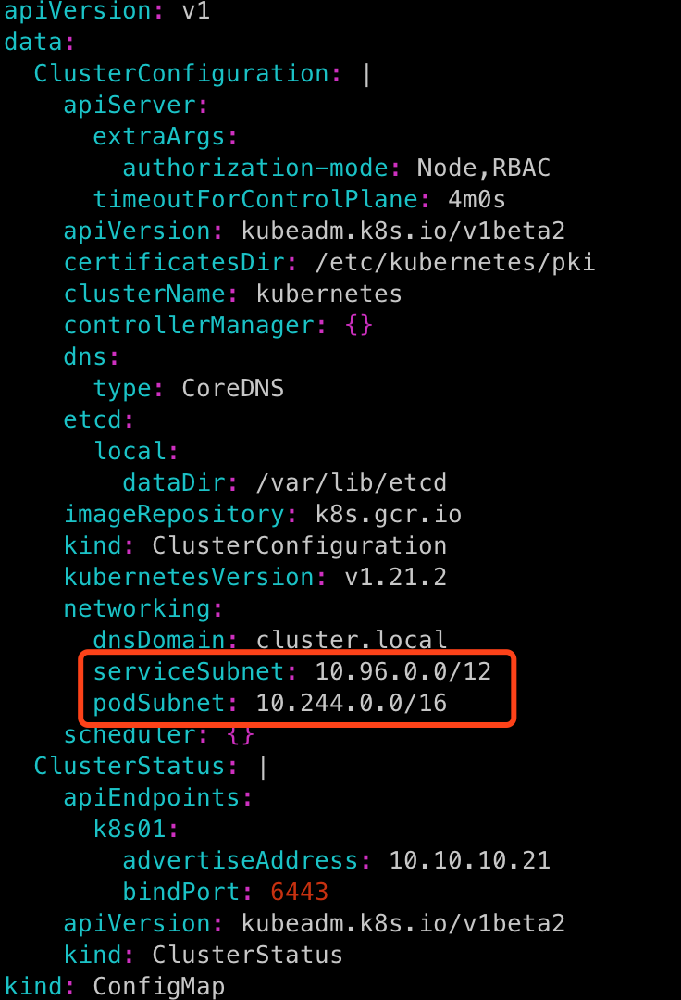

修改 controller-manager 静态 pod 的启动参数，增加 --allocate-node-cidrs=true --cluster-cidr=10.244.0.0/16

```bash
vim /etc/kubernetes/manifests/kube-controller-manager.yaml 
```

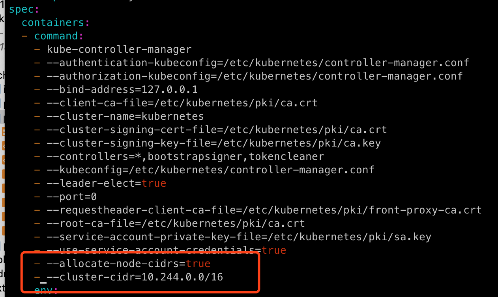

```bash
# 检查配置是否生效
kubectl cluster-info dump | grep -m 1 cluster-cidr
```

如果更新较慢，可以手动删除相关 pod，如 `kubectl delete pod -n kube-system kube-flannel-ds-***`


##### 查看部署

```bash
# 查看nodes节点
kubectl get nodes
# 查看node详情
kubectl describe nodes k8s01

# 检查所有pods部署情况
kubectl get pods -n kube-system 
# 查看某个pod具体的原因
kubectl describe pod kube-flannel-ds-qx282 -n kube-system

# 查看pod日志
kubectl logs kube-flannel-ds-vxsq2 -n kube-system

# 查询工作空间中pod容器的详细信息,输出节点信息
kubectl get pod -n kube-system -o wide
```

完成图如下

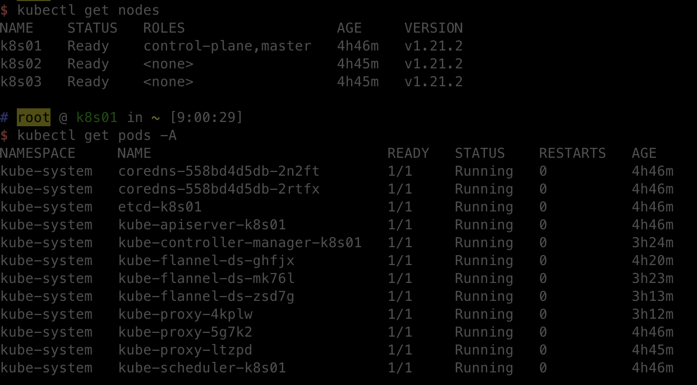


### ingress-nginx

```bash
wget kubectl apply -f https://raw.githubusercontent.com/kubernetes/ingress-nginx/controller-v0.48.1/deploy/static/provider/cloud/deploy.yaml

kubectl apply -f deploy.ymal

# ingress-nginx/controller 这个包无法下载的时候,可以去docker hub搜索别人下载好,推送上去的
# 然后手动拉去,打tag使用
```


# 概念

## Kubernetes 对象

### 简介

在 Kubernetes 系统中，*Kubernetes 对象* 是持久化的实体。Kubernetes 使用这些实体去表示整个集群的状态。特别地，它们描述了如下信息：

- 哪些容器化应用在运行（以及在哪个 Node 上）
- 可以被应用使用的资源
- 关于应用运行时表现的策略，比如重启策略、升级策略，以及容错策略

#### 对象规约（Spec）与状态（Status）

每个 Kubernetes 对象包含两个嵌套的对象字段，它们负责管理对象的配置：对象 *spec* 和 对象 *status* 。 *spec* 是必需的，它描述了对象的 *期望状态（Desired State）* —— 希望对象所具有的特征。 *status* 描述了对象的 *实际状态（Actual State）* ，它是由 Kubernetes 系统提供和更新的。

#### 必需字段

在想要创建的 Kubernetes 对象对应的 `.yaml` 文件中，需要配置如下的字段：

- `apiVersion` - 创建该对象所使用的 Kubernetes API 的版本
- `kind` - 想要创建的对象的类型
- `metadata` - 帮助识别对象唯一性的数据，包括一个 `name` 字符串、UID 和可选的 `namespace`


## Pod

*Pod* 是 Kubernetes 应用程序的基本执行单元，即它是 Kubernetes 对象模型中创建或部署的最小和最简单的单元。Pod 表示在集群上运行的进程。


## Service

### Headless Service

Headless Service也是一种Service，但不同的是会定义spec:clusterIP: None，也就是不需要Cluster IP的Service。

`Headless Service`就是没头的`Service`。有什么使用场景呢？

- 第一种：自主选择权，有时候`client`想自己来决定使用哪个`Real Server`，可以通过查询`DNS`来获取`Real Server`的信息。
- 第二种：`Headless Services`还有一个用处（PS：也就是我们需要的那个特性）。`Headless Service`的对应的每一个`Endpoints`，即每一个`Pod`，都会有对应的`DNS`域名；这样`Pod`之间就可以互相访问。


## Volume

## Namespace

**Namespace** 提供一种机制，将同一集群中的资源划分为相互隔离的组。 同一**Namespace**内的资源名称要唯一，但跨名字空间时没有这个要求。 **Namespace**作用域仅针对带有名字空间的对象，例如 Deployment、Service 等， 这种作用域对集群访问的对象不适用，例如 StorageClass、Node、PersistentVolume 等。

## Controller

在 Kubernetes 中，控制器通过监控[集群](https://kubernetes.io/zh-cn/docs/reference/glossary/?all=true#term-cluster) 的公共状态，并致力于将当前状态转变为期望的状态。

## Deployment

一个 Deployment 为 [Pod](https://kubernetes.io/zh-cn/docs/concepts/workloads/pods/) 和 [ReplicaSet](https://kubernetes.io/zh-cn/docs/concepts/workloads/controllers/replicaset/) 提供声明式的更新能力。

你负责描述 Deployment 中的 **目标状态**，而 Deployment [控制器（Controller）](https://kubernetes.io/zh-cn/docs/concepts/architecture/controller/) 以受控速率更改实际状态， 使其变为期望状态。你可以定义 Deployment 以创建新的 ReplicaSet，或删除现有 Deployment， 并通过新的 Deployment 收养其资源。

## DaemonSet

**DaemonSet** 确保全部（或者某些）节点上运行一个 Pod 的副本。 当有节点加入集群时， 也会为他们新增一个 Pod 。 当有节点从集群移除时，这些 Pod 也会被回收。删除 DaemonSet 将会删除它创建的所有 Pod。

DaemonSet 的一些典型用法：

- 在每个节点上运行集群守护进程
- 在每个节点上运行日志收集守护进程
- 在每个节点上运行监控守护进程

一种简单的用法是为每种类型的守护进程在所有的节点上都启动一个 DaemonSet。 一个稍微复杂的用法是为同一种守护进程部署多个 DaemonSet；每个具有不同的标志， 并且对不同硬件类型具有不同的内存、CPU 要求。

## StatefulSet

StatefulSet 是用来管理有状态应用的工作负载 API 对象。

StatefulSet 用来管理某 [Pod](https://kubernetes.io/zh-cn/docs/concepts/workloads/pods/) 集合的部署和扩缩， 并为这些 Pod 提供持久存储和持久标识符。

和 [Deployment](https://kubernetes.io/zh-cn/docs/concepts/workloads/controllers/deployment/) 类似， StatefulSet 管理基于相同容器规约的一组 Pod。但和 Deployment 不同的是， StatefulSet 为它们的每个 Pod 维护了一个有粘性的 ID。这些 Pod 是基于相同的规约来创建的， 但是不能相互替换：无论怎么调度，每个 Pod 都有一个永久不变的 ID。

如果希望使用存储卷为工作负载提供持久存储，可以使用 StatefulSet 作为解决方案的一部分。 尽管 StatefulSet 中的单个 Pod 仍可能出现故障， 但持久的 Pod 标识符使得将现有卷与替换已失败 Pod 的新 Pod 相匹配变得更加容易。

## ReplicaSet

ReplicaSet 的目的是维护一组在任何时候都处于运行状态的 Pod 副本的稳定集合。 因此，它通常用来保证给定数量的、完全相同的 Pod 的可用性。

## Job

Job 会创建一个或者多个 Pod，并将继续重试 Pod 的执行，直到指定数量的 Pod 成功终止。 随着 Pod 成功结束，Job 跟踪记录成功完成的 Pod 个数。 当数量达到指定的成功个数阈值时，任务（即 Job）结束。 删除 Job 的操作会清除所创建的全部 Pod。 挂起 Job 的操作会删除 Job 的所有活跃 Pod，直到 Job 被再次恢复执行。

一种简单的使用场景下，你会创建一个 Job 对象以便以一种可靠的方式运行某 Pod 直到完成。 当第一个 Pod 失败或者被删除（比如因为节点硬件失效或者重启）时，Job 对象会启动一个新的 Pod。

你也可以使用 Job 以并行的方式运行多个 Pod。

如果你想按某种排期表（Schedule）运行 Job（单个任务或多个并行任务），请参阅 [CronJob](https://kubernetes.io/zh-cn/docs/concepts/workloads/controllers/cron-jobs/)。


# 网络原理

## kubernetes网络模型

Kubernetes网络模型设计的一个基础原则是：每个Pod都拥有一个独立的IP地址，并假定所有Pod都在一个可以直接连通的、扁平的网络空间中。所以不管它们是否运行在同一个Node（宿主机）中，都要求它们可以直接通过对方的IP进行访问。设计这个原则的原因是，用户不需要额外考虑如何建立Pod之间的连接，也不需要考虑如何将容器端口映射到主机端口等问题。

在Kubernetes世界里，IP是以Pod为单位进行分配的。一个Pod内部的所有容器共享一个网络堆栈（相当于一个网络命名空间，它们的IP地址、网络设备、配置等都是共享的）。按照这个网络原则抽象出来的为每个Pod都设置一个IP地址的模型也被称作IPperPod模型。

Kubernetes 对集群网络的基本要求

1. 所有Pod都可以在不用NAT的方式下同别的Pod通信。
2. 在所有节点上运行的代理程序（例如kubelet或操作系统守护进程）都可以在不用NAT的方式下同所有Pod通信，反之亦然。
3. 以 hostnetwork 模式运行的Pod都可以在不用NAT的方式下同别的Pod通信。

## Docker网络基础

### 网络命名空间（Network Namespace）

#### 网络命名空间实现

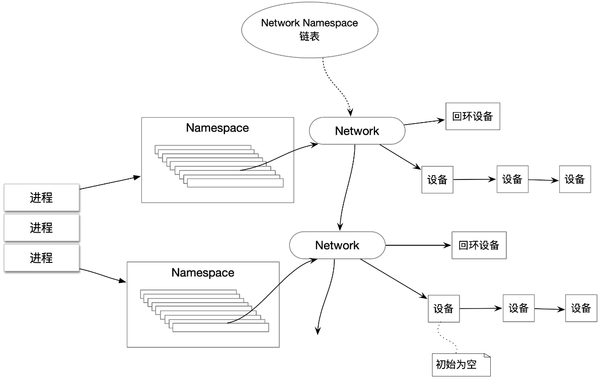

#### 对网络命名空间的操作

Linux的网络协议栈是十分复杂的，为了支持独立的协议栈，相关的这些全局变量都必须被修改为协议栈私有。最好的办法就是让这些全局变量成为一个NetNamespace变量的成员，然后为协议栈的函数调用加入一个Namespace参数。这就是Linux实现网络命名空间的核心。

```bash
# 创建一个命名空间
ip netns add <name>
# 在命名空间中运行命令
ip netns exec <name> <command>
# 通过bash命令进入内部的shell界面
ip netns exec <name> bash
```

### Veth设备对

引入Veth设备对是为了在不同的网络命名空间之间通信，利用它可以直接将两个网络命名空间连接起来。由于要连接两个网络命名空间，所以Veth设备都是成对出现的，很像一对以太网卡，并且中间有一根直连的网线。既然是一对网卡，那么我们将其中一端称为另一端的peer。在Veth设备的一端发送数据时，它会将数据直接发送到另一端，并触发另一端的接收操作。

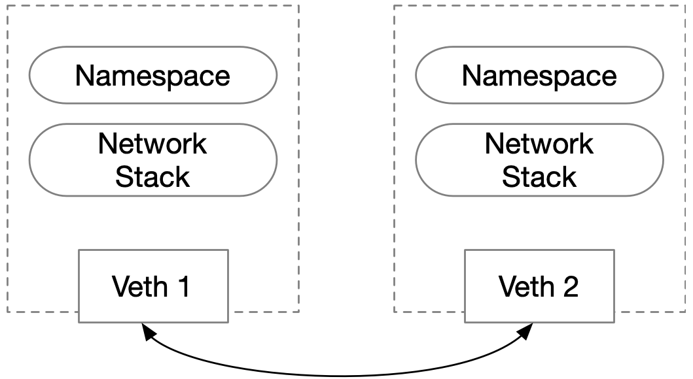

#### 对Veth设备对的操作命令

```bash
# 创建Veth设备对
ip link add veth0 type veth peer name veth1
# 查看所有网络接口
ip link show 
# 设置 veth1 到 netns1 的命名空间
ip link set veth1 netns netns1
# 在 netns1 网络命名空间中查看veth1设备
ip netns exec netns1 ip link show
# 分配IP
ip netns exec netns1 ip addr add 10.1.1.1/24 dev veth1
ip addr add 10.1.1.2/24 dev veth0
# 重新启动
ip netns exec netns1 ip link set dev veth1 up
ip link set dev veth0 up
# 现在两个网络命名空间就可以相互通信了
```

#### Veth设备如何查看对端

```bash
# 在命名空间netns1中查看veth设备对端在设备列表中的序列号
ip netns exec netns1 ethtool -S veth1
# 在另一段查看
ip netns exec netns2 ip link 
```

### 网桥

网桥是一个二层的虚拟网络设备，把若干个网络接口“连接”起来，以使得网络接口之间的报文能够相互转发。网桥能够解析收发的报文，读取目标MAC地址的信息，将其与自己记录的MAC表结合，来决策报文的转发目标网络接口。

#### linux 网桥的实现

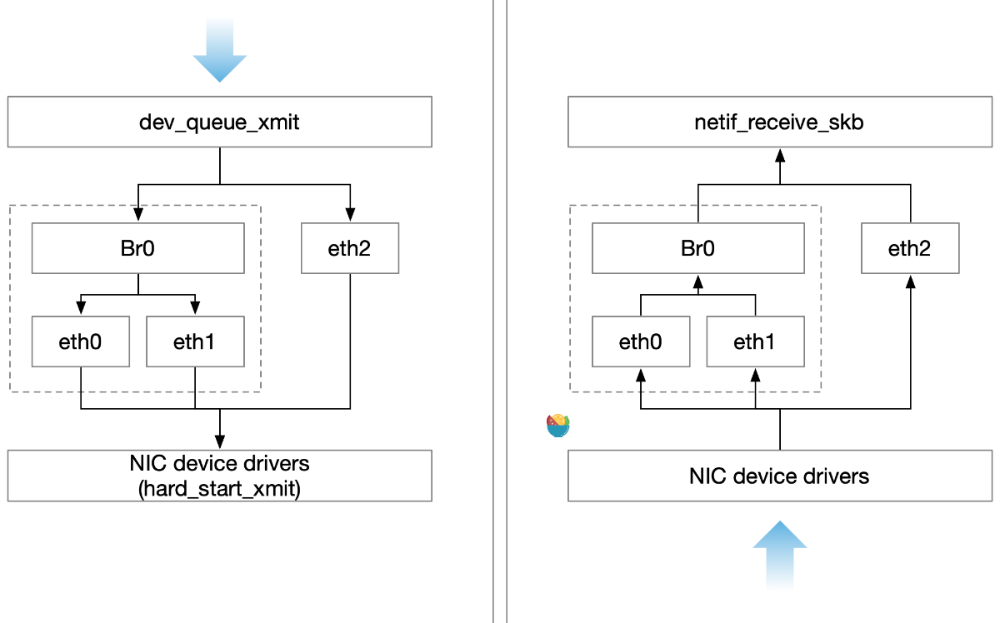

#### Bridge常用操作
Docker自动完成了对网桥的创建和维护。如果想要进一步理解网桥，可以看下如下举的一些常用操作命令。

新增一个网桥：

```bash
brctl addbr xxxxx
```

在新增网桥的基础上增加网口，在linux中，一个网口其实就是一个物理网卡。将物理网卡和网桥连接起来：

```bash
brctl addif xxxx ethx
```

网桥的物理网卡作为一个网口，由于在链路层工作，就不再需要IP地址了，这样上面的IP地址自然失效：

```bash
ipconfig ethx 0.0.0.0
```


给网桥配置一个IP地址：

```bash
ipconfig brxxx xxx.xxx.xxx.xxx
```


这样网桥就是一个有了IP地址，而连接在这之上的网卡就是一个纯链路层设备了。


### iptables 和 Netfilter

在Linux网络协议栈中有一组回调函数挂接点，通过这些挂接点挂接的钩子函数可以在Linux网络栈处理数据包的过程中对数据包进行一些操作，例如过滤、修改、丢弃等。该挂接点技术就叫作Netfilter和iptables。

Netfilter负责在内核中执行各种挂接的规则，运行在内核模式中；而iptables是在用户模式下运行的进程，负责协助和维护内核中Netfilter的各种规则表。二者相互配合来实现整个Linux网络协议栈中灵活的数据包处理机制。

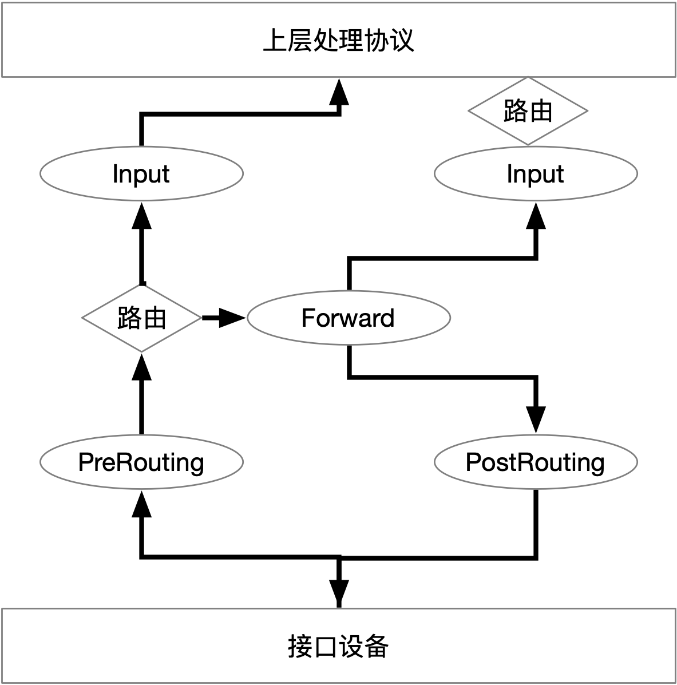

#### 规则表Table

这些挂载点能挂接的规则也分不同的类型，目前主要支持的Table类型如下：

* RAW
* MANGLE
* NAT
* FILTER

上述4个规则链的优先级是RAW最高，FILTER最低。

在实际应用中，不同挂接点需要的规则类型通常不同。例如，在Input的挂接点上明显不需要FILTER的过滤规则，因为根据目标地址，已经在本机的上层协议栈了，所以无需再挂载FILTER过滤规则。

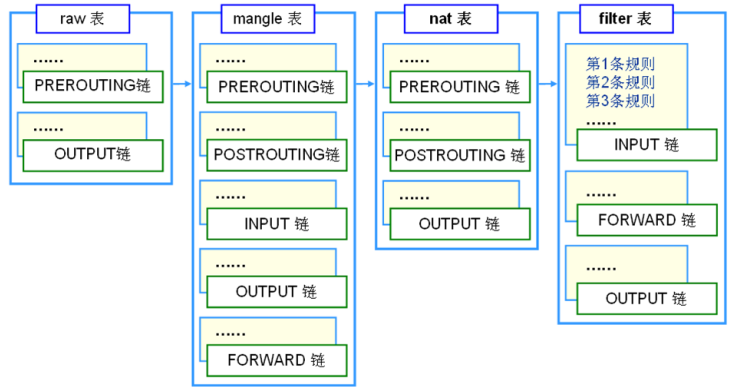

#### iptable命令

```bash
# 按照命令的方式打印iptables的内容
iptables-save
```


### 路由

Linux系统包含一个完整的路由功能。当IP层在处理数据发送或者转发时，会使用路由表来决定发往哪里。

路由表中的数据一般是以条目形式存在的。一个典型的路由表条目通常包含以下主要的条目项。

* 目的IP地址：此字段表示目标的IP地址。这个IP地址可以是某主机的地址，也可以是一个网络地址。如果这个条目包含的是一个主机地址，那么它的主机ID将被标记为非零；如果这个条目包含的是一个网络地址，那么它的主机ID将被标记为零。

* 下一个路由器的IP地址：这里采用“下一个”的说法，是因为下一个路由器并不总是最终的目的路由器，它很可能是一个中间路由器。条目给出的下一个路由器的地址用来转发在相应接口接收到的IP数据报文。

* 标志：这个字段提供了另一组重要信息，例如，目的IP地址是一个主机地址还是一个网络地址。此外，从标志中可以得知下一个路由器是一个真实路由器还是一个直接相连的接口。

* 网络接口规范：为一些数据报文的网络接口规范，该规范将与报文一起被转发。

  

## Docker 网络实现


# 实战

### 部署第一个容器应用

**nginx-deployment.yaml**

```yaml
apiVersion: apps/v1
kind: Deployment
metadata:
  name: nginx-deployment
spec:
  selector:
    matchLabels:
      app: nginx
  replicas: 2
  template:
    metadata:
      labels:
        app: nginx
    spec:
      containers:
      - name: nginx
        image: nginx:1.17.0
        ports:
        - containerPort: 80
        volumeMounts:
        - mountPath: "/usr/share/nginx/html"
          name: nginx-vol
      volumes:
      - name: nginx-vol 
        hostPath: 
          path: /Users/warrior/www/bom
```

```bash
kubectl apply -f nginx-deployment.yaml  	# 部署容器，或者修改yaml文件后更新容器
kubectl get pods -l app=nginx			# 检查容器运行的状态
kubectl describe pod nginx-deployment-74dc4b47f6-7886h  # 查看容器的细节
kubectl exec -it nginx-deployment-74dc4b47f6-7886h -- /bin/bash  # 进入容器
kubectl delete -f nginx-deployment.yaml   # 删除容器
```


## kubectl 命令

### 所有命令继承的选项

```bash
  --alsologtostderr[=false]: 同时输出日志到标准错误控制台和文件。
  --certificate-authority="": 用以进行认证授权的.cert文件路径。
  --client-certificate="": TLS使用的客户端证书路径。
  --client-key="": TLS使用的客户端密钥路径。
  --cluster="": 指定使用的kubeconfig配置文件中的集群名。
  --context="": 指定使用的kubeconfig配置文件中的环境名。
  --insecure-skip-tls-verify[=false]: 如果为true，将不会检查服务器凭证的有效性，这会导致你的HTTPS链接变得不安全。
  --kubeconfig="": 命令行请求使用的配置文件路径。
  --log-backtrace-at=:0: 当日志长度超过定义的行数时，忽略堆栈信息。
  --log-dir="": 如果不为空，将日志文件写入此目录。
  --log-flush-frequency=5s: 刷新日志的最大时间间隔。
  --logtostderr[=true]: 输出日志到标准错误控制台，不输出到文件。
  --match-server-version[=false]: 要求服务端和客户端版本匹配。
  --namespace="": 如果不为空，命令将使用此namespace。
  --password="": API Server进行简单认证使用的密码。
  -s, --server="": Kubernetes API Server的地址和端口号。
  --stderrthreshold=2: 高于此级别的日志将被输出到错误控制台。
  --token="": 认证到API Server使用的令牌。
  --user="": 指定使用的kubeconfig配置文件中的用户名。
  --username="": API Server进行简单认证使用的用户名。
  --v=0: 指定输出日志的chr级别。
  --vmodule=: 指定输出日志的模块，格式如下：pattern=N，使用逗号分隔。
```


### apply

通过文件名或控制台输入，对资源进行配置。 如果资源不存在，将会新建一个。

可以使用 JSON 或者 YAML 格式。

```bash
kubectl apply -f FILENAME
```

#### 示例

```bash
# 将pod.json中的配置应用到pod
kubectl apply -f ./pod.json

# 将控制台输入的JSON配置应用到Pod
cat pod.json | kubectl apply -f -
```

#### 选项

```bash
 -f, --filename=[]: 包含配置信息的文件名，目录名或者URL。
     --include-extended-apis[=true]: If true, include definitions of new APIs via calls to the API server. [default true]
  -o, --output="": 输出模式。"-o name"为快捷输出(资源/name).
      --record[=false]: 在资源注释中记录当前 kubectl 命令。
  -R, --recursive[=false]: Process the directory used in -f, --filename recursively. Useful when you want to manage related manifests organized within the same directory.
      --schema-cache-dir="~/.kube/schema": 非空则将API schema缓存为指定文件，默认缓存到'$HOME/.kube/schema'
      --validate[=true]: 如果为true，在发送到服务端前先使用schema来验证输入。
```


### get

查看和查找资源 

```bash
# get 命令的基本输出
kubectl get services                          # 列出当前命名空间下的所有 services
kubectl get pods --all-namespaces             # 列出所有命名空间下的全部的 Pods
kubectl get pods -o wide                      # 列出当前命名空间下的全部 Pods，并显示更详细的信息
kubectl get deployment my-dep                 # 列出某个特定的 Deployment
kubectl get pods                              # 列出当前命名空间下的全部 Pods
kubectl get pod my-pod -o yaml                # 获取一个 pod 的 YAML

# describe 命令的详细输出
kubectl describe nodes my-node
kubectl describe pods my-pod

# 列出当前名字空间下所有 Services，按名称排序
kubectl get services --sort-by=.metadata.name

# 列出 Pods，按重启次数排序
kubectl get pods --sort-by='.status.containerStatuses[0].restartCount'

# 列举所有 PV 持久卷，按容量排序
kubectl get pv --sort-by=.spec.capacity.storage

# 获取包含 app=cassandra 标签的所有 Pods 的 version 标签
kubectl get pods --selector=app=cassandra -o \
  jsonpath='{.items[*].metadata.labels.version}'

# 检索带有 “.” 键值，例： 'ca.crt'
kubectl get configmap myconfig \
  -o jsonpath='{.data.ca\.crt}'

# 获取所有工作节点（使用选择器以排除标签名称为 'node-role.kubernetes.io/master' 的结果）
kubectl get node --selector='!node-role.kubernetes.io/master'

# 获取当前命名空间中正在运行的 Pods
kubectl get pods --field-selector=status.phase=Running

# 获取全部节点的 ExternalIP 地址
kubectl get nodes -o jsonpath='{.items[*].status.addresses[?(@.type=="ExternalIP")].address}'

# 列出属于某个特定 RC 的 Pods 的名称
# 在转换对于 jsonpath 过于复杂的场合，"jq" 命令很有用；可以在 https://stedolan.github.io/jq/ 找到它。
sel=${$(kubectl get rc my-rc --output=json | jq -j '.spec.selector | to_entries | .[] | "\(.key)=\(.value),"')%?}
echo $(kubectl get pods --selector=$sel --output=jsonpath={.items..metadata.name})

# 显示所有 Pods 的标签（或任何其他支持标签的 Kubernetes 对象）
kubectl get pods --show-labels

# 检查哪些节点处于就绪状态
JSONPATH='{range .items[*]}{@.metadata.name}:{range @.status.conditions[*]}{@.type}={@.status};{end}{end}' \
 && kubectl get nodes -o jsonpath="$JSONPATH" | grep "Ready=True"

# 不使用外部工具来输出解码后的 Secret
kubectl get secret my-secret -o go-template='{{range $k,$v := .data}}{{"### "}}{{$k}}{{"\n"}}{{$v|base64decode}}{{"\n\n"}}{{end}}'

# 列出被一个 Pod 使用的全部 Secret
kubectl get pods -o json | jq '.items[].spec.containers[].env[]?.valueFrom.secretKeyRef.name' | grep -v null | sort | uniq

# 列举所有 Pods 中初始化容器的容器 ID（containerID）
# 可用于在清理已停止的容器时避免删除初始化容器
kubectl get pods --all-namespaces -o jsonpath='{range .items[*].status.initContainerStatuses[*]}{.containerID}{"\n"}{end}' | cut -d/ -f3

# 列出事件（Events），按时间戳排序
kubectl get events --sort-by=.metadata.creationTimestamp

# 比较当前的集群状态和假定某清单被应用之后的集群状态
kubectl diff -f ./my-manifest.yaml

# 生成一个句点分隔的树，其中包含为节点返回的所有键
# 在复杂的嵌套JSON结构中定位键时非常有用
kubectl get nodes -o json | jq -c 'path(..)|[.[]|tostring]|join(".")'

# 生成一个句点分隔的树，其中包含为pod等返回的所有键
kubectl get pods -o json | jq -c 'path(..)|[.[]|tostring]|join(".")'

# 假设你的 Pods 有默认的容器和默认的名字空间，并且支持 'env' 命令，可以使用以下脚本为所有 Pods 生成 ENV 变量。
# 该脚本也可用于在所有的 Pods 里运行任何受支持的命令，而不仅仅是 'env'。 
for pod in $(kubectl get po --output=jsonpath={.items..metadata.name}); do echo $pod && kubectl exec -it $pod env; done
```


### run

创建并运行一个指定的可复制的镜像。 创建一个`deployment`或者`job`来管理创建的容器。

```bash
kubectl run NAME --image=image [--env="key=value"] [--port=port] [--replicas=replicas] [--dry-run=bool] [--overrides=inline-json] [--command] -- [COMMAND] [args...]
```

#### 示例

```bash
# 启动一个 Nginx 实例。
kubectl run nginx --image=nginx

# 启动一个 hazelcast 单个实例，并开放容器的5701端口。
kubectl run hazelcast --image=hazelcast --port=5701

# 运行一个 hazelcast 单个实例，并设置容器的环境变量"DNS_DOMAIN=cluster" and "POD_NAMESPACE=default"。
kubectl run hazelcast --image=hazelcast --env="DNS_DOMAIN=cluster" --env="POD_NAMESPACE=default"

# 启动一个 replicated 实例去复制 nginx。
kubectl run nginx --image=nginx --replicas=5

# 试运行。不创建他们的情况下，打印出所有相关的 API 对象。
kubectl run nginx --image=nginx --dry-run

# 用可解析的 JSON 来覆盖加载 `deployment` 的 `spec`，来运行一个 nginx 单个实例。
kubectl run nginx --image=nginx --overrides='{ "apiVersion": "v1", "spec": { ... } }'

# 运行一个在前台运行的 busybox 单个实例，如果退出不会重启。
kubectl run -i --tty busybox --image=busybox --restart=Never

# 使用默认命令来启动 nginx 容器，并且传递自定义参数(arg1 .. argN)给 nginx。
kubectl run nginx --image=nginx -- <arg1> <arg2> ... <argN>

# 使用不同命令或者自定义参数来启动 nginx 容器。
kubectl run nginx --image=nginx --command -- <cmd> <arg1> ... <argN>

# 启动 perl 容器来计算 bpi(2000) 并打印出结果。
kubectl run pi --image=perl --restart=OnFailure -- perl -Mbignum=bpi -wle 'print bpi(2000)'
```

#### 选项

```bash
      --attach[=false]: 如果为true, 那么等 pod 开始运行之后，链接到这个 pod 和运行 'kubectl attach ...'一样。默认是 false，除非设置了 '-i/--interactive' 默认才会是 true。
      --command[=false]: 如果为 true 并且有其他参数，那么在容器中运行这个'command'，而不是默认的'args'。
      --dry-run[=false]: 如果为 true，则仅仅打印这个对象，而不会执行命令。
      --env=[]: 设置容器的环境变量。
      --expose[=false]: 如果为 true， 会为这个运行的容器创建一个公开的 service。
      --generator="": The name of the API generator to use.  Default is 'deployment/v1beta1' if --restart=Always, otherwise the default is 'job/v1'.  This will happen only for cluster version at least 1.2, for olders we will fallback to 'run/v1' for --restart=Always, 'run-pod/v1' for others.
      --hostport=-1: The host port mapping for the container port. To demonstrate a single-machine container.
      --image="": 用来运行的容器镜像。
      --include-extended-apis[=true]: If true, include definitions of new APIs via calls to the API server. [default true]
  -l, --labels="": pod 的标签。
      --leave-stdin-open[=false]: If the pod is started in interactive mode or with stdin, leave stdin open after the first attach completes. By default, stdin will be closed after the first attach completes.
      --limits="": The resource requirement limits for this container.  For example, 'cpu=200m,memory=512Mi'
      --no-headers[=false]: 当使用默认输出格式时不打印标题栏。
  -o, --output="": Output format. One of: json|yaml|wide|name|go-template=...|go-template-file=...|jsonpath=...|jsonpath-file=... See golang template [http://golang.org/pkg/text/template/#pkg-overview] and jsonpath template [http://releases.k8s.io/release-1.2/docs/user-guide/jsonpath.md].
      --output-version="": Output the formatted object with the given group version (for ex: 'extensions/v1beta1').
      --overrides="": An inline JSON override for the generated object. If this is non-empty, it is used to override the generated object. Requires that the object supply a valid apiVersion field.
      --port=-1: The port that this container exposes.  If --expose is true, this is also the port used by the service that is created.
      --record[=false]: Record current kubectl command in the resource annotation.
  -r, --replicas=1: Number of replicas to create for this container. Default is 1.
      --requests="": The resource requirement requests for this container.  For example, 'cpu=100m,memory=256Mi'.  Note that server side components may assign requests depending on the server configuration, such as limit ranges.
      --restart="Always": The restart policy for this Pod.  Legal values [Always, OnFailure, Never].  If set to 'Always' a deployment is created for this pod, if set to 'OnFailure', a job is created for this pod, if set to 'Never', a regular pod is created. For the latter two --replicas must be 1.  Default 'Always'
      --rm[=false]: If true, delete resources created in this command for attached containers.
      --save-config[=false]: If true, the configuration of current object will be saved in its annotation. This is useful when you want to perform kubectl apply on this object in the future.
      --service-generator="service/v2": The name of the generator to use for creating a service.  Only used if --expose is true
      --service-overrides="": An inline JSON override for the generated service object. If this is non-empty, it is used to override the generated object. Requires that the object supply a valid apiVersion field.  Only used if --expose is true.
  -a, --show-all[=false]: When printing, show all resources (default hide terminated pods.)
      --show-labels[=false]: When printing, show all labels as the last column (default hide labels column)
      --sort-by="": If non-empty, sort list types using this field specification.  The field specification is expressed as a JSONPath expression (e.g. '{.metadata.name}'). The field in the API resource specified by this JSONPath expression must be an integer or a string.
  -i, --stdin[=false]: Keep stdin open on the container(s) in the pod, even if nothing is attached.
      --template="": Template string or path to template file to use when -o=go-template, -o=go-template-file. The template format is golang templates [http://golang.org/pkg/text/template/#pkg-overview].
  -t, --tty[=false]: Allocated a TTY for each container in the pod.
```

### scale 

对资源进行伸缩

```bash
kubectl scale --replicas=3 rs/foo            		# 将名为 'foo' 的副本集伸缩到 3 副本
kubectl scale --replicas=3 -f foo.yaml          # 将在 "foo.yaml" 中的特定资源伸缩到 3 个副本
kubectl scale --current-replicas=2 --replicas=3 deployment/mysql  # 如果名为 mysql 的 Deployment 的副本当前是 2，那么将它伸缩到 3
kubectl scale --replicas=5 rc/foo rc/bar rc/baz # 伸缩多个副本控制器
```

 

# trouble shooting

## 查看系统Event

```bash
kubectl describe pod redis-master-bobr0
```

通过kubectldescribepod命令，可以显示Pod创建时的配置定义、状态等信息，还可以显示与该Pod相关的最近的Event（事件），事件信息对于查错非常有用。如果某个Pod一直处于Pending状态，我们就可以通过kubectl describe命令了解具体原因。例如，从Event事件中获知Pod失败的原因可能有以下几种。

* 没有可用的Node以供调度。
* 开启了资源配额管理，但在当前调度的目标节点上资源不足。
* 镜像下载失败。

通过kubectl describe命令，我们还可以查看其他Kubernetes对象，包括Node、RC、Service、Namespace、Secrets等，对每种对象都会显示相关的其他信息。

## 查看容器日志

```bash
kubectl logs <pod-name>
```

## 查看 Kubernetes 服务日志


