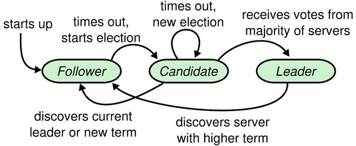

# Raft

Raft（Replication and Fault Tolerant）是一个允许网络分区（Partition Tolerant）的一致性协议，它保证了在一个由N个节点构成的系统中有(N+1)/2（向上取整）个节点正常工作的情况下的系统的一致性，比如在一个5个节点的系统中允许2个节点出现非拜占庭错误，如节点宕机、网络分区、消息延时。Raft相比于Paxos更容易理解，且被证明可以提供与Paxos相同的容错性以及性能，其详细介绍可见[官网](https://raft.github.io/)及[动态演示](http://thesecretlivesofdata.com/raft/)。

Raft 是一种通过对日志进行复制管理来达到一致性的算法。Raft通过选举Leader并由Leader节点负责管理日志复制来实现各个节点间数据的一致性。

Raft 算法不是强一致性算法，而是最终一致性算法。

## 角色

Raft将系统中的角色分为领导者（Leader）、跟从者（Follower）和候选人（Candidate）：

- **Leader**：接受客户端请求，并向Follower同步请求日志，当日志同步到大多数节点上后告诉Follower提交日志。
- **Follower**：接受并持久化Leader同步的日志，在Leader告之日志可以提交之后，提交日志。
- **Candidate**：Leader选举过程中的临时角色。

Raft算法角色状态转换如下：

## Leader 选举

Raft 使用心跳（heartbeat）触发Leader选举。当服务器启动时，初始化为Follower。Leader向所有Followers周期性发送heartbeat。如果Follower在选举超时时间内没有收到Leader的heartbeat，就会等待一段随机的时间后发起一次Leader选举。

## 准备选举

若 follower 在心跳超时范围内没有接受到来自于leader的心跳，则认为leader挂了。若在一下步骤还未发生时，接收到了其他candidate的投票请求，则会先向其投票，然后follower会完成一下步骤：

* 使其本地term增一
* 由 follower 转变为 candidate
* 向自己投一票,  一个term内，一个节点只能投出一票
* 向其它节点发出投票请求，然后等待响应

##  开始选举

flollower 在接受到投票请求后，其会根据一下情况来判断是否投票：

* 发来投票请求的 candidate 的term不能小于我的term
* 在我当前 term 内，我的选票换没有投出去
* 发来投票请求的 candidate 拥有的 log 编号要不能小于我的 log 编号
* 在我的选票尚未透出时，接受到多个 candidate 的请求，我将采用 first-come-first-served方式投票

## 选举结果

当一个 candidate 发出投票请求后会等待其他节点的响应结果。这个响应结果可能有三种情况：

* 收到过半选票，成为新的 leader。然后会将消息广播给所有其它节点，以告诉大家我是新的 leader 了（其中包含了当前的term）
* 接受到别的 candidate 发来的新的 leader 通知，比较了新 leader 的 term 并不比我的 term 小，则自己转变为 follower。
* 经过一段时间后，没有收到过半选票，也没有受到新 leader 通知，则重新发出选举

## 票数相同
若在选举过程中出现了各个 candidate 票数相同的情况，是无法选举出 leader的。当出现这种情况时，其采用了 randomized election timeouts 方式来解决这个问题。其会让这些 candidate 的选举在一个给定范围内随机的 timeout 之后开始，此时先到达 timeout 的 candidate 会首先发出投票请求，并优先获取到选票。

## 数据同步

## 状态机

Raft 算法一致性的实现，是基于日志复制状态机的。状态机的最大特征是，不同的状态机当前状态相同，然后接受了相同的输入，则一定会得到相同的输出。

## 处理流程

当 leader 接收到 client 的写操作请求后，大体会经历以下流程：

* leader 将数据封装为日志
* 将日志并行发送给follower，然后等待接受follower响应
* 当 leader 接收到过半响应后，将日志 commit 到状态机，日志状态变为了 committed
* leader 向 client 响应
* leader 通知所有 follower 将日志 apply 到他们本地的状态机，日志状态变为 applied

## AP支持

Log 由 term index、log index 及 command 构成。为了保证可用性，各个节点中的日志可以不完全相同，但 leader 会不断给 follower 发送 log，以使各个节点的log最终达到相同。

## 脑裂

在多机房部署中，由于网络连接的问题，很容易形成多个分区。而多个分区的形成，很容易产生脑裂，从而导致数据不一致。

## Leader 宕机处理

## 请求到达前 leader 挂了

client 发送写操作请求到达 leader 之前 leader 就挂了，因为请求还没有到达集群，所以这个请求对于集群来说就没有存在过，对集群数据的一致性灭有任何影响。Leader 挂了之后，会选举产生新的Leader。由于 Stale Leader并未向 client 发送成功接收响应，所以 client 会重新发送该写操作请求。

## 未开始同步数据前 Leader 挂了

client 发送写操作请求到 Leader，请求到达 Leader 后， leader 还没有开始向 followers 复制数据 leader 就挂了，此时数据为 uncommited状态。这时会选举产生新的 leader，之前挂掉的 leader 重启后作为 follower 加入集群，并同步新 leader 中的数据以保证数据一致性。之前接收到 client 的 uncommited 状态数据被丢弃。由于 Stale Leader 并未向 client 发送成功接收响应，所以 client会重新发送该写操作请求。

## 同步完一小半 Leader 挂了

client 发送写操作请求到 Leader， Leader 接收完数据后开始向 follower 复制数据。在复制完一小部分（未过半）follower 后 leader 挂了，此时 follower中这些已经被接收到的数据状态为 uncommitted。由于 Leader 挂了，就会发起新的 Leader 选举，并且新的 Leader 会在这些接收了数据的 follower 中产生。新的 Leader 产生后所有节点开始从新 leader 同步数据， 其中就包含前面的 uncommitted数据。由于 Stale Leader 并未向 client 发送成功接收响应，所以 client 会重新发送该写操作请求。所以 Raft 算法要求各个节点自身要实现去重机制，以避免数据的重复接收。

## 过半复制完毕 Leader 挂了

client 发送且操作请求到 Leader， Leader 在接收到过半节点接收完毕的响应后，Leader将日志写入到状态机，日志状态变为了 committed。 在Leader 还未向 follower 发送 apply 通知时 leader 挂了。此时会选举出新的 Leader，且一定时在接收过日志的主机中产生。由于 Stale Leader 还未向 client 发送成功接收响应，所以 client 会重新发送该写操作请求。所以 Raft 算法要求各个节点自身要实现去重机制，以避免数据的重复接收。

## 应用

[Etcd](./etcd.md)
[Nacos](https://nacos.io)
