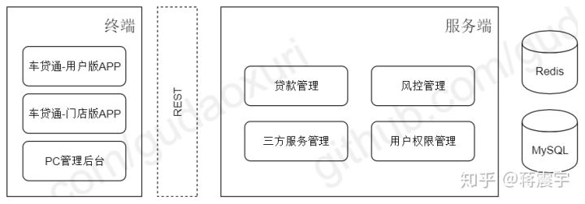
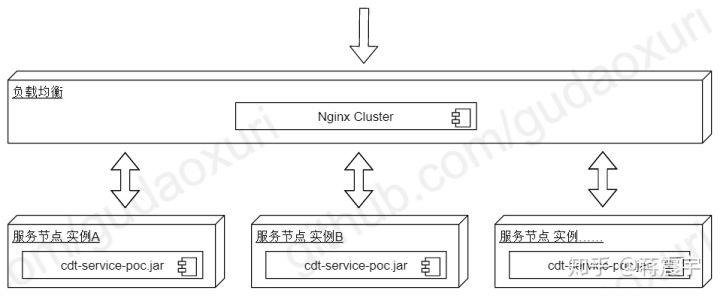
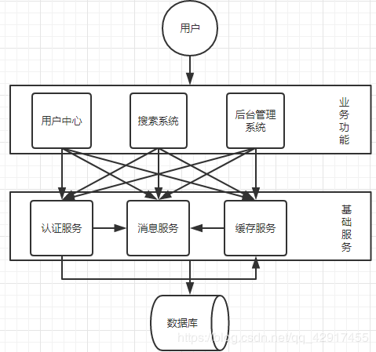
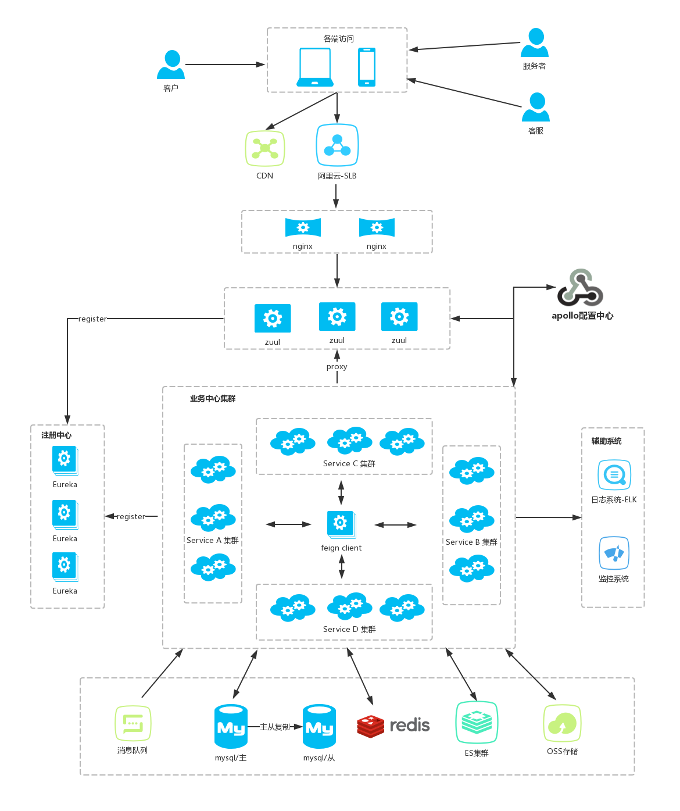
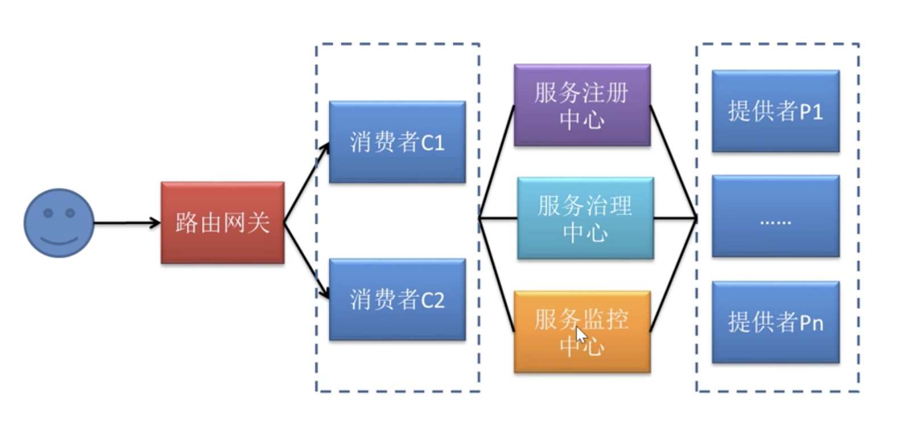
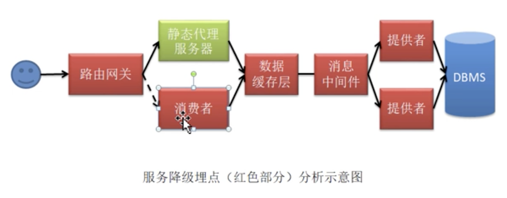

#  Dubbo 

## 概述

### 系统框架的发展

#### 单体系统架构



#### 集群架构



#### 分布式架构



#### 微服务架构



#### 流动计算架构



### 架构师的基本素养

#### 常用术语

##### 系统容量与系统容量预估

系统容量指系统所能承受的最大访问量，而系统容量预估则是在峰值流量到达之前系统给出的若干技术指标值

##### QPS

QPS， Query Per Second，每秒查询量。在分布式系统中QPS的定义是，点那个进程每秒请求服务器的成功次数

> $QPS = 总请求数/进程总数/请求时间 = 请求总数 /（进程总数*请求时间）$

使用压测工具进行测试！

##### UV

Unique Visitor ，独立访客数量，指一定时间范围内站点访问所来自的IP数量，同一IP多次访问只计算一次。

##### PV

Page View，页面访问量，指一定是近啊范围内打开或刷新页面的次数


#### 系统容量预估基本计算

##### 带宽计算

$平均带宽 = 总流量数（bit）/产生这些流量的时长（秒） = （PV * 页面平均大小*8）/ 统计时间（秒）$

$带宽需求（峰值带宽） = 平局带宽 * 峰值因子$

峰值因子 峰值情况下比平时情况下高出多少倍

> 日均PV 10W， 页面平均大小 0.4M，则
>
> 平均带宽 = (10W * 0.4M * 8) / (60 * 60 * 24) 

##### 并发量计算

并发量，也称为并非连接数，一般是指**单台服务器**每秒处理的连接数，平均并发连接数的计算公式是

$平均并发连接数 = （站点PV * 页面平均衍生连接数）/（统计时间 * web服务器数量）$

> 日均PV 50W，页面平均衍生连接数是30， 服务器数量为5台
>
> 平均并发连接数 = （50W * 30）/ 60 * 60 * 24 * 5
>
> 峰值并发量 = 平均并发连接数 * 峰值因子

##### 服务器预估量

根据往年同期活动获得日均PV、并发量、页面衍生连接数、及公司业务扩展带来的流浪增涨率,就可以计算出服务器预估值。

$服务器预估值 = 站点每秒处理的总连接数/单机并发连接数 = （PV * 页面衍生连接数 * （1 + 增涨率）/统计时间/单机并发连接数$

### Dubbo 简介

#### 官网简介

Apache Dubbo™ 是一款高性能Java RPC框架。

#### 什么是RPC

**远程过程调用**（英语：Remote Procedure Call，缩写为 RPC）是一个计算机通信[协议](https://zh.wikipedia.org/wiki/網絡傳輸協議)。该协议允许运行于一台计算机的[程序](https://zh.wikipedia.org/wiki/程序)调用另一个[地址空间](https://zh.wikipedia.org/wiki/地址空间)（通常为一个开放网络的一台计算机）的[子程序](https://zh.wikipedia.org/wiki/子程序)，而程序员就像调用本地程序一样，无需额外地为这个交互作用编程（无需关注细节）。RPC是一种服务器-客户端（Client/Server）模式，经典实现是一个通过**发送请求-接受回应**进行信息交互的系统。

### Dubbo四大组件

##### 节点角色说明

| 节点          | 角色说明                |
|-------------|---------------------|
| `Provider`  | 暴露服务的服务提供方          |
| `Consumer`  | 调用远程服务的服务消费方        |
| `Registry`  | 服务注册与发现的注册中心        |
| `Monitor`   | 统计服务的调用次数和调用时间的监控中心 |
| `Container` | 服务运行容器              |


## 系统框架搭建

### 直连式


### Zookeeper注册中心

在生产环境下使用最多的注册中心为Zookeeper，当然，Redis也可以做注册中心。

#### 提供者 02-provider-zk

#### 消费者 02-consumer-zk

#### 添加日志文件

### 运维管理

https://github.com/apache/dubbo-admin

## 高级配置

### 启动时服务检查

> 02-consumer-zk

Dubbo 缺省会在启动时检查依赖的服务是否可用，不可用时会抛出异常，阻止 Spring 初始化完成，以便上线时，能及早发现问题，默认 `check="true"`。

可以通过 `check="false"` 关闭检查，比如，测试时，有些服务不关心，或者出现了循环依赖，必须有一方先启动。

另外，如果你的 Spring 容器是懒加载的，或者通过 API 编程延迟引用服务，请关闭 check，否则服务临时不可用时，会抛出异常，拿到 null 引用，如果 `check="false"`，总是会返回引用，当服务恢复时，能自动


#### 示例

##### 通过 spring 配置文件

关闭某个服务的启动时检查 (没有提供者时报错)：

```xml
<dubbo:reference interface="com.foo.BarService" check="false" />
```

关闭所有服务的启动时检查 (没有提供者时报错)：

```xml
<dubbo:consumer check="false" />
```

关闭注册中心启动时检查 (注册订阅失败时报错)：

```xml
<dubbo:registry check="false" />
```

##### 通过 dubbo.properties

```properties
dubbo.reference.com.foo.BarService.check=false
dubbo.reference.check=false
dubbo.consumer.check=false
dubbo.registry.check=false
```

##### 通过 -D 参数

```sh
java -Ddubbo.reference.com.foo.BarService.check=false
java -Ddubbo.reference.check=false
java -Ddubbo.consumer.check=false 
java -Ddubbo.registry.check=false
```
#### 配置的含义
dubbo.reference.check=false，强制改变所有 reference 的 check 值，就算配置中有声明，也会被覆盖。

dubbo.consumer.check=false，是设置 check 的缺省值，如果配置中有显式的声明，如：<dubbo:reference check="true"/>，不会受影响。

dubbo.registry.check=false，前面两个都是指订阅成功，但提供者列表是否为空是否报错，如果注册订阅失败时，也允许启动，需使用此选项，将在后台定时重试。


### 服务分组

当一个接口有多种实现时，可以用 group 区分。

##### 服务

```xml
<dubbo:service group="feedback" interface="com.xxx.IndexService" />
<dubbo:service group="member" interface="com.xxx.IndexService" />
```

##### 引用

```xml
<dubbo:reference id="feedbackIndexService" group="feedback" interface="com.xxx.IndexService" />
<dubbo:reference id="memberIndexService" group="member" interface="com.xxx.IndexService" />
```

任意组

```xml
<dubbo:reference id="barService" interface="com.foo.BarService" group="*" />
```

#### 示例

* 05-provider-group
* 05-consumer-group


### 多版本控制

当一个接口实现，出现不兼容升级时，可以用版本号过渡，版本号不同的服务相互间不引用。

可以按照以下的步骤进行版本迁移：

1. 在低压力时间段，先升级一半提供者为新版本
2. 再将所有消费者升级为新版本
3. 然后将剩下的一半提供者升级为新版本

老版本服务提供者配置：

```xml
<dubbo:service interface="com.foo.BarService" version="1.0.0" />
```

新版本服务提供者配置：

```xml
<dubbo:service interface="com.foo.BarService" version="2.0.0" />
```

老版本服务消费者配置：

```xml
<dubbo:reference id="barService" interface="com.foo.BarService" version="1.0.0" />
```

新版本服务消费者配置：

```xml
<dubbo:reference id="barService" interface="com.foo.BarService" version="2.0.0" />
```

如果不需要区分版本，可以按照以下的方式配置 [[1\]](http://dubbo.apache.org/zh-cn/docs/user/demos/multi-versions.html#fn1)：

```xml
<dubbo:reference id="barService" interface="com.foo.BarService" version="*" />
```

#### 示例

* 04-provider-version
* 04-consumer-version


### 分组聚合

按组合并返回结果 [[1\]](http://dubbo.apache.org/zh-cn/docs/user/demos/group-merger.html#fn1)，比如菜单服务，接口一样，但有多种实现，用group区分，现在消费方需从每种group中调用一次返回结果，合并结果返回，这样就可以实现聚合菜单项。

相关代码可以参考 [dubbo 项目中的示例](https://github.com/dubbo/dubbo-samples/tree/master/dubbo-samples-merge)

#### 配置

搜索所有分组

```xml
<dubbo:reference interface="com.xxx.MenuService" group="*" merger="true" />
```

合并指定分组

```xml
<dubbo:reference interface="com.xxx.MenuService" group="aaa,bbb" merger="true" />
```

指定方法合并结果，其它未指定的方法，将只调用一个 Group

```xml
<dubbo:reference interface="com.xxx.MenuService" group="*">
    <dubbo:method name="getMenuItems" merger="true" />
</dubbo:reference>
```

某个方法不合并结果，其它都合并结果

```xml
<dubbo:reference interface="com.xxx.MenuService" group="*" merger="true">
    <dubbo:method name="getMenuItems" merger="false" />
</dubbo:reference>
```

指定合并策略，缺省根据返回值类型自动匹配，如果同一类型有两个合并器时，需指定合并器的名称 [[2\]](http://dubbo.apache.org/zh-cn/docs/user/demos/group-merger.html#fn2)

```xml
<dubbo:reference interface="com.xxx.MenuService" group="*">
    <dubbo:method name="getMenuItems" merger="mymerge" />
</dubbo:reference>
```

指定合并方法，将调用返回结果的指定方法进行合并，合并方法的参数类型必须是返回结果类型本身

```xml
<dubbo:reference interface="com.xxx.MenuService" group="*">
    <dubbo:method name="getMenuItems" merger=".addAll" />
</dubbo:reference>
```


### 多协议支持

Dubbo 允许配置多协议，在不同服务上支持不同协议或者同一服务上同时支持多种协议。

#### 各个协议的特点

##### dubbo

缺省协议，使用基于 mina `1.1.7` 和 hessian `3.2.1` 的 tbremoting 交互。

- 连接个数：单连接
- 连接方式：长连接
- 传输协议：TCP
- 传输方式：NIO 异步传输
- 序列化：Hessian 二进制序列化
- 适用范围：传入传出参数数据包较小（建议小于100K），消费者比提供者个数多，单一消费者无法压满提供者，尽量不要用 dubbo 协议传输大文件或超大字符串。
- 适用场景：常规远程服务方法调用

##### rmi

- 连接个数：多连接
- 连接方式：短连接
- 传输协议：TCP
- 传输方式：同步传输
- 序列化：Java 标准二进制序列化
- 适用范围：传入传出参数数据包大小混合，消费者与提供者个数差不多，可传文件。
- 适用场景：常规远程服务方法调用，与原生RMI服务互操作

##### hessian

- 连接个数：多连接
- 连接方式：短连接
- 传输协议：HTTP
- 传输方式：同步传输
- 序列化：Hessian二进制序列化
- 适用范围：传入传出参数数据包较大，提供者比消费者个数多，提供者压力较大，可传文件。
- 适用场景：页面传输，文件传输，或与原生hessian服务互操作

##### http

- 连接个数：多连接
- 连接方式：短连接
- 传输协议：HTTP
- 传输方式：同步传输
- 序列化：表单序列化
- 适用范围：传入传出参数数据包大小混合，提供者比消费者个数多，可用浏览器查看，可用表单或URL传入参数，暂不支持传文件。
- 适用场景：需同时给应用程序和浏览器 JS 使用的服务。

##### webservice

- 连接个数：多连接
- 连接方式：短连接
- 传输协议：HTTP
- 传输方式：同步传输
- 序列化：SOAP 文本序列化
- 适用场景：系统集成，跨语言调用

##### thrift

##### memcached

##### redis

##### rest

#### 不同服务不同协议

不同服务在性能上适用不同协议进行传输，比如大数据用短连接协议，小数据大并发用长连接协议

```xml
<?xml version="1.0" encoding="UTF-8"?>
<beans xmlns="http://www.springframework.org/schema/beans"
    xmlns:xsi="http://www.w3.org/2001/XMLSchema-instance"
    xmlns:dubbo="http://dubbo.apache.org/schema/dubbo"
    xsi:schemaLocation="http://www.springframework.org/schema/beans http://www.springframework.org/schema/beans/spring-beans-4.3.xsd http://dubbo.apache.org/schema/dubbo http://dubbo.apache.org/schema/dubbo/dubbo.xsd"> 
    <dubbo:application name="world"  />
    <dubbo:registry id="registry" address="10.20.141.150:9090" username="admin" password="hello1234" />
    <!-- 多协议配置 -->
    <dubbo:protocol name="dubbo" port="20880" />
    <dubbo:protocol name="rmi" port="1099" />
    <!-- 使用dubbo协议暴露服务 -->
    <dubbo:service interface="com.alibaba.hello.api.HelloService" version="1.0.0" ref="helloService" protocol="dubbo" />
    <!-- 使用rmi协议暴露服务 -->
    <dubbo:service interface="com.alibaba.hello.api.DemoService" version="1.0.0" ref="demoService" protocol="rmi" /> 
</beans>
```

#### 多协议暴露服务

需要与 http 客户端互操作

```xml
<?xml version="1.0" encoding="UTF-8"?>
<beans xmlns="http://www.springframework.org/schema/beans"
    xmlns:xsi="http://www.w3.org/2001/XMLSchema-instance"
    xmlns:dubbo="http://dubbo.apache.org/schema/dubbo"
    xsi:schemaLocation="http://www.springframework.org/schema/beans http://www.springframework.org/schema/beans/spring-beans-4.3.xsd http://dubbo.apache.org/schema/dubbo http://dubbo.apache.org/schema/dubbo/dubbo.xsd">
    <dubbo:application name="world"  />
    <dubbo:registry id="registry" address="10.20.141.150:9090" username="admin" password="hello1234" />
    <!-- 多协议配置 -->
    <dubbo:protocol name="dubbo" port="20880" />
    <dubbo:protocol name="hessian" port="8080" />
    <!-- 使用多个协议暴露服务 -->
    <dubbo:service id="helloService" interface="com.alibaba.hello.api.HelloService" version="1.0.0" protocol="dubbo,hessian" />
</beans>
```


### 负载均衡

在集群负载均衡时，Dubbo 提供了多种均衡策略，缺省为 `random` 随机调用。

可以自行扩展负载均衡策略，参见：[负载均衡扩展](http://dubbo.apache.org/zh-cn/docs/dev/impls/load-balance.html)

#### 负载均衡策略

##### Random LoadBalance

- **随机**，按权重设置随机概率。  
- 在一个截面上碰撞的概率高，但调用量越大分布越均匀，而且按概率使用权重后也比较均匀，有利于动态调整提供者权重。
- 存在服务堆积问题

##### RoundRobin LoadBalance

- **轮询**，按公约后的权重设置轮询比率。
- 存在慢的提供者累积请求的问题，比如：第二台机器很慢，但没挂，当请求调到第二台时就卡在那，久而久之，所有请求都卡在调到第二台上。

##### LeastActive LoadBalance

- **最少活跃调用数**，相同活跃数的随机，活跃数指调用前后计数差。
- 使慢的提供者收到更少请求，因为越慢的提供者的调用前后计数差会越大。

##### ConsistentHash LoadBalance

- **一致性 Hash**，相同参数的请求总是发到同一提供者。
- 当某一台提供者挂时，原本发往该提供者的请求，基于虚拟节点，平摊到其它提供者，不会引起剧烈变动。
- 算法参见：http://en.wikipedia.org/wiki/Consistent_hashing
- 缺省只对第一个参数 Hash，如果要修改，请配置 ``
- 缺省用 160 份虚拟节点，如果要修改，请配置 ``

#### 配置

##### 服务端服务级别

```xml
<dubbo:service interface="..." loadbalance="roundrobin" />
```

##### 客户端服务级别

```xml
<dubbo:reference interface="..." loadbalance="roundrobin" />
```

##### 服务端方法级别

```xml
<dubbo:service interface="...">
    <dubbo:method name="..." loadbalance="roundrobin"/>
</dubbo:service>
```

##### 客户端方法级别

```xml
<dubbo:reference interface="...">
    <dubbo:method name="..." loadbalance="roundrobin"/>
</dubbo:reference>
```


### 集群容错

在集群调用失败时，Dubbo 提供了多种容错方案，缺省为 failover 重试。


各节点关系：

- 这里的 `Invoker` 是 `Provider` 的一个可调用 `Service` 的抽象，`Invoker` 封装了 `Provider` 地址及 `Service` 接口信息
- `Directory` 代表多个 `Invoker`，可以把它看成 `List` ，但与 `List` 不同的是，它的值可能是动态变化的，比如注册中心推送变更
- `Cluster` 将 `Directory` 中的多个 `Invoker` 伪装成一个 `Invoker`，对上层透明，伪装过程包含了容错逻辑，调用失败后，重试另一个
- `Router` 负责从多个 `Invoker` 中按路由规则选出子集，比如读写分离，应用隔离等
- `LoadBalance` 负责从多个 `Invoker` 中选出具体的一个用于本次调用，选的过程包含了负载均衡算法，调用失败后，需要重选


#### 集群容错模式

可以自行扩展集群容错策略

##### Failover Cluster

失败自动切换，当出现失败，重试其它服务器 [[1\]](http://dubbo.apache.org/zh-cn/docs/user/demos/fault-tolerent-strategy.html#fn1)。通常用于读操作，但重试会带来更长延迟。可通过 `retries="2"` 来设置重试次数(不含第一次)。

重试次数配置如下：

```xml
<dubbo:service retries="2" />
```

或

```xml
<dubbo:reference retries="2" />
```

或

```xml
<dubbo:reference>
    <dubbo:method name="findFoo" retries="2" />
</dubbo:reference>
```

##### Failfast Cluster

快速失败，只发起一次调用，失败立即报错。通常用于非幂等性的写操作，比如新增记录。

> 幂等 在请求参数相同的前提下，请求一次与请求N次对系统产生的影响是相同的。
> * GET:  幂等
> * POST: 非幂等
> * PUT: 幂等
> * DELETE: 幂等

##### Failsafe Cluster

失败安全，出现异常时，直接忽略。通常用于写入审计日志等操作。

##### Failback Cluster

失败自动恢复，后台记录失败请求，定时重发。通常用于消息通知操作。

##### Forking Cluster

并行调用多个服务器，只要一个成功即返回。通常用于实时性要求较高的读操作，但需要浪费更多服务资源。可通过 `forks="2"` 来设置最大并行数。

##### Broadcast Cluster

广播调用所有提供者，逐个调用，任意一台报错则报错。通常用于通知所有提供者更新缓存或日志等本地资源信息。

#### 集群模式配置

按照以下示例在服务提供方和消费方配置集群模式

```xml
<dubbo:service cluster="failsafe" />
```

或

```xml
<dubbo:reference cluster="failsafe" />
```

### 服务降级

高并发的三把利器： 降级、限流、缓存

#### 服务降级基础

##### 1. 什么是服务降级

服务降级，当服务器压力剧增的情况下，根据当前业务情况及流量对一些服务有策略的降低服务级别，一释放服务器资源，保证核心任务的正常运行。

##### 2. 服务降级的方式

能够实现服务降级的方式很多，常见的有如下几种情况

* 部分服务暂停
* 全部服务暂停
* 随机拒绝服务
* 部分服务延迟

##### 3. 真个系统的服务降级埋点



##### 4. 服务降级与Mock机制

dubbo的服务降级采用的是mock机制。其具有两种降级处理方式：Mock Null降级处理与Mock Class降级处理。


#### Mock Null 服务降级处理 

* 06-consumer-mocknull

#### Mock Class 服务降级处理

* 06-consumer-mockclass


可以通过服务降级功能临时屏蔽某个出错的非关键服务，并定义降级后的返回策略。

向注册中心写入动态配置覆盖规则：

```java
RegistryFactory registryFactory = ExtensionLoader.getExtensionLoader(RegistryFactory.class).getAdaptiveExtension();
Registry registry = registryFactory.getRegistry(URL.valueOf("zookeeper://10.20.153.10:2181"));
registry.register(URL.valueOf("override://0.0.0.0/com.foo.BarService?category=configurators&dynamic=false&application=foo&mock=force:return+null"));
```

其中：

- `mock=force:return+null` 表示消费方对该服务的方法调用都直接返回 null 值，不发起远程调用。用来屏蔽不重要服务不可用时对调用方的影响。
- 还可以改为 `mock=fail:return+null` 表示消费方对该服务的方法调用在失败后，再返回 null 值，不抛异常。用来容忍不重要服务不稳定时对调用方的影响。

### 服务限流

为了方式某个消费者的QPS或是所有消费者的QPS总和突然飙升而导致的重要服务的实效，系统可以对访问流量进行控制，这种对集群的保护措施称为服务限流

Dubbo中能够实现服务限流的方式较多，可以划分为两类：直接限流与间接限流。

* 直接限流：通过对连接数量直接进行限制来达到限流的目录。（官方方案总结）
* 间接限流：通过一些非连接数量设置来达到限流的目的。

#### 直接限流

##### 1. executes限流

该属性*仅能设置在提供者端*。可以设置为接口级别，也可以蛇追尾方法级别。限制的是服务（方法）并发执行数量

```xml
<dubbo:service interface="me.warriorg.dubbo.service.UserService" ref="userService" executes="10" />
```

##### 2. accepts限流

该属性*仅可设置在提供者端的<dubbo:provider/> 与<dubbo:protocol>*。用于对你指定协议你的连接数量进行限制。

```xml
<!--限制当前提供者在使用dubbo协议时最多接受10个消费者连接-->
<dubbo:provider accepts="10" protocol="dubbo"/>
```

```xml
<!--限制当前提供者在使用dubbo协议时醉倒接受10个消费者连接-->
<dubbo:protocol name="dubbo" port="20880" accepts="10"/>
```

##### 3. actives限流

该限流方式与前两种不同的是，起可以是指在提供者端，也可以设置在消费者端。可以蛇追尾接口级别，也可以设置为方法级别。

###### A. 提供者端限流

根据消费者与提供者间建立的连接类型不同，其意义也不同：

长连接： 表示当前长连接最多可以处理的请求个数，与长连接的数量没有关系

端连接： 表示可以同时处理的短连接的数量。

```xml
<!--限制当前接口中每个方法的并发执行数不能超过10个-->
<dubbo:service interface="me.warriorg.dubbo.service.FooService" ref="fooService" actives="10" />
```

```xml
<!--限制当前接口中hello方法的并发执行数不能超过10个-->
<dubbo:service interface="me.warriorg.dubbo.service.FooService" ref="fooService">
  <dubbo:method name="hello" executes="10"></dubbo:method>
</dubbo:service>
```

###### B. 消费者端限流

根据消费者与提供者间建立的连接类型不同，其意义也不同：

长连接： 表示当前消费者所发出的长连接中最多可以提交的请求个数，与长连接的数量没有关系

端连接： 表示消费者可以提交的短连接的数量。

##### 4. connections 限流

可以设置在提供者端，也可以设置在消费者端。限定连接的个数。对于端连接，该属性效果与actives形同，对于长连接，起限制的是长连接的个数。

一般情况下，我们会使connections与actives联用，让connections限制长连接个数，让actives限制一个长连接中可以处理的请求个数。使用前提：使用默认的Dubbo服务暴露协议。

###### A. 提供者端限流

```xml
<!--限制当前接口中每个方法的并发连接数不能超过10个-->
<dubbo:service interface="me.warriorg.dubbo.service.FooService" ref="fooService" connections="10" />
```

```xml
<!--限制当前接口中hello方法的并发连接数不能超过10个-->
<dubbo:service interface="me.warriorg.dubbo.service.FooService" ref="fooService">
  <dubbo:method name="hello" connections="10"></dubbo:method>
</dubbo:service>
```

###### B. 消费者端限流

#### 间接限流

##### 1. 延迟连接

仅可设置在消费者端，且*不能设置为方法级别*。仅作用于Dubbo服务暴露协议。

将长连接的建立推迟到消费者真正调用提供者。

可以减少长连接的数量

```xml
<!--设置当前消费者对指定接口的每一个方法发出的连接均采用用延迟连接-->
<dubbo:reference id="fooService" lazy="true"
                 interface="me.warriorg.dubbo.service.FooService" />
```

```xml
<!--设置当前消费者对所有接口的所有方法发出的连接均采用延迟连接-->
<dubbo:consumer lazy="true" />
```

##### 2. 粘连连接

*仅能设置在消费者端*，可以设置为接口级别，也可以蛇追尾方法级别，仅作用于dubbo服务暴露协议。

其会使客户端尽量向同一个提供者发起调用，除非该提供者宕机了，其会连接另一台。只要启用了粘连连接，其就会自动启用延迟连接。

其限制的是流向，而非流量。

```xml
<dubbo:reference id="userService" sticky="true" interface="me.warriorg.dubbo.service.UserService"/>
```

##### 3. 负载均衡

可以设置在消费者端，也可以设置在提供者端；可以设置在接口级别，也可以i设置在方法级别

```xml
<!--通过指定负载均衡策略为leastactive达到限流的目的-->
<dubbo:service interface="me.warriorg.dubbo.service.UserService" ref="userService" loadbalance="leastactive"/>
```

### 结果缓存

为了进一步提高消费者对用户的响应速度，减轻提供者的压力，Dubbo提供了机遇结果的声明式缓存，该缓存是机遇消费者端的，所以使用很简单，只需修改消费者配置文件，与提供者无关。

#### 缓存类型

- `lru` 基于最近最少使用原则删除多余缓存，保持最热的数据被缓存。
- `threadlocal` 当前线程缓存，比如一个页面渲染，用到很多 portal，每个 portal 都要去查用户信息，通过线程缓存，可以减少这种多余访问。
- `jcache` 与 [JSR107](http://jcp.org/en/jsr/detail?id=107') 集成，可以桥接各种缓存实现。

#### 配置

```xml
<dubbo:reference interface="com.foo.BarService" cache="lru" />
```

或：

```xml
<dubbo:reference interface="com.foo.BarService">
    <dubbo:method name="findBar" cache="lru" />
</dubbo:reference>
```

### 多注册中心

Dubbo 支持同一服务向多注册中心同时注册，或者不同服务分别注册到不同的注册中心上去，甚至可以同时引用注册在不同注册中心上的同名服务。另外，注册中心是支持自定义扩展的

#### 多注册中心注册

比如：中文站有些服务来不及在青岛部署，只在杭州部署，而青岛的其它应用需要引用此服务，就可以将服务同时注册到两个注册中心。

```xml
<?xml version="1.0" encoding="UTF-8"?>
<beans xmlns="http://www.springframework.org/schema/beans"
    xmlns:xsi="http://www.w3.org/2001/XMLSchema-instance"
    xmlns:dubbo="http://dubbo.apache.org/schema/dubbo"
    xsi:schemaLocation="http://www.springframework.org/schema/beans http://www.springframework.org/schema/beans/spring-beans-4.3.xsd http://dubbo.apache.org/schema/dubbo http://dubbo.apache.org/schema/dubbo/dubbo.xsd">
    <dubbo:application name="world"  />
    <!-- 多注册中心配置 -->
    <dubbo:registry id="hangzhouRegistry" address="10.20.141.150:9090" />
    <dubbo:registry id="qingdaoRegistry" address="10.20.141.151:9010" default="false" />
    <!-- 向多个注册中心注册 -->
    <dubbo:service interface="com.alibaba.hello.api.HelloService" version="1.0.0" ref="helloService" registry="hangzhouRegistry,qingdaoRegistry" />
</beans>
```

#### 不同服务使用不同注册中心

比如：CRM 有些服务是专门为国际站设计的，有些服务是专门为中文站设计的。

```xml
<?xml version="1.0" encoding="UTF-8"?>
<beans xmlns="http://www.springframework.org/schema/beans"
    xmlns:xsi="http://www.w3.org/2001/XMLSchema-instance"
    xmlns:dubbo="http://dubbo.apache.org/schema/dubbo"
    xsi:schemaLocation="http://www.springframework.org/schema/beans http://www.springframework.org/schema/beans/spring-beans-4.3.xsd http://dubbo.apache.org/schema/dubbo http://dubbo.apache.org/schema/dubbo/dubbo.xsd">
    <dubbo:application name="world"  />
    <!-- 多注册中心配置 -->
    <dubbo:registry id="chinaRegistry" address="10.20.141.150:9090" />
    <dubbo:registry id="intlRegistry" address="10.20.154.177:9010" default="false" />
    <!-- 向中文站注册中心注册 -->
    <dubbo:service interface="com.alibaba.hello.api.HelloService" version="1.0.0" ref="helloService" registry="chinaRegistry" />
    <!-- 向国际站注册中心注册 -->
    <dubbo:service interface="com.alibaba.hello.api.DemoService" version="1.0.0" ref="demoService" registry="intlRegistry" />
</beans>
```

#### 多注册中心引用

比如：CRM 需同时调用中文站和国际站的 PC2 服务，PC2 在中文站和国际站均有部署，接口及版本号都一样，但连的数据库不一样。

```xml
<?xml version="1.0" encoding="UTF-8"?>
<beans xmlns="http://www.springframework.org/schema/beans"
    xmlns:xsi="http://www.w3.org/2001/XMLSchema-instance"
    xmlns:dubbo="http://dubbo.apache.org/schema/dubbo"
    xsi:schemaLocation="http://www.springframework.org/schema/beans http://www.springframework.org/schema/beans/spring-beans-4.3.xsd http://dubbo.apache.org/schema/dubbo http://dubbo.apache.org/schema/dubbo/dubbo.xsd">
    <dubbo:application name="world"  />
    <!-- 多注册中心配置 -->
    <dubbo:registry id="chinaRegistry" address="10.20.141.150:9090" />
    <dubbo:registry id="intlRegistry" address="10.20.154.177:9010" default="false" />
    <!-- 引用中文站服务 -->
    <dubbo:reference id="chinaHelloService" interface="com.alibaba.hello.api.HelloService" version="1.0.0" registry="chinaRegistry" />
    <!-- 引用国际站站服务 -->
    <dubbo:reference id="intlHelloService" interface="com.alibaba.hello.api.HelloService" version="1.0.0" registry="intlRegistry" />
</beans>
```

如果只是测试环境临时需要连接两个不同注册中心，使用竖号分隔多个不同注册中心地址：

```xml
<?xml version="1.0" encoding="UTF-8"?>
<beans xmlns="http://www.springframework.org/schema/beans"
    xmlns:xsi="http://www.w3.org/2001/XMLSchema-instance"
    xmlns:dubbo="http://dubbo.apache.org/schema/dubbo"
    xsi:schemaLocation="http://www.springframework.org/schema/beans http://www.springframework.org/schema/beans/spring-beans-4.3.xsd http://dubbo.apache.org/schema/dubbo http://dubbo.apache.org/schema/dubbo/dubbo.xsd">
    <dubbo:application name="world"  />
    <!-- 多注册中心配置，竖号分隔表示同时连接多个不同注册中心，同一注册中心的多个集群地址用逗号分隔 -->
    <dubbo:registry address="10.20.141.150:9090|10.20.154.177:9010" />
    <!-- 引用服务 -->
    <dubbo:reference id="helloService" interface="com.alibaba.hello.api.HelloService" version="1.0.0" />
</beans>
```

### 单功能注册中心

​		只对当前配置文件中的服务起作用，不会影响注册中心本身的功能。

#### 仅订阅

​		对于某服务来说，其可以发现和调用注册中心中的其它服务，但不能被其他服务发现和调用，这种情形称为仅订阅。

​		简单说就是，仅可去发现，但不能被发现。

禁用注册配置

```xml
<dubbo:registry address="10.20.153.10:9090" register="false" />
```

或者

```xml
<dubbo:registry address="10.20.153.10:9090?register=false" />
```

#### 仅注册

​		对于某服务来说，其可以被注册中心的其他服务发现和调用，单不能发现和调用注册中心的其他服务，这种情形称为仅注册。

​		简单来说就是，仅可被发现，但不能去发现

禁用订阅配置

```xml
<dubbo:registry id="hzRegistry" address="10.20.153.10:9090" />
<dubbo:registry id="qdRegistry" address="10.20.141.150:9090" subscribe="false" />
```

或者

```xml
<dubbo:registry id="hzRegistry" address="10.20.153.10:9090" />
<dubbo:registry id="qdRegistry" address="10.20.141.150:9090?subscribe=false" />
```

### 服务暴露延迟

​		如果我们的服务启动过程需要warmup（预热）事件，看就可以睡用delay进行服务延迟暴露，只需要在服务提供者的`<dubbo:service/>`标签中添加delay属性。其值可以有三类：

* 正数  单位为毫秒，表示提供者对象常见完毕后的指定时间后在发布服务。
* 0  默认值，表示当前提供者创建完毕后马上向注册中心暴露服务
* -1  表示在Spring容器初始化完毕后在想注册中心暴露服务。

```xml
<dubbo:service delay="5000" />
```

#### Spring 2.x 初始化死锁问题

##### 触发条件

在 Spring 解析到 `<dubbo:service />` 时，就已经向外暴露了服务，而 Spring 还在接着初始化其它 Bean。如果这时有请求进来，并且服务的实现类里有调用 `applicationContext.getBean()` 的用法。

1. 请求线程的 applicationContext.getBean() 调用，先同步 singletonObjects 判断 Bean 是否存在，不存在就同步 beanDefinitionMap 进行初始化，并再次同步 singletonObjects 写入 Bean 实例缓存。
2. 而 Spring 初始化线程，因不需要判断 Bean 的存在，直接同步 beanDefinitionMap 进行初始化，并同步 singletonObjects 写入 Bean 实例缓存。

这样就导致 getBean 线程，先锁 singletonObjects，再锁 beanDefinitionMap，再次锁 singletonObjects。
而 Spring 初始化线程，先锁 beanDefinitionMap，再锁 singletonObjects。反向锁导致线程死锁，不能提供服务，启动不了。

##### 规避办法

1. 强烈建议不要在服务的实现类中有 applicationContext.getBean() 的调用，全部采用 IoC 注入的方式使用 Spring的Bean。
2. 如果实在要调 getBean()，可以将 Dubbo 的配置放在 Spring 的最后加载。
3. 如果不想依赖配置顺序，可以使用 ``，使 Dubbo 在 Spring 容器初始化完后，再暴露服务。
4. 如果大量使用 getBean()，相当于已经把 Spring 退化为工厂模式在用，可以将 Dubbo 的服务隔离单独的 Spring 容器。

### 消费者的异步调用

异步调用一般应用于提供者提供的是耗时性IO服务

#### Future 异步执行原理

异步方法调用执行原理如下图所示，其中实线为同步调用，虚线为异步调用。

* UserThread：消费者线程
* IOThread：提供者线程
* Server：对IO型操作的真正执行者


#### Future异步调用

#### CompletableFuture 

#### 总结

Future 与ComplatableFuture的区别：

Future：Dubbo 2.7.0版本之前消费者异步调用提供者的实现方式。源自于JDK5，对异步结果的获取采用了阻塞与轮询的方式。

ComplatableFuture： Dubbo 2.7.0版本后消费者异步调用提供者实现方式。源自于JDK8，对异步结果的获取采用了回调的方式。

### 提供者的异步执行

### Dubbo在Spring Boot中的使用


### 属性配置优先级建议

Dubbo配置文件中各个标签属性配置的优先级总原则：

* 方法级优先，接口级次之，全局配置最后
* 如果级别一样，则消费方优先，提供方次之。
* `<dubbo:consumer/>` 设置在消费者端，用于设置消费者端的默认配置，级消费者端的全局设置。
* `<dubbo:provider/>` 设置在提供者端，用于设置提供者端的默认配置，即提供者端的默认配置。


### 优雅停机

Dubbo 是通过 JDK 的 ShutdownHook 来完成优雅停机的，所以如果用户使用 `kill -9 PID` 等强制关闭指令，是不会执行优雅停机的，只有通过 `kill PID` 时，才会执行。

#### 原理

##### 服务提供方

- 停止时，先标记为不接收新请求，新请求过来时直接报错，让客户端重试其它机器。
- 然后，检测线程池中的线程是否正在运行，如果有，等待所有线程执行完成，除非超时，则强制关闭。

##### 服务消费方

- 停止时，不再发起新的调用请求，所有新的调用在客户端即报错。
- 然后，检测有没有请求的响应还没有返回，等待响应返回，除非超时，则强制关闭。

#### 设置方式

设置优雅停机超时时间，缺省超时时间是 10 秒，如果超时则强制关闭。

```properties
# dubbo.properties
dubbo.service.shutdown.wait=15000
```

如果 ShutdownHook 不能生效，可以自行调用，**使用tomcat等容器部署的場景，建议通过扩展ContextListener等自行调用以下代码实现优雅停机**：

```java
ProtocolConfig.destroyAll();
```


### 服务调用超时

* 06-provider-timeout
* 06-consumer-timeout


## 系统架构解析

## 内核解析

### JDK的SPI规范


## 源码解析

