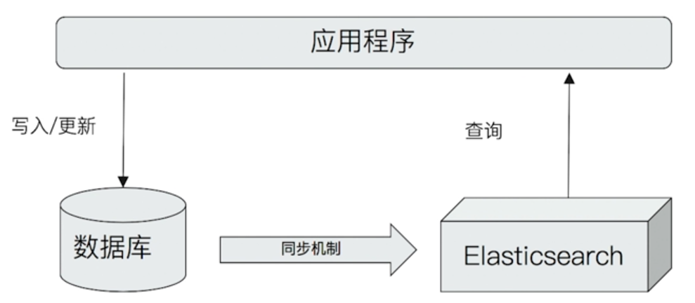
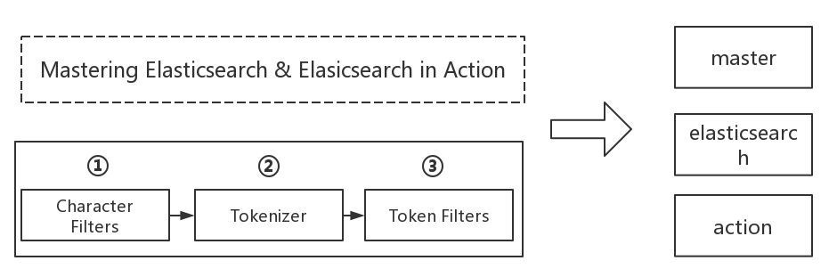
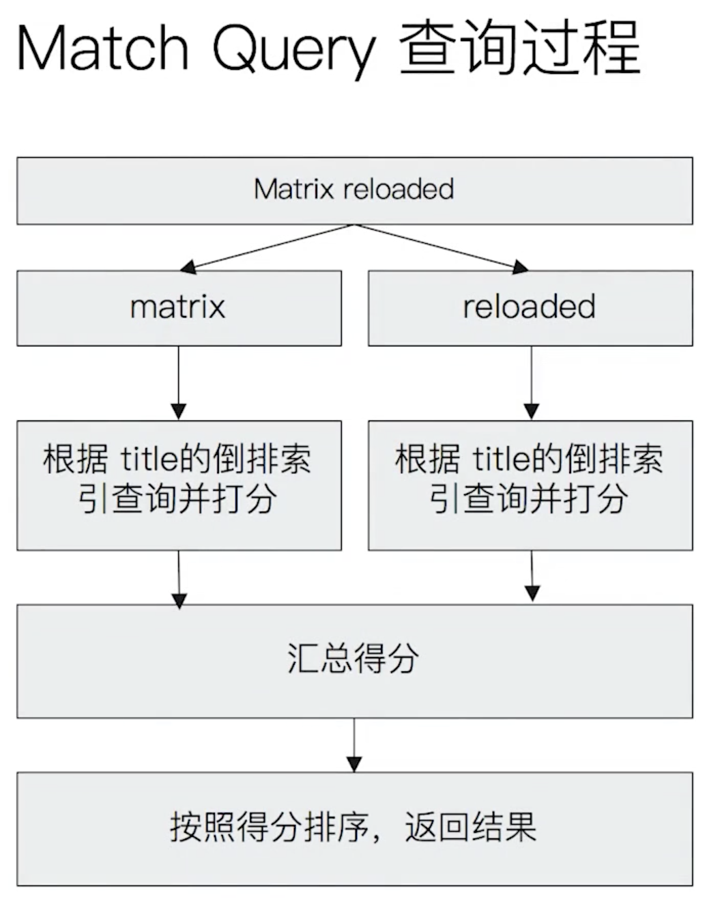

# Elasticsearch

## 概述

### 生态圈


### 与数据库集成


[官网](https://www.elastic.co/)

## Install

### MacOS单机部署

```bash
brew install elasticsearch
brew install kibana
```

### 集群安装

| 名称  | IP 地址      |
| ----- | ------------ |
| es-12 | 192.168.2.12 |
| es-13 | 192.168.2.13 |
| es-14 | 192.168.2.14 |

编辑 `vim /etc/security/limits.conf`

```bash
* soft nofile 65536
* hard nofile 65536
# 解决启动时的错误
# [1]: max file descriptors [4096] for elasticsearch process is too low, increase to at least [65536]
```

更改后需要重新登录用户

编辑 `vim /etc/sysctl.conf`

```bash
vm.max_map_count=655360
# 解决启动时的错误
# [2]: max virtual memory areas vm.max_map_count [65530] is too low, increase to at least [262144]
```

 执行命令 `sysctl -p`

开始安装

```bash
yum -y install java-1.8.0-openjdk
# 安装 elasticsearch-head 插件时需要
yum -y install nodejs 
# elasticsearch 不能使用root用户运行 
wget https://artifacts.elastic.co/downloads/elasticsearch/elasticsearch-6.6.2.tar.gz
tar -xvf elasticsearch-6.6.2.tar.gz
mv elasticsearch-6.6.2 /opt/es
adduser warriorg
passwd warriorg
cd /opt
chown -R warriorg es				# 赋权限
su warriorg
./elasticsearch -d 					# 运行 elasticsearch,只能本机访问
# 查看启动的进程
ps -aux | grep elasticsearch
```

修改配置文件  elasticsearch.yml

```bash
cluster.name: es-test
node.name: node-12
network.host: 0.0.0.0
```

配置防火墙

```bash
firewall-cmd --zone=public --add-port=9200/tcp --permanent
firewall-cmd --zone=public --add-port=9300/tcp --permanent
firewall-cmd --reload   # 使配置生效
firewall-cmd --list-all  # 检查配置
```

安装[elasticsearch-head](http://mobz.github.io/elasticsearch-head)插件,  **当然也可以chrome的插件,感觉效果更好!!**
```bash
cd /opt
git clone git://github.com/mobz/elasticsearch-head.git
cd elasticsearch-head
npm install
npm run start
```
==es-12== elasticsearch.yaml 

```bash
cluster.name: es-test
node.name: node-12
node.master: true
network.host: 0.0.0.0
http.port: 9200
discovery.zen.ping.unicast.hosts: ["192.168.2.12:9300", "192.168.2.13:9300", "192.168.2.14:9300"]
discovery.zen.minimum_master_nodes: 2
http.cors.enabled: true
http.cors.allow-origin: "*"
```
==es-13== elasticsearch.yaml 

```bash
cluster.name: es-test
node.name: node-13
node.master: true
network.host: 0.0.0.0
http.port: 9200
discovery.zen.ping.unicast.hosts: ["192.168.2.12:9300", "192.168.2.13:9300", "192.168.2.14:9300"]
discovery.zen.minimum_master_nodes: 2
http.cors.enabled: true
http.cors.allow-origin: "*"
```
==es-14== elasticsearch.yaml 

```bash
cluster.name: es-test
node.name: node-14
node.master: true
network.host: 0.0.0.0
http.port: 9200
discovery.zen.ping.unicast.hosts: ["192.168.2.12:9300", "192.168.2.13:9300", "192.168.2.14:9300"]
discovery.zen.minimum_master_nodes: 2
http.cors.enabled: true
http.cors.allow-origin: "*"
```

### 集群健康

`status` 字段指示着当前集群在总体上是否工作正常。它的三种颜色含义如下：

- **green **所有的主分片和副本分片都正常运行。
- **yellow **所有的主分片都正常运行，但不是所有的副本分片都正常运行。
- **red** 有主分片没能正常运行。

#### 集群信息查看

| uri                               | method | 描述                       |
| --------------------------------- | ------ | -------------------------- |
| /_cat/                            | GET    | 集群信息查询列表           |
| /_cat/health?v                    | GET    | 集群状态                   |
| /_nodes/stats/process?pretty      | GET    | node状态信息               |
| /_cat/nodes?v                     | GET    | 查看每个node的机器使用情况 |
| /_cat/indices?v                   | GET    | 查看集群的索引信息         |
| /_cat/indices?v&health=yellow     | GET    | 只显示状态为黄色的         |
| /_cat/indices?v&s=docs.count:desc | GET    | 根据文档数降序排序         |
| /_cat/indices?v&h=i,tm&s=tm:desc  | GET    | 显示每个索引占的内存       |
| /_cat/allocation?v                | GET    | node使用的磁盘情况         |
| /_cat/count?v                     | GET    | 查看文档数                 |
| /_cat/fielddata?v                 | GET    | fieldData的大小            |
| /_cat/fielddata?v&fields=test     | GET    | 查看指定的字段             |
| /_cat/master?v                    | GET    | 主节点信息                 |
| /_cat/recovery?v                  | GET    | 分片的恢复                 |

### elasticsearch.yml

```bash
# 默认启动的集群名字叫 elasticsearch 。 你最好给你的生产环境的集群改个名字，改名字的目的很简单， 就是防止某人的笔记本电脑加入了集群这种意外
cluster.name: elasticsearch_production
# 节点名称,每格几点名字不同,默认情况下自动生成,从ES的jar中的config文件下的name.txt中随机取出名字
node.name: node-12
# 是否允许该节点成为master(默认开启); ES启动时使用第一个节点为master,如果挂掉会从允许为master的节点中选举出来一个新的.
node.master: true
node.attr.rack: r1
# 该节点上允许出现的实例数,如果一个节点一个ES服务就不需要,如果需要在单台躲开就要改
node.max_local_storage_nodes=3
path.data: /path/to/data
path.logs: /path/to/logs
bootstrap.memory_lock: true
network.host: 192.168.0.1
http.port: 9200
# Elasticsearch 默认被配置为使用单播发现，以防止节点无意中加入集群。只有在同一台机器上运行的节点才会自动组成集群。
# master节点的初始列表;会探索,但是如果网络不稳定,会出现脑裂,最好加上node的信息
discovery.zen.ping.unicast.hosts: ["host1", "host2"]
# 集群中最小节点数,防止脑裂一般为:节点数/2+1. 例如: 网络中5个节点最小master是2,当网络故障后形成2个集群,通了后又变成一个.数据会严重错乱或无法工作
discovery.zen.minimum_master_nodes: 2
gateway.recover_after_nodes: 3
action.destructive_requires_name: true

# head访问
http.cors.enabled: true
http.cors.allow-origin: "*"
```


## 基本概念

### 索引

#### 定义

* Index 索引时文档的容器，是一类文档的结合
  * Index 体现了逻辑空间的概念：每个索引都有自己的Mapping定义，用于定义包含的文档的字段和字段类型
  * Shard 体现了物理空间的概念：索引中的数据分散在Shard上
* 索引的Mapping与Settings
  * Mapping 定义文档字段的类型
  * Settings 定义不同的数据分布

#### 索引的不同语意

* 名词 一个Elasticsearch集群中，可以创建很多不同的索引
* 动词 保存一个文档到Elasticsearch的过程也叫索引
  * ES中，创建一个倒排索引的过程
* 名词 一个B树索引，一个倒排索引


#### 与传统数据库对比

| RDBMS  | Elasticsearch |
| ------ | ------------- |
| Table  | Index(Type)   |
| Row    | Document      |
| Column | Field         |
| Schema | Mapping       |
| SQL    | DSL           |

```
GET /_cat/indices?v    # 列出所有的index
```


### 文档

#### 定义

* Elasticsearch是面向文档的，文档时所有可搜索数据的最小单位
  * 日志文件中的日志项
  * 一本电影的具体信息/一张唱片的详细信息
  * MP3播放器里的一首歌/一篇PDF文档中的具体内容
* 文档会被序列化成JSON格式，保存在Elasticsearch中
  * JSON对象由字段组成
  * 每个字段都有对应的字段类型
* 每个文档都有一个Unique ID
  * 可以自己指定ID
  * 通过Elasticsearch自动生成
* 一篇文档包含了一系列字段。类似数据库表中一条记录
* JSON文档，格式灵活，不需要预先定义格式
  * 字段的类型可以指定或者通过Elasticsearch自动推算
  * 支持数组/支持嵌套

#### 文档的元数据

用于标注文档的相关信息

| 类型     | 说明                               |
| -------- | ---------------------------------- |
| _index   | 文档所属的索引名                   |
| _type    | 文档所属的类型名                   |
| _id      | 文档唯一ID                         |
| _source  | 文档的原始Json数据                 |
| _all     | 整合所有字段内容到该字段，已被废除 |
| _version | 文档的版本信息                     |
| _score   | 相关性打分                         |

#### CRUD

| 命令   | 示例                                                         |
| ------ | ------------------------------------------------------------ |
| Index  | PUT `my_index/_doc/1 {"user":"mike", "comment":"for search"}` |
| Create | PUT `my_index/_create/1 {"user":"mike", "comment":"for search"}` <br/>POST `my_index/_doc(不指定ID，自动生成) {"user":"mike", "comment":"for search"}` |
| Read   | GET my_index/_doc/1                                          |
| Update | POST my_index/_update/1 {"doc":{"user":"mike", "comment":"hello world"}} |
| Delete | DELETE my_index/_doc/1                                       |

* Type 名，约定都用_doc
* Create  如果ID已经存在，会失败
* Index 如果ID不存在，创建新的文档。否则，先删除现有的文档，在创建新的文档，版本会增加
* Update 文档必须已经存在，更新只会对相应字段做增量修改

##### 实例

```bash
# create document. 自动生成_id
POST users/_doc 
{
  "user": "Mike",
  "post_date": "2019-10-05T14:12:12",
  "message": "hello world"
}

# create document. 指定ID， 如果ID已经存在，报错
PUT users/_doc/1?op_type=create
{
  "user": "Jack",
  "post_date": "2019-10-05T14:12:12",
  "message": "elasticsearch"
}

# create document. 指定ID， 如果ID已经存在，报错
PUT users/_create/2
{
  "user": "Jack",
  "post_date": "2019-10-05T14:12:12",
  "message": "elasticsearch"
}

GET users/_doc/1
# index
PUT users/_doc/1 
{
  "user": "mike"
}

# update
POST users/_update/1
{
  "doc": {
    "post_date": "2019-10-05T14:12:12",
    "message": "elasticsearch"
  }
}

# delete
DELETE /users/_doc/1
```


### REST API

批量操作中不要发送过多的数据，一般的建议是1000-5000个文档，大小建议是5-15MB，默认不能超过100MB


#### Bulk API

* 支持在一次API调用中，对不同的索引进行操作
* 支持四种类型操作
  * Index
  * Create
  * Update
  * Delete
* 可以再URI中指定Index，也可以在请求的Payload中进行
* 操作中单条操作失败，并不影响其他操作
* 返回结果包括了每一条操作执行的结果

##### demo

```
POST _bulk
{"index":{"_index":"test", "_id": "1"}}
{"field1": "value1"}
{"delete":{"_index":"test", "_id": "2"}}
{"create":{"_index":"test2", "_id": "3"}}
{"field1": "value3"}
{"update":{"_id": "3", "_index":"test"}}
{"doc":{"field2": "value2"}}
```

#### mget 批量读取

##### demo

```bash
GET _mget
{
  "docs": [{"_index":"users", "_id":1}, 
  {"_index":"test", "_id":1}]
}
```

#### search 批量查询

##### demo

```bash
GET _msearch
{}
{"query":{"match_all":{}}, "from":0, "size": 10}
{}
{"query":{"match_all":{}}}
{"index": "users"}
{"query":{"match_all":{}}}
```


### 节点

#### 定义

* 节点是一个Elasticsearch的实例
* 每一个节点都有名字，通过配置文件配置，或者启动时候 `-E node.name=node1`指定
* 每一个节点在启动之后，会分配一个UID，保存在data目录下

#### Master-eligible nodes 和 Master Node

* 每个节点启动后，默认就是一个Master eligible 节点
* Master-eligible节点可以参加选主流程，成为Master节点
* 每个节点上都保存了集群的状态，只有Master节点才能修改集群的状态信息
  * 集群状态（Cluster State），维护一个集群中必要的信息
    * 所有的节点信息
    * 所有的索引和其相关的Mapping与Setting信息
    * 分片的路由信息
  * 任意几点都能修改信息会导致数据的不一致性


#### DataNode

负责保存分片数据，在数据扩展上起到了至关重要的作用

#### Coordinating Node

* 负责接受Client的请求，将请求分发到合适的节点，最终把结果汇集到一起
* 每个节点默认都起到了Coordination Node的职责

#### Hot & Warm Node

不同硬件配置的Data Node，用来实现Hot&Warm架构，降低集群部署的成本

#### Machine Learning Node

负责跑，机器学习的Job，用来做异常检测

#### Tribe Node

Tribe Node连接到不同的Elasticsearch‘集群，并且支持将这些集群当成一个单独的集群处理

### 集群

### 分片

#### 主分片

用以解决数据水平扩展的问题，通过主分片，可以将数据分布到集群内的所有节点上

* 一个分片是一个运行的Lucene的实例
* 主分片数在索引创建时指定，后续不允许修改，除非Reindex

#### 副本

用以解决数据高可用的问题。分片时主分片的拷贝

* 副本分片数，可以动态调整
* 增加副本数，还可以在一定程度上提高服务的可用性（读取的吞吐）

#### 分片的设定

* 对于生产环境中分片的设定，需要提前做好容量的规划
  * 分片数设置过小
    * 导致后续无法增加节点实现水平扩展
    * 单个分片的数据量太大，导致数据重新分配耗时
  * 分片数设置过大，7.0开始，默认主分片设置成1，解决了over-sharding的问题
    * 影响搜索结果的相关性打分，影响统计结果的准确性
    * 单个节点上过多的分片，会导致资源浪费，同时也会影响性能


#### demo

```bash
# 集群的健康情况
GET _cluster/health
GET _cat/nodes
GET _cat/shards

GET _nodes/es01,es02
GET _cat/nodes?v
GET _cat/nodes?v&h=id,ip,port,v,m

GET _cluster/health
GET _cluster/health?level=shards
```


### 倒排索引

#### 正排索引

正排索引是指文档ID为key，表中记录每个关键词出现的次数，查找时扫描表中的每个文档中字的信息，直到找到所有包含查询关键字的文档。

* 优点是：易维护；

* 缺点是：搜索的耗时太长；

#### 倒排索引

由于正排的耗时太长缺点，倒排就正好相反，是以word作为关键索引。表中关键字所对应的记录表项记录了出现这个字或词的所有文档，一个表项就是一个字表段，它记录该文档的ID和字符在该文档中出现的位置情况。

倒排包含两部分：

* 单词词典(Term Dictionary) 记录所有文档的单词，记录单词到倒排列表的关联关系
  * 单词词典一般比较大，可以通过B+树或哈希拉链法实现，以满足高性能的出入与查询
* 倒排列表(Posting List) 记录了单词对应的文档结合，有倒排索引项组成
  * 倒排索引项(Posting)
    * 文档 ID
    * 词频 TF - 该单词在文档中出现的次数，用于相关性评分
    * 位置(Position) - 单词在文档中分词的位置。用于语句搜索（phrase query）
    * 便宜(Offset) - 记录单词的开始结束位置，实现高亮显示

倒排的优缺点和正排的优缺点整好相反。倒排在构建索引的时候较为耗时且维护成本较高，但是搜索耗时短。

##### 倒排索引不可变性

倒排索引采用 Immutable Design,一旦生成，不可更改

**好处**

* 无需考虑并发写文件的问题，避免了锁机制带来的性能问题
* 一旦读入内核的文件系统缓存，便留在哪里。只要文件系统存有足够的空间，大部分请求就会直接亲故内存，不会命中磁盘，提升了很大的性能
* 缓存容易生成和维护 / 数据可以被压缩

**缺点**

如果需要让一个新的文档可以被搜索，需要重建整个索引


####  Elasticsearch中的倒排索引

* Elasticsearch的JSON文档中的每个字段，都有自己的倒排索引
* 可以指定对某些字段不做索引
  * 优点 节省存储空间
  * 缺点 字段无法被搜索

### Analysis 与 Analyzer

* Analysis - 文本分析是把全文本转换一系列单词（term/token）的过程，也叫分词
* Analysis - 是通过Analyzer来实现的
  * 可使用Elasticsearch内置的分析器/或者按需定制化分析器
* 除了在数据写入时转换词条，匹配Query语句时候也需要用相同的分析器对查询语句进行分析

#### Analyzer 的组成

分词器是专门处理分词的组件，Analyzer由三部分组成

* Character Filters 针对原始文本处理，例如去除Html
* Tokenizer 按照规则切分为单词
* Token Filter 将切分的单词进行加工，小写，删除stopwords，增加同义词



 #### 内置的分词器

- Standard Analyzer 默认分词器，按词切分，小写处理
- Simple Analyzer 按照非字母切分（符号被过滤），小写处理
- Stop Analyzer 小写处理，停用词过滤（the,a,is）
- Whitespace Analyzer 按照空格切分，不转小写
- Keyword Analyzer 不分词，直接将输入当做输出
- Pattern Analyzer 正则表达式，默认\W+（非字符分割）
- Language 提供了30多种常见语言的分词器
- Customer Analyzer自定义分词器


#### icu analyzer

- 需要安装plugin
  - Elasticsearch-plugin install analysis-icu
- 提供了unicode的支持，更好的支持亚洲语言

#### 其他的中文分词

* IK
* THULAC

#### demo

```bash
GET _analyze
{
  "analyzer": "standard",
  "text": "2 running Quick brown-foxes leap over lazy dogs in the summer evening."
}

GET _analyze
{
  "analyzer": "simple",
  "text": "2 running Quick brown-foxes leap over lazy dogs in the summer evening."
}

GET _analyze
{
  "analyzer": "stop",
  "text": "2 running Quick brown-foxes leap over lazy dogs in the summer evening."
}

GET _analyze
{
  "analyzer": "whitespace",
  "text": "2 running Quick brown-foxes leap over lazy dogs in the summer evening."
}

GET _analyze
{
  "analyzer": "keyword",
  "text": "2 running Quick brown-foxes leap over lazy dogs in the summer evening."
}

GET _analyze
{
  "analyzer": "pattern",
  "text": "2 running Quick brown-foxes leap over lazy dogs in the summer evening."
}

GET _analyze
{
  "analyzer": "english",
  "text": "2 running Quick brown-foxes leap over lazy dogs in the summer evening."
}

# 需要安装
GET _analyze
{
  "analyzer": "icu_analyzer",
  "text": "你说的都对的"
}
```

### Search API

指定查询的索引

| 语法                   | 范围              |
| ---------------------- | ----------------- |
| _search                | 集群上所有的索引  |
| index1/_search         | Index1            |
| index1，index2/_search | index1和index2    |
| index*/_search         | 以index开头的索引 |


#### URI Search

在URL中使用查询参数

* 使用`q`,指定查询字符串， "query string syntax", KV健值对
* df 默认字段，不指定时，会对所有字段进行查询
* Sort排序 / from 和 size 用于分页
* Profile 可以查看查询时如何被执行的


##### Query String syntax

* 指定字段 vs 泛查询

  * q=title:2012   / q= 2012
* Term vs Phrase

  * Beautiful Mind 等效于 Beautiful OR Mind
  * "Beautiful Mind",等效于Beautiful And Mind. Phrase 查询，还要求前后顺序保持一致
* 分组于引号

  * title:(Beautiful And Mind)
  * title = "Beautiful Mind"
* 布尔操作
  * AND / OR / NOT 或者 && / || / !
    * 必须大写
    * title:(matrix NOT reloaded)
* 分组
  * `+` 表示 must
  * `-` 表示must_not
  * title:(+matrix -reloaded)
* 范围查询
  * 区间表示 [] 闭区间， {} 开区间
    * `year:{2019 TO 2018}`
    * `year:{* TO 2018}`
* 算数符号

  * `year:>2010`
  * `year:(>2010 && <=2018)`
  * `year:(+>2010 + <=2018)`
* 通配符查询（通配符查询效率底，占用内存大，不建议使用。特别是放在最前面)

  * `?` 代表1个字符

  * `*` 代表0或多个字符

    * `title:mi?d`

    * `title:be*`
*     正则表达式

      *     title:[bt]oy
* 模糊匹配与近似查询
  *   `title:befutifl~1`
  *   `title:"lord rings"~2`


##### demo

```bash
curl -XGET "http://es01:9200/kibana_sample_data_ecommerce/_search?q="customer_first_name:Eddie"
```

```bash
GET /movies/_search?q=2012&df=title&sort=year:desc&from=0&size=10&timeout=1s
# 带 profile 查看查询时如何被执行的
GET /movies/_search?q=2012&df=title
{
  "profile": "true"
}
# 范查询，正对_all，所有的字段
GET /movies/_search?q=2012
# 指定字段
GET /movies/_search?q=title:2012
# 使用引号, Phrase 查询
GET /movies/_search?q=title:"Beautiful Mind"
# Mind 为泛查询
GET /movies/_search?q=title:Beautiful Mind
# 分组，Bool查询
GET /movies/_search?q=title:(Beautiful Mind)
GET /movies/_search?q=title:(Beautiful AND Mind)
GET /movies/_search?q=title:(Beautiful NOT Mind)
# %2B url 中等同于+号
GET /movies/_search?q=title:(Beautiful %2BMind)
# 范围查询，区间写法 / 数学写法
GET /movies/_search?q=year:>=2018
# 通配符查询
GET /movies/_search?q=title:b*
# 模糊匹配&近似度匹配
GET /movies/_search?q=title:beautifl~1
GET /movies/_search?q=title:"Lord Rings"~2
```


#### Request Body Search

基于JSON格式的更加完备的Query Domain Specific Language （DSL）

* 将查询语句通过 HTTP Request Body 发送给 Elasticsearch
* Query DSL


##### demo

```bash
# 支持POST和GET
curl -XGET "http://es01:9200/kibana_sample_data_ecommerce/_search -H 'Content-type: application/json' -d'{"query":{"match_all":{}}}'
```

```bash
# 对日期排序
POST kibana_sample_data_ecommerce/_search
{
  "sort":[{"order_date":"desc"}],
  "query":{
    "match_all":{}
  }
}

# source filtering
POST kibana_sample_data_ecommerce/_search
{
  "_source":["order_date"],
  "query": {
    "match_all": {}
  }
}

# 脚本字段
GET kibana_sample_data_ecommerce/_search
{
  "profile": "true",
  "script_fields": {
    "new_field": {
      "script": {
        "lang": "painless",
        "source": "doc['order_date'].value+'_hello'"
      }
    }
  },
  "query": {
    "match_all": {}
  }
}

# match query or 
POST movies/_search
{
  "profile": "true",
  "query": {
    "match": {
      "title": "Last Christmas"
    }
  }
}

# match query and
POST movies/_search
{
  "profile": "true",
  "query": {
    "match": {
     "title": {
        "query": "Last Christmas",
        "operator": "and"
     }
    }
  }
}

# match phrase
POST movies/_search
{
  "query": {
    "match_phrase": {
      "title": {
        "query": "one love"
      }
    }
  }
}

# match phrase
POST movies/_search
{
  "query": {
    "match_phrase": {
      "title": {
        "query": "one love",
        "slop": 1
      }
    }
  }
}
```

### Query String & Simple Query String 查询

#### Query String

```bash
# 造数据
PUT /users/_doc/1
{
  "name": "Ruan Yiming",
  "about": "java, golang, node, swift, elasticsearch"
}

PUT /users/_doc/2
{
  "name": "li Yiming",
  "about": "Hadoop"
}

POST users/_search
{
  "query": {
    "query_string": {
      "default_field": "name",
      "query": "Ruan AND Yiming"
    }
  }
}


POST users/_search
{
  "query": {
    "query_string": {
      "fields": ["name", "about"],
      "query": "(Ruan AND Yiming) OR (Java and elasticsearch)"
    }
  }
}
```


#### Simple Query String

* 类似Query String，但是会忽略错误的语法，同时只支持部分查询语法
* 不支持 AND OR NOT, 会当作字符串处理
* Term 之间默认的关系是OR， 可以指定Operator
* 支持部分逻辑
  * `+` 替代 AND
  * `|` 替代 OR
  * `-` 替代 NOT

```bash
# Simple Query 默认的 operator 是 OR
POST users/_search
{
  "query": {
		"simple_query_string": {
			"query": "Ruan -Yiming",
			"fields": ["name"]
		}
	}
}
POST users/_search
{
  "query": {
		"simple_query_string": {
			"query": "Ruan Yiming",
			"fields": ["name"],
			"default_operator": "AND"
		}
	}
}

```

### Dynamic Mapping
#### 什么是Mapping

* Mapping 类似数据库中的schema的定义
  * 定义索引中的字段的名称
  * 定义字段的数据类型
  * 字段，倒排索引的相关配置
* Mapping 会把JSON文档映射成Lucene所需要的扁平格式
* 一个Mapping属于一个索引的Type
  * 每个文档都属于一个Type
  * 一个Type又一个Mapping定义
  * 7.0开始，不需要在Mapping定义中指定type信息

#### 什么事Dynamic Mapping

* 在写入文档时候，如果索引不存在，会自动创建索引
* Dynamic Mapping的机制，使得我们无需手动定义Mappings。Elasticsearch会自动根据文档信息，推算出字段的类型
* 但是有时候会推算的不对，例如地理位置信息
* 当类型如果设置不对时，会导致一些功能无法正常运行，例如Range查询

```bash
GET index/_mapping
# 获取mapping
```

#### 显示定义一个Mapping

```bash
PUT movies
{
	"mappings": {
		# 定义
	}
} 
```

#### 字段类型

| 一级分类 | 二级分类 | 具体类型                             | 备注                                                         |
| ------------- | -------- | ------------------------------------ | ------------------------------------------------------------ |
| 核心     | 字符串   | string                               | 新版不再使用                                                 |
|          |          | text                                 | 全文搜索的内容,会模糊匹配,会被拆分然后建立倒序索引,不用于排序,聚合也少用 |
|          |          | keyword                              | 会拆分,适用于排序聚合等,精确匹配                             |
|          | 整数     | integer,long,short,byte              |                                                              |
|          | 浮点     | double,float,half_float,scaled_float |                                                              |
|          | 逻辑     | boolean                              |                                                              |
|          | 日期     | date                                 |                                                              |
|          | 范围     | range                                |                                                              |
|          | 二进制   | binary                               |                                                              |
| 复合     | 数组     | array                                |                                                              |
|          | 对象     | object                               |                                                              |
|          | 嵌套     | nested                               |                                                              |
| 地理     | 地理坐标 | geo_point                            |                                                              |
|          | 地理地图 | geo_shape                            |                                                              |
| 特殊     | IP       | ip                                   |                                                              |
|          | 范围     | completion                           |                                                              |
|          | 令牌计数 | token_count                          |                                                              |
|          | 附件     | attachment                           |                                                              |
|          | 抽取     | percolator                           |                                                              |

### Index Template

**Index Template** 设定Mappings和Settings，并按照一定的规则，自动匹配到新创建的索引之上

* 模版仅在一个索引被新创建时，才会产生作用。修改模版不会影响已创建的索引
* 你可以设定多个索引模版，这些设置会被merge在一起
* 你可以指定 order 的数值，控制 merging 的过程

**Index Template**的工作方式

* 当一个索引被新创建时
  * 应用Elasticsearch默认的settings和mappings
  * 应用order数值低的Index Template中的设定
  * 应用order高的 Index Template中的设定，之前的设定会被覆盖
  * 应用创建索引时，用户所指定的Settings和Mappings，并覆盖之前模版中的设定

#### 实战

```bash
# 数值被映射成了text，日期被映射成了日期
PUT ttemplate/_doc/1 
{
  "someNumber": "1",
  "someDate": "2019/01/01"
}
GET ttemplate/_mapping

# create a default template
PUT _template/template_default
{
  "index_patterns": ["*"],
  "order": 0,
  "version": 1,
  "settings": {
    "number_of_shards": 1,
    "number_of_replicas": 1
  }
}

PUT /_template/template_test
{
  "index_patterns": ["test*"],
  "order": 1,
  "settings": {
    "number_of_shards": 1,
    "number_of_replicas": 2
  },
  "mappings": {
    "date_detection": false,
    "numeric_detection": true
  }
}

# 查看template信息
GET /_template/template_default
GET _template/temp*

# 写如新的数据，index以test开头
# 数值被映射成了long，日期被映射成了text
PUT testtemplate/_doc/1 
{
  "someNumber": "1",
  "someDate": "2019/01/01"
}
GET testtemplate/_mapping
GET testtemplate/_settings
```

### Dynamic Template

根据Elasticsearch识别的数据类型，结合字段名称，来动态设定字段类型

* 所有的字符串类型都设定成Keyword，或者关闭keyword字段
* is开头的字段都设置成boolean
* long_开头的都设置成long类型

 ```bash
PUT test_index 
{
	"mappings": {
		"dynamic_templates": [
			{
				"full_name": {
					"path_match": "name.*",
					"path_unmatch": "*.middle",
					"mapping": {
						"type": "text",
						"copy_to": "full_name"
					}
				}
			}
		]
	}
}
 ```

* **Dynamic Template** 是定义在在某个缩影的Mapping中
* Template有一个名称
* 匹配规则时一个数组
* 为匹配到字段设置Mapping

#### 实战

```bash
# 设置一个dynamic template
PUT my_index
{
  "mappings": {
    "dynamic_templates":[
      {
        "strings_as_boolean": {
          "match_mapping_type": "string",
          "match": "is*",
          "mapping": {
            "type": "boolean"
          }
        }
      },
      {
        "strings_as_keywords": {
          "match_mapping_type": "string",
          "mapping": {
            "type": "keyword"
          }
        }
      }
    ]
  }
}

PUT my_index/_doc/1
{
  "firstName": "Ruan",
  "isVIP": "true"
}
GET my_index/_mapping
DELETE my_index
# 另一个例子
PUT my_index
{
  "mappings": {
    "dynamic_templates": [
      {
        "full_name": {
          "path_match": "name.*",
          "path_unmatch": "*.middle",
          "mapping": {
            "type": "text",
            "copy_to": "full_name"
          }
        }
      }
    ]
  }
}

PUT my_index/_doc/1
{
  "name": {
    "first": "John",
    "middle": "Winstohn",
    "last": "Lennon"
  }
}
GET my_index/_search?q=full_name:John
GET my_index/_mapping
DELETE my_index
```

### 聚合（Aggregation ）

* Elasticsearch 除了搜索以为，提供的针对ES数据进行统计分析的能力
  * 实时性高
  * Hadoop（T+1）下可能需要一天时间得到一个统计结果
* 通过聚合，我们会得到一个数据的概览，是分析和总结全套的数据，而不是寻找单个文档
  * 尖沙咀和香港到的房客数量
  * 不同的价格区间，可预定的经济型酒店和五星级酒店的数量
* 高性能，只需要一条语句，就可以从Elasticsearch得到分析结果
  * 无需在客户端自己去实现分析逻辑


#### 集合的分类

* **Bucket Aggregation** 一些列满足特定条件的文档的集合
* **Metric Aggregation** 一些数学运算，可以对文档字段进行统计分析
* **Pipeline Aggregation** 对其他的聚合结果进行二次聚合
* **Matrix Aggregration** 支持对多个字段的操作并提供一个结果矩阵

#### Bucket

文档的分类

##### 实战

```bash
# 查看航班目的地的统计信息
# 按照目的地按桶统计
GET kibana_sample_data_flights/_search
{
  "size": 0,
  "aggs": {
    "flight_dest": {
      "terms": { 
        "field": "DestCountry"
      }
    }
  }
}
```


#### Metric

* 基于数据集计算结果，除了支持在字段上进行计算，同样也支持在脚步产生的结果之上进行计算
* 大多数Metric是数学计算，仅输出一个值 min/max/sum/avg/cardinality
* 部分Metric支持输出多个数值 stats/percentiles/percentile_ranks

##### 实战

```bash
# 查看航班目的地的统计信息，增加均价，最高最低价, 通过嵌套得到天气状况
GET kibana_sample_data_flights/_search
{
  "size": 0,
  "aggs": {
    "flight_dest": {
      "terms": {
        "field": "DestCountry"
      },
      "aggs": {
        "average_price": {
          "avg": {
            "field": "AvgTicketPrice"
          }
        },
        "max_price": {
          "max": {
            "field": "AvgTicketPrice"
          }
        },
        "min_price": {
          "min": {
            "field": "AvgTicketPrice"
          }
        },
        "weather": {
          "terms": {
            "field": "DestWeather"
          }
        }
      }
    }
  }
}
```

#### Pipeline

支持对聚合分析的结果，再次进行聚合分析

Pipeline 的分析结果会输出到原结果中，根据位置的不同，分为两类

1. Sibiling 结果和现有分析结果同级
   * max, min, Avg & Sum Bucket
   * Stats, Extended Status Bucket
   * Percentiles Bucket
2. Parent 结果内嵌到现有的聚合分析结果中
   * Derivative (求导)
   * Cumultive Sum (累计求和)
   * Moving Function (滑动窗口)


## REST API

### Search API

#### Search

```bash
GET /twitter/_search?q=field:wow   # 搜索字段 field 值为wow的记录
```


## 搜索

### 基于词项(Term)的查询

Term 是表达语意的最小单位。搜素和利用统计语言模型进行自然语言处理都需要处理Term

特点：

* Term Level Query: Term Query/Range Q?uery/ Exists Query/ Prefix Query/ Wildcard Query
* 在ES中，Term查询，对你输入不做分词。会将输入作为一个整体，在倒排索引中查找准确的词项，并且使用相关度算分公式为每个包含改词项的文档进行相关度算分 例如 “Apple Store”
* 可以通过Constant Score将查询转换成一个Filtering，避免算分，并利用缓存，提高性能

#### 实战

```bash
DELETE products
PUT products
{
  "settings": {
    "number_of_shards": 1
  }
}

POST /products/_bulk
{ "index": { "_id": 1 }}
{ "productID": "XHDK-A-1293-#fJ3", "desc":"iPhone" }
{ "index": { "_id": 2 }}
{ "productID": "KDKE-B-9947-#kL5", "desc":"iPad" }
{ "index": { "_id": 3 }}
{ "productID": "JODL-X-1937-#pV7", "desc":"MBP" }

GET /products
# "value": "iPhone"
POST /products/_search
{
  "query": {
    "term": {
      "desc": {
        "value": "iphone"
      }
    }
  }
}
```

#### 复合查询 Constant Score转为Filter

* 将Query转成Filter，忽略TF-IDF计算，避免相关性算分的开销
* Filter 可以有效利用缓存

```bash
POST /products/_search
{
  "explain": true,
  "query": {
    "constant_score": {
      "filter": {
        "term": {
          "productID.keyword": "XHDK-A-1293-#fJ3"
        }
      }
    }
  }
}
```

### 基于全文的查询

Match Query / Match Phrase Query / Query String Query

* 索引和搜索是都会进行分词，查询字符串先传递到一个合适的分词器，然后生成一个供查询的词项列表
* 查询时候，先会对输入的查询进行分词，然后每个词项逐个进行底层的查询，最终将结果进行合并。并为每个文档生成一个算分。例如查 “Matrix reloaded”，会查到包括Matrix或者reload的所有结果



### 结构化搜索

指对结构化数据的搜索，日期、布尔、和数字都是结构化的。文本也可以是结构化的。

#### 实战

```bash
DELETE products
PUT products
{
  "settings": {
    "number_of_shards": 1
  }
}

POST /products/_bulk
{ "index": { "_id": 1 }}
{ "productID": "XHDK-A-1293-#fJ3", "desc":"iPhone", "date": "2018-01-01", "price": 10, "avaliable": true }
{ "index": { "_id": 2 }}
{ "productID": "KDKE-B-9947-#kL5", "desc":"iPad", "date": "2019-01-01", "price": 20, "avaliable": true }
{ "index": { "_id": 3 }}
{ "productID": "JODL-X-1937-#pV7", "desc":"MBP", "price": 30, "avaliable": true }
{ "index": { "_id": 4 }}
{ "productID": "QQPX-R-3956-#aD8", "desc":"ipod", "price": 40, "avaliable": false }

GET products/_mapping

# 对布尔值match查询，有算分
POST products/_search
{
  "profile": "true",
  "explain": true,
  "query": {
    "term": {
      "avaliable": true
    }
  }
}

# 对布尔值match查询，通过constant score 转换成filtering，没有算分
POST products/_search
{
  "profile": "true",
  "explain": true,
  "query": {
    "constant_score": {
      "filter": {
        "term": {
          "avaliable": true
        }
      }
    }
  }
}

# 数字 Range 查询
GET products/_search
{
  "query": {
    "constant_score": {
      "filter": {
        "range": {
          "price": {
            "gte": 20,
            "lte": 30
          }
        }
      }
    }
  }
}

# 日期 range
GET products/_search
{
  "query": {
    "constant_score": {
      "filter": {
        "range": {
          "date": {
            "gte": "now-1y"
          }
        }
      }
    }
  }
}

# exists 有date字段的
GET products/_search
{
  "query": {
    "constant_score": {
      "filter": {
        "exists": {
          "field": "date"
        }
      }
    }
  }
}

# 处理多指字段, term 查询我是包含，而不是等于
POST movies/_search
{
  "query": {
    "constant_score": {
      "filter": {
        "term": {
          "genre.keyword": "Comedy"
        }
      }
    }
  }
}
```

### 搜索的相关性算分

#### 相关性 （Relevance）

* 搜索的相关性算分，描述了一个文档和查询语句匹配的程度。ES会对你每个匹配查询条件的记过进行算分_score
* 打分的本质是排序，需要把最符合用户需求的文档排在前面。ES5之前，默认的相关性算分采用TF-IDF，现在采用BM25

#### 词频 （Term Frequeny）

* 检索词在一篇文档中出现的频率  计算公式`检索词/文档总字数`
* 度量一条查询和结果文档相关性的简单方法： 简单将搜索中每一个词的TF进行相加， 如 TF(区块链) + TF(的) + TF(应用)
* Stop Word， `的`在文档中出现了很多次，但是对贡献相关度几乎没有用处，不应该考虑他们的TF
* 

#### 逆文档频率 （IDF）

* **DF** 检索词在所有文档中出现的频率
  * `区块链`在相对比较少的文档中出现
  * `应用`在相对比较多的文档中出现
  * `Stop Word`在大量文档中出现
* Inverse Document Frequency `log(全部文档数/检索词出现过的文档总数)`
* TF-IDF 就是将TF求和编程加权求和
  * `TF(区块链)*IDF(区块链)+TF(的)*IDF(的)+TF(应用)*IDF(应用)`

#### TF-IDF

* 公认为是信息检索领域最重要的发明
* 在文献分类和其他相关领域有着非常广泛的应用

* 通过 Explain Api 查看TF-IDF

```bash
POST movies/_search
{
  "explain": true,
  "query": {
    "match": {
      "title": "old"
    }
  }
}
```

### Query Context

相关性算分

### Filter Context

不需要算分，可以利用Cache，获得更好的性能

### 单字符串多字段查询

#### Dis Max Query

```bash
PUT /blogs/_bulk
{ "index": { "_id": 1 } }
{ "title": "Quick brown rabbits", "body": "Brown rabbits are commojnly seen." }
{ "index": { "_id": 2 } }
{ "title": "Keeping pets healthy", "body": "My quick brown fox eats rabbits on a regular basis." }

POST blogs/_search
{
  "explain": true,
  "query": {
    "bool": {
      "should": [
        { "match": { "title": "Brown fox" }},
        { "match": { "body": "Brown fox" }}
      ]
    }
  }
}
# dis max 查询
POST blogs/_search
{
  "query": {
    "dis_max": {
      "queries": [
        { "match": { "title": "Brown fox" }},
        { "match": { "body": "Brown fox" }}
      ]
    }
  }
}

# tie_breaker 是一个介于0-1之间的浮点数。0 代表使用最佳匹配，1 代表所有语句同等重要
# 1 获得最佳匹配语句的评分
# 2 将其他匹配语句的评分与tie_breaker相乘
# 3 对以上评分求和并规范化
POST blogs/_search
{
  "query": {
    "dis_max": {
      "queries": [
        { "match": { "title": "Quick pet" }},
        { "match": { "body": "Quick pet" }}
      ],
      "tie_breaker": 0.7
    }
  }
}

```

#### Multi Match

```bash
PUT /blogs/_bulk
{ "index": { "_id": 1 } }
{ "title": "Quick brown rabbits", "body": "Brown rabbits are commojnly seen." }
{ "index": { "_id": 2 } }
{ "title": "Keeping pets healthy", "body": "My quick brown fox eats rabbits on a regular basis." }

# best_fields
POST blogs/_search
{
  "query": {
    "multi_match": {
      "type": "best_fields",
      "query": "Quick pets",
      "fields": ["title", "body"],
      "tie_breaker": 0.2,
      "minimum_should_match": "20%"
    }
  }
}

# 跨字段查询，cross_fields
# 支持使用operator
# 与copy_to相比，其中一个优势就是它可以在搜素时为当呃呃呃字段提升权重。
POST blogs/_search
{
  "query": {
    "multi_match": {
      "type": "cross_fields",
      "query": "Quick pets",
      "operator": "and", 
      "fields": ["title", "body"]
    }
  }
}
```

### 多语言

### 中文分词与检索

### 实战

### Search Template 

解耦程序&搜索DSL

官网文档

https://www.elastic.co/guide/en/elasticsearch/reference/current/search-template.html

### Index Alias

### Function Score Query

可以在查询结束后，对每一个匹配的文档进行一系列的重新算分，根据新生成的分数进行排序。

默认的计算分值的函数

* Weight  为每一个文档设置一个简单而不被规范化的权重
* Field Value Factor  使用该数值来修改_score，例如将`热度`和`点赞数`作为算分的参考因素
* Random Score  为每一个用户使用一个不同的，随机算分结果
* 衰减函数  以某个字段的值为标准，距离某个值越近，得分越高
* Script Score  自定义脚步完全控制所需逻辑

### Term &Phrase Suggester

#### 自动补全与基于上下文的提示

* Completion Suggester提供了自动完成的功能，用户每输入一个字符，就需要即时发送一个查询请求到后段查找匹配项
* 对性能要求比较苛刻。 Elasticsearch采用了不同的数据结构，并非通过倒排索引来完成。而是将Analyze的数据编码成FST和索引一起存放。FST会被ES整个加载进内存，速度很快
* FST只能用于前缀查找


## 运维管理

### Hot & Warm 架构


## Logstash

### 概念

#### Pipeline

* 包含了input -- filter -- output 三个阶段的处理流程
* 插件生命周期管理
* 队列管理

#### Logstash Event

* 数据在内部流转市的具体表现形式。数据在input阶段被转换为Event，在output被转化成目标格式数据
* Event 其实是一个Java Object,在配置文件中，对Event的属性进行增删改查

#### Logstash Queue

* In Memory Queu e
  * ​	一进程Crash，机器宕机，都会引起数据的丢失
* Persistent Queue
  * Queue.type.persisted (默认是memory)
    * Queue.max_bytes: 4gb
  * 机器宕机，数据也不会丢失；数据保证会被消费；可以替代Kafka等消息队列缓冲区的作用


#### JDBC Input Plugin 

## Beats

Beats 平台集合了多种单一用途数据采集器。它们从成百上千或成千上万台机器和系统向 Logstash 或 Elasticsearch 发送数据。

### FileBeat

### Metricbeat


## Kibana


## 其他工具

### [cerebro](https://github.com/lmenezes/cerebro)

elasticsearch Web管理工具。


