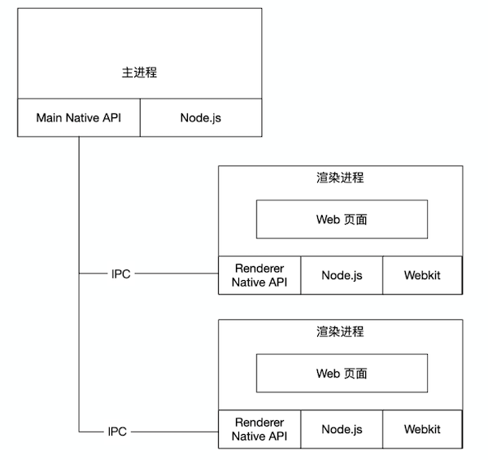

## 简介

Electron是一个能让你使用传统前端技术（Nodejs, Javascript, HTML, CSS）开发一个跨平台桌面应用的框架。这里所说的桌面应用指的是在Windows、OSX及Linux系统上运行的程序。

## 架构原理

### Chromium 架构


## Electron 架构




### 主进程和渲染进程

####  主进程

* 运行package.json的main脚本的进程称为主进程
* 每个应用只有一个主进程
* 管理原声GUI，典型的窗口(BrowserWindow、Tray、Dock、Menu)
* 创建渲染进程
* 控制应用生命周期

#### 渲染进程

* 展示Web页面的进程称为渲染进程
* 通过Node.js、Electron提供的API可以跟系统底层打交道
* 一个Electron应用可以有多个渲染进程

### 进程间通信

#### 通信的目的

* 通知事件
* 数据传输
* 共享数据

#### IPC模块通信

* Electront提供了IPC通信模块，主进程的ipcMain和渲染进程的ipcRenderer
* ipcMain、ipcRenderer都是EventEmitter对象

#### 渲染进程到主进程

* Callback写法:
  * `ipcRenderer.send(channel, ...args)`
  * `ipcMain.on(channel, handler)`
* Promise写法（7.0以后，处理请求+响应模式）
  * `ipcRenderer.invoke(channel, ...args)`
  * `ipcMain.handle('channel, handler')`

#### 主进程到渲染进程

* `ipcRenderer.on(channel, handler)`
* `win.webContents.send(channel)`

#### 渲染进程间通信

* 通知事件
  * 通过主进程转发 (Electron 5之前)
  * `ipcRenderer.sendTo(Electron5 之后)`
* 数据共享
  * `Web技术(localStorage、sessionStorage、indexedDB)`
  * 使用remote

#### 经验 & 技巧

* 少用remote模块
* 不要使用sync模式
* 在请求+响应的通信模式，需要设置超时限制


## 环境安装

```bash
npm init 
npm install electron --save-dev
# 安装时如果node install.js卡死，使用一下命令在安装
export ELECTRON_MIRROR=https://npm.taobao.org/mirrors/electron/
export ELECTRON_CUSTOM_DIR=8.0.0
或者使用代理
npm config set proxy http://127.0.0.1:1081
```


## 整合react

