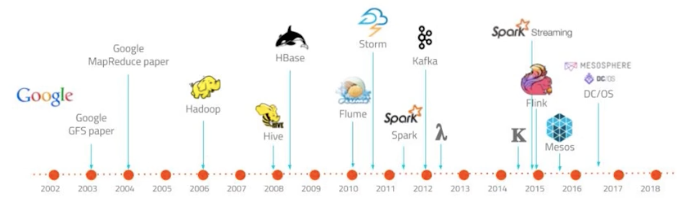
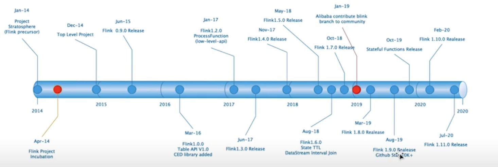
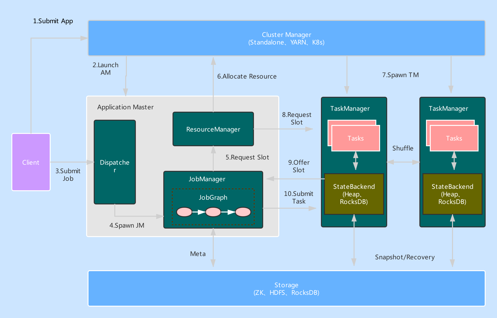

# 简介

## 大数据发展历史

## 大数据处理计算模式

### batch computing (批量计算)

* MapReduce
* Apache Spark
* Hive
* Flink
* Pig

### stream computing (流式计算)

* Storm
* Spark Streaming
* Apache Flink
* Samza

### interactive computing (交互计算)

* Presto
* Impala
* Druid
* Drill

### graph computing (图计算)

* Giraph (Facebook)
* Graphx (Spark)
* Gelly (flink)

### 流计算与批计算对比

|          | 流计算                       | 批计算             |
| -------- | ---------------------------- | ------------------ |
| 时效性   | 实时，低延迟                 | 非实时，高延迟     |
| 特征     | 动态，没有边界的数据         | 静态数据           |
| 场景     | 实时场景，实时推荐，业务监控 | 数据分析，离线报表 |
| 运行方式 | 任务持续进行                 | 一次性完成         |

## Flink发展历史与应用场景

## 核心概念

# 部署与应用

## 集群架构

### JobManager 

管理节点，每个集群至少一个，管理真个集群计算资源，Job管理与调度执行，以及Checkpoint协调

 

### TaskManager

每个集群有多个TM，负责计算资源提供。

### Client 

本地执行应用`mian()`方法解析额`JobGraph`对象，并最终将`JobGraph`提交到`JobManager`运行，同时监控`Job`执行状态

## 集群部署

### Session集群运行模式

#### 优点

* 资源充分共享，提升资源利用率
* Job在Flink Session集群中管理，运维简单

#### 缺点

* 资源隔离相对较差
* 非Native类型部署，TM不易拓展，Slot计算资源伸缩性较差

### Per-Job运行模式

### Application Mode类型集群

| Cluster Manager | Sesssion | Per-Job | Application | Native | 生产 | 高可用 | 国内接受度 |
| --------------- | -------- | ------- | ----------- | ------ | ---- | ------ | ---------- |
| Local           | 支持     | 不支持  | 不支持      | 不支持 | 否   | 不支持 | 低         |
| Standalone      | 支持     | 不支持  | 不支持      | 不支持 | 是   | 支持   | 低         |
| Yarn            | 支持     | 支持    | 支持        | 支持   | 是   | 支持   | 高         |
| Mesos           | 支持     | 支持    | 不支持      | 支持   | 是   | 支持   | 中         |
| Kubernetes      | 支持     | 支持    | 支持        | 支持   | 是   | 支持   | 高         |
| Docker          | 支持     | 支持    | 不支持      | 不支持 | 是   | 不支持 | 低         |

## Standalone部署

## Flink On Yarn部署

## Flink on Kubernetes部署

# DataStream API实践原理

