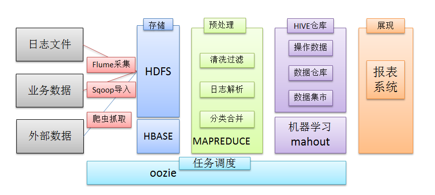
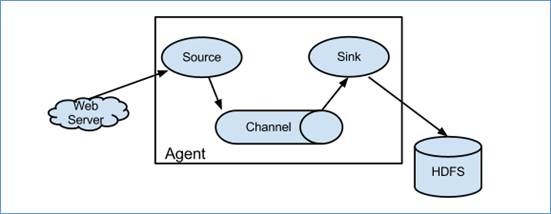
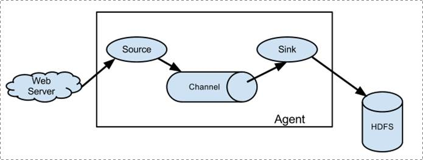
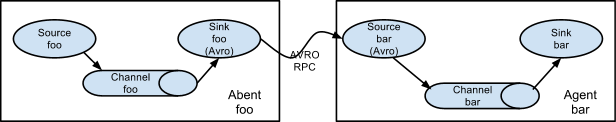
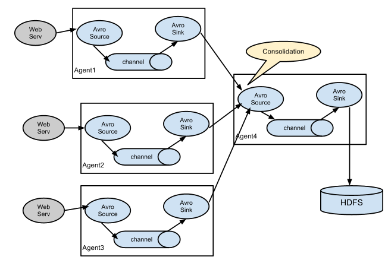
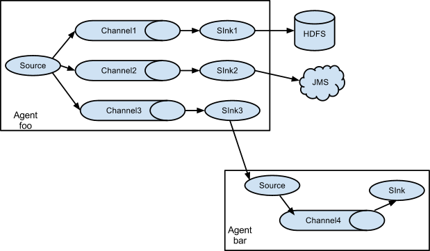

# 概述

- 在一个完整的离线大数据处理系统中，除了hdfs+mapreduce+hive组成分析系统的核心之外，还需要数据采集、结果数据导出、任务调度等不可或缺的辅助系统，而这些辅助工具在hadoop生态体系中都有便捷的开源框架，如图所示：

 

- Flume是一个分布式、可靠、和高可用的海量日志采集、聚合和传输的系统。
- Flume可以采集文件，socket数据包、文件、文件夹、kafka等各种形式源数据，又可以将采集到的数据(下沉sink)输出到HDFS、hbase、hive、kafka等众多外部存储系统中
- 一般的采集需求，通过对flume的简单配置即可实现
- Flume针对特殊场景也具备良好的自定义扩展能力，因此，flume可以适用于大部分的日常数据采集场景

## 运行机制

- Flume分布式系统中最核心的角色是**agent**，flume采集系统就是由一个个agent所连接起来形成的

- **每一个agent相当于一个数据传递员，内部有三个组件：**
  - Source：采集组件，用于跟数据源对接，以获取数据
  - Sink：下沉组件，用于往下一级agent传递数据或者往最终存储系统传递数据
  - Channel：传输通道组件，用于从source将数据传递到sink

 

## Flume采集系统结构图

### 简单结构

- 单个agent采集数据

### 复杂结构

- 两个agent之间串联

- 多级agent之间串联

- 多级channel

 

# Install

Flume的安装非常简单，只需要解压即可

