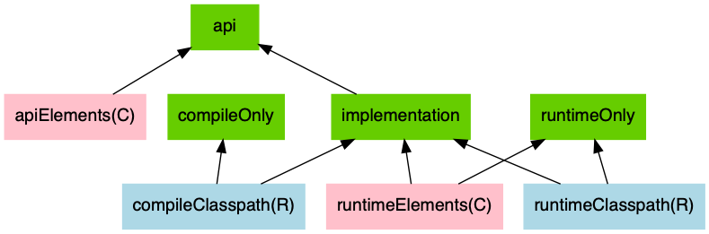
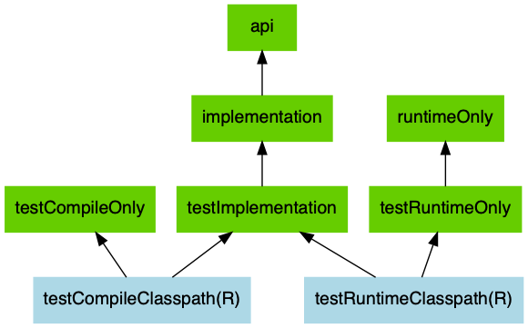

## 简介

是一个开源构建自动化系统，它基于Apache Ant和Apache Maven的概念，并引入了基于Groovy的特定于域的语言（DSL），而不是Apache Maven用于声明项目配置的XML形式。


## [The Java Library Plugin](https://docs.gradle.org/current/userguide/java_library_plugin.html#sec:java_library_usage)

The following graph describes the main configurations setup when the Java Library plugin is in use.



- The configurations in *green* are the ones a user should use to declare dependencies
- The configurations in *pink* are the ones used when a component compiles, or runs against the library
- The configurations in *blue* are internal to the component, for its own use

And the next graph describes the test configurations setup:



> The *compile*, *testCompile*, *runtime* and *testRuntime* configurations inherited from the Java plugin are still available but are deprecated. You should avoid using them, as they are only kept for backwards compatibility.


| Configuration name   | Role                                     | Consumable? | Resolvable? | Description                                                  |
| :------------------- | :--------------------------------------- | :---------- | :---------- | :----------------------------------------------------------- |
| api                  | Declaring API dependencies               | no          | no          | This is where you should declare dependencies which are transitively exported to consumers, for compile. |
| implementation       | Declaring implementation dependencies    | no          | no          | This is where you should declare dependencies which are purely internal and not meant to be exposed to consumers. |
| `compileOnly`        | Declaring compile only dependencies      | yes         | yes         | This is where you should declare dependencies which are only required at compile time, but should not leak into the runtime. This typically includes dependencies which are shaded when found at runtime. |
| `runtimeOnly`        | Declaring runtime dependencies           | no          | no          | This is where you should declare dependencies which are only required at runtime, and not at compile time. |
| `testImplementation` | Test dependencies                        | no          | no          | This is where you should declare dependencies which are used to compile tests. |
| `testCompileOnly`    | Declaring test compile only dependencies | yes         | yes         | This is where you should declare dependencies which are only required at test compile time, but should not leak into the runtime. This typically includes dependencies which are shaded when found at runtime. |
| `testRuntimeOnly`    | Declaring test runtime dependencies      | no          | no          | This is where you should declare dependencies which are only required at test runtime, and not at test compile time. |

### implementation

 编译项目的生产源所需的依赖项，这些依赖项不是项目公开的API的一部分。 例如，该项目使用Hibernate进行内部持久层实现。

### api

编译项目的生产源所需的依赖项，这是项目公开的API的一部分。 例如，项目使用Guava并在方法签名中公开具有Guava类的公共接口。

### testImplementation

编译和运行项目的测试源所需的依赖项。例如，项目决定使用测试框架JUnit编写测试代码。


## Managing Dependencies

### Declaring Dependencies

#### [Declaring a dependency without version](https://docs.gradle.org/current/userguide/declaring_dependencies.html#declaring_a_dependency_without_version)

```groovy
build.gradle
dependencies {
    implementation 'org.springframework:spring-web'
}

dependencies {
    constraints {
        implementation 'org.springframework:spring-web:5.0.2.RELEASE'
    }
}
```

#### [Declaring a dynamic version](https://docs.gradle.org/current/userguide/declaring_dependencies.html#sub:declaring_dependency_with_dynamic_version)

快照版本包含后缀-SNAPSHOT

```groovy
dependencies {
    implementation 'org.springframework:spring-web:5.0.3.BUILD-SNAPSHOT'
}

configurations.all {
  	// 默认情况下，Gradle缓存24小时更改依赖项的版本。 调整10分钟
    resolutionStrategy.cacheDynamicVersionsFor 10, 'minutes'
   // 不要缓存更改的模块
    cacheChangingModulesFor 0, 'seconds'
}
```

