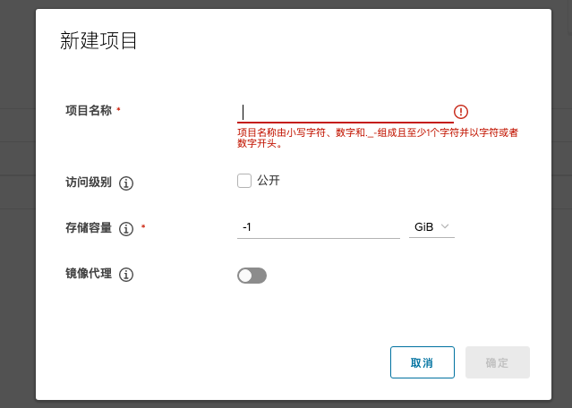

# Install

## 准备安装文件

```bash
# 下载安装包
wget https://github.com/goharbor/harbor/releases/download/v2.4.1/harbor-online-installer-v2.4.1.tgz
# 解压
tar zxvf harbor-online-installer-v2.4.1.tgz
```

## 配置证书
```bash
# Generate a CA certificate private key
openssl genrsa -out ca.key 4096

# Generate the CA certificate
openssl req -x509 -new -nodes -sha512 -days 3650 \
 -subj "/C=CN/ST=Jiangsu/L=Suzhou/O=Longnows/OU=Company/CN=192.168.0.101" \
 -key ca.key \
 -out ca.crt

# Generate a private key
openssl genrsa -out 192.168.0.1010.key 4096
# Generate a certificate signing request (CSR)
openssl req -sha512 -new \
    -subj "/C=CN/ST=Jiangsu/L=Suzhou/O=Longnows/OU=Company/CN=192.168.0.101" \
    -key 192.168.0.101.key \
    -out 192.168.0.101.csr

# Generate an x509 v3 extension file
cat > v3.ext <<-EOF
authorityKeyIdentifier=keyid,issuer
basicConstraints=CA:FALSE
keyUsage = digitalSignature, nonRepudiation, keyEncipherment, dataEncipherment
extendedKeyUsage = serverAuth
subjectAltName = @alt_names

[alt_names]
DNS.1=harbor.longnows.cn
IP.1=192.168.0.101
EOF

# Use the `v3.ext` file to generate a certificate for your Harbor host
openssl x509 -req -sha512 -days 3650 \
    -extfile v3.ext \
    -CA ca.crt -CAkey ca.key -CAcreateserial \
    -in 192.168.0.101.csr \
    -out 192.168.0.101.crt
    
# Copy the server certificate and key into the certficates folder on your Harbor host.
cp 192.168.0.101.crt ../cert/
cp 192.168.0.101.key ../cert/

# 为Docker准备证书
# Docker守护进程将.crt文件解释为CA证书，将.cert文件解释为客户端证书
openssl x509 -inform PEM -in 192.168.0.101.crt -out 192.168.0.101.cert

# Copy the server certificate, key and CA files into the Docker certificates folder
cp 192.168.0.101.cert /etc/docker/certs.d/192.168.0.101/
cp 192.168.0.101.key /etc/docker/certs.d/192.168.0.101/
cp ca.crt /etc/docker/certs.d/192.168.0.101/

# Restart Docker Engine
systemctl restart docker
```

## 配置 harbor.yml

设置 harbor.yml 文件，配置 harbor 的各项参数，如下：

```ymal

# The IP address or hostname to access admin UI and registry service.
# DO NOT use localhost or 127.0.0.1, because Harbor needs to be accessed by external clients.
hostname: 192.168.0.101

# http related config
http:
  # port for http, default is 80. If https enabled, this port will redirect to https port
  port: 80

# 如果没有证书，整体注释下面的部分
# https related config
https:
  # https port for harbor, default is 443
  port: 443
  # The path of cert and key files for nginx
  certificate: /data/harbor/cert/192.168.0.101.crt
  private_key: /data/harbor/cert/192.168.0.101.key

# Uncomment external_url if you want to enable external proxy
# And when it enabled the hostname will no longer used
# external_url: https://reg.mydomain.com:8433

# The initial password of Harbor admin
# It only works in first time to install harbor
# Remember Change the admin password from UI after launching Harbor.
# harbor 默认 admin 密码
harbor_admin_password: Harbor12345

```

## 安装 harbor

```bash
./install.sh
```

`http://192.168.0.101/` 登录，管理员账号 admin 密码 Harbor12345


# 设置

## 新建项目



# 镜像发布

配置 docker 忽视不安全的 registry  linux `/etc/docker/daemon.json` windows 上为 `C:\ProgramData\Docker\config\daemon.json`

```json
{
	"registry-mirrors":["https://registry.cn-hangzhou.aliyuncs.com"],
	"insecure-registries":["192.168.2.138:80"]
}
```

启用不安全的registry后，Docker将执行以下步骤

* 首先，尝试使用 https 访问 registry
    * 如果HTTPS协议可用，但证书无效，忽略证书错误。
    * 如果HTTPS不可用，请退回到HTTP。

重新启动 docker 使配置生效

## 测试发布镜像到 harbor

```bash
# 登录harbor
docker login 192.168.0.101
# 为 image 设置 tag
docker tag busybox 192.168.0.101/library/busybox:1.0
# push 镜像到harbor
docker push 192.168.0.101/library/busybox:1.0
```