# 语言特性

## 类型

### 基本类型（primitive types）

#### 整数型

- `byte` - 8 位。
- `short` - 16 位。
- `int` - 32 位。
- `long` - 64 位，赋值时一般在数字后加上 `l` 或 `L`。

#### 浮点型

- `float` - 32 位，直接赋值时必须在数字后加上 `f` 或 `F`。
- `double` - 64 位，赋值时一般在数字后加 `d` 或 `D` 。

#### 字符型

- `char` - 16 位，存储 Unicode 码，用单引号赋值。

#### 布尔型

- `boolean` - 只有 true 和 false 两个取值。


### 引用类型 （reference types）

1. 类
2. 接口
3. 数组类
4. 泛型参数

# 类加载

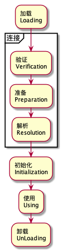

1. 加载 查找和导入Class文件；
2. 连接 把类的二进制数据合并到JRE中；
   1. 校验 检查载入Class文件数据的正确性；
   2. 准备 给类的静态变量分配存储空间；
   3. 解析 将符号引用转成直接引用；
3. 初始化 对类的静态变量，静态代码块执行初始化操作

# NIO

### 原理

#### 正常copy


#### Zero copy


#### DMZ copy

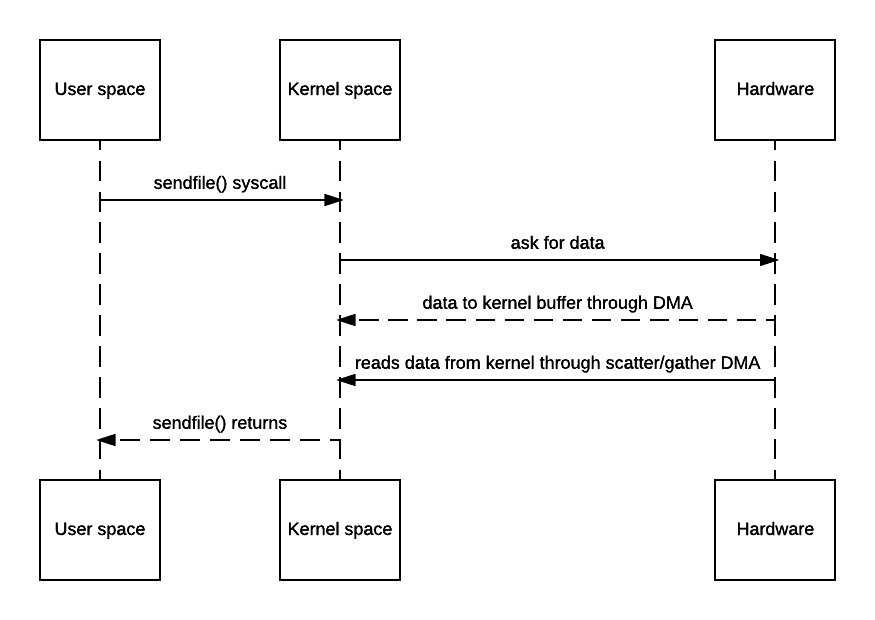

#### mmap


### Channel

Java NIO Channels 和 streams 的区别

* Channels可以进行读写操作。Streams通常是单向的(读或写)。
* Channels可以异步读写
* Channels总是读写缓冲区

### Buffer


# 并发编程

## 进程和线程

### 进程

进程：进程指正在运行的程序，进程拥有一个完整的、私有的基本运行资源集合。通常，每个进程都有自己的内存空间。

进程往往被看作是程序或应用的代名词，然而，用户看到的一个单独的应用程序实际上可能是一组相互协作的进程集合。

为了便于进程之间的通信，大多数操作系统都支持进程间通信（IPC），如pipes 和sockets。IPC不仅支持同一系统上的通信，也支持不同的系统。IPC通信方式包括管道（包括无名管道和命名管道）、消息队列、信号量、共享存储、Socket、Streams等方式，其中 Socket和Streams支持不同主机上的两个进程IPC。

### 线程

线程有时也被称为轻量级的进程。进程和线程都提供了一个执行环境，但创建一个新的线程比创建一个新的进程需要的资源要少。

线程是在进程中存在的 — 每个进程最少有一个线程。线程共享进程的资源，包括内存和打开的文件。这样提高了效率，但潜在的问题就是线程间的通信。

多线程的执行是Java平台的一个基本特征。每个应用都至少有一个线程 – 或几个，如果算上“系统”线程的话，比如内存管理和信号处理等。但是从程序员的角度来看，启动的只有一个线程，叫主线程。

简而言之：一个程序运行后至少有一个进程，一个进程中可以包含多个线程。

#### 状态

Java线程可能的状态：


线程的状态变迁


#### 实践

##### 创建

1. 继承`Thread`

   ```java
   public class HelloThread extends Thread {
       public void run() {
           System.out.println("Hello from a thread!");
       }
           (new HelloThread()).start();
       }
   }
   ```

2. 实现`Runnable`

   ```java
   public class HelloRunnable implements Runnable {
       public void run() {
           System.out.println("Hello from a thread!");
       }
   
       public static void main(String args[]) {
           (new Thread(new HelloRunnable())).start();
       }
   }
   ```

##### 启动

调用start方法

##### 停止

线程自带的stop方法，一方面已经过时，另一方面，不会对停止的线程做状态保存，使得线程中涉及的对象处于未知状态，如果这些状态，其他线程也会使用，将会使得其他线程出现无法预料的异常，所以，停止程序的功能，需要自己实现。

```java
public class ThreadTest {
    public static void main(String[] args) throws InterruptedException {
        StopThread thread = new StopThread();
        thread.start();
        Thread.sleep(1000L);
        thread.stop();
        while (thread.isAlive()) { }
        thread.print();
    }

    private static class StopThread extends Thread {

        private int x = 0; private int y = 0;

        @Override
        public void run() {
            synchronized (this) {
                ++x;
                try {
                    Thread.sleep(3000L);
                } catch (InterruptedException e) {
                    e.printStackTrace();
                }
                ++y;
            }
        }

        public void print() {
            System.out.println("x=" + x + " y=" + y);
        }
    }
}
```

上述代码中，run方法里是一个同步的原子操作，x和y必须要共同增加，然而这里如果调用thread.stop()方法强制中断线程，输出如下：

```java
x=1 y=0
```

没有异常，也破坏了我们的预期。如果这种问题出现在我们的程序中，会引发难以预期的异常。因此这种不安全的方式很早就被废弃了。

```java
public class MyRunnable implements Runnable {

    private boolean doStop = false;

    public synchronized void doStop() {
        this.doStop = true;
    }

    private synchronized boolean keepRunning() {
        return this.doStop == false;
    }

    @Override
    public void run() {
        while(keepRunning()) {
            // keep doing what this thread should do.
            System.out.println("Running");

            try {
                Thread.sleep(3L * 1000L);
            } catch (InterruptedException e) {
                e.printStackTrace();
            }

        }
    }
  
  	public static void main(String[] args) {
        MyRunnable myRunnable = new MyRunnable();

        Thread thread = new Thread(myRunnable);

        thread.start();

        try {
            Thread.sleep(10L * 1000L);
        } catch (InterruptedException e) {
            e.printStackTrace();
        }

        myRunnable.doStop();
    }
}
```

##### 暂停
Java中线程的暂停是调用`java.lang.Thread`类的`sleep`方法。该方法会使当前正在执行的线程暂停指定的一段时间，如果线程持有锁，`sleep`方法结束前并不会释放该锁。

##### 中断

java.lang.Thread类有一个`interrupt`方法，该方法直接对线程调用。当被interrupt的线程正在sleep或wait时，会抛出`InterruptedException`异常。
事实上，`interrupt`方法只是改变目标线程的中断状态（interrupt status），而那些会抛出`InterruptedException`异常的方法，如wait、sleep、join等，都是在方法内部不断地检查中断状态的值。

- **interrupt方法**

Thread实例方法：必须由其它线程获取被调用线程的实例后，进行调用。实际上，只是改变了被调用线程的内部中断状态；

- **Thread.interrupted方法**

Thread类方法：必须在当前执行线程内调用，该方法返回当前线程的内部中断状态，然后清除中断状态（置为false） ；

- **isInterrupted方法**

Thread实例方法：用来检查指定线程的中断状态。当线程为中断状态时，会返回true；否则返回false。

~~~java
public class ThreadTest {
    public static void main(String[] args) throws InterruptedException {
        StopThread thread = new StopThread();
        thread.start();
        Thread.sleep(1000L);
        thread.interrupt();
        while (thread.isAlive()) { }
        thread.print();
    }

    private static class StopThread extends Thread {

        private int x = 0; private int y = 0;

        @Override
        public void run() {
            synchronized (this) {
                ++x;
                try {
                    Thread.sleep(3000L);
                } catch (InterruptedException e) {
                    e.printStackTrace();
                }
                ++y;
            }
        }

        public void print() {
            System.out.println("x=" + x + " y=" + y);
        }
    }
}
~~~

输出结果如下：

```java
x=1 y=1
java.lang.InterruptedException: sleep interrupted
    at java.lang.Thread.sleep(Native Method)
    at ThreadTest$StopThread.run(ThreadTest.java:28)
```

x=1,y=1 这个结果是符合我们的预期，同时还抛出了个异常。

底层源码实现：

```java
   // 核心 interrupt 方法
   public void interrupt() {
        if (this != Thread.currentThread()) // 非本线程，需要检查权限
            checkAccess();

        synchronized (blockerLock) {
            Interruptible b = blocker;
            if (b != null) {
                interrupt0();           // 仅仅设置interrupt标志位
                b.interrupt(this);    // 调用如 I/O 操作定义的中断方法
                return;
            }
        }
        interrupt0();
    }
    // 静态方法，这个方法有点坑，调用该方法调用后会清除中断状态。
    public static boolean interrupted() {
        return currentThread().isInterrupted(true);
    }
    // 这个方法不会清除中断状态
    public boolean isInterrupted() {
        return isInterrupted(false);
    }
   // 上面两个方法会调用这个本地方法，参数代表是否清除中断状态
   private native boolean isInterrupted(boolean ClearInterrupted);
```

**interrupt() ：**

- interrupt 中断操作时，非自身打断需要先检测是否有中断权限，这由jvm的安全机制配置；
- 如果线程处于sleep, wait, join 等状态，那么线程将立即退出被阻塞状态，并抛出一个InterruptedException异常；
- 如果线程处于I/O阻塞状态，将会抛出ClosedByInterruptException（IOException的子类）异常；
- 如果线程在Selector上被阻塞，select方法将立即返回；
- 如果非以上情况，将直接标记 interrupt 状态；

注意：interrupt 操作不会打断所有阻塞，只有上述阻塞情况才在jvm的打断范围内，如处于锁阻塞的线程，不会受 interrupt 中断；

**阻塞情况下中断，抛出异常后线程恢复非中断状态，即 interrupted = false**

```java
public class ThreadTest {
    
    public static void main(String[] args) throws InterruptedException {
        Thread t = new Thread(new Task("mytask"));
        t.start();
        t.interrupt();
    }

    static class Task implements Runnable{
        String name;
        
        public Task(String name) {
            this.name = name;
        }
        
        @Override
        public void run() {
            try {
                Thread.sleep(1000);
            } catch (InterruptedException e) {
                System.out.println("thread has been interrupt!");
            }
            System.out.println("isInterrupted: " + Thread.currentThread().isInterrupted());
            System.out.println("task " + name + " is over");
        }
    }
}
```

输出：

```java
thread has been interrupt!
isInterrupted: false
task 1 is over
```

**调用Thread.interrupted() 方法后线程恢复非中断状态**

```java
public class ThreadTest {
    
    public static void main(String[] args) throws InterruptedException {
        Thread t = new Thread(new Task("mytask"));
        t.start();
        t.interrupt();
    }

    static class Task implements Runnable{
        String name;
        
        public Task(String name) {
            this.name = name;
        }
        
        @Override
        public void run() {
            System.out.println("first :" + Thread.interrupted());
            System.out.println("second:" + Thread.interrupted());
            System.out.println("task " + name + " is over");
        }
    }
}
```

输出结果：

```java
first :true
second:false
task 1 is o
```

## 多线程

线程是进程中的一个执行单元，负责当前进程中程序的执行，一个进程中至少有一个线程。一个进程中是可以有多个线程的，这个应用程序也可以称之为多线程程序。

### 并发和并行

- 并行是指两个或者多个事件在同一时刻发生；而并发是指两个或多个事件在同一时间间隔发生。
- 并行是在不同实体上的多个事件，并发是在同一实体上的多个事件**。**
- 在一台处理器上“同时”处理多个任务，在多台处理器上同时处理多个任务。如hadoop分布式集群

### 多线程好处

**提高cpu的利用率**

单线程：

~~~
  5 seconds reading file A
  2 seconds processing file A
  5 seconds reading file B
  2 seconds processing file B
-----------------------
 14 seconds total
~~~

多线程

~~~
  5 seconds reading file A
  5 seconds reading file B + 2 seconds processing file A
  2 seconds processing file B
-----------------------
 12 seconds total
~~~

一般来说，在等待磁盘IO，网络IO或者等待用户输入时，CPU可以同时去处理其他任务。

**更高效的响应**

多线程技术使程序的响应速度更快 ,因为用户界面可以在进行其它工作的同时一直处于活动状态，不会造成无法响应的现象。

**公平使用CPU资源**

当前没有进行处理的任务，可以将处理器时间让给其它任务;占用大量处理时间的任务，也可以定期将处理器时间让给其它任务;通过对CPU时间的划分，使得CPU时间片可以在多个线程之间切换，避免需要长时间处理的线程独占CPU，导致其它线程长时间等待。

### 多线程的代价

**更复杂的设计**

共享数据的读取，数据的安全性，线程之间的交互，线程的同步等；

**上下文环境切换**

线程切换，cpu需要保存本地数据、程序指针等内容；

**更多的资源消耗**

每个线程都需要内存维护自己的本地栈信息，操作系统也需要资源对线程进行管理维护；


## 并发编程概念

### 临界资源

临界资源是一次仅允许一个进程使用的共享资源。*各进程采取互斥的方式，实现共享的资源称作临界资源。*属于临界资源的硬件有，打印机，磁带机等；软件有消息队列，变量，数组，缓冲区等。诸进程间采取互斥方式，实现对这种资源的共享。

### 线程安全

#### 基本概念

**竞态条件**

当两个线程竞争同一资源时，如果对资源的访问顺序敏感，就称存在竞态条件。

导致竞态条件发生的代码区称作临界区。

在临界区中使用适当的同步就可以避免竞态条件，如使用synchronized或者加锁机制。

**线程安全**

允许被多个线程同时执行的代码称作线程安全的代码。线程安全的代码不包含竞态条件。

#### 对象的安全

**局部基本类型变量**

局部变量存储在线程自己的栈中。也就是说，局部变量永远也不会被多个线程共享。所以，基础类型的局部变量是线程安全的。

**局部的对象引用**

对象的局部引用和基础类型的局部变量不太一样，尽管引用本身没有被共享，但引用所指的对象并没有存储在线程的栈内。所有的对象都存在共享堆中。
如果在某个方法中创建的对象不会逃逸出（即该对象不会被其它方法获得，也不会被非局部变量引用到）该方法，那么它就是线程安全的。
实际上，哪怕将这个对象作为参数传给其它方法，只要别的线程获取不到这个对象，那它仍是线程安全的。

**对象成员(成员变量)**

对象成员存储在堆上。如果两个线程同时更新同一个对象的同一个成员，那这个代码就不是线程安全的。

##### 不可变性

通过创建不可变的共享对象来保证对象在线程间共享时不会被修改，从而实现线程安全。

###  Java内存模型

Java内存模型即Java Memory Model，简称JMM。JMM定义了Java 虚拟机(JVM)在计算机内存(RAM)中的工作方式。JVM是整个计算机虚拟模型，所以JMM是隶属于JVM的。

**线程之间的通信**

线程的通信是指线程之间以何种机制来交换信息。在命令式编程中，线程之间的通信机制有两种共享内存和消息传递。

在共享内存的并发模型里，线程之间共享程序的公共状态，线程之间通过写-读内存中的公共状态来隐式进行通信，典型的共享内存通信方式就是通过共享对象进行通信。

在消息传递的并发模型里，线程之间没有公共状态，线程之间必须通过明确的发送消息来显式进行通信，在java中典型的消息传递方式就是wait()和notify()。

**线程之间的同步**

同步是指程序用于控制不同线程之间操作发生相对顺序的机制。

在共享内存并发模型里，同步是显式进行的。程序员必须显式指定某个方法或某段代码需要在线程之间互斥执行。

在消息传递的并发模型里，由于消息的发送必须在消息的接收之前，因此同步是隐式进行的。

Java的并发采用的是共享内存模型

Java线程之间的通信总是隐式进行，整个通信过程对程序员完全透明。如果编写多线程程序的Java程序员不理解隐式进行的线程之间通信的工作机制，很可能会遇到各种奇怪的内存可见性问题。

**Java内存模型结构**

Java内存模型(简称JMM)，JMM决定一个线程对共享变量的写入何时对另一个线程可见。从抽象的角度来看，JMM定义了线程和主内存之间的抽象关系：线程之间的共享变量存储在主内存（main memory）中，每个线程都有一个私有的本地内存（local memory），本地内存中存储了该线程以读/写共享变量的副本。本地内存是JMM的一个抽象概念，并不真实存在。它涵盖了缓存，写缓冲区，寄存器以及其他的硬件和编译器优化。


从上图来看，线程A与线程B之间如要通信的话，必须要经历下面2个步骤：

1. 首先，线程A把本地内存A中更新过的共享变量刷新到主内存中去。
2. 然后，线程B到主内存中去读取线程A之前已更新过的共享变量。

### CAS

乐观锁：不加锁，假设没有冲突去完成某项操作，如果因为冲突失败就重试，直到成功为止。其实现方式有一种比较典型的就是Compare and Swap(`CAS`)。

CAS机制当中使用了3个基本操作数：内存地址V，旧的预期值A，要修改的新值B。

更新一个变量的时候，只有当变量的预期值A和内存地址V当中的实际值相同时，才会将内存地址V对应的值修改为B。

这样说或许有些抽象，我们来看一个例子：

1.在内存地址V当中，存储着值为10的变量。


2.此时线程1想要把变量的值增加1。对线程1来说，旧的预期值A=10，要修改的新值B=11。

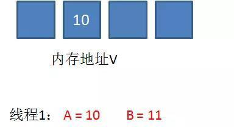


3.在线程1要提交更新之前，另一个线程2抢先一步，把内存地址V中的变量值率先更新成了11。

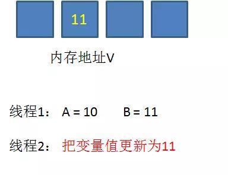

4.线程1开始提交更新，首先进行A和地址V的实际值比较（Compare），发现A不等于V的实际值，提交失败。

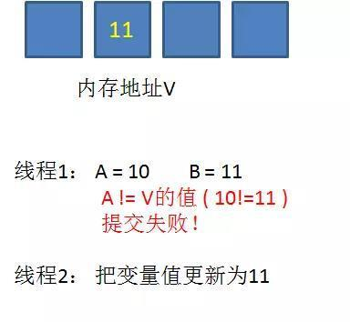

5.线程1重新获取内存地址V的当前值，并重新计算想要修改的新值。此时对线程1来说，A=11，B=12。这个重新尝试的过程被称为自旋。

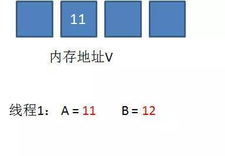

6.这一次比较幸运，没有其他线程改变地址V的值。线程1进行Compare，发现A和地址V的实际值是相等的。

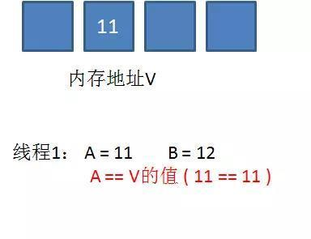

7.线程1进行SWAP，把地址V的值替换为B，也就是12。

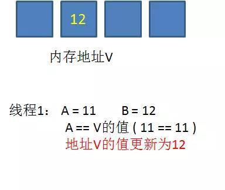

从思想上来说，Synchronized属于悲观锁，悲观地认为程序中的并发情况严重，所以严防死守。CAS属于乐观锁，乐观地认为程序中的并发情况不那么严重，所以让线程不断去尝试更新。

CAS的缺点：

1.CPU开销较大
在并发量比较高的情况下，如果许多线程反复尝试更新某一个变量，却又一直更新不成功，循环往复，会给CPU带来很大的压力。

2.不能保证代码块的原子性
CAS机制所保证的只是一个变量的原子性操作，而不能保证整个代码块的原子性。比如需要保证3个变量共同进行原子性的更新，就不得不使用Synchronized了。


### Synchronized 

Java中的同步块用synchronized标记。同步块在Java中是同步在某个对象上。所有同步在一个对象上的同步块在同时只能被一个线程进入并执行操作。所有其他等待进入该同步块的线程将被阻塞，直到执行该同步块中的线程退出。

有四种不同的同步块：

1. 实例方法
2. 静态方法
3. 实例方法中的同步块
4. 静态方法中的同步块

上述同步块都同步在不同对象上。实际需要那种同步块视具体情况而定。

**实例方法同步**

下面是一个同步的实例方法：

```java
 public synchronized void add(int value){
this.count += value;
 }
```

注意在方法声明中同步（synchronized ）关键字。

Java实例方法同步是同步在拥有该方法的对象上。这样，每个实例其方法同步都同步在不同的对象上，即该方法所属的实例。只有一个线程能够在实例方法同步块中运行。如果有多个实例存在，那么一个线程一次可以在一个实例同步块中执行操作。

**静态方法同步**

静态方法同步和实例方法同步方法一样，也使用synchronized 关键字。Java静态方法同步如下示例：

```java
public static synchronized void add(int value){
 count += value;
 }
```

同样，这里synchronized 关键字告诉Java这个方法是同步的。

静态方法的同步是指同步在该方法所在的类对象上。因为在Java虚拟机中一个类只能对应一个类对象，所以同时只允许一个线程执行同一个类中的静态同步方法。

对于不同类中的静态同步方法，一个线程可以执行每个类中的静态同步方法而无需等待。不管类中的那个静态同步方法被调用，一个类只能由一个线程同时执行。

**实例方法中的同步块**

有时你不需要同步整个方法，而是同步方法中的一部分。Java可以对方法的一部分进行同步。

在非同步的Java方法中的同步块的例子如下所示：

```java
public void add(int value){

    synchronized(this){
       this.count += value;
    }
  }
```

示例使用Java同步块构造器来标记一块代码是同步的。该代码在执行时和同步方法一样。

注意Java同步块构造器用括号将对象括起来。在上例中，使用了“this”，即为调用add方法的实例本身。在同步构造器中用括号括起来的对象叫做监视器对象。上述代码使用监视器对象同步，同步实例方法使用调用方法本身的实例作为监视器对象。

一次只有一个线程能够在同步于同一个监视器对象的Java方法内执行。

下面两个例子都同步他们所调用的实例对象上，因此他们在同步的执行效果上是等效的。

```java
 public class MyClass {

    public synchronized void log1(String msg1, String msg2){
       log.writeln(msg1);
       log.writeln(msg2);
    }

    public void log2(String msg1, String msg2){
       synchronized(this){
          log.writeln(msg1);
          log.writeln(msg2);
       }
    }
  }
```

在上例中，每次只有一个线程能够在两个同步块中任意一个方法内执行。

如果第二个同步块不是同步在this实例对象上，那么两个方法可以被线程同时执行。

**静态方法中的同步块**

和上面类似，下面是两个静态方法同步的例子。这些方法同步在该方法所属的类对象上。

```java
public class MyClass {
    public static synchronized void log1(String msg1, String msg2){
       log.writeln(msg1);
       log.writeln(msg2);
    }

    public static void log2(String msg1, String msg2){
       synchronized(MyClass.class){
          log.writeln(msg1);
          log.writeln(msg2);
       }
    }
  }
```

这两个方法不允许同时被线程访问。

如果第二个同步块不是同步在MyClass.class这个对象上。那么这两个方法可以同时被线程访问。

**Synchronized锁的存储**

synchronized用的锁存储在Java对象头，如果对象是数组类型，则虚拟机用3个字宽存储对象头，如果对象是非数组类型，则用2字宽存储对象头，32位虚拟机，1字宽等于4字节，即32位.

Java对象头的长度

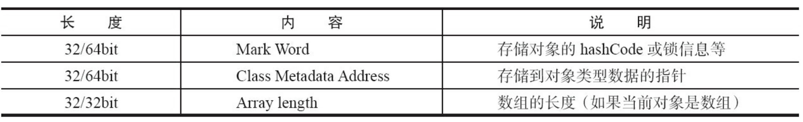

Mark Word的存储结构


Mark Word可能的存储结果：

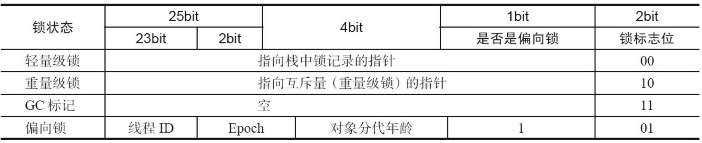

**偏向锁**

偏向锁的获取流程：

 （1）查看Mark Word中偏向锁的标识以及锁标志位，若是否偏向锁为1且锁标志位为01，则该锁为可偏向状态。

 （2）若为可偏向状态，则测试Mark Word中的线程ID是否与当前线程相同，若相同，表示线程已经获得了锁，如果不同，则进入（3）

 （3）测试Mark Word的偏向锁的标识是否设置为1，如果没有设置，则使用CAS操作竞争锁，如何设置了，则尝试使用CAS尝试将Mark Word中线程ID设置为当前线程ID，如果尝试失败，则执行（4）

 （4）当前线程通过CAS竞争锁失败的情况下，说明有竞争。当到达全局安全点（在这个时间点，没有正在执行的代码）时之前获得偏向锁的线程被挂起，偏向锁升级为轻量级锁，然后被阻塞在安全点的线程继续往下执行同步代码。

**轻量级锁**

轻量级锁不是用来替代传统的重量级锁的，而是在没有多线程竞争的情况下，使用轻量级锁能够减少性能消耗，但是当多个线程同时竞争锁时，轻量级锁会膨胀为重量级锁。

轻量级锁的加锁过程：

（1）当线程执行代码进入同步块时，若Mark Word为无锁状态，虚拟机先在当前线程的栈帧中建立一个名为Lock Record的空间，用于存储当前对象的Mark Word的拷贝，官方称之为“Dispalced Mark Word”，此时状态如下图：

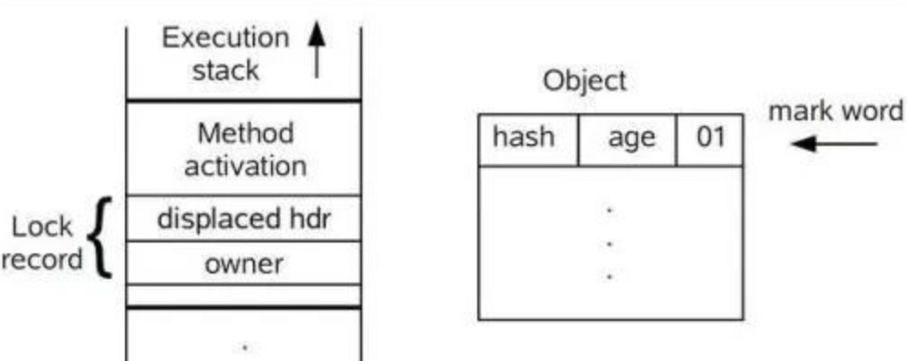

（2）复制对象头中的Mark Word到锁记录中。

（3）复制成功后，虚拟机将用CAS操作将对象的Mark Word更新为执行Lock  Record的指针，并将Lock Record里的owner指针指向对象的Mark Word。如果更新成功，则执行4，否则执行5。；

（4）如果更新成功，则这个线程拥有了这个锁，并将锁标志设为00，表示处于轻量级锁状态，此时状态图：

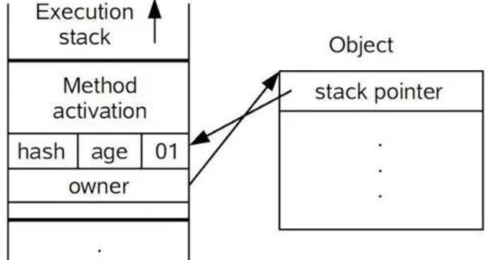

（5）如果更新失败，则说明有其他线程竞争锁，当前线程便通过自旋来获取锁。轻量级锁就会膨胀为重量级锁，Mark Word中存储重量级锁（互斥锁）的指针，后面等待锁的线程也要进入阻塞状态。

**重量级锁**

即当有其他线程占用锁时，当前线程会进入阻塞状态。


64位JVM的存储结构

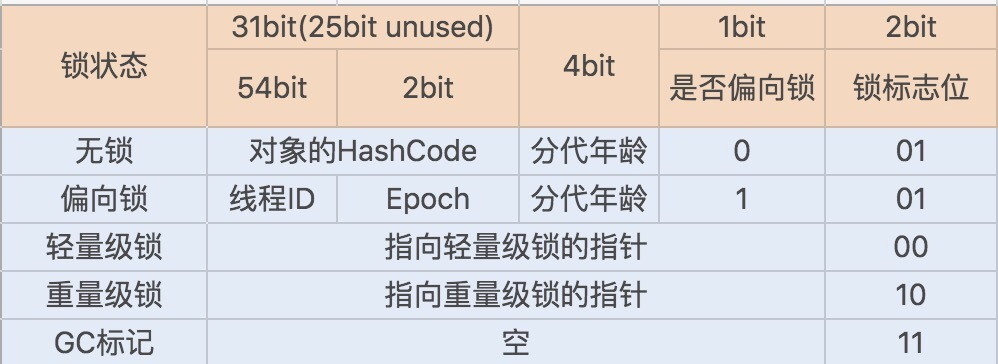

<u>Synchronized同步锁就是从偏向锁开始的，随着竞争越来越激烈，偏向锁升级到轻量级锁，最终升级到重量级锁</u>

### Volatile

Volatile是轻量级的synchronized,在多处理器环境下，可以保证共享变量的可见性。它不会引起线程上下文的切换和调度，正确的使用Volatile,比synchronized的使用和执行成本更低。

**可见性：**

可见性，是指线程之间的可见性，一个线程修改的状态对另一个线程是可见的。也就是一个线程修改一个共享变量时，另一个线程马上就能看到。比如：用volatile修饰的变量，就会具有可见性。

volatile修饰的变量不允许线程内部缓存和重排序，即直接修改内存。所以对其他线程是可见的。但是这里需要注意一个问题，volatile只能让被他修饰内容具有可见性，但不能保证它具有原子性。比如 volatile int a = 0；之后有一个操作 a++；这个变量a具有可见性，但是a++ 依然是一个非原子操作，也就是这个操作同样存在线程安全问题。

　　在 Java 中 volatile、synchronized 和 final 实现可见性。

**原子性：**

　　原子是世界上的最小单位，具有不可分割性。比如 a=0；（a非long和double类型） 这个操作是不可分割的，那么我们说这个操作时原子操作。再比如：a++； 这个操作实际是a = a + 1；是可分割的，所以他不是一个原子操作。非原子操作都会存在线程安全问题，需要我们使用同步技术（sychronized）来让它变成一个原子操作。一个操作是原子操作，那么我们称它具有原子性。java的concurrent包下提供了一些原子类，我们可以通过阅读API来了解这些原子类的用法。比如：AtomicInteger、AtomicLong、AtomicReference等。

　　在 Java 中 synchronized 和在 lock、unlock 中操作保证原子性。

**有序性：**

　　Java 语言提供了 volatile 和 synchronized 两个关键字来保证线程之间操作的有序性，volatile 是因为其本身包含“禁止指令重排序”的语义，synchronized 是由“一个变量在同一个时刻只允许一条线程对其进行 lock 操作”这条规则获得的，此规则决定了持有同一个对象锁的两个同步块只能串行执行。

　Java语言提供了一种稍弱的同步机制，即volatile变量，用来确保将变量的更新操作通知到其他线程。当把变量声明为volatile类型后，编译器与运行时都会注意到这个变量是共享的，因此不会将该变量上的操作与其他内存操作一起重排序。volatile变量不会被缓存在寄存器或者对其他处理器不可见的地方，因此在读取volatile类型的变量时总会返回最新写入的值。

　　在访问volatile变量时不会执行加锁操作，因此也就不会使执行线程阻塞，因此volatile变量是一种比sychronized关键字更轻量级的同步机制。

当一个变量定义为 volatile 之后，将具备两种特性：

- 保证此变量对所有的线程的可见性，这里的“可见性”，如本文开头所述，当一个线程修改了这个变量的值，volatile 保证了新值能立即同步到主内存，以及每次使用前立即从主内存刷新。但普通变量做不到这点，普通变量的值在线程间传递均需要通过主内存来完成。
- 禁止指令重排序优化。有volatile修饰的变量，赋值后多执行了一个“load addl $0x0, (%esp)”操作，这个操作相当于一个内存屏障（指令重排序时不能把后面的指令重排序到内存屏障之前的位置），只有一个CPU访问内存时，并不需要内存屏障；（什么是指令重排序：是指CPU采用了允许将多条指令不按程序规定的顺序分开发送给各相应电路单元处理。


### Lock同步锁

Lock 锁的基本操作是通过乐观锁来实现的，但由于 Lock 锁也会在阻塞时被挂起，因此它依然属于悲观锁。

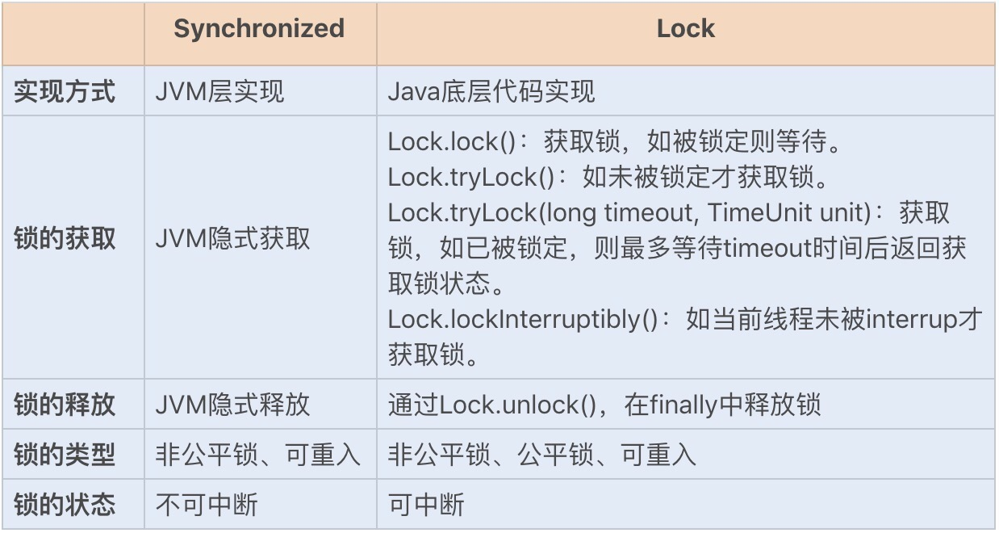

从性能方面上来说，在并发量不高、竞争不激烈的情况下，Synchronized 同步锁由于具有分级锁的优势，性能上与 Lock 锁差不多；但在高负载、高并发的情况下，Synchronized 同步锁由于竞争激烈会升级到重量级锁，性能则没有 Lock 锁稳定。

#### 实现原理

从性能方面上来说，在并发量不高、竞争不激烈的情况下，Synchronized 同步锁由于具有分级锁的优势，性能上与 Lock 锁差不多；但在高负载、高并发的情况下，Synchronized 同步锁由于竞争激烈会升级到重量级锁，性能则没有 Lock 锁稳定。

AQS 类结构中包含一个基于链表实现的等待队列（CLH 队列），用于存储所有阻塞的线程，AQS 中还有一个 state 变量，该变量对 ReentrantLock 来说表示加锁状态。

### 本地线程

Java中的ThreadLocal类允许我们创建只能被同一个线程读写的变量。因此，如果一段代码含有一个ThreadLocal变量的引用，即使两个线程同时执行这段代码，它们也无法访问到对方的ThreadLocal变量。

**如何创建ThreadLocal变量**

以下代码展示了如何创建一个ThreadLocal变量：

```java
private ThreadLocal myThreadLocal = new ThreadLocal();
```

我们可以看到，通过这段代码实例化了一个ThreadLocal对象。我们只需要实例化对象一次，并且也不需要知道它是被哪个线程实例化。虽然所有的线程都能访问到这个ThreadLocal实例，但是每个线程却只能访问到自己通过调用ThreadLocal的set()方法设置的值。即使是两个不同的线程在同一个ThreadLocal对象上设置了不同的值，他们仍然无法访问到对方的值。

**如何访问ThreadLocal变量**

一旦创建了一个ThreadLocal变量，你可以通过如下代码设置某个需要保存的值：

```java
myThreadLocal.set("A thread local value”);
```

可以通过下面方法读取保存在ThreadLocal变量中的值：

```java
String threadLocalValue = (String) myThreadLocal.get();
```

ThreadLocal例子：

```java
public class ThreadLocalExample {

    public static class MyRunnable implements Runnable {

        private ThreadLocal threadLocal = new ThreadLocal();

        @Override
        public void run() {
            threadLocal.set((int) (Math.random() * 100D));
            try {
            Thread.sleep(2000);
            } catch (InterruptedException e) {

            }
            System.out.println(threadLocal.get());
        }
    }

    public static void main(String[] args) {
         MyRunnable sharedRunnableInstance = new MyRunnable();
         Thread thread1 = new Thread(sharedRunnableInstance);
         Thread thread2 = new Thread(sharedRunnableInstance);
         thread1.start();
         thread2.start();
    }

}
```

上面的例子创建了一个MyRunnable实例，并将该实例作为参数传递给两个线程。两个线程分别执行run()方法，并且都在ThreadLocal实例上保存了不同的值。如果它们访问的不是ThreadLocal对象并且调用的set()方法被同步了，则第二个线程会覆盖掉第一个线程设置的值。但是，由于它们访问的是一个ThreadLocal对象，因此这两个线程都无法看到对方保存的值。也就是说，它们存取的是两个不同的值。

**关于InheritableThreadLocal**

InheritableThreadLocal类是ThreadLocal类的子类。ThreadLocal中每个线程拥有它自己的值，与ThreadLocal不同的是，InheritableThreadLocal允许一个线程以及该线程创建的所有子线程都可以访问它保存的值。

### 多线程问题

#### 死锁

**死锁的产生**

死锁是两个或更多线程阻塞着等待其它处于死锁状态的线程所持有的锁。死锁通常发生在多个线程同时但以不同的顺序请求同一组锁的时候。

例如，如果线程1锁住了A，然后尝试对B进行加锁，同时线程2已经锁住了B，接着尝试对A进行加锁，这时死锁就发生了。线程1永远得不到B，线程2也永远得不到A，并且它们永远也不会知道发生了这样的事情。为了得到彼此的对象（A和B），它们将永远阻塞下去。这种情况就是一个死锁。

该情况如下：

```java
Thread 1  locks A, waits for B
Thread 2  locks B, waits for 
```

**更复杂的死锁**

死锁可能不止包含2个线程，这让检测死锁变得更加困难。下面是4个线程发生死锁的例子：

```java
Thread 1  locks A, waits for B
Thread 2  locks B, waits for C
Thread 3  locks C, waits for D
Thread 4  locks D, waits for A
```

线程1等待线程2，线程2等待线程3，线程3等待线程4，线程4等待线程1。

**数据库的死锁**

更加复杂的死锁场景发生在数据库事务中。一个数据库事务可能由多条SQL更新请求组成。当在一个事务中更新一条记录，这条记录就会被锁住避免其他事务的更新请求，直到第一个事务结束。同一个事务中每一个更新请求都可能会锁住一些记录。

当多个事务同时需要对一些相同的记录做更新操作时，就很有可能发生死锁，例如：

```java
Transaction 1, request 1, locks record 1 for update
Transaction 2, request 1, locks record 2 for update
Transaction 1, request 2, tries to lock record 2 for update.
Transaction 2, request 2, tries to lock record 1 for update.
```

因为锁发生在不同的请求中，并且对于一个事务来说不可能提前知道所有它需要的锁，因此很难检测和避免数据库事务中的死锁。

**死锁的避免**

**加锁顺序**

当多个线程需要相同的一些锁，但是按照不同的顺序加锁，死锁就很容易发生。

如果能确保所有的线程都是按照相同的顺序获得锁，那么死锁就不会发生。看下面这个例子：

```java
Thread 1:
  lock A 
  lock B

Thread 2:
   wait for A
   lock C (when A locked)

Thread 3:
   wait for A
   wait for B
   wait for C
```

如果一个线程（比如线程3）需要一些锁，那么它必须按照确定的顺序获取锁。它只有获得了从顺序上排在前面的锁之后，才能获取后面的锁。

例如，线程2和线程3只有在获取了锁A之后才能尝试获取锁C(*译者注：获取锁A是获取锁C的必要条件*)。因为线程1已经拥有了锁A，所以线程2和3需要一直等到锁A被释放。然后在它们尝试对B或C加锁之前，必须成功地对A加了锁。

按照顺序加锁是一种有效的死锁预防机制。但是，这种方式需要你事先知道所有可能会用到的锁(*译者注：并对这些锁做适当的排序*)，但总有些时候是无法预知的。

**加锁时限**

另外一个可以避免死锁的方法是在尝试获取锁的时候加一个超时时间，这也就意味着在尝试获取锁的过程中若超过了这个时限该线程则放弃对该锁请求。若一个线程没有在给定的时限内成功获得所有需要的锁，则会进行回退并释放所有已经获得的锁，然后等待一段随机的时间再重试。这段随机的等待时间让其它线程有机会尝试获取相同的这些锁，并且让该应用在没有获得锁的时候可以继续运行(*译者注：加锁超时后可以先继续运行干点其它事情，再回头来重复之前加锁的逻辑*)。

以下是一个例子，展示了两个线程以不同的顺序尝试获取相同的两个锁，在发生超时后回退并重试的场景：

```java
Thread 1 locks A
Thread 2 locks B

Thread 1 attempts to lock B but is blocked
Thread 2 attempts to lock A but is blocked

Thread 1's lock attempt on B times out
Thread 1 backs up and releases A as well
Thread 1 waits randomly (e.g. 257 millis) before retrying.

Thread 2's lock attempt on A times out
Thread 2 backs up and releases B as well
Thread 2 waits randomly (e.g. 43 millis) before retrying.
```

在上面的例子中，线程2比线程1早200毫秒进行重试加锁，因此它可以先成功地获取到两个锁。这时，线程1尝试获取锁A并且处于等待状态。当线程2结束时，线程1也可以顺利的获得这两个锁（除非线程2或者其它线程在线程1成功获得两个锁之前又获得其中的一些锁）。

需要注意的是，由于存在锁的超时，所以我们不能认为这种场景就一定是出现了死锁。也可能是因为获得了锁的线程（导致其它线程超时）需要很长的时间去完成它的任务。

此外，如果有非常多的线程同一时间去竞争同一批资源，就算有超时和回退机制，还是可能会导致这些线程重复地尝试但却始终得不到锁。如果只有两个线程，并且重试的超时时间设定为0到500毫秒之间，这种现象可能不会发生，但是如果是10个或20个线程情况就不同了。因为这些线程等待相等的重试时间的概率就高的多（或者非常接近以至于会出现问题）。

这种机制存在一个问题，在Java中不能对synchronized同步块设置超时时间。你需要创建一个自定义锁，或使用Java5中java.util.concurrent包下的工具。写一个自定义锁类不复杂，但超出了本文的内容。后续的Java并发系列会涵盖自定义锁的内容。

**死锁检测**

死锁检测是一个更好的死锁预防机制，它主要是针对那些不可能实现按序加锁并且锁超时也不可行的场景。

每当一个线程获得了锁，会在线程和锁相关的数据结构中（map、graph等等）将其记下。除此之外，每当有线程请求锁，也需要记录在这个数据结构中。

当一个线程请求锁失败时，这个线程可以遍历锁的关系图看看是否有死锁发生。例如，线程A请求锁7，但是锁7这个时候被线程B持有，这时线程A就可以检查一下线程B是否已经请求了线程A当前所持有的锁。如果线程B确实有这样的请求，那么就是发生了死锁（线程A拥有锁1，请求锁7；线程B拥有锁7，请求锁1）。

当然，死锁一般要比两个线程互相持有对方的锁这种情况要复杂的多。线程A等待线程B，线程B等待线程C，线程C等待线程D，线程D又在等待线程A。线程A为了检测死锁，它需要递进地检测所有被B请求的锁。从线程B所请求的锁开始，线程A找到了线程C，然后又找到了线程D，发现线程D请求的锁被线程A自己持有着。这是它就知道发生了死锁。

那么当检测出死锁时，这些线程该做些什么呢？

一个可行的做法是释放所有锁，回退，并且等待一段随机的时间后重试。这个和简单的加锁超时类似，不一样的是只有死锁已经发生了才回退，而不会是因为加锁的请求超时了。虽然有回退和等待，但是如果有大量的线程竞争同一批锁，它们还是会重复地死锁（*编者注：原因同超时类似，不能从根本上减轻竞争*）。

一个更好的方案是给这些线程设置优先级，让一个（或几个）线程回退，剩下的线程就像没发生死锁一样继续保持着它们需要的锁。如果赋予这些线程的优先级是固定不变的，同一批线程总是会拥有更高的优先级。为避免这个问题，可以在死锁发生的时候设置随机的优先级。

#### 饥饿和公平

如果一个线程因为CPU时间全部被其他线程抢走而得不到CPU运行时间，这种状态被称之为“饥饿”。而该线程被“饥饿致死”正是因为它得不到CPU运行时间的机会。解决饥饿的方案被称之为“公平性” – 即所有线程均能公平地获得运行机会。

**Java中导致饥饿的原因**

在Java中，下面三个常见的原因会导致线程饥饿：

- 高优先级线程吞噬所有的低优先级线程的CPU时间

  你能为每个线程设置独自的线程优先级，优先级越高的线程获得的CPU时间越多，线程优先级值设置在1到10之间，而这些优先级值所表示行为的准确解释则依赖于你的应用运行平台。对大多数应用来说，你最好是不要改变其优先级值。

- 线程被永久堵塞在一个等待进入同步块的状态

  Java的同步代码区也是一个导致饥饿的因素。Java的同步代码区对哪个线程允许进入的次序没有任何保障。这就意味着理论上存在一个试图进入该同步区的线程处于被永久堵塞的风险，因为其他线程总是能持续地先于它获得访问，这即是“饥饿”问题，而一个线程被“饥饿致死”正是因为它得不到CPU运行时间的机会。

- 线程在等待一个本身(在其上调用wait())也处于永久等待完成的对象

  如果多个线程处在wait()方法执行上，而对其调用notify()不会保证哪一个线程会获得唤醒，任何线程都有可能处于继续等待的状态。因此存在这样一个风险：一个等待线程从来得不到唤醒，因为其他等待线程总是能被获得唤醒。


## java concurrent

### BlockingQueue

**什么是阻塞队列？**

阻塞队列（BlockingQueue）是一个支持两个附加操作的队列。这两个附加的操作是：在队列为空时，获取元素的线程会等待队列变为非空。当队列满时，存储元素的线程会等待队列可用。阻塞队列常用于生产者和消费者的场景，生产者是往队列里添加元素的线程，消费者是从队列里拿元素的线程。阻塞队列就是生产者存放元素的容器，而消费者也只从容器里拿元素。

阻塞队列提供了四种处理方法:

| 方法\处理方式 | 抛出异常  | 返回特殊值 | 一直阻塞 | 超时退出           |
| ------------- | --------- | ---------- | -------- | ------------------ |
| 插入方法      | add(e)    | offer(e)   | put(e)   | offer(e,time,unit) |
| 移除方法      | remove()  | poll()     | take()   | poll(time,unit)    |
| 检查方法      | element() | peek()     | 不可用   | 不可用             |

- 异常：是指当阻塞队列满时候，再往队列里插入元素，会抛出IllegalStateException("Queue full")异常。当队列为空时，从队列里获取元素时会抛出NoSuchElementException异常 。

- 返回特殊值：插入方法会返回是否成功，成功则返回true。移除方法，则是从队列里拿出一个元素，如果没有则返回null
- 一直阻塞：当阻塞队列满时，如果生产者线程往队列里put元素，队列会一直阻塞生产者线程，直到拿到数据，或者响应中断退出。当队列空时，消费者线程试图从队列里take元素，队列也会阻塞消费者线程，直到队列可用。
- 超时退出：当阻塞队列满时，队列会阻塞生产者线程一段时间，如果超过一定的时间，生产者线程就会退出。

**阻塞队列接口：**

```java
public interface BlockingQueue<E> extends Queue<E> {

    //插入元素e到队列中，成功返回true, 否则抛出异常。如果向限定了容量的队列中插入值，推荐使用offer()方法。
    boolean add(E e);

    //插入元素e到队列中，如果设置成功返回true, 否则返回false. e的值不能为空，否则抛出空指针异常。
    boolean offer(E e);

    //插入元素e到队列中，，如果队列中没有多余的空间，该方法会一直阻塞，直到队列中有多余的空间。
    void put(E e) throws InterruptedException;

    //在给定的时间插入元素e到队列中，如果设置成功返回true, 否则返回false.
    boolean offer(E e, long timeout, TimeUnit unit)
        throws InterruptedException;

    //检索并从队列的头部删除元素，如果队列中没有值，线程会一直阻塞，直到队列中有值，并且该方法取得了该值。
    E take() throws InterruptedException;

    //在给定的时间范围内，检索并从队列的头部删除元素，从队列中获取值，如果没有取到会抛出异常。
    E poll(long timeout, TimeUnit unit)
        throws InterruptedException;

    //获取队列中剩余的空间。
    int remainingCapacity();

    //从队列中移除指定的值。
    boolean remove(Object o);

    //判断队列中是否包含该值。
    public boolean contains(Object o);

    //将队列中值，全部移除，并追加到给定的集合中。
    int drainTo(Collection<? super E> c);

    //指定最多数量限制将队列中值，全部移除，并追加到给定的集合中。
    int drainTo(Collection<? super E> c, int maxElements);
}
```


# JVM

## JDK、JRE与JVM的关系

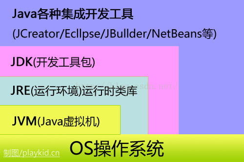

## JVM 运行模式

JVM有两种运行模式Server与Client。两种模式的区别在于，Client模式启动速度较快，Server模式启动较慢；但是启动进入稳定期长期运行之后Server模式的程序运行速度比Client要快很多。这是因为Server模式启动的JVM采用的是重量级的虚拟机，对程序采用了更多的优化；而Client模式启动的JVM采用的是轻量级的虚拟机。所以Server启动慢，但稳定后速度比Client远远要快。


## JVM架构

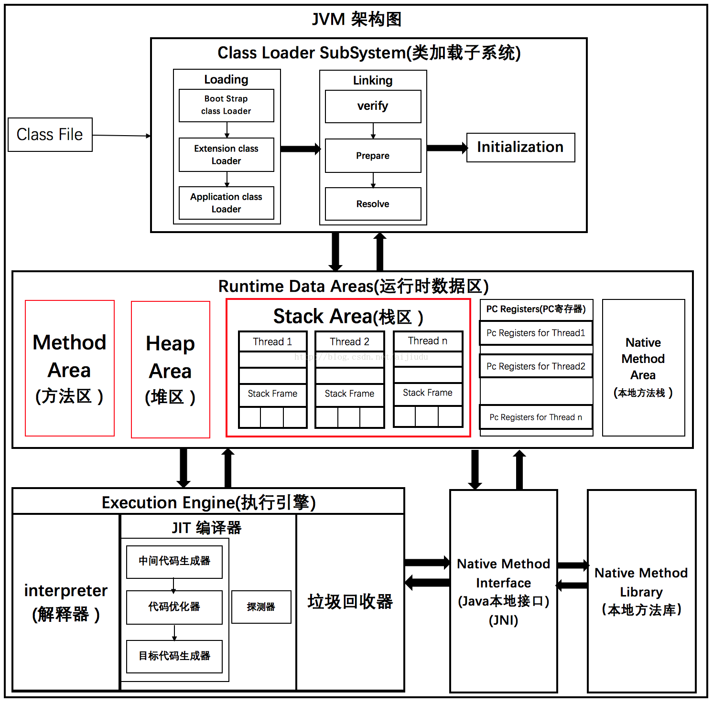

### 1. 类加载器子系统

Java的动态类加载功能是由类加载器子系统处理。当它在运行时（不是编译时）首次引用一个类时，它加载、链接并初始化该类文件。

#### 1.1 加载

类由此组件加载。启动类加载器 (BootStrap class Loader)、扩展类加载器(Extension class Loader)和应用程序类加载器(Application class Loader) 这三种类加载器帮助完成类的加载。

\1. **启动类加载器** – 负责从启动类路径中加载类，无非就是**rt.jar**。这个加载器会被赋予最高优先级。

\2. **扩展类加载器** – 负责加载**ext** 目录**(jre\lib)**内的类**.**

\3. **应用程序类加载器** – 负责加载**应用程序级别类路径**，涉及到路径的环境变量等etc.

上述的**类加载器**会遵循**委托层次算法（Delegation Hierarchy Algorithm）**加载类文件**。**

#### 1.2 链接

\1. **校验** – 字节码校验器会校验生成的字节码是否正确，如果校验失败，我们会得到**校验错误**。

\2. **准备** – 分配内存并初始化**默认值**给所有的静态变量。

\3. **解析** – 所有**符号内存引用**被**方法区(Method Area)**的**原始引用**所替代。

#### 1.3 初始化

这是类加载的最后阶段，这里所有的**静态变量**会被赋初始值**,** 并且**静态块**将被执行。

### 2. 运行时数据区（Runtime Data Area）

The 运行时数据区域被划分为5个主要组件：

#### 2.1 方法区（Method Area）

所有**类级别数据**将被存储在这里，包括**静态变量**。每个JVM只有一个方法区，它是一个共享的资源。

#### 2.2 堆区（Heap Area）

所有的**对象**和它们相应的**实例变量**以及**数组**将被存储在这里。每个JVM同样只有一个堆区。由于**方法区**和**堆区**的内存由多个线程共享，所以存储的数据**不是线程安全的**。

#### 2.3 栈区（Stack Area）

对每个线程会单独创建一个**运行时栈**。对每个**函数呼叫**会在栈内存生成一个**栈帧(Stack Frame)**。所有的**局部变量**将在栈内存中创建。栈区是线程安全的，因为它不是一个共享资源。栈帧被分为三个子实体：

**a 局部变量数组** – 包含多少个与方法相关的**局部变量**并且相应的值将被存储在这里。

**b 操作数栈** – 如果需要执行任何中间操作，**操作数栈**作为运行时工作区去执行指令。

**c 帧数据** – 方法的所有符号都保存在这里。在任意**异常**的情况下，catch块的信息将会被保存在帧数据里面。

#### 2.4 PC寄存器

每个线程都有一个单独的**PC寄存器**来保存**当前执行指令**的地址，一旦该指令被执行，pc寄存器会被**更新**至下条指令的地址。

#### 2.5 本地方法栈

本地方法栈保存本地方法信息。对每一个线程，将创建一个单独的本地方法栈。

### 3. 执行引擎

分配给**运行时数据区**的字节码将由执行引擎执行。执行引擎读取字节码并逐段执行。

#### 3.1 解释器:

 解释器能快速的解释字节码，但执行却很慢。 解释器的缺点就是,当一个方法被调用多次，每次都需要重新解释。

**编译器**

JIT编译器消除了解释器的缺点。执行引擎利用解释器转换字节码，但如果是重复的代码则使用JIT编译器将全部字节码编译成本机代码。本机代码将直接用于重复的方法调用，这提高了系统的性能。

a. **中间代码生成器** – 生成中间代码

b. **代码优化器** – 负责优化上面生成的中间代码

c. **目标代码生成器** – 负责生成机器代码或本机代码

d. **探测器(Profiler)** – 一个特殊的组件，负责寻找被多次调用的方法。

#### 3.3 垃圾回收器:

收集并删除未引用的对象。可以通过调用*“System.gc()”*来触发垃圾回收，但并不保证会确实进行垃圾回收。JVM的垃圾回收只收集哪些由**new**关键字创建的对象。所以，如果不是用**new**创建的对象，你可以使用**finalize函数**来执行清理。

**Java本地接口 (JNI)**: **JNI** 会与**本地方法库**进行交互并提供执行引擎所需的本地库。

**本地方法库**:它是一个执行引擎所需的本地库的集合。

## JVM 程序执行流程

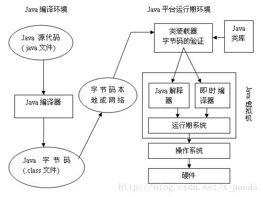


## Java Object Header

### [32 bit jvm](./assets/files/ObjectHeader32.txt)


### [64 bit jvm](./assets/files/ObjectHeader64.txt)
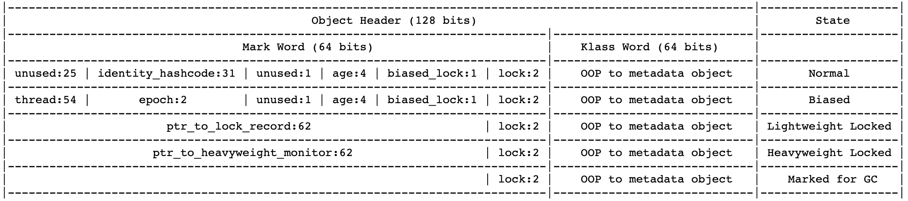

### [64 bit jvm with pointer compression](./assets/files/ObjectHeader64Coops.txt)
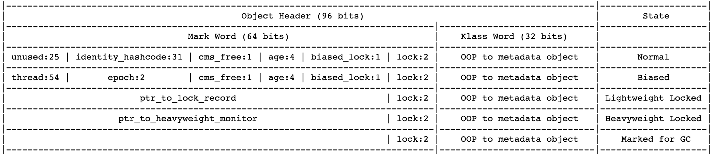


## GC

### 日志

#### 开启日志

```bash
-XX:+PrintGC 输出简要GC日志 
-XX:+PrintGCDetails 输出详细GC日志 
-Xloggc:gc.log  输出GC日志到文件
-XX:+PrintGCTimeStamps 输出GC的时间戳（以JVM启动到当期的总时长的时间戳形式） 
-XX:+PrintGCDateStamps 输出GC的时间戳（以日期的形式，如 2013-05-04T21:53:59.234+0800） 
-XX:+PrintHeapAtGC 在进行GC的前后打印出堆的信息
-verbose:gc
-XX:+PrintReferenceGC 打印年轻代各个引用的数量以及时长
```

##### -XX:+PrintGC与-verbose:gc

```bash
[GC (Allocation Failure)  61805K->9849K(256000K), 0.0041139 secs]
```

1、`GC` 表示是一次YGC（Young GC）

2、`Allocation Failure` 表示是失败的类型

3、`68896K->9849K` 表示年轻代从68896K降为9849K

4、`256000K`表示整个堆的大小

5、`0.0041139 secs`表示这次GC总计所用的时间

#####  -XX:+PrintGCDetails

```bash
[GC (Allocation Failure) [PSYoungGen: 53248K->2176K(59392K)] 58161K->7161K(256000K), 0.0039189 secs] [Times: user=0.02 sys=0.01, real=0.00 secs]
```

1、`GC` 表示是一次YGC（Young GC）

2、`Allocation Failure` 表示是失败的类型

3、PSYoungGen 表示年轻代大小

4、`53248K->2176K` 表示年轻代占用从`53248K`降为`2176K`

5、`59392K`表示年轻带的大小

6、`58161K->7161K` 表示整个堆占用从`53248K`降为`2176K`

7、`256000K`表示整个堆的大小

8、 0.0039189 secs 表示这次GC总计所用的时间

9、`[Times: user=0.02 sys=0.01, real=0.00 secs]`  分别表示，用户态占用时长，内核用时，真实用时。

#### 日志分析工具
[gceasy](https://gceasy.io/)

# JIT

即时编译（英语：Just-in-time compilation，缩写：JIT），又译及时编译、实时编译，动态编译的一种形式，是一种提高程序运行效率的方法。通常，程序有两种运行方式：静态编译与动态解释。静态编译的程序在执行前全部被翻译为机器码，而解释执行的则是一句一句边运行边翻译。


## 优化

### 公共子表达式消除

公共子表达式消除是一个普遍应用于各种编译器的经典优化技术，他的含义是：如果一个表达式E已经计算过了，并且从先前的计算到现在E中所有变量的值都没有发生变化，那么E的这次出现就成为了公共子表达式。对于这种表达式，没有必要花时间再对他进行计算，只需要直接用前面计算过的表达式结果代替E就可以了。如果这种优化仅限于程序的基本块内，便称为局部公共子表达式消除（Local Common Subexpression Elimination），如果这种优化范围涵盖了多个基本块，那就称为全局公共子表达式消除（Global Common Subexpression Elimination）。举个简单的例子来说明他的优化过程，假设存在如下代码：

```java
int d = (c*b)*12+a+(a+b*c);
```

如果这段代码交给Javac编译器则不会进行任何优化，那生成的代码如下所示，是完全遵照Java源码的写法直译而成的。

```
iload_2 // b
imul // 计算b*c
bipush 12 // 推入12
imul // 计算(c*b)*12
iload_1 // a
iadd // 计算(c*b)*12+a
iload_1 // a
iload_2 // b
iload_3 // c
imul // 计算b*c
iadd // 计算a+b*c
iadd // 计算(c*b)*12+a+(a+b*c)
istore 4
```

当这段代码进入到虚拟机即时编译器后，他将进行如下优化：编译器检测到”c*b“与”b*c“是一样的表达式，而且在计算期间b与c的值是不变的。因此，这条表达式就可能被视为：

```java
int d = E*12+a+(a+E);
```

这时，编译器还可能（取决于哪种虚拟机的编译器以及具体的上下文而定）进行另外一种优化：代数化简（Algebraic Simplification），把表达式变为：

```
int d = E*13+a*2;
```

表达式进行变换之后，再计算起来就可以节省一些时间了。

### 方法内联

> 在计算机科学中，内联函数（有时称作在线函数或编译时期展开函数）是一种编程语言结构，用来建议编译器对一些特殊函数进行内联扩展（有时称作在线扩展）；也就是说建议编译器将指定的函数体插入并取代每一处调用该函数的地方（上下文），从而节省了每次调用函数带来的额外时间开支。

#### 内联条件

一个方法如果满足以下条件就很可能被jvm内联。

1、热点代码。 如果一个方法的执行频率很高就表示优化的潜在价值就越大。那代码执行多少次才能确定为热点代码？这是根据编译器的编译模式来决定的。如果是客户端编译模式则次数是1500，服务端编译模式是10000。次数的大小可以通过-XX:CompileThreshold来调整。

2、方法体不能太大。jvm中被内联的方法会编译成机器码放在code cache中。如果方法体太大，则能缓存热点方法就少，反而会影响性能。

3、如果希望方法被内联，**尽量用private、static、final修饰**，这样jvm可以直接内联。如果是public、protected修饰方法jvm则需要进行类型判断，因为这些方法可以被子类继承和覆盖，jvm需要判断内联究竟内联是父类还是其中某个子类的方法。

### 逃逸分析

逃逸分析的基本行为就是分析对象动态作用域：当一个对象在方法中被定义后，它可能被外部方法所引用，称为方法逃逸。甚至还有可能被外部线程访问到，譬如赋值给类变量或可以在其他线程中访问的实例变量，称为线程逃逸。

方法逃逸的几种方式如下：

```java
public class EscapeTest {
    public static Object obj;
    public void globalVariableEscape() {  // 给全局变量赋值，发生逃逸
        obj = new Object();
    }
    public Object methodEscape() {  // 方法返回值，发生逃逸
        return new Object();
    }
    public void instanceEscape() {  // 实例引用发生逃逸
        test(this); 
    }
}
```

#### 栈上分配

栈上分配就是把方法中的变量和对象分配到栈上，方法执行完后自动销毁，而不需要垃圾回收的介入，从而提高系统性能。

#### 同步消除

线程同步本身比较耗，如果确定一个对象不会逃逸出线程，无法被其它线程访问到，那该对象的读写就不会存在竞争，对这个变量的同步措施就可以消除掉。单线程中是没有锁竞争。（锁和锁块内的对象不会逃逸出线程就可以把这个同步块取消）

#### 标量替换

Java虚拟机中的原始数据类型（int，long等数值类型以及reference类型等）都不能再进一步分解，它们就可以称为标量。相对的，如果一个数据可以继续分解，那它称为聚合量，Java中最典型的聚合量是对象。如果逃逸分析证明一个对象不会被外部访问，并且这个对象是可分解的，那程序真正执行的时候将可能不创建这个对象，而改为直接创建它的若干个被这个方法使用到的成员变量来代替。拆散后的变量便可以被单独分析与优化，
 可以各自分别在栈帧或寄存器上分配空间，原本的对象就无需整体分配空间了。


### 对象的栈上内存分配

 栈上分配主要是指在Java程序的执行过程中，在方法体中声明的变量以及创建的对象，将直接从该线程所使用的栈中分配空间。 一般而言，创建对象都是从堆中来分配的，这里是指在栈上来分配空间给新创建的对象。


### 标量替换

标量替换，scalar replacement。Java中的原始类型无法再分解，可以看作标量（scalar）；指向对象的引用也是标量；而对象本身则是聚合量（aggregate），可以包含任意个数的标量。如果把一个Java对象拆散，将其成员变量恢复为分散的变量，这就叫做标量替换。拆散后的变量便可以被单独分析与优化，可以各自分别在活动记录（栈帧或寄存器）上分配空间；原本的对象就无需整体分配空间了。


### 同步锁消除

为了保证数据的完整性，在进行操作时需要对这部分操作进行同步控制，**但是在有些情况下，JVM检测到不可能存在共享数据竞争，这是JVM会对这些同步锁进行锁消除**。

> 锁消除的依据是逃逸分析的数据支持


# Class 文件

## Class 文件概述

class文件是一种8位字节的二进制流文件， 各个数据项按顺序紧密的从前向后排列， 相邻的项之间没有间隙， 这样可以使得class文件非常紧凑， 体积轻巧， 可以被JVM快速的加载至内存， 并且占据较少的内存空间。 我们的Java源文件， 在被编译之后， 每个类（或者接口）都单独占据一个class文件， 并且类中的所有信息都会在class文件中有相应的描述， 由于class文件很灵活， 它甚至比Java源文件有着更强的描述能力。

单个ClassFile结构

```
ClassFile {
    u4             magic;
    u2             minor_version;
    u2             major_version;
    u2             constant_pool_count;
    cp_info        constant_pool[constant_pool_count-1];
    u2             access_flags;
    u2             this_class;
    u2             super_class;
    u2             interfaces_count;
    u2             interfaces[interfaces_count];
    u2             fields_count;
    field_info     fields[fields_count];
    u2             methods_count;
    method_info    methods[methods_count];
    u2             attributes_count;
    attribute_info attributes[attributes_count];
}
```

**Class文件字节码结构组织示意图**


### class文件中的常量池概述

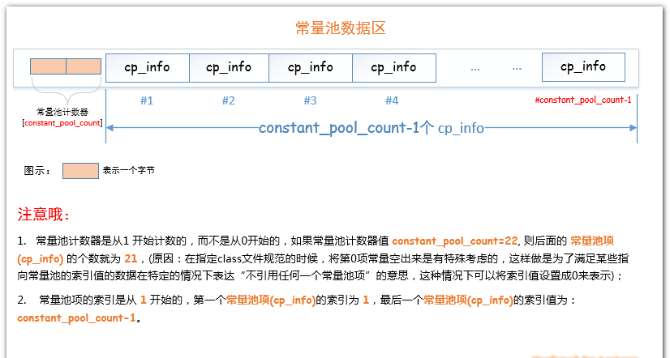


# Garbage Collector

## G1（Garbage-First）

### Overview

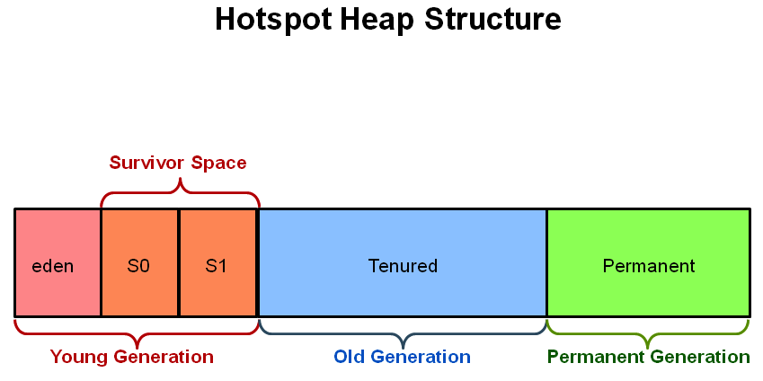

The older garbage collectors (serial, parallel, CMS) all structure the heap into three sections: young generation, old generation, and permanent generation of a fixed memory size.


The heap is partitioned into a set of equal-sized heap regions, each a contiguous range of virtual memory. Certain region sets are assigned the same roles (eden, survivor, old) as in the older collectors, but there is not a fixed size for them. This provides greater flexibility in memory usage.


##  CMS（Concurrent Mark-Sweep Collector ）


# Test

## java run single unit testing

```bash
gradle test -Dtest.single=PropertyBillServiceTest
```

# 常用命令

## java

```bash
-verbose:gc     # 输出垃圾回收信息
```


### 实战

```bash
# 当前的垃圾回收器版本
java -XX:+PrintCommandLineFlags -version
# java8内存占用
java -XX:+UnlockDiagnosticVMOptions -XX:NativeMemoryTracking=summary -XX:+PrintNMTStatistics -version
# java11内存占用
java -XX:+UnlockDiagnosticVMOptions -XX:NativeMemoryTracking=summary -XX:+PrintNMTStatistics -version
# 通用启动参数 
java -server -Xms3g -Xmx3g -XX:NewSize=1g -XX:+UseParNewGC -XX:+UseConcMarkSweepGC -XX:+HeapDumpOnOutOfMemoryError -XX:HeapDumpPath=dump.log -jar start.jar
```

## javap

JDK自带的反汇编器，可以查看java编译器为我们生成的字节码


## jar

```bash
jar xvf test.jar 			# 解压到当前目录
jar cvf filename.jar a.class b.class    #压缩指定文件
jar cvf weibosdkcore.jar *  #全部压缩

# 解开压缩包，修改文件，在次打包成jar
unzip test.jar test			
cd test
jar -cmv0f META-INF/MANIFEST.MF test.jar *
```


## jhsdb

jdk9 以后提供

```bash
 ~ jhsdb
    clhsdb       	command line debugger
    debugd       	debug server
    hsdb         	ui debugger
    jstack --help	to get more information
    jmap   --help	to get more information
    jinfo  --help	to get more information
    jsnap  --help	to get more information
```


### 实战

```bash
jhsdb jmap --heap --pid <pid>			# 查看heap的信息，GC使用的算法，heap的配置. (原来的jmap -heap 命令没有了, 被这个命令代替了)
```


## jcmd

```bash
jcmd <pid> PerfCounter.print 			# 性能统计信息
jcmd <pid> help    # 列出可执行的进程操作
```

```bash
~ jcmd 43358 help
43358:
The following commands are available:
Compiler.CodeHeap_Analytics
Compiler.codecache
Compiler.codelist
Compiler.directives_add
Compiler.directives_clear
Compiler.directives_print
Compiler.directives_remove
Compiler.queue
GC.class_histogram		 # 查看系统中类统计信息 jmap -histo <pid>
GC.class_stats
GC.finalizer_info
GC.heap_dump
GC.heap_info
GC.run  								# 对JVM执行System.gc()
GC.run_finalization
JFR.check
JFR.configure
JFR.dump
JFR.start
JFR.stop
JVMTI.agent_load
JVMTI.data_dump
ManagementAgent.start
ManagementAgent.start_local
ManagementAgent.status
ManagementAgent.stop
Thread.print				 			# 查看线程堆栈信息  jstack <pid>
VM.class_hierarchy
VM.classloader_stats
VM.classloaders
VM.command_line
VM.dynlibs
VM.flags										# 查看JVM的启动参数
VM.info
VM.log
VM.metaspace
VM.native_memory
VM.print_touched_methods
VM.set_flag
VM.stringtable
VM.symboltable
VM.system_properties				 # 查看JVM的系统配置信息
VM.systemdictionary
VM.uptime
VM.version
help
```


## jmap

可以生成 java 程序的 dump 文件， 也可以查看堆内对象示例的统计信息、查看 ClassLoader 的信息以及 finalizer 队列。

```bash
jmap -dump:live,format=b,file=dump.hprof <pid>  # 输出堆信息到文件
```


### 参数：

- **option：** 选项参数。
- **pid：** 需要打印配置信息的进程ID。
- **executable：** 产生核心dump的Java可执行文件。
- **core：** 需要打印配置信息的核心文件。
- **server-id** 可选的唯一id，如果相同的远程主机上运行了多台调试服务器，用此选项参数标识服务器。
- **remote server IP or hostname** 远程调试服务器的IP地址或主机名。

### option

- **no option：** 查看进程的内存映像信息,类似 Solaris pmap 命令。
- **heap：** 显示Java堆详细信息, java9 以后实用`jhsdb`
- **histo[:live]：** 显示堆中对象的统计信息
- **clstats：** 打印类加载器信息
- **finalizerinfo：** 显示在F-Queue队列等待Finalizer线程执行finalizer方法的对象
- **dump:<dump-options>：** 生成堆转储快照
- **F：** 当-dump没有响应时，使用-dump或者-histo参数. 在这个模式下,live子参数无效.
- **help：** 打印帮助信息
- **J<flag>：** 指定传递给运行jmap的JVM的参数

### jstat

* **-class**  类加载器
* **-compiler**  JIT
* **-gc** GC堆状态
* **-gccapacity** 各区大小
* **-gccause**  最近一次GC统计和原因
* **-gcmetacapacity** 新区大小
* **-gcnew** 新区统计
* **-gcnewcapacity** 老区大小
* **-gcold** 老区统计
* **-gcoldcapacity** 永久区大小
* **-gcutil** GC统计汇总
* **-printcompilation** HotSpot编译统计

### JConsole

#### 通过 JConsole 监控 Tomcat

首先我们需要开启 JMX 的远程监听端口，具体来说就是设置若干 JVM 参数。我们可以在 Tomcat 的 bin 目录下新建一个名为`setenv.sh`的文件，然后输入下面的内容：

```bash
export JAVA_OPTS="${JAVA_OPTS} -Dcom.sun.management.jmxremote"
export JAVA_OPTS="${JAVA_OPTS} -Dcom.sun.management.jmxremote.port=9001"
export JAVA_OPTS="${JAVA_OPTS} -Djava.rmi.server.hostname=x.x.x.x"
export JAVA_OPTS="${JAVA_OPTS} -Dcom.sun.management.jmxremote.ssl=false"
export JAVA_OPTS="${JAVA_OPTS} -Dcom.sun.management.jmxremote.authenticate=false"
```

重启 Tomcat，这样 JMX 的监听端口 9001 就开启了，接下来通过 JConsole 来连接这个端口。

```bash
jconsole x.x.x.x:9001
```


## 性能优化

TPS 每秒事物数

RPS 每秒请求数

OPS 每秒操作数

### JVM 优化


| **参数名称**                | **含义**                                                   | **默认值**           |                                                              |
| --------------------------- | ---------------------------------------------------------- | -------------------- | ------------------------------------------------------------ |
| -Xms                        | 初始堆大小                                                 | 物理内存的1/64(<1GB) | 默认(MinHeapFreeRatio参数可以调整)空余堆内存小于40%时，JVM就会增大堆直到-Xmx的最大限制. |
| -Xmx                        | 最大堆大小                                                 | 物理内存的1/4(<1GB)  | 默认(MaxHeapFreeRatio参数可以调整)空余堆内存大于70%时，JVM会减少堆直到 -Xms的最小限制 |
| -Xmn                        | 年轻代大小(1.4or lator)                                    |                      | **注意**：此处的大小是（`eden+ 2 survivor space`).与jmap -heap中显示的New gen是不同的。 整个堆大小=年轻代大小 + 年老代大小 + 持久代大小. 增大年轻代后,将会减小年老代大小.此值对系统性能影响较大,Sun官方推荐配置为整个堆的3/8 |
| -XX:NewSize                 | 设置年轻代大小(for 1.3/1.4)                                |                      |                                                              |
| -XX:MaxNewSize              | 年轻代最大值(for 1.3/1.4)                                  |                      |                                                              |
| -XX:PermSize                | 设置持久代(perm gen)初始值                                 | 物理内存的1/64       |                                                              |
| -XX:MaxPermSize             | 设置持久代最大值                                           | 物理内存的1/4        |                                                              |
| -Xss                        | 每个线程的堆栈大小                                         |                      | JDK5.0以后每个线程堆栈大小为1M,以前每个线程堆栈大小为256K.更具应用的线程所需内存大小进行 调整.在相同物理内存下,减小这个值能生成更多的线程.但是操作系统对一个进程内的线程数还是有限制的,不能无限生成,经验值在3000~5000左右 一般小的应用， 如果栈不是很深， 应该是128k够用的 大的应用建议使用256k。这个选项对性能影响比较大，需要严格的测试。（校长） 和threadstacksize选项解释很类似,官方文档似乎没有解释,在论坛中有这样一句话:`-Xss is translated in a VM flag named ThreadStackSize` 一般设置这个值就可以了。 |
| -*XX:ThreadStackSize*       | Thread Stack Size                                          |                      | (0 means use default stack size) [Sparc: 512; Solaris x86: 320 (was 256 prior in 5.0 and earlier); Sparc 64 bit: 1024; Linux amd64: 1024 (was 0 in 5.0 and earlier); all others 0.] |
| -XX:NewRatio                | 年轻代(包括Eden和两个Survivor区)与年老代的比值(除去持久代) |                      | -XX:NewRatio=4表示年轻代与年老代所占比值为1:4,年轻代占整个堆栈的1/5 Xms=Xmx并且设置了Xmn的情况下，该参数不需要进行设置。 |
| -XX:SurvivorRatio           | Eden区与Survivor区的大小比值                               |                      | 设置为8,则两个Survivor区与一个Eden区的比值为2:8,一个Survivor区占整个年轻代的1/10 |
| -XX:LargePageSizeInBytes    | 内存页的大小不可设置过大， 会影响Perm的大小                |                      | =128m                                                        |
| -XX:+UseFastAccessorMethods | 原始类型的快速优化                                         |                      |                                                              |
| -XX:+DisableExplicitGC      | 关闭System.gc()                                            |                      | 这个参数需要严格的测试                                       |
| -XX:MaxTenuringThreshold    | 垃圾最大年龄                                               |                      | 如果设置为0的话,则年轻代对象不经过Survivor区,直接进入年老代. 对于年老代比较多的应用,可以提高效率.如果将此值设置为一个较大值,则年轻代对象会在Survivor区进行多次复制,这样可以增加对象再年轻代的存活 时间,增加在年轻代即被回收的概率 该参数只有在串行GC时才有效. |
| -XX:+AggressiveOpts         | 加快编译                                                   |                      |                                                              |
| -XX:+UseBiasedLocking       | 锁机制的性能改善                                           |                      |                                                              |
| -Xnoclassgc                 | 禁用垃圾回收                                               |                      |                                                              |
| -XX:SoftRefLRUPolicyMSPerMB | 每兆堆空闲空间中SoftReference的存活时间                    | 1s                   | softly reachable objects will remain alive for some amount of time after the last time they were referenced. The default value is one second of lifetime per free megabyte in the heap |
| -XX:PretenureSizeThreshold  | 对象超过多大是直接在旧生代分配                             | 0                    | 单位字节 新生代采用Parallel Scavenge GC时无效 另一种直接在旧生代分配的情况是大的数组对象,且数组中无外部引用对象. |
| -XX:TLABWasteTargetPercent  | TLAB占eden区的百分比                                       | 1%                   |                                                              |
| -XX:+*CollectGen0First*     | FullGC时是否先YGC                                          | false                |                                                              |

**Java8 内存占用**

```bash
java -XX:+UnlockDiagnosticVMOptions -XX:NativeMemoryTracking=summary -XX:+PrintNMTStatistics -version
```

**Java11 内存占用**

```bash
java -XX:+UnlockDiagnosticVMOptions -XX:NativeMemoryTracking=summary -XX:+PrintNMTStatistics -version
```

* **Reserved** 由操作系统承诺的可用内存大小。但尚未分配，JVM 无法访问

* **Committed** 已被 JVM 分配，可访问

**当前的垃圾回收器版本**

```bash
java -XX:+PrintCommandLineFlags -version
```

### Java性能调优工具箱

jcmd 它用来打印Java进程所涉及的基本类、线程和VM信息。
jconsole 提供JVM活动的图形视图，包括线程的使用、类的使用和GC活动
jhat  读取内存堆转储，事后工具
jmap  提供堆转储后台其他JVM内存使用的信息
jinfo 查看JVM的系统属性
jstack 转储Java进程的栈信息
jvisualvm 监视JVM的GUI工具
jmc 开启一个窗口显示当前机器上的JVM进程

### JIT编译器

JIT(Just In Time) 即时 

编译器最重要的优化包括何时使用主内存中的值，以及何时在寄存器中存贮值

逃逸分析（escape analysis）

### 垃圾收集入门

最主流的4个垃圾收集器分别为：

* Serial收集器（常用于单CPU环境）
* THroughput(或者Parallel) 收集器
* Concurrent 收集器
* G1 收集器


## 日志

### slf4j

SLF4J（Simple Logging Facade for Java）用作各种日志框架（例如java.util.logging，logback，log4j）的简单外观或抽象，允许最终用户在部署时插入所需的日志记录框架。

```java 
// 日志配置
compile "org.slf4j:slf4j-api:$slf4jVersion"
compile "ch.qos.logback:logback-core:$logbackVersion"
compile "ch.qos.logback:logback-classic:$logbackVersion"
```

## H2数据库

### 连接H2数据库有以下方式

* 服务式 （Server）`jdbc:h2:tcp://localhost/~/test`
* 嵌入式（Embedded） `jdbc:h2:~/test`
* 内存（Memory） `jdbc:h2:tcp://localhost/mem:test`


## lombok

https://projectlombok.org/


## mapstruct学习

[官网](http://mapstruct.org/)		
[IDEA插件](https://plugins.jetbrains.com/plugin/10036-mapstruct-support)			


## jenv管理版本

```bash
#macos
brew install jenv  
# bashrc 根据自己的配置，bash 为 bash_profile， zsh 为 zshrc
echo 'export PATH="$HOME/.jenv/bin:$PATH"' >> ~/.bashrc
echo 'eval "$(jenv init -)"' >> ~/.bashrc

# 列出所有java home
/usr/libexec/java_home -V  

jenv add /Library/Java/JavaVirtualMachines/openjdk-11.0.1.jdk/Contents/Home
jenv add /Library/Java/JavaVirtualMachines/jdk1.8.0_192.jdk/Contents/Home

jenv versions 
  system
  1.8
  1.8.0.192
  11.0
  11.0.1
* openjdk64-11.0.1 (set by /Users/warrior/.jenv/version)
  oracle64-1.8.0.192
  
#Configure global version
jenv global oracle64-1.8.0.192 
#Configure local version (per directory)
jenv local oracle64-1.8.0.192 
#Configure shell instance version
jenv shell oracle64-1.8.0.192 
```


## Flyway

数据库跟踪框架

## Liquibase

数据库跟踪框架


## arthas

### 快速开始

```
curl -O https://alibaba.github.io/arthas/arthas-boot.jar
java -jar arthas-boot.jar
```

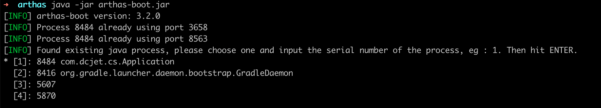


# 附录

**DO**（Data Object）与数据库表结构一一对应，通过 DAO 层向上传输数据源对象。
**DTO**（Data Transfer Object）是远程调用对象，它是 RPC 服务提供的领域模型。

> 对于 DTO 一定要保证其序列化，实现 Serializable 接口，并显示提供 serialVersionUID，否则在反序列化时，如果 serialVersionUID 被修改，那么反序列化会失败。

**BO**（Business Object）是业务逻辑层封装业务逻辑的对象，一般情况下，它是聚合了多个数据源的复合对象。
**DTO**（View Object） 通常是请求处理层传输的对象，它通过 Spring 框架的转换后，往往是一个 JSON 对象。


```
JavaBeans spec:
getUrl/setUrl => property name: url
getURL/setURL => property name: URL

Jackson:
getUrl/setUrl => property name: url
getURL/setURL => property name: url

Introspector.decapitalize() // 转换命名
```


## SPI

SPI 全称为 (Service Provider Interface) ，是JDK内置的一种服务提供发现机制。SPI是一种动态替换发现的机制， 比如有个接口，想运行时动态的给它添加实现，你只需要添加一个实现。我们经常遇到的就是java.sql.Driver接口，其他不同厂商可以针对同一接口做出不同的实现，mysql和postgresql都有不同的实现提供给用户，而Java的SPI机制可以为某个接口寻找服务实现。

当服务的提供者提供了一种接口的实现之后，需要在classpath下的META-INF/services/目录里创建一个以服务接口命名的文件，这个文件里的内容就是这个接口的具体的实现类。当其他的程序需要这个服务的时候，就可以通过查找这个jar包（一般都是以jar包做依赖）的META-INF/services/中的配置文件，配置文件中有接口的具体实现类名，可以根据这个类名进行加载实例化，就可以使用该服务了。JDK中查找服务实现的工具类是：java.util.ServiceLoader。


# JMX

JMX（Java Management Extensions，即 Java 管理扩展）是一个为应用程序、设备、系统等植入监控管理功能的框架。JMX 使用管理 MBean 来监控业务资源，这些 MBean 在 JMX MBean 服务器上注册，代表 JVM 中运行的应用程序或服务。每个 MBean 都有一个属性列表。JMX 客户端可以连接到 MBean Server 来读写 MBean 的属性值。

# CAS

## 什么是CAS

（1）CAS(compare and swap) 比较并替换，比较和替换是线程并发算法时用到的一种技术
（2）CAS是原子操作，保证并发安全，而不是保证并发同步
（3）CAS是CPU的一个指令
（4）CAS是非阻塞的、轻量级的乐观锁

## 为什么说CAS是乐观锁

乐观锁，严格来说并不是锁，通过原子性来保证数据的同步，比如说数据库的乐观锁，通过版本控制来实现等，所以CAS不会保证线程同步。乐观的认为在数据更新期间没有其他线程影响

## CAS原理

CAS(compare and swap) 比较并替换，就是将内存值更新为需要的值，但是有个条件，内存值必须与期望值相同。举个例子，期望值 E、内存值M、更新值U，当E == M的时候将M更新为U。

## CAS应用

由于CAS是CPU指令，我们只能通过JNI与操作系统交互，关于CAS的方法都在sun.misc包下Unsafe的类里 java.util.concurrent.atomic包下的原子类等通过CAS来实现原子操作。

## CAS优缺点

- 优点
  非阻塞的轻量级的乐观锁，通过CPU指令实现，在资源竞争不激烈的情况下性能高，相比synchronized重量锁，synchronized会进行比较复杂的加锁，解锁和唤醒操作。
- 缺点
  （1）ABA问题 线程C、D,线程D将A修改为B后又修改为A,此时C线程以为A没有改变过，java的原子类AtomicStampedReference，通过控制变量值的版本来保证CAS的正确性。
  （2）自旋时间过长，消耗CPU资源， 如果资源竞争激烈，多线程自旋长时间消耗资源。

## CAS总结

CAS不仅是乐观锁，是种思想，我们也可以在日常项目中通过类似CAS的操作保证数据安全，但并不是所有场合都适合。

# RMI

Java RMI 指的是远程方法调用 (Remote Method Invocation)。它是一种机制，能够让在某个 Java 虚拟机上的对象调用另一个 Java 虚拟机中的对象上的方法。

RMI 可以使用以下协议实现：

- Java Remote Method Protocol (JRMP)：专门为 RMI 设计的协议
- Internet Inter-ORB Protocol (IIOP) ：基于 `CORBA` 实现的跨语言协议

RMI 程序通常包括

- `rmi registry` naming service，提供 remote object 注册，name 到 remote object 的绑定和查询，是一种特殊的 remote object
- `rmi server` 创建 remote object，将其注册到 RMI registry
- `rmi client` 通过 name 向 RMI registry 获取 remote object reference (stub)，调用其方法


### 参考

https://docs.oracle.com/javase/tutorial/rmi/overview.html

## 术语

| 术语                    | 含义             | 举例                     |
| ----------------------- | ---------------- | ------------------------ |
| Parameterized type      | 参数化类型       | `List<String>`           |
| Actual type parameter   | 实际参数类型     | `String`                 |
| Generic type            | 泛型类型         | `List<E>`                |
| Formal type parameter   | 形式类型参数     | `E`                      |
| Unbounded wildcard type | 无限制通配符类型 | `List<?>`                |
| Raw type                | 原始类型         | `List`                   |
| Bounded type parameter  | 限制类型参数     | `<E extends Number>`     |
| Bounded wildcard type   | 限制通配符类型   | `List<? extends Number>` |

