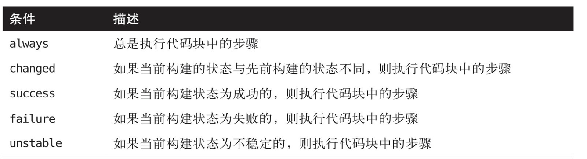

## 基础知识

### 语法 

#### **脚本式语法（scripted syntax）** 

是Jenkins最开始实现的流水线即代码方式。这是一种命令式风格，就试试在流水线脚本中定义逻辑和程序流程。它更依赖于Groovy语言和结构，特别是对于错误检查和异常处理来说

* 优点

  * 更少的代码段落和弱规范要求
  * 更强大的程序代码能力
  * 更像编写代码程序
  * 传统的流水线即代码模型，用户熟悉并向后兼容性
  * 更灵活的自定义代码操作
  * 能够构建更复杂的工作流和流水线

* 缺点

  * 普遍要求更高的编程水平
  * 语法检查受限于Groovy语言及环境
  * 和传统Jenkins模型有很大差异
  * 与声明式流水线的实现相比，同一工作流会更复杂。

  

#### **声明式语法（declarative syntax）** 

是Jenkins提供的新选择，声明式风格的流水线代码被编排在清晰的段落中，相对于只关注实现逻辑，这些流水线的主要区域描述（或“声明”）了我们期望流水线的状态和输出

* 优点
  * 更结构化，贴近传统的Jenkins Web表单形式
  * 更强大的声明内容能力，高可读性
  * 可以通过Blue Ocean图形化界面自动生成
  * 段落可映射到常见的Jenkins概念，比如通知
  * 更友好的语法检查和错误识别
  * 提升流水线间的一致性
* 缺点
  * 对迭代逻辑支持较弱（相比程序而言）
  * 仍在开发完善中（对于传统Jenkins中的部分功能缺乏支持）
  * 更严格的结构（更难实现自定义流水线代码）
  * 目前对于复杂的流水线和工作流难以胜任

```groovy
// 脚本式流水线
node('worker_node1') {
	stage('source') {
		git 'git@xxxx/home/git/works'
	}
	stage('compile') {
		sh 'gradle clean compileJava test'
	}
}

// 声明式语法
pipeline {
  agent {label 'worker_node1'}
  stages {
    stage('souce') {
      steps {
        git 'git@xxxx/home/git/works'
      }
    }
    
    stage('compile') {
      steps {
        sh 'gradle clean compileJava test'
      }
    }
  }
}
```


### 系统 

#### 主节点（master）

Jenkins主节点是一个Jenkins实例（instance）的主要控制系统。它能够完全访问所有Jenkins配置选项和任务（job）列表。如果没有指定其他系统（system），它也是默认的任务执行节点。

> 不过并不推荐在主节点上执行高负载任务，任何需要大量处理的任务都应该在主节点之外的系统上运行。这样做的另一个原因是，凡是在主节点上执行的任务，都有权限访问所有的数据、配置和操作，这会构成潜在的安全风险。同样值得注意的是，在主系统上不应该执行任何包含潜在阻塞的操作，因为主系统需要持续响应和管理各类操作过程。
>

#### 节点 （node）

在Jenkins2中，节点是一个基础概念，代表了任何可以执行Jenkins任务的系统。节点中包含主节点和代理节点，有的时候也用于指代这些概念。此外，节点也可以是一个容器，比如Docker。


#### 代理节点（agent）

在早先版本的Jenkins中，代理节点被称为从节点（slave），其代表了所有非主节点的系统。这类系统由主系统管理，按需分配或指定执行特定的任务。例如，我们可以分配不同的代理节点针对不同的操作系统构建任务，或者可以分配多个代理节点并发地运行测试任务。


#### 执行器（executor）

执行器只是节点/代理节点用于执行任务的一个插槽。一个节点可以有任意多个执行器。执行器的数量定义了该节点可以执行的并发任务数量。当主节点将任务分配给特定节点时，该节点上必须有可用的执行器插槽来立即执行该任务，否则任务会一直处于等待状态，直到一个执行器变为可用。


### 结构

DSL代表领域特定语言（DomainSpecificLanguage），这是一种针对特定上下文的程序语言。Jenkins中的上下文用于创建流水线。Jenkins流水线的DSL基于Groovy语言实现。

#### 节点

节点在管理Jenkins→管理节点界面中定义，操作方法和之前添加从节点的方法完全一致。每一个节点都会自动安装Jenkins代理节点来执行任务（注意，这里假设在Jenkins实例中已经添加了一个节点，并打上了worker1标签）。

#### 阶段

在节点的定义中，我们可以将个人设置、DSL命令和逻辑组合在一个stage闭包中。阶段必须指定一个name，这提供了一种机制，可以用来描述这个阶段的职责。

#### 步骤

阶段中包含了实际的JenkinsDSL命令，这在Jenkins术语中被称为步骤（step）。一个步骤是DSL定义中最基本的功能。它虽然不是Groovy命令，但是可以和Groovy命令搭配使用。

### 支持环境

#### 创建一个流水线项目


## 流水线执行流程

### 触发任务

* 　如果Jenkins应用的本身就是流水线类型的任务，可以使用传统的方法通过Web界面在项目的基本配置部分指定触发条件

* 如果是创建了一个脚本式流水线，可以在代码中指定一个properties代码块（通常在流水线开始之前）来定义触发条件（注意，这个属性部分将会和Web界面中定义的属性合并处理，并且Web界面上定义的属性优先生效）。

* 如果是创建了一个声明式流水线，有一个特殊的triggers指令可以用来定义流水线的触发类型。

  

#### 在其他项目构建后构建

#### 周期性构建

#### 使用GitHub钩子触发器进行GitSCM轮询

#### SCM轮询

#### 静默期

#### 远程触发构建

### 用户输入

#### 输入

#### 参数

#### 多个输入参数的返回值

#### 参数与声明式流水线

```groovy
pipeline {
    agent any
    
    parameters {
        string(name: 'USERID', defaultValue: '', description: 'Enter your userid')
    }

    stages {
        stage('Login') {
            steps {
                echo 'Active user is now ${params.USERID}'
            }
        }
    }
}
```


### 流程控制选项

#### 超时

```groovy
// 认的时间单位是min。如果你只指定了一个时间值，就会被认为使用的是min单位。
timeout(time: 60, unit: 'SECONDS') {
  // code
}
```


##### 实例

```groovy
node {
    def response 
    stage('input') {
        timeout(time:10, unit: 'SECONDS') {
            response = input message: 'User'
            parameters: [string(defaultValue: 'user1', description: 'Entry Userid:', name: 'userid')]
        }
        echo "Username = " + response
    }
}
```

#### 重试 

```groovy
retry (<n>) {//code}
```

#### 睡眠

```groovy
sleep time: 5, unit: 'MINUTES'   // 默认为s
```

#### 等待直到

```groovy
waitUntil { // 返回true 或 false的过程 }	
```

### 处理并发

#### 使用lock步骤对资源加锁

如果你安装了可锁定资源插件（LockableResourcesplugin），系统中就会有一个DSLlock步骤可以用来阻止多个构建在同一时间试图使用同样的资源。

```groovy
lock('worker_node1') {
  // worker_node1上运行一些步骤
}

// 你可以提供一个标签名称用于选择拥有该标签的一组资源，同时提供一个数值用于指定需要被上锁（预订）的匹配该标签的资源的数量
lock(label: 'docker-node', quantity: 3) {
  // 还有一个inversePrecedence可选参数。如果这个参数被设置为true，那么最新的构建优先获得资源（资源可用时）。否则，所有构建将按照申请资源的顺序依次获得资源。
}
```

#### 使用milestone来控制并构建

，在Jenkins流水线中可以使用milestone步骤。当一个milestone步骤被放在流水线中时，如果较新的构建已经到达了那里，系统就会阻止较老的构建通过这个里程碑。

对于里程碑的处理规则，可以总结如下：

* 构建按照构建编号依次通过这些里程碑。
* 如果一个较新的构建已经通过了里程碑，较旧的构建会中止运行。
* 当一个构建通过了一个里程碑，Jenkins会中止那些已经通过了前一个里程碑但还没有到达该里程碑的较旧的构建。
* 如果一个较旧的构建通过了某个里程碑，那些还没有通过该里程碑的较新的构建不会被中止。

明确一下，如果并发的构建按照它们的启动顺序到达里程碑的话，它们都能够通过该里程碑。


#### 在多分支流水线中限制并发

流水线DSL包含了一个可以限制多分支流水线每次只构建一个分支的方法。在脚本式或声明式流水线中，这是通过设置一个属性来完成的。在这个属性被设置后（在分支对应的Jenkinsfile里），当前正在构建的分支以外的其他分支所申请的构建会被放入队列中排队。

脚本式语法

```groovy
properties([disableConcurrentBuilds()])
```

声明式语法

```groovy
options {
  disableConcurrentBuilds()
}
```

#### 并行地运行任务


### 有条件的执行功能


### 构建后处理

#### 脚本式流水线构建后处理

脚本式流水线没有内置支持构建后处理。在脚本式流水线中，当我们还没有内置功能时，通常依靠Groovy程序结构来提供此功能。这也意味着在这种情况下，我们会使用try-catch-finally机制。

#### 声明式流水线构建后处理




## 访问与安全


