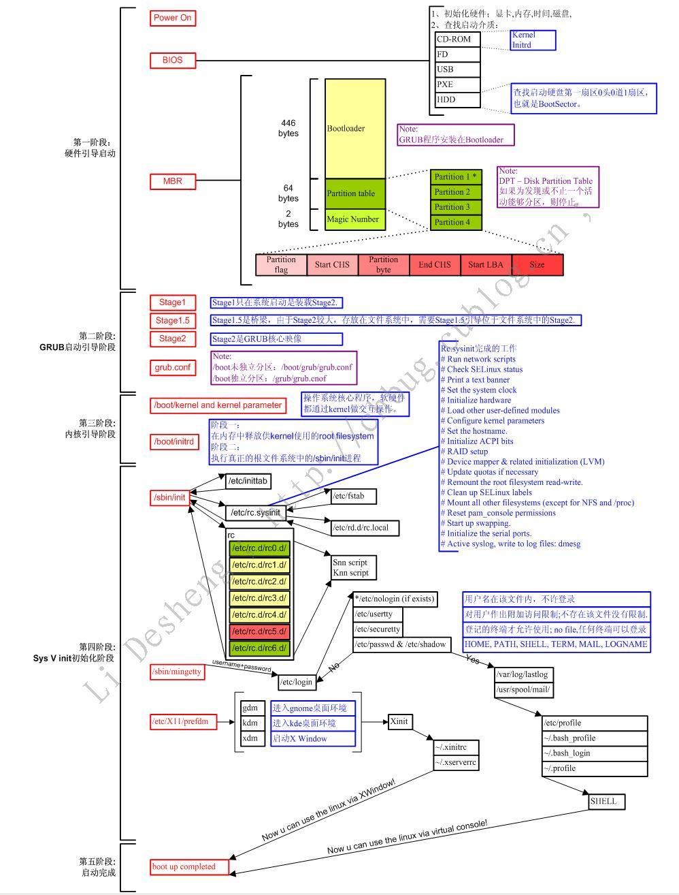
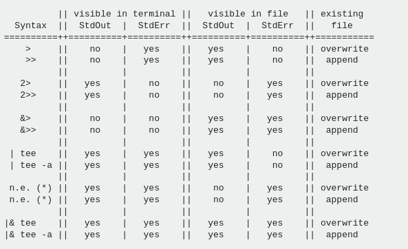

### Linux启动过程



BIOS -- MBR -- BootLoader(grub) -- kernel -- systemd -- 系统初始化 -- shell

```bash
dd if=/dev/vda of=mbr.bin bs=446 count=1    # 读取mbr内容到mbr.bin
dd if=/dev/vda of=mbr.bin bs=512 count=1    # 读取mbr（包含分区表）内容到mbr.bin   
hexdump -C mbr.bin													# 使用16进制查看文件内容
```

### 执行方式

```bash
bash ./file.sh									# 开启新进程执行脚本
./file.sh												# 需要可执行权限，开启新进程执行脚本
source ./file.sh								# 在当前环境执行脚本
. ./file.sh										  # 在当前环境执行脚本
```

* 内建命令不需要产生子进程
* 内建命令对当前shell生效

#### 脚本调试

-n 只读取shell脚本，但不实际执行
-x 进入跟踪方式，显示所执行的每一条命令
-c "string" 从strings中读取命令

#### **shopt**

用于显示和设置shell中的行为选项，通过这些选项以增强shell易用性。shopt命令若不带任何参数选项，则可以显示所有可以设置的shell操作选项。

**-s** 激活指定的shell行为选项；

**-u** 关闭指定的shell行为选项。

```bash
shopt           #输出所有可以设置的shell操作选项
cdable_vars     off
cdspell         off
checkhash       off
checkwinsize    on
cmdhist         on
dotglob         off
execfail        off
expand_aliases  on
extdebug        off
...
```


### 管道

* 管道和信号一样，也是进程通信的方式之一
* 匿名管道（管道符）是Shell编程常用的通信工具
* 管道符是`|`,将前一个命令执行结果传递给后面的命令

### 重定向




#### 2>&1

2>&1表明将文件描述2（标准错误输出）的内容重定向到文件描述符1（标准输出），为什么1前面需要&？当没有&时，1会被认为是一个普通的文件，有&表示重定向的目标不是一个文件，而是一个文件描述符。

```bash
cd /proc/5270/fd   				#进程5270所有打开的文件描述符信息都在此
ls -l              				#列出目录下的内容
 0 -> /dev/pts/7
 1 -> /dev/pts/7
 2 -> /dev/pts/7
 255 -> /home/hyb/workspaces/shell/test.sh
```

### 转意和引用

* `#` 注释
* `；` 分号 分割两行代码
* `\` 转译符号
  * `\a`：响铃
  * `\b`：退格
  * `\n`：换行
  * `\r`：回车
  * `\t`：制表符
* `''` 单引号用于保留字符的字面含义，各种特殊字符在单引号里面，都会变为普通字符，比如星号（`*`）、美元符号（`$`）、反斜杠（`\`）等。
* `""` 双引号比单引号宽松，大部分特殊字符在双引号里面，都会失去特殊含义，变成普通字符。但是，三个特殊字符除外：美元符号（`$`）、反引号（**\`**）和反斜杠（`\`）。这三个字符在双引号之中，依然有特殊含义，会被 Bash 自动扩展
* \` 反引号两个反引号包围起来的字符串，将作为命令来运行，执行的输出结果作为该反引号的内容，称为命令替换。它有另一种更好的写法：`$(command)`
* `() (()) $()`  单独使用会产生一个子shell `(xyz=123)`, 数组初始化 `arr=(1,2,3)`
* `[][[]]` 单独使用方括号是测试`（test）`或数组元素功能 两个方括号是表示测试表达式
* `<>` 尖括号 重定向符号
* `{}` 输出范围 `echo {0..9}` 文件复制 `cp /etc/passwd{,.bak}`


#### 符号的意义

| 符号                | 符号                                     |
| ------------------- | ---------------------------------------- |
| 双引号 " "          | 引用字符串，字符串中部分特殊符号有意义   |
| 单引号 ' '          | 引用字符串，字符串中特殊符号全都没有意义 |
| 反引号\` \`、$()    | 命令替换                                 |
| $(( ))、$[ ]、(( )) | 算术运算                                 |
| ${}                 | 变量替换                                 |
| ()                  | 数组初始化                               |
| [ ]                 | 条件测试                                 |
| [[ ]]               | 字符串比较                               |
| { }                 | 括起一个语句块                           |

* 如果 shell 不是交互式的，则不会展开别名，除非使用 `shopt` 设置 `expand_aliases` shell 选项


### 变量

#### 环境变量

```bash
$ env
# 或者
$ printenv

# 查看单个环境变量的值
printenv PATH
echo $PATH
```

#### 配置文件

* `/etc/profile`
* `/etc/profile.d/`
* `~/.bash_profile`
* `~/.bashrc`
* `/etc/bashrc`

>  注意上面的顺序也是用户登录时执行的顺序`su - root` 的执行顺序


#### 定义变量

变量名的命名规则

* 字母、数字和下划线字符组成。
* 第一个字符必须是一个字母或一个下划线，不能是数字。
* 不允许出现空格和标点符号。

 变量声明语法

```bash
a=z                     # 变量 a 赋值为字符串 z
b="a string"            # 变量值包含空格，就必须放在引号里面
c="a string and $b"     # 变量值可以引用其他变量的值
d="\t\ta string\n"      # 变量值可以使用转义字符
e=$(ls -l foo.txt)      # 变量值可以是命令的执行结果
f=$((5 * 7))            # 变量值可以是数学运算的结果

```

#### 读取变量

读取变量的时候，直接在变量名前加上`$`就可以了，变量名也可以使用花括号`{}`包围，比如`$a`也可以写成`${a}`。这种写法可以用于变量名与其他字符连用的情况。

```bash
a=z
echo $a
echo ${a}_file					# 例如这种情况下
```

#### 删除变量

```bash
unset NAME
```

#### 输出变量

```bash
# 向子 Shell 输出变量
NAME=foo
export NAME

# 变量的赋值和输出也可以在一个步骤中完成
export NAME=value
```


#### 变量的默认值

```bash
# 如果变量varname存在且不为空，则返回它的值，否则返回word
${varname:-word}				
# 如果变量varname存在且不为空，则返回它的值，否则将它设为word，并且返回word, 它的目的是设置变量的默认值，比如${count:=0}表示变量count不存在时返回0，且将count设为0。
${varname:=word}				
# 如果变量名存在且不为空，则返回word，否则返回空值。它的目的是测试变量是否存在，比如${count:+1}表示变量count存在时返回1（表示true），否则返回空值。
${varname:+word}				
# 如果变量varname存在且不为空，则返回它的值，否则打印出varname: message，并中断脚本的执行。如果省略了message，则输出默认的信息“parameter null or not set.”。它的目的是防止变量未定义，比如${count:?"undefined!"}表示变量count未定义时就中断执行，抛出错误，返回给定的报错信息undefined!。
${varname:?message}			
# 1 表示脚本的第一个参数。如果该参数不存在，就退出脚本并报错。
filename=${1:?"filename missing."}
```

#### 特殊变量

* `$?` 为上一个命令的退出码，用来判断上一个命令是否执行成功。返回值是`0`，表示上一个命令执行成功；如果是非零，上一个命令执行失败。
* `$$` 当前 Shell 的进程 ID。
* `$_`为上一个命令的最后一个参数。
* `$!`为最近一个后台执行的异步命令的进程 ID。
* `$0`为当前 Shell 的名称（在命令行直接执行时）或者脚本名（在脚本中执行时）
* `$-`为当前 Shell 的启动参数。
* `$@`和`$#`表示脚本的参数数量


### 数组

```bash
ipts = (10.0.0.1, 10.0.0.2, 10.0.0.3)
echo $ipts
echo ${ipts[@]}					# 输出所有数组

```

### 算数运算

#### 算数运算

`((...))`语法可以进行整数的算术运算。

`((...))`语法支持的算术运算符如下。

- `+`：加法
- `-`：减法
- `*`：乘法
- `/`：除法（整除）
- `%`：余数
- `**`：指数
- `++`：自增运算（前缀或后缀）
- `--`：自减运算（前缀或后缀）

```bash
((foo = 5 + 5))
```

#### 数值的进制

Bash 的数值默认都是十进制，但是在算术表达式中，也可以使用其他进制。

- `number`：没有任何特殊表示法的数字是十进制数（以10为底）。
- `0number`：八进制数。
- `0xnumber`：十六进制数。
- `base#number`：`base`进制的数。

#### 位运算 

`$((...))`支持以下的二进制位运算符。

- `<<`：位左移运算，把一个数字的所有位向左移动指定的位。
- `>>`：位右移运算，把一个数字的所有位向右移动指定的位。
- `&`：位的“与”运算，对两个数字的所有位执行一个`AND`操作。
- `|`：位的“或”运算，对两个数字的所有位执行一个`OR`操作。
- `~`：位的“否”运算，对一个数字的所有位取反。
- `^`：位的异或运算（exclusive or），对两个数字的所有位执行一个异或操作

#### 逻辑运算

`$((...))`支持以下的逻辑运算符。

- `<`：小于
- `>`：大于
- `<=`：小于或相等
- `>=`：大于或相等
- `==`：相等
- `!=`：不相等
- `&&`：逻辑与
- `||`：逻辑或
- `!`：逻辑否

#### 赋值运算

算术表达式`$((...))`可以执行赋值运算

```bash
echo $((a=1))
ccho $a
```

#### expr 命令

`expr`命令支持算术运算，可以不使用`((...))`语法

```bash
expr 3 + 2
foo=3
expr $foo + 2
```

> `expr`命令不支持非整数参数。


### 测试与判断

#### if结构

```bash
if commands; then
  commands
[elif commands; then
  commands...]
[else
  commands]
fi
```

#### test 命令

```bash
# 写法一
test expression

# 写法二
[ expression ]

# 写法三 支持正则判断
[[ expression ]]
```

#### 判断表达式

##### 文件判断 

- `[ -a file ]`：如果 file 存在，则为`true`。
- `[ -b file ]`：如果 file 存在并且是一个块（设备）文件，则为`true`。
- `[ -c file ]`：如果 file 存在并且是一个字符（设备）文件，则为`true`。
- `[ -d file ]`：如果 file 存在并且是一个目录，则为`true`。
- `[ -e file ]`：如果 file 存在，则为`true`。
- `[ -f file ]`：如果 file 存在并且是一个普通文件，则为`true`。
- `[ -g file ]`：如果 file 存在并且设置了组 ID，则为`true`。
- `[ -G file ]`：如果 file 存在并且属于有效的组 ID，则为`true`。
- `[ -h file ]`：如果 file 存在并且是符号链接，则为`true`。
- `[ -k file ]`：如果 file 存在并且设置了它的“sticky bit”，则为`true`。
- `[ -L file ]`：如果 file 存在并且是一个符号链接，则为`true`。
- `[ -N file ]`：如果 file 存在并且自上次读取后已被修改，则为`true`。
- `[ -O file ]`：如果 file 存在并且属于有效的用户 ID，则为`true`。
- `[ -p file ]`：如果 file 存在并且是一个命名管道，则为`true`。
- `[ -r file ]`：如果 file 存在并且可读（当前用户有可读权限），则为`true`。
- `[ -s file ]`：如果 file 存在且其长度大于零，则为`true`。
- `[ -S file ]`：如果 file 存在且是一个网络 socket，则为`true`。
- `[ -t fd ]`：如果 fd 是一个文件描述符，并且重定向到终端，则为`true`。 这可以用来判断是否重定向了标准输入／输出错误。
- `[ -u file ]`：如果 file 存在并且设置了 setuid 位，则为`true`。
- `[ -w file ]`：如果 file 存在并且可写（当前用户拥有可写权限），则为`true`。
- `[ -x file ]`：如果 file 存在并且可执行（有效用户有执行／搜索权限），则为`true`。
- `[ file1 -nt file2 ]`：如果 FILE1 比 FILE2 的更新时间最近，或者 FILE1 存在而 FILE2 不存在，则为`true`。
- `[ file1 -ot file2 ]`：如果 FILE1 比 FILE2 的更新时间更旧，或者 FILE2 存在而 FILE1 不存在，则为`true`。
- `[ FILE1 -ef FILE2 ]`：如果 FILE1 和 FILE2 引用相同的设备和 inode 编号，则为`true`。

##### 字符串判断

- `[ string ]`：如果`string`不为空（长度大于0），则判断为真。
- `[ -n string ]`：如果字符串`string`的长度大于零，则判断为真。
- `[ -z string ]`：如果字符串`string`的长度为零，则判断为真。
- `[ string1 = string2 ]`：如果`string1`和`string2`相同，则判断为真。
- `[ string1 == string2 ]` 等同于`[ string1 = string2 ]`。
- `[ string1 != string2 ]`：如果`string1`和`string2`不相同，则判断为真。
- `[ string1 '>' string2 ]`：如果按照字典顺序`string1`排列在`string2`之后，则判断为真。
- `[ string1 '<' string2 ]`：如果按照字典顺序`string1`排列在`string2`之前，则判断为真。

##### 整数判断

- `[ integer1 -eq integer2 ]`：如果`integer1`等于`integer2`，则为`true`。
- `[ integer1 -ne integer2 ]`：如果`integer1`不等于`integer2`，则为`true`。
- `[ integer1 -le integer2 ]`：如果`integer1`小于或等于`integer2`，则为`true`。
- `[ integer1 -lt integer2 ]`：如果`integer1`小于`integer2`，则为`true`。
- `[ integer1 -ge integer2 ]`：如果`integer1`大于或等于`integer2`，则为`true`。
- `[ integer1 -gt integer2 ]`：如果`integer1`大于`integer2`，则为`true`。

##### 正则判断

```bash
# regex是一个正则表示式，=~是正则比较运算符。
[[ string1 =~ regex ]]
```

##### test 判断的逻辑运算

- `AND`运算：符号`&&`，也可使用参数`-a`。
- `OR`运算：符号`||`，也可使用参数`-o`。
- `NOT`运算：符号`!`。

#### case 结构

```bash
case expression in
  pattern )
    commands ;;
  pattern )
    commands ;;
  ...
esac
```

`case`的匹配模式可以使用各种通配符，下面是一些例子。

- `a)`：匹配`a`。
- `a|b)`：匹配`a`或`b`。
- `[[:alpha:]])`：匹配单个字母。
- `???)`：匹配3个字符的单词。
- `*.txt)`：匹配`.txt`结尾。
- `*)`：匹配任意输入，通过作为`case`结构的最后一个模式。

### 循环

#### while

```bash
while condition; do
  commands
done
```

#### until

```bash
until condition; do
  commands
done
```

#### for...in

```bash
for variable in list
do
  commands
done
```

#### for C语言语法

```bash
for (( expression1; expression2; expression3 )); do
  commands
done
```

#### break，continue

Bash 提供了两个内部命令`break`和`continue`，用来在循环内部跳出循环。

#### select

`select`结构主要用来生成简单的菜单。它的语法与`for...in`循环基本一致。

```bash
select name
[in list]
do
  commands
done
```

Bash 会对`select`依次进行下面的处理。

1. `select`生成一个菜单，内容是列表`list`的每一项，并且每一项前面还有一个数字编号。
2. Bash 提示用户选择一项，输入它的编号。
3. 用户输入以后，Bash 会将该项的内容存在变量`name`，该项的编号存入环境变量`REPLY`。如果用户没有输入，就按回车键，Bash 会重新输出菜单，让用户选择。
4. 执行命令体`commands`。
5. 执行结束后，回到第一步，重复这个过程。

### 函数

Bash 函数定义的语法有两种。

```bash
# 第一种
fn() {
  # codes
}

# 第二种
function fn() {
  # codes
}

declare -f     #  查询shell已经定义的函数
```

#### 参数变量 

函数体内可以使用参数变量，获取函数参数。函数的参数变量，与脚本参数变量是一致的。

- `$1`~`$9`：函数的第一个到第9个的参数。
- `$0`：函数所在的脚本名。
- `$#`：函数的参数总数。
- `$@`：函数的全部参数，参数之间使用空格分隔。
- `$*`：函数的全部参数，参数之间使用变量`$IFS`值的第一个字符分隔，默认为空格，但是可以自定义。

#### 变量作用域

Bash 函数体内直接声明的变量，属于全局变量，整个脚本都可以读取。这一点需要特别小心。

函数里面可以用`local`命令声明局部变量。

#### 系统函数

* 系统自建了函数库，可以在脚本中引用 `/etc/init.d/functions`
* 自建函数库 使用source函数脚本文件**导入**函数

### 计划任务

#### 一次性计划任务

```bash
at 10:50
at> echo hello > /tmp/hello.txt
at> <EOT>     # ctrl+d 提交
```

#### 周期性计划任务

[crontab](#crontab)

#### 计划任务加锁flock

如果不能按照预期时间运行任务，则

* anacontab  延时计划任务
* flock锁文件


### 实战

#### JAVA Application start

```bash
nohup java -Xms1024M -Xmx1024M -XX:MetaspaceSize=128M -XX:MaxMetaspaceSize=128M -XX:+PrintGCDetails -XX:+PrintGCTimeStamps -XX:+PrintGCDateStamps -XX:+PrintGCCause -Xloggc:gc.log -jar  frameworkapi.jar --spring.config.local=E:/app/jg/application-test.yml --spring.profiles.active=test >/dev/null 2>&1 &
echo $!>pid
```

#### JAVA Application stop

```bash 
kill `cat pid`
```

#### 自动备份mongodb

[mongodb_back.sh](assets/files/mongodb_backup.sh)

```bash
#!/bin/bash
#backup MongoDB

# mongodump命令路径
DUMP=mongodump
# 临时备份目录
OUT_DIR=/Users/warrior/Downloads/data/backup/mongodb/now
# 备份存放路径
TAR_DIR=/Users/warrior/Downloads/data/backup/mongodb/
# 获取当前系统时间
DATE=`date +%Y_%m_%d_%H_%M`
# 数据库账号
DB_USER=user
# 数据库密码
DB_PASS=123
# DAYS=30代表删除30天前的备份，即只保留近30天的备份
DAYS=30
# 最终保存的数据库备份文件
TAR_BAK="mongodb_bak_$DATE.tar.gz"

# 检查目录是否村子，不存在就新建
if [[ ! -d "$OUT_DIR" ]]; then
    mkdir -p $OUT_DIR 
fi

cd $OUT_DIR
rm -rf $OUT_DIR/*
mkdir -p $OUT_DIR/$DATE

# 备份数据库
$DUMP -d cws -o $OUT_DIR/$DATE
# 压缩
tar -zcvf $TAR_DIR/$TAR_BAK $OUT_DIR/$DATE
# 删除30天前的备份文件 注意+号的位置
find $TAR_DIR/ -mtime +$DAYS -delete

exit
```

```bash
# 设置定时任务
chmod +x ~/crontab/mongodb_backup.sh       # 增加执行权限
vi /etc/crontab
0 2 * * * root ~/crontab/mongodb_backup.sh   # 每天凌晨02:00以 root 身份运行备份数据库的脚本
```

