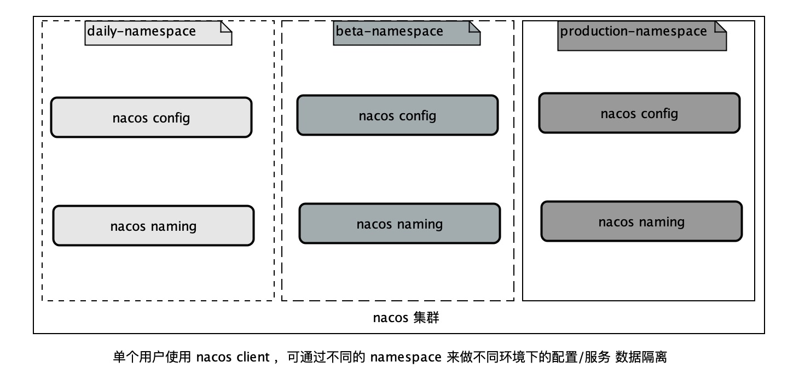
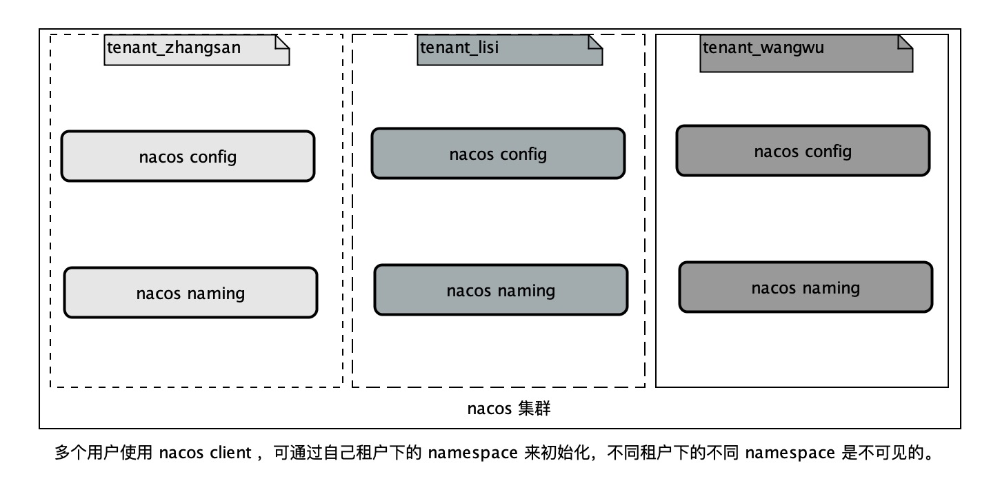
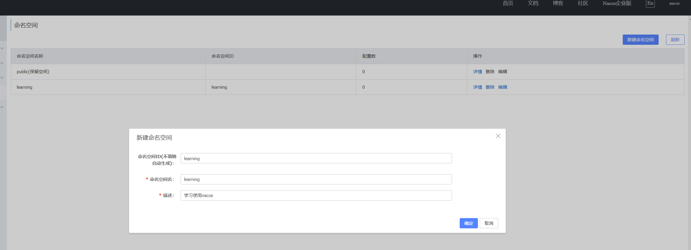
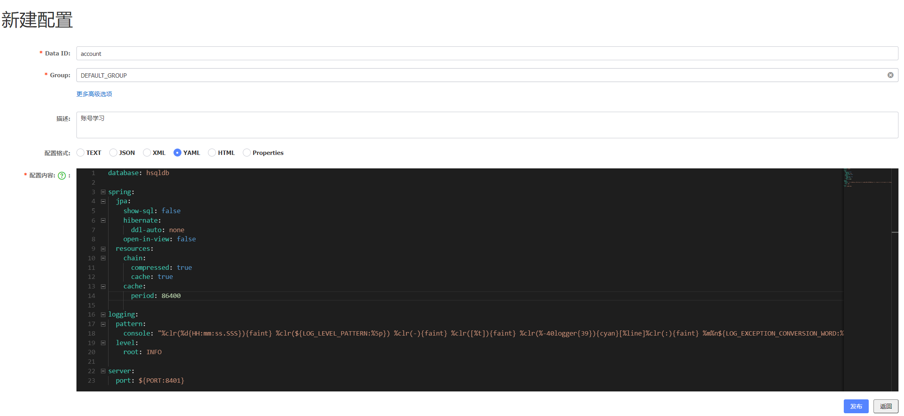
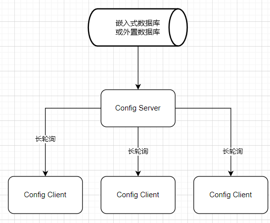
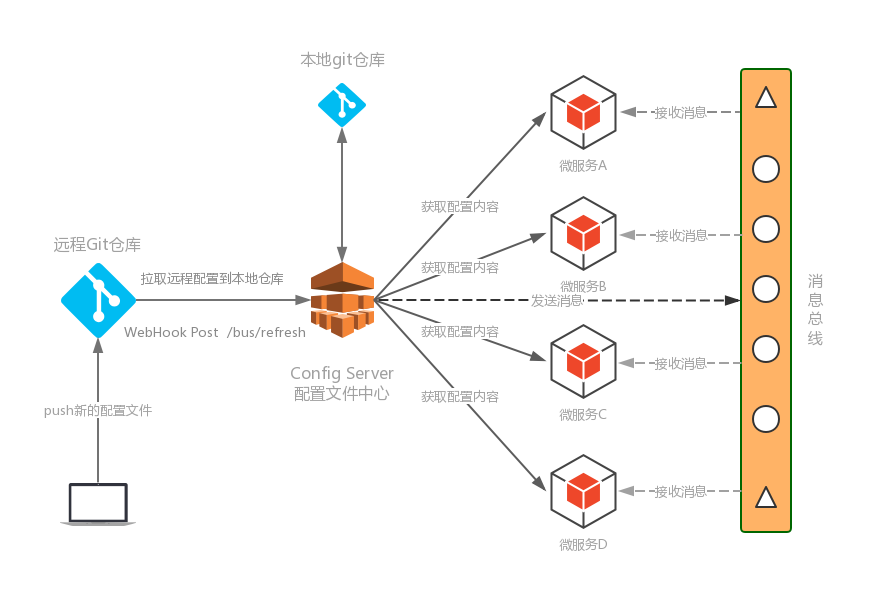

# 简介

Nacos 官网 https://nacos.io/

Nacos 的关键特性包括:

* 服务发现和服务健康监测
* 动态配置服务
* 动态 DNS 服务
* 服务及其元数据管理
* ...

## [Raft 算法](./DSA.md#Raft)

Nacos Discovery集群为了保证集群中数据的一致性，其采用了Raft算法。这是一种通过对日志进行复制管理来达到一致性的算法。Raft通过选举Leader并由Leader节点负责管理日志复制来实现各个节点间数据的一致性。

Raft算法不是强一致性算法，时最终一致性算法。

#### Nacos 与 [CAP](./理论.md#CAP) 

ZK 默认是 CP, Eureka 是 AP，Nacos 同时支持 AP 与 CP。

默认情况下，Nacos Discovery集群是 AP 的。但其也支持 CP 模式，需要进行转换。如果要转换为 CP 的。可以提交如下的 PUT 亲求，完成 AP 到 CP 的转换。

```bash
curl -X PUT '127.0.0.1:8848/nacos/v1/ns/operator/switches?entry=serverMode&value=CP'
```

# Install

Nacos支持三种部署模式

* 单机模式 - 用于测试和单机试用。
* 集群模式 - 用于生产环境，确保高可用。
* 多集群模式 - 用于多数据中心场景。

## 环境准备

* 64 bit OS Linux [设置IP地址](./linux.md#ip)
* 64 bit JDK 1.8+
* [安装Mysql 8.0](./mysql.md#Install)
* 3个或3个以上Nacos节点才能构成集群

## 下载安装文件

`https://github.com/alibaba/nacos/releases`

## 伪集群安装

### 配置 nacos 目录下 conf 中的 cluster.conf

```bash
192.168.157.129:8848
192.168.157.129:8858
192.168.157.129:8868
```


## 启动服务器

### Stand-alone mode

```bash
sh startup.sh -m standalone
```

### 集群模式

```bash
sh startup.sh
``` 

## 服务注册&发现和配置管理

### 服务注册

```bash
curl -X PUT 'http://127.0.0.1:8848/nacos/v1/ns/instance?serviceName=nacos.naming.serviceName&ip=20.18.7.10&port=8080'
```

### 服务发现

```bash
curl -X GET 'http://127.0.0.1:8848/nacos/v1/ns/instance/list?serviceName=nacos.naming.serviceName'
```

### 发布配置

```bash
curl -X POST "http://127.0.0.1:8848/nacos/v1/cs/configs?dataId=nacos.cfg.dataId&group=test&content=helloWorld"
```

### 获取配置

```bash
curl -X GET "http://127.0.0.1:8848/nacos/v1/cs/configs?dataId=nacos.cfg.dataId&group=test"
```

# 命名空间

用于进行租户粒度的配置隔离。不同的命名空间下，可以存在相同的 Group 或 Data ID 的配置。Namespace 的常用场景之一是不同环境的配置的区分隔离，例如开发测试环境和生产环境的资源（如配置、服务）隔离等。

Nacos给出了两种Namespace的实践方案

面向一个租户
面向多个租户

## namespace 的设计背景

namespace 的设计是 nacos 基于此做多环境以及多租户数据(配置和服务)隔离的。即：

* 从一个租户(用户)的角度来看，如果有多套不同的环境，那么这个时候可以根据指定的环境来创建不同的 namespce，以此来实现多环境的隔离。例如，你可能有日常，预发和生产三个不同的环境，那么使用一套 nacos 集群可以分别建以下三个不同的 namespace。如下图所示：



* 从多个租户(用户)的角度来看，每个租户(用户)可能会有自己的 namespace,每个租户(用户)的配置数据以及注册的服务数据都会归属到自己的 namespace 下，以此来实现多租户间的数据隔离。例如超级管理员分配了三个租户，分别为张三、李四和王五。分配好了之后，各租户用自己的账户名和密码登录后，创建自己的命名空间。如下图所示：



## 实践

### 新建 namespace



### 新建配置



# 工作原理

## Config 工作原理

### Nacos Config 实现



* 客户端发起长轮询请求
* 服务端收到请求后，先比较服务器端缓存中的数据是否相同
	* 如果不同，则直接返回
	* 如果相同，则通过 schedule 延迟 30s 之后在执行比较。
* 为了保证当服务端在30s之内发生数据变化能够及时通知给客户端，服务端采用事件订阅的方式来监听服务端本地数据变化的事件，一旦收到事件，则触发通知把结果写回到客户端，完成一次数据推送

### Spring cloud Config 实现



1. 提交新的配置文件到远端git仓库，触发git远端仓库通过WebHook发送post请求给Config Server端的bus/refresh接口
2. Config Server端接收到请求并发送给Spring Cloud Bus总线
3. Spring Cloud bus接到消息并通知给连接到总线的微服务客户端
4. 微服务客户端接收到通知，请求Config Server端获取最新配置
5. 全部微服务客户端均获取到最新的配置

### 两种配置中心对比

* Nacos Config 无需消息总线系统，系统搭建成本与复杂度比Spring Cloud Config 低很多
* Nacos Config 不会一窝蜂向配置中心索要配置信息，Nacos Config 是定点更新。
* Nacos Config 由远程配置更新后，会自动更新到client。其采用了长轮询Pull模型。而Spring Cloud Config 采用了短轮询Push模型。

#### 什么是长轮询Pull模型

配置中心Server和客户端Client实现配置的动态感知一般无外乎两种办法：

* 一种是Client发起，叫pull模式
* 一种是Server发起，叫push模式

长轮询中Push模式和Pull模式的对比：

* 若使用 Push 模型，需要在 Server 与 Client 间通过心跳机制维护一个长连接。这个长连接的维护成本是比较高的。其适合于 Client 数量不多，且 Server 端数据变化较频繁的场景。
	* 优点：数据更新很及时
* 若使用 Pull 模型，其无需维护长连接，但其实时性不好。

Nacos 采用的是长轮询机制的 Pull 模型，但不单纯是Pull模型。是一个HttpPost的长轮询，过期时间默认是30S。
 
Nacos 长轮询 Pull 模型融合了 Push 与 Pull 模型的优势。Client 仍定时发起 Pull 请求，查看 Server 微服务框架 端数据是否更新。若发生了更新，则 Server 立即将更新数据以响应的形式发送给 Client 端；若没有发生更新，Server 端并不立即向 Client 返回响应，而是临时性的保持住这个连接一段时间【29.5s】。若在此时间段内，Server 端数据发生了变更，则立即将变更数据返回给 Client【这里是动态感知的】。若仍未发生变更，则放弃这个连接。等待着下一次 Client 的 Pull 请求。

长轮询 Pull 模型，是 Push 与 Pull 模型的整合，既降低了 Push 模型中长连接的维护问题，又降低了Push 模型实时性较低的问题。


