## Install

### Linux


### macos
brew 安装nginx
```
brew tap homebrew/nginx  # 拉取nginx
brew install nginx-full --with-rtmp-module  # 安装 rtmp 模块, 看情况添加
brew info nginx-full #打印信息
```

### 查看 nginx 安装信息

`nginx -V`

nginx配置文件的位置：

```
nginx -s 重新加载配置|重启|停止|退出
nginx -s reload|reopen|stop|quit

nginx -V 查看版本，以及配置文件地址
nginx -v 查看版本
nginx -c filename 指定配置文件
nginx -h 帮助
nginx -t 测试配置是否有语法错误
```


## 配置

```bash
#user  nobody;
# worker角色的工作进程的个数，master进程是接收并分配请求给worker处理。这个数值简单一点可以设置为cpu的核数grep ^processor /proc/cpuinfo | wc -l，也是 auto 值，如果开启了ssl和gzip更应该设置成与逻辑CPU数量一样甚至为2倍，可以减少I/O操作。如果nginx服务器还有其它服务，可以考虑适当减少。
worker_processes  1;

events {
    worker_connections  1024;
}

http {
    include       mime.types;
    default_type  application/octet-stream;
    sendfile        on;
    #keepalive_timeout  0;
    keepalive_timeout  65;

    #gzip  on;

    server {
        listen       8080;
        server_name  localhost;
        #charset koi8-r;
        #access_log  logs/host.access.log  main;

        location / {
            root   html;
            index  index.html index.htm;
        }

        #error_page  404              /404.html;

        # redirect server error pages to the static page /50x.html
        #
        error_page   500 502 503 504  /50x.html;
        location = /50x.html {
            root   html;
        }

        # proxy the PHP scripts to Apache listening on 127.0.0.1:80
        location ~ /jg {
			
        }  
    }
    include servers/*;
}
```


### qps

http://nginx.org/en/docs/http/ngx_http_limit_req_module.html

```bash
limit_req_zone $binary_remote_addr zone=perip:10m rate=1r/s;
limit_req_zone $server_name zone=perserver:10m rate=10r/s;

server {
    limit_req zone=perip burst=5 nodelay;
    limit_req zone=perserver burst=10;
}
```


### 测试 rtmp 推流

`ffmpeg -f avfoundation -framerate 30 -i "0" -c:v libx264 -an -f flv rtmp://localhost/live/hello`


## 基本概念

### 应用场景

* 静态资源服务
* 反向代理
  * Nginx 强大的性能
  * 缓存
  * 负载均衡
* API服务 OpenRestry

### 优点

1. 高并发，高性能

2. 可扩展性好

3. 高可可靠性

4. 热部署
5. BSD许可证

### 主要组成部分

1. Nginx 二进制可执行文件
2. Nginx.conf 配置文件
3. access.log 访问日志
4. error.log 错误日志

### 编译


### 配置文件的通用语法介绍

* 配置文件由指令与指令块构成
* 每条指令已`;`结尾，指令与参数之间已空格分隔
* 指令块已`{}`大括号讲多条指令组织在一起
* `include`语句允许组合多个配置文件以提升可维护性
* 使用`#`符号添加注释，提高可读性
* 使用`$`符号使用变量
* 部分指令的参数支持正则表达式


#### 配置参数

##### 时间单位

* `ms` milliseconds
* `s` seconds
* `m` minutes
* `h` hours
* `d` days
* `w` weeks
* `M` mmonths
* `y` years

##### 空间单位

* `空`  bytes
* `k/K` kilobytes
* `m/M` megabytes
* `g/G` gigabytes

##### http配置指令块

* http
* server
* location
* upstream

### 命令演示

* 格式 `nginx -s reload`
* `-? -h` 帮助
* `-c` 使用指定的配置文件
* `-g` 指定配置指令
* `-p` 指定允许目录
* `-s` 发送信号， `stop、quit、reload、reopen`
* `-t -T` 测试配置文件是否有语法错误
* `-v -V` 打印nginx的版本信息、编译信息

#### 热部署

```bash
cp nginx nginx.old   # 备份当前运行的nginx
cp -r new/nginx runtime/nginx -f   # 用新的nginx 覆盖当前运行的nginx
# 发送 USR2 信号给旧版本主进程号,使 nginx 的旧版本停止接收请求，用 nginx 新版本接替
kill -USR2 old.nginx.work.pid 
# 发送 WINCH 信号到旧的主进程，它会通知旧的 worker 进程优雅的关闭，然后退出
kill -WINCH old.nginx.work.pid
# 发送 QUIT 信号到旧的主进程，它会退出保留的 master 进程
kill -QUIT old.nginx.work.pid
```

#### 日志切割

```bash
mv access.log access.bak.log  # 备份原日志
nginx -s reopen    # 切割日志
```

 ##### 定时日志切割脚本

```bash
#!/bin/bash
LOGS_PATH=/usr/local/nginx/logs/history
CUR_LOGS_PATH=/usr/local/nginx/logs
YESTERDAY=$(date -d "yesterday" +%Y-%m-%d)
mv ${CUR_LOGS_PATH}/access.log ${LOGS_PATH}/old_access_${YESTERDAY}.log
mv ${CUR_LOGS_PATH}/error.log ${LOGS_PATH}/old_error_${YESTERDAY}.log
## 向 NGINX 主进程发送 USR1 信号。USR1 信号是重新打开日志文件
kill -USR1 $(cat /usr/local/nginx/logs/nginx.pid)
```

### 反向代理

```bash
http{
	proxy_cache_path /tmp/nginxcache levels=1:2 keys_zone=my_cache;10m max_size=10g inactive=50m use_temp_path=off;

	upstream local {
		server 127.0.0.1:8080;
	}
	
	server {
		listen 80;
		
		location / {
			proxy_set_header Host $host;
			proxy_set_header X-Real-IP $remote_addr;
			proxy_set_header X-Forwarded-For $proxy_add_x_forwarded_for;
			
			# 缓存
			proxy_cache my_cache;
			proxy_cache_key $host$uri$is_args$args;
			proxy_cache_valid 200 304 302 1d;
			proxy_pass http://local;
		}
	}
}
```

#### 附录

http://nginx.org/en/docs/http/ngx_http_proxy_module.html

### GoAccess实现可视化并实时监控access日志

```bash
goaccess access.log -o /var/www/html/report.html --log-format=COMBINED --real-time-html

# 使用所有日志生成对应的html
zcat access.log.*.gz | goaccess access.log -o report.html --log-format=COMBINED --real-time-html
```

#### 附录

https://goaccess.io/get-started

### TLS/SSL


 **通讯过程中，双方主要想完成4个目的：**

- 1、验证身份
- 2、达成安全套件共识
- 3、传递密钥
- 4、加密通讯

  **整个通讯过程注释：**

- 1、第一步中由浏览器向服务器发送了一个 Client Hello 消息。这一步主要是因为浏览器是多样化的、版本也在不停的变更，所以不同的浏览器支持的安全套件、加密算法都是不同的。所以在第一步 Client Hello 浏览器告诉服务器我支持哪些算法。
- 2、第二步 Server Hello中，Nginx 有自己能够支持的加密算法列表以及倾向于使用哪个加密算法套件。那么在这一步 Nginx 会选择一套他自己最喜欢的加密套件发送给客户端。如果想要复用 session ，也就是说 Nginx 打开了 session cache，希望在一天内断开链接的客户端不用再次协商密钥，那么在这一步可以直接复用之前的密钥。所以 Server Hello 信息中主要会发送究竟选择哪一个安全套件。
- 3、第三步中 Nginx 会把自己的公钥证书发送给浏览器，这个公钥证书中是包含证书链的，所以浏览器可以找到自己的根证书库，去验证证书是否是有效的。
- 4、第四步服务器会发送 Server Hello Done ，但是如果我们之前协商的安全套件，比如提到的椭圆曲线算法，这时候需要在第三步和第四步之间去把椭圆曲线的参数发送给客户端，方便在第六步生成最终进行加密的密钥。
- 5、第五步的时候客户端也需要根据椭圆曲线的公共参数生成自己的私钥，再把公钥发送给服务器。
- 6、那么这样，服务器有了自己的私钥、把公钥发送给客户端，可以根据自己的私钥和客户端的公钥共同生成双方加密的密钥，也就是第六步。这一步是服务器独自做的，而客户端根据服务器发来的公钥和自己生成的私钥也可以生成一个密钥，而服务器和客户端各自生成的密钥是相同的，这个是由非对称加密算法来保证的（也就是之前说的 DHCE 算法）。
- 7、加下来就可以用第六步生成的密钥进行数据加密，进行通讯。

  **从这个过程中可以看到，TLS通讯主要是在做两件事情，第一个是交换密钥、第二个是加密数据，所以最消耗性能的地方也是这两点。**


#### 附录

[通过 Certbot 安装 Let's Encrypt 证书](https://certbot.eff.org/)

### OpenResty用Lua语言实现简单服务


## Nginx 架构基础

### Nginx的请求处理流程


1. nginx可以处理来自web（http），Email，TCP/UDP的三类请求。
2. nginx底层使用非阻塞的事件驱动引擎，结合状态机来完成异步通知，其中处理Http请求的是HTTP状态机。

### Nginx进程结构


#### 为什么 Nginx 采用多进程结构而不是多线程结构呢？

因为 Nginx 最核心的一个目的是要保持高可用性、高可靠性，而当 Nginx 如果使用的是多线程结构的时候，因为线程之间是共享同一个地址空间的，所以当某一个第三方模块引发了一个地址空间导致的段错误时、在地址越界出现时，会导致整个 Nginx 进程全部挂掉。而当采用多进程模型时，往往不会出现这样的问题。从上图可以看到 Nginx 在做进程设计时，同样遵循了实现高可用、高可靠这样的一个目的。


### 使用信号管理Nginx父子进程


### reload流程

1.向master进程发送HUP信号（reload）

2.maseer 进程校验配置语法是否正确

3.master进程打开新监听的端口

4.master进程用新配置启动worker子进程

5.master进程向老worker子进程发送quit信号

6.老worker进程关闭监听句柄，并处理完当前连接后退出结束进程


### 热升级完整流程

1.将就的nginx文件缓存新的nginx文件。注意备份，及编译新版本nginx指定的路径要与就版本中一致

2.向master进程发送USR2信号

3.master进程会自己修改PID文件名，加后缀.oldbin

4.master进程用新的NGINX文件启动新的master进程

5.向老master进程发送quit信号，关闭老master进程；但老的master进程会保存下来

6.回滚：向老的master发送HUP，向新master发送QUIT信号


> Linux知识点： 一个父进程退出，而它的一个或多个子进程还在运行，那么哪些子进程将成为孤儿进程。孤儿进程将被init进程（进程号为1）所收养，并由init进程对他们完成状态收集工作。所以老master退出后，新的master并不会退出。

### 优雅地关闭worker进程

1. 在 nginx.conf 中可以配置一个 `worker_shutdown_timeout`，配置完 `worker_shutdown_timeout` 之后，会加一个标志位。表示进入优雅关闭流程了。
2. 第二步会**先关闭监听句柄**，要保证所在的worker进程不会再去处理新的链接。

3. 接下来会先去看连接池（因为 Nginx 为了保证对资源的利用是最大化的，经常会保存一些空闲的链接，但是没有断开），首先关闭空闲链接

4. 第四步是可能非常**耗时**的一步。因为 Nginx 不是主动的立刻关闭，是通过第一步添加的标志位，然后在循环中每当发现一个请求处理完毕，就会把这个请求使用的链接关掉，所以在循环中等待关闭所有的时间可能会很长。 当设置了 `worker_shutdown_timeout` 的时候，即使请求还没处理完，当时间到了之后这些请求都会被强制关闭。{总结两点：①、当请求都处理完毕，会退出进程；②、当超时时间到了，会退出进程}


> 针对HTTP，TCP，UDP无法判断包是否完成


### 网络收发与Nginx事件间的对应关系

#### 网络传输


 **应用层**里发送了一个 get请求 -》 到了**传输层**（这一步主要在做一件事，就是浏览器打开了一个端口，在 windows的任务管理器中可以看到这一点，他会把这个端口记下来以及把 Nginx 打开的端口比如80或者443也记到传输层） -》 然后在**网络层**会记下我们主机所在的IP和目标主机（就是Nginx）所在服务器公网IP -》 到**链路层**以后 -》 经过**以太网** -》 到达家里的路由器{**链路层**} -》 家中的路由器会记录下所在运营商的一些下一段的IP{**网络层**} -》 通过**广域网** -》 跳转到主机B所在的机器中 -》 报文会经过**链路层** -》 **网络层** -》 到**传输层**，在传输层操作系统就知道是给那个打来了80或者443的进程，这个进程自然就是Nginx -》 那么 Nginx 在他的HTTP状态处理机里面{**应用层**}就会处理这个请求。

#### TCP流与报文


**数据链路层**会在数据的前面 Header 部分和 Footer部分 添加源MAC地址和源目的地址

到了**网络层**则是 Nginx 的公网地址（目的IP地址）和浏览器的公网地址（源IP地址）

到了**TCP层（传输层）**，指定了 Nginx 打开的端口（目的端口）和浏览器打开的端口（源端口）

然后**应用层**就是HTTP协议了

这就是一个报文。也就是说我们发送的HTTP协议会被切割成很多小的报文，在网络层会切割叫MTU，以太网的每个MTU是1500字节；在**TCP层（传输层）**呢会考虑中间每个环节中最大的一个MTU值，这个时候往往每个报文只有几百字节，这个报文大小我们称为叫 MSS ，所以每收到一个 MSS 小于这么大小的一个报文时其实就是一个网络事件。

#### TCP协议与非阻塞接口


 **TCP协议中许多事件是怎样和我们日常调用的一些接口（比如Accept、Read、Write、Close）是怎样关联在一起的？**

1. 请求建立TCP连接事件 实际上是发送了一个TCP报文，通过上面第二部分讲解的那样的一个流程到达了 Nginx，对应的是读事件。因为对于Nginx来说，我读取到了一个报文，所以就是 Accept建立链接事件。

2. 如果是TCP连接可读事件，就是发送了一个消息，对于Nginx也是一个读事件，就是 Read读消息

3. 如果是对端（也就是浏览器），主动的关掉了，相当于windows操作系统会去发送一个要求关闭链接的一个事件，对于nginx来说还是一个读事件，因为他只是去读取一个报文。

4. 那什么是写事件呢？当我们的浏览器需要向浏览器发送响应的时候，需要把消息写到操作系统中，要求操作系统发送到网络中，这就是一个写事件。

5. 像这样的一些网络读写事件，通常在 Nginx 中或者任何一个异步事件的处理框架中，他会有个东西叫事件收集、分发器。会定义每类事件处理的消费者，也就是说事件是一个生产者，是通过网络中自动的生产到我们的Nginx中的，我们要对每种事件建立一个消费者。比如连接建立事件消费者，就是对Accept调用，http模块就会去建立一个新的链接。还有很多读消息或者写消息，在http状态机中不同的时间段会调用不同的方法也就是每个消费者处理。以上就是一个事件分发、消费器，包括AIO像异步读写磁盘事件，还有定时器事件、比如（worker_shutdown_timeout）是否超时。

### Nginx的事件驱动模型


1. 当 Nginx 刚刚启动时，在 WAIT FOR EVENTS ON CONNECTIONS部分，也就是打开了 80 或 443 端口。这个时候在等待新的事件进来，比如新的客户端连上了nginx向我们发起了链接，在等这样的事件。此步往往对应 epoll的epoll wait 方法，这个时候的Nginx其实是处于 sleep 这样一个进程状态的。当操作系统收到了一个建立TCP链接的握手报文时并且处理完握手流程以后，操作系统就会通知 epoll wait 这个阻塞方法，告诉它可以往下走了，同时唤醒 Nginx worker进程
2. 往下走完之后，会去找操作系统要事件（上图的 KERNEL 就是操作系统内核）。操作系统会把他准备好的事件，放在事件队列中。从这个事件队列中（RECEIVE A QUEUE OF NEW EVENTS）可以获取到需要处理的事件。比如建立链接、比如收到一个TCP请求报文。
3. 取出以后就会处理这么一个事件（PROCESS THE EVENTS QUEUE IN CYCLE）。上图的最右面就是处理事件的一个循环：当发现队列中不为空，就把事件取出来（DEQUEUE AN EVENT） 开始处理（PROCESS THE EVENT）；在处理事件的过程中，可能又生成新的事件，比如说发现一个链接新建立了，可能要添加一个超时时间，比如默认的60秒，也就是说60秒之内如果浏览器不向我发送请求的话我就会把这个链接关掉；又比如说当我发现已经收完了完整的HTTP请求以后，可以生成HTTP响应了，那么这个生成响应呢是需要我可以向操作系统的写缓存中心里面去把响应写进去，要求操作系统尽快的把这样一段响应内容发到浏览器上（也就是说可能在处理过程中可能会产生新的事件，就是PROCESS THE EVENTS QUEUE IN CYCLE部分 指向的队列部分，等待下一次来处理）。
4. 如果所有的事件都处理完成以后呢，又会返回到 WAIT FOR EVENTS ON CONNECTIONS部分。

### epoll的优劣及原理

### Nginx容器

#### 数组

#### 链表

#### 队列

#### 哈希表

#### 红黑树

#### 基数树


## 详解HTTP模块

### 配置指令

#### 配置块嵌套

```bash
# 看事件模块，user,上下文都在main中
main 
http {
	upstream {}
	split_clients {}
	map {}
	geo {}
	server {
		if () {}
		location {
			limit_except {}
		}
		location {
			location {
			
			}
		}
	}
	server {
	}
}
```

#### 指令的Context

```bash
# 语法
Syntax:	 access_log path [format [buffer=size] [gzip[=level]] [flush=time] [if=condition]]; access_log off;
# 默认值
Default: access_log logs/access.log combined;
# 可以出现的语法块
Context: http, server, location, if in location, limit_except
```

#### 指令的合并

##### 值指令： 存储配置项的值

* 可以合并

例如：

* root
* access_log
* gzip

###### 继承规则

* 向上覆盖

子配置不存在时，直接使用父配置块，子配置存在时，直接覆盖父配置块

##### 动作类指令：指定行为

* 不可以合并

 示例：

	* rewrite
	* proxy_pass

### 处理HTTP请求头部的流程

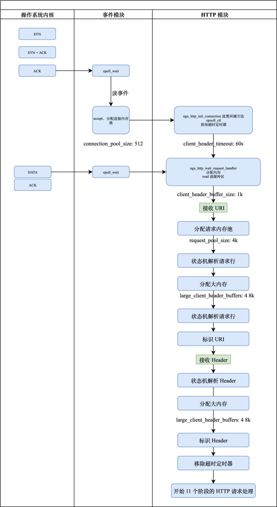

### Nginx中的正则表达式

小括号`()`之间匹配的内容，可以在后面通过`$1`来引用，`$2`表示的是前面第二个`()`里的内容。

### HTTP请求处理时的11个阶段

#### 一个请求是怎样在Nginx中被处理的


**一个HTTP请求在Nginx内部的抽象化处理流程：**

1. 当一个请求进入到图中黄色的框 也就是Nginx之中时，先进行 `Read Request Headers`，即读取到请求的头部，并且决定使用哪一个server块的配置去处理这个请求；
2. 随后进入 `Indentify Configuration Block` 中寻找哪一个 location 的配置生效了;
3. 在 `Apply Rate Limits` 中去决定是否要对其执行 限速（例如连接数太多了超出了限制，或者每秒发送的速率太高了，需要进行限速）；
4. 在 `Perform Authentication` 中进行权限验证；
5. 在 `Generate Content` 中生成HTTP响应，为了生成响应，有时候当Nginx作为反向代理时可能需要跟上游的服务器进行交互，这时就需要进入 `Upstream Services` 中执行，将上游服务器转发给Nginx的内容作为响应内容；
6. 在向用户返回请求的时候，需要经过 `Response Filters` 过滤模块，比如通过gzip对还没有压缩的文件进行压缩；
7. 当发送给用户的时候，还会进入 `Log` 中记录一条 access日志；
8. 在上面的流程中有时可能会产生自请求或者重定向，这时就需要进入 `Internal redirects and subrequests` 这个黄色模块中。


#### 真实的11个处理阶段

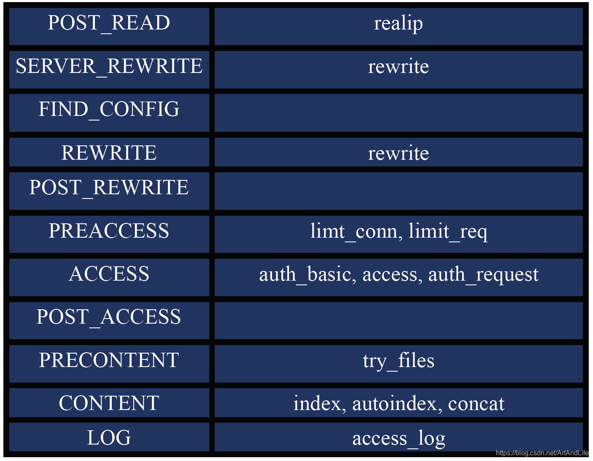

1. `POST_READ`：在Read到HTTP请求的头部之后的阶段，由 realip模块 负责本阶段的处理，它的作用是在 刚刚读入HTTP头部、没有做任何加工之前，来获取一些原始的数据（例如获取浏览器客户端的IP地址和端口号等）；
2. `SERVER_REWRITE`： 由 rewrite模块 负责处理；
3. `FIND_CONFIG`：负责做 location{ } 的匹配；
   （注：location{} 配置块可以出现在 server配置块和 location配置块 中，即location配置块可以嵌套；
   而 server{} 配置块只能出现在 http配置块内，不能嵌套。）
   （location 的匹配顺序：“=” 完全匹配；“^~” 匹配上后则不再进行正则表达式匹配；“@” 用于内部跳转。）
4. `REWRITE`：同样由 rewrite模块 来负责处理；
5. `POST_WRITE`：在 REWRITE阶段后的阶段，目前没有模块处理这个阶段（包括官方模块）；
6. `PREACCESS`：在ACCCESS之前的访问权限的确认，主要由 limit_conn模块 和 limit_req 模块负责处理：
   *limit_conn* ：判断是否已经达到了最大连接数的限制；（ngx_http_limit_conn_module：限制同一客户端的并发连接数）
   *limit_req* ：判断是否已经达到了每秒最大请求数，此时要限制访问速度，并不是客户端就不能访问了；（ngx_http_limit_req_module：把突发的流量限制为恒定的每秒限制多少个请求）
7. `ACCESS`：用于判断浏览器“能不能访问”它所请求的资源，由以下几个模块负责处理：
   * *access* ：根据 用户访问的IP 判断访问权限；（模块：ngx_http_access_module；指令：access – 允许某个address访问、deny – 禁止某个address访问）
   * *auto_basic* ：根据 用户名和密码 判断访问权限；（模块：ngx_http_auth_basic_module）
   * *auth_request* ：根据一个第三方的服务来判断访问权限（一般是上传到应用服务器上去进行用户名密码验证）；（模块：ngx_http_auth_request_module\
8. `POST_ACCESS`：在ACCESS之后的处理阶段，在第三部分中没有模块会涉及到这一阶段；
9. `PRECONTENT`：在CONTENT之前的阶段，如 try_files 模块；
10. `CONTENT`：包括 index模块、autoindex模块、concat模块；
11. `LOG`：这一用于打印access日志，由 access_log模块 处理。

#### 11 个阶段的处理顺序

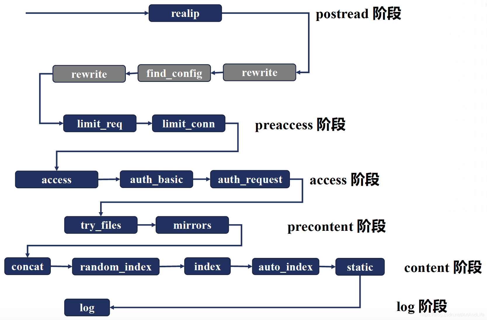

#### Postread 阶段

##### realip

#### rewrite 阶段

##### rewrite

###### if

```bash
if (表达式) {
}
```

1. 当表达式只是一个变量时，如果值为空或任何以0开头的字符串都会当做false
2. 直接比较变量和内容时，使用=或!=
3. -f和!-f用来判断是否存在文件
4. -d和!-d用来判断是否存在目录
5. -e和!-e用来判断是否存在文件或目录
6. -x和!-x用来判断文件是否可执行

##### find_config

###### location配置规则

| 匹配 | 规则                                                         |
| ---- | ------------------------------------------------------------ |
| =    | 严格匹配，如果请求匹配这个location，则停止搜索并且处理这个请求 |
| ~    | 区分大小写匹配（可用正则表达式）                             |
| ~*   | 不区分大小写匹配（可用正则表达式）                           |
| !~   | 区分大小写不匹配                                             |
| !~*  | 区分大小写不匹配                                             |
| ^~   | 前缀匹配                                                     |
| @    | “@” 定义一个命名的location，使用在内部定向时                 |
| /    | 通用匹配                                                     |

###### location 匹配顺序

- "="精确匹配，如果匹配成功，则停止其他匹配
- 普通字符串指令匹配，优先级是从长到短（匹配字符越多，则选择该匹配结果），匹配成功location如果使用 ^~，则停止匹配（正则匹配）
- 正则表达式正则匹配，按照从上到下的原则，匹配成功，则停止匹配
- 如果正则匹配成功，则使用该结果，否则使用普通字符串匹配

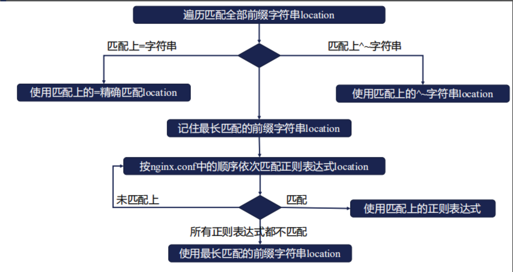

#### preaccess 阶段

##### limit_conn

##### limit_req

#### access 阶段

##### access

```bash
location / {
    deny  192.168.1.1;
    allow 192.168.1.0/24;
    allow 10.1.1.0/16;
    allow 2001:0db8::/32;
    deny  all;
}
```

###### allow

```bash
Syntax:	allow address | CIDR | unix: | all;
Default:	—
Context:	http, server, location, limit_except
```

###### deny

```bash
Syntax:	deny address | CIDR | unix: | all;
Default:	—
Context:	http, server, location, limit_except
```


##### auth_basic

##### auth_request

##### satisfy 指令

```bash
Syntax:	satisfy all | any;
Default:	satisfy all;
Context:	http, server, location
```

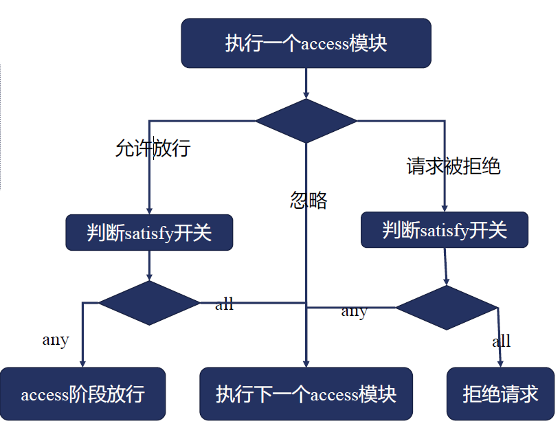

**执行一个access模块，会产生三个结果**

* 忽略，没有配置任何的指令关于这个模块，继续执行下一个access模块。
* 放行，验证通过放行
  * 判断satisfy开关，如果为any。access阶段放行通过。
  * 判断satisfy开关，如果为all。继续执行验证下面的一个access模块
* 拒绝，验证不通过拒绝
  * 判断satisfy开关，如果为any。继续执行验证下面一个access模块。
  * 判断satisfy开关，如果为all。拒绝请求.

#### precontent 阶段

##### try_files 指令

```bash
Syntax:	try_files file ... uri;
		try_files file ... =code;
Default:	—
Context:	server, location
```

其作用是按顺序检查文件是否存在，返回第一个找到的文件或文件夹(结尾加斜线表示为文件夹)，如果所有的文件或文件夹都找不到，会进行一个内部重定向到最后一个参数。

#### content 阶段

##### root 和 alias 指令

```bash
Syntax:	root path;
Default:	root html;
Context:	http, server, location, if in location

Syntax:	alias path;
Default:	—
Context:	location
```

将url映射为文件路径，以返回静态文件内容

**root 和 alias 的不同点：**

`root ` 会将完整url映射进文件路径中

`alias` 只会将location后的URL映射到文件路径

#### log 阶段


#### Http 的过滤模块

##### 替换响应中的字符串 sub模块

#####  在响应的前后添加内容 addition 模块

#### 变量

##### 变量运行原理

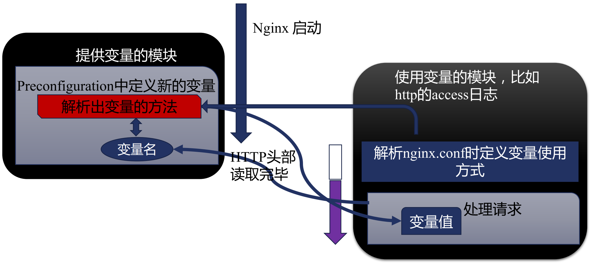

##### 变量的特性

* 惰性求值
* 变量值可以时刻变化，其值为使用的那一时刻的值

##### HTTP请求相关的变量

| 变量              | 说明                                                         |
| ----------------- | ------------------------------------------------------------ |
| arg_参数名        | URL中某个具体参数的值                                        |
| query_string      | 与args变量完全相同                                           |
| args              | 全部URL参数                                                  |
| is_args           | 如果请求URL中由参数则返回 ? 否则返回空                       |
| content_length    | HTTP请求中标识包体长度的Content_Length头部的值               |
| content_type      | 标识请求包体类型的Content_Type头部的值                       |
| uri               | 请求URI（不同于URL，不包括 ? 后的参数）                      |
| document_uri      | 与uri完全相同                                                |
| request_uri       | 请求的URL（包括URI以及完整的参数）                           |
| scheme            | 协议名，例如HTTP或者HTTPS                                    |
| request_method    | 请求方法，例如GET或者POST                                    |
| request_length    | 所有请求内容的大小，包括请求行、头部、包体等                 |
| remote_user       | 由HTTP Basic Authentication 协议传入的用户名                 |
| request_body_file | 临时存放请求包体的文件                                       |
| request_body      | 请求中的包体，这个变量当且仅当使用反向代理，且设定用内存暂存包体时才有效 |
| request           | 原始的url请求，含有方法与协议版本，例如 GET /?a=1&b=22 HTTTP/1.1 |
| host              | 先从请求行中获取，如果含有Host头部，则用其值替换掉请求行中的主机名，如果前两者都取不到，则使用匹配上的server_name |
| Http_头部名字     | 返回一个具体请求头部的值<br />特殊情况 ` http_host/http_user_agent/http_referer/http_via/http_x_forwarded_for/http_cookie` |

##### TCP链接相关的变量

| 变量                | 说明                                                     |
| ------------------- | -------------------------------------------------------- |
| binary_remote_addr  | 客户端地址的整型格式，对于IPv4是4字节，对于IPv6是16字节  |
| connection          | 递增的链接序号                                           |
| connection_requests | 当前连接上执行过的请求数，对keepalive连接有意义          |
| remote_addr         | 客户端地址                                               |
| remote_port         | 客户端端口                                               |
| proxy_protocol_addr | 若使用了proxy_protocal协议则返回协议中的地址，否则返回空 |

##### Nginx 处理请求过程中产生的变量

| 变量               | 说明                                                         |
| ------------------ | ------------------------------------------------------------ |
| request_time       | 请求处理到现在的耗时，单位为秒，精确到毫秒                   |
| server_name        | 匹配上请求的server_name值                                    |
| https              | 如果开启了TLS/SSL,则返回on，否则返回空                       |
| request_completion | 若请求处理完则返回OK，否则返回空                             |
| request_id         | 以16进制输出请求标识id，该id共含有16个字节，是随机生成的     |
| request_filename   | 待访问文件的完整路径                                         |
| document_root      | 由URI和root/alias规则生成的文件夹路径                        |
| realpath_root      | 将document_root中的软连接等换成真实路径                      |
| limit_rate         | 返回客户端响应时的速度上限，单位为每秒字节数。可以通过set指令修改对请求产生效果 |

##### 发送HTTP响应时相关的变量

| 变量               | 说明                   |
| ------------------ | ---------------------- |
| body_bytes_sent    | 响应中body包体的长度   |
| bytes_sent         | 全部http响应的长度     |
| status             | http响应中的返回码     |
| sent_trailer_名字  | 把响应结尾内容里值返回 |
| sent_http_头部名字 | 响应中某个具体头部的值 |

##### Nginx系统变量

| 变量          | 说明                                                   |
| ------------- | ------------------------------------------------------ |
| time_local    | 以本地时间标准输出大的当前时间                         |
| time_iso8601  | 使用ISO 8601标准输出当前时间                           |
| nginx_version | Nginx版本号                                            |
| pid           | 所属worker进程的进程id                                 |
| pipe          | 使用了管道则返回`p`，否则返回`.`                       |
| hostname      | 所在服务器的主机名，与hostname命令输出一致             |
| msee          | 1970年1月1日到现在的时间，单位为秒，小数点后精确到毫秒 |

#### referer 模块指令


#### map模块： 通过映射新变量提供更多的可能性


#### split_clients 模块：实现AB测试


## 负载均衡

### Nginx 在 [AKF立方体](./理论.md#AKF 立方体)上的应用

* **Y轴** 基于URL对功能进行分发
* **X轴** 基于Round-Robin或者least-connected算法分发请求
* **Z轴** 将用户IP地址或者其他信息映射到某个特定的服务或者集群

### 支持多种协议的反向代理

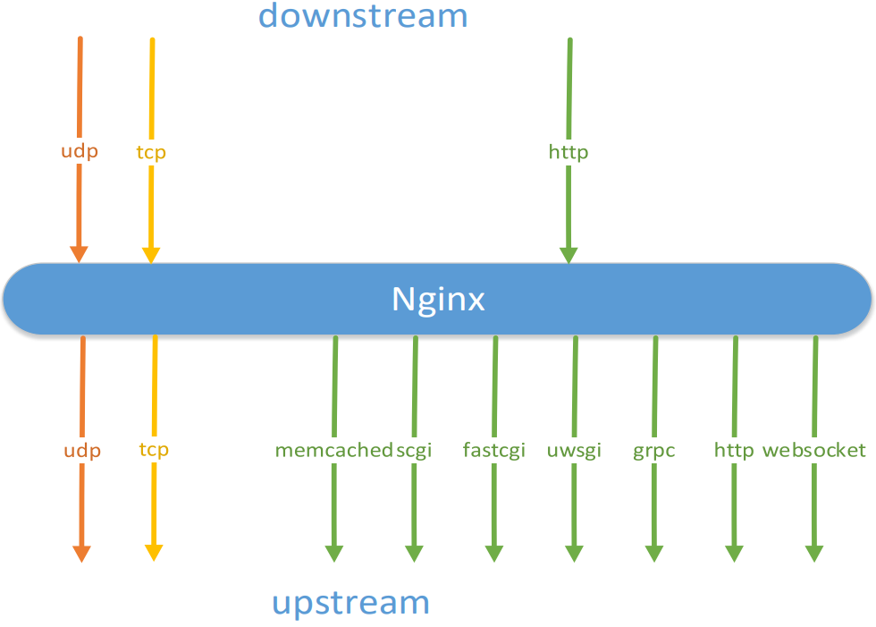

#### 指定上游服务地址的 upstream 与 server 指令

```bash
Syntax:	upstream name { ... }
Default:	—
Context:	http

Syntax:	server address [parameters];
Default:	—
Context:	upstream
```

#### 对上游服务使用 keepalive

通过服用连接降低nginx与上游服务器建立、关闭连接的消耗，提升吞吐量的同时降低时延

```bash
proxy_http_version 1.1;
proxy_set_header Connection "";
```

### 负载均衡算法

#### 加权Round-Robin

在加权轮询的方式访问server指令指定的上游服务。

##### 指令

* **weight**  服务访问的权重，默认是1
* **max_conns** server的最大并发连接数，仅作用于单worker进程。默认是0，表示没有限制。
* **max_fails** 在 fail_timeout时间段内，最大的失败次数。当达到最大失败时，会在fail_timeout秒内这台server不允许再次被选择。
* **fail_timeout** 单位为秒，默认值为10秒。具有2个功能：
  * 指定一段时间内，最大的失败次数 max_fails。
  *  到达max_fails后，该server不能访问的时间。

#### ip_hash

以客户端的IP地址作为hash算法的关键字，映射到特定的上游服务器中

* 对IPV4地址使用前3个字节作为关键字，对IPV6则使用完整地址
* 可以基于realip模块修改用于执行算法的IP地址

```bash
Syntax:	ip_hash;
Default:	—
Context:	upstream
```

#### hash

通过指定关键字作为 hash key，基于hash算法映射到特定的上游服务器中。

* 关键字可以含有变量、字符串

```bash
Syntax:	hash key [consistent];
Default:	—
Context:	upstream
```

#### 一致性hash算法

##### hash 算法的问题

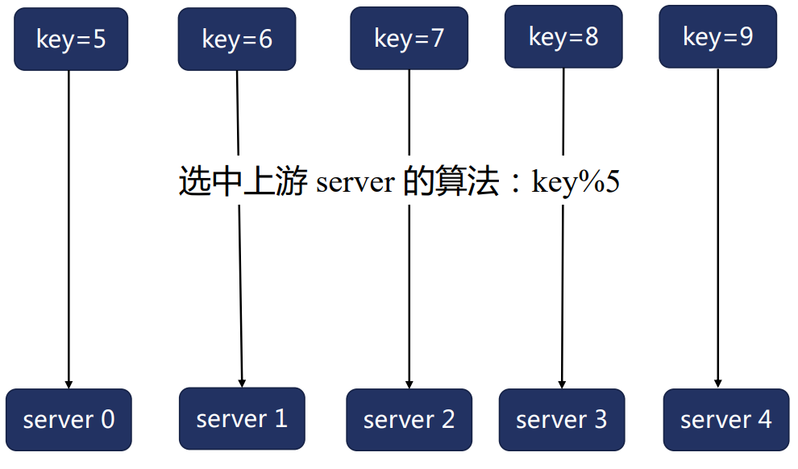

宕机或者扩容时，hash算法引发大量路由变更，可能导致缓存大范围失效

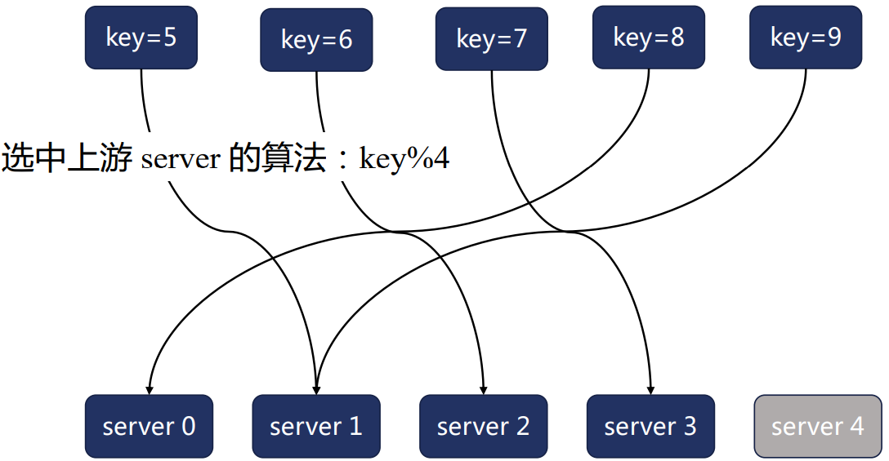

##### 一致性Hash算法：扩容前

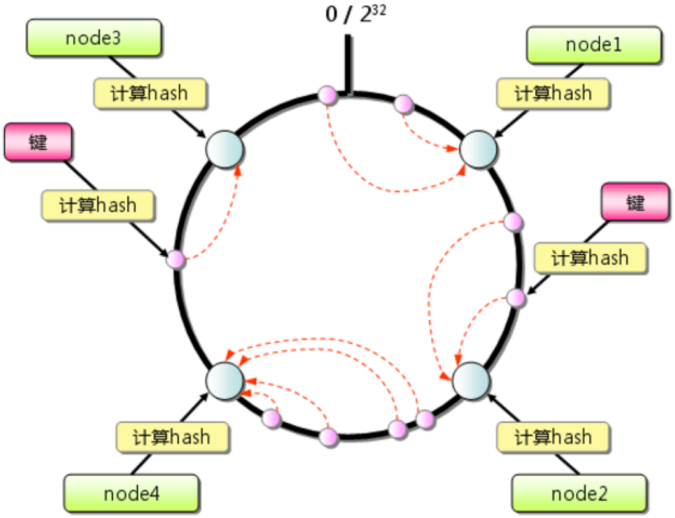

##### 一致性Hash算法：扩容后

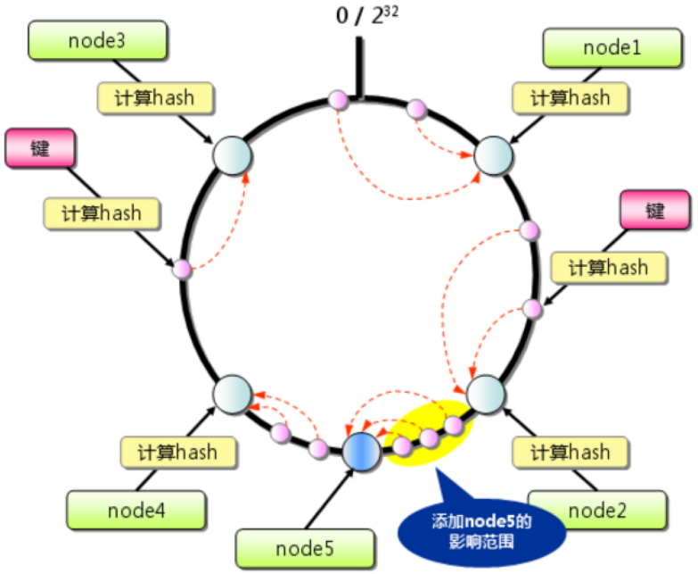


#### 最少连接

upstream_least_conn模块，从所有上游服务器中，找出当前并发连接数最少的一个，将请求转发到它。

* 如果出现多个最少连接服务器的连接数都一样，使用round-robin算法。

```bash
Syntax:	least_conn;
Default:	—
Context:	upstream
```

### upstream 模块提供的变量

| 变量                     | 说明                                                         |
| ------------------------ | ------------------------------------------------------------ |
| upstream_addr            | 上游服务器的ip地址，格式为可读字符串，例如127.0.0.1:8012     |
| upstream_connect_time    | 与上游服务建立连接消耗的时间，单位为秒，精确到毫秒           |
| upstream_header_time     | 接收上游服务发回响应中http头部所消耗的时间，单位为秒，精确到毫秒 |
| upstream_response_time   | 接收完整的上游服务响应所消耗的时间，单位为秒，精确到毫秒     |
| upstream_http_名称       | 从上游服务返回的响应头部的值                                 |
| upstream_bytes_received  | 从上游服务接收到的响应长度，单位为字节                       |
| upstream_response_length | 从上游服务返回的响应包体长度，单位为字节                     |
| upstream_status          | 从上游服务返回的HTTP响应中的状态码，如果未连接上，该变量值为502 |
| upstream_cookie_名称     | 从上游服务返回的响应头Set-Cookie中取出的cookie值             |
| upstream_trailer_名称    | 从上游服务的响应尾部取到的值                                 |

## 反向代理

### Http 反向代理

#### 工作流程

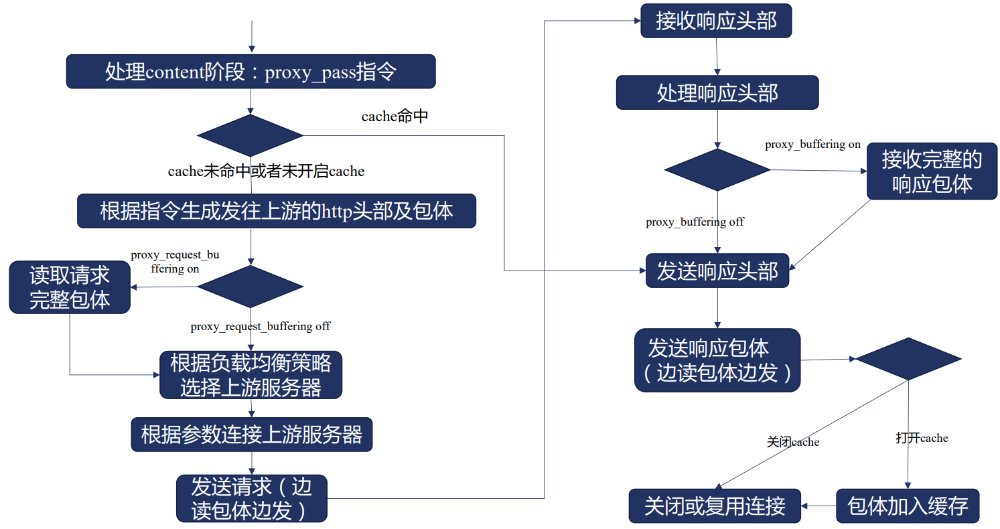

#### proxy_pass

对上游服务使用http/https协议进行反向代理

 ```bash
 Syntax:	proxy_pass URL;
 Default:	—
 Context:	location, if in location, limit_except
 ```

##### URL 参数规则

* URL必须以`http://`或者`https://`开头，接下来时域名、IP、unix socket地址或者upstream的名字，前两者可以在域名或者ip后加端口。最后时可选的URI。
* 当URL参数中携带URI与否，会导致发向上游请求的URL不同
  * 不携带URI，则将客户端请求中的URL直接转发给上游
    * location 后使用正则表达式、@名字时，应采用这种方式
  * 携带URI，则对用户请求中的URL作如下操作
    * 将location参数中匹配上的一段替换为该URI
* 该URL参数中可以携带变量
* 更复杂的URL替换，可以在location内的配置添加rewrite break语句

#### 生成发往上游的http头部及包体

##### proxy_request_buffering

接收客户端请求的包体，收完再转发换时边收边转发

```bash
Syntax:	proxy_request_buffering on | off;
Default:	proxy_request_buffering on;
Context:	http, server, location
```

###### on

* 客户端网速慢

* 上游服务并发处理能力低
* 适应高吞吐量场景

###### off

* 更及时的响应
* 降低nginx读写磁盘消耗
* 一旦开始发送内容 `proxy_next_upstream`功能失败

##### 客户端包体的接收

```bash
Syntax:	client_body_buffer_size size;
Default:	client_body_buffer_size 8k|16k;
Context:	http, server, location

Syntax:	client_body_in_single_buffer on | off;
Default:	client_body_in_single_buffer off;
Context:	http, server, location
```

存在包体时，接收包体所分配的内存

* 若接收头部时已经接受完全部包体，则不分配
* 若剩余待接收包体长度小于`client_body_buffer_size`,则仅分配所需大小
* 分配`client_body_buffer_size`大小内存接收包体
  * 关闭包体缓存时，该内存上内容及时发送给上游
  * 打开包体缓存，该段大小内存用完时，写入临时文件，释放内存

##### 最大包体长度限制

```bash
Syntax:	client_max_body_size size;
Default:	client_max_body_size 1m;
Context:	http, server, location
```

仅对请求头部中含有`Content-Length`有效超出最大长度后，返回413错误

##### 临时文件路径格式

```bash
Syntax:	client_body_temp_path path [level1 [level2 [level3]]];
Default:	client_body_temp_path client_body_temp;
Context:	http, server, location

Syntax:	client_body_in_file_only on | clean | off;
Default:	client_body_in_file_only off;
Context:	http, server, location
```


#### 向上游服务建立连接

```bash
# 超时后，会向客户端生成http响应，响应码为502
Syntax:	proxy_connect_timeout time;
Default:	proxy_connect_timeout 60s;
Context:	http, server, location

# 跟上游服务器建立连接失败后的处理方式，更换一台新的服务器什么的
Syntax:	proxy_next_upstream error | timeout | invalid_header | http_500 | http_502 | http_503 | http_504 | http_403 | http_404 | http_429 | non_idempotent | off ...;
Default:	proxy_next_upstream error timeout;
Context:	http, server, location
```

##### 上游连接启用TCP keepalive

```bash
Syntax:	proxy_socket_keepalive on | off;
Default:	proxy_socket_keepalive off;
Context:	http, server, location
```

##### 上游连接启用HTTP keepalive

```bash
Syntax:	keepalive connections;
Default:	—
Context:	upstream

Syntax:	keepalive_requests number;
Default:	keepalive_requests 1000;
Context:	upstream
```

设置通过一个keepalive连接可以服务的最大请求数。在发出最大的请求数后，连接被关闭。

为了释放每个连接分配的内存，定期关闭连接是必要的。因此，使用过高的最大请求数可能会导致过多的内存使用，不建议使用。

##### 修改TCP连接中的 local address

```bash
Syntax:	proxy_bind address [transparent] | off;
Default:	—
Context:	http, server, location
```

* 可以使用变量 `proxy_bind $remote_addr;`
* 可以使用不属于所在机器的IP地址 `proxy_bind $remote_addr transparent;`

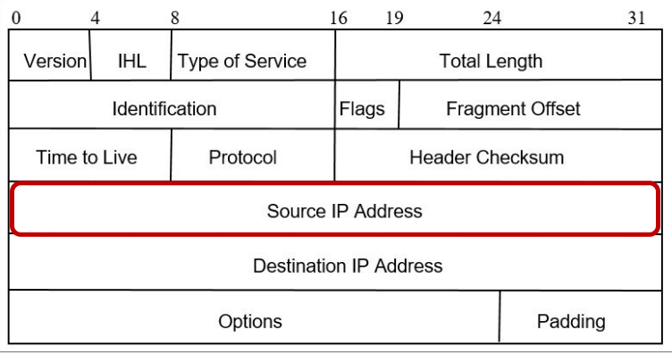

##### 当客户端关闭连接时

```bash
Syntax:	proxy_ignore_client_abort on | off;
Default:	proxy_ignore_client_abort off;
Context:	http, server, location
```

##### 向上游发送HTTP请求

```bash
Syntax:	proxy_send_timeout time;
Default:	proxy_send_timeout 60s;
Context:	http, server, location
```

##### 接收上游的HTTP响应头部

```bash
Syntax:	proxy_buffer_size size;
Default:	proxy_buffer_size 4k|8k;
Context:	http, server, location
```

这个值限定了上游http response中header的最大值。如果超出限制，会在 `error.log` 中出现 `upstream sent to big header`

##### 处理上游响应的头部

###### 禁用上游响应头部的功能

```bash
Syntax:	proxy_ignore_headers field ...;
Default:	—
Context:	http, server, location
```

某些响应头部可以改变nginx的行为，使用proxy_ignore_headers可以禁止它们生效

* 可以禁用功能的头部

  * X-Accel-Redirect： 由上游服务指定在nginx内部重定向，控制请求的执行
  * X-Accel-Limit-Rate：由上游设置发往客户端的速度限制，等同limit_rate指令
  * X-Accel-Buffering：由上游控制是否缓存上游的响应
  * X-Accel-Charset：由上游控制Content-Type中的Charset

  * 缓存相关：
    * X-Accel-Expires： 设置响应在nginx中的缓存时间，单位秒；@开头表示一天内某时刻
    * Expires：控制nginx缓存时间，优先级低于X-Accel-Expires
    * Cache-Control：控制nginx缓存时间，优先级低于X-Accel-Expires
    * Set-Cookie：响应中出现Set-Cookie则不缓存，可通过proxy_ignore_headers禁止生效
    * Vary：响应中出现Vary：*则不缓存，同样可禁止生效

#### 缓存

##### 浏览器缓存


* 优点
  * 使用有效缓存时，没有网络消耗，速度最快
  * 即使由网络消耗，但对失效缓存使用304响应做到网络流量消耗最小化
* 缺点
  * 仅提升一个用户的体验

###### Etag

**`ETag`**HTTP 响应头是资源的特定版本的标识符。这可以让缓存更高效，并节省带宽，因为如果内容没有改变，Web 服务器不需要发送完整的响应。而如果内容发生了变化，使用 ETag 有助于防止资源的同时更新相互覆盖（“空中碰撞”）。

如果给定 URL 中的资源更改，则一定要生成新的 Etag 值。 因此 Etags 类似于指纹，也可能被某些服务器用于跟踪。 比较 etags 能快速确定此资源是否变化，但也可能被跟踪服务器永久存留。

```
ETag: W/"<etag_value>"
ETag: "<etag_value>"
```

`W/` 可选

`'W/'`(大小写敏感) 表示使用[弱验证器](https://developer.mozilla.org/zh-CN/docs/Web/HTTP/Conditional_requests#weak_validation)。 弱验证器很容易生成，但不利于比较。 强验证器是比较的理想选择，但很难有效地生成。 相同资源的两个弱`Etag`值可能语义等同，但不是每个字节都相同。

"<etag_value>"

实体标签唯一地表示所请求的资源。 它们是位于双引号之间的 ASCII 字符串（如“675af34563dc-tr34”）。 没有明确指定生成 ETag 值的方法。 通常，使用内容的散列，最后修改时间戳的哈希值，或简单地使用版本号。 例如，MDN 使用 wiki 内容的十六进制数字的哈希值。


###### If-None-Match

**`If-None-Match`** 是一个条件式请求首部。对于 GET[`GET`](https://developer.mozilla.org/zh-CN/docs/Web/HTTP/Methods/GET) 和 [`HEAD`](https://developer.mozilla.org/zh-CN/docs/Web/HTTP/Methods/HEAD) 请求方法来说，当且仅当服务器上没有任何资源的 [`ETag`](https://developer.mozilla.org/zh-CN/docs/Web/HTTP/Headers/ETag) 属性值与这个首部中列出的相匹配的时候，服务器端才会返回所请求的资源，响应码为 [`200`](https://developer.mozilla.org/zh-CN/docs/Web/HTTP/Status/200) 。对于其他方法来说，当且仅当最终确认没有已存在的资源的 [`ETag`](https://developer.mozilla.org/zh-CN/docs/Web/HTTP/Headers/ETag) 属性值与这个首部中所列出的相匹配的时候，才会对请求进行相应的处理。

对于 [`GET`](https://developer.mozilla.org/zh-CN/docs/Web/HTTP/Methods/GET) 和 [`HEAD`](https://developer.mozilla.org/zh-CN/docs/Web/HTTP/Methods/HEAD) 方法来说，当验证失败的时候，服务器端必须返回响应码 304（Not Modified，未改变）。对于能够引发服务器状态改变的方法，则返回 412（Precondition Failed，前置条件失败）。需要注意的是，服务器端在生成状态码为 304 的响应的时候，必须同时生成以下会存在于对应的 200 响应中的首部：Cache-Control、Content-Location、Date、ETag、Expires 和 Vary 。

[`ETag`](https://developer.mozilla.org/zh-CN/docs/Web/HTTP/Headers/ETag) 属性之间的比较采用的是**弱比较算法**，即两个文件除了每个字节都相同外，内容一致也可以认为是相同的。例如，如果两个页面仅仅在页脚的生成时间有所不同，就可以认为二者是相同的。

当与 [`If-Modified-Since`](https://developer.mozilla.org/zh-CN/docs/Web/HTTP/Headers/If-Modified-Since) 一同使用的时候，If-None-Match 优先级更高（假如服务器支持的话）。

以下是两个常见的应用场景：

- 采用 [`GET`](https://developer.mozilla.org/zh-CN/docs/Web/HTTP/Methods/GET) 或 [`HEAD`](https://developer.mozilla.org/zh-CN/docs/Web/HTTP/Methods/HEAD) 方法，来更新拥有特定的[`ETag`](https://developer.mozilla.org/zh-CN/docs/Web/HTTP/Headers/ETag) 属性值的缓存。
- 采用其他方法，尤其是 [`PUT`](https://developer.mozilla.org/zh-CN/docs/Web/HTTP/Methods/PUT)，将 `If-None-Match` used 的值设置为 * ，用来生成事先并不知道是否存在的文件，可以确保先前并没有进行过类似的上传操作，防止之前操作数据的丢失。这个问题属于[更新丢失问题](https://www.w3.org/1999/04/Editing/#3.1)的一种。

###### If-Modified-Since

**`If-Modified-Since`** 是一个条件式请求首部，服务器只在所请求的资源在给定的日期时间之后对内容进行过修改的情况下才会将资源返回，状态码为 [`200`](https://developer.mozilla.org/zh-CN/docs/Web/HTTP/Status/200) 。如果请求的资源从那时起未经修改，那么返回一个不带有消息主体的 [`304`](https://developer.mozilla.org/zh-CN/docs/Web/HTTP/Status/304) 响应，而在 [`Last-Modified`](https://developer.mozilla.org/zh-CN/docs/Web/HTTP/Headers/Last-Modified) 首部中会带有上次修改时间。 不同于 [`If-Unmodified-Since`](https://developer.mozilla.org/zh-CN/docs/Web/HTTP/Headers/If-Unmodified-Since), `If-Modified-Since` 只可以用在 [`GET`](https://developer.mozilla.org/zh-CN/docs/Web/HTTP/Methods/GET) 或 [`HEAD`](https://developer.mozilla.org/zh-CN/docs/Web/HTTP/Methods/HEAD) 请求中。

当与 [`If-None-Match`](https://developer.mozilla.org/zh-CN/docs/Web/HTTP/Headers/If-None-Match) 一同出现时，它（**`If-Modified-Since`**）会被忽略掉，除非服务器不支持 `If-None-Match`。

最常见的应用场景是来更新没有特定 [`ETag`](https://developer.mozilla.org/zh-CN/docs/Web/HTTP/Headers/ETag) 标签的缓存实体。

###### If-Match

请求首部 **`If-Match`** 的使用表示这是一个条件请求。在请求方法为 [`GET`](https://developer.mozilla.org/zh-CN/docs/Web/HTTP/Methods/GET) 和 [`HEAD`](https://developer.mozilla.org/zh-CN/docs/Web/HTTP/Methods/HEAD) 的情况下，服务器仅在请求的资源满足此首部列出的 `ETag`值时才会返回资源。而对于 [`PUT`](https://developer.mozilla.org/zh-CN/docs/Web/HTTP/Methods/PUT) 或其他非安全方法来说，只有在满足条件的情况下才可以将资源上传。

[`ETag`](https://developer.mozilla.org/zh-CN/docs/Web/HTTP/Headers/ETag) 之间的比较使用的是**强比较算法**，即只有在每一个字节都相同的情况下，才可以认为两个文件是相同的。在 ETag 前面添加 `W/` 前缀表示可以采用相对宽松的算法。

以下是两个常见的应用场景：

- 对于 [`GET`](https://developer.mozilla.org/zh-CN/docs/Web/HTTP/Methods/GET) 和 [`HEAD`](https://developer.mozilla.org/zh-CN/docs/Web/HTTP/Methods/HEAD) 方法，搭配 [`Range`](https://developer.mozilla.org/zh-CN/docs/Web/HTTP/Headers/Range)首部使用，可以用来保证新请求的范围与之前请求的范围是对同一份资源的请求。如果 ETag 无法匹配，那么需要返回 [`416`](https://developer.mozilla.org/zh-CN/docs/Web/HTTP/Status/416)` `(Range Not Satisfiable，范围请求无法满足) 响应。
- 对于其他方法来说，尤其是 [`PUT`](https://developer.mozilla.org/zh-CN/docs/Web/HTTP/Methods/PUT), `If-Match` 首部可以用来避免[更新丢失问题](https://www.w3.org/1999/04/Editing/#3.1)。它可以用来检测用户想要上传的不会覆盖获取原始资源之后做出的更新。如果请求的条件不满足，那么需要返回 [`412`](https://developer.mozilla.org/zh-CN/docs/Web/HTTP/Status/412) (Precondition Failed，先决条件失败) 响应。

###### If-Unmodified-Since

HTTP 协议中的 **`If-Unmodified-Since`** 消息头用于请求之中，使得当前请求成为条件式请求：只有当资源在指定的时间之后没有进行过修改的情况下，服务器才会返回请求的资源，或是接受 [`POST`](https://developer.mozilla.org/zh-CN/docs/Web/HTTP/Methods/POST) 或其他 non-[safe](https://developer.mozilla.org/zh-CN/docs/Glossary/Safe) 方法的请求。如果所请求的资源在指定的时间之后发生了修改，那么会返回 [`412`](https://developer.mozilla.org/zh-CN/docs/Web/HTTP/Status/412) (Precondition Failed) 错误。

常见的应用场景有两种：

- 与 non-[safe](https://developer.mozilla.org/zh-CN/docs/Glossary/Safe) 方法如 [`POST`](https://developer.mozilla.org/zh-CN/docs/Web/HTTP/Methods/POST) 搭配使用，可以用来[优化并发控制](https://en.wikipedia.org/wiki/Optimistic_concurrency_control)，例如在某些 wiki 应用中的做法：假如在原始副本获取之后，服务器上所存储的文档已经被修改，那么对其作出的编辑会被拒绝提交。
- 与含有 [`If-Range`](https://developer.mozilla.org/zh-CN/docs/Web/HTTP/Headers/If-Range) 消息头的范围请求搭配使用，用来确保新的请求片段来自于未经修改的文档。


##### nginx 缓存

* 优点
  * 提升所有用户的体验
  * 相比浏览器缓存，有效降低上游服务的负载
  * 通过304响应减少nginx与上游服务间的流量消耗
* 缺点
  * 用户仍然保持网络消耗


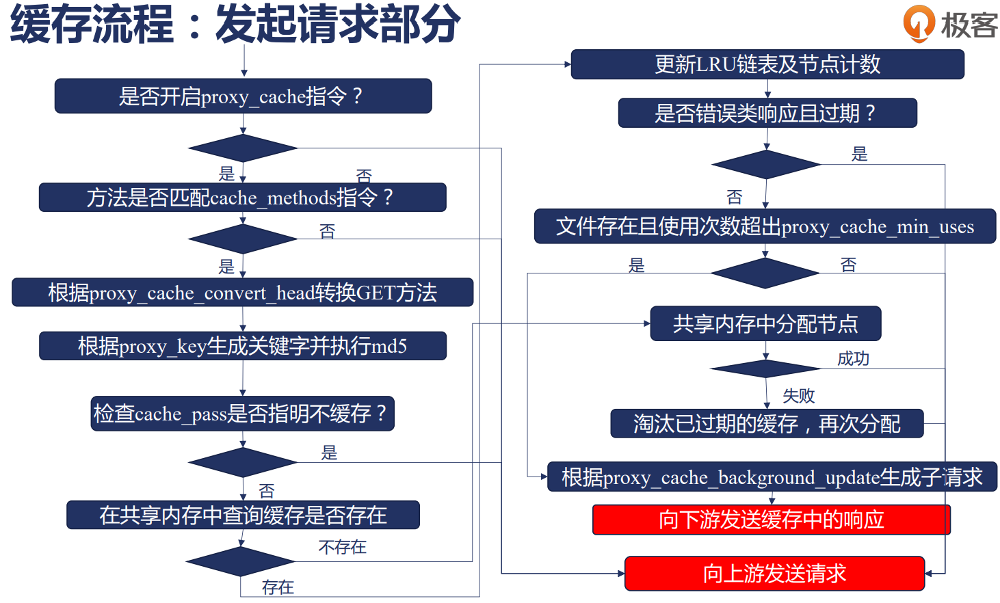

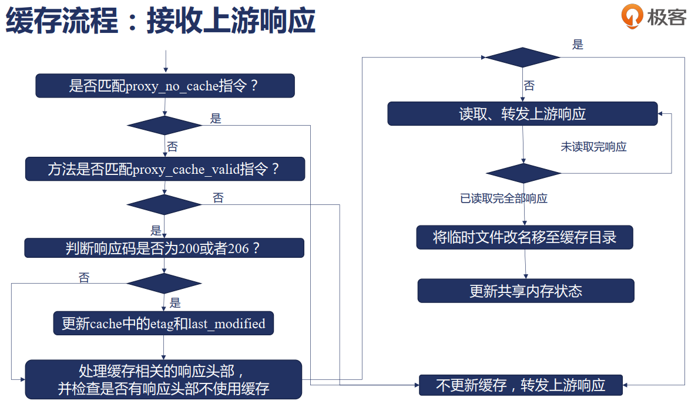)

##### 缓存设置

```bash
Syntax:		proxy_cache zone | off;
Default:	proxy_cache off;
Context:	http, server, location
```

```bash
Syntax:		proxy_cache_path path [levels=levels] [use_temp_path=on|off] keys_zone=name:size [inactive=time] [max_size=size] 				[min_free=size] [manager_files=number] [manager_sleep=time] [manager_threshold=time] [loader_files=number] 						[loader_sleep=time] [loader_threshold=time] [purger=on|off] [purger_files=number] [purger_sleep=time] 							[purger_threshold=time];
Default:	—
Context:	http
```

* **path** 定义缓存文件存放位置

* **levels** 定义缓存路径的目录层级，最多3级，每层目录长度为1或者2字节

* **use_temp_path** 

  * **on** 使用prxoy_temp_path定义的临时目录
  * **off** 直接使用path路径存放临时文件

* **keys_zone** 

  * **name**  是共享内存名字，由`proxy_cache`指令使用
  * **size** 是共享内存大小，1MB大约可以存放8000个KEY

* **inactive** 

  * 在inactive时间内没有被访问的缓存，会被淘汰掉
  * 默认10分钟

* **max_size** 设置最大的缓存文件大小，超出后由cache manager进程按LRU链表淘汰

* **min_free** 最小可用空间量

* **manager_files** 

  * cache manager进程在1次淘汰过程中，淘汰的最大文件数
  * 默认100

* **manager_sleep** 

  * 执行一次淘汰循环后cache manager 进程的休眠时间
  * 默认200ms

* **manager_threshold** 

  * 执行一次淘汰循环的最大耗时
  * 默认 50ms

* **loader_files**

  * cache loader 进程载入磁盘中缓存文件至共享内存，每批最多处理的文件数
  * 默认100

* **loader_sleep** 

  * 执行一次缓存文件至共享内存后，进程休眠的时间

  * 载入默认200ms

* **loader_threahold**

  * 每次载入缓存文件至共享内存的最大耗时
  * 默认50ms


**对那写method方法使用缓存返回响应**

```bash
Syntax:		proxy_cache_methods GET | HEAD | POST ...;
Default:	proxy_cache_methods GET HEAD;
Context:	http, server, location
```


**设置缓存的key**

```bash
Syntax:		proxy_cache_key string;
Default:	proxy_cache_key $scheme$proxy_host$request_uri;
Context:	http, server, location
```

**设定缓存什么样的响应**

```bash
Syntax:		proxy_cache_valid [code ...] time;
Default:	—
Context:	http, server, location
```

* 对不同的响应码缓存不等的时长
  * 例如： code 404 5m
* 只标识时间
  * 仅对一下响应码缓存
    * 200
    * 301
    * 302
* 通过上游响应头部控制缓存时长
  * `X-Accel-Expires` 单位秒
    * 为0时表示禁止nginx缓存内容
    * 通过@设置缓存到一天中的某一时刻
  * 响应头若含有`Set-Cookie`则不缓存
  * 响应头含有`Vary:*`则不缓存

**参数为真时，响应不存入缓存**

```bash
Syntax:		proxy_no_cache string ...;
Default:	—
Context:	http, server, location
```

定义不将响应保存到缓存中的条件。如果字符串参数中至少有一个值不为空且不等于0，则响应将不被保存

**参数为真时，不使用缓存内容**

```bash
Syntax:		proxy_cache_bypass string ...;
Default:	—
Context:	http, server, location
```

定义不会从缓存中获取响应的条件。如果字符串参数的至少一个值不是空的，并且不等于“ 0”，则不会从缓存中获取响应

**变更HEAD方法**

```bash
Syntax:		proxy_cache_convert_head on | off;
Default:	proxy_cache_convert_head on;
Context:	http, server, location
```

启用或禁用将HEAD方法转换为用于缓存的GET。当转换被禁用时，缓存键应该配置为包含$request方法。

##### 决定浏览器缓存是否有效

**expires 指令**

```bash
Syntax:			expires [modified] time;
				expires epoch | max | off;
Default:		expires off;
Context:		http, server, location, if in location
```

* max 

  * Expires: Thu, 31 Dec 2037 23:55:55 GMT

  * Cache-Control: max-age=315360000(10年)

* off： 不添加或者修改`Expires`和`Cache-Control`字段

* epoch：

  * Expires：Thu, 01 Jan 1970 00:00:01 GMT
  * Cache-Control： no-cache

* time：设定具体时间，可以携带单位

  * 一天内的具体时刻可以加@，比如下午六点半：@18h30m
    * 设定号Expires，自动计算Cache-Control
    * 如果当前时间未超过当前的time时间，则Expires到当天time，否则时第二天的time时刻
  * 正数
    * 设定Cache-Control时间，计算出Expires
  * 负数
    * Cache-Control：no-cache，计算出Expires

**not_modified**

客户端拥有缓存，但不能确认缓存是否过期，于是在请求中传入`If_Modified-Since` 或者 `If-None-Match` 头部，该模块通过将其值与响应中的 `Last-Modified` 值相比较，决定时通过200返回全部内容，还时仅返回 304 Not Modified 头部，表示浏览器仍使用之前的缓存。

* 使用前提： 原返回响应码为200

```bash
Syntax:		if_modified_since off | exact | before;
Default:	if_modified_since exact;
Context:	http, server, location
```

* off 忽略请求中的`if_modified_since` 头部
* exact 精确匹配`if_modified_since` 头部与 `last_modified` 的值
* before 若 `if_modified_since` 大于等于 `last_modified` 的值，则返回 304

##### 合并回源请求--减轻峰值流量下的压力

 ```bash
 Syntax:		proxy_cache_lock on | off;
 Default:	proxy_cache_lock off;
 Context:	http, server, location
 ```

同一时间，仅第1个请求发向上游，其他请求等待第1个响应返回或者超时后，使用缓存响应客户端

```bash
Syntax:		proxy_cache_lock_age time;
Default:	proxy_cache_lock_age 5s;
Context:	http, server, location
```

上一个请求返回响应的超时时间，到达后在放行一个请求发向上游

```bash
Syntax:		proxy_cache_lock_timeout time;
Default:	proxy_cache_lock_timeout 5s;
Context:	http, server, location
```

等待第一个请求返回响应的最大时间，到达后直接向上游发送请求，但不缓存响应。

```bash
Syntax:		proxy_cache_use_stale error | timeout | invalid_header | updating | http_500 | http_502 | http_503 | http_504 | 				http_403 | http_404 | http_429 | off ...;
Default:	proxy_cache_use_stale off;
Context:	http, server, location
```

确定在哪些情况下可以在与代理服务器通信期间使用过时的缓存响应。

###### 定义陈旧缓存的用法

* **updateing**

  * 当缓存内容过期，由一个请求正在访问上游试图更新缓存时，其他请求直接使用过期内容返回客户端
  * stale-while-revalidate 
    * 缓存呢绒过期后，定义一段时间，在这段时间`updating`设置有效，否则请求仍然访问上游服务
    * 例如： `Cache-Control:max-age=600;stale-while-revalidate=30`
  * stale-if-error
    * 缓存内容过期后，定义一段时间，在这段时间内上游服务出错后就继续使用缓存，否则请求仍然访问上游服务。`stale-while-revalidate`包括`stale-if-error`场景
    * 例如：`Cache-Control:max-age=600,stale-if-error=1200`

* **error** 当与上游建立连接、发送请求、读取响应头部等情况出错时，使用缓存

* **timeout** 当与上游建立连接、发送请求、读取响应头部等情况出现定时器超时，使用缓存

* **Http_(500|502|503|504|403|404|429)** 缓存以上错误响应码的内容

  

```bash
Syntax:		proxy_cache_background_update on | off;
Default:	proxy_cache_background_update off;
Context:	http, server, location
```

允许启动一个后台子请求来更新过期的缓存项，同时返回一个过时的缓存响应给客户端。注意，有必要在更新响应时允许使用过期的缓存响应。

```bash
Syntax:		proxy_cache_revalidate on | off;
Default:	proxy_cache_revalidate off;
Context:	http, server, location
```

更新缓存时，使用 `If-Modified-Since`和`If-None-Match` 作为请求头部，预期内容未发生变更时通过304来减少传输的内容

##### 清除缓存

商业版本由对应的指令，开源版本需要使用第三方模块

https://github.com/FRiCKLE/ngx_cache_purge


### 七层反向代理对照

* **uwsgi** 
* **fastcgi**
* **scgi**


#### 构造请求内容

|                  | uwsgi                      | fastcgi                      | scgi                      | http                       |
| ---------------- | -------------------------- | ---------------------------- | ------------------------- | -------------------------- |
| 指定上游         | uwsgi_pass                 | fastcgi_pass                 | scgi_pass                 | proxy_pass                 |
| 是否传递请求头部 | uwsgi_pass_request_headers | fastcgi_pass_request_headers | scgi_pass_request_headers | proxy_pass_request_headers |
| 是否船体请求包体 | uwsgi_pass_request_body    | fastcgi_pass_request_body    | scgi_pass_request_body    | proxy_pass_request_body    |
| 指定请求方法名   |                            |                              |                           | proxy_method               |
| 指定请求协议     |                            |                              |                           | proxy_http_version         |
| 增改请求头部     |                            |                              |                           | proxy_set_header           |
| 设置请求包体     |                            |                              |                           | proxy_set_body             |
| 是否缓存请求包体 | uwsgi_request_buffering    | fastcgi_request_buffering    | scgi_request_buffering    | proxy_request_buffering    |

#### 建立连接并发送请求

|                          | uwsgi                     | fastcgi                     | scgi                     | http                           |
| ------------------------ | ------------------------- | --------------------------- | ------------------------ | ------------------------------ |
| 连接上游超时时间         | uwsgi_connect_timeout     | fastcgi_connect_timeout     | scgi_connect_timeout     | proxy_connect_timeout          |
| 连接绑定地址             | uwsgi_bind                | fastcgi_bind                | scgi_bind                | proxy_bindshi                  |
| 使用TCP keepalive        | uwsgi_socket_keepalive    | fastcgi_socket_keepalive    | scgi_socket_keepalive    | proxy_socket_keepalive         |
| 忽略客户端关连接         | uwsgi_ignore_client_abort | fastcgi_ignore_client_abort | scgi_ignore_client_abort | proxy_ignore_client_abort      |
| 设置HTTP头部用到的哈希表 |                           |                             |                          | proxy_headers_hash_bucket_size |
| 设置HTTP头部用到的哈希表 |                           |                             |                          | proxy_headers_hash_max_size    |
| 发送请求超时时间         | uwsgi_send_timeout        | fastcgi_send_timeout        | scgi_send_timeout        | proxy_send_timeout             |

#### 接收上游响应

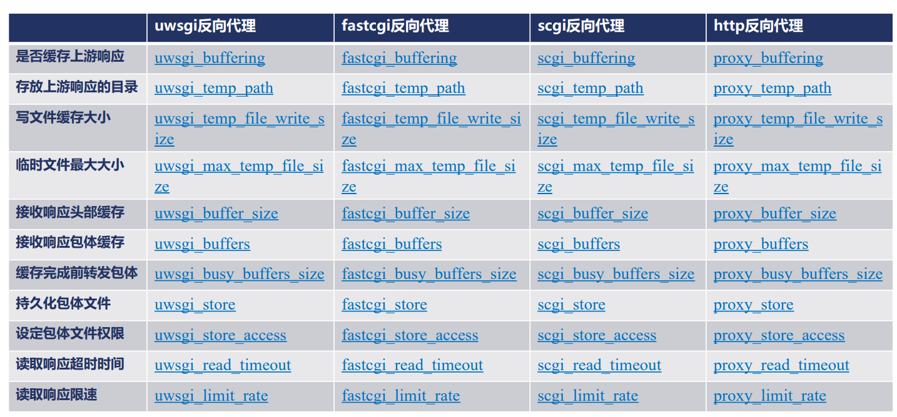

#### 转发响应


#### SSL

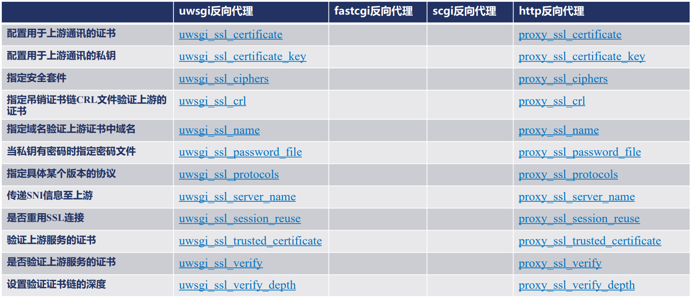


#### 缓存

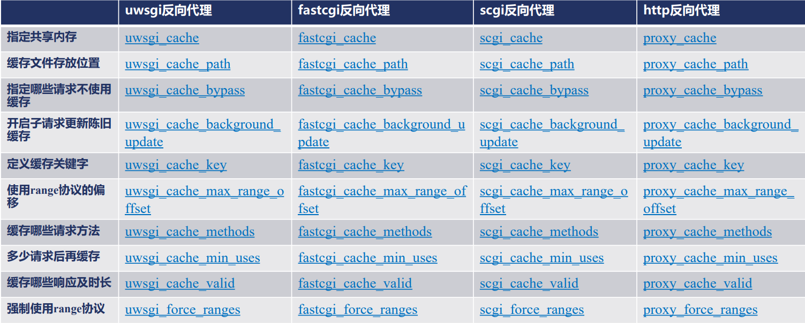

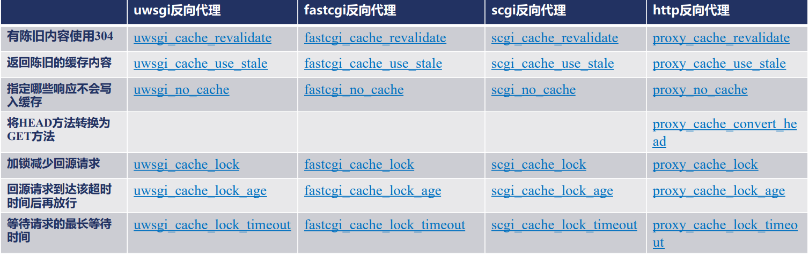

#### 独有配置

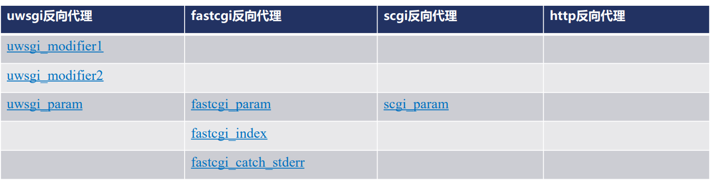


### websocket

开启websocket反向代理配置

```bash
proxy_http_version 1.1;
proxy_set_header Upgrade $http_upgrade;
proxy_set_header Connection "upgrade";
```

#### websocket协议帧

WebSocket客户端与服务端通信的最小单位是帧（frame），由1个或多个帧组成一条完整的消息（message）。即：发送端将消息切割成多个帧，并发送给服务端；服务端接收消息帧，并将关联的帧重新组装成完整的消息。

```text
  0                   1                   2                   3
  0 1 2 3 4 5 6 7 8 9 0 1 2 3 4 5 6 7 8 9 0 1 2 3 4 5 6 7 8 9 0 1
 +-+-+-+-+-------+-+-------------+-------------------------------+
 |F|R|R|R| opcode|M| Payload len |    Extended payload length    |
 |I|S|S|S|  (4)  |A|     (7)     |             (16/64)           |
 |N|V|V|V|       |S|             |   (if payload len==126/127)   |
 | |1|2|3|       |K|             |                               |
 +-+-+-+-+-------+-+-------------+ - - - - - - - - - - - - - - - +
 |     Extended payload length continued, if payload len == 127  |
 + - - - - - - - - - - - - - - - +-------------------------------+
 |                               |Masking-key, if MASK set to 1  |
 +-------------------------------+-------------------------------+
 | Masking-key (continued)       |          Payload Data         |
 +-------------------------------- - - - - - - - - - - - - - - - +
 :                     Payload Data continued ...                :
 + - - - - - - - - - - - - - - - - - - - - - - - - - - - - - - - +
 |                     Payload Data continued ...                |
 +---------------------------------------------------------------+
```

第一行0、1、2、3表示4个字节，第二行表示比特。

通过上图得知，一帧WebSocket数据=头 + Payload载荷，头的消息最小为2字节，最大为14字节（基本2个字节 + Extended payload length 8字节 + Masking-key 4字节 ）。


##### 数据帧格式详解

摘选自： [RFC 6455](https://datatracker.ietf.org/doc/rfc6455/)

###### FIN: 1 bit

如果是1，表示这是消息（message）的最后一个分片（fragment），如果是0，表示不是是消息（message）的最后一个分片（fragment）。

###### RSV1, RSV2, RSV3: 1 bit each

一般情况下全为0。当客户端、服务端协商采用WebSocket扩展时，这三个标志位可以非0，且值的含义由扩展进行定义。如果出现非零的值，且并没有采用WebSocket扩展，连接出错

###### Opcode: 4 bits

操作代码，Opcode的值决定了应该如何解析后续的数据载荷（data payload）。如果操作代码是不认识的，那么接收端应该断开连接（fail the connection）。

```cpp
%x0：表示一个延续帧。当Opcode为0时，表示本次数据传输采用了数据分片，当前收到的数据帧为其中一个数据分片。
%x1：表示这是一个文本帧（frame）
%x2：表示这是一个二进制帧（frame）
%x3-7：保留的操作代码，用于后续定义的非控制帧。
%x8：表示连接断开。
%x9：表示这是一个ping操作。
%xA：表示这是一个pong操作。
%xB-F：保留的操作代码，用于后续定义的控制帧。
12345678
```

通常，我们可以定一个枚举来表示帧类型

```cpp
enum WebSocketFrameType {
  ERROR_FRAME = 0xFF00,       // 帧错误
  INCOMPLETE_FRAME = 0xFE00,  // 不完整的帧

  OPENING_FRAME = 0x3300,     // 握手
  CLOSING_FRAME = 0x3400,

  INCOMPLETE_TEXT_FRAME = 0x01,   // 不完整的文本
  INCOMPLETE_BINARY_FRAME = 0x02, // 不完整的二进制数据

  TEXT_FRAME = 0x81,      // 文本数据
  BINARY_FRAME = 0x82,    // 二进制数据

  PING_FRAME = 0x19,  // ping
  PONG_FRAME = 0x1A   // pong
};
12345678910111213141516
```

###### Mask: 1 bit

表示是否要对数据载荷进行掩码操作。**从客户端向服务端发送数据时，需要对数据进行掩码操作；从服务端向客户端发送数据时，不需要对数据进行掩码操作**。

如果服务端接收到的数据没有进行过掩码操作，服务端需要断开连接。

如果Mask是1，那么在Masking-key中会定义一个掩码键（masking key），并用这个掩码键来对数据载荷进行反掩码。**所有客户端发送到服务端的数据帧，Mask都是1**。

###### Payload length

数据载荷的长度，单位是字节。为7位，或7+16位，或1+64位。

假设数Payload length === x，如果

- x为0~126：数据的长度为x字节。
- x为126：后续2个字节代表一个16位的无符号整数，该无符号整数的值为数据的长度。
- x为127：后续8个字节代表一个64位的无符号整数（最高位为0），该无符号整数的值为数据的长度。
  此外，如果payload length占用了多个字节的话，payload length的二进制表达采用网络序（big endian，重要的位在前）。

###### Masking-key：0或4字节（32位）

所有从客户端传送到服务端的数据帧，数据载荷都进行了掩码操作，Mask为1，且携带了4字节的Masking-key。如果Mask为0，则没有Masking-key。

备注：载荷数据的长度，不包括mask key的长度。

###### Payload data：(x+y) 字节

载荷数据：包括了扩展数据、应用数据。其中，扩展数据x字节，应用数据y字节。

扩展数据：如果没有协商使用扩展的话，扩展数据数据为0字节。所有的扩展都必须声明扩展数据的长度，或者可以如何计算出扩展数据的长度。此外，扩展如何使用必须在握手阶段就协商好。如果扩展数据存在，那么载荷数据长度必须将扩展数据的长度包含在内。

应用数据：任意的应用数据，在扩展数据之后（如果存在扩展数据），占据了数据帧剩余的位置。载荷数据长度 减去 扩展数据长度，就得到应用数据的长度。


##### 参考

https://datatracker.ietf.org/doc/rfc6455/


####  websocket协议的缺点

* 数据分片有序
  * 不支持多路复用
* 不支持压缩

> 都有对应的扩展实现


### Open file cache

Nginx 的 open_file_cache 相关配置可以缓存静态文件的元信息，在这些静态文件被频繁访问时可以显著提升性能。

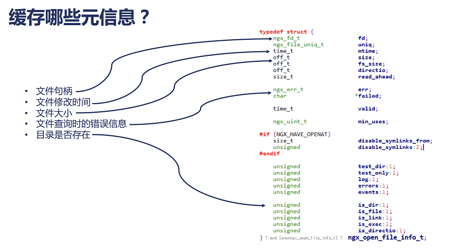

####  实战

可以使用 `strace -p nginx-worker-pid` 跟踪进程


### Http2

#### 主要特性

* 传输数据量大幅减少
  * 以二进制方式传输
  * 标头压缩
* 多路复用及相关功能
  * 消息优先级
* 服务器消息推送
  * 并行推送

### grpc


### stream四层反向代理

#### stream 模块处理请求的7个阶段

##### POST_ACCEPT: realip模块

通过proxy_protocol协议去除客户端真实地址，并写入remote_addr及remote_port变量。同时使用realip_remote_addr和realip_remote_port保留TCP连接中获得的原始地址。

##### PREACCESS

限制客户端的并发连接数。使用变量自定义限制依据，基于共享内存所有workder进程同时生效

##### ACCESS

根据客户端地址（realip模块可以修改地址）决定连接的访问权限

##### SSL

###### ssl 指令对比http模块

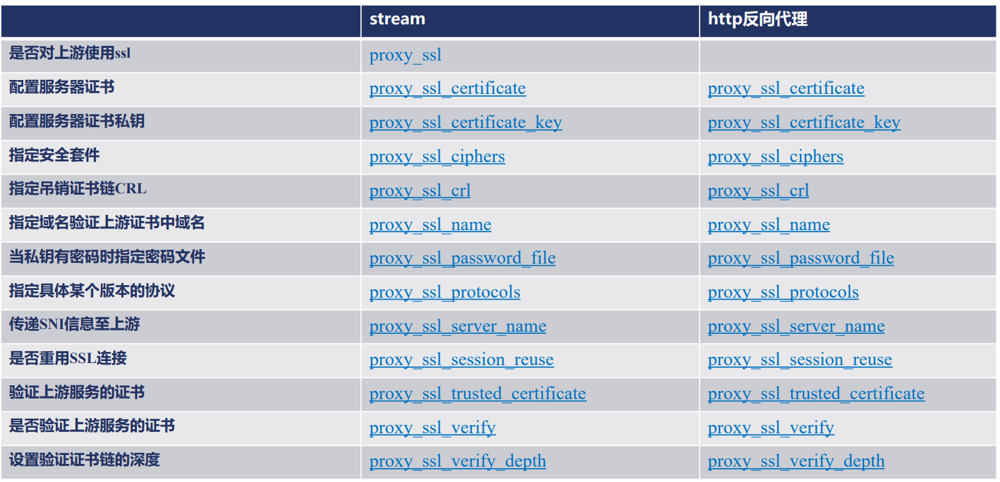

##### PREREAD

##### CONTENT

##### LOG

#### stream 方向代理指令

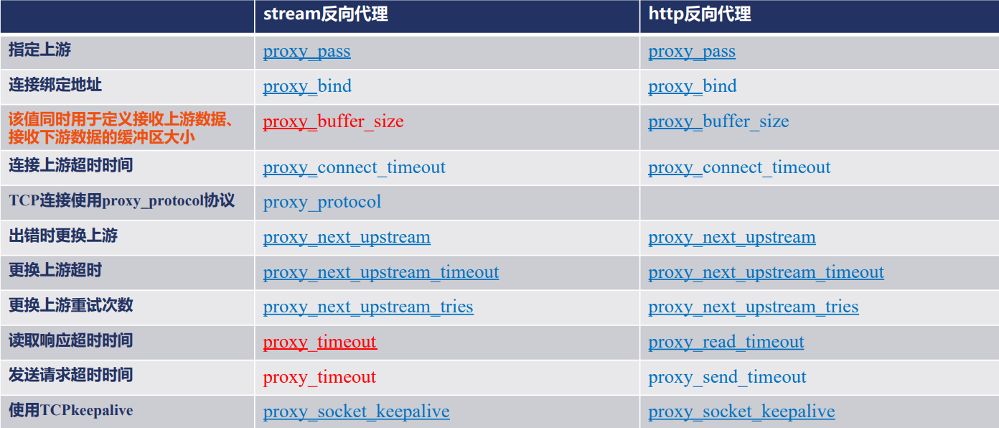


#### UDP 方向代理

##### 工作原理


```bash
Syntax:	proxy_requests number;
Default:	proxy_requests 0;
Context:	stream, server
```

* 指定一次会话 session 中最多从客户端接收到多少报文就结束session。
  * 仅会话结束时才会记录access日志
  * 同一个会话中，nginx使用同一端口连接上游服务
  * 设置为0表示不限制，每次请求都会记录access日志

```bash
Syntax:	proxy_responses number;
Default:	—
Context:	stream, server
```

* 指定对应一个请求报文，上游返回多少个响应报文

  * 与proxy_timeout结合使用，控制上游服务是否不可用

  

## Nginx的系统层性能优化

### 优化方法论

* 从软件层面提升硬件使用效率
  * 增大CPU的利用率
  * 增大内存的利用率
  * 增大磁盘IO的利用率
  * 增大网络带宽的利用率
* 提升硬件规格
  * 网卡： 万兆网卡，
  * 磁盘： 固态硬盘，关注IOPS和BPS指标
  * CPU：更快的主频，更多的核心，更大的缓存，更优的架构
  * 内存：更快的访问速度
* 超出硬件性能上限后使用DNS


### CPU

#### 如何增大Nginx使用CPU的有效时长

* 能够使用全部CPU资源
  * master-workder多进程架构
  * workder进程数量应当大于等于CPU核数
* Nginx进程间不做无用功浪费CPU资源
  * worker京城不应在繁忙时，主动让出CPU
    * workder进程间不应该由于争抢造成资源耗散
      * wokder进程数量应当等于CPU核数
    * workder进程不应调用一些API导致主动让出CPU
      * 拒绝类似的第三方模块
* 不被其他进程争抢资源
  * 提升优先级占用CPU更长时间
  * 减少操作洗头膏上耗资源的非Nginx进程

##### 设置workder进程的数量

```bash
Syntax:	worker_processes number | auto;
Default:	worker_processes 1;
Context:	main
```

#### 为什么一个CPU可以同时运行多个进程

* 宏观上并行，微观上串行

  * 把进程的运行时间分为一段段的时间片
  * OS调度系统一次选择每个进程，最多执行时间片指定的时长

  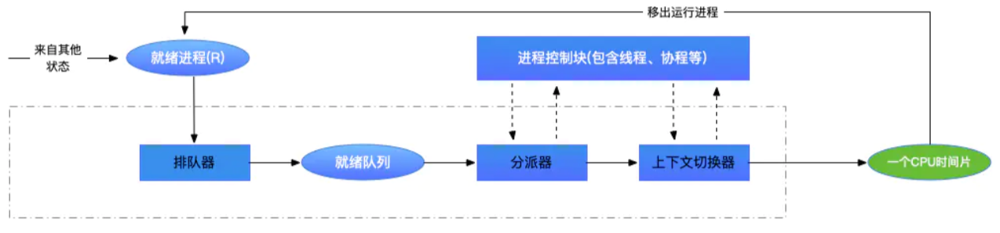

* 阻塞API引发的时间片内主动让出CPU
  * 速度不一致引发的阻塞API
    * 硬件执行速度不一致，例如CPU和磁盘
  * 业务场景产生的阻塞API
    * 例如同步读网络报文


#### 减少进程间切换

* Nginx workder 尽可能的处于R状态
  * R状态的进程数量大于CPU核心时，负载急速增高
* 尽可能的减少进程间切换
  * 进程间切换是指CPU从一个进程或线程切换到另一个进程或线程
    * 主动切换
    * 被动切换：时间片耗尽
  * Cost：<5us
  * 减少主动切换
  * 减少被动切换
    * 增大进程优先级
* 绑定CPU

#### 延迟处理新连接

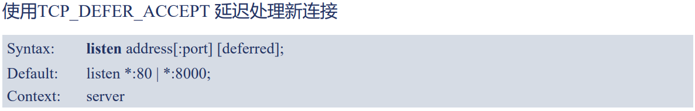

#### 如何查看上下文切换次数

##### vmstat

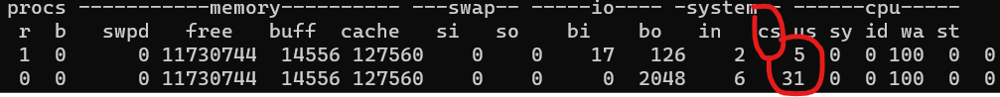

##### dstat

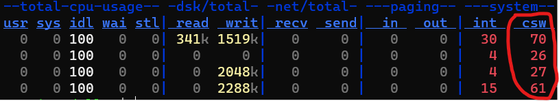

##### pidstat -w

```bash
pidstat -w -p 1 1 
```


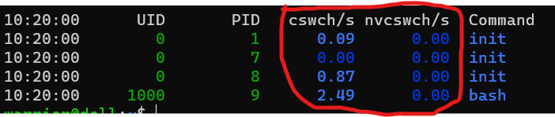

#### 什么决定CPU时间片的大小

* Nice静态优先级：-29 ~ 19
* Priority动态优先级： 0-139

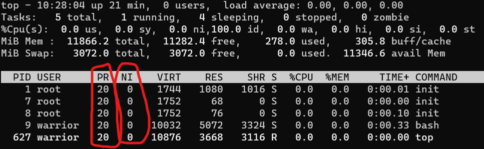


#### 设置workder进程的静态优先级

```bash
Syntax:	worker_priority number;
Default:	worker_priority 0;
Context:	main
```

定义工作进程的调度优先级，就像nice命令一样：负数表示更高的优先级。允许范围通常在-20到20之间。

#### 多核间的负载均衡

##### worker进程间负载均衡

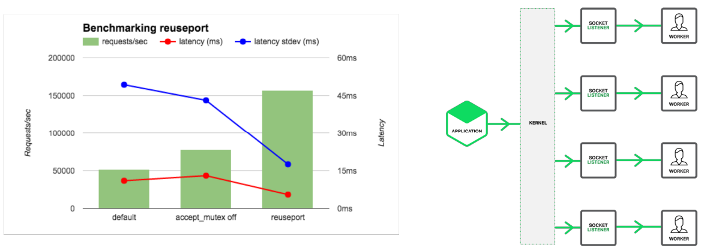

 ##### 多队列网卡对多核CPU的优化

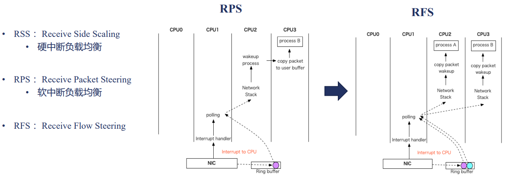

##### 提升CPU缓存命中率： worker_cpu_affinity

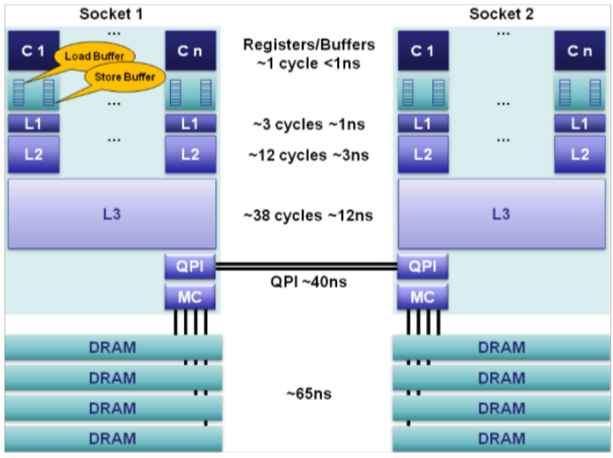

> /sys/devices/system/cpu/cpu0/cache/index1/size   查看CPU缓存大小
>
> /sys/devices/system/cpu/cpu0/cache/index1/shared_cpu_list   查看CPU缓存共享的列表

##### 绑定worker到指定CPU

```bash
Syntax:	worker_cpu_affinity cpumask ...;
		worker_cpu_affinity auto [cpumask];
Default:	—
Context:	main
```

##### NUMA架构

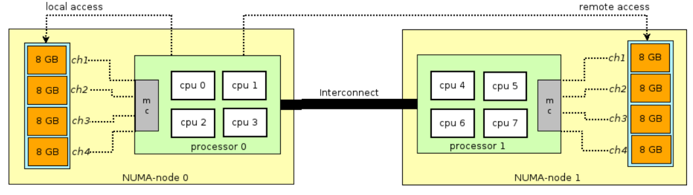

> numactl --hardware
>
> numastat				# 查看numa架构缓存命中

### 网络

#### 控制TCP三次握手参数

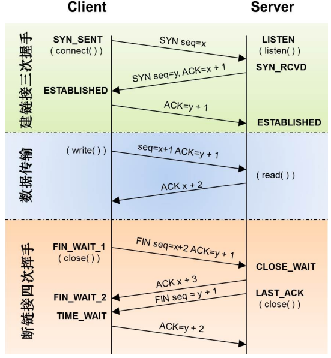

 ##### SYN_SENT状态

* net.ipv4.tcp_syn_retries=6
  * 主动建立连接时，发SYN的重试次数
* net.ipv4.ip_local_port_range=32768 60999
  * 建立连接时的本地端口可用范围

##### SYN_RCVD状态

* net.ipv4.tcp_max_syn_backlog
  * SYN_RCVD状态连接的最大个数
* net.ipv4.tcp_synack_retries
  * 被动建立连接时，发SYN/ACK的重试次数


##### LInux处理三次握手

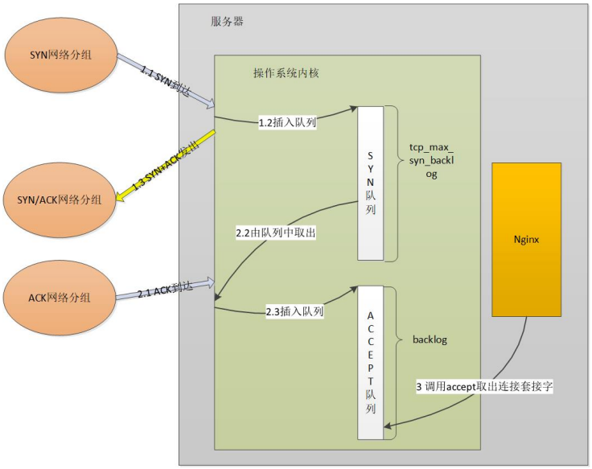


##### 主动建立连接时应用层超时时间

```bash
Syntax:	proxy_connect_timeout time;
Default:	proxy_connect_timeout 60s;
Context:	http, server, location
```

#### TCP连接的优化

##### 如何应对SYN攻击

攻击者短时间伪造不同IP地址的SYN报文，快速占满backlog队列，使服务器不饿能为正常用户服务

* net.core.netdev_max_backlog
  * 接收子网卡、但未被内核协议栈处理的报文队列长度
* net.ipv4.tcp_max_syn_backlog
  * SYN_RCVD状态连接的最大个数
* net.ipv4.tcp_abort_on_overflow
  * 超出处理能力时，对新来的SYN直接回包RST，丢弃连接


###### tcp_syncookies

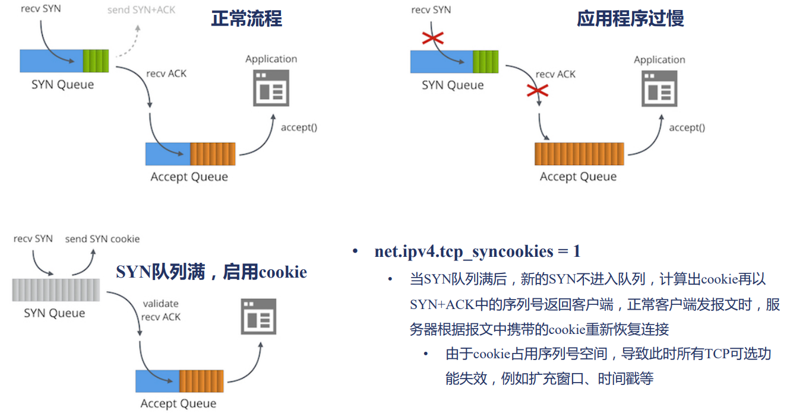

##### 一切皆文件：句柄数的上限

* 操作系统全局

  * fs.file-max
    * 操作系统可使用的最大句柄数
  * 使用fs.file-nr可以查看当前已分配、正使用、上限
    * fs.file-nr=21632 0 40000500

  ```bash
  sysctl -a | grep file-max  
  sysctl -a | grep file-nr
  ```

* 限制用户

  * /etc/security/limits.conf
    * root soft nofile 65535
    * root hard nofile 65535

* 限制进程

  ```bash
  Syntax:	worker_rlimit_nofile number;
  Default:	—
  Context:	main
  ```

  

##### 设置worker进程最大连接数量

```bash
Syntax:	worker_connections number;
Default:	worker_connections 512;
Context:	events
```

包括nginx与上游、下游间的连接

##### 两个队列的长度

* SYN 队列未完成握手
  * net.ipv4.tcp_max_syn_backlog=262144
* ACCEPT队列已完成握手
  * net.core.somaxconn
    * 系统级最大backlog队列长度

```bash
Syntax:	listen address[:port] [backlog=number] 				[
Default:	listen *:80 | *:8000;
Context:	server
```


##### Tcp Fast Open

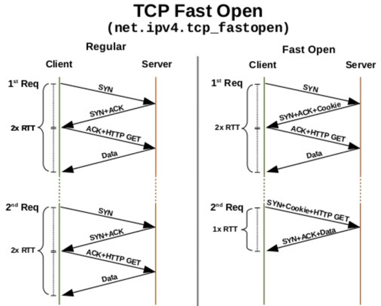

* net.ipv4.tcp_fastopen：系统开启TFO功能
  * 0： 关闭
  * 1：作为客户端时可以使用TFO
  * 2：作为服务器时可以使用TFO
  * 3：无论作为客户端还时服务器，都可以使用TFO

```bash\
Syntax:	listen address[:port] [fastopen=number] 				[
Default:	listen *:80 | *:8000;
Context:	server
```

* fastopen=number 
  * 为防止带数据的SYN攻击，限制最大长度，指定TFO连接队列的最大长度


#### 滑动窗口与缓冲区

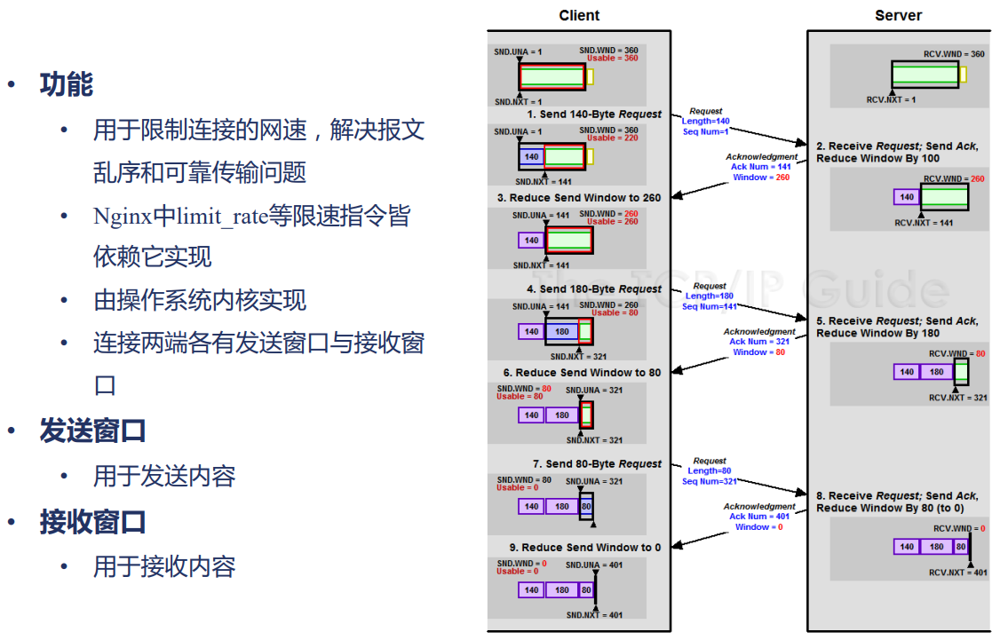

##### 通告窗口


##### 发送TCP消息

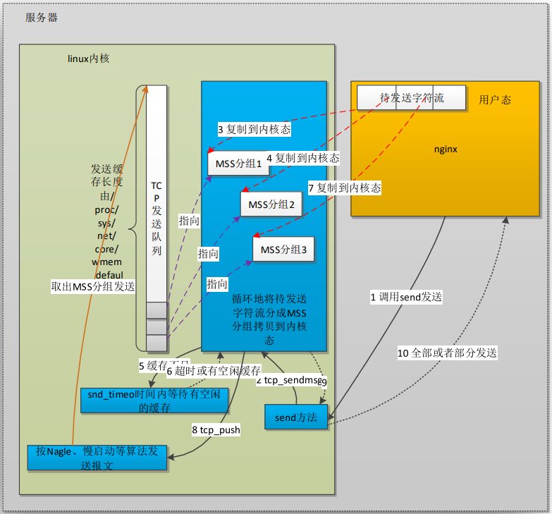

##### TCP消息接收

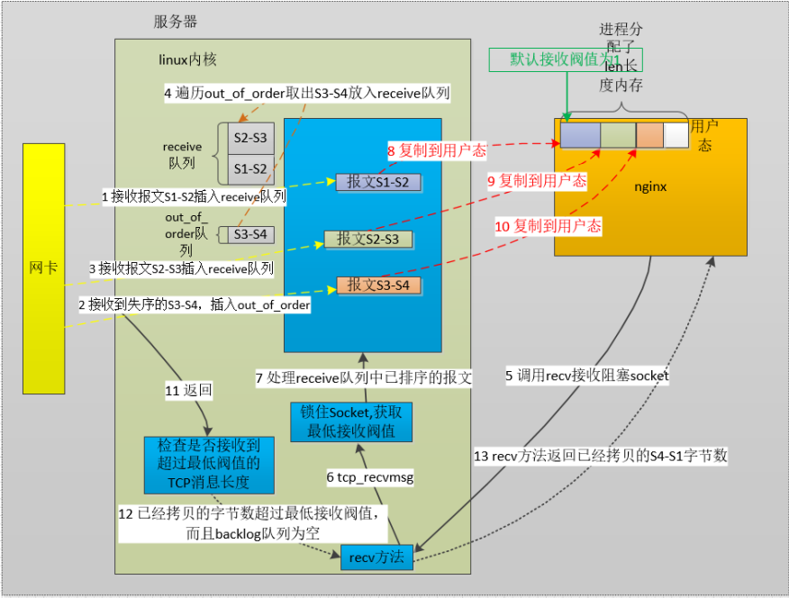

##### TCP消息接收发生CS

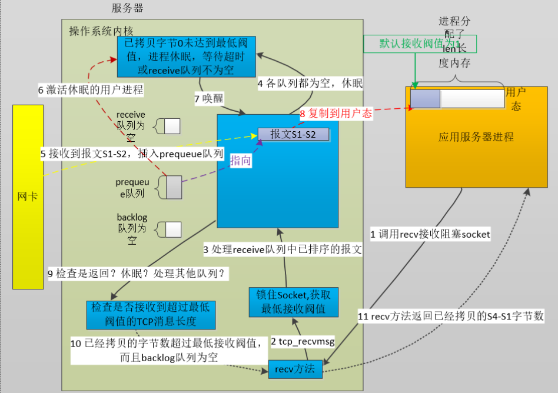

##### TCP消息接收时新报文到达

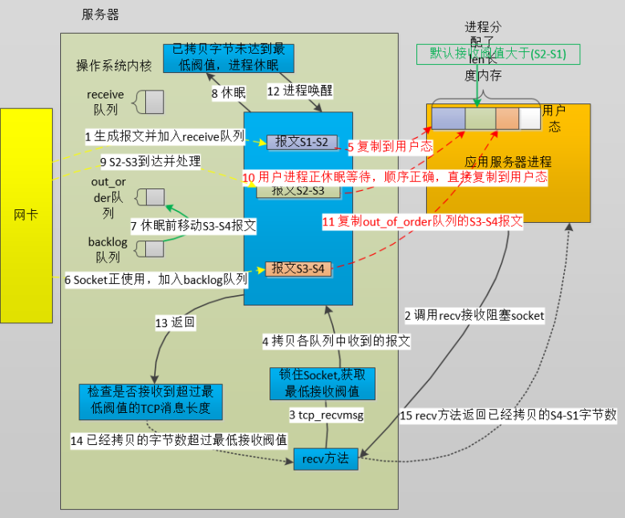

##### nginx 的超时指令与滑动窗口

```bash
Syntax:	client_body_timeout time;
Default:	
client_body_timeout 60s;
Context:	http, server, location
```

* 两次读操作间的超时

```bash
Syntax:	send_timeout time;
Default:	send_timeout 60s;
Context:	http, server, location
```

* 两次写操作间的超时

```bash
Syntax:	proxy_timeout timeout;
Default:	proxy_timeout 10m;
Context:	stream, server
```

* 以上两者兼具

##### 丢包重传

* 限制重传次数
  * net.ipv4.tcp_retries1 = 3
    * 达到上限后，更新路由缓存
  * net.ipv4.tcp_retries2 = 15
    * 达到上限后，关闭TCP连接
  * 仅作近似理解，实际以超时时间为准，可能少于retries次数就认定达到上限


##### TCP缓冲区

* `net.ipv4.tcp_rmem = 4096        131072  6291456`

  * 读缓冲最小值、默认值、最大值，单位字节，覆盖 `net.core.rmem_max`
* `net.ipv4.tcp_wmem = 4096        16384   4194304`

  * 写缓存最小值、默认值、最大值，单位字节，覆盖`net.core.wmem_max`
* `net.ipv4.tcp_mem = 141147       188198  282294`

  * 系统无内存压力、启动压力模式阈值、最大值，单位为页的数量
* `net.ipv4.tcp_moderate_rcvbuf = 1`

  * 开启自动调整缓存模式
* `net.ipv4.tcp_adv_win_scale = 1`

  * 调整接收窗口与应用缓存
  * 应用缓存 = buffer / （2 ^ tcp_adv_win_scale)
  

> sysctl -a | grep net.ipv4.tcp_rmem

```bash
Syntax:	listen address[:port] [rcvbuf=size] [sndbuf=size];
Default:	listen *:80 | *:8000;
Context:	server
```

##### BDP=带宽 * 时延，吞吐量=窗口/时延

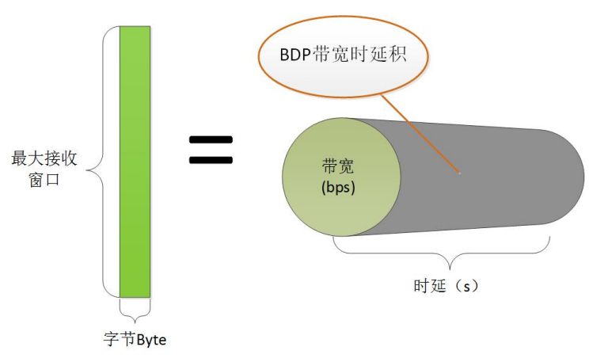

##### 禁用Nagle算法

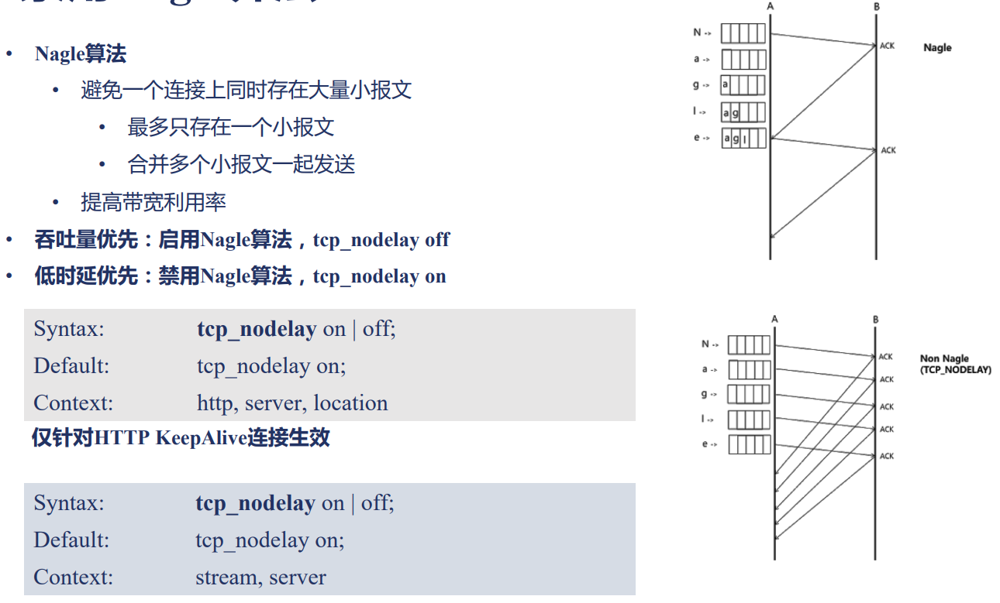

##### nginx 避免发送小报文

```bash
Syntax:		postpone_output size;
Default:	postpone_output 1460;
Context:	http, server, location
```

##### 启用CORK算法

仅针对`sendfile on`开启时有效，完全禁止小报文的发送，提升网络效率

```bash
Syntax:		tcp_nopush on | off;
Default:	tcp_nopush off;
Context:	http, server, location
```

#### 慢启动与拥塞窗口

##### 流量控制

* 拥塞窗口
  * 发送方主动限制流量
* 通告窗口（对端接收窗口）
  * 接收放限制流量
* 实际流量
  * 拥塞窗口与通告窗口的最小值

##### 拥塞处理

* 慢启动
  * 指数扩展拥塞窗口（cwnd为拥塞窗口大小）
    * 每收到1个ACK，cwnd = cwnd +1
    * 每过一个RTT，cwnd = cwnd * 2
* 拥塞避免：窗口大于threshold
  * 线性扩展拥塞窗口
    * 每收到1个ACK，cwnd = cwnd + 1/cwnd
    * 每过一个RTT，窗口加1
* 拥塞发生
  * 急速降低拥塞窗口
    * RTO超时，threshold = cwnd/2,cwnd=1
    * Fast Retransmit, 收到3个duplicate ACK, cwnd=cwnd/2,threshold=cwnd
* 快速恢复
  * 当Fast Retransmit出现时，cwnd调整为threshold + 3*MSS

##### TCP slow start

##### RTT与RTO

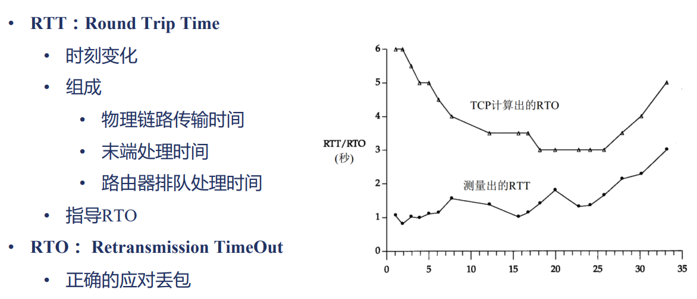


#### TCP 协议的keepalive功能

##### 应用场景

* 检测实际断掉的连接
* 用于维持与客户端间的防火墙有活跃网络包

##### 功能

* nginx的 TCP keepalive
  * so_keepalive=30m::10
  * keepidle,keepintvl,keepcnt
* Linux的tcp keepalive
  * net.ipv4.tcp_keepalive_intvl = 75
    * 探测包发送间隔
  * net.ipv4.tcp_keepalive_probes = 9
    * 探测包重试次数
  * net.ipv4.tcp_keepalive_time = 7200
    * 发送心跳周期，单位秒

#### 减少关闭连接的time_wait端口数量

##### TCP连接

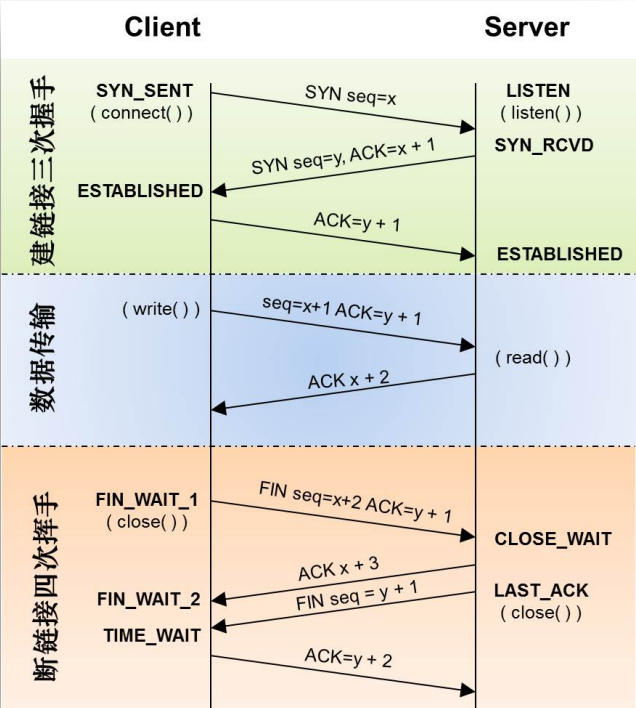

##### 被动关闭连接端的状态

* CLOSE_WAIT状态
  * 应用进程没有及时响应对端关闭连接
* LAST_ACK状态
  * 等待接收主动关闭端操作系统发来的针对FIN的ACK报文

##### 主动关闭连接端的状态

* fin_wait1状态

  * `net.ipv4.tcp_orphan_retries = 0`

    * 发送FIN报文的重试次数，0相当于8

* fin_wait2状态

  * `net.ipv4.tcp_fin_timeout = 60`
    * 保持在FIN_WAIT_2状态的时间

* time_wait状态有什么作用？

##### TIME_WAIT状态过短或者不存在会怎么样

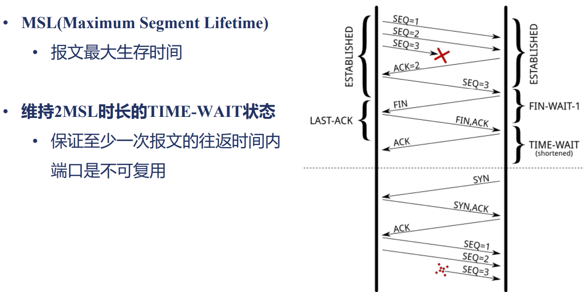

##### TIME_WAIT优化：tcp_tw_reuse

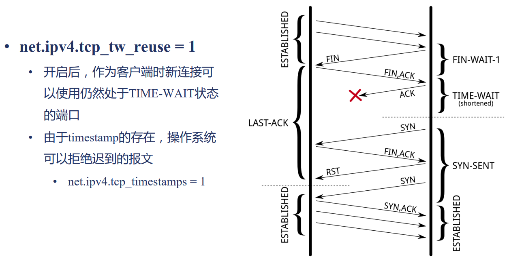

##### TIME_WAIT优化

* `net.ipv4.tcp_tw_recycle=0`
  * 开启后，同时作为客户端和服务器都可以使用TIME-WAIT状态的端口
  * 不安全，无法避免报文延迟、重复等给新连接造成混乱
* `net.ipv4.tcp_max_tw_buckets=262144`
  * time_wait状态连接的最大数量
  * 超出后直接关闭连接


#### lingering_close延迟关闭TCP连接

##### lingering_close延迟关闭的意义

当nginx处理完成调用close关闭连接后，若接收缓冲区仍然收到客户端发来的内容，则服务器会向客户端发送RST包关闭连接，导致客户端由于收到RST而忽略了http response。

##### lingering_close配置指令

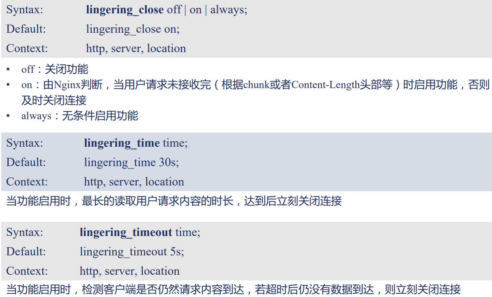

##### 以RST代替正常的四次握手关闭连接

当其他读、写超时指令生效引发连接关闭时，通过发送RST立刻释放端口、内存等资源来关闭连接

```bash
Syntax:		reset_timedout_connection on | off;
Default:	reset_timedout_connection off;
Context:	http, server, location
```

#### 应用层协议的优化

##### TLS/SSL 优化握手性能

```bash
Syntax:	ssl_session_cache off | none | [builtin[:size]] [shared:name:size];
Default:	ssl_session_cache none;
Context:	http, server
```

* **off** 不使用Session缓存，且Nginx在协议中明确告诉客户端Session缓存不被使用
* **none** 不适用Session缓存
* **builtin** 使用Openssl的Session缓存，由于在内存中使用，所以仅当同一客户端的两次连接都命中到同一个worker进程时，Session缓存才会生效
* **shared::name::size** 定义共享内存，为所有worker进程提供Session缓存服务。1MB大约可用与4000个Session


##### TLS/SSL中的会话票证tickets

Nginx将会话Session中的信息作为tickets加密发给客户端，当客户端下次发起TLS连接时带上tickets，由nginx解密验证后复用会话Session。

会话票证虽然更易在Nginx集群中使用，但破坏了TLS/SSL的安全机制，由安全风险，必须频繁更换tickets密钥

是否开启会话票证服务：

```bash
Syntax:	ssl_session_tickets on | off;
Default:	ssl_session_tickets on;
Context:	http, server
```

使用会话票证时加密tickets的密钥文件

```bash
Syntax:	ssl_session_ticket_key file;
Default:	—
Context:	http, server
```

##### HTTP 长连接

* 减少握手次数
* 通过减少并发连接数减少了服务器资源的消耗
* 降低TCP拥塞控制的影响

```bash
Syntax:		keepalive_requests number;
Default:	keepalive_requests 1000;
Context:	http, server, location
```

```bash
Syntax:		keepalive_requests number;
Default:	keepalive_requests 1000;
Context:	upstream     # 在上游服务中使用
```

##### gzip压缩

通过实施压缩http包体，提升网络传输效率

```bash
Syntax:	gzip on | off;
Default:	gzip off;
Context:	http, server, location, if in location
```

###### 压缩那些请求的响应

```bash
Syntax:	gzip_types mime-type ...;
Default:	gzip_types text/html;
Context:	http, server, location
```

```bash
Syntax:	gzip_min_length length;
Default:	gzip_min_length 20;
Context:	http, server, location
```

```bash
Syntax:	gzip_disable regex ...;
Default:	—
Context:	http, server, location
```

```bash
Syntax:	gzip_http_version 1.0 | 1.1;
Default:	gzip_http_version 1.1;
Context:	http, server, location
```

###### 是否压缩上游的响应

```bash
Syntax:	gzip_proxied off | expired | no-cache | no-store | private | no_last_modified | no_etag | auth | any ...;
Default:	gzip_proxied off;
Context:	http, server, location
```

* **off** 不压缩来自上游的响应
* **expired** 如果上游响应中含有Expires头部，且其值中的时间与系统时间比较后确定不会缓存，则压缩响应
* **no-cache** 如果上游响应中含有`Cache-Control`头部，且其值含有`no-cache`值，则压缩响应
* **no-store** 如果上游响应中含有`Cache-Control`头部，且其值含有`no-store`值，则压缩响应
* **private** 如果上游响应中含有`Cache-Control`头部，且其值含有`private`值，则压缩响应
* **no_last_modified** 如果上游响应中没有`Last-Modified`头部，则压缩响应
* **no_etag** 如果上游响应中没有`ETag`头部，则压缩响应
* **auth** 如果客户端请求中含有`Authorization`头部，则压缩响应
* **any** 压缩所有来自上游的响应

###### 其他参数

```bash
Syntax:	gzip_comp_level level;
Default:	gzip_comp_level 1;
Context:	http, server, location
```

```bash
Syntax:	gzip_buffers number size;
Default:	gzip_buffers 32 4k|16 8k;
Context:	http, server, location
```

```bash
Syntax:	gzip_vary on | off;
Default:	gzip_vary off;
Context:	http, server, location
```

##### 升级更高效的http2协议

* 向前兼容http/1.x协议
* 传输效率大幅度提升

### 磁盘IO

#### 减少磁盘IO

##### 优化读取

* Sendfile 零拷贝
* 内存盘、SSD盘

##### 减少写入

* AIO
* 增大error_log级别
* 关闭access_log
* 压缩access_log
* 是否启用proxy buffering
* syslog 替代本地IO

##### 线程池 thread pool

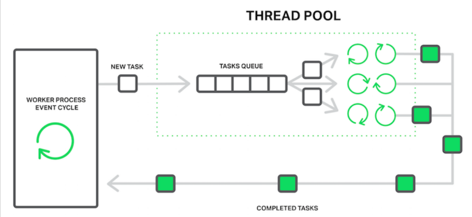

##### 直接IO绕开磁盘告诉缓存

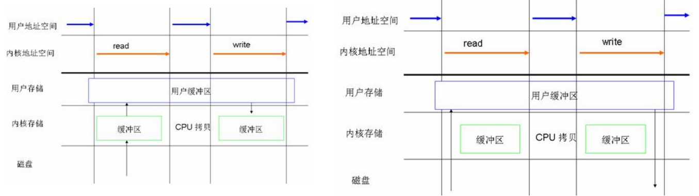

##### 适用于大文件：直接IO

当磁盘上的文件大小超过size后，启用directIO功能，避免Buffered IO模式下磁盘也缓存中的拷贝消耗

```bash
Syntax:	directio size | off;
Default:	directio off;
Context:	http, server, location
```

```bash
Syntax:	directio_alignment size;
Default:	directio_alignment 512;
Context:	http, server, location
```

##### 异步IO


```bash
Syntax:	aio on | off | threads[=pool];
Default:	aio off;
Context:	http, server, location
```

```bash
Syntax:	aio_write on | off;
Default:	aio_write off;
Context:	http, server, location
```

##### 异步读IO线程池

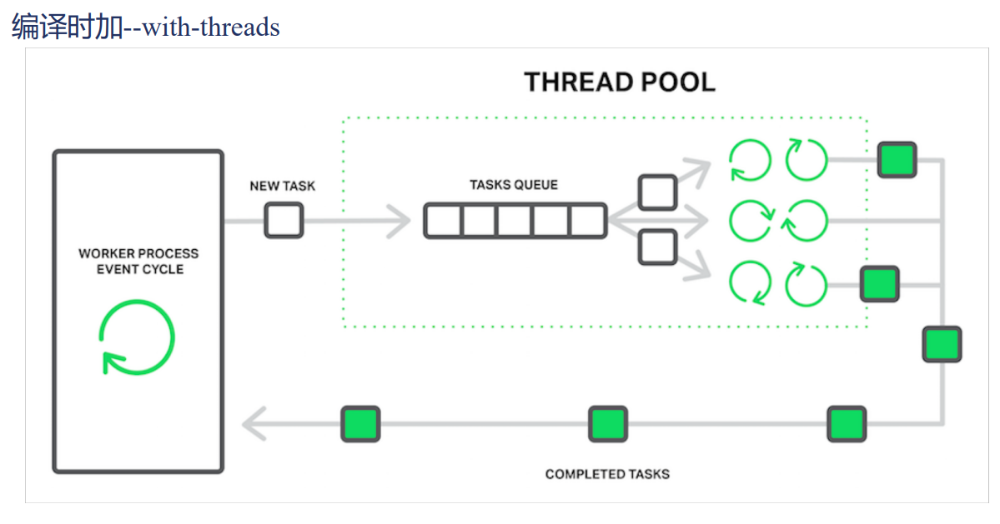

##### 定义线程池

```bash
Syntax:	thread_pool name threads=number [max_queue=number];
Default:	thread_pool default threads=32 max_queue=65536;
Context:	main
```

##### 异步IO中的缓存

将磁盘文件读入缓冲中待处理，例如gzip模块会使用

```bash
Syntax:	output_buffers number size;
Default:	output_buffers 2 32k;
Context:	http, server, location
```

#### 减少磁盘读写次数

##### empty_gif 模块

* ngx_http_empty_gif_module 模块，通过 --without-http_empth_gif_module 禁用模块

###### 功能

* 从前端页面做用户行为分析时，由于跨域等要求，前端打点的上报数据一般时GET请求，且考虑到浏览器解析DOM树的性能消耗，所以请求透明图片最小，而1*1的GIF图片体积最小（仅43字节），故通常请求gif图片，请在请求中把用户行为信息上报服务器。
* Nginx可以在access日志中获取到请求参数，进而统计用户行为。但若在磁盘中读取1x1的文件则有磁盘IO消耗，empty_gif模块将图片放在内存中，加快了处理速度

```bash
Syntax:	empty_gif;
Default:	—
Context:	location
```

##### access 日志的压缩

```bash
Syntax:	access_log path [format [buffer=size] [gzip[=level]] [flush=time] [if=condition]];
access_log off;
Default:	access_log logs/access.log combined;
Context:	http, server, location, if in location, limit_except
```

* buffer 默认64KB
* gzip 默认级别为1
* 通过zcat解压查看

##### error.log 日志输出内存

* 场景

  * 在卡法环境下定位问题时，若需要打开debug级别日志，但对debug级别大量日志引发的细嫩那个问题不能容忍，可以将日志输出到内存中

* 配置语法

  * error_log memory:32m debug;

* 查看内存中日志的方法

  * gdb -p [worker进程id] -ex "source nginx.gdb" --batch

  * nginx.gdb脚本内容

    ```bash
    set $log = ngx_cycle->log
    while $log->writer != ngx_log_memory_writer
    	set $log = $log->next
    end
    set $buf = (ngx_log_memory_fuf_t*)$log->wdata
    dump binary memory debug_log.txt $buf->start $buf->end
    ```

##### syslog 协议

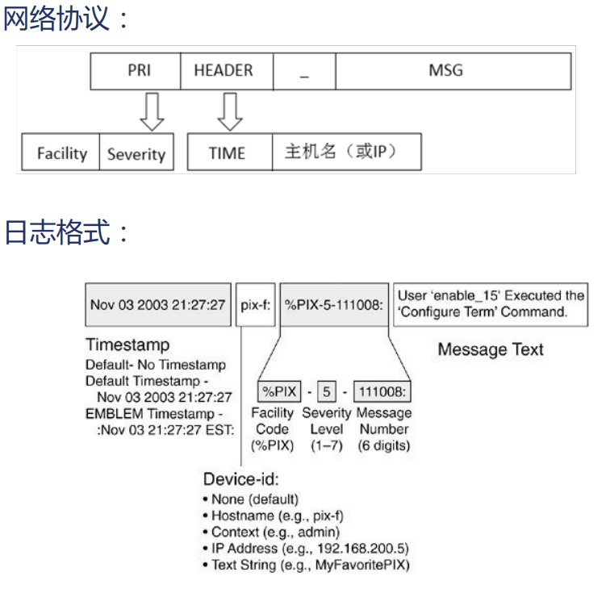

###### Logging to syslog

```bash
access_log syslog:server=[2001:db8::1]:12345,facility=local7,tag=nginx,severity=info combined;
```

* **server** 定义syslog服务器地址
*  **facility** 参见RFC3164，取值 “`kern`”, “`user`”, “`mail`”, “`daemon`”, “`auth`”, “`intern`”, “`lpr`”, “`news`”, “`uucp`”, “`clock`”, “`authpriv`”, “`ftp`”, “`ntp`”, “`audit`”, “`alert`”, “`cron`”, “`local0`”..“`local7`”. Default is “`local7`”.
* **serverity** 定义日志级别，默认info级别
* **tag** 定义日志的tag，默认为 "nginx"
* **nohostname** 不向syslog中写入主机名 hostname


#### 零拷贝与gzip_static模块

##### sendfile 零拷贝提升性能

* 减少进程间切换
* 减少内存拷贝次数


##### 直接IO自动禁用sendfile

```bash
location /video/ {
	sendfile on;
	aio on;
	directio 8m;
}
```

当文件大小超过8M时，启用AIO与directio

##### gzip_static 模块

将测到同名.gz文件时，response中以gzip相关header返回.gz文件的内容

##### gunzip模块

当客户端不支持gzip时，且磁盘上仅有压缩文件，则实时解压缩并将其发送给客户端

#### tcmalloc

* 更快的内存分配器
  * 并发能力强于glibc
    * 并发线程数越多，性能越好
  * 减少内存碎片
  * 擅长管理小块内存

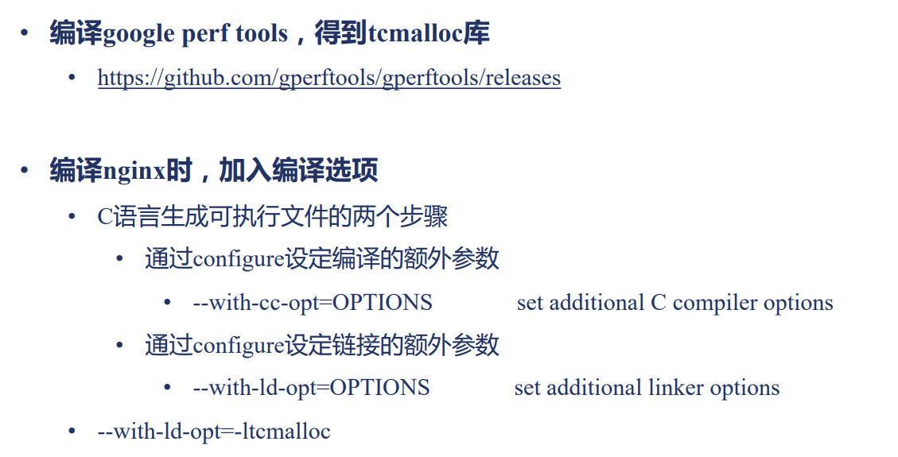

#### 使用Google PerfTools分析nginx

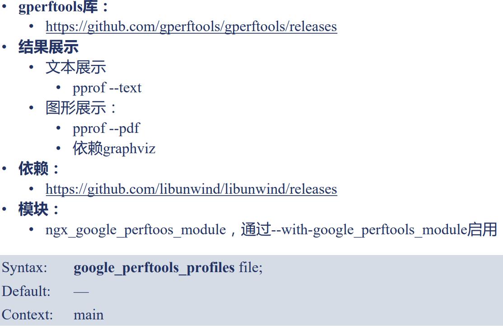

#### stub_status

通过http，实时监控nginx的连接状态

统计数据存放于共享内存中，所以统计值包含所有worker进程，且执行reload不会导致数据清零，但热升级会导致数据清零

##### 监控项

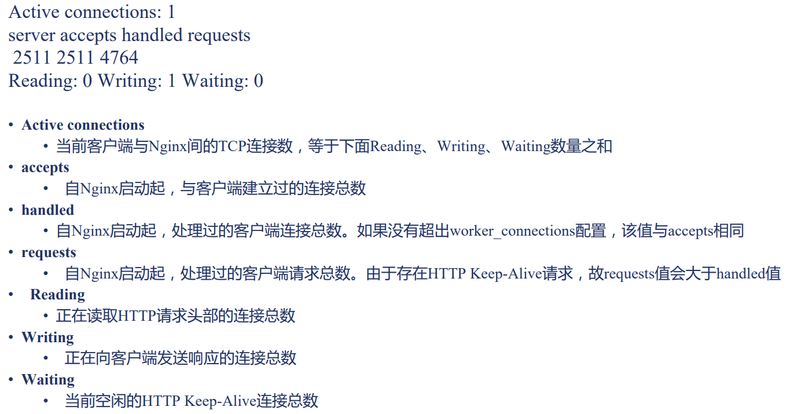


##  OpenResty

