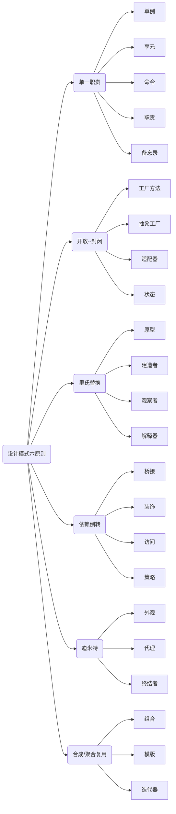

### 开放封闭原则

* 对扩展开放，对修改关闭

### 依赖倒置原则(Dependence Inversion Principle, DIP)
* 高层模块不应该依赖低层模块，二者都应该依赖其抽象；抽象不应该依赖细节；细节应该依赖抽象。


```java
class Book {
	public String getContent() {
		return "读书";
	}
}

class Newspaper {
	public String getContent() {
		return "报纸";
	}
}

public Father {
	public void Reading(Newspaper paper) {
		System.out.println(paper.getContent)
	}
}
```

```java
interface IReader {
	String getContent();	
}

public Father {
	public void Reading(IReader reader) {
		System.out.println(reader.getContent())
	}
}

class Book implements IReader {
	public String getContent() {
		return "读书";
	}
}

class Newspaper implements IReader {
	public String getContent() {
		return "报纸";
	}
}

```