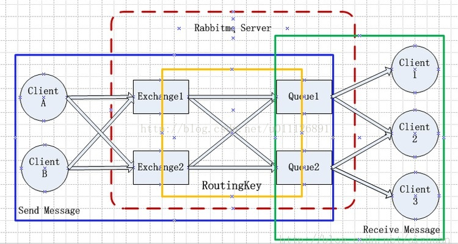
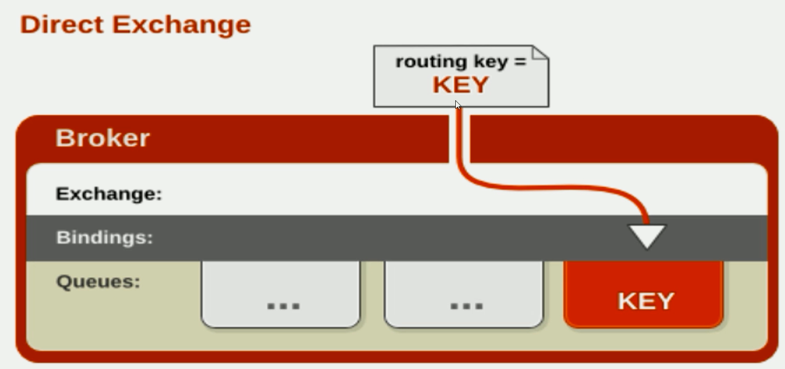
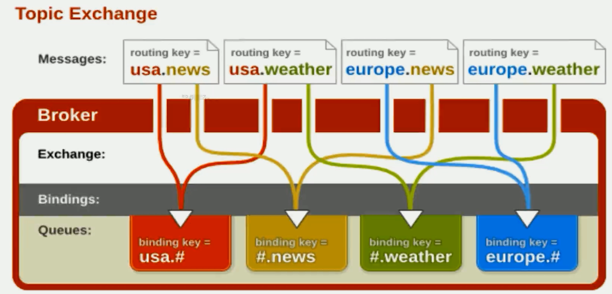
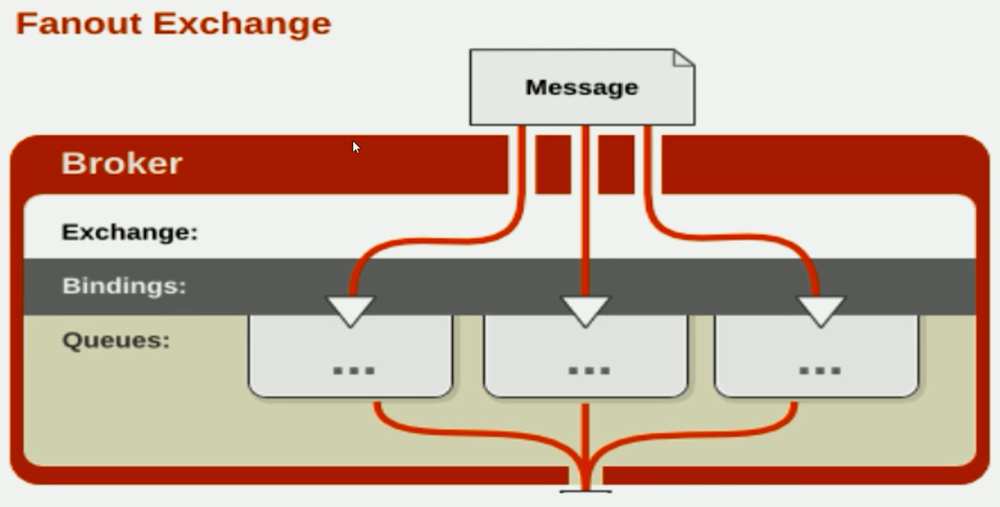
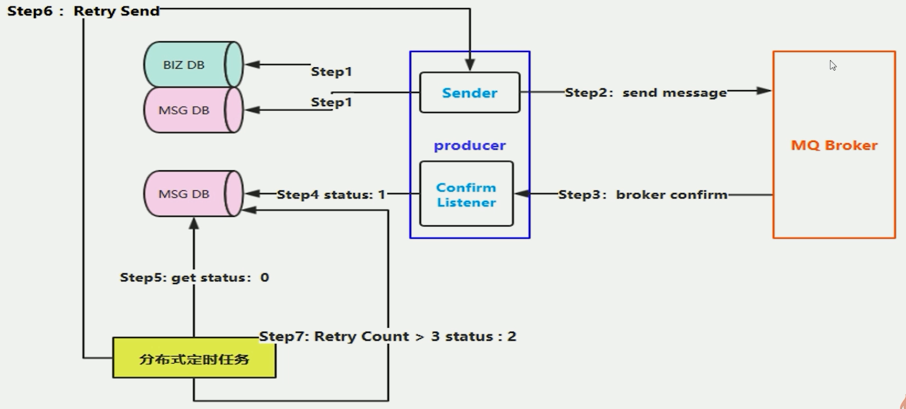
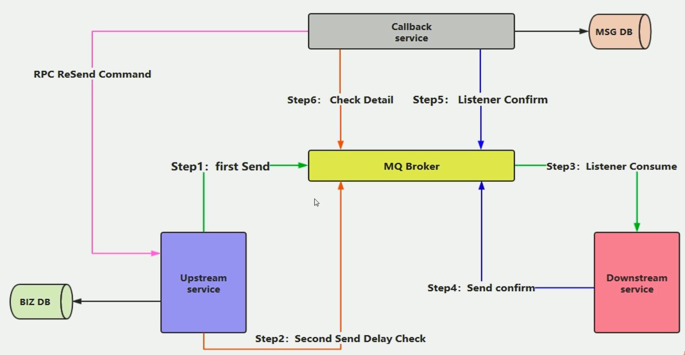

# Install

# 工作原理

## 核心概念

https://www.rabbitmq.com/tutorials/amqp-concepts.html

### Virtual Host

虚拟地址，用于进行逻辑隔离，最上层的消息路由，一个 Virtual Host 里面可以有若干个 Exchange 和Q ueue 。同一个 Virtual Host 里面不能有相同名称的Exchange 或 Queue

### Exchange

接受消息，并更具路由键转发消息所绑定的队列

* 蓝色区域 生产消息，经过交换机，到达队列
* 绿色区域 消费者，从队列中获取并消费消息
* 红色区域  RabbitMQ Server
* 黄色区域  交换机绑定队列

#### Direct Exchange 直连交换机

发送到当前交换机的消息，都会被转发到RouteKey中指定的Queue中

* Direct模式可以使用RabbitMQ自带的Exchange：default Exchange，所以不需要将Exchange进行任何绑定（binding）操作，消息传递是，RouteKey必须完全匹配才会被队列接受，否则该消息会被抛弃

#### Topic Exchange 主题交换机

发送到交换机上的消息，会被指定给主题相关的Queue上。主要将RouteKey和设置的Topic进行模糊匹配

* 可以使用通配符进行模糊匹配
* `#` 匹配一个或多个词    `hello.# -> hello.mq.rabbit`
* `*`  匹配一个词 `hello.* -> hello.rabbit`

#### Fanout Exchange 广播交换机

直接广播，不走路由键，直接将队列绑定到交换机上。发送到交换机的消息，全部会被转发到与该交换机绑定的队列上。转发消息是最快的！

#### Headers Exchange  

性能差

### Message Queue

 消息队列，存储消息数据。

### Binding 

主要将`exchang`中的信息与`Message Queue`中的队列进行绑定。

### Message

服务器和应用程序之间，进行传输的数据。由 Properties 和 Payload（Body）组成

### Routing Key

## 工作过程

### 如何保障消息的成功投递

#### ‎什么是生产端的可靠性投递

* 保证消息的成功发出
* 保障 MQ 节点的成功接收
* 发送端收到 MQ 节点确认应答
* 完善的消息进行补偿机制

### ‎生产端-可靠性投递

#### 方案一

消息落库，对消息转改进行打标记

7. 如果重试次数太多就设置标记放弃。

#### 方案二

‎消息的延迟投递，做二次确认，回调检查

* 蓝色  生产者
* 红色  消费者

1. 把消息落库完了之后，才能 step 1 进行发送消息，这一次，在生产端它会一次生成两条消息
2. 执行完了 step 1 发送消息后， 还会执行 step 2 做消息延迟检查，可以 2~5 分钟之后
3. ‎监听&接收消息之后，就进行处理
4. 当消费端中消息处理成功之后，还需生成一个 确认 消息
5. ‎Callback 服务，通过监听器，监听 确认 消息，当确认了之后，就对消息做最终的存储
6. ‎假设 5 分钟后，延迟投递检查消息，发送过来了， allback 服务，监听这个 检查细节，然后就去检查 MSG DB 数据库，‎如果下游已经把数据处理好了，那么就OK，‎如果没有返回，或者返回失败，出现异常了，这时 callback 需要做补偿。‎因为 callback 在监听延迟消息。‎当 callback 发现 message 并不存在，则会主动发起 RPC 通信，给上游反馈延迟检查的内容，并没有找到。‎然后，再次发送一次数据。

### 幂等性

#### 什么是幂等性

对一条数据进行的操作，这个操作你可能执行非常多次，操作的结果也是相同的，这个就是幂等性保障。

#### 消费端幂等性保障

