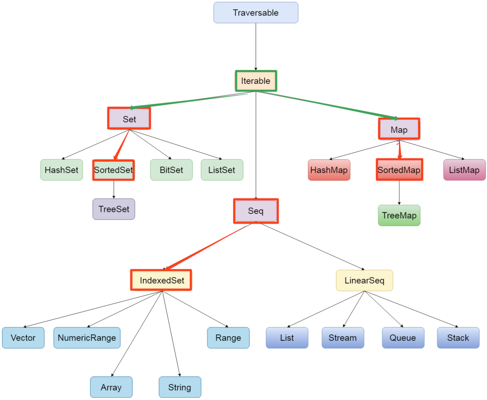
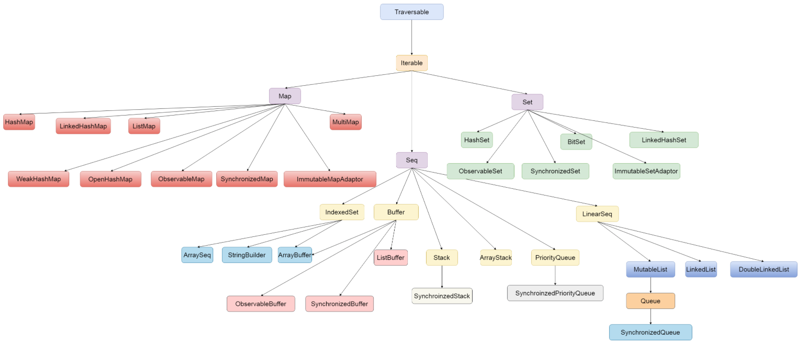

# SBT

sbt is built for Scala and Java projects.

## INSTALL

### macOS

```bash
brew install sbt
```

## sbt by example

### create new project

```bash
sbt new scala/scala-seed.g8
```

https://www.scala-sbt.org/1.x/docs/sbt-by-example.html


# syntax

## Variable types

```scala
val/var 变量名称:变量类型 = 初始值
```

- `val` is an immutable variable — like `final` in Java — and should be preferred
- `var` creates a mutable variable, and should only be used when there is a specific reason to use it

### 惰性变量

```scala
lazy val 变量名 = 表达式
```

* Scala中使用==关键字lazy==来定义惰性变量，实现延迟加载(懒加载)。 
* 惰性变量只能是==不可变变量==，并且只有在调用惰性变量时，才会去实例化这个变量。

## 数据类型

| 基础类型 | 类型说明                 |
| -------- | ------------------------ |
| Byte     | 8位带符号整数            |
| Short    | 16位带符号整数           |
| **Int**  | 32位带符号整数           |
| Long     | 64位带符号整数           |
| Char     | 16位无符号Unicode字符    |
| String   | Char类型的序列（字符串） |
| Float    | 32位单精度浮点数         |
| Double   | 64位双精度浮点数         |
| Boolean  | true或false              |

> 1. scala中所有的类型都使用==大写字母开头==
> 2. 整形使用Int而不是Integer
> 3. scala中定义变量可以不写类型，让scala==编译器自动推断==


### scala类型层次结构


| 类型    | 说明                                                         |
| ------- | ------------------------------------------------------------ |
| Any     | **所有类型**的父类，,它有两个子类AnyRef与AnyVal              |
| AnyVal  | **所有数值类型**的父类                                       |
| AnyRef  | 所有对象类型（引用类型）的父类                               |
| Unit    | 表示空，Unit是AnyVal的子类，它只有一个的实例（），它类似于Java中的void，但scala要比Java更加面向对象 |
| Null    | Null是AnyRef的子类，也就是说它是所有引用类型的子类。它的实例是null,   可以将null赋值给任何对象类型 |
| Nothing | 所有类型的**子类**不能直接创建该类型实例，某个方法抛出异常时，返回的就是Nothing类型，因为Nothing是所有类的子类，那么它可以赋值为任何类型 |

## 方法的重载

+-*/%可以完成和Java中相同的工作，但是有一点区别，他们都是方法。你几乎可以用任何符号来为方法命名。

举例：

```scala
scala> 1 + 2
// 等同于, 这个时候,+号是一个方法
scala> 1.+(2)
```


## 块表达式

定义变量时用 {} 包含一系列表达式，其中块的最后一个表达式的值就是块的值。

```scala
al x = 0 
val result = {
  val y = x + 10
  val z = y + "-hello"  
  val m = z + "-kaikeba"
  "over"
}
//result的值就是块表达式的结果    
//后期一个方法的返回值不需要加上return,把要返回的结果放在方法的最后一行就可以了 
```


## Control structures

### if/else

```
if (test1) {
    doA()
} else if (test2) {
    doB()
} else if (test3) {
    doC()
} else {
    doD()
}
val x = if (a < b) a else b
```

### match expressions

```scala
def getClassAsString(x: Any):String = x match {
    case s: String => s + " is a String"
    case i: Int => "Int"
    case f: Float => "Float"
    case l: List[_] => "List"
    case p: Person => "Person"
    case _ => "Unknown"
}
```

### for loops and expressions

```scala
for (arg <- args) println(arg)

// "x to y" syntax
for (i <- 0 to 5) println(i)

// "x to y by" syntax
for (i <- 0 to 10 by 2) println(i)

val fruits = List("apple", "banana", "lime", "orange")

val fruitLengths = for {
    f <- fruits
    if f.length > 4
} yield f.length

//双重for循环打印99乘法表
for(i <- 1 to 9; j <- 1 to i){
    print(i+"*"+j+"="+i*j+"\t")
     if(i==j){
       println()
    }    
} 

1*1=1
2*1=2   2*2=4
3*1=3   3*2=6   3*3=9
4*1=4   4*2=8   4*3=12  4*4=16
5*1=5   5*2=10  5*3=15  5*4=20  5*5=25
6*1=6   6*2=12  6*3=18  6*4=24  6*5=30  6*6=36
7*1=7   7*2=14  7*3=21  7*4=28  7*5=35  7*6=42  7*7=49
8*1=8   8*2=16  8*3=24  8*4=32  8*5=40  8*6=48  8*7=56  8*8=64
9*1=9   9*2=18  9*3=27  9*4=36  9*5=45  9*6=54  9*7=63  9*8=72  9*9=81
```

### while and do/while

```scala
// while loop
while(condition) {
    statement(a)
    statement(b)
}

// do-while
do {
   statement(a)
   statement(b)
} 
while(condition)
```


## 方法和函数

在scala当中，函数与方法是两个不同的概念，函数是scala当中的==一等公民==，scala是一门函数式的编程语言，同时兼顾了面向对象语言的特性。

1、方法与函数的定义方式不同

2、方法可以转换成为函数

3、函数就是对象

4、函数可以作为方法的参数

5、函数可以作为方法的返回值

### 方法

语法

```scala
def methodName (参数名: 参数类型, 参数名: 参数类型) : [return type] = {
    // 方法体：一系列的代码
}
```


```scala
// 定义一个最标准的方法，且定义方法的返回值类型为Int类型
def sum(a: Int, b: Int): Int = a + b
def concatenate(s1: String, s2: String): String = s1 + s2
// 定义一个方法，且不定义返回值
// 如果定义的方法没有返回值，那么方法的返回值会做自动推断。根据我们方法的最后一个返回类型来推断我们的方法返回类型
def sum(a: Int, b: Int) = a + b
def concatenate(s1: String, s2: String) = s1 + s2

// 定义一个方法，不定义返回值，可以通过自动推断，返回不同类型的值
def foo(first: Int, second: String) = {
  if(first > 10){
    first
  }else{
    second
  }
}

// 定义一个方法，参数给定默认值，如果不传入参数，就使用默认值来代替
def bar(first: Int = 10, second: String) = {
  println(first + "\t" + second)
}

// 变长参数，方法的参数个数不定的，类似于java当中的方法的...可变参数
// 如果方法除了变长参数外，还有其他参数，那么变长参数必须在参数列表的最后，否则报错
def foo1(first: Int*) = {
  var result = 0;
  for(arg <- first){
    result  += arg
  }
  println(result)
}

// 递归函数。我们可以定义一个方法，使得方法自己调用自己，形成一个递归函数，但是方法的返回值类型必须显示的手动指定
def foo(first: Int) :Int = {
  if(first <= 1){
    1
  }else{
    first * foo(first - 1)
  }
}

/**
  * 定义了一个方法，但是方法的返回值没有显示指定，
  * 此时我们就可以省掉方法定义的=号，如果省掉 = 号，
  * 那么这个方法强调的是一个过程，代码执行的过程，
  * 返回值是Unit，即()
  * @param first
  */
def hello7(first:Int){
  println(first)
  30
}

// 直接通过def定义一个方法
// 相当于无参的方法
def hello8 = 10

// 如果方法体当中只有一行代码，我们也可以省掉大括号
def hello10(first: Int, second: Int) = first + second
```

### 函数

函数定义的两种形式

第一种形式：

```scala
val  函数名 = (参数名1：参数类型1，参数名2：参数类型2)  =>  {函数体}
```

第二种形式：

```scala
val  函数名:（参数类型1，参数类型2） => (返回类型) = {
  函数体
}
```

```scala
// 定义一个标准函数，使用 =>来进行定义
val func1 = (x: Int, y: Int) => {
   x + y
}

// 定义匿名函数。也就是我们可以定义一个没有名字的函数
// 定义一个匿名函数之后，这个函数就没法使用了
(x: Int, y: String) => {x + y}

// 以定义匿名函数的形式，定义一个函数，参数只有一个且是Int类型，返回值也是Int类型
val func3 :Int => Int = {x => x * x }
val func3Result = func3(10)

// 定义一个函数，参数值是两个，分别是Int和String，返回值是一个元组，分别是String和Int
val func4: (Int, String) => (String, Int) = {
   (x, y) => (y, x)
}
```

### 方法和函数的区别

* 方法是隶属于类或者对象的，在运行时，它是加载到JVM的==方法区==中
* 可以将函数对象赋值给一个变量，在运行时，它是加载到==JVM的堆内存==中
* ==函数是一个对象，继承自FunctionN==，函数对象有apply，curried，toString，tupled这些方法，而方法则没有

### 方法转换为函数

* 有时候需要将方法转换为函数，作为变量传递，就需要将方法转换为函数
* 使用`_`即可将方法转换为函数

```scala
scala> def add(x: Int, y: Int) = x + y
add: (x: Int, y: Int)Int

scala> val a = add _
a: (Int, Int) => Int = <function2>	//a是一个函数
```

# 集合

所有集合都扩展自==Iterable==

Iterable指那些能生成Iterator，进而访问每个元素的集合

```scala
val arr = Array(1, 2)

val iter = arr.iterator

while(iter.hasNext){
	println(iter.next())
}
```

> 集合有3大类：序列Seq(有顺序)、集Set（无序，不重复）、映射Map

## 集合基本介绍

- Scala同时支持==可变集合和不可变集合==
  - 不可变集合从不可变，可以安全的并发访问。
- 两个主要的包：
  - 不可变集合：scala.collection.immutable
  - 可变集合：  scala.collection.mutable
- Scala默认采用不可变集合
- 对于几乎所有的集合类，Scala都同时提供了可变和不可变的版本。

### 不可变集合继承层次




### 可变集合继承层次




## 数组

> Seq是有先后次序的集合，如Array、List

* scala中数组的概念是和Java类似，可以用数组来存放一组数据
* scala中，有两种数组
  * 一种是**定长数组**
  * 另一种是**变长数组**

### 定长数组

* 定长数组指的是数组的==**长度**是**不允许改变**==的
* 数组的==**元素**是**可以改变**==的

```scala
// 通过指定长度定义数组
val/var 变量名 = new Array[元素类型](数组长度)

// 用元素直接初始化数组
val/var 变量名 = Array(元素1, 元素2, 元素3...)
```

> 在scala中，数组的泛型使用[]来指定
> 使用()来获取元素

### 变长数组

* 变长数组指的是数组的==长度是可变的，可以往数组中添加、删除元素==
* 创建变长数组，需要提前导入ArrayBuffer类

```scala
import scala.collection.mutable.ArrayBuffer

// 创建空的ArrayBuffer变长数组
val/var a = ArrayBuffer[元素类型]()
// 创建带有初始元素的ArrayBuffer
val/var a = ArrayBuffer(元素1，元素2，元素3....)
```

### 遍历数组

* 使用==for表达式== 直接遍历数组中的元素
* 使用 ==索引== 遍历数组中的元素

## Tuples

Tuples let you put a heterogenous collection of elements in a little container. Tuples can contain between two and 22 values, and they can all be different types.

元组可以用来包含一组不同类型的值。例如：姓名，年龄，性别，出生年月。元组的元素是不可变 的。

```scala
// 使用括号来定义元组
val/var 元组变量名称 = (元素1, 元素2, 元素3....)
// 使用箭头来定义元素（元组只有两个元素）
val/var 元组 = 元素1->元素2
```

元组中的==元素不能修改==

### 访问元组

使用

```
 _1、_2、_3....
```

来访问元组中的元素，_1表示访问第一个元素，依次类推

## 映射Map

* Map可以称之为映射。它是由键值对组成的集合。
* scala当中的Map集合与java当中的Map类似，也是key，value对形式的。
* 在scala中，Map也分为==不可变Map和可变 Map==。

### 不可变Map

* ==值不可改变，否则报错==

~~~scala
val/var map = Map(键->值, 键->值, 键->值...)    // 推荐，可读性更好 
val/var map = Map((键, 值), (键, 值), (键, 值), (键, 值)...)
~~~

###  可变Map

变Map需要手动导入==import scala.collection.mutable.Map==, 定义语法与不可变Map一致。

```scala
import scala.collection.mutable.Map

//定义可变的map
scala> val map3 = Map("zhangsan"->30, "lisi"->40)
map3: scala.collection.mutable.Map[String,Int] = Map(lisi -> 40, zhangsan -> 30)

//获取zhangsan这个key对应的value
scala> map3("zhangsan")
res26: Int = 30

//给zhangsan这个key重新赋值value
scala> map3("zhangsan") = 50

//显示map3
scala> map3
res28: scala.collection.mutable.Map[String,Int] = Map(lisi -> 40, zhangsan -> 50)
```

## Set集合

* Set是代表==没有重复元素、没有先后顺序==的集合。
* Set具备以下性质：
  * 1、元素不重复 
  * 2、不保证插入顺序
* 如果想要保留Set中元素插入的顺序，可以使用**LinkedHashSet**
* scala中的set集合也分为两种
  * 一种是不可变集合
  * 另一种是可变集合。

### 不可变Set集合

```scala
//创建一个空的不可变集
val/var 变量名 = Set[类型]()

//给定元素来创建一个不可变集
val/var 变量名 = Set[类型](元素1, 元素2, 元素3...)
```

### 可变Set集合

要使用可变集，必须要手动导入： ==import scala.collection.mutable.Set==

## List

* List是scala中最重要的、也是最常用的数据结构。
* List具备以下性质：
  * 1、可以保存重复的值 
  * 2、有先后顺序
* 在scala中，也有两种列表
  * 一种是不可变列表
  * 另一种是可变列表

### 不可变列表

不可变列表就是列表的元素、长度都是不可变的

```scala
val/var 变量名 = List(元素1, 元素2, 元素3...)

//使用 Nil 创建一个不可变的空列表
val/var 变量名 = Nil

//使用 :: 方法创建一个不可变列表
val/var 变量名 = 元素1 :: 元素2 :: Nil
```

### 可变列表

* 可变列表就是列表的元素、长度都是可变的。
* 要使用可变列表，先要导入 ==import scala.collection.mutable.ListBuffer==

```scala
// 使用ListBuffer[元素类型]() 创建空的可变列表，语法结构
val/var 变量名 = ListBuffer[Int]()
// 使用ListBuffer(元素1, 元素2, 元素3...)创建可变列表，语法结构
val/var 变量名 = ListBuffer(元素1，元素2，元素3...)
```

> +将元素添加到无先后次序的集合Set中
>
> :+向后、+:向前追加元素到序列
>
> -用于移除元素
>
> ++、--用于批量添加或删除
>
> 对于列表List，优先使用::和:::
>
> ==可变集合==的改值操作有+=、++=、-=、--=

# 函数式编程

## 遍历 - foreach

```scala
// Applies a function f to all elements of this immutable iterable collection.
foreach(f: (A) ⇒ Unit): Unit
```

## 映射 - map

```scala
def map[B](f: (A) ⇒ B): TraversableOnce[B]
```

##  扁平化映射 - flatMap

如何作为参数的函数应用到集合的每个元素，每次应用的时候，都产生一个集合，并且向将这些集合的元素拼接在一起，可以使用flatMap

```scala
def flatMap[B](f: (A) ⇒ GenTraversableOnce[B]): TraversableOnce[B]
```

## 过滤 - filter

过滤符合一定条件的元素

```scala
def filter(p: (A) ⇒ Boolean): TraversableOnce[A]
```

## 排序 - sort

* 在scala集合中，可以使用以下几种方式来进行排序
  * sorted默认排序 
  * sortBy指定字段排序 
  * sortWith自定义排序

```scala
// 默认就是升序
list.sorted

// 指定字段排序
def sortBy[B](f: (A) ⇒ B): List[A]

// 自定义排序
def sortWith(lt: (A, A) ⇒ Boolean): List[A]
```

## 分组 - groupBy

* 首先集合的==元素得是kv对==的；
* 如果要将数据按照某值分组来进行统计分析，就需要使用到分组方法
* groupBy表示按照函数将列表分成不同的组

```scala
def groupBy[K](f: (A) ⇒ K): Map[K, List[A]]
```

## 聚合 - reduce

reduce表示将列表，传入一个函数进行聚合计算

```scala
def reduce[A1 >: A](op: (A1, A1) ⇒ A1): A1
```

## 折叠 - fold

fold与reduce很像，但是多了一个指定初始值参数

```scala
def fold[A1 >: A](z: A1)(op: (A1, A1) ⇒ A1): A1
```

# 高阶函数

使用函数值作为参数，或者返回值为函数值的“函数”和“方法”，均称之为“高阶函数”。

## 函数值作为参数

~~~scala
//定义一个数组
scala> val array = Array(1,2,3,4,5)
array: Array[Int] = Array(1, 2, 3, 4, 5)

//定义一个函数
scala> val func = (x: Int) => x * 10
func: Int => Int = <function1>

//另外一种写法
val func: Int => Int = {
  x => x*10
}

//函数作为参数传递到方法中
scala> array.map(func)
res0: Array[Int] = Array(10, 20, 30, 40, 50)
~~~

## 匿名函数

~~~scala
//定义一个数组
scala> val array = Array(1, 2, 3, 4, 5)
array: Array[Int] = Array(1, 2, 3, 4, 5)

//定义一个没有名称的函数----匿名函数
scala> array.map(x => x * 10) // array.map(_ * 10)
res1: Array[Int] = Array(10, 20, 30, 40, 50)
~~~

## 柯里化

* 将原来接受多个（2个或以上）参数的函数，变成新的接受部分参数的函数；然后此函数的返回值是一个以剩下参数作为参数的函数 称为`柯里化`

~~~scala
scala> def myadd(x: Int, y: Int): Int = x + y
myadd: (x: Int, y: Int)Int

myadd(2, 3)

//柯里化
scala> def myadd1(x: Int) = (y: Int) => x + y
myadd1: (x: Int)Int => Int

scala> val func1 = myadd1(2)
func1: Int => Int = <function1>

func1(3)//5
myadd1(2)(3)//5

//柯里化函数可以简写成如下格式
scala> def myadd2(x: Int)(y: Int) =  x + y
myadd2: (x: Int)(y: Int)Int

myadd2(2)(3)

def getAddress1(a: String, b: String, c: String): String = {
  a + "-" + b + "-" + c
}
//柯里化
def getAddress(a: String): (String, String) => String = {
    (b: String, c: String) => a + "-" + b + "-" + c
}
getAddress: (a: String)(String, String) => String

scala> val f1 = getAddress("china")
f1: (String, String) => String = <function2>

scala> f1("beijing","tiananmen")
res5: String = china-beijing-tiananmen


//柯里化函数可以简写成如下格式
def getAddress(a:String)(b:String,c:String):String={ 
  		a+"-"+b+"-"+c 
}
//调用
scala> getAddress("china")("beijing","tiananmen")
res0: String = china-beijing-tiananmen

val func = getAddress("china") _
func("beijing", "tiananmen")

//之前学习使用的下面这些操作就是使用到了柯里化
List(1,2,3,4).fold(0)(_ + _)
List(1,2,3,4).foldLeft(0)(_ + _)
List(1,2,3,4).foldRight(0)(_ + _)
~~~

- ==扩展==：柯里化一般可以用于做类型推断

```scala
val arr1 = Array("flink", "scala")
val arr2 = Array("Flink", "Scala")

StringOps有方法
def corresponds[B](that: GenSeq[B])(p: (A, B) ⇒ Boolean): Boolean


arr1.corresponds(arr2)(_.equalsIgnoreCase(_))
that序列、前提函数p是两个`柯里化的参数`
类型推断：
    arr2: Array[String] -> that: GenSeq[B]序列
    that是String类型的序列
    所以p -> (String, String) => Boolean
    所以(a: String, b: String) => a.equalsIgnoreCase(b)可以简写为_.equalsIgnoreCase(_)
```

## 闭包

* 先看个例子

~~~scala
scala> :paste
// Entering paste mode (ctrl-D to finish)

def myDevide(numerator: Int) = {//denominator分母 numerator分子
  (denominator: Int) => numerator / denominator
}


// Exiting paste mode, now interpreting.

myDevide: (numerator: Int)Int => Int

scala> val func2 = myDevide(10)//返回一个函数 分子是10
func2: Int => Int = <function1>

scala> val func3 = myDevide(9)//返回一个函数  分子是9
func3: Int => Int = <function1>
~~~

- myDevide第一次调用
  - 参数变量分子numerator设置为10
  - 该变量被(denominator: Int) => numerator / denominator函数的函数体所引用
  - 将myDevide(10)返回的函数存入func2，有自己的numerator的值10
  - 参数变量从运行时栈弹出
- myDevide第二次调用
  - 参数变量numerator设置为9
  - 该变量被(denominator: Int) => numerator / denominator函数的函数体所引用
  - 将myDevide(9)返回的函数存入func3，有自己的numerator的值9
  - 参数变量从运行时栈弹出
- 每一个返回的函数，都有自己的numerator的值
- 这样的函数称为`闭包`：由`代码、代码用到的非局部变量`组成

# 面向对象编程

## Classes

```scala
class Pizza (
    var crustSize: CrustSize,
    var crustType: CrustType,
    val toppings: ArrayBuffer[Topping]
) {
    def addTopping(t: Topping): Unit = toppings += t
    def removeTopping(t: Topping): Unit = toppings -= t
    def removeAllToppings(): Unit = toppings.clear()
}
```

### 类的构造器

#### 主构造器

```scala
class 类名(var/val 参数名:类型[ = 默认值], var/val 参数名:类型[ = 默认值]){
    // 构造代码块
}
```

#### 辅助构造器

```scala
def this(参数名:类型, 参数名:类型) {
}
```

## Object

### scala中的object

scala中是没有Java中的静态成员的。如果将来我们需要用到static变量、static方法，就要用到scala中的单例对象object.

定义单例对象和定义类很像，就是把class换成object

```scala
object DateUtils {

  // 在object中定义的成员变量，相当于Java中定义一个静态变量
  // 定义一个SimpleDateFormat日期时间格式化对象
  val simpleDateFormat = new SimpleDateFormat("yyyy-MM-dd HH:mm")

  // 构造代码
  println("构造代码")
    
  // 相当于Java中定义一个静态方法
  def format(date:Date) = simpleDateFormat.format(date)

  // main是一个静态方法，所以必须要写在object中
  def main(args: Array[String]): Unit = {
      
    println { DateUtils.format(new Date()) };
  }
}
```

> 1. 使用object 单例对象名定义一个单例对象，可以用object作为==工具类或者存放常量==
> 2. 在单例对象中定义的变量，类似于Java中的static成员变量；访问单例对象的成员变量也是使用单例==对象名.变量名==
> 3. 在单例对象中定义的方法，类似于Java中的static方法；调用单例对象的方法，直接使用单例对象名.方法名
> 4. object单例对象的构造代码可以直接写在花括号中
> 5. 单例对象只能有一个==无参的主构造器，不能添加其他参数==

### 伴生对象

* 在==同一个scala文件，有一个class和object具有同样的名字==，那么就称这个object是class的伴生对象，class是object的伴生类；
* 伴生类和伴生对象的最大特点是，可以相互访问；

```scala
class ClassObject {
  val id = 1
  private var name = "kaikeba"
  def printName(): Unit ={
    //在Dog类中可以访问伴生对象Dog的私有属性
    println(ClassObject.CONSTANT + name )
  }
}

object ClassObject{
  //伴生对象中的私有属性
  private val CONSTANT = "汪汪汪 : "
  def main(args: Array[String]) {
    val p = new ClassObject
    //访问私有的字段name
    p.name = "123"
    p.printName()
  }
}
```

> 1. 伴生类和伴生对象的名字必须是一样的
> 2. 伴生类和伴生对象需要在一个scala源文件中
> 3. 伴生类和伴生对象可以==互相访问private的属性==

### object的apply方法

伴生对象的apply方法用来快速地创建一个伴生类的对象。

```scala
class Person(var name:String, var age:Int) {

  override def toString = s"Person($name, $age)"
}

object Person {
  // 实现apply方法
  // 返回的是伴生类的对象
  def apply(name:String, age:Int): Person = new Person(name, age)

  // apply方法支持重载
  def apply(name:String):Person = new Person(name, 20)

  def apply(age:Int):Person = new Person("某某某", age)

  def apply():Person = new Person("某某某", 20)
}

object Main2 {
  def main(args: Array[String]): Unit = {
    val p1 = Person("张三", 20)
    val p2 = Person("李四")
    val p3 = Person(100)
    val p4 = Person()

    println(p1)
    println(p2)
    println(p3)
    println(p4)
  }
}
```

> 1. 当遇到类名(参数1, 参数2...)会自动调用apply方法，在apply方法中来创建对象
> 2. 定义apply时，如果参数列表是空，也==不能省略括号()==，否则引用的是伴生对象

### object的main方法

* scala和Java一样，如果要运行一个程序，必须有一个main方法。

* 而在Java中main方法是静态的，而在scala中没有静态方法。

* ==在scala中，这个main方法必须放在一个object中==

  * 演示1

    ~~~scala
    object Main1{
      def main(args:Array[String]) = {
        println("hello, scala")
      }
    }
    ~~~

* ==也可以继承自App Trait（特质==），然后将需要编写在main方法中的代码，写在object的构造方法体内。其本质是调用了Trait这个特质中的main方法。

  * 演示2

    ~~~scala
    object Main2 extends App {
      println("hello, scala")
    }
    ~~~

## 继承

* scala和Java一样，使用**extends**关键字来实现继承。可以在子类中定义父类中没有的字段和方法，或者重写父类的方法。

* 如果子类要覆盖父类中的一个非抽象方法，==必须==要使用override关键字
* ==必须==使用override关键字来重写一个val字段
* 可以使用super关键字来访问父类的成员

* scala中对象提供==isInstanceOf 和 asInstanceOf==方法。
  * isInstanceOf判断对象是否为指定类的对象

  * asInstanceOf将对象转换为指定类型

    |                        | Java             | Scala               |
    | ---------------------- | ---------------- | ------------------- |
    | 判断对象是否是C类型    | obj instanceof C | obj.isInstanceof[C] |
    | 将对象强转成C类型      | (C ) obj         | obj.asInstanceof[C] |
    | 获取类型为T的class对象 | C.class          | classOf[C]          |

* 如果要求==精确地判断==出对象就是指定类的对象，那么就只能使用 getClass 和 classOf 。

  * 对象.getClass可以精确获取==对象的类型==
  * classOf[x]可以精确==获取类型==

* Java中的访问控制，同样适用于scala，可以在成员前面添加private/protected关键字来控制成员的==可见性==。

  * 但在scala中==**没有public关键字**，任何没有被标为private或protected的成员都是公共的==。
  * 被==**private[this]修饰符**==修饰的成员只能被当前对象访问。或者可以理解为：`只能通过this.来访问`（在当前类中访问成员会自动添加this.。
  * 被==**protected[this]修饰符==修饰的成员只能在当前类和当前子类中被访问==。也可以理解为：当前类通过**this.**访问或者子类通过**this.**访问

* ==实例化子类对象，会自动调用父类的构造器==，在scala中，只能在子类的`主构造器`中调用父类的构造器

* 如果类的某个成员在当前类中是不完整定义的，那么此类就是一个**抽象类**

  * 1.方法没有方法体
  * 2.变量没有初始化

* 没有方法体的方法称为**抽象方法**，没有初始化的变量称为**抽象字段**。定义抽象类和Java一样，在类前面加上**abstract**关键字就可以了

* 匿名内部类是==没有名称的子类，直接用来创建实例对象==。Spark的源代码中有大量使用到匿名内部类。

```scala
class Person {
  var name = "super"

  def getName = this.name
  
  def sayHello: String = "Hello,"+name
}

object Student extends Person {
   // 重写val字段
  override val name: String = "child"

  // 重写getName方法
  override def getName: String = "hello, " + super.getName
}

object Main {
  def main(args: Array[String]): Unit = {
     val s1:Person = new Student


    // 判断s1是否为Student类型
    if(s1.isInstanceOf[Student]) {
      // 将s1转换为Student类型
      val s2 =  s1.asInstanceOf[Student]
      println(s2)
    }
    
     //判断p的类型是否为Person5类
    println(s1.getClass == classOf[Person])//false

    //判断p的类型是否为Student5类
    println(s1.getClass == classOf[Student])//true
    
    println(Student2.getName)
    
    // 直接用new来创建一个匿名内部类对象
    val p2 = new Person10 {
      override def sayHello: Unit = println("我是一个匿名内部类")
    }
    p2.sayHello
  }
}
```

## Traits

One way to use a Scala `trait` is like the original Java `interface`, where you define the desired interface for some piece of functionality, but you don’t implement any behavior.

```scala
trait Speaker {
    def speak(): String  // has no body, so it’s abstract
}

trait TailWagger {
    def startTail(): Unit = println("tail is wagging")
    def stopTail(): Unit = println("tail is stopped")
}

trait Runner {
    def startRunning(): Unit = println("I’m running")
    def stopRunning(): Unit = println("Stopped running")
}

class Cat extends Speaker with TailWagger with Runner {
    def speak(): String = "Meow"
    override def startRunning(): Unit = println("Yeah ... I don’t run")
    override def stopRunning(): Unit = println("No need to stop")
}
```

* 特质是scala中代码复用的基础单元
* 它可以将方法和字段定义封装起来，然后添加到类中
* 与类继承不一样的是，类继承要求每个类都只能继承`一个`超类，而一个类可以添加`任意数量`的特质。
* 特质的定义和抽象类的定义很像，但它是使用`trait`关键字

### 作为接口使用

* 继承父类，只能用extends关键字
* 混入特质语法
  * 如果还没有用过extends关键字，那么使用extends混入特质trait
  * 如果已经使用过extends关键字，则使用with关键字混入特质

```scala
trait traitB {...}
trait traitC {...}

class classD

class A extends classD
class A extends classD with traitB
class A extends traitB
class A extends traitB with traitC
```

### 定义具体的方法

和类一样，trait中还可以定义具体的方法。

```scala
trait LoggerDetail {
  // 在trait中定义具体方法
  def log(msg:String) = println(msg)
}

class PersonService extends LoggerDetail {
  def add() = log("添加用户")
}

object MethodInTrait {
  def main(args: Array[String]): Unit = {
    val personService = new PersonService
    personService.add()
  }
}
```

### 定义具体方法和抽象方法

* 在trait中，可以混合使用具体方法和抽象方法
* 使用==具体方法依赖于抽象方法==，而抽象方法可以放到继承trait的子类中实现，这种设计方式也称为==**模板模式**==

```scala
trait Logger3 {
  // 抽象方法
  def log(msg:String)
  // 具体方法（该方法依赖于抽象方法log
  def info(msg:String) = log("INFO:" + msg)
  def warn(msg:String) = log("WARN:" + msg)
  def error(msg:String) = log("ERROR:" + msg)
}

class ConsoleLogger3 extends Logger3 {
  override def log(msg: String): Unit = println(msg)
}

object LoggerTrait3 {
  def main(args: Array[String]): Unit = {
    val logger3 = new ConsoleLogger3

    logger3.info("这是一条普通信息")
    logger3.warn("这是一条警告信息")
    logger3.error("这是一条错误信息")
  }
}
```

### 定义具体字段和抽象字段

* 在trait中可以定义具体字段和抽象字段
* 继承trait的子类自动拥有trait中定义的字段

```scala
trait LoggerEx {
  // 具体字段
  val sdf = new SimpleDateFormat("yyyy-MM-dd HH:mm")
  val INFO = "信息:" + sdf.format(new Date)
  // 抽象字段
  val TYPE:String

  // 抽象方法
  def log(msg:String)
}

class ConsoleLoggerEx extends LoggerEx {
  // 实现抽象字段
  override val TYPE: String = "控制台"
  // 实现抽象方法
  override def log(msg:String): Unit = print(s"$TYPE$INFO $msg")
}

object FieldInTrait {
  def main(args: Array[String]): Unit = {
    val logger = new ConsoleLoggerEx

    logger.log("这是一条消息")
  }
}
```

### 实例对象混入trait

* trait还可以混入到`实例对象`中，给对象实例添加额外的行为
* 只有混入了trait的对象才具有trait中的方法，其他的类对象不具有trait中的行为
* 使用with将trait混入到实例对象中

```scala
trait LoggerMix {
  def log(msg:String) = println(msg)
}

class UserService

object FixedInClass {
  def main(args: Array[String]): Unit = {
    // 使用with关键字直接将特质混入到对象中
    val userService = new UserService with LoggerMix

    userService.log("你好")
  }
}
```

# 模式匹配和样例类

* scala有一个十分强大的模式匹配机制，可以应用到很多场合。
  * java  switch  case
  * switch语句
  * 类型查询
  * 以及快速获取数据
* 并且scala还提供了==样例类==，对模式匹配进行了优化，可以快速进行匹配。

## 匹配字符串

```scala
//todo:匹配字符串
object CaseDemo01 extends App{
  //定义一个数组
  val arr=Array("hadoop","zookeeper","spark","storm")

  //随机取数组中的一位，使用Random.nextInt
  val name = arr(Random.nextInt(arr.length))
  println(name)

  name match {
    case "hadoop"     => println("大数据分布式存储和计算框架...")
    case "zookeeper"  => println("大数据分布式协调服务框架...")
    case "spark"      => println("大数据分布式内存计算框架...")
      //表示以上情况都不满足才会走最后一个
    case _            => println("我不认识你")
  }
}
```

## 匹配类型

```scala
//todo:匹配类型
object CaseDemo02 extends App{
  //定义一个数组
  val arr=Array("hello",1,-2.0,CaseDemo02)

  //随机获取数组中的元素
  val value=arr(Random.nextInt(arr.length))
  println(value)
 
  value match {
    case x:Int                => println("Int=>"+x)
    case y:Double if(y>=0)    => println("Double=>"+y)
    case z:String             => println("String=>"+z)
    case _                    => throw new Exception("not match exception")
  }
}
```

## 匹配数组

```scala
//匹配数组
object CaseDemo03 extends App{
  //匹配数组
  val  arr=Array(1,3,5)
  arr match{
    case Array(1,x,y) =>println(x+"---"+y)
    case Array(1,_*)  =>println("1...")
    case Array(0)     =>println("only 0")
    case _            =>println("something else")     
  }
}
```

## 匹配集合

```scala
//匹配集合
object CaseDemo04 extends App{

  val list=List(0,3,6)
  list match {
    case 0::Nil        => println("only 0")
    case 0::tail       => println("0....")
    case x::y::z::Nil  => println(s"x:$x y:$y z:$z")
    case _             => println("something else")
  }
}    
```

## 匹配元组

```scala
//匹配元组
object CaseDemo05 extends App {
  val tuple=(1,3,5)
  tuple match{
    case (1,x,y)    => println(s"1,$x,$y")
    case (2,x,y)    => println(s"$x,$y")
    case _          => println("others...")
  }
}
```

## 样例类

* 样例类是一种特殊类，它可以用来快速定义一个用于**保存数据**的类（类似于Java POJO类），==而且它会自动生成apply方法，允许我们快速地创建样例类实例对象==。后面在并发编程和spark、flink这些框架也都会经常使用它。

```scala
case class 样例类名(成员变量名1:类型1, 成员变量名2:类型2 ...)	
```

* 使用case object可以创建样例对象。样例对象是==单例==的，而且它==**没有主构造器**==。样例对象是可序列化的。

```scala
case object 样例对象名
```

## Option类型

在Scala中Option类型用样例类来表示可能存在或也可能不存在的值

* Option类型有2个子类

  * 一个是Some

    * Some包装了某个值

    

  * 一个是None

    * None表示没有值

    

  


## 偏函数

* 被包在花括号内==没有match的一组case语句==是一个偏函数
* 它是PartialFunction[A, B]的一个实例，
  * A代表输入参数类型
  * B代表返回结果类型
  * 可以理解为：偏函数是一个参数和一个返回值的函数

```scala
object TestPartialFunction {
  // func1是一个输入参数为Int类型，返回值为String类型的偏函数
  val func1: PartialFunction[Int, String] = {
    case 1 => "一"
    case 2 => "二"
    case 3 => "三"
    case _ => "其他"
  }

  def main(args: Array[String]): Unit = {
    println(func1(1))
    
    val list=List(1,2,3,4,5,6)

    //使用偏函数操作
    val result=list.filter{
      case x if x >3 => true
      case _ => false
    }
    println(result)
  }
}
```


# 异常处理

```scala
try {
    writeToFile(text)
} catch {
    case fnfe: FileNotFoundException => println(fnfe)
    case ioe: IOException => println(ioe)
} finally {
  	println("我始终都会执行!")
}
```

# 提取器(Extractor)

* ==提取器是从传递给它的对象中提取出构造该对象的参数==。(回想样例类进行模式匹配提取参数)

* scala 提取器是一个带有unapply方法的对象。
  * ==unapply方法算是apply方法的反向操作==
  * unapply接受一个对象，然后从对象中提取值，提取的值通常是用来构造该对象的值。


* ==示例==

~~~scala
class Student10 {
  var name:String = _   // 姓名
  var age:Int = _       // 年龄
  
  // 实现一个辅助构造器
  def this(name:String, age:Int) = {
    this()
    
    this.name = name
    this.age = age
  }
}

object Student10 {
  def apply(name:String, age:Int): Student10 = new Student10(name, age)

  // 实现一个解构器；参考19.7
  def unapply(arg: Student10): Option[(String, Int)] = Some((arg.name, arg.age))
}

object extractor_DEMO {
  def main(args: Array[String]): Unit = {
    val zhangsan = Student10("张三", 20)

    zhangsan match {
      case Student10(name, age) => println(s"姓名：$name 年龄：$age")
      case _ => println("未匹配")
    }
  }
}
~~~

# 泛型

* scala和Java一样，类和特质、方法都可以支持泛型。我们在学习集合的时候，一般都会涉及到泛型。
* 在scala中，使用方括号来定义类型参数

## 上下界

* ==在指定泛型类型时，有时需要界定泛型类型的范围，而不是接收任意类型==。
  * 比如，要求某个泛型类型，必须是某个类的子类，这样在程序中就可以放心的调用父类的方法，程序才能正常的使用与运行.
* scala的上下边界特性允许泛型类型是某个类的子类，或者是某个类的父类
  * 1、 ==U >: T==
    * 这是类型==下界==的定义，也就是U必须是类型T的父类或者是自己本身。
  * 2、 ==U <: T==
    - 这是类型==上界==的定义，也就是U必须是类型T的子类或者是自己本身。

# 协变、逆变、非变

* 来一个类型转换的问题

~~~scala
class Pair3[T](a:T)

object Pair3 {
  def main(args: Array[String]): Unit = {
    val p1: Pair[String] = new Pair("hello")
    // 编译报错，无法将p1转换为p2
    val p2:Pair[AnyRef] = p1

    println(p2)
  }
}
~~~

* ==**协变**==

  - class Pair[+T]，这种情况是协变。
  - 类型B是A的子类型
  - Pair[B]也是Pair[A]的子类型。
  - 这种情况，参数化类型的方向和类型的方向是一致的。

* ==**逆变**==

  - class Pair[-T]，这种情况是逆变。
  - 类型B是A的子类型
  - Pair[A]反过来是Pair[B]的子类型。
  - 这种情况，参数化类型的方向和类型的方向是相反的。

* ==**非变**==

  - class Pair[T]{}，这种情况就是非变（默认）
  - 类型B是A的子类型
  - Pair[A]和Pair[B]没有任何从属关系，这种情况和Java是一样的。

  

* ==示例==

  ~~~scala
  class Super
  class Sub extends Super
  
  //非变
  class Temp1[A](title: String)
  //协变
  class Temp2[+A](title: String)
  //逆变
  class Temp3[-A](title: String)
  
  object Covariance_demo {
    def main(args: Array[String]): Unit = {
      val a = new Sub()
      // 没有问题，Sub是Super的子类
      val b:Super = a
  
      // 非变
      val t1:Temp1[Sub] = new Temp1[Sub]("测试")
      // 报错！默认不允许转换
      // val t2:Temp1[Super] = t1
  
      // 协变
      val t3:Temp2[Sub] = new Temp2[Sub]("测试")
      val t4:Temp2[Super] = t3
      
      // 逆变
      val t5:Temp3[Super] = new Temp3[Super]("测试")
      val t6:Temp3[Sub] = t5
    }
  }
  ~~~

* ==总结==

  ~~~scala
  C[+T]：如果A是B的子类，那么C[A]是C[B]的子类。
  C[-T]：如果A是B的子类，那么C[B]是C[A]的子类。
  C[T]： 无论A和B是什么关系，C[A]和C[B]没有从属关系。
  ~~~


# 隐式转换和隐式参数

## 隐式转换

Scala提供的隐式转换和隐式参数功能，是非常有特色的功能。是Java等编程语言所没有的功能。它可以允许你手动指定，将某种类型的对象转换成其他类型的对象或者是给一个类增加方法。通过这些功能，可以实现非常强大、特殊的功能。

* 隐式转换其核心就是定义一个使用 ==implicit== 关键字修饰的方法 实现把一个原始类转换成目标类，进而可以调用目标类中的方法

## 隐式参数

所谓的隐式参数，指的是在函数或者方法中，定义一个用implicit修饰的参数，此时Scala会尝试找到一个指定类型的用implicit修饰的参数，即隐式值，并注入参数。

* ==案例一==

  * **让File类具备RichFile类中的read方法**

  ~~~scala
  package com.kaikeba.implic_demo
  
  import java.io.File
  import scala.io.Source
  
  //todo:隐式转换案例一:让File类具备RichFile类中的read方法
  object MyPredef{
    //定义一个隐式转换的方法，实现把File转换成RichFile
    implicit  def file2RichFile(file:File)=new RichFile(file)
  }
  
  class RichFile(val file:File){
       //读取数据文件的方法
      def read():String={
         Source.fromFile(file).mkString
      }
  }
  
  object RichFile{
    def main(args: Array[String]): Unit = {
       //1、构建一个File对象
      val file = new File("E:\\aa.txt")
  
       //2、手动导入隐式转换
        import MyPredef.file2RichFile
  
         val data: String = file.read
          println(data)
    }
  }
  ~~~


* ==案例二==

  * **超人变身**

  ~~~scala
  package com.kaikeba.implic_demo
  
  //todo:隐式转换案例二:超人变身
  class Man(val name:String)
  
  class SuperMan(val name: String) {
    def heat=print("超人打怪兽")
  }
  
  object SuperMan{
    //隐式转换方法
    implicit def man2SuperMan(man:Man)=new SuperMan(man.name)
  
    def main(args: Array[String]) {
        val hero=new Man("hero")
        //Man具备了SuperMan的方法
        hero.heat
    }
  }
  ~~~


* ==案例三==

  * **一个类隐式转换成具有相同方法的多个类**

  ~~~~scala
  package com.kaikeba.implic_demo
  
  //todo:隐式转换案例三（一个类隐式转换成具有相同方法的多个类）
  class C
  class A(c:C) {
      def readBook(): Unit ={
        println("A说：好书好书...")
      }
  }
  
  class B(c:C){
    def readBook(): Unit ={
      println("B说：看不懂...")
    }
    def writeBook(): Unit ={
      println("B说：不会写...")
    }
  }
  
  object AB{
    //创建一个类转换为2个类的隐式转换
    implicit def C2A(c:C)=new A(c)
    implicit def C2B(c:C)=new B(c)
  }
  
  object B{
    def main(args: Array[String]) {
      //导包
      //1. import AB._ 会将AB类下的所有隐式转换导进来
      //2. import AB.C2A 只导入C类到A类的的隐式转换方法
      //3. import AB.C2B 只导入C类到B类的的隐式转换方法
      import AB._
      val c=new C
      //由于A类与B类中都有readBook()，只能导入其中一个，否则调用共同方法时代码报错
       //c.readBook()
      //C类可以执行B类中的writeBook()
      c.writeBook()
    }
  }
  
  ~~~~


* ==案例四== 隐式参数

  - **员工领取薪水**

  ~~~scala
  package com.kaikeba.implic_demo
  
  //todo:隐式参数案例四:员工领取薪水
  object Company{
    //在object中定义隐式值    注意：同一类型的隐式值只允许出现一次，否则会报错
    implicit  val xxx="zhangsan"
    implicit  val yyy=10000.00
  
    //implicit  val zzz="lisi"
  }
  
  class Boss {
    //定义一个用implicit修饰的参数 类型为String
    //注意参数匹配的类型   它需要的是String类型的隐式值
    def callName(implicit name:String):String={
      name+" is coming !"
    }
  
    //定义一个用implicit修饰的参数，类型为Double
    //注意参数匹配的类型    它需要的是Double类型的隐式值
    def getMoney(implicit money:Double):String={
      " 当月薪水："+money
    }
  }
  
  object Boss extends App{
    //使用import导入定义好的隐式值，注意：必须先加载否则会报错
    import Company.xxx
    import Company.yyy
  
    val boss =new Boss
    println(boss.callName+boss.getMoney)
  }
  ~~~

