# Spark概述

# 

- **Apache Spark™** is a unified analytics engine for large-scale data processing.
- **Apache Spark™**是用于大规模数据处理的统一分析引擎

>Spark是一个快速（基于内存），通用、可扩展的计算引擎，采用Scala语言编写。==2009年==诞生于UC Berkeley(加州大学伯克利分校，CAL的AMP实验室)，2010年开源，2013年6月进入Apach孵化器，同年由美国伯克利大学 AMP 实验室的 Spark 大数据处理系统多位创始人联合创立==Databricks==（属于 Spark 的商业化公司-业界称之为==数砖==-数据展现-砌墙-侧面应正其不是基石，只是数据计算），2014年成为Apach顶级项目，自2009年以来，已有1200多家开发商为Spark出力！ 
>
>Spark支持Java、Scala、Python、R、SQL语言，并提供了几十种(目前80+种)高性能的算法，这些如果让我们自己来做，几乎不可能。
>
>Spark得到众多公司支持，如：阿里、腾讯、京东、携程、百度、优酷、土豆、IBM、Cloudera、Hortonworks等。
>
>spark是在Hadoop基础上的改进，是UC Berkeley AMP lab所开源的类Hadoop MapReduce的通用的并行计算框架，Spark基于map reduce算法实现的分布式计算，拥有Hadoop MapReduce所具有的优点；但不同于MapReduce的是Job中间输出和结果可以保存在内存中，从而不再需要读写HDFS，因此Spark能更好地适用于数据挖掘与机器学习等需要迭代的map reduce的算法。
>
>spark是基于内存计算框架，计算速度非常之快，但是它仅仅只是涉及到计算，并没有涉及到数据的存储，后期需要使用spark对接外部的数据源，比如hdfs。
>
>
>
>这里有个疑问？内存不够怎么办呢？
>
>- 官网[apache.org](http://apache.org/)文档常见问题
>
>Does my data need to fit in memory to use Spark?   我的数据需要放入内存才能使用Spark吗？
>
>No. Spark's operators spill data to disk if it does not  in memory, allowing it to run well on any sized data. Likewise, cached datasets that do not fit in memory are either spilled to disk or recomputed on the fly when needed, as determined by the RDD's [storage level](http://apache.org/docs/latest/rdd-programming-guide.html#rdd-persistence).
>
>不会。如果不合适存储在内存，那么Spark的操作员会将数据溢写到磁盘上，这样就可以不管数据大小如何而良好运行。同样，不适合内存的缓存数据集要么溢出到磁盘，要么在需要时实时重新计算，这由RDD的存储级别决定。

## 四大特性

### 速度快

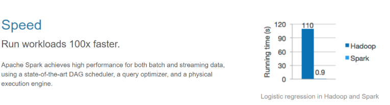

- 运行速度提高100倍(针对hadoop2.x比较，而hadoop3.x号称比spark又快10倍)

- Apache Spark使用最先进的DAG调度程序，查询优化程序和物理执行引擎，实现批量和流式数据的高性能。

- spark比mapreduce快的2个主要原因

  1. ==基于内存==

  >（1）mapreduce任务后期再计算的时候，每一个job的输出结果会落地到磁盘，后续有其他的job需要依赖于前面job的输出结果，这个时候就需要进行大量的磁盘io操作。性能就比较低。
  >
  >
  >（2）spark任务后期再计算的时候，job的输出结果可以保存在内存中，后续有其他的job需要依赖于前面job的输出结果，这个时候就直接从内存中获取得到，避免了磁盘io操作，性能比较高
  >
  >job1---->job2----->job3----->job4----->job5----->job6
  >
  >对于spark程序和mapreduce程序都会产生shuffle阶段，在shuffle阶段中它们产生的数据都会落地到磁盘。

  2. ==进程与线程==

  >（1）mapreduce任务以进程的方式运行在yarn集群中，比如程序中有100个MapTask，一个task就需要一个进程，这些task要运行就需要开启100个进程。
  >
  >（2）spark任务以线程的方式运行在进程中，比如程序中有100个MapTask，后期一个task就对应一个线程，这里就不在是进程，这些task需要运行，这里可以极端一点：
  >只需要开启1个进程，在这个进程中启动100个线程就可以了。
  >进程中可以启动很多个线程，而开启一个进程与开启一个线程需要的时间和调度代价是不一样。 开启一个进程需要的时间远远大于开启一个线程。

### 易用性

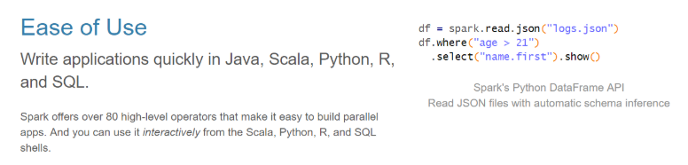

- 可以快速去编写spark程序通过 java/scala/python/R/SQL等不同语言

### 通用性

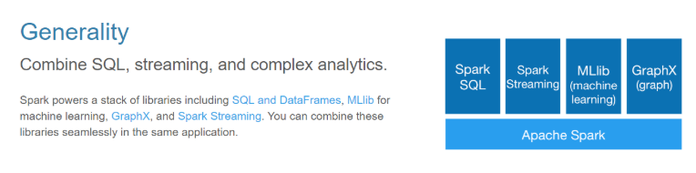

> spark框架不在是一个简单的框架，可以把spark理解成一个**生态系统**，它内部是包含了很多模块，基于不同的应用场景可以选择对应的模块去使用

* ==**sparksql**==
  * 通过sql去开发spark程序做一些离线分析
* ==**sparkStreaming**==
  * 主要是用来解决公司有实时计算的这种场景
* ==**Mlib**==
  * 它封装了一些机器学习的算法库
* ==**Graphx**==
  * 图计算

### 兼容性

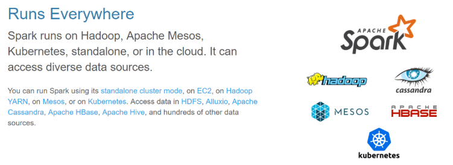

> Spark运行在Hadoop、ApacheMesos、Kubernetes、单机版或云中。它可以访问不同的数据源

* **standAlone**
  * 它是spark自带的独立运行模式，整个任务的资源分配由spark集群的老大Master负责
* **yarn**
  * 可以把spark程序提交到yarn中运行，整个任务的资源分配由yarn中的老大ResourceManager负责
* **mesos**
  * 它也是apache开源的一个类似于yarn的资源调度平台

- **cassandra**
  - *Cassandra*是一套开源分布式NoSQL数据库系统
- **kubernetes**
  - K8s用于管理云平台中多个主机上的容器化的应用

- **hbase**
  - *HBase*是一个分布式的、面向列的开源数据库

## 内置组件

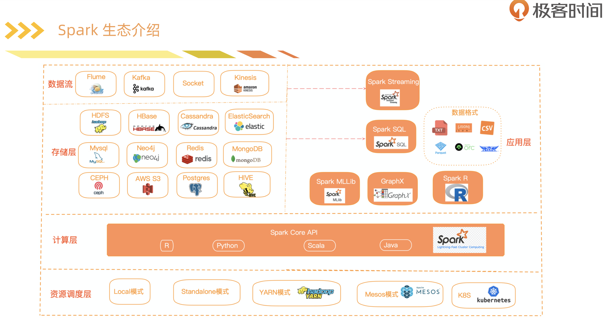

机器学习（MLlib），图计算（GraphicX），实时处理（SparkStreaming），SQL解析（SparkSql）

### 集群资源管理

1. Spark设计为可以高效的在一个计算节点到数千个计算节点之间伸缩计算，为了实现这样的要求，同时获得最大灵活性，Spark支持在各种集群资源管理器上运行，目前支持的3种如下：（上图中下三个）

   1. Hadoop YARN（国内几乎都用）
      - 可以把spark程序提交到yarn中运行，整个任务的资源分配由yarn中的老大ResourceManager负责
   2. Apach Mesos（国外使用较多）
      - 它也是apache开源的一个类似于yarn的资源调度平台。
   3. Standalone（Spark自带的资源调度器，需要在集群中的每台节点上配置Spark）
      - 它是spark自带的集群模式，整个任务的资源分配由spark集群的老大Master负责

### Spark Core(核心库)
实现了Spark的基本功能，包含任务调度、内存管理、错误恢复、与存储系统交互等模块。其中还包含了对弹性分布式数据集（RDD：Resilient Distributed DataSet）的API定义

### Spark SQL(SQL解析)

是Spark用来操作结构化数据的程序包，通过Spark SQL 我们可以使用SQL或者HQL来查询数据。且支持多种数据源：Hive、Parquet、Json等

### Spark Streaming(实时处理)

是Spark提供的对实时数据进行流式计算的组件

### Spark MLlib(机器学习)

提供常见的机器学习功能和程序库，包括分类、回归、聚类、协同过滤等。还提供了模型评估、数据导入等额外的支持功能。

### Spark GraphX(图计算)

用于图形和图形并行计算的API

# Install

## 集群安装

下载安装包并解压

### 修改配置文件

#### spark-env.sh

```bash
# conf/spark-env.sh

cp spark-env.sh.template spark-env.sh
```

```bash
export JAVA_HOME=/opt/jdk1.8
export SPARK_HISTORY_OPTS="-Dspark.history.ui.port=4000 -Dspark.history.retainedApplications=3 -Dspark.history.fs.logDirectory=hdfs://node01:8020/spark_log"
 #配置zk相关信息
export SPARK_DAEMON_JAVA_OPTS="-Dspark.deploy.recoveryMode=ZOOKEEPER  -Dspark.deploy.zookeeper.url=node01:2181,node02:2181,node03:2181  -Dspark.deploy.zookeeper.dir=/spark"
export HADOOP_CONF_DIR=/opt/hadoop/etc/hadoop
```

#### slaves

```bash
cp  slaves.template slaves
vim slaves 
```

```bash
node01
node02
node03
```

#### spark-defaults.conf

```bash
cp spark-defaults.conf.template spark-defaults.conf
vim spark-defaults.conf
```

```bash
spark.eventLog.enabled  true
spark.eventLog.dir       hdfs://node01:8020/spark_log
spark.eventLog.compress true
```

如果spark 运行过程中， 报lzo错误，将一下两项添加进来

```bash
spark.driver.extraClassPath /opt/hadoop/share/hadoop/common/hadoop-lzo-0.4.20.jar
spark.executor.extraClassPath /opt/hadoop/share/hadoop/common/hadoop-lzo-0.4.20.jar
```


### 启动

1. 先启动zk，并确保zk集群正常启动
2. 正常启动hadoop集群
3. 启动spark集群

- 可以在任意一台服务器来执行（条件：需要任意2台机器之间实现ssh免密登录）
  - ==$SPARK_HOME/sbin/start-all.sh==
  - ==sbin/start-history-server.sh==
  - 在哪里启动这个脚本，就在当前该机器启动一个Master进程
  - 整个集群的worker进程的启动由slaves文件
- 后期可以在其他机器单独在启动master
  * ==$SPARK_HOME/sbin/start-master.sh==

访问master主节点web管理界面    http://node01:8080/

如果发现8080端口被占用，可以尝试8081端口 http://node01:8081/

### 停止

* 在处于active Master主节点执行
  * ==$SPARK_HOME/sbin/stop-all.sh==

* 在处于standBy Master主节点执行
  * ==$SPARK_HOME/sbin/stop-master.sh==


# 集群模式

## 集群架构

- 执行架构图

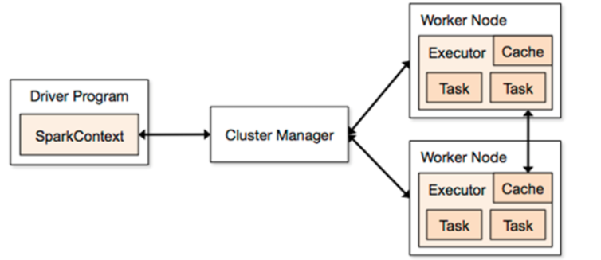

- 执行流程图

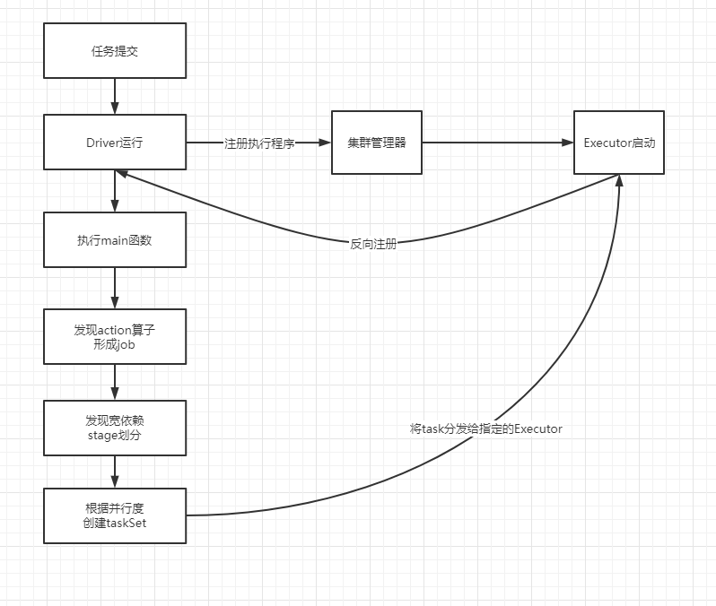

- 应用结构图

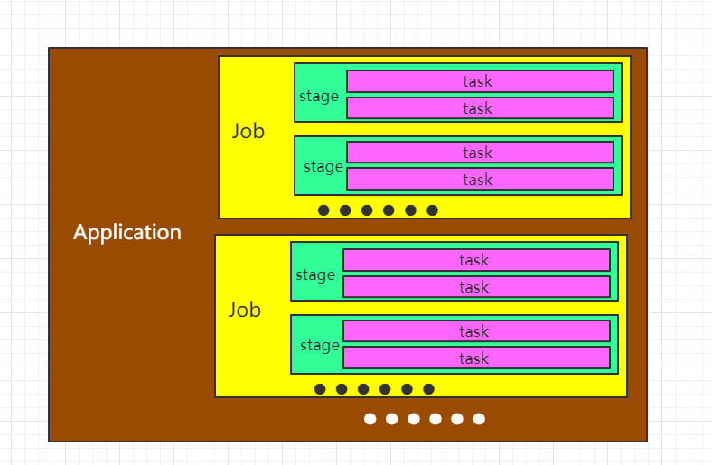

## 核心概念介绍

- 结合此图，理解这些核心概念


- Master
  - spark standalone模式下，<font color=red>Spark特有的资源调度系统Leader，掌控整个集群资源信息，类似于Yarn框架中的ResourceManager</font>
  - 监听Worker，看Worker是否正常工作
  - Master对Worker、Application等的管理（接收Worker的注册并管理所有的Worker，接收Client提交的Application，调度等待Application并向Worker提交）

- Worker
  - spark standalone模式下，Spark特有的资源调度Slave，有多个，每个Slave掌管着所在节点的资源信息，类似Yarn框架中的NodeManager
  - 通过RegisterWorker注册到Master
  - 定时发送心跳给Master
  - <font color=red>根据Master发送的Application配置进程环境，并启动ExecutorBackend（执行Task所需的计算任务进程）</font>
- Driver
  - Spark的驱动器，<font color=red>是执行开发程序中的main方法的线程</font>
  - 负责开发人员编写SparkContext、RDD，以及进行RDD操作的代码执行
  - 如果使用Spark Shell，那么启动时后台自启动了一个Spark驱动器，预加载一个叫做sc的SparkContext对象(<font color=red>该对象是所有spark程序的执行入口</font>)，如果驱动器终止，那么Spark应用也就结束了。
  - 4大主要职责：
    - 将用户程序转化为作业（Job）
    - 在Executor之间调度任务（Task）
    - 跟踪Executor的执行情况
    - 通过UI展示查询运行情况
- Excutor
  - Spark Executor是一个工作节点，负责在Spark作业中运行任务，任务间相互独立。
  - Spark应用启动时，Executor被同时启动，并且始终伴随着整个Spark应用的生命周期而存在
  - 如果有Executor节点发生了故障或崩溃，Spark应用也可以继续执行，会将出错节点上的任务调度到其他Executor节点上继续运行
  - <font color=red>两个核心功能：</font>
    - 负责运行组成Spark应用的任务，并将结果返回给驱动器（Driver）
    - 它通过自身块管理器（BlockManager）为用户程序中要求缓存的RDD提供内存式存储。RDD是直接存在Executor进程内的，因此任务可以在运行时充分利用缓存数据加速运算。
- RDDs
  - Resilient Distributed DataSet：弹性分布式数据集
  - 一旦拥有SparkContext对象，就可以用它来创建RDD

- Application应用
  - <font color=red>一个SparkContext就是一个Application（一个spark的应用程序）</font>，它是包含了客户端的代码和任务运行的资源信息
- Job作业：
  - 一个行动算子(Action)就是一个Job
- Stage阶段：
  - 一次宽依赖（一次shuffle）就是一个Stage，划分是从后往前划分
- Task任务：
  - spark任务是以task线程的方式运行在worker节点对应的executor进程中
  - 一个核心就是一个Task，体现任务的并行度

## Standalone

构建一个由 Master + Slave 构成的Spark集群，Spark运行在集群中，只依赖Spark，不依赖别的组件（如：Yarn）。(独立的Spark集群)

### Standalone-Client

```bash
bin/spark-submit \
--class org.apache.spark.examples.SparkPi \
--master spark://node01:7077 \
--deploy-mode client \
--executor-memory 2G \
--total-executor-cores 4 \
examples/jars/spark-examples_2.11-2.3.3.jar \
10 

#多master提交
bin/spark-submit \
--class org.apache.spark.examples.SparkPi \
--master spark://node01:7077,node02:7077  \
--deploy-mode client \
--executor-memory 1G \
--total-executor-cores 2 \
examples/jars/spark-examples_2.11-2.3.3.jar \
10
```

### Standalone-Cluster

```bash
bin/spark-submit \
--class org.apache.spark.examples.SparkPi \
--master spark://node01:7077  \
--deploy-mode cluster \
--executor-memory 1G \
--total-executor-cores 2 \
examples/jars/spark-examples_2.11-2.3.3.jar \
10
```

> spark集群中有很多个master，并不知道哪一个master是活着的master，即使你知道哪一个master是活着的master，它也有可能下一秒就挂掉，这里就可以把所有master都罗列出来
> --master spark://node01:7077,node02:7077,node03:7077
>
> 后期程序会轮训整个master列表，最终找到活着的master，然后向它申请计算资源，最后运行程序。

- Standalone-Client流程图

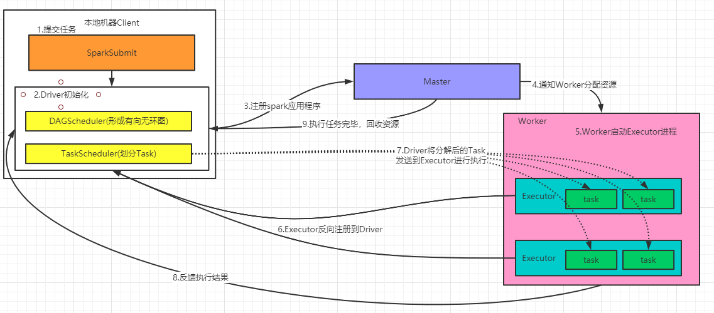

1. 提交Spark-submit任务，启动应用程序
2. Driver初始化，在SparkContext启动过程中，先初始化DAGScheduler 和 TaskSchedulerImpl两个调度器， 
3. Driver向Master注册应用程序。Master收到注册消息后把应用放到待运行应用列表。
4. Master使用自己的`资源调度算法`分配Worker资源给应用程序。
5. 应用程序获得Worker时，Master会通知Worker中的WorkerEndpoint创建CoarseGrainedExecutorBackend进程，在该进程中创建执行容器Executor。
6. Executor创建完毕后发送消息到Master 和 DriverEndpoint。在SparkContext创建成功后， 等待Driver端发过来的任务。
7. SparkContext分配任务给CoarseGrainedExecutorBackend执行，在Executor上按照一定调度执行任务(这些任务就是代码)
8. CoarseGrainedExecutorBackend在处理任务的过程中把任务状态发送给SparkContext，SparkContext根据任务不同的结果进行处理。如果任务集处理完毕后，则继续发送其他任务集。
9. 应用程序运行完成后，SparkContext会进行资源回收。

- Standalone-Cluster流程图

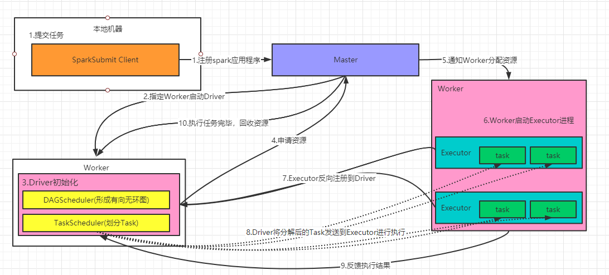

## Mesos

## YARN

## Kubernetes


# RDD

Resilient Distributed DataSet：弹性分布式数据集，是Spark中最基本数据抽象，可以理解为数据集合。

- **Dataset**:         数据集合，存储很多数据.
- **Distributed**：RDD内部的元素进行了分布式存储，方便于后期进行分布式计算.
- **Resilient**：     表示弹性，RDD的数据是可以保存在内存或者是磁盘中.

在代码中是一个抽象类，它代表一个弹性的、不可变的、可分区，里面的元素可并行计算的集合。

## RDD的五个主要特性

1. A list of partitions(分区性)

   - RDD有很多分区，每一个分区内部是包含了该RDD的部分数据
   - 因为有多个分区，那么一个分区（Partition）列表，就可以看作是数据集的基本组成单位

   - spark中任务是以task线程的方式运行，对于RDD来说，每个分区都会被一个计算任务处理， 一个分区就对应一个task线程，故分区就决定了并行计算的粒度。
   - 用户可以在创建RDD时，指定RDD的分区数，如果没有指定，那么采用默认值（程序所分配到的CPU Core的数目）
   - 每个分配的储存是由Bl·ockManager实现的，每个分区都会被逻辑映射成BlockManager的一个Block，而这个Block会被一个Task负责计算。

2. A function for computing each split(计算每个分区的函数)

   - Spark中RDD的计算是以分区为单位的，每个RDD都会实现compute函数以达到这个目的

3. A list of dependencies on other RDDs(依赖性--一个rdd会依赖于其他多个rdd)

   - spark任务的容错机制就是根据这个特性（血统）而来。
   - RDD的每次转换都会生成一个新的RDD，所以RDD之间会形成类似于流水线一样的前后依赖关系，在部分分区数据丢失时，Spark可以通过这个依赖关系重新计算丢失的分区数据，而不是对RDD的所有分区进行重新计算。

4. Optionally, a Partitioner for key-value RDDs (e.g. to say that the RDD is hash-partitioned)--(对储存键值对的RDD，还有一个可选的分区器)
   - 只有对于key-value的RDD(RDD[(String, Int)]),并且产生shuffle，才会有Partitioner，非key-value的RDD(RDD[String])的Parititioner的值是None。
   - Partitioner不但决定了RDD的分区数量，也决定了parent RDD Shuffle输出时的分区数量
   - 当前Spark中实现了两种类型的分区函数，一个是基于哈希的HashPartitioner，(key.hashcode % 分区数= 分区号)。它是默认值，另外一个是基于范围的RangePartitioner。

5. Optionally, a list of preferred locations to compute each split on (e.g. block locations for an HDFS file)--(储存每个分区优先位置的列表(本地计算性))

   - 比如对于一个HDFS文件来说，这个列表保存的就是每个Partition所在文件块的位置，按照“移动数据不如移动计算”的理念，Spark在进行任务调度的时候，会尽可能地将计算任务分配到其所要处理数据块的储存位置，减少数据的网络传输，提升计算效率。

## RDD依赖关系

### RDD的依赖关系

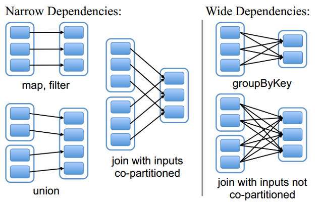

- RDD和它依赖的父RDD的关系有两种不同的类型
- 窄依赖（narrow dependency）和宽依赖（wide dependency）

#### 窄依赖（不会shuffle）

- 窄依赖指的是每一个父RDD的Partition最多被子RDD的一个Partition使用
  - 如果RDD2由RDD1计算得到，则RDD2就是子RDD，RDD1就是父RDD
  - 如果依赖关系在设计的时候就可以确定，而不需要考虑父RDD分区中的记录，并且父RDD中的每个分区最多只有一个子分区，这就叫窄依赖
  - 父RDD的每个分区中的数据最多被一个子RDD的分区使用

>窄依赖我们形象的比喻为独生子女

* 哪些算子操作是窄依赖：
  map/flatMap/filter/union等等

#### 宽依赖（会shuffle）

- 宽依赖指的是多个子RDD的Partition会依赖同一个父RDD的Partition
  - 宽依赖往往对应着shuffle操作，需要在运行过程中将同一个父RDD的分区传入到不同的子RDD分区中。
  - 对于宽依赖，重算的父RDD分区对应多个子RDD分区，这样实际上父RDD 中只有一部分的数据是被用于恢复这个丢失的子RDD分区的，另一部分对应子RDD的其它未丢失分区，这就造成了多余的计算；
  - 宽依赖中子RDD分区通常来自多个父RDD分区，极端情况下，所有的父RDD分区都要进行重新计算。

> 宽依赖我们形象的比喻为超生

* 哪些算子操作是宽依赖：
  reduceByKey/sortByKey/groupBy/groupByKey/join等等

## lineage（血统）

- RDD只支持粗粒度转换
  - 即只记录单个块上执行的单个操作。
- 将创建RDD的一系列Lineage（即血统）记录下来，以便恢复丢失的分区
- RDD的Lineage会记录RDD的元数据信息和转换行为，lineage保存了RDD的依赖关系，当该RDD的部分分区数据丢失时，它可以根据这些信息来重新运算和恢复丢失的数据分区


## RDD的缓存机制

可以把一个rdd的数据缓存起来，后续有其他的job需要用到该rdd的结果数据，可以直接从缓存中获取得到，避免了重复计算。缓存是加快后续对该数据的访问操作。

* RDD通过<font color=red>persist</font>方法或<font color=red>cache</font>方法可以将前面的计算结果缓存。
  * 但是并不是这两个方法被调用时立即缓存，而是等触发后面的action时，该RDD将会被缓存在计算节点的内存中，并供后面重用
  * 一但程序结束，那么缓存就清除了


### 什么时候设置缓存

某个rdd的数据后期被使用了多次的时候

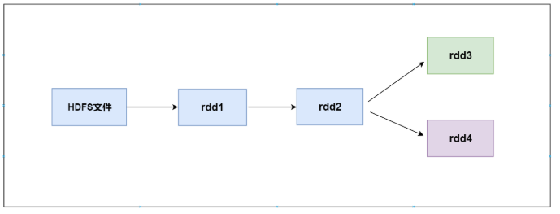

>如上图所示的计算逻辑： 
>（1）当第一次使用rdd2做相应的算子操作得到rdd3的时候，就会从rdd1开始计算，先读取HDFS上的文件，然后对rdd1 做对应的算子操作得到rdd2,再由rdd2计算之后得到rdd3。同样为了计算得到rdd4，前面的逻辑会被重新计算。
>
>（2）默认情况下多次对一个rdd执行算子操作， rdd都会对这个rdd及之前的父rdd全部重新计算一次。 这种情况在实际开发代码的时候会经常遇到，但是我们一定要避免一个rdd重复计算多次，否则会导致性能急剧降低。   
>
>总结：
>可以把多次使用到的rdd，也就是公共rdd进行持久化，避免后续需要，再次重新计算，提升效率。


- 为了获取得到一个rdd的结果数据，经过了大量的算子操作或者是计算逻辑比较复杂，总之某个rdd的数据来之不易的时候
  - val rdd2=rdd1.flatMap(函数).map(函数).reduceByKey(函数).xxx.xxx.xxx.xxx.xxx....

### 清除缓存数据

1. 自动清除：一个application应用程序结束之后，对应的缓存数据也就自动清除
2. 手动清除：调用rdd的unpersist方法

## RDD的checkpoint机制

### checkpoint概念

- 我们可以对rdd的数据进行缓存，保存在内存或者是磁盘中。

  - 后续就可以直接从内存或者磁盘中获取得到，但是它们不是特别安全。
  - **cache**：它是直接把数据保存在内存中，后续操作起来速度比较快，直接从内存中获取得到。但这种方式很不安全，由于服务器挂掉或者是进程终止，会导致数据的丢失。
  - **persist**：它可以把数据保存在本地磁盘中，后续可以从磁盘中获取得到该数据，但它也不是特别安全，由于系统管理员一些误操作删除了，或者是磁盘损坏，也有可能导致数据的丢失。
- **checkpoint**（检查点）
- 它是提供了一种相对而言更加可靠的数据持久化方式。它是把数据保存在分布式文件系统，
  比如HDFS上。这里就是利用了HDFS高可用性，高容错性（多副本）来最大程度保证数据的安全性。

### cache、persist、checkpoint三者区别

- cache和persist
  - cache默认数据缓存在内存中
  - persist可以把数据保存在内存或者磁盘中
  - 后续要触发 cache 和 persist 持久化操作，需要有一个action操作
  - 它不会开启其他新的任务，一个action操作就对应一个job 
  - 它不会改变rdd的依赖关系，程序运行完成后对应的缓存数据就自动消失
- checkpoint
  - 可以把数据持久化写入到hdfs上
  - checkpoint操作要执行==需要有一个action操作==，一个action操作对应后续的一个job。该job执行完成之后，它会再次单独开启另外一个job来执行 rdd1.checkpoint操作。
  - 它会改变rdd的依赖关系，后续数据丢失了不能够在通过血统进行数据的恢复。
  - 程序运行完成后对应的checkpoint数据就不会消失
  - 持久化的数据丢失可能性更大，磁盘、内存都有可能会存在数据丢失情况。但是checkpoint的数据通常是储存在如HDFS等容错、高可用的文件系统，数据丢失可能性较小。
  - 默认情况下，如果某个RDD没有缓存持久化，但是设置了checkpoint Job想要将RDD的数据写入文件系统，需要全部重新计算一次，再将计算出来的RDD数据checkpoint到文件系统，所以在调用checkpoint操作之前，可以先来做一个cache操作，缓存对应rdd的结果数据，后续就可以直接从cache中获取到rdd的数据写入到指定checkpoint目录中，这样RDD只需要计算一次就可以了。


# spark的内存管理


# 数据倾斜原理和现象分析

## 数据倾斜概述

有的时候，我们可能会遇到大数据计算中一个最棘手的问题——数据倾斜，此时Spark作业的性能会比期望差很多。
数据倾斜调优，就是使用各种技术方案解决不同类型的数据倾斜问题，以保证Spark作业的性能。

## 数据倾斜发生时的现象

1. 绝大多数task执行得都非常快，但个别task执行极慢

2. 绝大数task执行很快，有的task直接报OOM (Jvm Out Of Memory) 异常

## 数据倾斜发生的原因

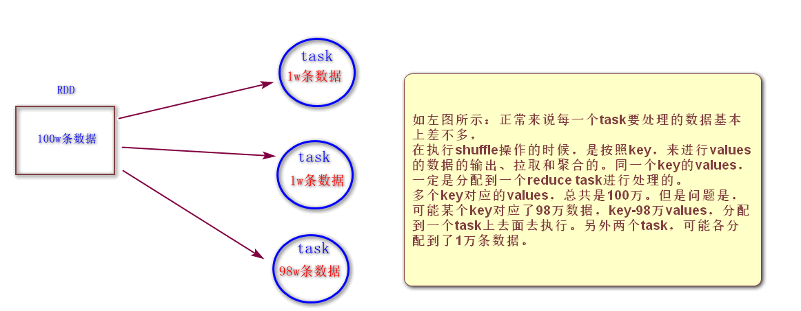

## 数据倾斜如何定位原因

- 主要是根据log日志信息去定位

  数据倾斜只会发生在shuffle过程中。这里给大家罗列一些常用的并且可能会触发shuffle操作的算子：distinct、groupByKey、reduceByKey、aggregateByKey、join、cogroup、repartition等。
  出现数据倾斜时，可能就是你的代码中使用了这些算子中的某一个所导致的。因为某个或者某些key对应的数据，远远的高于其他的key。

- 分析定位逻辑

  由于代码中有大量的shuffle操作，一个job会划分成很多个stage，首先要看的，就是数据倾斜发生在第几个stage中。
  可以在任务运行的过程中，观察任务的UI界面，可以观察到每一个stage中运行的task的数据量，从而进一步确定是不是task分配的数据不均匀导致了数据倾斜。
  比如下图中，倒数第三列显示了每个task的运行时间。明显可以看到，有的task运行特别快，只需要几秒钟就可以运行完;而有的task运行特别慢，需要几分钟才能运行完，此时单从运行时间上看就已经能够确定发生数据倾斜了。
  此外，倒数第一列显示了每个task处理的数据量，明显可以看到，运行时间特别短的task只需要处理几百KB的数据即可，而运行时间特别长的task需要处理几千KB的数据，处理的数据量差了10倍。此时更加能够确定是发生了数据倾斜。

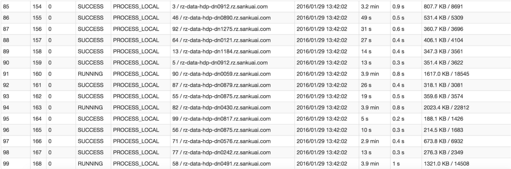

- **某个task莫名其妙内存溢出的情况**

  这种情况下去定位出问题的代码就比较容易了。我们建议直接看yarn-client模式下本地log的异常栈，或者是通过YARN查看yarn-cluster模式下的log中的异常栈。一般来说，通过异常栈信息就可以定位到你的代码中哪一行发生了内存溢出。然后在那行代码附近找找，一般也会有shuffle类算子，此时很可能就是这个算子导致了数据倾斜。

  但是大家要注意的是，不能单纯靠偶然的内存溢出就判定发生了数据倾斜。因为自己编写的代码的bug，以及偶然出现的数据异常，也可能会导致内存溢出。因此还是要按照上面所讲的方法，通过Spark Web UI查看报错的那个stage的各个task的运行时间以及分配的数据量，才能确定是否是由于数据倾斜才导致了这次内存溢出。


- **查看导致数据倾斜的key的数据分布情况**

  知道了数据倾斜发生在哪里之后，通常需要分析一下那个执行了shuffle操作并且导致了数据倾斜的RDD/Hive表，查看一下其中key的分布情况。这主要是为之后选择哪一种技术方案提供依据。针对不同的key分布与不同的shuffle算子组合起来的各种情况，可能需要选择不同的技术方案来解决。

  此时根据你执行操作的情况不同，可以有很多种查看key分布的方式：

  * 如果是Spark SQL中的group by、join语句导致的数据倾斜，那么就查询一下SQL中使用的表的key分布情况。
  * 如果是对Spark RDD执行shuffle算子导致的数据倾斜，那么可以在Spark作业中加入查看key分布的代码，比如RDD.countByKey()。然后对统计出来的各个key出现的次数，collect/take到客户端打印一下，就可以看到key的分布情况。

  举例来说，对于上面所说的单词计数程序，如果确定了是stage1的reduceByKey算子导致了数据倾斜，那么就应该看看进行reduceByKey操作的RDD中的key分布情况，在这个例子中指的就是pairs RDD。如下示例，我们可以先对pairs采样10%的样本数据，然后使用countByKey算子统计出每个key出现的次数，最后在客户端遍历和打印样本数据中各个key的出现次数。

```ruby
val sampledPairs = pairs.sample(false, 0.1)
val sampledWordCounts = sampledPairs.countByKey()
sampledWordCounts.foreach(println(_))
```

## 数据倾斜原因总结

- 数据本身问题
  - key本身分布不均衡（包括大量的key为空）
  - key的设置不合理
- spark使用不当的问题
  - shuffle时的并发度不够
  - 计算方式有误


# review

## cache和persist区别

对RDD设置缓存成可以调用rdd的2个方法： 一个是cache，一个是persist，调用这2个方法都可以对rdd的数据设置缓存，但不是立即就触发缓存执行，后面需要有action，才会触发缓存的执行。

cache:   默认是把数据缓存在内存中，其本质就是调用persist方法；
persist：可以把数据缓存在内存或者是磁盘，有丰富的缓存级别，这些缓存级别都被定义StorageLevel这个object中。

