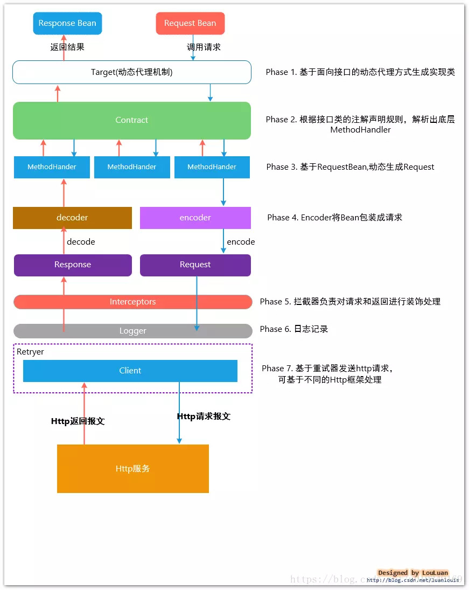
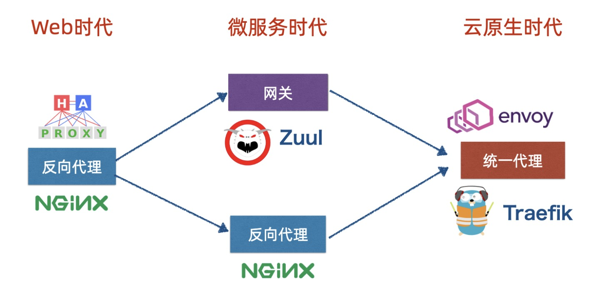
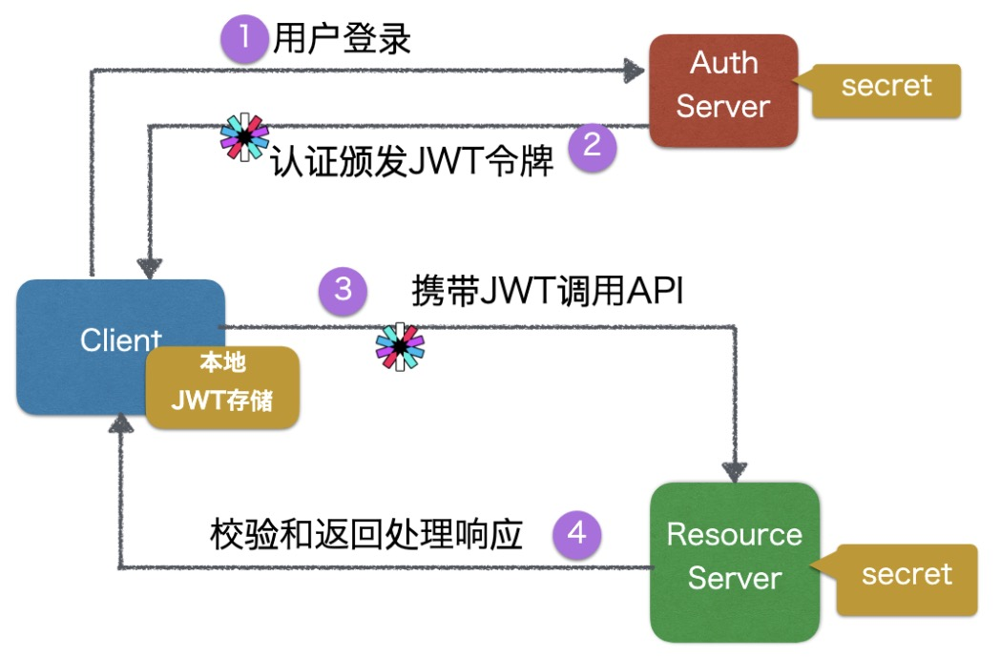
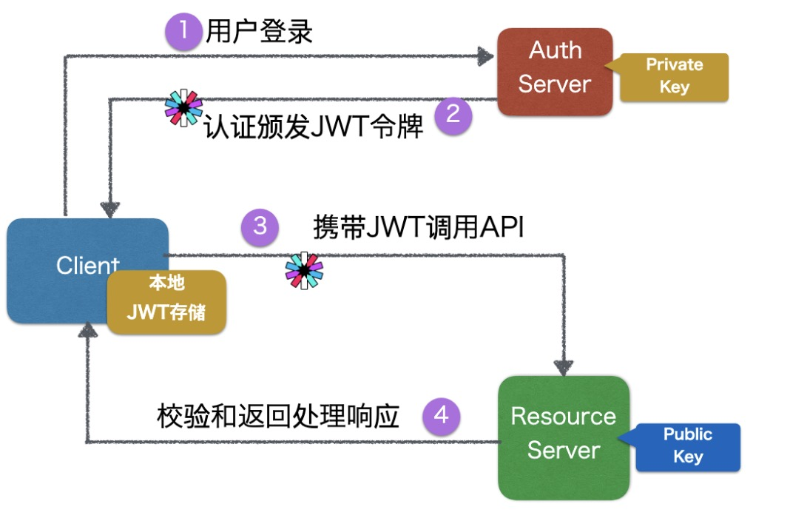
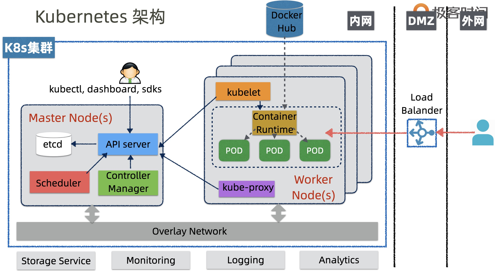

# Spring boot


## Spring Boot与Kubernetes云原生微服务实践

### 服务开发框架设计和实现

#### 单体仓库 （Mono-Repo）

##### 参考链接

https://blog.shippable.com/our-journey-to-microservices-and-a-mono-repository

#### 微服务接口参数校验为何重要

防止调用遗产和关键服务因为参数问题导致宕机。


#### 实现统一异常处理


#### DTO和DMO为什么要互转

**DMO** Data Model Object

表现层与应用层之间是通过数据传输对象（DTO）进行交互的，数据传输对象是没有行为的POCO对象，它 的目的只是为了对领域对象进行数据封装，实现层与层之间的数据传递。为何不能直接将领域对象用于 数据传递？因为领域对象更注重领域，而DTO更注重数据。不仅如此，由于“富领域模型”的特点，这样 做会直接将领域对象的行为暴露给表现层。

需要了解的是，数据传输对象DTO本身并不是业务对象。数据传输对象是根据UI的需求进行设计的，而不 是根据领域对象进行设计的。比如，Customer领域对象可能会包含一些诸如FirstName, LastName, Email, Address等信息。但如果UI上不打算显示Address的信息，那么CustomerDTO中也无需包含这个 Address的数据

重构系统的时候实体模型可能变化很大。

##### 参考

[java中5中mapping框架性能对比](https://www.baeldung.com/java-performance-mapping-frameworks)

#### 实现基于Feign的强类型接口



直接使用http status code 来封装消息体，会造成内部调用逻辑变的复杂，要额外去处理内部的各种http的错误。没有直接封装消息体，ResponseDto 这类的简单

#### 为什么框架层就要考虑分环境配置

通过规范多环境和定义研发流程，同时提升交付质量和效率。

通过定义环境，在开发环境，发送短信只能发送至公司开发测试的手机。 

#### 异步处理为何要复制线程上下文信息

* 被调用的异步操作不能跟调用方在同一个bean中

* 调用和被调用操作将由不同的线程执行，线程上下文会发生变化，一些如用户认证信息之类的信息会被断开。需要copy线程上下文

##### Fire and Forget

我们首先看到最基础的模式 fire and forget 即发送后遗忘

#### swagger文档

##### 参考

https://swagger.io/docs/specification/about/

### 可编程网关设计和实践

#### 网关和BFF

##### 参考
[微服务架构 BFF和网关是如何演化出来的](https://cloud.tencent.com/developer/news/229123)

#### 网关和反向代理的关系



#### 网关设计

* 限流熔断
* 动态路由和负载均衡
* 基于Path的路由 
  * api.xxx.com/pathx
* 截获器链
* 日志采集和Metrics埋点
* 响应流优化

#### 主流网关比较

|                      | 支持公司        | 实现语言      | 优点                               | 缺点                     |
| -------------------- | --------------- | ------------- | ---------------------------------- | ------------------------ |
| nginx                | Nginx Inc       | C/Lua         | 高性能，成熟稳定                   | 门槛高，偏运维，可编程弱 |
| Kong                 | Kong Inc        | OpenResty/Lua | 高性能，可编程API                  | 门槛较高                 |
| zuul1                | Netflix/Pivotal | Java          | 成熟，简单门槛低                   | 性能一般，可编程一般     |
| Spring Cloud Gateway | Pivotal         | Java          | 异步，配置灵活                     |                          |
| Envoy                | Lyft            | C++           | 高性能，可编程API/ ServiceMesh集成 | 门槛较高                 |
| Traefik              | Containous      | go            | 云原生，可编程API/对接公众服务发现 |                          |

### 安全架构设计和实践

#### cookie

#### session

#### oauth

#### jwt

JSON Web令牌（JWT）是一个开放标准（[(RFC 7519](https://link.jianshu.com?t=https://tools.ietf.org/html/rfc7519)).，它定义了一种紧凑且独立的方法，用于在各方之间安全地将信息作为JSON对象传输。 由于此信息是经过数字签名的，因此可以被验证和信任。 可以使用HMAC算法或使用RSA或ECDSA的公用/专用密钥对对JWT进行签名。

##### JWT的构成

1. 头部（header)

   - 声明类型，这里是jwt
   - 声明加密的算法 通常直接使用 HMAC SHA256

   完整的头部就像下面这样的JSON：

   ```bash
   {
     'typ': 'JWT',
     'alg': 'HS256'
   }
   ```

   然后将头部进行base64加密（该加密是可以对称解密的),构成了第一部分.

   ```undefined
   eyJ0eXAiOiJKV1QiLCJhbGciOiJIUzI1NiJ9
   ```

2. 载荷（payload, 类似于飞机上承载的物品)

   载荷就是存放有效信息的地方。这个名字像是特指飞机上承载的货品，这些有效信息包含三个部分

   - 标准中注册的声明
   - 公共的声明
   - 私有的声明

   **标准中注册的声明** (建议但不强制使用) ：

   - **iss**: jwt签发者
   - **sub**: jwt所面向的用户
   - **aud**: 接收jwt的一方
   - **exp**: jwt的过期时间，这个过期时间必须要大于签发时间
   - **nbf**: 定义在什么时间之前，该jwt都是不可用的.
   - **iat**: jwt的签发时间
   - **jti**: jwt的唯一身份标识，主要用来作为一次性token,从而回避重放攻击。

   **公共的声明** ：
    公共的声明可以添加任何的信息，一般添加用户的相关信息或其他业务需要的必要信息.但不建议添加敏感信息，因为该部分在客户端可解密.

   **私有的声明** ：
    私有声明是提供者和消费者所共同定义的声明，一般不建议存放敏感信息，因为base64是对称解密的，意味着该部分信息可以归类为明文信息。

   定义一个payload:

   ```json
   {
     "sub": "1234567890",
     "name": "John Doe",
     "admin": true
   }
   ```

   然后将其进行base64加密，得到Jwt的第二部分。

   ```undefined
   eyJzdWIiOiIxMjM0NTY3ODkwIiwibmFtZSI6IkpvaG4gRG9lIiwiYWRtaW4iOnRydWV9
   ```

3. 签证（signature)

   jwt的第三部分是一个签证信息，这个签证信息由三部分组成：

   - header (base64后的)
   - payload (base64后的)
   - secret

   这个部分需要base64加密后的header和base64加密后的payload使用`.`连接组成的字符串，然后通过header中声明的加密方式进行加盐`secret`组合加密，然后就构成了jwt的第三部分。

##### jwt加密算法

###### hmac



###### RSA



##### 参考

https://jwt.io/


### 服务测试设计和实践

| 分类       | 功能                                 |
| ---------- | ------------------------------------ |
| 单元测试   | 确保类、模块功能正确                 |
| 集成测试   | 确保组件间接口、交互和链路正确       |
| 组件测试   | 确保微服务作为独立整体，接口功能正确 |
| 契约测试   | 确保服务提供方和消费方都遵守契约规范 |
| 端到端测试 | 确保整个应用满足用户需求             |
| 探索测试   | 手工探索学习系统功能，改进自动化测试 |


#### 契约驱动测试

契约测试也叫消费者驱动测试。
 两个角色：消费者（Consumer）和 生产者（Provider）
 一个思想：需求驱动（消费者驱动）
 契约文件：由Consumer端和Provider端共同定义的规范，包含API路径，输入，输出。通常由Consumber生成。
 实现原理：Consumer 端提供一个类似“契约”的东西（如json 文件，约定好request和response）交给Provider 端，告诉Provider 有什么需求，然后Provider 根据这份“契约”去实现。

#### mock vs spy

mock方法和spy方法都可以对`对象`进行mock。但是前者是接管了对象的全部方法，而后者只是将有桩实现（stubbing）的调用进行mock，其余方法仍然是实际调用。


#### 性能测试

##### JMeter

##### Gatling

### 可运维架构设计和实践

#### Apollo vs Spring Cloud Config vs K8s ConfigMap

|                | Apollo                                | Spring Cloud Config | K8s ConfigMap      |
| -------------- | ------------------------------------- | ------------------- | ------------------ |
| 配置界面       | 同一界面管理不同环境和集群配置        | 无，通过git操作     | cli或者Dashboard   |
| 配置存储       | DB                                    | Git                 | Etcd               |
| 配置生效时间   | 实时推送+应用配合                     | 近实时+应用配合     | 近实时+应用配合    |
| 动态配置       | 支持，实时推送                        | 复杂+Mq             | 支持发布更新       |
| 版本管理       | UI支持发布历史和回滚                  | 无，通过git操作     | 无，需自己管理     |
| 灰度发布       | 支持                                  | 不支持              | 支持               |
| 授权/审计/审核 | UI操作，修改和发布权限分离            | 通过git仓库设置     | k8s平台部分支持    |
| 实例配置监控   | 可见哪些客户端配置生效                | 不支持              | 可查询容器环境变量 |
| 客户端支持     | 原生java/.net,提供API，支持spring标注 | spring应用+标注支持 | 语言无关           |

#### CAT vs Zipkin vs Skywalking

|              | CAT                                 | Zipkin                                          | Skywalking                        |
| ------------ | ----------------------------------- | ----------------------------------------------- | --------------------------------- |
| 调用链可视化 | 有                                  | 有                                              | 有                                |
| 聚合报表     | 非常丰富                            | 少                                              | 较丰富                            |
| 服务依赖图   | 简单                                | 简单                                            | 好                                |
| 埋点方式     | 侵入                                | 侵入                                            | 非侵入，运行期字节码增强          |
| vm指标监控   | 好                                  | 无                                              | 有                                |
| 告警支持     | 有                                  | 无                                              | 有                                |
| 多语言支持   | Java/.net                           | 丰富                                            | Java/.net/nodejs/php自动  go 手动 |
| 存储机制     | Mysql报表，本地文件/ HDFS（调用链） | 可选in memory, mysql, es(生产), cassandra(生产) | h2, es(生产)                      |
| 社区         | 点评/美团                           | 国外主流                                        | apache，国内社区                  |
| apm          | yes                                 | no                                              | yes                               |
| 同类产品     | 无                                  | Uber Jaeger, spring cloud sleuth                | Naver pinpoint                    |
| 优点         | 企业级生产，报表丰富                | 社区生态好                                      | 非侵入                            |
| 缺点         | 用户体验一般，社区一般              | apm报表能力弱                                   | 时间不长，文档一般，仅限中文社区  |

#### 结构化日志和业务审计日志

#### 集中异常日志监控和Sentry

### 服务容器化和Docker Compose部署

### 云原生架构和Kubernetes容器云部署

#### 云原生定义

Applications adopting the principles of Microservicespackaged as Containers orchestracted by Platformsrunning on top of Cloud infrastructure, developed using practices such as Continous Delivery and DevOps. 

基于微服务原理而开发的应用，以容器方式打包。在运行时，容器由运行于云基础设施之上的平台进行调度。应用开发采用持续交付和 DevOps 实践

#### Kubernetes背景

##### 架构



##### 附录

https://medium.com/containermind/a-new-era-of-container-cluster-management-with-kubernetes-cd0b804e1409

#### Kubernetes 基本概念

##### 集群

##### 容器 Container

##### pod

##### 副本集 ReplicaSet

##### 服务 Service

##### 发布 Deployment

##### 滚动发布 Rolling Update

##### ConfigMap/Secret

##### DaemonSet

##### Volume

##### PersistentVolume

##### PersistentVolumeClaims

##### StatefulSet

##### Job

##### CronJob


