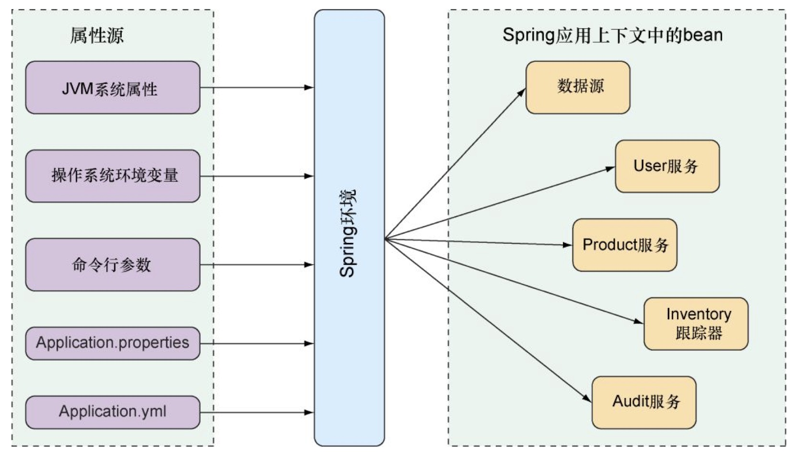
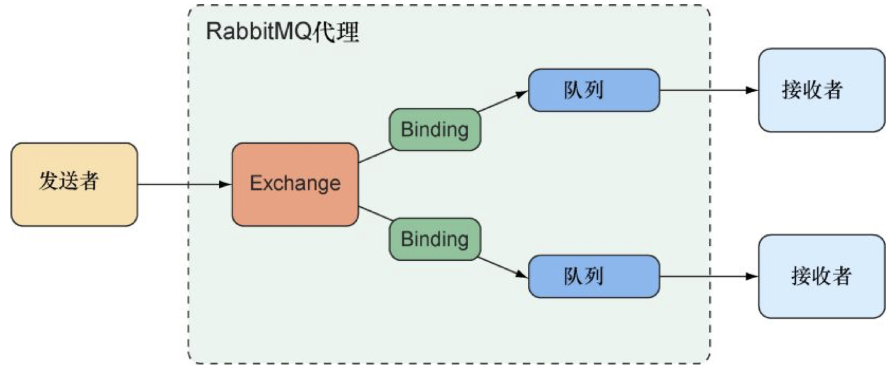
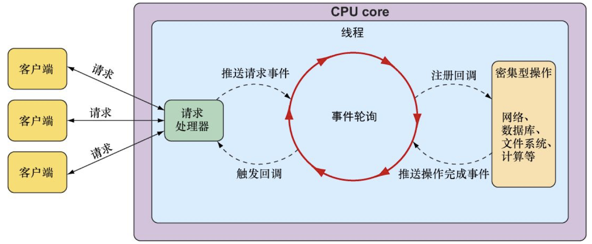
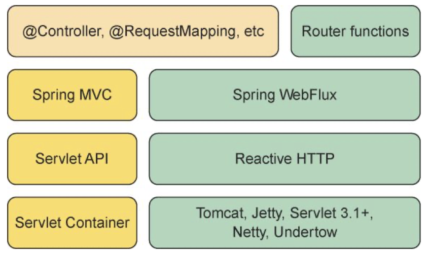
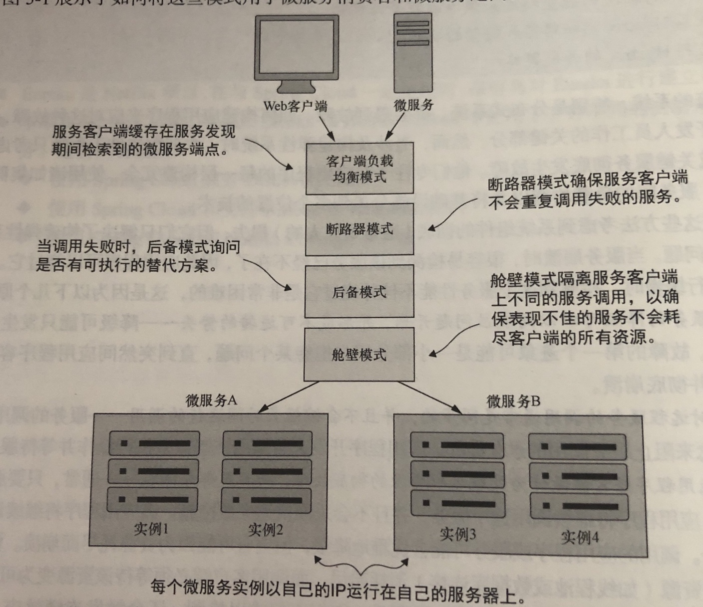

# 配置属性

## 细粒度的自动配置

### 理解Spring的环境抽象

Spring环境从各个属性源中拉取属性，并让Spring应用上下中的bean可以使用他们



几种spring环境属性的设置

```bash
server.port=9000      # properties
server:               # ymal
    port: 9000
java -jar test.jar --server.port=9000       # java
export SERVER_PORT=9000                     # 环境变量，注意，命名方式的不通
```

## 自定义配置属性

在bean上添加@ConfigurationProperties注解，就会为bean中的属性根据Spring环境注入值。

### 声明配置属性元数据

创建自定义配置属性的元数据，需要在META-INF下创建一个名为`additional-spring-configuration-metadata.json`的文件。默认在项目的`src/main/resources/META-INFO`下。

```json 
{
  "properties": [
    {
      "name": "taco.orders.page-size",
      "type": "java.lang.String",
      "description": "Sets the maximum number of orders to display in a list."
    },
    {
      "name": "taco.discount.codes",
      "type": "java.util.Map<String, Integer>",
      "description": "A map of discount codes to a discount percentage."
    }
  ]
}

```

### 使用profile进行配置

#### 定义特定profile属性

定义特定profile属性文件，遵守如下约定`application-{profile name}.yaml 或 application-{profile name}.properties`

#### 使用profile条件化地创建bean

`@Profile`注解可以把bean设置为仅适用于给定的profile

```java
@Profile({"dev", "test"})
public CommandLineRunner dataLoader() {

}
```


# 异步消息

## JMS

## RabbitMQ和AMQP

AMQP消息使用Exchange和routing key来寻址，这样消息就与接收者要监听的队列解耦了。

Exchange和队列的关系如下



发送到RabbitMQ Exchange的消息会基于routing key和binding被路由到一个或多个队列上

Exchange 的类型

* Default 这是代理创建的特殊Exchange。它会将消息路由至名字与消息routing key相同的队列。所有的队列都会自动绑定至Default Exchange。
* Direct 如果消息的routing key与队列的binding key相同，那么消息将会路由到该队列上
* Topic 如果消息的routing key与队列的binding key(可能会包含通配符)匹配，那么消息将会路由到一个或多个这样的队列上。
* Fanout 不管routing key 和binding key是什么，消息都会路由到所有绑定队列上
* Headers 与Topic Exchange类似，只不过要基于消息的头信息进行路由，而不是routing key
* Dead letter 捕获所有无法投递(也就是他们无法匹配所有已定义的Exchange和队列的binding关系)的消息。


## Kafka

[kafka](./kafka.md)


# Integration


# Reactor

## 反应式编程概览

反应式编程是一种可以替代命令式编程的编程范式。

反应式编程本质上是函数式和声明式的。相对于描述一组将依次执行的步骤，反应式编程描述了数据将会流经的管道或者流。相对于要求将被处理的数据作为一个整体进行处理，反应式流可以在数据可用时立即开始处理。

### 定义反应式流

反应式流可以总结为4个接口

* Publisher 负责生成数据并将数据发送给`Subscription`

  ```java
  interface Publisher<T> {
    void subscribe(Subscriber<? super T> subscriber);
  }
  ```

* Subscriber 通过`Publisher`的`subscribe()`方法向Publisher发起订阅

  ```java
  interface Subscriber<T> {
    void onSubscribe(Subscription sub);
    void onNext(T item);
    void onError(Throwable ex);
    void onComplete();
  }
  ```

* Subscription 通过Subscription，Subscriber管理其订阅情况

  ```java
  interface Subscription {
    /**
    * 请求Publisher发送数据
    * @param n 表明愿意接受多少数据
    **/
    void request(long n);
    /**
    * 取消订阅
    */
    void cancel();
  }
  ```

* Processor `Subscriber`和`Publisher`的组合

  ```java
  interface Processor<T, R> extends Subscriber<T>, Publisher<R> {}
  ```

  作为`Subscriber`时，`Processor`会接受数据并以某种方式对数据进行处理，然后它会将角色转换为`Publisher`,并将处理的结果发布给它的`Subscriber`

## Reactor


# WebFlux



异步web框架能够以更少的线程获得更高的可扩展性，通常它们只需要与CPU核心数量相同的线程。通过使用时间轮询（event looping）机制，能够用一个线程处理很多请求，这样每次连接的成本会更低。

**Spring 5 通过名为WebFlux的新Web框架来支持反应式Web应用**




# spring


### 控制反转（Inversion of Control，IoC）

* 常见另一种叫法**依赖注入（Dependency Injection，DI）**, 还有一种叫法**依赖查找(Dependency Lookup)** 对象在被创建的时候，由IoC容器注入，对象的创建的控制权由IoC容器负责

* Class A中用到了Class B的对象b，一般情况下，需要在A的代码中显式的new一个B的对象。		
采用依赖注入技术之后，A的代码只需要定义一个私有的B对象，不需要直接new来获得这个对象，而是通过相关的容器控制程序来将B对象在外部new出来并注入到A类里的引用中。而具体获取的方法、对象被获取时的状态由配置文件（如XML）来指定。

### spring 应用上下文
* AnnotationConfigApplicationContext：从一个或多个基于Java的配置类中加载Spring应用上下文。 
* AnnotationConfigWebApplicationContext：从一个或多个基于Java的配置类中加载Spring Web应用上下文。
* ClassPathXmlApplicationContext：从类路径下的一个或多个XML配置文件中加载上下文定义，把应用上下文的定义文件作为类资源。
* FileSystemXmlapplicationcontext：从文件系统下的一个或多个XML配置文件中加载上下文定义。 
* XmlWebApplicationContext：从Web应用下的一个或多个XML配置文件中加载上下文定义。

### Bean
[Spring Bean Init](../uml/Spring Bean Init.pu)

## Web MVC

### DispatcherServlet
#### interception

所有HandlerMapping注解的方法都支持拦截器，当想要将特定的功能应用到特定的请求(例如检查主体)时，这些拦截器非常有用。拦截器必须实现 org.springframework.web.HandlerInterceptor

* preHandle(..):  在处理程序执行之前

  > 方法返回一个布尔值。可以使用此方法中断或继续执行

* postHandle(..):  在处理程序执行之后

* afterCompletion(..): 请求完成之后

## AOP(Aspect-Oriented Programming)
#### AOP concepts
* *Aspect*： 指的是横切多个类的一种模块。在Spring中，切面用的就是普通的类（xml或者带@Aspect注解配置）
* *Joint point*：连接点,表示要横切的方法。
* *Advice*：通知，想要的功能，例如安全，事物，日志等。先定义好，然后在想用的地方用一下
* *Pointcut*：能匹配上连接点的那些方法
* *Introduction*：声明额外的方法或者属性，比如让bean实现一个接口
* *Target object*：被一个或多个切面advised过的对象。因为Spring AOP是使用运行时代理实现的，所以这个对象总是一个代理对象。
* *AOP proxy*：AOP框架实现切面，用JDK代理或者CGLIB代理
* *Weaving*：织入， 将切面与其他应用程序类型或对象链接以创建advised对象。 在编译时（例如使用AspectJ编译器），加载时,或在运行时完成。 与其他纯Java AOP框架一样，Spring AOP在运行时执行编织。

##### advice类型
* *Before advice*：连接点运行之前通知
* *After returning advice*：在连接点正常完成之后执行的通知，例如，方法返回时没有抛出异常
* *After throwing advice*：方法抛出异常而退出，则执行通知。
* *After (finally) advice*：无论连接点以何种方式退出(正常或异常返回)，都要执行通知。
* *Around advice*：围绕连接点方法调用的通知，最给力的方法，Around通知可以在方法调用前后执行自定义行为，它还负责选择是继续到连接点，还是通过返回自己的返回值或抛出异常来缩短建议的方法执行。

#### SpringAOP的能力和目标

Spring AOP目前只支持方法执行连接点(建议在Spring bean上执行方法)。没有实现字段拦截。

Spring AOP 不同于其他AOP框架（例如AspectJ），目标不是提供最完整的AOP实现，而是提供AOP实现与Spring IoC之间的紧密集成，以帮助解决企业应用程序中的常见问题。

#### AOP Proxies
Spring AOP默认为AOP代理使用标准J2SE动态代理。

### @AspectJ support
通过类注解@AspectJ来声明一个切面， AspectJ 5 引入了 @AspectJ 风格，Spring 2.0使用AspectJ提供的用于切入点解析和匹配的库，与AspectJ 5相同的注解。AOP运行时仍然是纯粹的Spring AOP，并且不依赖于AspectJ编译器或weaver。
#### Enabling @AspectJ Support
java代码配置方式开启
```java
@Configuration
@EnableAspectJAutoProxy
public class AppConfig {

}
```
xml配置方式
```xml
<aop:aspectj-autoproxy/>
```
#### Declaring an aspect
```java
package me.warriorg.spring.aop.example;

import org.aspectj.lang.annotation.Aspect;

@Aspect
public class NotVeryUsefulAspect {
}
```

```xml
<bean id="myAspect" class="me.warriorg.spring.aop.example.NotVeryUsefulAspect"></bean>
```

####  Declaring a pointcut

切入点表达式由@Pointcut注解实现

Spring AOP 支持 的AspectJ切入点指示符（PCD）表达式：

* *execution* - 对于匹配方法执行连接点，这是在使用Spring AOP时将使用的主要切入点指示器
* *within* - 限制对特定类型内连接点的匹配(简单地说，在使用Spring AOP时在匹配类型内声明的方法的执行)
* *this* - 限制匹配连接点为指定AOP代理类的类型

- *target* - 限制匹配连接点为指定目标对象的类型
- *args* - 限制匹配连接点为指定的参数类型
- *@within* - 限制匹配连接点为指定注解的类
- *@annotation* - 限制匹配连接点为指定方法所应用的注解

Examples
```java
execution(public * *(..)) //任何公共方法的执行
execution(* set*(..)) //任何名称以“set”开头的方法的执行
execution(* com.xyz.service.AccountService.*(..))//AccountService接口定义的任何方法的执行
execution(* com.xyz.service.*.*(..)) //service包中定义的任何方法的执行
execution(* com.xyz.service..*.*(..)) //service包或子包中定义的任何方法的执行
within(com.xyz.service.*) //service包中任何连接点
within(com.xyz.service..*) //service包或子包中任何连接点
this(com.xyz.service.AccountService) //代理实现AccountService接口的任何连接点(仅在Spring AOP中执行方法)
target(com.xyz.service.AccountService) //目标对象实现AccountService接口的任何连接点(仅在Spring AOP中执行方法)
args(java.io.Serializable)	//任何连接点(仅在Spring AOP中执行方法)只接受一个参数，并且在运行时传递的参数是可序列化的
@target(org.springframework.transaction.annotation.Transactional) //任何连接点(仅在Spring AOP中执行方法)，其中声明的目标对象类型具有@Transactional注解
@annotation(org.springframework.transaction.annotation.Transactional) //任何连接点(仅在Spring AOP中执行方法)，其中执行方法具有@Transactional注解
@args(com.xyz.security.Classified) //任何接受单个参数的连接点(仅在Spring AOP中执行方法)，以及传递的参数的运行时类型都有@Classified注解
bean(tradeService) //在名为tradeService的Spring bean上的任何连接点(仅在Spring AOP中执行方法)
bean(*Service) //Spring bean上的任何连接点(仅在Spring AOP中执行方法)，其名称与通配符表达式*Service匹配
```

#### Declaring advice

建议与切入点表达式相关联，并在切入点匹配的方法执行之前，之后或周围运行。 切入点表达式可以是对命名切入点的简单引用，也可以是在适当位置声明的切入点表达式。


## Spring Boot

### 发布后启动
```bash
# 启动时指定环境变量
java -jar xxx.jar --spring.profiles.active=prod
```
#### Linux start 脚本
```bash
nohup java -jar frameworkapi.jar --spring.config.local=E:/app/jg/application-test.yml --spring.profiles.active=test >/dev/null 2>&1 &
echo $!>pid
```
#### Linux stop 脚本
```bash
kill `cat pid`
```


[Manual](https://docs.spring.io/spring-boot/docs/current-SNAPSHOT/reference/htmlsingle/)

### Spring Boot Actuator

[Manual](https://docs.spring.io/spring-boot/docs/current/reference/htmlsingle/#production-ready)

使用HTTP或JMX端点来管理和监视应用程序、审计、健康

#### Endpoints

* `auditevents` 公开当前应用程序的审计事件信息。

* `beans` 显示应用程序中所有Spring bean的完整列表

* `caches` Exposes available caches.

* `conditionklkls` Shows the conditions that were evaluated on configuration and auto-configuration classes and the reasons why they did or did not match.

* `configprops` 显示@ConfigurationProperties完整目录

* `env` Exposes properties from Spring’s `ConfigurableEnvironment`.

* `flyway`

* `health`

* `httptrace`

* `info`

* `integrationgraph`

* `loggers`

* `metrics`

* `mappings`

* `scheduledtasks`

* `sessions`

* `shutdown`

* `threaddump`

Spring MVC, Spring WebFlux, or Jersey 

* `heapdump`
* `jolokia`
* `logfile`
* `prometheus`

### Spring Security

- security.basic.authorize-mode 要使用权限控制模式.
- security.basic.enabled 是否开启基本的鉴权，默认为true
- security.basic.path 需要鉴权的path，多个的话以逗号分隔，默认为[/**]
- security.basic.realm HTTP basic realm 的名字，默认为Spring
- security.enable-csrf 是否开启cross-site request forgery校验，默认为false.
- security.filter-order Security filter chain的order，默认为0
- security.headers.cache 是否开启http头部的cache控制，默认为false.
- security.headers.content-type 是否开启X-Content-Type-Options头部，默认为false.
- security.headers.frame 是否开启X-Frame-Options头部，默认为false.
- security.headers.hsts 指定HTTP Strict Transport Security (HSTS)模式(none, domain, all).
- security.headers.xss 是否开启cross-site scripting (XSS) 保护，默认为false.
- security.ignored 指定不鉴权的路径，多个的话以逗号分隔.
- security.oauth2.client.access-token-uri 指定获取access token的URI.
- security.oauth2.client.access-token-validity-seconds 指定access token失效时长.
- security.oauth2.client.additional-information.[key] 设定要添加的额外信息.
- security.oauth2.client.authentication-scheme 指定传输不记名令牌(bearer token)的方式(form, header, none,query)，默认为header
- security.oauth2.client.authorities 指定授予客户端的权限.
- security.oauth2.client.authorized-grant-types 指定客户端允许的grant types.
- security.oauth2.client.auto-approve-scopes 对客户端自动授权的scope.
- security.oauth2.client.client-authentication-scheme 传输authentication credentials的方式(form, header, none, query)，默认为header方式
- security.oauth2.client.client-id 指定OAuth2 client ID.
- security.oauth2.client.client-secret 指定OAuth2 client secret. 默认是一个随机的secret.
- security.oauth2.client.grant-type 指定获取资源的access token的授权类型.
- security.oauth2.client.id 指定应用的client ID.
- security.oauth2.client.pre-established-redirect-uri 服务端pre-established的跳转URI.
- security.oauth2.client.refresh-token-validity-seconds 指定refresh token的有效期.
- security.oauth2.client.registered-redirect-uri 指定客户端跳转URI，多个以逗号分隔.
- security.oauth2.client.resource-ids 指定客户端相关的资源id，多个以逗号分隔.
- security.oauth2.client.scope client的scope
- security.oauth2.client.token-name 指定token的名称
- security.oauth2.client.use-current-uri 是否优先使用请求中URI，再使用pre-established的跳转URI. 默认为true
- security.oauth2.client.user-authorization-uri 用户跳转去获取access token的URI.
- security.oauth2.resource.id 指定resource的唯一标识.
- security.oauth2.resource.jwt.key-uri JWT token的URI. 当key为公钥时，或者value不指定时指定.
- security.oauth2.resource.jwt.key-value JWT token验证的value. 可以是对称加密或者PEMencoded RSA公钥. 可以使用URI作为value.
- security.oauth2.resource.prefer-token-info 是否使用token info，默认为true
- security.oauth2.resource.service-id 指定service ID，默认为resource.
- security.oauth2.resource.token-info-uri token解码的URI.
- security.oauth2.resource.token-type 指定当使用userInfoUri时，发送的token类型.
- security.oauth2.resource.user-info-uri 指定user info的URI
- security.oauth2.sso.filter-order 如果没有显示提供WebSecurityConfigurerAdapter时指定的Filter order.
- security.oauth2.sso.login-path 跳转到SSO的登录路径默认为/login.
- security.require-ssl 是否对所有请求开启SSL，默认为false.
- security.sessions 指定Session的创建策略(always, never, if_required, stateless).
- security.user.name 指定默认的用户名，默认为user.
- security.user.password 默认的用户密码.
- security.user.role 默认用户的授权角色.

## Spring Cloud 

### 版本说明

Finchley 与 Spring Boot 2.0.x, 兼容，不支持 Spring Boot 1.5.x. 
Dalston 和 Edgware 与 Spring Boot 1.5.x, 兼容，不支持 Spring Boot 2.0.x. 
Camden 是构建在 Spring Boot 1.4.x, 之上，但也支持 1.5.x. 
Brixton 是构建在 Spring Boot 1.3.x, 之上，但也支持 1.4.x. 
Angel 是构建在 Spring Boot 1.2.x, 之上，但也兼容 Spring Boot 1.3.x. 
* 注意: Angel 和 Brixton 两个版本已于2017年7月终止不再进行维护。


## Spring Microservices IN ACTION

* YAML （Yet another Markup Language) 

----
* bootstrap.yml 包含服务的应用程序名称、应用程序profile和连接到Spring Cloud Config 服务器的URI
* application.yml 本地服务的其他配置信息，不保存在Spring Cloud Config中

-----

* @Component、@Service、@Repository 注解标签来标注一个类
* @Configuration 标注一个类，为想要构建的Spring Bean定义一个构造器方法并添加@Bean注解
* @SpringBootApplication 标记项目引导类和配置类，然后开始自动扫描Java路径上的所有类
* @RequestMapping 要公开的HTTP端点
* @RefreshScope 重新加载应用程序配置中的自定义Spring属性。Spring Data使用的数据库配置等不会被重新加载。需要执行刷新，访问 [post] http://<yourserver>:8080/refresh
* @EnableEurekaServer 启用Eureka服务器
* @EnableDiscoveryClient  使应用程序能够使用DiscoveryClient 和 Ribbon库
* @LoadBalanced 创建一个支持Ribbon的RestTemplate类
* @EnableCiruitBreaker 为服务使用Hystrix
* @HystrixCommand 使用Hystrix断路器包装方法
* @EnableZuulProxy 注册成为 Zuul服务器

### 2
#### 2.3 用Spring boot 和 Java构建微服务


### 第3章  配置服务器控制配置
* EnableConfigServer 使服务成为Spring Cloud Config 服务
#### 3.1 管理配置
1. 分离
2. 抽象
3. 集中
4. 稳定

### 第4章 服务发现
#### 4.1 我的服务在哪里
非云服务的缺点
* 单点故障
* 有限的水平可伸缩性
* 静态管理
* 复杂

#### 4.2 云中的服务发现
* 高可用
* 点对点
* 负载均衡
* 有弹性
* 容错

##### 4.2.1 服务发现架构
* 服务注册
* 服务地址的客户端查找
* 信息共享
* 健康监测


* Spring Cloud配置服务器允许使用环境特定值创建应用程序属性
* Spring 使用 Spring profile 来启动服务，以确定要从Spring Cloud Config服务检索哪些环境属性。
* Spring Cloud 配置服务可以使用基于文件或基于Git的应用程序撇脂存储库来存储应用程序属性
* Spring Cloud配置服务允许使用对称加密和非对称加密对敏感属性文件进行加密。

#### 4 .6 
* 服务发现模式用于抽象服务的物理位置
* 诸如Eureka这样的服务发现引擎可以在不影响服务客户端的情况下，无缝地向环境中添加和从环境中移除服务实例
* 通过在进行服务调用的客户端中缓存服务的物理位置，客户端负载均衡可以提供额外的性能和弹性
* Eureka 是Netflix项目，在与Spring Cloud一起使用时，很容易对Eureka进行建立和配置。
* 本章在Spring Cloud、Netflix Eureka、和Netflix Ribbon中使用了3中不同的机制来调用服务。这些机制包括
   * 使用Spring Cloud 服务DiscoveryClient
   * 使用Spring Cloud 和支持 Ribbon的RestTemplate
   * 使用Spring Cloud 和 Netflix 的 Feign 客户端


### 第5章 使用Spring Cloud 和 Netflix Hystrix 的客户端弹性模式

#### 5.1 什么是客户端弹性模式

1. 客户端负载均衡（client load balance）模式
2. 断路器（circuit breaker）模式
3. 后备（fallback）模式
4. 舱壁（bulkhead）模式



#### 5.2 为什么客户端弹性很重要


# Spring 全家桶

## JDBC必知必会

### 如何配置数据源

