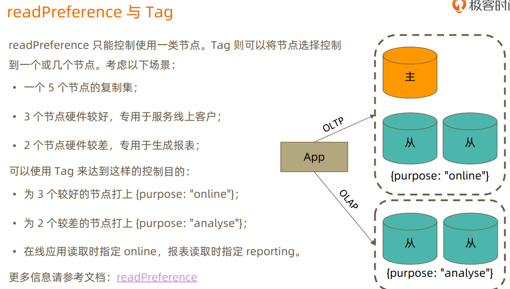
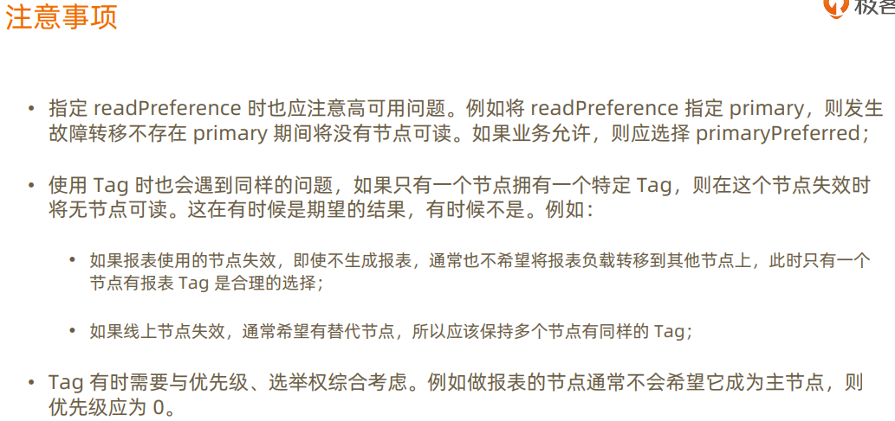
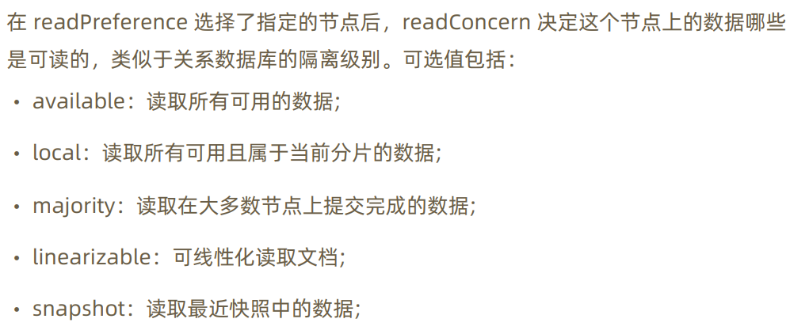
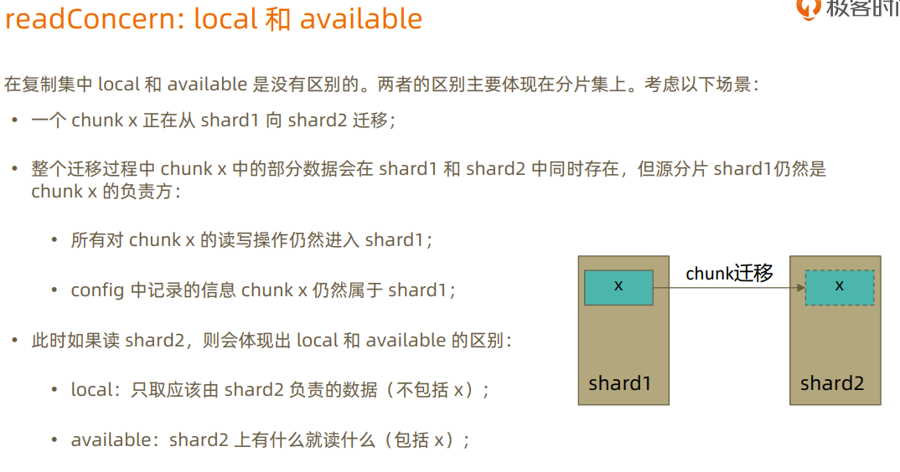
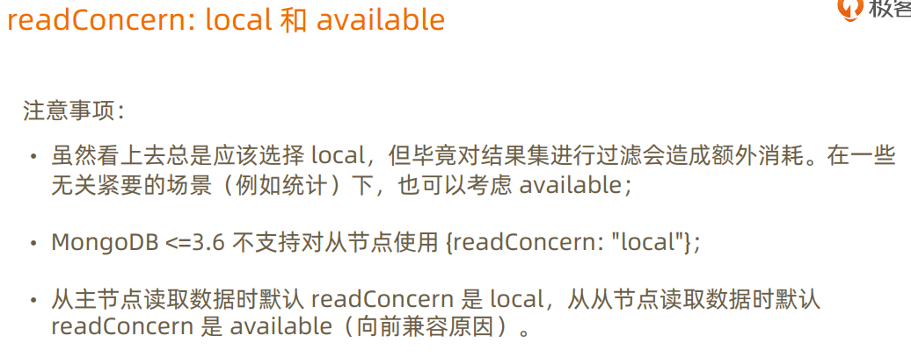

Mongodb 是一个分布式文件存储的NoSQL数据库，使用C++编写。MongoDB就是文档型NoSQL数据库，它文档中的数据是以类似JSON的BSON格式进行存储的。

# 基本概念

## MongoDB软件包组件


## 对比关系型数据库

| SQL         | MongoDB     | 说明                                 |
| ----------- | ----------- | ------------------------------------ |
| database    | database    | 数据库                               |
| table       | collection  | 数据库表/集合                        |
| row         | document    | 数据记录行/文档                      |
| column      | field       | 数据字段/域                          |
| index       | index       | 索引                                 |
| table joins |             | 表连接，MongoDB不支持                |
| primary key | primary key | 主键，MongoDB自动将_id字段设置为主键 |

## 数据库

## 文档

## 集合

## 元数据


# 企业架构

 ## 数据模型

数据模型的三要素

* 实体
* 属性
* 关系

数据模型的三层深度

1. 概念模型
2. 逻辑模型
3. 物理模型

> 一个模型逐步细化的过程

## 文档模型

### 建立基础文档模型

1. 根据概念模型或者业务需求推导出逻辑模型
2. 理出实体之间的关系
3. 套用逻辑设计原则来决定内嵌方式
4. 完成基础模型构建


#### 1 - 1 关系建模 

* 基本原则
  * 一对一关系以内嵌为主，
  * 作为子文档形式或者直接在顶级
  * 不涉及到数据冗余

* 例外情况
  * 如果内嵌后导致文档大小超过16MB

#### 1 - N 关系建模

* 基本原则
  * 内嵌为主
  * 用数组来表示一对多
  * 不涉及到数据冗余
* 例外情况
  * 内前后导致文档大小超过16MB
  * 数组长度太大（数万或更多）
  * 数组长度不确定

#### N - N 关系建模：内嵌数据模式

* 基本原则
  * 不需要映射表
  * 一般用内嵌数组来表示一对多
  * 通过冗余来实现 N - N
* 例外情况
  * 内前后导致文档大小超过16MB
  * 数组长度太大（数万或更多）
  * 数组长度不确定

#### 小结

* 90：10规则：大部分时候你会使用内嵌来表示 1-1，1-N，N-N
* 内嵌类似与预先聚合（关联）
* 内嵌后对读操作通常有优势（减少关联）

### 引用文档模型

#### MongoDB引用设计的限制

* 引用的集合之间无主外键检查
* 使用聚合框架的`$lookup`来模仿关联查询
  * `$lookup`只支持`left outer join`
  * `$lookup`的关联目标`from`不能是分片表


## 事务

### 写操作事务

#### 什么是 writeConcern

writeConcern 决定一个写操作落到多少个节点上才算成功。writeConcern的取值包括：

* 0 发起写操作，不关心是否成功；
* 1~ 集群最大数据节点数：写操作需要被复制到指定节点数才算成功
* majority 写操作需要被复制到大多数节点上才算成功

发起写操作的程序将阻塞到写操作到达指定的节点数为止

> * 虽然多于半数的 writeConcern 都是安全的，但通常只会设置 majority，因为这时等待写入延迟时间最短的选择；
> * 不要设置 writeConcern 等于总节点数，因为一旦有一个节点故障，所有写操作都将失败
> * writeConcern 虽然会增加写操作延迟时间，但并不会显著增加集群压力，因此无论是否等待，写操作最终都会复制到所有节点上。设置 writeConcern 只是让写操作等待复制到所有节点上。设置 writeConcern 只是让写操作等待复制后在返回而已；
> * 应对重要数据应用 {w: "majority"}, 普通数据可以应用  {w: 1} 以确保最佳性能

### 读事务操作

在读取数据的过程中我们需要关注一下两个问题：

* 从哪里读？关注数据节点位置
  * 由 readPreference 来解决
* 什么样的数据可以读？关注数据的隔离性
  * 由 readConcern 来解决

#### readPreference

readPreference 决定使用哪一个节点来满足正在发起的读请求。可选值包括：

* primary：只选择主节点；
* primaryPreferred：优先选择主节点，如果不可用则选择从节点；
* secondary：只选择从节点；
* secondaryPreferred：优先选择从节点，如果从节点不可用则选择主节点；
* nearest：选择最近的节点；






#### ReadConcern








# 运维


# 其它

### 备份

```bash
mongodump -h dbhost -d dbname -o dbdirectory
```

### 恢复

```bash
mongorestore -h dbhost -d dbname --directoryperdb dbdirectory

mongorestore -d dbname dbdirectory
mongorestore -d dbname -c collectionName dbdirectory    # 恢复一张表
```

### 删除数据库

```bash
use dbname
db.dropDatabase()
```

### QA
#### Unable to create/open lock file: /mnt/mongodb/data/mongod.lock errno:13 Permission denied Is a mongod instance already running?, terminating
```bash
chown -R mongodb:mongodb /mnt/mongodb/
```

## 升级

```bash
vim /etc/yum.repos.d/mongodb-org-3.4.repo
```
更新 repo文件
```
[mongodb-org-3.6]
name=MongoDB Repository
baseurl=https://repo.mongodb.org/yum/redhat/7/mongodb-org/3.6/x86_64/
gpgcheck=1
enabled=1
gpgkey=https://www.mongodb.org/static/pgp/server-3.6.asc
```
升级包

```bash
yum -y upgrade mongodb-org
```
启动mongodb
```
> db.adminCommand( { getParameter: 1, featureCompatibilityVersion: 1 } )
{ "featureCompatibilityVersion" : { "version" : "3.4" }, "ok" : 1 }
> db.adminCommand( { setFeatureCompatibilityVersion: "3.6" } )
{ "ok" : 1 }
> db.adminCommand( { getParameter: 1, featureCompatibilityVersion: 1 } )
{ "featureCompatibilityVersion" : { "version" : "3.6" }, "ok" : 1 }
```

升级后服务无法启动, 赋权

```bash
chown -R mongod:mongod /var/lib/mongo
chown -R mongod:mongod /var/log/mongodb
rm /var/run/mongodb/mongod.pid -f
```

## mtools

安装
```bash
pip install mtools
```

### mlogfilter
mlogfilter用于解析日志，如果有多个日志文件，mlogfilter按照时间戳合并
```bash
# 分析慢查询并以json格式导出并导入到test库的mycoll集合中
mlogfilter mongod.log --slow --json | mongoimport -d test -c mycoll
# 查看某个库的某个集合的慢查询, --slow可以指定慢查询时间为多少毫秒
mlogfilter /opt/logs/mongodb/*.log --slow  --json
mlogfilter mongod.log --namespace admin.\$cmd --slow 1000
# 查看某一个操作类型的慢查询，一次只能指定一个操作类型，可以是query,insert,update,delete,command,getmore
mlogfilter /opt/logs/mongodb/*.log --slow 1000 --namespace order.bill --operation query
# 根据某一个线程的查看慢查询
mlogfilter /opt/logs/mongodb/*.log --slow 1000 --namespace order.bill --operation query --thread conn1317475
# --parttern P  根据匹配条件查询日志 字段名称必须用双引号包围
mlogfilter mongod.log --pattern '{"_id": 1, "host": 1, "ns": 1}
# 根据关键字过滤日志
mlogfilter mongod.log --word assert warning error
# 返回所有9月份的日志
mlogfilter mongod.log --from Sep
# 返回5分钟之前的日志 
mlogfilter mongod.log --from "now -5min"
# 返回当天00:00:00 到当天02:00:00 的日志
mlogfilter mongod.log --from today --to +2hours
# 返回当天从9:30开始的日志
mlogfilter mongod.log --from today 9:30
```

### mloginfo
```bash 
# 显示日志的查询统计信息
mloginfo mongod.log --queries
# 对结果进行排序
mloginfo mongod.log --queries --sort count
mloginfo mongod.log --queries --sort sum

# 显示重启信息
mloginfo mongod.log --restarts
# 分类显示日志消息
mloginfo mongod.log --distinct
# 显示连接信息
mloginfo mongod.log --connections
# 显示复制集信息
mloginfo mongod.log --rsstate
```

### mplotqueries
mplotqueries是一个可以可视化MongoDB日志文件中的操作的工具。

-- group GROUP

group 值

* namespace  
* filename
* operation
* thread
* log2code
* pattern