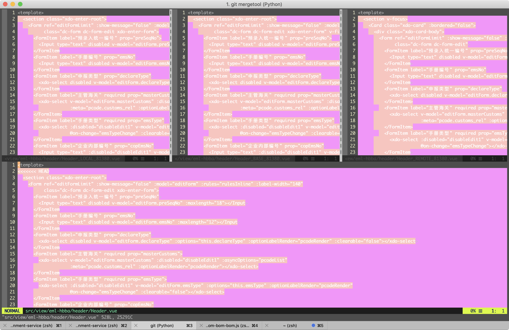

## 基础操作

#### Move

```bash
h   move one character left
j   move one row down
k   move one row up
l   move one character right
w   move to beginning of next word
b   move to previous beginning of word
e   move to end of word
W   move to beginning of next word after a whitespace
B   move to beginning of previous word before a whitespace
E   move to end of word before a whitespace

0   move to beginning of line
$   move to end of line
_   move to first non-blank character of the line
g_  move to last non-blank character of the line

gg  move to first line
G   move to last line
ngg move to n'th line of file (n is a number; 12gg moves to line 12)
nG  move to n'th line of file (n is a number; 12G moves to line 12)
H   move to top of screen
M   move to middle of screen
L   move to bottom of screen

zz  scroll the line with the cursor to the center of the screen
zt  scroll the line with the cursor to the top
zb  scroll the line with the cursor to the bottom

Ctrl-D  move half-page down
Ctrl-U  move half-page up
Ctrl-B  page up
Ctrl-F  page down
Ctrl-O  jump to last (older) cursor position
Ctrl-I  jump to next cursor position (after Ctrl-O)
Ctrl-Y  move view pane up
Ctrl-E  move view pane down

n   next matching search pattern
N   previous matching search pattern
*   next whole word under cursor
#   previous whole word under cursor
g*  next matching search (not whole word) pattern under cursor
g#  previous matching search (not whole word) pattern under cursor
gd  go to definition/first occurrence of the word under cursor
%   jump to matching bracket { } [ ] ( )

fX  to next 'X' after cursor, in the same line (X is any character)
FX  to previous 'X' before cursor (f and F put the cursor on X)
tX  til next 'X' (similar to above, but cursor is before X)
TX  til previous 'X'
;   repeat above, in same direction
,   repeat above, in reverse direction
```


####动词

```
d 表示删除（delete） 
r 表示替换（replace） 
c 表示修改（change）
y 表示复制（yank）
v 表示选取（visual select）
```
####名词 （文本对象）

```
w 表示一个单词（word）
s 表示一个句子（sentence）
p 表示一个段落（paragraph）
t 表示一个 HTML 标签（tag）
引号或者各种括号所包含的文本称作一个文本块。
```
####介词

```
i 表示“在...之内”（inside）
a 表示“环绕...”（around）
t 表示“到...位置前”（to）
f 表示“到...位置上”（forward）
```
>基本的语法为：动词 介词 名词  
>删除一个段落: （delete inside paragraph）dip  
选取一个句子: （visual select inside sentence） vis  
修改一个单词: （change inside word） ciw；（change around word） caw  
删除文本直到字符“x”（不包括字符“x”）: （delete to x） dtx  
删除文本直到字符“x”（包括字符“x”）: （delete forward x） dfx  
修改三个单词：（change three words） c3w  

### HEX编辑
```bash
# Open the file in Vim.
:% ! xxd   # Run the command
:% ! xxd -r # Save
```

Replace

```bash
:1,$ s/old/new #替换全部
```

快捷键

```
<C-o> jump back
<C-i> jump forward
<C-]> go to definition

% 跳转到相配对的括号  
gD 跳转到局部变量的定义处  
'' 跳转到光标上次停靠的地方 (是两个 ', 而不是一个")
mx 设置书签,x只能是a-z的26个字母  
`x 跳转到书签处("`"是1左边的键)  
> 增加缩进,"x>"表示增加以下x行的缩进  
< 减少缩进,"x<"表示减少以下x行的缩进  

  
{ 跳到上一段的开头  
} 跳到下一段的的开头  
( 移到这个句子的开头  
) 移到下一个句子的开头  
  
[[ 跳转至上一个函数(要求代码块中'{'必须单独占一行)  
]] 跳转至下一个函数(要求代码块中'{'必须单独占一行)  
  
C-] 跳转至函数或变量定义处  
C-O 返回跳转前位置   
C-T 同上   
nC-T 返回跳转 n 次  
  
0 数字0,跳转至行首   
^ 跳转至行第一个非空字符   
$ 跳转至行尾  
```

```
xp                       # 交换前后两个字符的位置
ddp                      # 上下两行的位置交换
```

[NERDTree](https://github.com/scrooloose/nerdtree)
>==m 显示文件系统菜单==

```bash 
:w !sudo tee %   # 强行保存文件
```

## vimdiff

### 使用vimdiff作为git mergetool

#### 设置 git mergetool 为 vimdiff

```bash
git config --global merge.tool vimdiff
git config --global merge.conflictstyle diff3
git config --global mergetool.prompt false
```

#### 用vimdiff解决合并冲突

运行`git mergetool`，vim将展示如下

```
+--------------------------------+
| LOCAL  |     BASE     | REMOTE |
+--------------------------------+
|             MERGED             |
+--------------------------------+
```



移动光标到不同的split

```
Ctrl w + h   # move to the split on the left 
Ctrl w + j   # move to the split below
Ctrl w + k   # move to the split on top
Ctrl w + l   # move to the split on the right
```

移动到`MERGED`文件上（Ctrl + w, j）,移动光标到一个合并冲突的区域(`[c` 或`]c`)，然后：

```
:diffg RE  " get from REMOTE
:diffg BA  " get from BASE
:diffg LO  " get from LOCAL
```

最后使用:wqa保存更改并关闭所有的分割

## 源码阅读

### ctags

```bash
# .vimrc  亲测可以不需要设置
set tags=./tags,./TAGS,tags;~,TAGS;~
```

进入代码目录执行

```bash
ctags -R 					# 要阅读的代码目录
```

