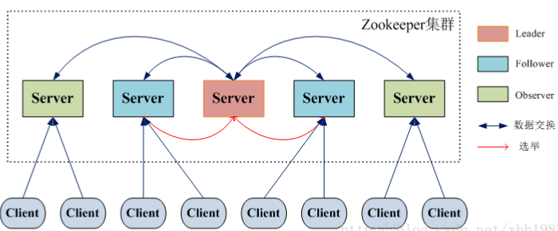

#zookeeper 简介

ZooKeeper 是一个开源的分布式应用程序协调服务器，其为分布式系统提供一致性服务。其一致性是通过基于 Paxos 算法的 ZAB 协议完成的。其主要功能包括:配置维护、域名服务、分布式同步、集群管理等。

## 理论基础

### 一致性

* 顺序一致性
* 原子性
* 单一视图
* 可靠性
* 最终一致性

### Paxos

#### 算法简介

Paxos算法要解决的问题是，在分布式系统中如何就决议达成一致。

#### Paxos与拜占庭将军问题

==在不可靠信道上视图通过消息传递的方式达到一致性的可能性。==所以，Paxos算法的前提是不存在拜占庭将军问题，即Paxos算法的信道是安全的，可靠的，集群节点间传递的消息是不会被篡改的。

一般情况下，分布式系统中各个节点间采用两种通讯模型：

* 内存共享
* 消息传递

> Paxos 是基于消息传递通信模型的。

#### 算法描述

##### 三种角色

在Paxos算法中有三种角色，分别具有三种不同的行为。但很多时候，一个进程可能同时充当着多种角色

* Proposer：提案者，提议者，proposal的提议者
* Acceptor：表决者
* Learners：学习者

##### Paxos算法的一致性

Paxos算法的一致性主要体现在以下几点：

* 每个提议者在提出提案时都会首先获取到一个具有全局唯一性的、递增的提案编号N，即在整个集群中是唯一的编号N，然后将改编号赋予其要提出的提案。
* 每个表决者在accept某提案后，会将该提案的编号N记录在本地，这样每个表决者中保存的已经被accept的提案中会存在一个编号最大的提案，其编号假设为maxN。每个表决者仅会accept编号大于自己本地maxN的提案。
* 在众多提案中最终只能有一个提案被选定。
* 一旦一个提案被选定。则其它服务器会主动同步该提案到本地。
* 没有提案被提出则不会有提案被选定。

##### 算法过程描述

Paxos算法的执行或成划分为两个阶段：

1. 准备阶段(prepare)
   1. 提议者（Proposer）准备提交一个编号为N的提议，于是其首先向所有表决者（Acceptor）发送prepare（N）请求，用于试探集群是否支持该编号的提议。
   2.  每个表决者（Acceptor）中都保存着自己曾经accept过的提议中的最大编号maxN。当一个表决者接收到其它主机发送过来的prepare（N）请求时，其会比较N与maxN的值。有一下的几种情况：
   3. 若N大于maxN，则说明该提议已过时，当前表决者采取不回应或回应Error的方式来拒绝该prepare请求：
      1. 若N大于maxN，则说明该提议时可以接受的，当前表决者会首先将N记录下来，并将其曾经已经accept的编号最大的提案Proposal(myid, maxN, value)反馈给提议者，以向提议者展示自己支持的议案意愿。其中第一个单数myid表示表决者Acceptor的标识id，第二个参数表示其曾经接受的提案的最大编号maxN，第三个参数表示该提案的真正内存value。当然，若当前表决者还未曾accept过任何提议，则会将Proposal(myid, null, null)反馈给提议者
      2. 在prepare阶段N不可能等于maxN。这是由N的生成机制决定的。要获得N的值，其必定会在原来数值的基础上次用同步锁方式增一。

2. 接受阶段(accept)
   1. 当提议者（Proposer）发出prepare(N)后，若收到了超过半数的表决者（Acceptor）的反馈，那么该提议者就会将其真正的提案Proposal(myid, N, value)发送给所有的表决者。
   2. 当表决者（Acceptor）接收到提议者发送的Proposal(myid, N, value)提案后，会再次拿出自己曾经accept过的提议中的最大编号maxN，或曾经记录下的prepare的最大编号，让N与他们进行比较，若N大于等于这两个编号，则当前表决者accept该提案，并反馈给提议者。若N小于这两个编号，则表决者采取不回应或回应Error的方式来拒绝该提议。
   3. 若提议者没有接收到超过半数的表决者的accept反馈，则重新进入prepare阶段，递增提案号，重新提出prepare请求。若提议者接收到的反馈数量超过了半数，则其会向外广播两类信息：
      1. 向曾经accept其提案的表决者发送“可执行数据同步信号”，即让他们执行其曾接收到的提案；
      2. 向未曾向其发送accept反馈的表决发送“提案+可执行数据同步信号“，即让他们接收到该提案后立马执行。

#### Paxos算法的活锁问题

Fast Paxos算法对Paxos算法进行了改进，其只允许一个进程处理写请求，解决活锁问题

### ZAB协议

#### ZAB协议简介

ZAB， Zookeeper Atomic Broadcast，zk原子消息广播协议，是专为Zookeeper设计的一种支持奔溃恢复的原子广播协议，在ZooKeeper中，主要依赖ZAB协议来实现分布式数据一致性

Zookeeper使用一个单一主进程来处理客户端的所有事务请求，即写请求。当服务器数据的状态发生变更后，集群采用ZAB原子广播协议，以事务提案Proposal的形式广播到所有的副本进程上。ZAB协议能够保证一个全局的变更序列，即可以为每一个事物分配一个全局的递增编号xid。

当Zookeeper客户端连接到Zookeeper集群的一个节点后，若客户端提交的是读请求，那么当前节点就直接根据自己保存的数据对其进行响应；如果是写请求且当前节点不是Leader，那么节点就会将该写请求转发给Leader，Leader会以提案的方式广播该写操作，只要有超过半数节点同意该写操作，则该写操作请求就会被提交。然后Leader会再次广播给所有订阅者，通知它们同步数据。


#### ZAB与Paxos的关系

ZAB协议是Fast Paxos算法的一种工业实现算法。但两者的设计目标不太一样。ZAB协议主要用于构建一个高可用的分布式数据主备系统，例如，Leader挂了，马上就可以选举出一个新的Leader。而Paxos算法则是用于构建一个分布式一致性状态机系统，确保系统中各个节点的状态都是一致的。

另外，ZAB还使用Google的Chubby算法作为分布式锁的实现，而Google的Chubby也是Paxos算法的作用

#### 三类角色


为了避免Zookeeper的单点问题，zk也是以集群的形式出现的。zk集群中的角色主要有以下三类

* Leader 负责进行投票的发起和决议，更新系统状态，唯一的写请求处理者
* Follower 接收客户端请求，但仅可处理读请求，将写请求转给Leader；在选举Leader过程中参与投票，具有选举权与被选举权
* Observer 可以接受客户端连接，将写请求转发给leader，但observer不参加投票过程，只同步leader的状态，observer的目的是为了扩展系统，提高读取速度

这三类角色在不同的情况下又有一些不同的名称：

* Learner
* QuorumServer

#### 三个数据

在ZAB中有三个很重要的数据：

* zxid 64位长度的Long类型数据，其中高32位表示epoch（年代、纪元），低32位表示xid（事务id）
* epoch 每个Leader都会有一个不同的epoch
* xid 事务id，流水号

#### 三种模式

ZAB协议中对zkServer的状态描述有三种模式。这三种模式并没有十分明显的界限，他们互相交织在一起。

* 恢复模式  Leader选举阶段与初始化同步阶段
* 广播模式  初始化广播与更新广播
* 同步模式  初始化同步与更新同步

#### 同步模式与广播模式

1. 初始化同步

   恢复模式具有两个阶段：Leader选举与初始化同步。当完成Leader选举后，此时的Leader还是一个准Leader，其要经过初始化同步后才能变为真正的Leader。
   
   1. 为了保证Leader向Learner发送的提案有序，Leader会为每一个learner服务器准备一个队列
   2. Leader将那些没有被各个Learner同步的事务封装为Proposal
   3. Leader将这些Proposal逐条发给各个Learner，并在每一个Proposal后都紧跟一个COMMIT消息，表示该事务已经被提交，Learner可以直接接收并执行
   4. Learner接收来自于Leader的Proposal，并将其更新到本地
   5. 当Follower更新成功后，会向准Leader发送ACK信息
   6. Leader服务器在接到来自Follower的ACK后就会将该Follower加入到真正可用的Follower列表。没有反馈ACK，或反馈了但Leader没有收到Follower，Leader不会将其加入到Follower列表
   
2. 消息广播算法

   当集群中已经有过半的Follower完成了初始化状态同步，那么整个zk集群就进入到了正常工作模式了

    如果集群中的其它节点收到客户端的事务请求，那么这些Learner会将请求转发给Leader服务器。然后在执行如下的具体过程

   1. Leader接收到事务请求后，为事务赋予一个全局唯一的64位自增id，即zxid，通过zxid的大小比较即可实现事务的有序性管理，然后将事务封装为一个Proposal。
   2. Leader根据Follower列表获取到所有Follower，然后在将Proposal通过这些Follower的队列将提案发送给各个Follower
   3. 当Follower接收到提案后，会先将提案的zxid与本地记录的事务日志中的最大的zxid进行比较。若当前提案的zxid大于最大的zxid，则将当前提案记录到本地事务日志中，并向Leader返回一个ACK
   4. 当Leader接收到过半的ACKs后，Leader就会向所有Follower的队列发送COMMIT 

   

#### 恢复模式与两个原则

当集群正在启动过程中，或Leader与超过半数的主机断连后，集群几进入了恢复模式。对于要恢复的数据状态需要遵循两个原则。

1. 已处理过的消息不能丢
2. 被丢弃的消息不能再现

#### Leader选举

在集群启动过程中，或Leader宕机后，集群就进入了恢复模式。恢复模式中最重要的阶段就是Leader选举。

1. Leader选举中的概念
   1. myid
   
      这是zk集群中服务器的唯一标识，称为myid。例如，有三个zk服务器，那么编号分别是1，2，3.
   
   2. 逻辑时钟
   
      逻辑时钟，logicalclock，是一个整型数，该概念在选举时称为logicalclock，而在选举结束后称为epoch。即epoch与logicalclock时同一个值，在不同情况下的不同名称。
   
   3. zk状态
   
      zk集群中的每一台主机，在不同阶段会处于不同状态，每一台主机具有四种状态
   
      * LOOKING 		选举状态
      * FOLLOWING 	Follower在正常运行情况下状态
      * OBSERVING      Observer在正常运行情况下状态
      * LEADING       Leader在正常运行情况下状态
2. Leader选举算法
   1. 集群启动中的选举过程
   2. 断开后的Leader选举

### CAP

#### 简介

#### BASE理论

#### ZK与CP

zk遵循的是CP原则，即保证了一致性，但牺牲了可用性。具体体现在：

当Leader宕机后，zk集群会马上进行新的Leader选举。但选举时长一般在30-100ms内，最长不超过60s，整个选举期间zk集群是不接受客户端的读写操作的，即zk集群是处于瘫痪状态的。所以，其不满足可用性。


## 安装与集群搭建

### 集群搭建

#### 配置


| 名称  | IP           | 角色     |
| ----- | ------------ | -------- |
| ZK-20 | 192.168.2.20 |          |
| ZK-21 | 192.168.2.21 |          |
| ZK-22 | 192.168.2.22 |          |
| ZK-23 | 192.168.2.23 | observer |

#### 安装

```bash
hostnamectl set-hostname ZK-20
yum -y install java-1.8.0-openjdk
wget https://mirrors.tuna.tsinghua.edu.cn/apache/zookeeper/stable/zookeeper-3.4.13.tar.gz
tar -xvf zookeeper-3.4.13.tar.gz
mv zookeeper-3.4.13 /usr/local/
cd /usr/local/zookeeper-3.4.13/
cd conf
cp zoo_sample.cfg zoo.cfg
mkdir -p /usr/data/zookeeper
vim zoo.cfg
```

**zoo.cfg**

```bash
tickTime=2000
initLimit=10
syncLimit=5
dataDir=/usr/data/zookeeper
clientPort=2181
# 集群配置
server.1=192.168.2.20:2888:3888
server.2=192.168.2.21:2888:3888
server.3=192.168.2.22:2888:3888
server.4=192.168.2.23:2888:3888:observer
```

在/usr/data/zookeeper 目录中创建表示当前主机编号的 myid 文件。该主机编号要与 zoo.cfg 文件中设置的编号一致。 

```bash
echo 1 > /usr/data/zookeeper/myid
```

observer 的配置

```bash
tickTime=2000
initLimit=10
syncLimit=5
dataDir=/usr/data/zookeeper
clientPort=2181
# 集群配置
peerType=observer
server.1=192.168.2.20:2888:3888
server.2=192.168.2.21:2888:3888
server.3=192.168.2.22:2888:3888
server.4=192.168.2.23:2888:3888:observer
```

#### 设置防火墙

```bash
firewall-cmd --zone=public --add-port=2888/tcp --permanent
firewall-cmd --zone=public --add-port=3888/tcp --permanent
firewall-cmd --zone=public --add-port=2181/tcp --permanent
firewall-cmd --reload   # 使配置生效
firewall-cmd --list-all  # 检查配置
```

#### Test

```bash
./zkServer.sh start
./zkServer.sh status
```

#### zkCli

```bash
zkCli.sh -server 127.0.0.1:2181 								# 连接服务器
ls /              															# 查看当前节点数据
ls2 /             															# 查看当前节点数据并能看到更新次数等数据
ls /dubbo/me.warriorg.service.CategoryService/consumers		# 查看dubbo的消费之
create /config "test" 													# 创建一个新的节点并设置关联值
create /config “”     													# 创建一个新的空节点
get /brokers      															# 获取节点内容
set /zk "zkbak"   															# 对 zk 所关联的字符串进行设置
delete /brokers  																# 删除节点
rmr    /brokers  																# 删除节点及子节点
```


### Session

Session 是指客户端会话。ZooKeeper 对外的服务端口默认是 2181，客户端启动时，首 先会与 zk 服务器建立一个 TCP 长连接，从第一次连接建立开始，客户端会话的生命周期也 开始了。通过这个长连接，客户端能够通过心跳检测保持与服务器的有效会话，也能够向 ZooKeeper 服务器发送请求并接受响应，同时还能通过该连接接收来自服务器的 Watcher 事 件通知。 

Session 的 SessionTimeout 值用来设置一个客户端会话的超时时间。当由于服务器压力 太大、网络故障或是客户端主动断开连接等各种原因导致客户端连接断开时，只要在 Session Timeout 规定的时间内客户端能够重新连接上集群中任意一台服务器，那么之前创建的会话仍然有效。

### znode

ookeeper 的文件系统采用树形层次化的目录结构，与 Unix 文件系统非常相似。每个目录在 zookeeper 中叫做一个 znode，每个 znode 拥有一个唯一的路径标识，即名称。Znode可以包含数据和子 znode(临时节点不能有子 znode)。Znode 中的数据可以有多个版本，所以查询某路径下的数据需带上版本号。客户端应用可以在 znode 上设置监视器(Watcher)。

### Watcher 机制

zk 通过 Watcher 机制实现了发布订阅模式。zk 提供了分布式数据的发布订阅功能，一个发布者能够让多个订阅者同时监听某一主题对象，当这个主题对象状态发生变化时，会通知所有订阅者，使它们能够做出相应的处理。zk 引入了 watcher 机制来实现这种分布式的通知功能。zk 允许客户端向服务端注册一个 Watcher 监听，当服务端的一些指定事件触发这个Watcher，那么就会向指定客户端发送一个事件通知。而这个事件通知则是通过 TCP 长连接的 Session 完成的。

### ACL

ACL 全称为 Access Control List(访问控制列表)，用于控制资源的访问权限，是 zk 数据安全的保障。zk 利用 ACL 策略控制 znode 节点的访问权限，如节点数据读写、节点创建、节点删除、读取子节点列表、设置节点权限等。

