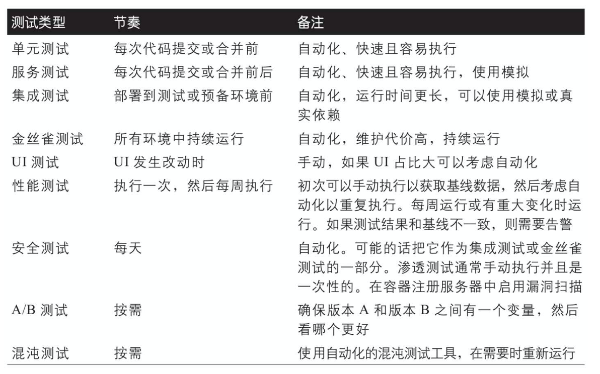

# 云原生

## 简介

### 分布式系统

#### 分布式系统的误区

##### 网络是安全的

- 避免频繁的网络调用和一些不必要的请求
- 在设计云原应用时，可以考虑采用缓存、内容分发网络(CDN)、多区域部署等技术或方法来使得数据离客户端更近
- 采用“发布/订阅”模式，以通知有新数据到达，并将其存储在本地以便可以立即使用这些数据。第3章会详细介绍包括“发布/订阅”在内的各种消息通信模式。

##### 带宽是用之不尽的

##### 拓扑结构是不变的

##### 一个管理员可以搞定一切

##### 传输是没有成本的

##### 网络通信都是一样的

#### CAP

##### 一致性（Consistency，C）：指所有节点访问同一份最新的数据副本

##### 可用性（Availability，A）：指系统提供的数据或服务必须一直处于可用状态

##### 分区容错性（Partitiontolerance，P）：指系统在遇到网络分区故障的时候，仍然能够对外提供服务

### 十二要素应用

#### 基准代码

#### 依赖

#### 配置

#### 后端服务

#### 构建、发布和运行

#### 进程

#### 数据隔离

#### 并发

#### 易处理

#### 开发环境与线上环境等价

#### 日志

#### 管理进程

### 可用性和服务等级协议

## 基础

### 容器

#### 容器隔离等级

##### VM的缺点

- 虚拟机的启动需要整个操作系统，因此花费的启动时间会更长。
- 虚拟机镜像占用的空间也是一个问题。一台虚拟机包含了整个操作系统，通常有几个GB大小。而镜像通常存储在中央镜像仓库中，通过网络来传输它们则需要花不少时间。
- 虚拟机的扩容也是一个挑战。纵向扩容（增加更多资源）意味创建然后启动一个新的、更大的虚拟机（更多CPU、内存、存储空间等）实例。而横向扩容意味着创建新的实例，因为虚拟机的启动很慢，所以往往无法达到快速响应的目的。
- 虚拟机还会带来一些额外的开销，会消耗更多的内存、CPU和存储资源。所以它部署的密度（同一台机器上虚拟机实例的数量）就会受到制约。

#### 容器编排

- 在集群节点上创建和部署容器实例。
- 容器的资源管理，即把容器部署在有足够运行资源的节点上，或者当这个节点的资源超出限额时可以将容器转移到别的节点上。
- 监控容器以及集群节点的运行状况，以便在容器或者节点出现故障时进行重启或重新编排。
- 在集群内对容器进行扩容或收缩。
- 为容器提供网络映射服务。
- 在集群内为容器提供负载均衡服务。

### 无服务器架构

- 无服务器架构意味着服务的伸缩以及底层的基础架构都是由云服务提供商来管理的。

### 函数计算

### 从虚拟机到云原声

#### 提升和转变

#### 应用的现代化改造

##### 切分单体应用的理由

- 更快的部署速度
- 同一个应用中，总有些组件的更新频率会高于另一些组件
- 不同的组件对于扩容的需求也是不同的
- 有些组件可能更适合用另一种技术或语言来开发
- 代码库以及变的太大，太复杂了

##### 切分单体应用方式

###### 刀砍模式（stranglerpattern）

> 刀砍模式的意思是你一刀一刀砍去巨石应用。具体而言就是通过微服务架构来实现新的服务，然后逐步替换掉老的应用中的部分组件功能。可以采用网关（gateway）或者外观层（facade）来将用户请求导向正确的应用。随着时间的推移，越来越多的功能被转移到新架构下，直到整个巨石应用崩坍瓦解，完全转换为一个微服务架构下的应用。

###### 防损层模式（anticorruptionlayerpattern）

> 防损层模式和刀砍模式有些类似，区别在于新的服务需要调用老的服务。通过建立防损层可以使新服务访问老服务，反过来老服务也可以调用新服务。

#### 应用的优化

### 微服务

#### 微服务架构的优势

- 敏捷性
- 持续创新
- 渐进式设计
- 小而专的团队
- 故障隔离
- 更好的扩容和资源利用能力
- 改善可观察性

#### 微服务架构带来的挑战

- 复杂性
- 数据完整性和一致性
- 性能
- 开发和测试
- 版本控制和集成
- 监控和日志管理
- 服务依赖管理
- 可用性

## 云原声应用的设计

### 云原生应用的基础

#### 精益运营

> 精益运营的意思是，你在设计这个应用的时候就需要考虑如何去运行你的程序，如何去监控它，并且持续去改进它。

- 全自动化
- 监控一切
- 完善文档
- 增量更改
- 为故障而设计

#### 安全性

#### 可靠性与可用性

#### 可扩展性与成本

### 云原声与传统架构的对比

> 云原生应用和传统单体应用最根本的一个区别在于它们如何处理状态信息，比如会话状态、应用及配置数据等。

### 函数计算与服务

#### 函数计算的使用场景

- 简单的并行执行任务，在执行这个任务时不需要和其他服务通信。比如生成某个包、更新记录、mapreduce函数和批处理任务。
- 许多物联网（IoT）场景使用函数来编排任务。比如发送消息到IoT中心，后者触发函数来对这个消息执行计算或者路由任务。
- 某些应用可以完全使用FaaS产品来构建，这意味着这个应用的所有功能都是通过使用函数来完成的。

#### 使用函数计算的考虑因素

- 有限的函数生命周期
- 无法利用专用硬件
- 函数式无状态的且不直接对外暴露
- 本地开发和调试
- 经济性

#### 函数与服务的组合运用

### API 设计与版本控制

#### API 版本策略

- 无版本（knot）API只有一个版本，API的调用者永远只调用最新的API。
- 点对点 (point-to-point) 所有版本的API都在正常运行，每个调用者都使用他们需要的版本。
- 兼容性版本控制（compatible versioning）所有调用者都使用最新的API版本。旧版本的API会被舍弃，但是最新版本的API是向后兼容的。

#### 版本控制的实现

- 全局版本控制 版本体现在API的路径中（例如，/api/v1/users）或二级域名中（例如，apiv1.example.com/users）
- 资源版本控制 与全局版本控制非常相似，但是在这种方法下，你只对特定资源进行版本控制。可以只创建该特定资源的新版本（例如，/api/v2/users），但是其他资源将保持不变（例如，/api/v1/tasks）
- 基于mime 放在请求的标头（HTTPheader）中。比如说，使用Accept和ContentType标头来描述资源版本及其类型（例如，Accept:application/vnd.example.users.v2+json），而URL保持无版本（例如，/api/users）。这意味着API接口会一直很清晰，但这会让使用API变得更加复杂。

#### API 的前后兼容

- 为新API提供合理的默认值或可选值。如果做不到这一点，请创建一个新资源。
- 绝对不要去重命名或者删除已有的字段。
- 绝对不要把一个可选字段变成必需字段。
- 如果老的API接口已经不用了，把它标记为已过时。
- 通过在新旧版本的服务间传递老的消息来测试其兼容性。

#### 语义版本号

### 服务间的通信

> 从客户端到集群的外部通信通常称为南北通信，内部服务通信通常称为东西通信。

#### 通信协议

- WebSockets
- Http/2
- gRPC

#### 消息协议

- 消息队列遥测传输
- 高级消息队列协议

#### 序列化的考虑因素

#### 幂等型

> 确保幂等性操作的一种常见方法是在消息中添加唯一的标识符，并确保仅当标识符不重复时，服务才对消息进行处理。

#### 请求与响应

#### 发布者与订阅者

#### 同步与异步

### 网关

#### 路由

#### 聚合

> 网关也可以充当聚合器：它从客户端接收一个请求，然后把这个请求拆分成多个子请求，发送到不同的后端服务。如果网关中的聚合逻辑太多了，或者网关由于负载过高而崩溃，那么一个更好的办法是引入一个单独的聚合或批处理服务，将聚合的逻辑移出网关可以减轻网关的负载。另外这样做也使得你可以独立地更新聚合或批处理服务，而避免对网关造成影响。

#### 卸载

> 网关最常见的功能之一是为独立的服务减负，将一些后端服务的功能卸载到网关中实现。

- 鉴权与授权
- 速率限制、重试策略、断路
- 缓存
- 压缩
- SSL终结
- 日志与监控

#### 实现

- Nginx
- HAProxy
- Envoy

### 出口网关

> 在内网运行的出口网关（egressgateway）可以帮助引导和控制所有离开内网的流量。这使你的服务能够以受控方式访问任何外部服务。如果你需要监控或者控制对外部服务的访问，那么你应该考虑使用出口网关。

### 服务网格

> 服务网格背后的想法之一是通过将通用功能从每个服务抽出来移入到服务网格中，从而提高开发人员的生产力。

#### 服务网格的模式

- 边车 (sidecar) 每个pod中运行一个额外的容器
- 主机 每个主机上运行一个代理

#### 服务网格模式选择的因素

- 服务实例和边车代理的数量：资源消耗随着服务实例数量的增加而增加。如果每个服务都有多个边车代理，则资源消耗会增加得更快。
- 用来实现边车代理的语言也可能增加资源的使用（例如，如果你使用的是Java）。
- 并非所有的服务都需要一个专门的代理：这种情况下可以考虑从边车模式切换到主机模式，并重用代理的功能（例如，可以针对每个主机进行指标和日志的聚合，而不是在每个服务上使用边车代理）。
- 服务和代理之间的请求数：在边车模式下，服务和代理之间的请求经历的步骤要少于主机模式下的步骤。

#### 服务网格的主要功能

- 流量管理
- 故障处理
- 安全性
- 追踪和监控

## 数据处理

### 数据处理特征

- 倾向使用托管数据存储和处理服务
- 使用混合持久化、数据分区和缓存
- 倾向使用最终一致性，只在必要时使用强一致性
- 优先选择具有可扩展性、容错性且针对云存储进行了优化的云原生数据库。
- 处理分布在多个数据存储中的数据

### 数据存储系统

#### 对象、文件和磁盘

##### 对象存储

- 当数据可以存储在文件中，并且应用可以通过云服务商提供的API来访问数据时，可以使用对象存储
- 对象存储成本较低，可以用来存储大量数据
- 应用需要调用云服务商的API来使用对象存储

##### 文件存储

- 当应用程序支持网络附加存储（NAS）时可以使用文件存储
- 当使用需要访问共享文件的库或服务时，可以使用文件存储
- 文件存储比对象存储贵

##### 磁盘（块）存储

- 当应用需要用到本地持久化存储的时候可以用磁盘存储，例如MongoDB或MySQL数据库

#### 数据库

##### 键值数据库

##### 文档数据库

##### 关系型数据库

##### 图数据库

- 图数据库存储两种类型的信息：边和节点。边定义了节点之间的关系，你可以把节点看作实体。

##### 列族数据库

##### 时序数据库

###### 搜索引擎

#### 流和队列

- 流和队列是存储事件和消息的数据存储系统。

#### 区块链

#### 数据存储的选择

##### 功能性需求

- 数据格式
- 读和写
- 数据大小
- 伸缩性和结构
- 数据间的关系
- 一致性模型
- 模式是否灵活
- 并发
- 数据迁移
- 数据的生命周期
- 数据更改
- 是否需要支持数据更改捕获（ChangeDataCapture，CDC）并在数据更改时触发事件
- 其他功能
	- 是否需要任何其他特定功能，如全文检索、索引编制等？

##### 非功能性需求

- 团队经验
- 技术支持
- 性能和可扩展性
- 可靠性
- 备份
- 限制项
- 可移植性

##### 管理成本

- 托管服务
- 可用区或云服务商的可能性
- 许可证
- 综合成本

### 多数据存储下的数据

- 分散的数据存储带来的问题
	- 跨多个数据存储的数据一致性
	- 多个数据存储下的数据分析
	- 多个数据存储下的备份和恢复

#### 捕获数据更改

- 通知
- 实例化视图
- 缓存失效
- 审计
- 搜索
- 数据分析
- 变更分析
- 归档
- 历史遗留系统

#### 将更改作为事件写入更改日志

#### 事务监管

#### 事务回滚

#### 提取、转换和加载

#### 微服务和数据湖

### 客户端访问数据

#### 受限的客户令牌（代客密钥）

#### 细粒度访问控制的数据库服务

#### GraphQL 数据服务

### 可快速伸缩的数据

#### 数据分片

#### 数据缓存

#### 内容分发网络

### 数据分析

#### 数据流

#### 批处理

#### 对象存储上的数据湖

#### 数据湖和数据仓库

#### 分布式查询引擎

### Kubernetes 中的数据库

#### 存储卷

#### StatefulSet

#### DaemonSet

## DevOps

### 什么事 DevOps

#### 协作

#### 自动化

#### 精益原则和流程

#### 度量

#### 分享

### 测试

#### 测试替身

- 模拟（mock）
- 伪造（fake）
- 桩（stub）

#### 自动化测试金字塔

##### 单元测试

##### 服务测试

##### UI测试

##### Jepsen测试

> Jepsen库可以部署一个分布式系统，对这个系统进行一系列的操作，然后验证这些操作是否合理。你可以用Jepsen来分析数据库、协作服务以及队列服务，它可以帮你找出很多问题，包括数据丢失、陈旧数据、锁冲突，等等。

##### 性能测试

##### 负载测试

> 负载测试是性能测试的一种，可用于确定某些特定情况下系统的性能。

##### 安全和渗透测试

##### A/B 测试

##### 验收测试

##### 可用性测试

##### 配置测试

##### 冒烟测试

##### 集成测试

##### 混沌测试

##### 模糊测试

#### 不同测试类型的适用时机

> 

#### 测试节奏

#### 在生成环境中测试

##### 部署前

##### 部署

##### 发布

##### 发布后

### 开发环境和工具

#### 开发工具

#### 开发环境

#### 本地开发环境

#### 本地开发环境结合远端集群

#### 开发工作流

#### 云端开发环境

### 持续集成/持续交付

#### 源代码管理

#### 构建阶段

#### 测试阶段

#### 部署阶段

#### 发布阶段

#### 发布后阶段

- 构建应当是快速的（单代码库或者多代码库）。
- 测试应当是可靠的。·容器镜像应该尽可能的小。
- 决定生产环境流量的选择策略（所有流量、部分流量、基于特定标准，等等）。
- 服务的可监控性是一个成功的CI/CD流程的基石。

### 监控

#### 监控指标

- 故障率 告诉你请求的失败率
- 请求速率 通常用每秒收到的HTTP请求量来衡量（如果是数据库的话，用单位时间的读/写/事务操作数），这个指标告诉你有多少请求正进入系统。
- 延迟 延迟指的是服务处理一个请求所需的时间。
- 利用率 利用率指标告诉你系统的不同组成部分的使用情况。

#### 收集指标

#### 服务的可观测性

##### 日志

##### 分布式链路追踪

##### 服务健康性、存活性和就绪性

### 配置管理

#### 单一环境变量

#### 多环境变量

#### 将配置数据放入存储卷中

#### 密钥保存

#### 部署配置

