## 锻炼思维能力的七大图形

### 交换图

将各种关系形象化

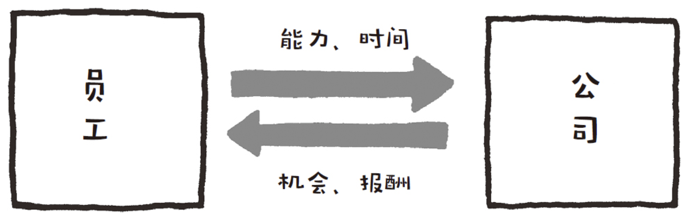

#### 构成

* 由多个矩形模块及连接矩形的箭头组成
* 分析交换人物（例如卖家和买家）和交换内容

#### 用途

* 掌握人、物、金钱流向
* 掌握商业模式

### 树状图

梳理事物的结构

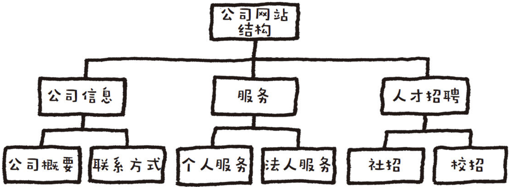

#### 构成

* 由多个矩形模块及连接矩形的线段组成

* 整理信息，不重不漏，由结构分析整体

#### 用途

* 整理散乱的信息
* 找到成功案例的共同点

### 深挖图

逐层挖掘，分析要因所在

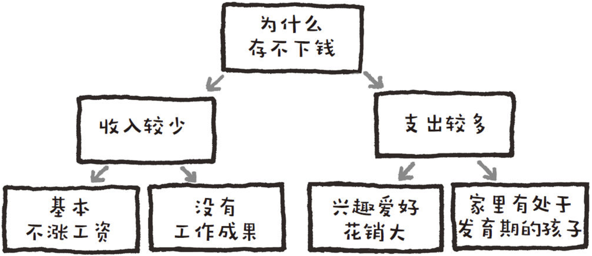

#### 构成

* 由多个矩形模块和箭头组成
* 重复提问、问答、分析药因所在

#### 用途

* 改善自身状况
* 分析问题，寻找对策

### 比较图

两条数轴，分析项目差异

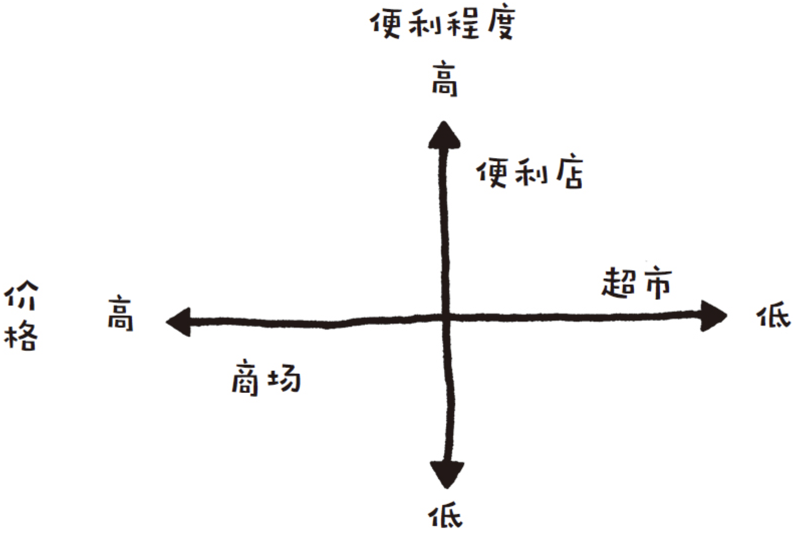

#### 构成

* 在两条数轴上对比多个项目

* 分析项目间差异

#### 用途

* 比较商品，分析商品
* 分析热门服务的差异

### 流程图

将完成目标的过程形象化

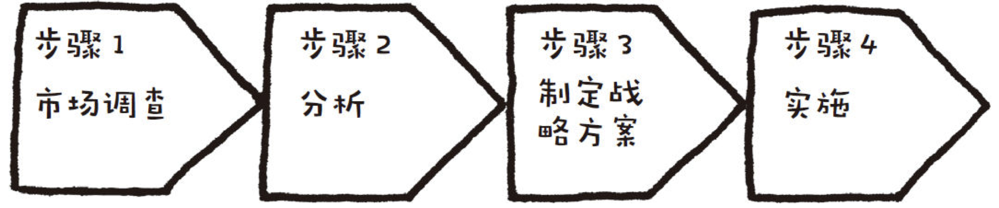

#### 构成

* 由依次排列的多个箭头模块组成
* 分析流程步骤

#### 用途

* 整理制作提案书的步骤
* 重申业务流程

### 重叠图

凸显商品、服务的”特点“

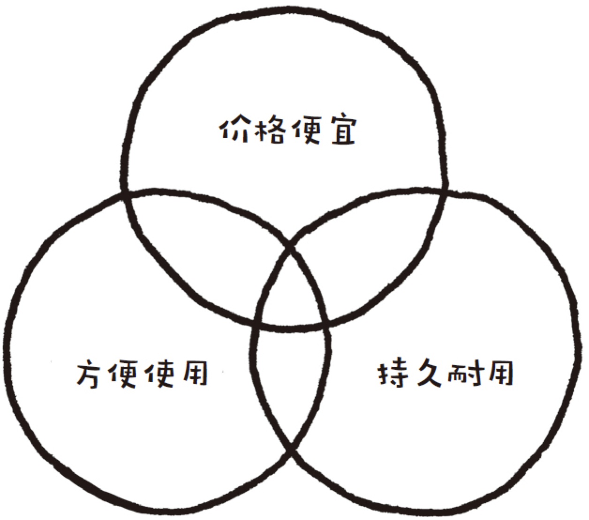

#### 构成

* 由多个圆形模块组成
* 分析商品服务特点

#### 用途

* 发掘热门服务受欢迎的原因
* 分析商品畅销的原因

### 金字塔图

明确目标方向

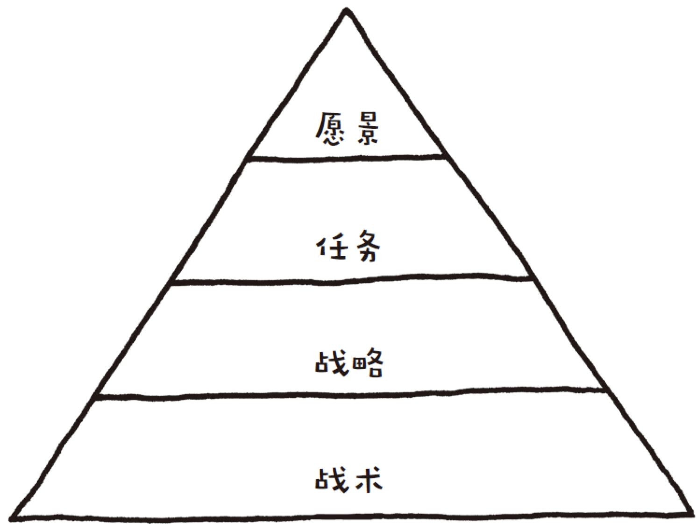

#### 构成

* 以线段分割三角形
* 分析上下关系及阶层差异

#### 用途

* 制定方针，提高营业额
* 预测大型企业动向

## 基础训练一 厘清事物间的关系

### 总结 熟练使用交换图

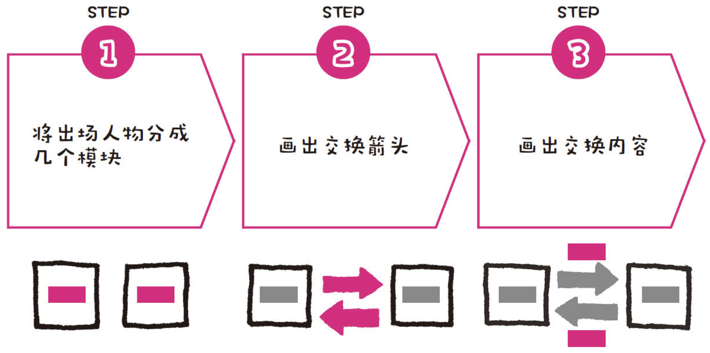

#### 要点

* 弄清谁是交换的中心
* 找出隐藏的相关人物
* 交换等价物不一定是金钱

## 基础训练二 全面掌握具体内容

### 总结 熟练使用树状图

#### 要点

* 将难以分类的条目归为“其他”类
* 单个条目也可以归为一类
* 整理成树状图时，在起始处标明所有内容的总条目

## 基础训练三 深究原因 -- 为什么

### 总结 熟练使用“深挖图”

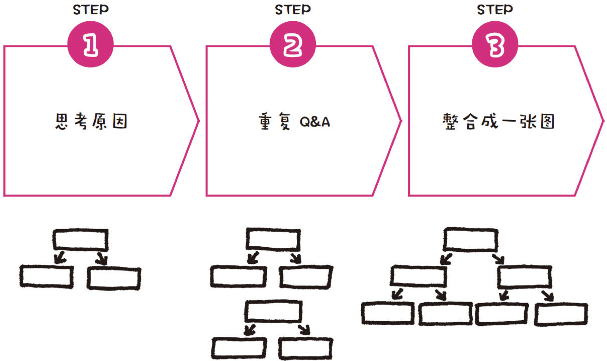

#### 要点

* 通过细分原因进行思考
* 一直分解到不能继续细分为止

## 基础训练四 事物之间的“比较”

### 总结 熟练使用“比较图”

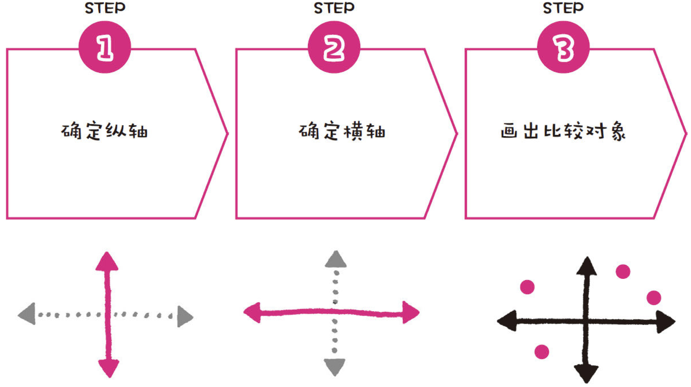

#### 要点

* 画纵轴时要把较受重视的要素放在上面
* 画横轴时要把较受重视的要素放在右边
* 大胆比较定性项目，展现主观想法

## 基础训练五 分析“流程”

### 总结 熟练使用“流程图”

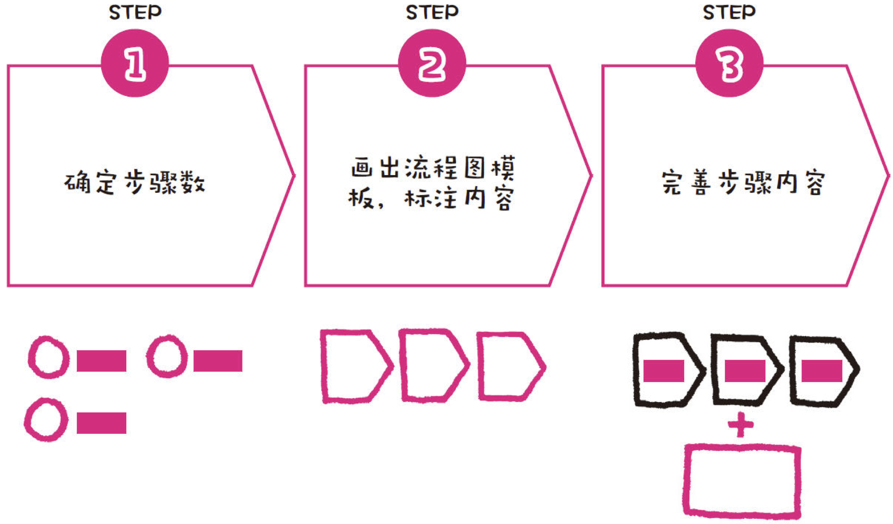

#### 要点

* 一开始不用细究步骤的内容
* 步骤内容描述控制在三行以内
* 附加信息和猪哟啊流程要分开

## 基础训练六 “组合"这件事

### 总结 熟练使用“重叠图”

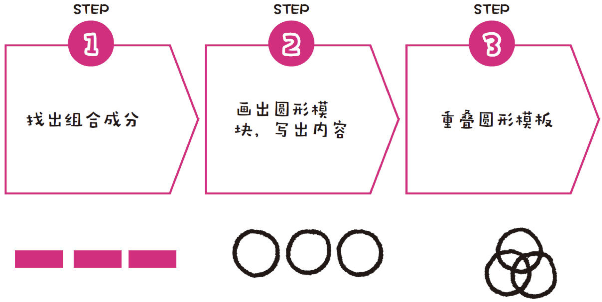

#### 要点

* 准确找出相关乘数
* 利用简单的结构拓展思路
* 圆形模块中的内容描述要控制在两行以内

## 基础训练七 掌控方向

### 总结 熟练使用“金字塔图”

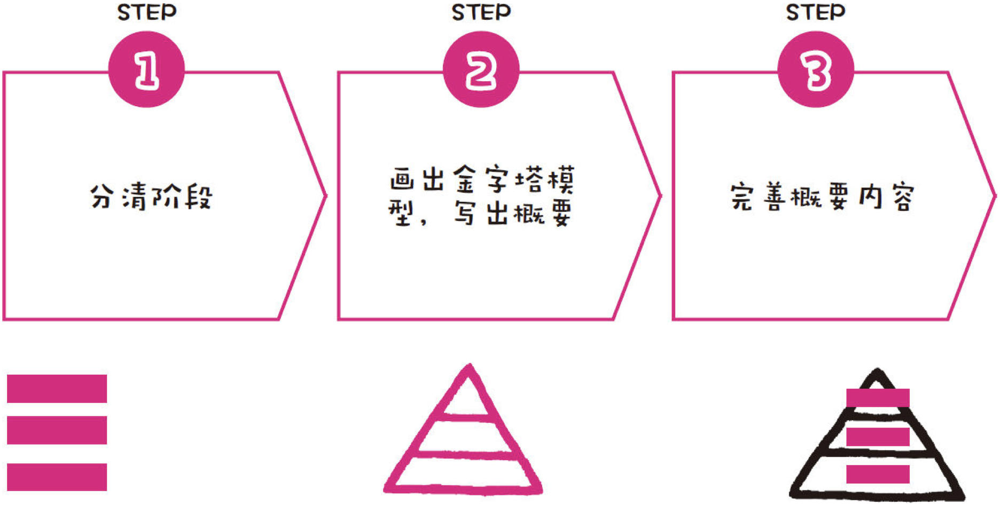

#### 要点

* 把重要的概念写在上层
* 先画出大致的框架
* 细节内容之后在进行调整

