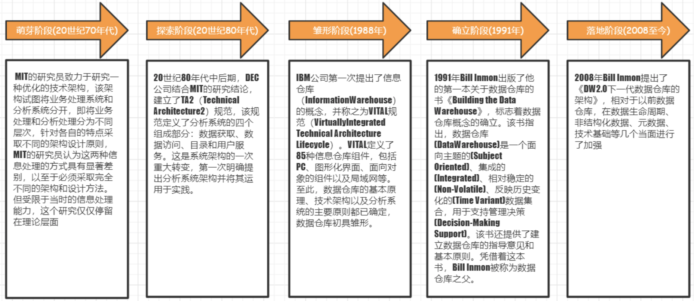
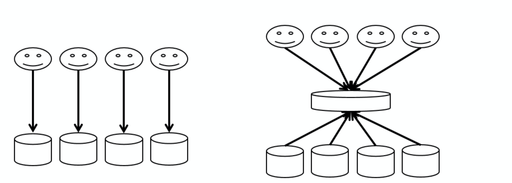
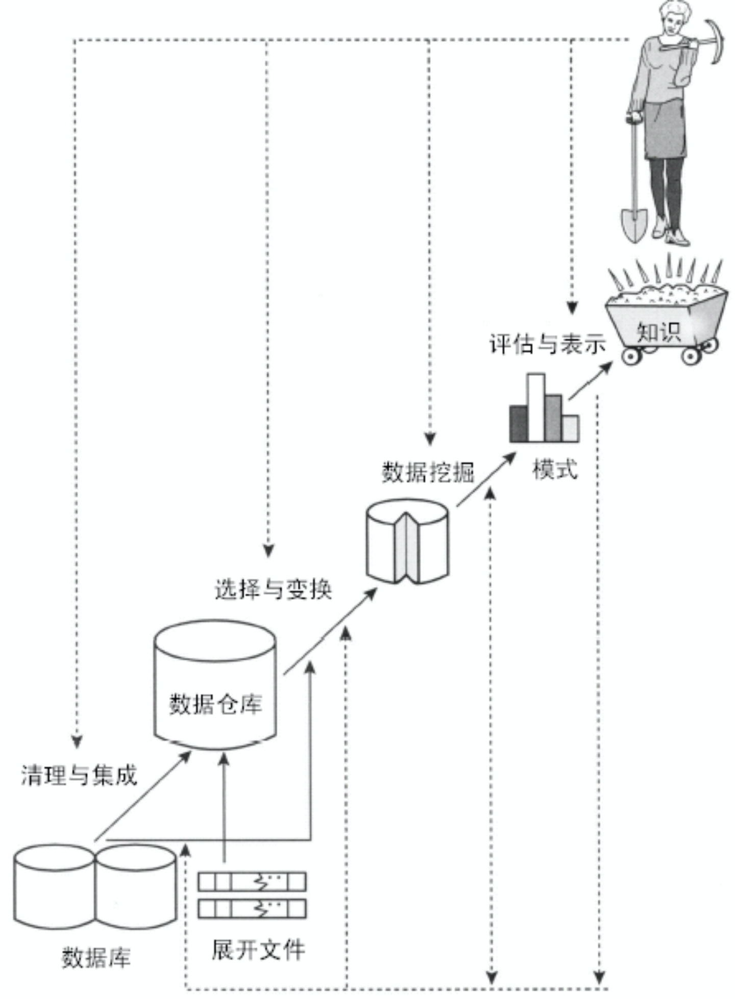
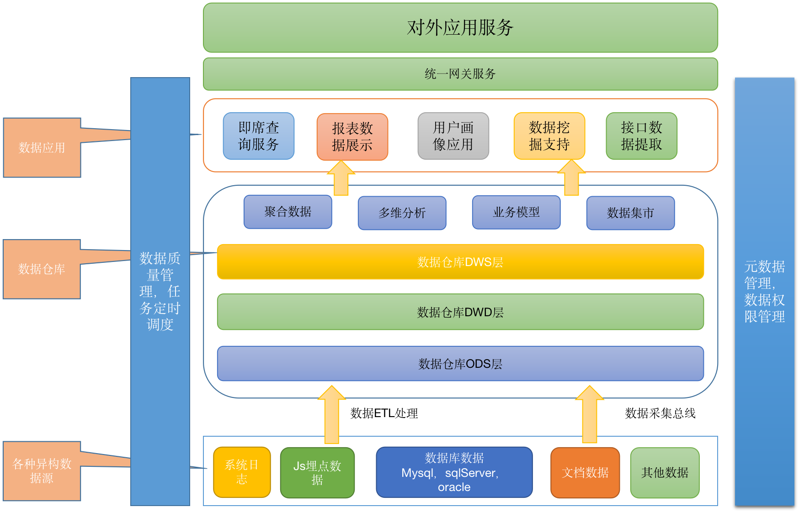

# 数据仓库的基本概念

## 什么是数据仓库

W.H.Inmon在《 Building the Data Warehouse 》一书中，对数据仓库的定义为：

数据仓库是一个

**面向主题**的

**集成**的

**非易失**的

**随时间变化**的

用来**支持管理人员决策**的数据集合。

### 面向主题

​	操作型数据库的数据组织面向事务处理任务，各个业务系统之间各自分离，而数据仓库中的数据是按照一定的主题域进行组织。

​	主题是一个抽象的概念，是数据归类的标准，是指用户使用数据仓库进行决策时所关心的重点方面，一个主题通常与多个操作型信息系统相关。每一个主题基本对应一个宏观的分析领域。

​	例如，银行的数据仓库的主题：客户

​	客户数据来源：从银行储蓄数据库、信用卡数据库、贷款数据库等几个数据库中抽取的数据整理而成。这些客户信息有可能是一致的，也可能是不一致的，这些信息需要统一整合才能完整体现客户。

### 集成

面向事务处理的操作型数据库通常与某些特定的应用相关，数据库之间相互独立，并且往往是异构的。

而数据仓库中的数据是在对原有分散的数据库数据抽取、清理的基础上经过系统加工、汇总和整理得到的，必须消除源数据中的不一致性，以保证数据仓库内的信息是关于整个企业的一致的全局信息。

  具体如下：

  1：数据进入数据仓库后、使用之前，必须经过加工与集成。

  2：对不同的数据来源进行统一数据结构和编码。统一原始数据中的所有矛盾之处，如字段的同名异义，异名同义，单位不统一，字长不一致等。

  3：将原始数据结构做一个从面向应用到面向主题的大转变。

### 非易失即相对稳定的

操作型数据库中的数据通常实时更新，数据根据需要及时发生变化。

数据仓库的数据主要供企业决策分析之用，所涉及的数据操作主要是数据查询，一旦某个数据进入数据仓库以后，一般情况下将被长期保留，也就是数据仓库中一般有大量的查询操作，但修改和删除操作很少，通常只需要定期的加载、刷新。

数据仓库中包括了大量的历史数据。

数据经集成进入数据仓库后是极少或根本不更新的。

### 随时间变化即反映历史变化

操作型数据库主要关心当前某一个时间段内的数据，而数据仓库中的数据通常包含历史信息，系统记录了企业从过去某一时点(如开始应用数据仓库的时点)到目前的各个阶段的信息，通过这些信息，可以对企业的发展历程和未来趋势做出定量分析和预测。

企业数据仓库的建设，是以现有企业业务系统和大量业务数据的积累为基础。数据仓库不是静态的概念，只有把信息及时交给需要这些信息的使用者，供他们做出改善其业务经营的决策，信息才能发挥作用，信息才有意义。

而把信息加以整理归纳和重组，并及时提供给相应的管理决策人员，是数据仓库的根本任务。因此，从产业界的角度看，数据仓库建设是一个工程，是一个过程

数据仓库内的数据时限一般在５-１０年以上，甚至永不删除，这些数据的键码都包含时间项，标明数据的历史时期，方便做时间趋势分析。

## 数据仓库的演进

## 数据库与数据仓库的对比

|                  | 数据库                         | 数据仓库                               |
| ---------------- | ------------------------------ | -------------------------------------- |
| 数据内容         | 当前值                         | 历史的、存档的、归纳的、计算的数据     |
| 数据目标         | 面向业务操作程序, 重复处理     | 面向主题域，分析应用，支持决策         |
| 数据特性         | 动态变化，按字段更新           | 静态、不能直接更新，只能定时添加、刷新 |
| 数据结构         | 高度结构化、复杂，适合操作计算 | 简单，适合分析                         |
| 使用频率         | 高                             | 中到低                                 |
| 数据访问量       | 每个事务只访问少量记录         | 有的事务可能需要访问大量记录           |
| 对响应时间的要求 | 以秒为单位计算                 | 以秒、分钟、甚至小时为计算单位         |

## 数据仓库的主要作用

### 支持数据提取

数据提取可以支撑来自企业各业务部门的数据需求。

由之前的不同业务部门给不同业务系统提需求，转变为不同业务系统统一给数据仓库提需求

### 支持报表系统

基于企业的数据仓库，向上支撑企业的各部门的统计报表需求，辅助支撑企业日常运营决策。

### 支持数据分析（BI）

BI（商业智能）是一种解决方案：

从许多来自不同的企业业务系统的数据中提取出有用的数据并进行清理，以保证数据的正确性，然后经过抽取、转换和装载,即ETL过程，合并到一个企业级的数据仓库里，从而得到企业数据的一个全局视图；

在此基础上利用合适的查询和分析工具、数据挖掘工具、OLAP工具等对其进行分析和处理（这时信息变为辅助决策的知识）；

最后将知识呈现给管理者，为管理者的决策过程提供支持 。  

### 支持数据挖掘

数据挖掘也称为数据库知识发现（Knowledge Discovery in Databases, KDD），就是将高级智能计算技术应用于大量数据中，让计算机在有人或无人指导的情况下从海量数据中发现潜在的，有用的模式（也叫知识）。

Jiawei Han在《数据挖掘概念与技术》一书中对数据挖掘的定义：数据挖掘是从大量数据中挖掘有趣模式和知识的过程，数据源包括数据库、数据仓库、Web、其他信息存储库或动态地流入系统的数据。

### 支持数据应用

电信基于位置数据的旅游客流分析及人群画像

电信基于位置数据的人流监控和预警

银行基于用户交易数据的金融画像应用

电商根据用户浏览和购买行为的用户标签体系及推荐系统

征信机构根据用户信用记录的信用评估

## 数据仓库的架构设计

数据仓库经过多年的发展，其技术已经架构基本上都已经非常成熟稳定，不管是数仓的整体架构，还是各种技术选型方案，在业界基本上都已经非常稳定了，如下架构就是一个稳定的数据仓库的架构设计方案。

