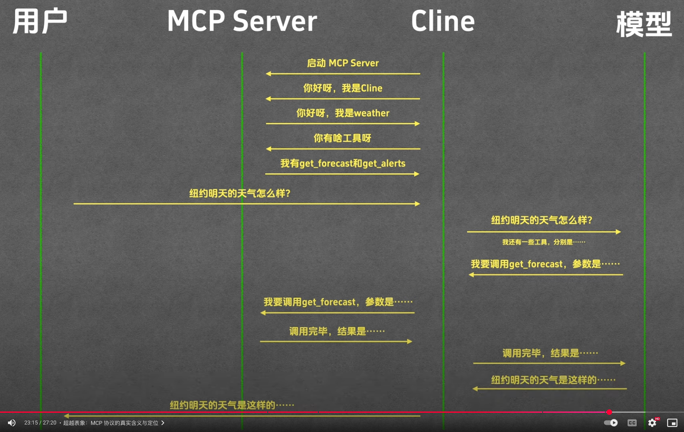
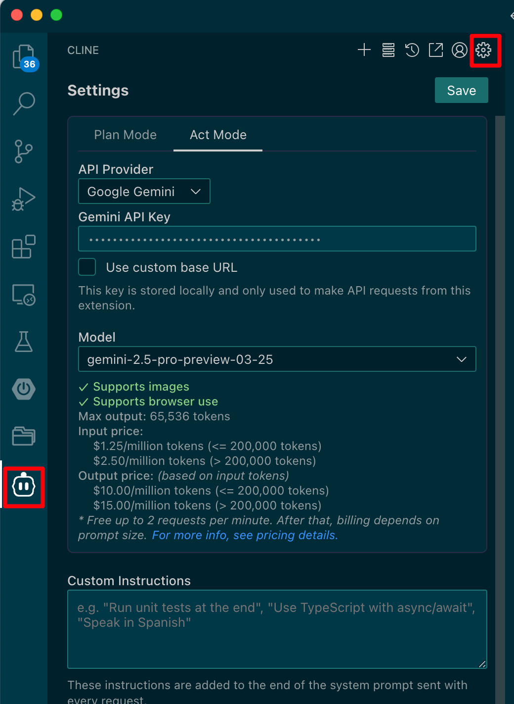
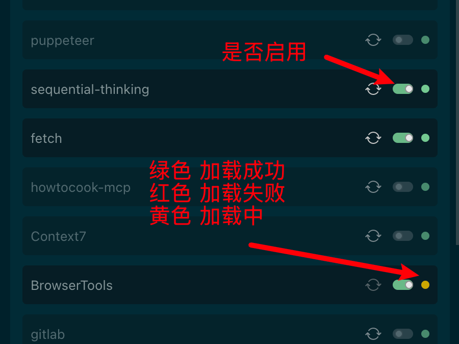

# Model Context Protocol(模型上下文协议)

让大模型有了使用外部工具的能力

https://mcp.so
https://github.com/modelcontextprotocol/servers
## MCP Host

* Claude Desktop
* Cursor
* Cline
* Cherry Studio

## MCP Server

跟我们传统 Server 没有太大关系，是一个程序，符合MCP协议

* python
  * 启动程序 uvx
  * uv tool run ruff
  * uv 是 python 的一个报管理工具
* node 
  * 启动程序 npx, 内置在 node 中




## Cline 

在 VS Code 插件市场安装 Cline 插件





聊天测试 Cline 配置

## MCP 推荐

* sequential-thinking :  多步骤的分析推理
* filesystem
* markdown 
* MCP Toolbox for Databases
* MCP Toolbox

## 实战
安装 fetch


把 Downloads 文件夹中的 一本书读懂大模型.epub 转换成 markdown, 并保存到 downloads 目录中

### Install Markitdown

```bash
pip install markitdown-mcp
```

### MCP Toolbox for Databases

```bash
go install github.com/googleapis/genai-toolbox@v0.5.0
```


