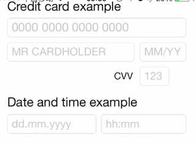
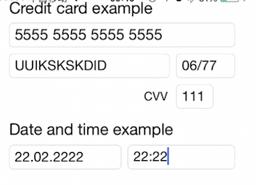
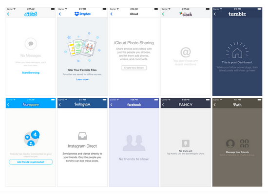
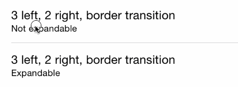
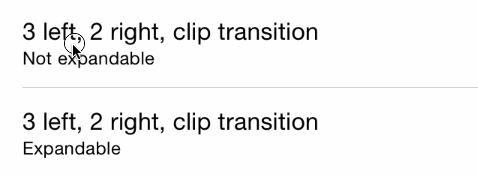
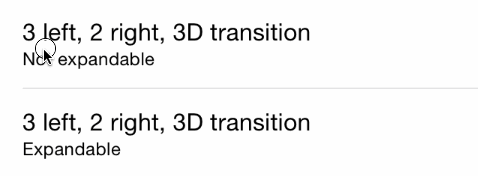
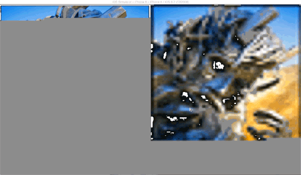

#Message Alert
---
###[TSMessages](https://github.com/KrauseFx/TSMessages)
>This library provides an easy to use class to show little notification views on the top of the screen

>

>

-

#UITextField
----
###[TextFieldEffects](https://github.com/raulriera/TextFieldEffects)
>*你不觉得标准的UITextField有些枯燥么？我也这样想——来认识一下TextFieldEffects吧！废话不多说，只要看几个例子*

>

>

>

-

###[WTReTextField](https://github.com/warriorg/WTReTextField)

>*RegEx input validation and formatting as you type*

>

>

-

###[JVFloatLabeledTextField](https://github.com/jverdi/JVFloatLabeledTextField)
>*JVFloatLabeledTextField is the first implementation a UX pattern that has come to be known the "Float Label Pattern".*

>

-

###[DemoInPutPasswordView](https://github.com/lqcjdx/DemoInPutPasswordView)

>*仿微信支付密码输入框*

>

-

#UITableView
---
###[DZNEmptyDataSet](https://github.com/dzenbot/DZNEmptyDataSet)
>*DZNEmptyDataSet算是一个很标准的iOS内建方式，适合用来处理空的table view和collection view。默认情况下，如果你的table view为空，屏幕就为空，这样一来用户体验并不理想。*

-

###[RETableViewManager](https://github.com/romaonthego/RETableViewManager)
>*可以帮助你进行动态创建与管理table views。它给我们提供了预定义cells（bool类型、文本、日期等等——请看下面的截图），但是你还可以创建自定义views，并与默认视图一同使用。*

-

##UITableViewCell
-
###[MGSwipeTableCell](https://github.com/MortimerGoro/MGSwipeTableCell)
>*这是另一个常见于很多应用中的UI组件，苹果应该考虑在标准的iOS SDK中加入一些类似的内容。Swipeable表格cell是这个pod的最佳描述，也是最好的。*

>

>

>

-
###[UIView-FDCollapsibleConstraints](https://github.com/forkingdog/UIView-FDCollapsibleConstraints)
>*Builds to collapse a view and its relevant layout constraints, simulating a "Flow Layout" mode*
>

>

-

#Image
----
###[Concorde](https://github.com/contentful-labs/Concorde) `Swift`

>你在应用中载入了一堆jpeg吗？有了Concorde，你可以用更好的方式来解决，这是一个很大的进步。
>

-

###[ETFoursquareImages](https://github.com/EugeneTrapeznikov/ETFoursquareImages)
>When you scroll, image's shown area will become bigger. Like it appears on places' page in Foursquare app.
>

-

#Calendar
---
###[PDTSimpleCalendar](https://github.com/jivesoftware/PDTSimpleCalendar)
 >*PDTSimpleCalendar也许可以算是iOS最棒的日历组件了。你可以在各个方面对它进行定制，无论是运行逻辑还是外观方面。*
>

-

#Font
---
###[FontAwesomeKit](https://github.com/PrideChung/FontAwesomeKit)
>*有了它你可以很容易地给项目加字体，使用方式繁多。*

-

#Animation
---
###[JxbLovelyLogin](https://github.com/warriorg/JxbLovelyLogin)

>*一个可爱的登陆界面，动画效果仿自国外网站readme.io*

>

-

#Button
---
###[RadioButton](https://github.com/onegray/RadioButton-ios)`Objective-c`
##### CocoaPods

	pod 'RadioButton'
	
>*Pretty simple class that extends standard UIButton functionality. Default and selected states can be configured for every button.*

>

>

Alternatively group the buttons using single line of code:

	radio1.groupButtons = @[radio1, radio2, radio3];

Select any button, and all other button in the same group become deselected automatically:

	radio2.selected = YES; // radio1 and radio3 become deselected

Any button from the group knows which one is selected:

	RadioButton* r1 = radio1.selectedButton;
	RadioButton* r2 = radio2.selectedButton;
	RadioButton* r3 = radio3.selectedButton;
	NSAssert (r1==r2 && r2==r3, @"Must be equal");

And a helpful method to select button by tag:

	[radio1 setSelectedWithTag:kTagRadio3];

