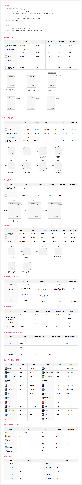

##Sizes of iPhone UI Elements

Some Height

Item | Normal Height | iPhone X Height
---|---|----
UINavigationBar|	64	| 88 (96 large title)
UIStatusBar	| 20 | 44
UITabBar |	49	| 83

1080 标注 转  
>1242/1080 = 1.15  
>750/1080 = 0.69

Element | iPhone 4S (and earlier) | iPhone 5 | iPhone 6 | iPhone 6 Plus
--------|-------------------------|----------|----------|---------------
Window (including status bar area)| 320 x 480 pts | 320 x 568 pts | 375 x 667 pts | 414 x 736 pts
iOS8 Portrait Keyboard (English) with QuickType | 320 x 253 pts | 320 x 253 pts | 375 x 258 pts | 414 x 271 pts
iOS8 Portrait Keyboard (English) without QuickType | 320 x 224 pts | 320 x 224 pts | 375 x 225 pts | 414 x 236 pts
iOS8 Landscape Keyboard (English) with QuickType | 480 x 193 pts | 568 x 193 pts | 667 x 194 pts | 736 x 194 pts
iOS8 Landscape Keyboard (English) | without QuickType | 480 x 170 pts | 568 x 170 pts | 667 x 171 pts | 736 x 171 pts
Launch Image Sizes | 640 x 960 pixels | 640 x 1136 pixels | 750 x 1334 (@2x) portrait  1334 x 750 (@2x) landscape | 1242 x 2208 (@3x) portrait  2208 x 1242 (@3x) landscape

###Other dimensions common to all screen sizes:
Status bar | 20 pts
--- | ---
Navigation Bar | 44 pts
Nav Bar/Toolbar Icon | white icon - up to 20 x 20 pts (transparent PNG)
Tab Bar | 49 pts
Tab Bar Iconm | up to 30 x 30 pts (transparent PNGs)
Text Field | 31 pts

###最新Android & IOS设计尺寸规范

I
