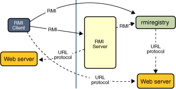

## RMI

Java RMI 指的是远程方法调用 (Remote Method Invocation)。它是一种机制，能够让在某个 Java 虚拟机上的对象调用另一个 Java 虚拟机中的对象上的方法。



### 示例

#### interface

```java
package me.warriorg.rmi.remote;

import java.rmi.Remote;
import java.rmi.RemoteException;

/**
 * @author warrior
 */
public interface Hello extends Remote {
    /***
     *
     * @return
     */
    String sayHello() throws RemoteException;
}

```

#### server

```java
package me.warriorg.rmi.server;

import me.warriorg.rmi.remote.Hello;

import java.rmi.RemoteException;
import java.rmi.registry.LocateRegistry;
import java.rmi.registry.Registry;
import java.rmi.server.UnicastRemoteObject;

/**
 * @author warrior
 */
public class Server implements Hello {

    public static void main(String args[]) {

        try {
            Server obj = new Server();
            Hello stub = (Hello) UnicastRemoteObject.exportObject(obj, 0);

            // Bind the remote object's stub in the registry
            Registry registry = LocateRegistry.createRegistry(8888);
            registry.bind("Hello", stub);

            System.err.println("Server ready");
        } catch (Exception e) {
            System.err.println("Server exception: " + e.toString());
            e.printStackTrace();
        }
    }

    @Override
    public String sayHello() throws RemoteException {
        return "Hello, world!";
    }
}
```

#### client

```java
package me.warriorg.rmi.client;

import me.warriorg.rmi.remote.Hello;

import java.rmi.registry.LocateRegistry;
import java.rmi.registry.Registry;

/**
 * @author warrior
 */
public class Client {
    public static void main(String[] args) {

        String host = "localhost";
        int port = 8888;
        try {
            Registry registry = LocateRegistry.getRegistry(host, port);
            Hello stub = (Hello) registry.lookup("Hello");
            String response = stub.sayHello();
            System.out.println("response: " + response);
        } catch (Exception e) {
            System.err.println("Client exception: " + e.toString());
            e.printStackTrace();
        }
    }
}
```

### 参考

https://docs.oracle.com/javase/tutorial/rmi/overview.html