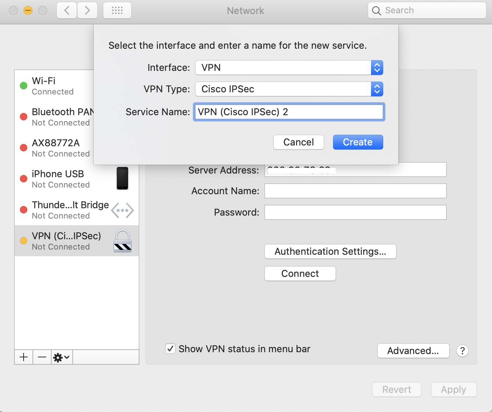
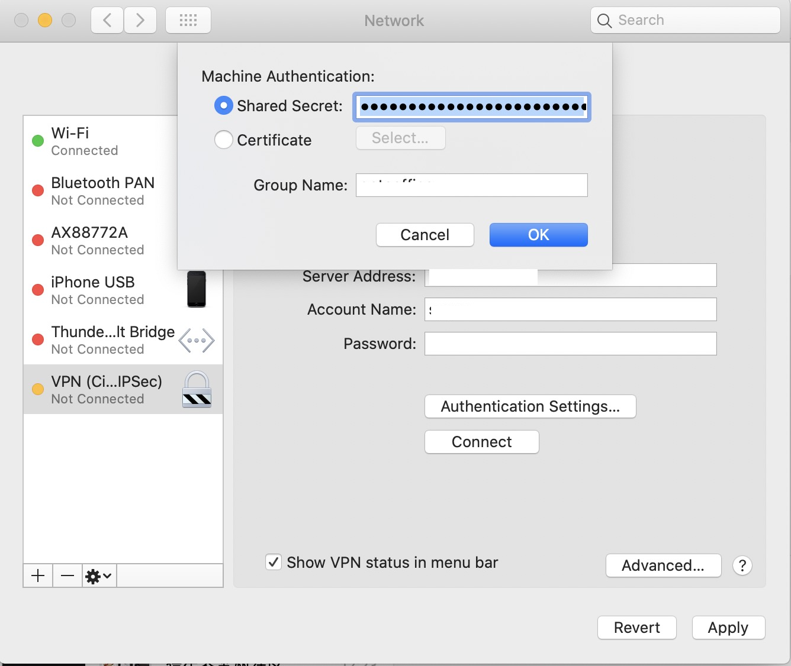
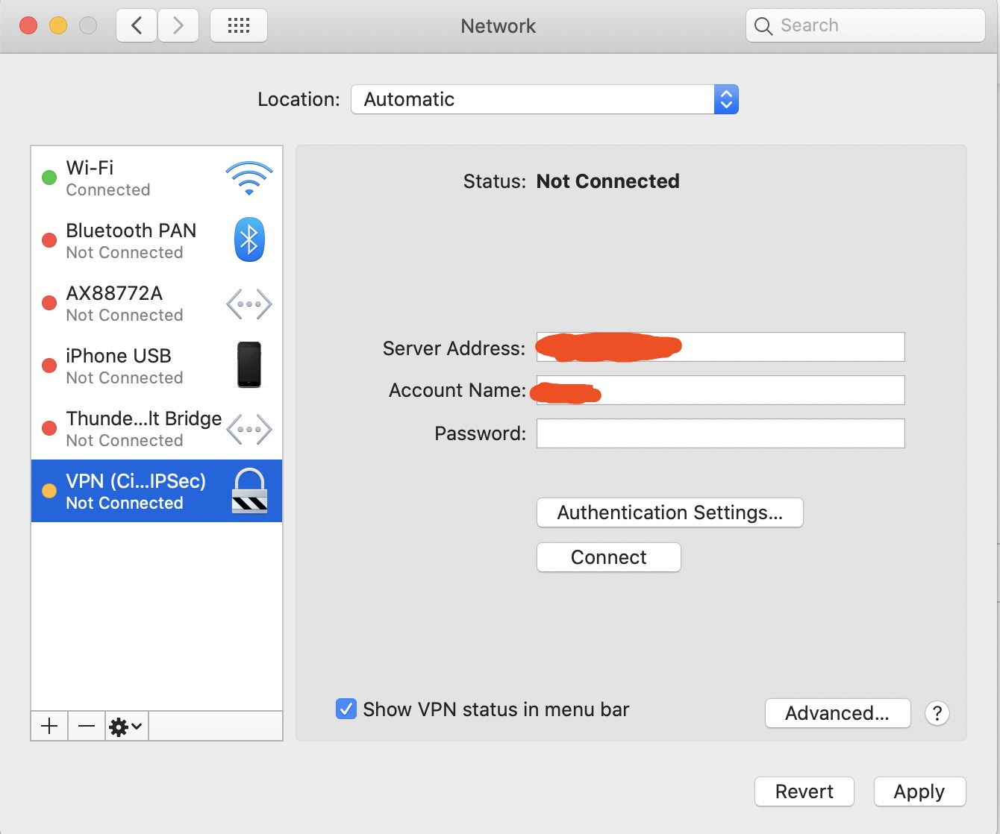

## macos 连接Cisco vpn

新年开始，公司启动远程办公，需要远程vpn到公司, 使用 AnyConnect, [下载地址](https://www.cisco.com/c/en/us/support/security/anyconnect-secure-mobility-client/tsd-products-support-series-home.html)，macos 使用的时候，有很多的问题，最后使用如下的方案解决

1. 打开Network，创建一个VPN连接

   

   点击create创建

2. 点击Authentication Settings 设置组别信息

   

   点击OK完成

3. 点击connect，建立连接

   

之后就可以开始享受远程工作的乐趣了。

### 参考

https://andersbrownworth.com/guides/native-cisco-vpn-on-mac-os-x/